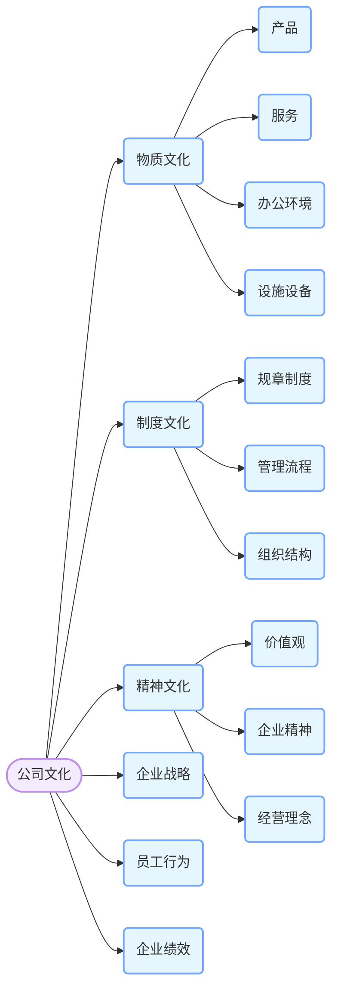

# 彼得林奇对公司文化的重视

> 关键词：彼得林奇、公司文化、投资理念、企业发展、文化价值、投资决策、文化评估

> 摘要：本文深入探讨了彼得林奇这位投资大师对公司文化的重视。从背景介绍入手，阐述了研究目的、预期读者等内容。接着详细剖析公司文化的核心概念及其与企业各方面的联系，通过数学模型等方式分析公司文化的价值。介绍了评估公司文化的算法原理和操作步骤，结合实际案例展示如何在投资中运用对公司文化的考量。还列举了公司文化的实际应用场景，推荐了相关的学习资源、开发工具等。最后总结未来发展趋势与挑战，解答常见问题并提供扩展阅读和参考资料，旨在让读者全面理解彼得林奇重视公司文化这一理念及其在投资和企业发展中的重要意义。

## 1. 背景介绍 
### 1.1 目的和范围
本文章的主要目的是深入探究彼得林奇对公司文化的重视这一主题。彼得林奇作为投资界的传奇人物，他的投资理念和方法对全球投资者产生了深远的影响。公司文化虽然是一个较为抽象的概念，但在彼得林奇的投资决策中占据着重要地位。通过研究他对公司文化的重视，我们可以更好地理解其投资策略的全貌，同时也能为企业管理者和投资者提供有价值的参考。
本文的范围涵盖了彼得林奇关于公司文化的观点阐述、公司文化的核心概念、评估公司文化的方法、公司文化在投资和企业发展中的实际应用等方面。

### 1.2 预期读者
本文预期读者主要包括以下几类人群：
- **投资者**：无论是专业投资者还是个人投资者，都可以从彼得林奇对公司文化的重视中获取新的投资思路和决策依据，帮助他们在投资过程中更好地评估企业的价值。
- **企业管理者**：了解彼得林奇对公司文化的看法，有助于企业管理者认识到公司文化在企业发展中的重要性，从而更好地塑造和培育优秀的公司文化，提升企业的竞争力。
- **金融和管理专业的学生**：对于正在学习金融投资和企业管理相关专业的学生来说，本文可以作为一个生动的案例，帮助他们将理论知识与实际案例相结合，加深对相关概念的理解。
- **对投资和企业管理感兴趣的人士**：那些对金融投资和企业管理领域有浓厚兴趣的普通读者，也可以通过本文了解到投资大师的独特视角和公司文化的重要意义。

### 1.3 文档结构概述
本文将按照以下结构进行阐述：
- 核心概念与联系：介绍公司文化的核心概念，分析公司文化与企业战略、员工行为、企业绩效等方面的联系，并通过文本示意图和 Mermaid 流程图进行直观展示。
- 核心算法原理 & 具体操作步骤：探讨评估公司文化的算法原理，使用 Python 源代码详细阐述操作步骤。
- 数学模型和公式 & 详细讲解 & 举例说明：运用数学模型和公式对公司文化的价值进行量化分析，并通过具体例子进行说明。
- 项目实战：代码实际案例和详细解释说明：通过实际案例展示如何在投资和企业管理中运用对公司文化的考量，包括开发环境搭建、源代码实现和代码解读。
- 实际应用场景：列举公司文化在不同场景下的实际应用，如投资决策、企业并购、员工激励等。
- 工具和资源推荐：推荐与公司文化相关的学习资源、开发工具、框架和库，以及相关的论文著作。
- 总结：未来发展趋势与挑战：总结彼得林奇对公司文化重视的要点，分析公司文化在未来的发展趋势和面临的挑战。
- 附录：常见问题与解答：解答读者在阅读过程中可能遇到的常见问题。
- 扩展阅读 & 参考资料：提供相关的扩展阅读材料和参考资料，方便读者进一步深入研究。

### 1.4 术语表
#### 1.4.1 核心术语定义
- **彼得林奇（Peter Lynch）**：美国著名的投资家，曾任富达公司麦哲伦基金的基金经理，在其管理期间，麦哲伦基金资产规模增长了 29 倍，创造了年化收益率 29% 的惊人业绩，他的投资理念和方法对全球投资界产生了深远影响。
- **公司文化（Corporate Culture）**：是指企业在长期的生产经营过程中形成的，为全体员工所认同并遵守的价值观念、行为准则、企业精神等的总和。它是企业的灵魂和精神支柱，对企业的发展起着至关重要的作用。
- **投资决策（Investment Decision）**：是指投资者为了实现其预期的投资目标，运用一定的科学理论、方法和手段，通过一定的程序对投资的必要性、投资目标、投资规模、投资方向、投资结构、投资成本与收益等经济活动中重大问题所进行的分析、判断和方案选择。
- **企业绩效（Corporate Performance）**：是指企业在一定时期内利用其有限资源从事经营活动所取得的成果，通常可以用财务指标（如净利润、营业收入等）和非财务指标（如市场份额、客户满意度等）来衡量。

#### 1.4.2 相关概念解释
- **价值观念**：是公司文化的核心，它决定了企业的经营方向和员工的行为准则。例如，一家以创新为核心价值观的企业，会鼓励员工不断尝试新的想法和方法，勇于突破传统。
- **企业精神**：是企业在长期的生产经营过程中形成的一种精神风貌和优良传统，它体现了企业的个性和特色。例如，华为的“狼性精神”，强调团队合作、拼搏进取和敏锐的市场洞察力。
- **行为准则**：是企业为员工制定的行为规范和标准，它指导员工在工作中的行为方式。例如，企业可能规定员工要遵守职业道德、保守商业秘密等。

#### 1.4.3 缩略词列表
- **ROE（Return on Equity）**：净资产收益率，是衡量企业盈利能力的重要指标，计算公式为 $ROE=\frac{净利润}{净资产}\times100\%$。
- **EPS（Earnings Per Share）**：每股收益，是指普通股股东每持有一股所能享有的企业净利润或需承担的企业净亏损，计算公式为 $EPS=\frac{净利润}{发行在外普通股股数}$。

## 2. 核心概念与联系 
### 2.1 公司文化的核心概念
公司文化是一个复杂的概念，它包含了多个层面的内容。从本质上来说，公司文化是企业的价值观、信仰、仪式、符号和实践的总和，它影响着企业内部的每一个决策和行动。

公司文化可以分为三个层次：
- **物质文化**：是公司文化的最外层，包括企业的产品、服务、办公环境、设施设备等。物质文化是公司文化的外在表现，它可以直观地反映企业的形象和实力。例如，苹果公司的产品以其简洁、时尚的设计和高品质的性能而闻名，这就是苹果公司物质文化的体现。
- **制度文化**：是公司文化的中间层，包括企业的规章制度、管理流程、组织结构等。制度文化是企业正常运转的保障，它规范了员工的行为和企业的运营方式。例如，华为公司建立了一套严格的绩效考核制度，激励员工努力工作，提高工作效率。
- **精神文化**：是公司文化的核心层，包括企业的价值观、企业精神、经营理念等。精神文化是企业的灵魂和精神支柱，它决定了企业的发展方向和员工的行为准则。例如，阿里巴巴的“让天下没有难做的生意”的使命和“客户第一、员工第二、股东第三”的价值观，就是阿里巴巴公司精神文化的体现。

### 2.2 公司文化与企业各方面的联系
#### 2.2.1 公司文化与企业战略
公司文化与企业战略是相互影响、相互促进的关系。一方面，公司文化为企业战略的制定提供了价值导向和精神支持。企业在制定战略时，需要考虑自身的文化特点和价值观，确保战略与文化相匹配。例如，一家以创新为核心价值观的企业，在制定战略时可能会更加注重研发投入和新产品的开发。另一方面，企业战略的实施也会影响公司文化的发展。当企业实施新的战略时，可能需要对公司文化进行相应的调整和变革，以适应战略的需要。例如，企业进行国际化战略时，可能需要培养员工的跨文化交流能力和全球视野，从而推动公司文化的国际化发展。

#### 2.2.2 公司文化与员工行为
公司文化对员工的行为有着深远的影响。良好的公司文化可以激励员工积极工作，提高工作效率和工作质量。例如，一家具有团队合作精神的企业，员工之间会相互协作、相互支持，共同完成工作任务。相反，不良的公司文化可能会导致员工士气低落、工作效率低下。例如，一家等级森严、缺乏沟通的企业，员工可能会感到压抑和不满，从而影响工作积极性。

#### 2.2.3 公司文化与企业绩效
公司文化与企业绩效之间存在着密切的联系。研究表明，具有优秀公司文化的企业往往能够取得更好的绩效。优秀的公司文化可以提高员工的满意度和忠诚度，减少员工流失率，从而降低企业的人力资源成本。同时，优秀的公司文化还可以增强企业的创新能力和竞争力，提高企业的市场份额和盈利能力。例如，谷歌公司以其开放、创新的公司文化吸引了大量优秀的人才，推动了公司的快速发展，取得了显著的业绩。

### 2.3 文本示意图
```plaintext
公司文化
|-- 物质文化
|   |-- 产品
|   |-- 服务
|   |-- 办公环境
|   |-- 设施设备
|-- 制度文化
|   |-- 规章制度
|   |-- 管理流程
|   |-- 组织结构
|-- 精神文化
|   |-- 价值观
|   |-- 企业精神
|   |-- 经营理念

公司文化与其他方面的联系
|-- 企业战略
|-- 员工行为
|-- 企业绩效
```

### 2.4 Mermaid 流程图


## 3. 核心算法原理 & 具体操作步骤 
### 3.1 评估公司文化的算法原理
评估公司文化是一个复杂的过程，需要综合考虑多个因素。一种常用的方法是通过问卷调查和数据分析来评估公司文化。具体来说，可以设计一份包含多个问题的问卷，涵盖公司文化的各个方面，如价值观、团队合作、创新氛围等。然后让员工填写问卷，收集数据。最后，通过对数据的分析，得出公司文化的评估结果。

以下是一个简单的评估公司文化的算法思路：
1. **确定评估指标**：根据公司文化的核心概念，确定评估公司文化的指标，如价值观认同度、员工满意度、团队合作水平等。
2. **设计问卷**：根据评估指标，设计一份包含多个问题的问卷，每个问题对应一个评估指标。
3. **收集数据**：让员工填写问卷，收集数据。
4. **数据预处理**：对收集到的数据进行预处理，如去除无效数据、缺失值处理等。
5. **数据分析**：使用统计分析方法，如均值、标准差、相关分析等，对数据进行分析，得出每个评估指标的得分。
6. **综合评估**：根据每个评估指标的得分，计算公司文化的综合得分。

### 3.2 Python 源代码实现
```python
import pandas as pd
import numpy as np

# 模拟问卷数据
data = {
    '价值观认同度': [4, 3, 5, 4, 3],
    '员工满意度': [3, 4, 4, 3, 5],
    '团队合作水平': [5, 4, 3, 5, 4]
}

# 创建 DataFrame
df = pd.DataFrame(data)

# 数据预处理：去除缺失值
df = df.dropna()

# 计算每个评估指标的均值
means = df.mean()

# 计算综合得分
weights = [0.3, 0.3, 0.4]  # 假设各指标权重
scores = np.dot(means, weights)

print("各评估指标的均值：")
print(means)
print("公司文化的综合得分：", scores)
```

### 3.3 具体操作步骤
1. **确定评估指标**：根据公司的实际情况和研究目的，确定评估公司文化的具体指标。例如，可以从价值观、员工关系、创新能力等方面进行考虑。
2. **设计问卷**：根据评估指标，设计一份详细的问卷。问卷中的问题应该具有明确的指向性，能够准确反映评估指标的内容。例如，对于“价值观认同度”这一指标，可以设计问题“你是否认同公司的核心价值观？”，并提供多个选项供员工选择。
3. **发放问卷**：将设计好的问卷发放给公司的员工，确保员工能够认真填写。可以采用线上或线下的方式发放问卷，如通过电子邮件、在线调查平台或纸质问卷等。
4. **收集数据**：在规定的时间内收集员工填写的问卷，将数据整理成电子表格形式，如 Excel 文件。
5. **数据预处理**：使用 Python 或其他数据分析工具对收集到的数据进行预处理。主要包括去除无效数据、处理缺失值等操作。例如，如果某个员工的问卷回答不完整，可以将该员工的数据删除。
6. **数据分析**：使用统计分析方法对预处理后的数据进行分析。计算每个评估指标的得分，如均值、中位数等。可以使用 Python 的 `pandas` 和 `numpy` 库进行数据分析。
7. **综合评估**：根据每个评估指标的得分，结合预先设定的权重，计算公司文化的综合得分。权重的设定可以根据评估指标的重要性进行调整。
8. **结果解读**：根据综合得分和各评估指标的得分，对公司文化进行评估和解读。分析公司文化的优势和不足，提出改进建议。

## 4. 数学模型和公式 & 详细讲解 & 举例说明 
### 4.1 数学模型
我们可以使用线性加权模型来评估公司文化的综合得分。假设我们有 $n$ 个评估指标，每个评估指标的得分分别为 $x_1, x_2, \cdots, x_n$，对应的权重分别为 $w_1, w_2, \cdots, w_n$，且 $\sum_{i=1}^{n}w_i = 1$。则公司文化的综合得分 $S$ 可以表示为：

$$S = \sum_{i=1}^{n}w_ix_i$$

### 4.2 详细讲解
- **评估指标得分 $x_i$**：每个评估指标的得分是通过对问卷数据进行分析得到的。例如，对于“价值观认同度”这一指标，可以将员工对相关问题的回答进行量化，然后计算平均值作为该指标的得分。
- **权重 $w_i$**：权重反映了每个评估指标在综合评估中的重要性。权重的设定需要根据公司的实际情况和研究目的进行调整。例如，如果公司非常重视创新能力，那么“创新氛围”这一评估指标的权重可以设置得高一些。
- **综合得分 $S$**：综合得分是通过将每个评估指标的得分乘以其对应的权重，然后求和得到的。综合得分越高，说明公司文化越好。

### 4.3 举例说明
假设我们使用三个评估指标来评估公司文化：价值观认同度、员工满意度和团队合作水平，对应的权重分别为 0.3、0.3 和 0.4。通过问卷调查和数据分析，得到这三个评估指标的得分分别为 4、3 和 5。则公司文化的综合得分 $S$ 为：

$$S = 0.3\times4 + 0.3\times3 + 0.4\times5$$
$$S = 1.2 + 0.9 + 2$$
$$S = 4.1$$

这表明该公司的文化综合水平较高，但可以进一步分析每个评估指标的得分情况，找出公司文化的优势和不足。例如，“员工满意度”得分相对较低，可能需要关注员工的需求和福利，提高员工的满意度。

## 5. 项目实战：代码实际案例和详细解释说明 
### 5.1  开发环境搭建
为了实现对公司文化的评估，我们可以使用 Python 作为开发语言，并使用一些常用的数据分析库，如 `pandas`、`numpy` 和 `matplotlib`。以下是搭建开发环境的具体步骤：
1. **安装 Python**：从 Python 官方网站（https://www.python.org/downloads/）下载并安装 Python 3.x 版本。
2. **安装数据分析库**：打开命令行工具，使用 `pip` 命令安装所需的库。

```bash
pip install pandas numpy matplotlib
```

### 5.2  源代码详细实现和代码解读
```python
import pandas as pd
import numpy as np
import matplotlib.pyplot as plt

# 模拟问卷数据
data = {
    '价值观认同度': [4, 3, 5, 4, 3, 4, 5, 3, 4, 5],
    '员工满意度': [3, 4, 4, 3, 5, 3, 4, 4, 3, 5],
    '团队合作水平': [5, 4, 3, 5, 4, 5, 3, 4, 5, 4],
    '创新氛围': [4, 3, 4, 5, 3, 4, 5, 3, 4, 5]
}

# 创建 DataFrame
df = pd.DataFrame(data)

# 数据预处理：去除缺失值
df = df.dropna()

# 计算每个评估指标的均值
means = df.mean()

# 各评估指标的权重
weights = [0.2, 0.2, 0.3, 0.3]

# 计算综合得分
scores = np.dot(means, weights)

# 绘制各评估指标得分柱状图
plt.bar(means.index, means.values)
plt.xlabel('评估指标')
plt.ylabel('得分')
plt.title('各评估指标得分')
plt.show()

print("各评估指标的均值：")
print(means)
print("公司文化的综合得分：", scores)
```

### 5.3  代码解读与分析
1. **数据模拟**：使用字典 `data` 模拟问卷数据，包含四个评估指标：价值观认同度、员工满意度、团队合作水平和创新氛围。
2. **创建 DataFrame**：使用 `pandas` 库的 `DataFrame` 函数将模拟数据转换为数据框，方便后续的数据处理和分析。
3. **数据预处理**：使用 `dropna` 方法去除数据框中的缺失值，确保数据的完整性。
4. **计算均值**：使用 `mean` 方法计算每个评估指标的均值，得到各评估指标的得分。
5. **设定权重**：定义一个列表 `weights`，存储各评估指标的权重。
6. **计算综合得分**：使用 `numpy` 库的 `dot` 函数计算各评估指标得分与对应权重的乘积之和，得到公司文化的综合得分。
7. **绘制柱状图**：使用 `matplotlib` 库的 `bar` 函数绘制各评估指标得分的柱状图，直观展示各评估指标的得分情况。
8. **输出结果**：打印各评估指标的均值和公司文化的综合得分。

通过以上代码，我们可以对公司文化进行评估，并直观地了解各评估指标的得分情况和公司文化的综合水平。

## 6. 实际应用场景 
### 6.1 投资决策
彼得林奇在进行投资决策时，非常重视公司文化。他认为，优秀的公司文化可以为企业带来长期的竞争优势，从而提高企业的盈利能力和市场价值。例如，一家具有创新文化的企业，更有可能推出具有竞争力的新产品，开拓新的市场，从而为投资者带来丰厚的回报。在评估一家公司是否值得投资时，彼得林奇会关注公司的价值观、管理团队的风格、员工的工作态度等方面，以判断公司文化是否健康和积极。

### 6.2 企业并购
在企业并购过程中，公司文化的兼容性是一个重要的考虑因素。如果两家公司的文化差异过大，可能会导致并购后的整合困难，影响企业的发展。例如，一家注重创新和自由的科技公司与一家注重传统和规范的制造企业进行并购，如果不能有效整合双方的文化，可能会导致员工之间的冲突和工作效率的下降。因此，在进行企业并购时，需要对双方的公司文化进行评估，确保文化的兼容性，以提高并购的成功率。

### 6.3 员工激励
优秀的公司文化可以激励员工积极工作，提高员工的满意度和忠诚度。例如，一家具有团队合作文化的企业，会鼓励员工之间相互协作、相互支持，共同完成工作任务。在这样的文化氛围中，员工会感受到自己的价值和归属感，从而更加努力地工作。企业可以通过塑造和培育优秀的公司文化，为员工提供一个良好的工作环境和发展空间，激发员工的工作热情和创造力。

### 6.4 企业品牌建设
公司文化是企业品牌的重要组成部分，它可以影响消费者对企业的认知和评价。例如，一家具有社会责任文化的企业，会积极参与公益活动，关注环境保护等问题，这样的企业更容易赢得消费者的信任和认可，从而提升企业的品牌形象。通过塑造和传播优秀的公司文化，企业可以打造具有特色和竞争力的品牌，提高品牌的知名度和美誉度。

## 7. 工具和资源推荐
### 7.1 学习资源推荐
#### 7.1.1 书籍推荐
- 《彼得林奇的成功投资》（*One Up on Wall Street*）：彼得林奇的经典著作，详细介绍了他的投资理念和方法，包括对公司文化的重视等方面的内容。
- 《企业文化与经营业绩》（*Corporate Culture and Performance*）：由约翰·科特（John P. Kotter）和詹姆斯·赫斯科特（James L. Heskett）所著，深入探讨了公司文化与企业经营业绩之间的关系。
- 《基业长青》（*Built to Last: Successful Habits of Visionary Companies*）：吉姆·柯林斯（Jim Collins）和杰里·波勒斯（Jerry I. Porras）通过对多家优秀企业的研究，揭示了这些企业长期成功的秘诀，其中公司文化起到了重要作用。

#### 7.1.2 在线课程
- Coursera 平台上的“企业战略与文化”课程：该课程由知名教授授课，系统地介绍了企业战略与公司文化的相关知识和理论。
- edX 平台上的“企业文化与领导力”课程：通过案例分析和实践项目，帮助学员了解如何塑造和管理公司文化，提升领导力。

#### 7.1.3 技术博客和网站
- Harvard Business Review（哈佛商业评论）：提供了大量关于企业管理、公司文化等方面的研究文章和案例分析，具有很高的权威性和参考价值。
- McKinsey & Company（麦肯锡公司）官网：麦肯锡是全球著名的管理咨询公司，其官网发布了许多关于企业战略、组织文化等方面的研究报告和见解。

### 7.2 开发工具框架推荐
#### 7.2.1 IDE和编辑器
- PyCharm：一款专门为 Python 开发设计的集成开发环境，具有强大的代码编辑、调试和项目管理功能。
- Jupyter Notebook：一个开源的 Web 应用程序，允许用户创建和共享包含代码、文本、可视化等内容的文档，非常适合进行数据分析和实验。

#### 7.2.2 调试和性能分析工具
- pdb：Python 自带的调试工具，可以帮助开发者逐行调试代码，查找和解决问题。
- cProfile：Python 标准库中的性能分析工具，可以分析代码的执行时间和函数调用情况，帮助开发者优化代码性能。

#### 7.2.3 相关框架和库
- pandas：一个强大的数据分析库，提供了高效的数据结构和数据处理工具，方便进行数据清洗、分析和可视化。
- numpy：Python 的科学计算基础库，提供了高效的多维数组对象和各种数学函数，用于数值计算和数据分析。
- matplotlib：一个用于绘制图表和可视化数据的 Python 库，可以创建各种类型的图表，如折线图、柱状图、散点图等。

### 7.3 相关论文著作推荐
#### 7.3.1 经典论文
- Schein, E. H. (1985). *Organizational culture and leadership*. Jossey-Bass. 该论文对组织文化的概念、形成和作用进行了深入探讨，是组织文化领域的经典之作。
- Kotter, J. P., & Heskett, J. L. (1992). *Corporate culture and performance*. Free Press. 这篇论文通过实证研究，揭示了公司文化与企业绩效之间的关系。

#### 7.3.2 最新研究成果
- Cameron, K. S., & Quinn, R. E. (2011). *Diagnosing and changing organizational culture: Based on the competing values framework*. Jossey-Bass. 该书介绍了一种基于竞争价值观框架的组织文化诊断和变革方法，是近年来组织文化研究的重要成果。
- Chatman, J. A., & O'Reilly, C. A. (2016). Culture and climate: Ten years later. *Annual Review of Organizational Psychology and Organizational Behavior*, 3, 369-394. 这篇论文对文化和气候的研究进行了回顾和展望，提出了一些新的研究方向和观点。

#### 7.3.3 应用案例分析
- Collins, J. C., & Porras, J. I. (1994). *Built to last: Successful habits of visionary companies*. HarperBusiness. 该书通过对多家优秀企业的案例分析，总结了这些企业的成功经验，包括公司文化的塑造和传承。
- Gladwell, M. (2000). *The Tipping Point: How Little Things Can Make a Big Difference*. Little, Brown and Company. 虽然这本书不是专门关于公司文化的，但其中的一些案例和观点可以为我们理解公司文化的传播和影响提供启示。

## 8. 总结：未来发展趋势与挑战
### 8.1 未来发展趋势
#### 8.1.1 更加注重员工体验
未来的公司文化将更加注重员工的体验和需求。随着社会的发展和人们价值观的变化，员工对工作的期望不再仅仅是物质回报，还包括工作的意义、职业发展机会、工作与生活的平衡等方面。因此，企业需要塑造一种以员工为中心的公司文化，关注员工的成长和幸福，提高员工的满意度和忠诚度。

#### 8.1.2 数字化转型与文化融合
随着数字化时代的到来，企业需要进行数字化转型，以适应市场的变化和竞争的需求。在数字化转型过程中，公司文化也需要进行相应的变革和创新，实现数字化与文化的融合。例如，企业可以利用数字化技术提升员工的沟通效率、创新能力和协作水平，同时将数字化思维融入到公司文化中，培养员工的数字化素养和创新精神。

#### 8.1.3 社会责任文化的强化
社会对企业的社会责任要求越来越高，未来的公司文化将更加注重社会责任的履行。企业需要将社会责任纳入到公司的战略和文化中，积极参与公益活动、关注环境保护、推动社会公平等。通过强化社会责任文化，企业可以提升自身的社会形象和声誉，赢得消费者的信任和支持。

### 8.2 挑战
#### 8.2.1 文化变革的难度
塑造和变革公司文化是一个长期而复杂的过程，需要企业投入大量的时间、精力和资源。而且，文化变革往往会面临来自员工和管理层的阻力，因为人们习惯于现有的文化和工作方式。因此，如何有效地推动公司文化的变革，是企业面临的一个重要挑战。

#### 8.2.2 文化多样性的管理
随着全球化的发展，企业的员工队伍越来越多元化，不同文化背景的员工在价值观、行为方式等方面存在差异。如何管理文化多样性，促进不同文化背景的员工之间的沟通和协作，避免文化冲突，是企业需要解决的一个难题。

#### 8.2.3 文化评估的准确性
虽然有一些方法可以评估公司文化，但目前的评估方法还存在一定的局限性，难以准确地反映公司文化的真实情况。例如，问卷调查可能存在主观偏差，数据收集和分析的过程也可能受到各种因素的影响。因此，如何提高公司文化评估的准确性，是未来需要进一步研究和解决的问题。

## 9. 附录：常见问题与解答
### 9.1 如何判断一个公司的文化是否优秀？
判断一个公司的文化是否优秀可以从多个方面进行考虑。首先，可以观察公司的价值观和使命是否明确、积极，是否与社会的发展趋势相符合。其次，可以了解公司的管理风格和决策方式，是否注重员工的参与和创新。此外，还可以考察员工的工作态度和满意度，以及公司在市场上的声誉和业绩。综合考虑这些因素，可以对公司的文化是否优秀做出一个较为客观的判断。

### 9.2 公司文化对企业的长期发展有什么影响？
公司文化对企业的长期发展具有至关重要的影响。优秀的公司文化可以为企业提供明确的发展方向和价值导向，激励员工积极工作，提高员工的凝聚力和忠诚度。同时，优秀的公司文化还可以增强企业的创新能力和竞争力，帮助企业适应市场的变化和挑战。相反，不良的公司文化可能会导致员工士气低落、工作效率低下，影响企业的长期发展。

### 9.3 如何塑造和培育优秀的公司文化？
塑造和培育优秀的公司文化需要以下几个方面的努力：
1. **明确价值观和使命**：企业需要明确自己的核心价值观和使命，并将其传达给全体员工。价值观和使命应该是具体、可操作的，能够指导员工的行为和决策。
2. **领导以身作则**：企业的领导应该以身作则，践行公司的价值观和文化。领导的行为和决策会对员工产生重要的影响，因此领导要成为公司文化的倡导者和实践者。
3. **员工参与和沟通**：鼓励员工参与公司文化的建设和塑造，听取员工的意见和建议。通过有效的沟通，让员工了解公司文化的重要性和内涵，增强员工对公司文化的认同感。
4. **培训和教育**：为员工提供相关的培训和教育，帮助员工理解和接受公司文化。培训内容可以包括价值观、行为准则、团队合作等方面。
5. **激励和奖励**：建立相应的激励和奖励机制，对符合公司文化的行为和表现进行表彰和奖励，对不符合公司文化的行为进行纠正和惩罚。

### 9.4 公司文化与企业文化有什么区别？
公司文化和企业文化本质上是同一个概念，都是指企业在长期的生产经营过程中形成的，为全体员工所认同并遵守的价值观念、行为准则、企业精神等的总和。不同的人可能会使用不同的术语来表达，但它们的内涵是一致的。

## 10. 扩展阅读 & 参考资料
### 10.1 扩展阅读
- 《从优秀到卓越》（*Good to Great: Why Some Companies Make the Leap... And Others Don't*）：吉姆·柯林斯的另一部经典著作，探讨了企业如何从优秀走向卓越，其中公司文化的作用是一个重要的研究内容。
- 《创新者的窘境》（*The Innovator's Dilemma: When New Technologies Cause Great Firms to Fail*）：克莱顿·克里斯坦森（Clayton M. Christensen）所著，分析了企业在面对创新时可能遇到的困境，以及如何通过文化和战略的调整来应对创新挑战。
- 《重新定义公司：谷歌是如何运营的》（*How Google Works*）：由谷歌前 CEO 埃里克·施密特（Eric Schmidt）和乔纳森·罗森伯格（Jonathan Rosenberg）所著，介绍了谷歌独特的公司文化和管理模式。

### 10.2 参考资料
- Lynch, P. (1989). *One Up on Wall Street*. Simon & Schuster.
- Schein, E. H. (1992). *Organizational culture and leadership* (2nd ed.). Jossey-Bass.
- Kotter, J. P., & Heskett, J. L. (1992). *Corporate culture and performance*. Free Press.
- Collins, J. C., & Porras, J. I. (1994). *Built to last: Successful habits of visionary companies*. HarperBusiness.

作者：AI天才研究院/AI Genius Institute & 禅与计算机程序设计艺术 /Zen And The Art of Computer Programming