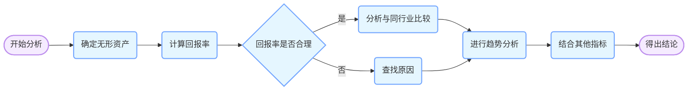

# 彼得林奇对公司无形资产回报率的分析

> 关键词：彼得林奇、无形资产回报率、公司分析、财务评估、投资策略

> 摘要：本文深入探讨了彼得林奇对公司无形资产回报率的分析方法和理念。首先介绍了背景信息，包括目的、预期读者等。接着阐述了核心概念，如无形资产、回报率等，并给出相关的原理和架构示意图。详细讲解了核心算法原理及操作步骤，运用 Python 代码进行说明。分析了相关的数学模型和公式，并举例解释。通过项目实战展示了如何在实际中运用这些理论进行公司分析。探讨了实际应用场景，推荐了相关的工具和资源。最后总结了未来发展趋势与挑战，解答了常见问题，并提供了扩展阅读和参考资料，旨在帮助读者全面理解彼得林奇的分析方法并应用于投资实践。

## 1. 背景介绍 
### 1.1 目的和范围
彼得林奇是投资界的传奇人物，他的投资理念和方法对投资者有着深远的影响。本文的目的是深入研究彼得林奇对公司无形资产回报率的分析，揭示其背后的逻辑和方法，帮助投资者更好地评估公司的价值和潜力。范围涵盖了无形资产回报率的定义、计算方法、分析要点，以及如何将这些分析应用于实际的投资决策中。

### 1.2 预期读者
本文预期读者包括投资者、金融分析师、财务专业人士以及对投资和公司分析感兴趣的人士。无论您是专业投资者还是初学者，都能从本文中获得有关公司无形资产回报率分析的有价值信息。

### 1.3 文档结构概述
本文将按照以下结构进行阐述：首先介绍相关的核心概念和它们之间的联系，通过示意图和流程图帮助读者理解；接着讲解核心算法原理和具体操作步骤，使用 Python 代码进行详细说明；然后分析数学模型和公式，并举例说明；通过项目实战展示如何运用这些理论进行实际的公司分析；探讨实际应用场景；推荐相关的工具和资源；最后总结未来发展趋势与挑战，解答常见问题，并提供扩展阅读和参考资料。

### 1.4 术语表
#### 1.4.1 核心术语定义
- **无形资产**：指企业拥有或者控制的没有实物形态的可辨认非货币性资产，如专利、商标、品牌、技术、商誉等。
- **回报率**：指投资的收益与成本的比率，反映了投资的盈利能力。在本文中，无形资产回报率是指公司无形资产所带来的收益与无形资产成本的比率。
- **公司价值**：指公司的市场价值，是投资者对公司未来盈利能力的预期。

#### 1.4.2 相关概念解释
- **有形资产**：与无形资产相对，指具有实物形态的资产，如固定资产、存货等。
- **财务报表**：公司向投资者和其他利益相关者提供的反映公司财务状况和经营成果的文件，包括资产负债表、利润表、现金流量表等。
- **投资决策**：投资者根据对公司的分析和评估，决定是否投资以及投资的金额和方式。

#### 1.4.3 缩略词列表
- **ROI**：Return on Investment，投资回报率
- **ROA**：Return on Assets，资产回报率
- **ROE**：Return on Equity，净资产收益率

## 2. 核心概念与联系 
### 核心概念原理
无形资产回报率是衡量公司无形资产利用效率和盈利能力的重要指标。彼得林奇认为，公司的无形资产往往是其竞争优势的来源，如强大的品牌可以吸引更多的客户，先进的技术可以提高生产效率，从而为公司带来更高的收益。通过分析无形资产回报率，可以评估公司无形资产的价值和潜力，判断公司的投资价值。

### 架构的文本示意图
```plaintext
无形资产回报率分析
|-- 无形资产
|   |-- 专利
|   |-- 商标
|   |-- 品牌
|   |-- 技术
|   |-- 商誉
|-- 回报率计算
|   |-- 收益
|   |   |-- 销售收入
|   |   |-- 利润
|   |-- 成本
|   |   |-- 研发成本
|   |   |-- 品牌建设成本
|-- 分析要点
|   |-- 与同行业比较
|   |-- 趋势分析
|   |-- 与其他指标结合
```

### Mermaid 流程图


## 3. 核心算法原理 & 具体操作步骤 
### 核心算法原理
无形资产回报率（ROI）的计算公式为：

$$ROI = \frac{无形资产带来的收益}{无形资产成本} \times 100\%$$

其中，无形资产带来的收益可以是销售收入的增加、利润的提升等，无形资产成本包括研发成本、品牌建设成本等。

### 具体操作步骤
1. **确定无形资产**：首先需要确定公司的无形资产有哪些，如专利、商标、品牌等。可以通过查阅公司的财务报表、年报等资料来获取相关信息。
2. **计算无形资产带来的收益**：分析公司的销售收入、利润等指标，确定无形资产对收益的贡献。可以通过对比有和没有该无形资产时的收益情况来估算。
3. **计算无形资产成本**：统计公司在研发、品牌建设等方面的投入，作为无形资产的成本。
4. **计算无形资产回报率**：将无形资产带来的收益除以无形资产成本，再乘以 100%，得到无形资产回报率。

### Python 源代码实现
```python
# 定义无形资产带来的收益
intangible_asset_income = 1000000

# 定义无形资产成本
intangible_asset_cost = 500000

# 计算无形资产回报率
roi = (intangible_asset_income / intangible_asset_cost) * 100

# 输出结果
print(f"无形资产回报率: {roi}%")
```

### 代码解释
上述代码首先定义了无形资产带来的收益和无形资产成本，然后根据公式计算无形资产回报率，最后将结果输出。

## 4. 数学模型和公式 & 详细讲解 & 举例说明 
### 数学模型和公式
无形资产回报率的计算公式为：

$$ROI = \frac{I}{C} \times 100\%$$

其中，$ROI$ 表示无形资产回报率，$I$ 表示无形资产带来的收益，$C$ 表示无形资产成本。

### 详细讲解
- **无形资产带来的收益**：可以通过多种方式来衡量，如销售收入的增加、利润的提升等。在实际分析中，需要根据具体情况进行估算。例如，某公司推出了一项新技术，使得产品的销量增加，销售收入提高。可以通过对比新技术推出前后的销售收入，估算出该技术带来的收益。
- **无形资产成本**：包括研发成本、品牌建设成本等。研发成本是指公司在研发新技术、新产品等方面的投入，品牌建设成本是指公司在品牌推广、广告宣传等方面的投入。

### 举例说明
假设某公司拥有一项专利，该专利带来的年销售收入增加了 200 万元，同时公司为研发该专利投入了 100 万元。则该专利的无形资产回报率为：

$$ROI = \frac{200}{100} \times 100\% = 200\%$$

这表明该专利的回报率非常高，说明公司在该专利上的投资取得了很好的回报。

## 5. 项目实战：代码实际案例和详细解释说明 
### 5.1  开发环境搭建
- **Python 环境**：建议使用 Python 3.7 及以上版本。可以从 Python 官方网站（https://www.python.org/downloads/）下载并安装。
- **开发工具**：可以使用 PyCharm、Jupyter Notebook 等开发工具。

### 5.2  源代码详细实现和代码解读
```python
import pandas as pd

# 定义数据
data = {
    '无形资产': ['专利', '品牌'],
    '收益': [500000, 800000],
    '成本': [200000, 300000]
}

# 创建 DataFrame
df = pd.DataFrame(data)

# 计算无形资产回报率
df['回报率'] = (df['收益'] / df['成本']) * 100

# 输出结果
print(df)
```

### 代码解读
1. **导入库**：导入 `pandas` 库，用于数据处理和分析。
2. **定义数据**：定义一个字典 `data`，包含无形资产、收益和成本的信息。
3. **创建 DataFrame**：使用 `pd.DataFrame()` 函数将字典转换为 DataFrame。
4. **计算无形资产回报率**：在 DataFrame 中添加一个新的列 `回报率`，通过 `(df['收益'] / df['成本']) * 100` 计算回报率。
5. **输出结果**：使用 `print()` 函数输出计算结果。

### 5.3  代码解读与分析
通过上述代码，我们可以方便地计算不同无形资产的回报率。在实际应用中，可以从公司的财务报表中获取相关数据，进行更复杂的分析。例如，可以对不同年份的无形资产回报率进行比较，分析其变化趋势；可以将无形资产回报率与同行业公司进行比较，评估公司的竞争力。

## 6. 实际应用场景 
### 投资决策
投资者可以通过分析公司的无形资产回报率，评估公司的投资价值。如果公司的无形资产回报率较高，说明公司在无形资产方面的投资取得了较好的回报，具有较强的盈利能力和竞争优势，值得投资。

### 公司战略规划
公司管理层可以根据无形资产回报率的分析结果，制定公司的战略规划。例如，如果某项无形资产的回报率较低，可以考虑减少对该无形资产的投入；如果某项无形资产的回报率较高，可以加大对该无形资产的投入，进一步提升公司的竞争力。

### 财务分析
财务分析师可以通过分析公司的无形资产回报率，评估公司的财务状况和经营成果。无形资产回报率可以作为一个重要的指标，与其他财务指标一起，综合评估公司的价值和潜力。

## 7. 工具和资源推荐
### 7.1 学习资源推荐
#### 7.1.1 书籍推荐
- 《彼得林奇的成功投资》：彼得林奇的经典著作，详细介绍了他的投资理念和方法。
- 《财务报表分析》：帮助读者了解如何分析公司的财务报表，获取有关无形资产的信息。
- 《投资学》：系统介绍了投资的基本理论和方法，包括公司分析和估值。

#### 7.1.2 在线课程
- Coursera 上的“投资分析与组合管理”课程：由知名教授授课，涵盖了投资分析的各个方面。
- edX 上的“财务报表分析”课程：帮助学员掌握财务报表分析的技巧和方法。

#### 7.1.3 技术博客和网站
- Seeking Alpha：提供专业的投资分析和研究报告，包括对公司无形资产的分析。
- Investopedia：提供丰富的投资知识和术语解释，有助于读者深入了解无形资产回报率的概念和分析方法。

### 7.2 开发工具框架推荐
#### 7.2.1 IDE和编辑器
- PyCharm：功能强大的 Python 集成开发环境，适合进行数据分析和编程。
- Jupyter Notebook：交互式的开发环境，方便进行数据探索和代码演示。

#### 7.2.2 调试和性能分析工具
- Py-Spy：用于分析 Python 程序的性能，找出性能瓶颈。
- PDB：Python 自带的调试工具，帮助开发者调试代码。

#### 7.2.3 相关框架和库
- Pandas：用于数据处理和分析，提供了丰富的数据结构和函数。
- Numpy：用于数值计算，提供了高效的数组操作和数学函数。

### 7.3 相关论文著作推荐
#### 7.3.1 经典论文
- "The Value Relevance of Intangible Assets: Evidence from the Software Industry"：研究了软件行业无形资产的价值相关性。
- "Measuring the Return on Investment in Intangible Assets"：探讨了无形资产回报率的测量方法。

#### 7.3.2 最新研究成果
- 关注顶级学术期刊，如《Journal of Financial Economics》《Review of Financial Studies》等，获取最新的研究成果。

#### 7.3.3 应用案例分析
- 可以通过研究一些知名公司的案例，了解它们在无形资产管理和投资方面的经验和教训。

## 8. 总结：未来发展趋势与挑战
### 未来发展趋势
- **无形资产的重要性日益凸显**：随着科技的发展和知识经济的兴起，无形资产在公司价值创造中的作用越来越重要。未来，公司将更加注重无形资产的开发和管理，提高无形资产回报率。
- **数据分析和人工智能的应用**：数据分析和人工智能技术将在无形资产回报率分析中得到更广泛的应用。通过大数据分析和机器学习算法，可以更准确地评估无形资产的价值和回报率。
- **国际合作与交流加强**：随着经济全球化的发展，国际间的投资和合作日益频繁。投资者和公司将更加关注不同国家和地区的无形资产回报率，加强国际合作与交流。

### 挑战
- **无形资产的评估难度大**：无形资产往往没有实物形态，其价值和回报率的评估具有较大的主观性和不确定性。如何准确评估无形资产的价值和回报率是一个亟待解决的问题。
- **数据获取和质量问题**：无形资产相关的数据往往难以获取，且数据质量参差不齐。如何获取准确、完整的无形资产数据，提高数据质量，是进行无形资产回报率分析的关键。
- **法律法规和政策环境不完善**：目前，关于无形资产的法律法规和政策环境还不够完善，对无形资产的保护和管理存在一定的不足。这给无形资产回报率分析带来了一定的困难。

## 9. 附录：常见问题与解答
### 问题 1：如何确定无形资产带来的收益？
解答：可以通过对比有和没有该无形资产时的收益情况来估算。例如，对比新产品推出前后的销售收入，或者对比品牌推广前后的市场份额和利润。也可以参考同行业公司的经验和数据进行估算。

### 问题 2：无形资产成本包括哪些方面？
解答：无形资产成本包括研发成本、品牌建设成本、专利申请费用、技术引进费用等。研发成本是指公司在研发新技术、新产品等方面的投入；品牌建设成本是指公司在品牌推广、广告宣传等方面的投入。

### 问题 3：无形资产回报率的合理范围是多少？
解答：无形资产回报率的合理范围因行业、公司规模、发展阶段等因素而异。一般来说，较高的无形资产回报率表明公司在无形资产方面的投资取得了较好的回报，但具体的合理范围需要结合同行业公司的情况进行分析。

### 问题 4：如何提高公司的无形资产回报率？
解答：可以通过加强无形资产的管理和开发，提高无形资产的质量和价值；优化无形资产的投资决策，选择回报率较高的项目进行投资；加强品牌建设和市场推广，提高品牌知名度和市场份额等方式来提高公司的无形资产回报率。

## 10. 扩展阅读 & 参考资料
### 扩展阅读
- 《聪明的投资者》：本杰明·格雷厄姆的经典著作，对价值投资理念进行了深入阐述。
- 《穷查理宝典》：查理·芒格的智慧箴言，包含了许多关于投资和商业的深刻见解。

### 参考资料
- 彼得林奇相关的书籍和访谈资料。
- 各大财经网站和数据库提供的公司财务数据和分析报告。
- 学术期刊上发表的关于无形资产和投资分析的研究论文。

作者：AI天才研究院/AI Genius Institute & 禅与计算机程序设计艺术 /Zen And The Art of Computer Programming