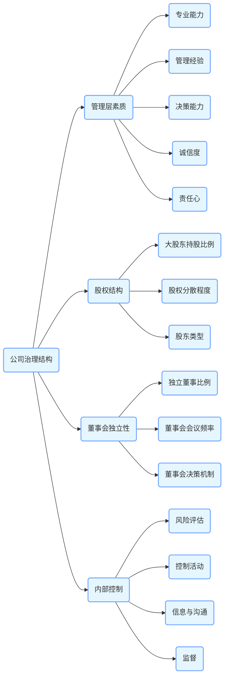

# 彼得林奇对公司治理结构的评估标准

> 关键词：彼得林奇、公司治理结构、评估标准、投资分析、企业管理

> 摘要：本文围绕彼得林奇对公司治理结构的评估标准展开深入探讨。首先介绍相关背景，包括目的、预期读者等内容。接着阐述公司治理结构的核心概念及联系，详细分析彼得林奇所采用的核心算法原理与操作步骤，并结合数学模型和公式进行说明。通过项目实战案例，具体呈现如何运用这些标准进行公司治理结构评估。还探讨了其在实际应用场景中的作用，推荐了相关学习资源、开发工具和论文著作。最后总结未来发展趋势与挑战，解答常见问题并提供扩展阅读和参考资料，旨在帮助读者全面理解彼得林奇的评估标准，为投资决策和企业管理提供有益参考。

## 1. 背景介绍 
### 1.1 目的和范围
本部分旨在深入剖析彼得林奇对公司治理结构的评估标准，其目的主要有两个方面。一方面，为投资者提供一套科学、实用的评估方法，帮助他们在众多投资标的中筛选出具有良好治理结构的公司，从而提高投资决策的准确性和成功率。另一方面，为企业管理者提供参考，使其了解优秀的公司治理结构应具备的要素，以便改进自身企业的治理水平。

范围涵盖了彼得林奇在评估公司治理结构时所考虑的各个方面，包括管理层素质、股权结构、董事会独立性等核心要素，以及这些要素之间的相互关系和对公司整体运营的影响。

### 1.2 预期读者
本文的预期读者主要包括两类人群。一类是投资者，无论是个人投资者还是机构投资者，都可以从彼得林奇的评估标准中获取有价值的信息，优化自己的投资组合。另一类是企业管理者，他们可以借鉴这些标准来完善公司的治理结构，提升企业的竞争力和可持续发展能力。此外，对公司治理和投资分析感兴趣的研究人员和学者也可以从本文中获得新的研究视角和思路。

### 1.3 文档结构概述
本文将按照以下结构展开。首先，介绍公司治理结构的核心概念与联系，通过文本示意图和 Mermaid 流程图清晰展示各要素之间的关系。接着，详细阐述彼得林奇评估公司治理结构的核心算法原理和具体操作步骤，并结合 Python 代码进行说明。然后，运用数学模型和公式对评估标准进行量化分析，并举例说明其应用。在项目实战部分，给出具体的代码案例并进行详细解读。之后，探讨该评估标准在实际应用场景中的作用。再推荐相关的学习资源、开发工具和论文著作。最后，总结未来发展趋势与挑战，解答常见问题并提供扩展阅读和参考资料。

### 1.4 术语表
#### 1.4.1 核心术语定义
- **公司治理结构**：指的是一组规范公司相关各方的责、权、利的制度安排，是现代企业制度中最重要的组织架构。它包括股东大会、董事会、监事会和管理层等机构，这些机构之间相互制衡、相互协作，共同保障公司的有效运作。
- **管理层素质**：主要指公司管理层的专业能力、管理经验、决策能力、诚信度和责任心等方面的综合表现。高素质的管理层能够带领公司制定正确的战略规划，有效应对市场变化，实现公司的长期发展目标。
- **股权结构**：是指公司总股本中，不同性质的股份所占的比例及其相互关系。合理的股权结构可以保障股东的权益，促进公司的稳定发展，同时也会影响公司的决策机制和治理效率。
- **董事会独立性**：指董事会成员能够独立于管理层和大股东，以客观、公正的态度行使职权，对公司的重大决策进行监督和制衡。具有独立性的董事会能够更好地保护全体股东的利益，提高公司治理的有效性。

#### 1.4.2 相关概念解释
- **内部控制**：是指企业为了实现经营目标，保护资产的安全完整，保证会计信息资料的正确可靠，确保经营方针的贯彻执行，保证经营活动的经济性、效率性和效果性而在企业内部采取的自我调整、约束、规划、评价和控制的一系列方法、手续与措施的总称。
- **信息披露**：是指上市公司按照相关法律法规的要求，将公司的财务状况、经营成果、重大事项等信息向社会公众公开披露的行为。及时、准确、完整的信息披露有助于投资者做出合理的投资决策，也有利于提高公司的透明度和公信力。

#### 1.4.3 缩略词列表
- **CEO**：首席执行官（Chief Executive Officer），是公司的最高行政负责人，负责公司的日常经营管理和决策。
- **CFO**：首席财务官（Chief Financial Officer），主要负责公司的财务管理、财务规划、财务分析等工作。
- **COO**：首席运营官（Chief Operating Officer），负责公司的运营管理，协调各部门之间的工作，确保公司业务的顺利开展。

## 2. 核心概念与联系 
公司治理结构是一个复杂的系统，涉及多个核心概念，这些概念之间相互关联、相互影响。其核心要素主要包括管理层素质、股权结构、董事会独立性和内部控制等。

### 文本示意图
```plaintext
公司治理结构
|--管理层素质
|   |--专业能力
|   |--管理经验
|   |--决策能力
|   |--诚信度
|   |--责任心
|--股权结构
|   |--大股东持股比例
|   |--股权分散程度
|   |--股东类型
|--董事会独立性
|   |--独立董事比例
|   |--董事会会议频率
|   |--董事会决策机制
|--内部控制
|   |--风险评估
|   |--控制活动
|   |--信息与沟通
|   |--监督
```

### Mermaid 流程图


从上述示意图和流程图可以看出，管理层素质是公司治理的关键因素之一，高素质的管理层能够更好地领导公司发展。股权结构会影响公司的决策机制和治理效率，合理的股权结构有助于平衡各方利益。董事会独立性是保障公司决策公正、透明的重要保障，独立的董事会能够对管理层进行有效监督。内部控制则是确保公司运营合规、风险可控的重要手段，通过风险评估、控制活动等环节，保障公司的稳定发展。这些核心概念相互作用，共同构成了公司治理结构的整体框架。

## 3. 核心算法原理 & 具体操作步骤 
彼得林奇评估公司治理结构的核心算法原理是通过对多个关键指标进行量化分析，综合评估公司治理的优劣。以下是具体的操作步骤和 Python 代码实现。

### 操作步骤
1. **数据收集**：收集公司的相关信息，包括管理层简历、股权结构数据、董事会成员信息、内部控制报告等。
2. **指标量化**：将收集到的信息转化为具体的指标，例如管理层的学历、工作年限、大股东持股比例、独立董事比例等。
3. **指标打分**：根据设定的标准对每个指标进行打分，例如学历高的管理层可以给予较高的分数，大股东持股比例过高或过低可以给予相应的分数调整。
4. **综合评估**：将各个指标的分数进行加权求和，得到公司治理结构的综合得分。

### Python 代码实现
```python
# 定义指标权重
weights = {
    'management_quality': 0.3,
    'equity_structure': 0.2,
    'board_independence': 0.2,
    'internal_control': 0.3
}

# 定义指标得分函数
def get_management_quality_score(education, experience):
    """
    根据管理层学历和工作经验计算管理层素质得分
    :param education: 管理层学历，例如 '本科'、'硕士'、'博士'
    :param experience: 管理层工作经验（年）
    :return: 管理层素质得分
    """
    education_score = {'本科': 60, '硕士': 80, '博士': 90}.get(education, 50)
    experience_score = min(experience * 10, 100)
    return (education_score + experience_score) / 2

def get_equity_structure_score(large_shareholder_ratio):
    """
    根据大股东持股比例计算股权结构得分
    :param large_shareholder_ratio: 大股东持股比例（百分比）
    :return: 股权结构得分
    """
    if 30 <= large_shareholder_ratio <= 60:
        return 80
    elif large_shareholder_ratio < 30:
        return 60
    else:
        return 40

def get_board_independence_score(independent_director_ratio):
    """
    根据独立董事比例计算董事会独立性得分
    :param independent_director_ratio: 独立董事比例（百分比）
    :return: 董事会独立性得分
    """
    if independent_director_ratio >= 30:
        return 80
    elif independent_director_ratio >= 20:
        return 60
    else:
        return 40

def get_internal_control_score(risk_management_level):
    """
    根据内部控制的风险管理水平计算内部控制得分
    :param risk_management_level: 风险管理水平，例如 '高'、'中'、'低'
    :return: 内部控制得分
    """
    score_dict = {'高': 80, '中': 60, '低': 40}
    return score_dict.get(risk_management_level, 50)

# 综合评估函数
def comprehensive_evaluation(education, experience, large_shareholder_ratio, independent_director_ratio, risk_management_level):
    """
    综合评估公司治理结构得分
    :param education: 管理层学历
    :param experience: 管理层工作经验（年）
    :param large_shareholder_ratio: 大股东持股比例（百分比）
    :param independent_director_ratio: 独立董事比例（百分比）
    :param risk_management_level: 风险管理水平
    :return: 综合得分
    """
    management_quality_score = get_management_quality_score(education, experience)
    equity_structure_score = get_equity_structure_score(large_shareholder_ratio)
    board_independence_score = get_board_independence_score(independent_director_ratio)
    internal_control_score = get_internal_control_score(risk_management_level)
    
    total_score = (
        weights['management_quality'] * management_quality_score +
        weights['equity_structure'] * equity_structure_score +
        weights['board_independence'] * board_independence_score +
        weights['internal_control'] * internal_control_score
    )
    return total_score

# 示例数据
education = '硕士'
experience = 10
large_shareholder_ratio = 40
independent_director_ratio = 35
risk_management_level = '高'

# 计算综合得分
score = comprehensive_evaluation(education, experience, large_shareholder_ratio, independent_director_ratio, risk_management_level)
print(f"公司治理结构综合得分: {score}")
```

### 代码解释
- `weights` 字典定义了各个指标的权重，反映了每个指标在综合评估中的重要程度。
- `get_management_quality_score` 函数根据管理层的学历和工作经验计算管理层素质得分，学历和工作经验分别赋予一定的分数，然后取平均值。
- `get_equity_structure_score` 函数根据大股东持股比例计算股权结构得分，不同的持股比例范围对应不同的分数。
- `get_board_independence_score` 函数根据独立董事比例计算董事会独立性得分，同样根据不同的比例范围给予相应的分数。
- `get_internal_control_score` 函数根据内部控制的风险管理水平计算内部控制得分，高、中、低不同水平对应不同的分数。
- `comprehensive_evaluation` 函数将各个指标的得分乘以相应的权重，然后相加得到综合得分。

通过上述代码和操作步骤，我们可以对公司治理结构进行量化评估，为投资决策和企业管理提供参考依据。

## 4. 数学模型和公式 & 详细讲解 & 举例说明 
### 数学模型和公式
设公司治理结构的综合得分 $S$，管理层素质得分 $S_m$，股权结构得分 $S_e$，董事会独立性得分 $S_b$，内部控制得分 $S_i$，各指标的权重分别为 $w_m$、$w_e$、$w_b$、$w_i$，且 $w_m + w_e + w_b + w_i = 1$。则综合得分的计算公式为：

$$S = w_m \times S_m + w_e \times S_e + w_b \times S_b + w_i \times S_i$$

### 详细讲解
这个数学模型的核心思想是通过加权求和的方式，将多个影响公司治理结构的指标综合起来，得到一个整体的评估得分。每个指标的得分反映了该指标在公司治理中的表现，而权重则体现了该指标在综合评估中的重要性。通过调整权重，可以根据不同的需求和侧重点，对各个指标进行不同程度的关注。

### 举例说明
假设我们有两家公司 A 和 B，其相关指标数据如下：

| 公司 | 管理层学历 | 管理层工作经验（年） | 大股东持股比例（%） | 独立董事比例（%） | 风险管理水平 |
| ---- | ---- | ---- | ---- | ---- | ---- |
| A | 硕士 | 10 | 40 | 35 | 高 |
| B | 本科 | 5 | 70 | 20 | 中 |

根据前面定义的指标得分函数和权重，计算两家公司的综合得分：

对于公司 A：
- 管理层素质得分 $S_{m_A}$：
    - 学历得分：硕士对应 80 分
    - 经验得分：$10 \times 10 = 100$ 分
    - $S_{m_A} = \frac{80 + 100}{2} = 90$ 分
- 股权结构得分 $S_{e_A}$：大股东持股比例 40%，在 30% - 60% 之间，得 80 分。
- 董事会独立性得分 $S_{b_A}$：独立董事比例 35%，大于 30%，得 80 分。
- 内部控制得分 $S_{i_A}$：风险管理水平为高，得 80 分。

综合得分 $S_A$：
$$S_A = 0.3 \times 90 + 0.2 \times 80 + 0.2 \times 80 + 0.3 \times 80$$
$$S_A = 27 + 16 + 16 + 24 = 83$$

对于公司 B：
- 管理层素质得分 $S_{m_B}$：
    - 学历得分：本科对应 60 分
    - 经验得分：$5 \times 10 = 50$ 分
    - $S_{m_B} = \frac{60 + 50}{2} = 55$ 分
- 股权结构得分 $S_{e_B}$：大股东持股比例 70%，大于 60%，得 40 分。
- 董事会独立性得分 $S_{b_B}$：独立董事比例 20%，在 20% - 30% 之间，得 60 分。
- 内部控制得分 $S_{i_B}$：风险管理水平为中，得 60 分。

综合得分 $S_B$：
$$S_B = 0.3 \times 55 + 0.2 \times 40 + 0.2 \times 60 + 0.3 \times 60$$
$$S_B = 16.5 + 8 + 12 + 18 = 54.5$$

通过比较两家公司的综合得分，我们可以看出公司 A 的治理结构相对较好，更具有投资价值或管理优势。

## 5. 项目实战：代码实际案例和详细解释说明 
### 5.1  开发环境搭建
在进行项目实战之前，需要搭建相应的开发环境。以下是具体的步骤：

#### 安装 Python
首先，确保你已经安装了 Python。可以从 Python 官方网站（https://www.python.org/downloads/）下载适合你操作系统的 Python 版本，并按照安装向导进行安装。

#### 安装必要的库
本项目主要使用 Python 的基本库，无需额外安装其他第三方库。如果你使用的是 Anaconda 环境，可以通过以下命令创建一个新的虚拟环境：

```bash
conda create -n corporate_governance python=3.8
conda activate corporate_governance
```

### 5.2  源代码详细实现和代码解读
以下是完整的源代码及详细解读：

```python
# 定义指标权重
weights = {
    'management_quality': 0.3,
    'equity_structure': 0.2,
    'board_independence': 0.2,
    'internal_control': 0.3
}

# 定义指标得分函数
def get_management_quality_score(education, experience):
    """
    根据管理层学历和工作经验计算管理层素质得分
    :param education: 管理层学历，例如 '本科'、'硕士'、'博士'
    :param experience: 管理层工作经验（年）
    :return: 管理层素质得分
    """
    education_score = {'本科': 60, '硕士': 80, '博士': 90}.get(education, 50)
    experience_score = min(experience * 10, 100)
    return (education_score + experience_score) / 2

def get_equity_structure_score(large_shareholder_ratio):
    """
    根据大股东持股比例计算股权结构得分
    :param large_shareholder_ratio: 大股东持股比例（百分比）
    :return: 股权结构得分
    """
    if 30 <= large_shareholder_ratio <= 60:
        return 80
    elif large_shareholder_ratio < 30:
        return 60
    else:
        return 40

def get_board_independence_score(independent_director_ratio):
    """
    根据独立董事比例计算董事会独立性得分
    :param independent_director_ratio: 独立董事比例（百分比）
    :return: 董事会独立性得分
    """
    if independent_director_ratio >= 30:
        return 80
    elif independent_director_ratio >= 20:
        return 60
    else:
        return 40

def get_internal_control_score(risk_management_level):
    """
    根据内部控制的风险管理水平计算内部控制得分
    :param risk_management_level: 风险管理水平，例如 '高'、'中'、'低'
    :return: 内部控制得分
    """
    score_dict = {'高': 80, '中': 60, '低': 40}
    return score_dict.get(risk_management_level, 50)

# 综合评估函数
def comprehensive_evaluation(education, experience, large_shareholder_ratio, independent_director_ratio, risk_management_level):
    """
    综合评估公司治理结构得分
    :param education: 管理层学历
    :param experience: 管理层工作经验（年）
    :param large_shareholder_ratio: 大股东持股比例（百分比）
    :param independent_director_ratio: 独立董事比例（百分比）
    :param risk_management_level: 风险管理水平
    :return: 综合得分
    """
    management_quality_score = get_management_quality_score(education, experience)
    equity_structure_score = get_equity_structure_score(large_shareholder_ratio)
    board_independence_score = get_board_independence_score(independent_director_ratio)
    internal_control_score = get_internal_control_score(risk_management_level)
    
    total_score = (
        weights['management_quality'] * management_quality_score +
        weights['equity_structure'] * equity_structure_score +
        weights['board_independence'] * board_independence_score +
        weights['internal_control'] * internal_control_score
    )
    return total_score

# 示例数据
education = '硕士'
experience = 10
large_shareholder_ratio = 40
independent_director_ratio = 35
risk_management_level = '高'

# 计算综合得分
score = comprehensive_evaluation(education, experience, large_shareholder_ratio, independent_director_ratio, risk_management_level)
print(f"公司治理结构综合得分: {score}")
```

### 代码解读与分析
- **指标权重定义**：`weights` 字典定义了各个指标在综合评估中的权重，通过调整这些权重，可以根据不同的需求和侧重点对各个指标进行不同程度的关注。
- **指标得分函数**：
    - `get_management_quality_score` 函数根据管理层的学历和工作经验计算管理层素质得分，学历和工作经验分别赋予一定的分数，然后取平均值。
    - `get_equity_structure_score` 函数根据大股东持股比例计算股权结构得分，不同的持股比例范围对应不同的分数。
    - `get_board_independence_score` 函数根据独立董事比例计算董事会独立性得分，同样根据不同的比例范围给予相应的分数。
    - `get_internal_control_score` 函数根据内部控制的风险管理水平计算内部控制得分，高、中、低不同水平对应不同的分数。
- **综合评估函数**：`comprehensive_evaluation` 函数将各个指标的得分乘以相应的权重，然后相加得到综合得分。
- **示例数据和计算**：通过定义示例数据，调用 `comprehensive_evaluation` 函数计算公司治理结构的综合得分，并将结果打印输出。

通过这个项目实战，我们可以将彼得林奇的评估标准应用到实际的公司治理结构评估中，为投资决策和企业管理提供有力的支持。

## 6. 实际应用场景 
彼得林奇对公司治理结构的评估标准在多个实际应用场景中具有重要价值。

### 投资决策
对于投资者来说，评估公司治理结构是投资决策的重要环节。通过运用彼得林奇的评估标准，投资者可以筛选出具有良好治理结构的公司，降低投资风险。例如，在选择股票投资时，投资者可以对不同公司的管理层素质、股权结构、董事会独立性和内部控制等方面进行评估，选择综合得分较高的公司进行投资。具有良好治理结构的公司通常具有更强的竞争力和可持续发展能力，能够为投资者带来更稳定的回报。

### 企业并购
在企业并购过程中，评估目标公司的治理结构至关重要。收购方可以运用彼得林奇的评估标准，对目标公司的治理状况进行全面了解，判断其是否符合自身的战略需求和管理要求。如果目标公司的治理结构存在严重问题，可能会给并购后的整合带来困难，甚至影响并购的成功率。因此，在并购前进行充分的治理结构评估，可以帮助收购方做出更明智的决策。

### 企业自身管理改进
企业管理者可以借鉴彼得林奇的评估标准，对自身企业的治理结构进行自我评估，发现存在的问题并及时改进。通过分析管理层素质、股权结构、董事会独立性和内部控制等方面的指标，企业管理者可以明确企业治理的优势和不足，制定相应的改进措施。例如，如果发现管理层素质有待提高，可以加强培训和人才引进；如果股权结构不合理，可以考虑进行股权调整等。

### 监管机构监督
监管机构可以运用彼得林奇的评估标准，对上市公司的治理结构进行监督和管理。通过定期评估上市公司的治理状况，监管机构可以及时发现潜在的问题，督促上市公司进行整改，保护投资者的合法权益。同时，监管机构还可以根据评估结果，制定相应的政策和法规，引导上市公司完善治理结构，提高整个证券市场的运行效率和质量。

## 7. 工具和资源推荐
### 7.1 学习资源推荐
#### 7.1.1 书籍推荐
- 《彼得·林奇的成功投资》：彼得·林奇的经典著作，详细介绍了他的投资理念和方法，包括对公司基本面的分析和对公司治理结构的关注。
- 《公司治理》：这本书系统地阐述了公司治理的理论和实践，涵盖了公司治理的各个方面，包括董事会、股权结构、内部控制等，是学习公司治理的重要参考书籍。
- 《财务报表分析与证券定价》：通过对财务报表的分析，帮助读者了解公司的财务状况和经营成果，同时也涉及到对公司治理结构的分析和评估。

#### 7.1.2 在线课程
- Coursera 上的“Corporate Governance”课程：由知名高校的教授授课，全面介绍了公司治理的理论和实践，包括公司治理的框架、董事会的作用、股东权益保护等内容。
- edX 上的“Investment Analysis and Portfolio Management”课程：该课程涵盖了投资分析的各个方面，包括对公司基本面的分析和对公司治理结构的评估，对于学习投资和公司治理具有重要的参考价值。

#### 7.1.3 技术博客和网站
- Seeking Alpha：这是一个知名的金融投资博客网站，提供了大量关于公司分析、投资策略和市场动态的文章，其中不乏对公司治理结构的深入分析和讨论。
- The Corporate Library：该网站专注于公司治理研究，提供了丰富的公司治理数据和报告，以及对公司治理热点问题的分析和评论。

### 7.2 开发工具框架推荐
#### 7.2.1 IDE和编辑器
- PyCharm：一款功能强大的 Python 集成开发环境，提供了代码编辑、调试、版本控制等一系列功能，适合 Python 开发者使用。
- Visual Studio Code：一款轻量级的代码编辑器，支持多种编程语言，具有丰富的插件扩展功能，可以满足不同开发者的需求。

#### 7.2.2 调试和性能分析工具
- PDB：Python 自带的调试工具，可以帮助开发者定位和解决代码中的问题。
- cProfile：Python 的性能分析工具，可以分析代码的运行时间和函数调用情况，帮助开发者优化代码性能。

#### 7.2.3 相关框架和库
在本项目中，主要使用 Python 的基本库，无需额外安装其他第三方库。但如果需要进行更复杂的数据处理和分析，可以考虑使用以下库：
- Pandas：用于数据处理和分析的强大库，提供了高效的数据结构和数据操作方法。
- NumPy：用于科学计算的基础库，提供了多维数组和各种数学函数，提高了计算效率。

### 7.3 相关论文著作推荐
#### 7.3.1 经典论文
- “Separation of Ownership and Control” by Michael C. Jensen and William H. Meckling：该论文探讨了公司所有权和控制权分离的问题，对公司治理理论的发展产生了深远影响。
- “Agency Problems and the Theory of the Firm” by Eugene F. Fama：提出了代理理论，分析了公司管理层和股东之间的代理关系，为公司治理研究提供了重要的理论基础。

#### 7.3.2 最新研究成果
- 可以关注《Journal of Financial Economics》、《Review of Financial Studies》等顶级金融学术期刊，这些期刊上发表了许多关于公司治理的最新研究成果。

#### 7.3.3 应用案例分析
- 《哈佛商业评论》上经常发表一些关于公司治理的应用案例分析，通过实际案例展示了不同公司在治理结构方面的实践和经验教训，对于理解和应用公司治理理论具有重要的参考价值。

## 8. 总结：未来发展趋势与挑战
### 未来发展趋势
- **数字化治理**：随着信息技术的快速发展，公司治理将越来越多地采用数字化手段。例如，利用大数据和人工智能技术对公司的运营数据进行实时监测和分析，提高治理决策的科学性和及时性。同时，数字化治理还可以加强公司内部的信息沟通和协作，提高治理效率。
- **多元化股东参与**：未来，股东结构将更加多元化，除了传统的机构投资者和个人投资者外，还将出现更多的战略投资者、员工持股计划等。多元化的股东将更加积极地参与公司治理，对公司的决策和管理提出更高的要求。这将促使公司更加注重股东权益保护，提高治理的透明度和公正性。
- **社会责任纳入治理**：越来越多的公司将社会责任纳入公司治理的范畴。公司不仅要追求经济效益，还要关注环境保护、社会公平等社会效益。在评估公司治理结构时，也将更加注重公司的社会责任表现，这将推动公司实现可持续发展。

### 挑战
- **数据安全和隐私保护**：在数字化治理过程中，公司需要收集和处理大量的敏感数据，如股东信息、财务数据等。这就面临着数据安全和隐私保护的挑战。一旦数据泄露，将给公司和股东带来巨大的损失。因此，公司需要加强数据安全管理，采取有效的技术和管理措施，保障数据的安全和隐私。
- **股东利益协调**：多元化的股东结构使得股东利益更加复杂多样，如何协调不同股东之间的利益成为公司治理的一大挑战。例如，机构投资者可能更关注短期财务回报，而战略投资者可能更注重公司的长期发展战略。公司需要建立有效的沟通机制和决策机制，平衡各方利益，实现公司的整体利益最大化。
- **国际监管差异**：随着经济全球化的发展，越来越多的公司开展跨国业务。不同国家和地区的监管政策和法律环境存在差异，这给公司的跨国治理带来了挑战。公司需要了解并遵守不同国家和地区的监管要求，制定相应的治理策略，以应对国际监管差异带来的风险。

## 9. 附录：常见问题与解答
### 问题 1：如何确定各指标的权重？
答：各指标的权重可以根据不同的需求和侧重点进行调整。一般来说，可以参考相关的研究文献、行业经验和专家意见来确定初始权重。然后，在实际应用中，可以根据评估结果的反馈和实际情况进行适当的调整，以提高评估的准确性和有效性。

### 问题 2：如果数据不完整，如何进行评估？
答：如果数据不完整，可以采用以下方法进行处理。首先，可以尝试通过其他渠道获取缺失的数据，如公司公告、新闻报道等。如果无法获取完整的数据，可以采用估算的方法，根据已有的数据和相关的经验进行合理估算。另外，也可以在评估模型中设置一定的容错机制，降低数据不完整对评估结果的影响。

### 问题 3：该评估标准是否适用于所有类型的公司？
答：彼得林奇的评估标准具有一定的通用性，但并不是适用于所有类型的公司。不同行业、不同规模的公司在治理结构方面可能存在差异，因此在应用该评估标准时，需要根据公司的具体情况进行适当的调整和补充。例如，对于高科技企业，可能需要更加关注管理层的创新能力和技术背景；对于国有企业，可能需要考虑政府监管和社会责任等因素。

### 问题 4：如何利用评估结果进行投资决策？
答：评估结果可以作为投资决策的重要参考依据，但不能作为唯一的决策标准。在进行投资决策时，还需要综合考虑其他因素，如公司的行业前景、财务状况、市场竞争力等。一般来说，可以将评估得分较高的公司作为投资候选对象，然后进一步深入分析这些公司的其他方面，最终做出合理的投资决策。

## 10. 扩展阅读 & 参考资料
### 扩展阅读
- 《聪明的投资者》：本杰明·格雷厄姆的经典投资著作，介绍了价值投资的理念和方法，对于理解公司基本面分析和投资决策具有重要的启示作用。
- 《金融炼金术》：乔治·索罗斯的著作，阐述了他的投资哲学和市场理论，对投资者的思维方式和投资策略具有一定的启发。

### 参考资料
- 彼得·林奇. 《彼得·林奇的成功投资》. 机械工业出版社.
- 迈克尔·C·詹森, 威廉·H·梅克林. “Separation of Ownership and Control”. Journal of Financial Economics, 1976.
- 尤金·F·法玛. “Agency Problems and the Theory of the Firm”. Journal of Political Economy, 1980.

作者：AI天才研究院/AI Genius Institute & 禅与计算机程序设计艺术 /Zen And The Art of Computer Programming