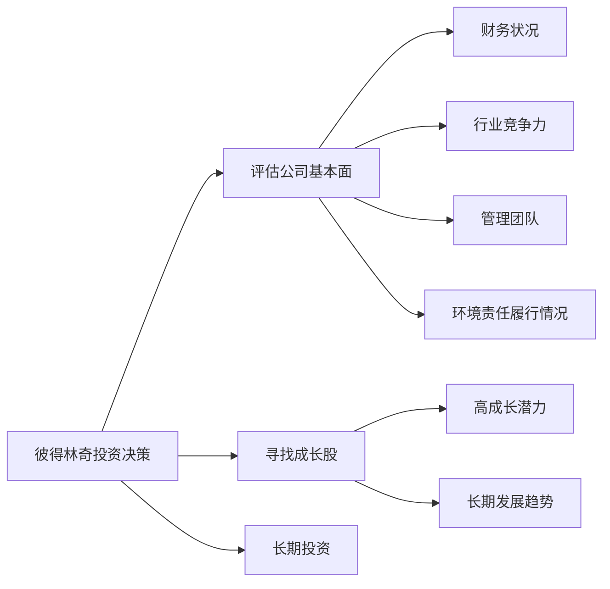

# 彼得林奇对公司环境责任的看法

> 关键词：彼得林奇、公司环境责任、投资理念、可持续发展、企业价值

> 摘要：本文深入探讨了彼得林奇对公司环境责任的看法。彼得林奇作为投资界的传奇人物，其投资理念影响深远。虽然他主要以成长股投资闻名，但在公司环境责任方面也有着独特见解。文章首先介绍背景，包括目的范围、预期读者等；接着阐述相关核心概念与联系；分析核心算法原理（此处虽彼得林奇观点并非算法，但会用逻辑推理阐述）及操作步骤；给出数学模型虽在该主题不太典型，但会用相关指标和原理说明；通过项目实战案例展示其观点在实际中的体现；探讨实际应用场景；推荐学习、开发工具等资源；最后总结未来发展趋势与挑战，解答常见问题并提供扩展阅读资料，旨在全面解析彼得林奇对公司环境责任看法的内涵与意义。

## 1. 背景介绍 
### 1.1 目的和范围
本文章的目的在于全面剖析彼得林奇对于公司环境责任的看法。彼得林奇是投资领域的标志性人物，其投资策略和观点被广泛研究和应用。虽然他的主要贡献集中在投资选股方面，但他对于公司环境责任的见解也能为投资者、企业管理者以及关注可持续发展的人士提供重要的参考。文章的范围将涵盖彼得林奇观点的形成背景、具体内容、在实际投资和企业运营中的应用，以及对未来发展的启示。

### 1.2 预期读者
预期读者包括金融投资领域的专业人士，如基金经理、分析师等，他们可以从彼得林奇的观点中获取新的投资思路和选股标准；企业管理者，了解公司环境责任在投资者眼中的重要性，从而更好地制定企业战略；对可持续发展和企业社会责任感兴趣的研究人员和学生，通过本文深入了解投资大师对这一领域的看法；以及普通投资者，提升对投资中环境因素的认识，做出更明智的投资决策。

### 1.3 文档结构概述
本文将按照以下结构展开：首先介绍核心概念与联系，明确公司环境责任等相关概念，并阐述它们之间的关系；接着分析核心算法原理和具体操作步骤，这里将以逻辑推理的方式呈现彼得林奇观点在实际中的应用步骤；然后给出数学模型和公式，通过相关指标和原理进行说明；再通过项目实战案例展示其观点在实际中的体现，包括开发环境搭建、源代码详细实现和解读；探讨实际应用场景，说明其在不同领域的应用；推荐学习、开发工具等资源；最后总结未来发展趋势与挑战，解答常见问题并提供扩展阅读资料。

### 1.4 术语表
#### 1.4.1 核心术语定义
- **公司环境责任**：指企业在生产经营过程中，对自然环境所承担的义务和责任，包括减少污染排放、合理利用资源、推动环境保护等方面。
- **可持续发展**：既满足当代人的需求，又不损害后代人满足其需求的能力的发展模式，强调经济、社会和环境的协调发展。
- **成长股投资**：彼得林奇所擅长的投资策略，聚焦于具有高成长潜力的股票，通过深入研究公司基本面和行业趋势来选择投资标的。

#### 1.4.2 相关概念解释
- **企业社会责任**：企业在创造利润、对股东和员工承担法律责任的同时，还要承担对消费者、社区和环境的责任。公司环境责任是企业社会责任的重要组成部分。
- **ESG投资**：一种关注企业环境（Environmental）、社会（Social）和治理（Governance）绩效的投资理念，与彼得林奇对公司环境责任的关注有一定关联。

#### 1.4.3 缩略词列表
- **ESG**：Environmental, Social and Governance（环境、社会和治理）

## 2. 核心概念与联系 

### 核心概念原理
彼得林奇在投资过程中，虽然没有像现在这样系统地提出公司环境责任的概念，但他关注公司的基本面和长期发展潜力。公司的环境责任履行情况在一定程度上会影响其基本面和长期发展。从原理上来说，一家积极履行环境责任的公司，能够更好地应对环境法规的变化，减少因环境污染等问题带来的法律风险和经济损失。同时，注重环境保护可以提升公司的品牌形象，增强消费者对公司的认可度和忠诚度，从而促进产品销售和市场份额的扩大。

### 架构的文本示意图
```plaintext
彼得林奇投资理念
|
|-- 关注公司基本面
|   |
|   |-- 财务状况
|   |-- 行业竞争力
|   |-- 管理团队
|   |-- 环境责任履行情况
|
|-- 寻找成长股
|   |
|   |-- 高成长潜力
|   |-- 长期发展趋势
|
|-- 长期投资
```

### Mermaid 流程图


## 3. 核心算法原理 & 具体操作步骤 

### 核心算法原理
虽然彼得林奇的观点并非严格意义上的算法，但可以用逻辑推理的方式来阐述其在评估公司环境责任时的原理。可以将公司环境责任的评估分为几个关键因素，通过对这些因素的综合分析来判断公司在环境责任方面的表现。以下是一个简化的逻辑推理过程：

```python
# 定义评估函数
def evaluate_environmental_responsibility(factor1, factor2, factor3):
    """
    评估公司环境责任
    :param factor1: 环境法规遵守情况
    :param factor2: 资源利用效率
    :param factor3: 环保投入情况
    :return: 评估结果
    """
    # 简单加权求和
    score = 0.3 * factor1 + 0.3 * factor2 + 0.4 * factor3
    if score > 0.7:
        return "优秀"
    elif score > 0.4:
        return "良好"
    else:
        return "一般"

# 示例数据
environmental_compliance = 0.8  # 环境法规遵守情况得分
resource_efficiency = 0.6  # 资源利用效率得分
environmental_investment = 0.7  # 环保投入情况得分

# 进行评估
result = evaluate_environmental_responsibility(environmental_compliance, resource_efficiency, environmental_investment)
print(f"公司环境责任评估结果: {result}")
```

### 具体操作步骤
1. **数据收集**：收集公司在环境法规遵守情况、资源利用效率、环保投入等方面的数据。可以通过公司的年报、环境报告、新闻报道等渠道获取。
2. **因素评分**：根据收集到的数据，对每个因素进行评分。评分可以采用百分制或区间制，例如 0 - 1 之间的小数。
3. **综合评估**：将各个因素的评分按照一定的权重进行加权求和，得到公司环境责任的综合评分。
4. **结果判断**：根据综合评分，判断公司在环境责任方面的表现，如优秀、良好、一般等。
5. **投资决策参考**：将公司环境责任的评估结果作为投资决策的参考因素之一。如果公司在环境责任方面表现优秀，且其他基本面因素也良好，则可以考虑增加对该公司的投资；反之，如果表现不佳，则需要谨慎投资。

## 4. 数学模型和公式 & 详细讲解 & 举例说明 

### 数学模型和公式
在评估公司环境责任时，可以使用以下数学模型：

$$S = w_1 \times F_1 + w_2 \times F_2 + w_3 \times F_3$$

其中，$S$ 表示公司环境责任的综合评分，$w_1$、$w_2$、$w_3$ 分别表示环境法规遵守情况、资源利用效率、环保投入情况的权重，$F_1$、$F_2$、$F_3$ 分别表示这三个因素的评分。

### 详细讲解
- **权重的确定**：权重的确定需要根据不同因素对公司环境责任的重要程度来进行。在上述示例中，假设环保投入情况对公司环境责任的影响较大，因此赋予了 0.4 的权重；而环境法规遵守情况和资源利用效率的权重均为 0.3。实际应用中，权重可以根据具体情况进行调整。
- **因素评分**：因素评分需要根据客观数据进行量化。例如，环境法规遵守情况可以根据公司是否存在环境违规记录、违规次数等进行评分；资源利用效率可以根据公司的能源消耗、原材料利用率等指标进行评分；环保投入情况可以根据公司在环保设备购置、研发投入等方面的费用进行评分。

### 举例说明
假设一家公司在环境法规遵守情况方面得分为 0.8，资源利用效率得分为 0.6，环保投入情况得分为 0.7，权重分别为 0.3、0.3、0.4，则该公司环境责任的综合评分 $S$ 为：

$$S = 0.3 \times 0.8 + 0.3 \times 0.6 + 0.4 \times 0.7$$
$$S = 0.24 + 0.18 + 0.28$$
$$S = 0.7$$

根据前面的评估标准，该公司的环境责任表现为“良好”。

## 5. 项目实战：代码实际案例和详细解释说明 

### 5.1  开发环境搭建
- **编程语言**：Python 是一种功能强大且易于学习的编程语言，适合用于数据处理和分析，因此选择 Python 作为开发语言。
- **开发环境**：可以使用 Anaconda 来管理 Python 环境，它包含了许多常用的科学计算库。安装 Anaconda 后，可以使用 Jupyter Notebook 进行代码的编写和调试，Jupyter Notebook 具有交互性强、可视化效果好等优点。
- **所需库**：需要安装 pandas 库用于数据处理，numpy 库用于数值计算，matplotlib 库用于数据可视化。可以使用以下命令进行安装：
```sh
pip install pandas numpy matplotlib
```

### 5.2  源代码详细实现和代码解读
```python
import pandas as pd
import numpy as np
import matplotlib.pyplot as plt

# 模拟公司环境责任数据
data = {
    '公司名称': ['公司 A', '公司 B', '公司 C', '公司 D', '公司 E'],
    '环境法规遵守情况': [0.8, 0.6, 0.7, 0.9, 0.5],
    '资源利用效率': [0.6, 0.7, 0.8, 0.6, 0.9],
    '环保投入情况': [0.7, 0.8, 0.6, 0.7, 0.5]
}

# 创建 DataFrame
df = pd.DataFrame(data)

# 定义权重
weights = {
    '环境法规遵守情况': 0.3,
    '资源利用效率': 0.3,
    '环保投入情况': 0.4
}

# 计算综合评分
df['综合评分'] = df['环境法规遵守情况'] * weights['环境法规遵守情况'] + \
                 df['资源利用效率'] * weights['资源利用效率'] + \
                 df['环保投入情况'] * weights['环保投入情况']

# 定义评估函数
def evaluate_score(score):
    if score > 0.7:
        return "优秀"
    elif score > 0.4:
        return "良好"
    else:
        return "一般"

# 进行评估
df['评估结果'] = df['综合评分'].apply(evaluate_score)

# 打印结果
print(df)

# 可视化综合评分
plt.bar(df['公司名称'], df['综合评分'])
plt.xlabel('公司名称')
plt.ylabel('综合评分')
plt.title('公司环境责任综合评分')
plt.show()
```

### 代码解读与分析
1. **数据模拟**：使用字典 `data` 模拟了五家公司在环境法规遵守情况、资源利用效率和环保投入情况方面的数据，并使用 `pandas` 库的 `DataFrame` 进行存储。
2. **权重定义**：定义了一个字典 `weights`，用于存储各个因素的权重。
3. **综合评分计算**：根据前面介绍的数学模型，使用 `DataFrame` 的列运算计算每家公司的综合评分。
4. **评估结果判断**：定义了一个评估函数 `evaluate_score`，根据综合评分判断公司的环境责任表现，并使用 `apply` 方法将该函数应用到 `综合评分` 列上，得到每家公司的评估结果。
5. **结果打印**：使用 `print` 函数打印包含公司名称、各因素得分、综合评分和评估结果的 `DataFrame`。
6. **数据可视化**：使用 `matplotlib` 库的 `bar` 函数绘制柱状图，直观地展示每家公司的综合评分。

## 6. 实际应用场景 
### 投资决策
在投资领域，彼得林奇对公司环境责任的看法可以为投资者提供新的选股思路。投资者可以将公司环境责任的评估结果作为投资决策的参考因素之一，优先选择那些在环境责任方面表现优秀的公司。这样不仅可以降低投资风险，还可以促进企业更加重视环境保护，实现可持续发展。

### 企业战略制定
企业管理者可以借鉴彼得林奇的观点，将环境责任纳入企业战略规划中。积极履行环境责任可以提升企业的品牌形象，增强市场竞争力，吸引更多的投资者和消费者。例如，一些企业通过采用清洁能源、减少废弃物排放等方式，降低了生产成本，同时也赢得了社会的认可。

### 行业监管
政府和行业监管部门可以根据彼得林奇的观点，加强对企业环境责任的监管。通过制定更加严格的环境法规和标准，引导企业积极履行环境责任，推动整个行业的可持续发展。

## 7. 工具和资源推荐
### 7.1 学习资源推荐
#### 7.1.1 书籍推荐
- 《彼得·林奇的成功投资》：彼得林奇的经典著作，详细介绍了他的投资理念和选股方法。
- 《可持续发展与企业社会责任》：全面阐述了企业社会责任的概念、理论和实践，对公司环境责任有深入的探讨。
- 《ESG投资：理念、方法与实践》：介绍了 ESG 投资的相关知识和方法，与彼得林奇对公司环境责任的关注有一定关联。

#### 7.1.2 在线课程
- Coursera 上的“投资学原理”：由知名教授授课，涵盖了投资领域的基础知识和方法。
- edX 上的“企业社会责任与可持续发展”：系统讲解了企业社会责任的相关理论和实践。

#### 7.1.3 技术博客和网站
- Seeking Alpha：提供丰富的投资分析和研究报告，包括对公司环境责任的关注。
- TriplePundit：专注于可持续发展和企业社会责任领域，有大量关于公司环境责任的文章和案例。

### 7.2 开发工具框架推荐
#### 7.2.1 IDE和编辑器
- PyCharm：一款专业的 Python 集成开发环境，具有强大的代码编辑、调试和项目管理功能。
- Visual Studio Code：一款轻量级的代码编辑器，支持多种编程语言，有丰富的插件扩展。

#### 7.2.2 调试和性能分析工具
- pdb：Python 自带的调试器，可以帮助开发者定位和解决代码中的问题。
- cProfile：Python 的性能分析工具，可以分析代码的运行时间和函数调用情况。

#### 7.2.3 相关框架和库
- pandas：用于数据处理和分析的 Python 库，提供了丰富的数据结构和函数。
- numpy：用于数值计算的 Python 库，支持高效的数组操作和数学运算。
- matplotlib：用于数据可视化的 Python 库，可以绘制各种类型的图表。

### 7.3 相关论文著作推荐
#### 7.3.1 经典论文
- "The Social Responsibility of Business Is to Increase Its Profits" by Milton Friedman：探讨了企业社会责任的经典论文，引发了广泛的讨论。
- "Corporate Social Performance Revisited" by Archie B. Carroll：提出了企业社会责任的金字塔模型，对企业社会责任的研究有重要影响。

#### 7.3.2 最新研究成果
- 可以关注《Journal of Business Ethics》《Academy of Management Journal》等学术期刊，了解公司环境责任领域的最新研究成果。

#### 7.3.3 应用案例分析
- 可以参考一些企业的可持续发展报告和案例研究，了解企业在环境责任方面的实践和经验。例如，苹果公司的环境报告详细介绍了其在节能减排、资源回收等方面的工作。

## 8. 总结：未来发展趋势与挑战
### 未来发展趋势
- **环境责任纳入主流投资**：随着投资者对可持续发展的关注度不断提高，公司环境责任将越来越成为投资决策的重要因素。未来，更多的投资者将采用 ESG 投资策略，优先选择那些在环境责任方面表现优秀的公司。
- **企业环境责任标准趋严**：政府和行业监管部门将加强对企业环境责任的监管，制定更加严格的环境法规和标准。企业需要不断提高自身的环境管理水平，以满足监管要求。
- **科技推动环境责任履行**：科技的不断进步将为企业履行环境责任提供更多的手段和方法。例如，物联网、大数据、人工智能等技术可以帮助企业实现对环境数据的实时监测和分析，提高资源利用效率，减少环境污染。

### 挑战
- **数据获取和评估难度大**：目前，公司环境责任相关数据的获取和评估存在一定的难度。不同公司的数据披露标准不一致，数据的真实性和可靠性也有待提高。此外，如何科学合理地评估公司环境责任也是一个挑战。
- **短期利益与长期发展的矛盾**：一些企业可能更关注短期利益，而忽视了长期的环境责任。在追求利润最大化的过程中，企业可能会牺牲环境利益。如何平衡短期利益和长期发展，是企业面临的一个重要挑战。
- **国际合作与协调不足**：环境问题是全球性的问题，需要国际社会的共同合作与协调。然而，目前国际上在公司环境责任方面的合作与协调还存在不足，不同国家和地区的环境法规和标准存在差异，这给企业的跨国经营带来了一定的困难。

## 9. 附录：常见问题与解答
### 问题 1：彼得林奇是否明确提出过公司环境责任的概念？
解答：彼得林奇主要以成长股投资闻名，并没有像现在这样系统地提出公司环境责任的概念。但他关注公司的基本面和长期发展潜力，公司的环境责任履行情况在一定程度上会影响其基本面和长期发展，因此可以从他的投资理念中推断出他对公司环境责任的重视。

### 问题 2：如何判断公司在环境责任方面的表现？
解答：可以从环境法规遵守情况、资源利用效率、环保投入情况等方面进行评估。通过收集相关数据，对每个因素进行评分，然后按照一定的权重进行加权求和，得到公司环境责任的综合评分，根据综合评分判断公司的表现。

### 问题 3：公司环境责任对投资有什么影响？
解答：一家积极履行环境责任的公司，能够更好地应对环境法规的变化，减少因环境污染等问题带来的法律风险和经济损失。同时，注重环境保护可以提升公司的品牌形象，增强消费者对公司的认可度和忠诚度，从而促进产品销售和市场份额的扩大，有利于公司的长期发展，从投资角度看，降低了投资风险，增加了投资价值。

### 问题 4：企业如何平衡短期利益和长期环境责任？
解答：企业可以通过制定合理的战略规划，将环境责任纳入企业的长期发展目标中。在短期内，可以通过采用一些环保措施，如节能减排、资源回收等，降低生产成本，提高经济效益。同时，企业还可以加强与投资者、消费者等利益相关者的沟通，提高他们对企业环境责任的认识和支持。

## 10. 扩展阅读 & 参考资料
### 扩展阅读
- 《投资最重要的事》：霍华德·马克斯的著作，深入探讨了投资的哲学和方法。
- 《基业长青》：吉姆·柯林斯和杰里·波勒斯的著作，研究了优秀企业的成功之道，其中包括企业的社会责任和可持续发展。

### 参考资料
- 《彼得·林奇的成功投资》，彼得·林奇著
- 《可持续发展与企业社会责任》，相关学术著作
- 各企业的可持续发展报告和环境报告
- 相关学术期刊和研究论文

作者：AI天才研究院/AI Genius Institute & 禅与计算机程序设计艺术 /Zen And The Art of Computer Programming