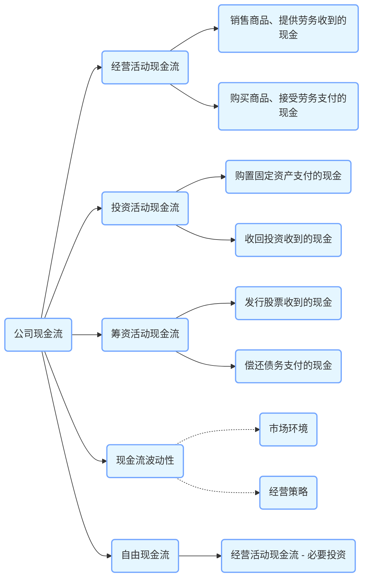

# 彼得林奇对公司现金流波动性的分析

> 关键词：彼得林奇、公司现金流、现金流波动性、财务分析、投资策略

> 摘要：本文聚焦于彼得林奇对公司现金流波动性的分析方法。彼得林奇作为投资界的传奇人物，其投资理念和分析方法对投资者具有重要的指导意义。现金流波动性是衡量公司财务健康状况和经营稳定性的关键指标，通过深入剖析彼得林奇对这一指标的分析，能帮助投资者更好地理解公司的内在价值，做出更明智的投资决策。文章将从背景介绍入手，阐述相关核心概念，讲解分析公司现金流波动性的算法原理与操作步骤，介绍相关数学模型，结合项目实战案例进行详细解读，探讨实际应用场景，推荐相关工具和资源，最后总结未来发展趋势与挑战，并对常见问题进行解答，为投资者提供全面而深入的参考。

## 1. 背景介绍 
### 1.1 目的和范围
本文的目的在于深入探究彼得林奇对公司现金流波动性的分析方法，为投资者和财务分析人员提供一套系统的分析思路和方法。范围涵盖彼得林奇相关投资理念中关于现金流波动性分析的核心要点，包括如何理解现金流波动性的概念、如何运用相关指标进行分析以及其在投资决策中的应用等方面。通过对这些内容的研究，帮助读者更好地把握公司的财务状况和经营稳定性，从而在投资活动中做出更合理的决策。

### 1.2 预期读者
本文预期读者主要包括对投资分析有兴趣的个人投资者、专业的财务分析人员、金融领域的研究人员以及相关专业的学生。对于个人投资者来说，能够从彼得林奇的分析方法中获取实用的投资技巧，提高投资决策的准确性；专业财务分析人员可以进一步完善自己的分析体系，提升分析能力；金融领域研究人员可以从理论和实践的角度深入探讨现金流波动性分析的价值；相关专业学生则可以将其作为学习财务分析和投资学的重要参考资料，拓宽自己的知识面和视野。

### 1.3 文档结构概述
本文首先介绍彼得林奇对公司现金流波动性分析的背景信息，包括目的、预期读者和文档结构等内容。接着阐述核心概念，通过文本示意图和 Mermaid 流程图展示现金流波动性与其他相关概念的联系。然后讲解核心算法原理和具体操作步骤，用 Python 源代码详细阐述分析过程。随后介绍相关的数学模型和公式，并通过举例说明其应用。在项目实战部分，介绍开发环境搭建、源代码实现和代码解读。之后探讨实际应用场景，推荐相关的工具和资源。最后总结未来发展趋势与挑战，解答常见问题，并提供扩展阅读和参考资料。

### 1.4 术语表
#### 1.4.1 核心术语定义
- **现金流**：指企业在一定会计期间按照现金收付实现制，通过一定经济活动（包括经营活动、投资活动、筹资活动和非经常性项目）而产生的现金流入、现金流出及其总量情况的总称。
- **现金流波动性**：反映公司现金流在不同期间的变化程度，通常用统计指标来衡量，如标准差等。它体现了公司经营活动、投资活动和筹资活动现金流量的不稳定程度。
- **自由现金流**：是企业产生的、在满足了再投资需要之后剩余的现金流量，这部分现金流量是在不影响公司持续发展的前提下可供分配给企业资本供应者的最大现金额。

#### 1.4.2 相关概念解释
- **经营活动现金流**：企业在日常经营过程中产生的现金流量，如销售商品、提供劳务收到的现金，购买商品、接受劳务支付的现金等。它反映了企业经营业务的现金创造能力。
- **投资活动现金流**：企业进行投资活动（如购置固定资产、无形资产，进行长期股权投资等）产生的现金流量。投资活动现金流反映了企业的投资决策和资产配置情况。
- **筹资活动现金流**：企业进行筹资活动（如发行股票、债券，取得借款，偿还债务等）产生的现金流量。筹资活动现金流反映了企业的资金来源和资本结构的变化。

#### 1.4.3 缩略词列表
- **FCF**：自由现金流（Free Cash Flow）
- **OCF**：经营活动现金流（Operating Cash Flow）
- **ICF**：投资活动现金流（Investing Cash Flow）
- **FCF**：筹资活动现金流（Financing Cash Flow）

## 2. 核心概念与联系 
### 核心概念原理
现金流是企业生存和发展的血液，它直接关系到企业的经营状况和财务健康。现金流波动性则是衡量现金流稳定性的重要指标。高波动性的现金流可能意味着公司面临较大的经营风险，例如市场需求的不确定性、成本控制的困难等。而低波动性的现金流通常表示公司经营相对稳定，具有较强的抗风险能力。

自由现金流是企业在满足了所有必要的投资和运营成本后剩余的现金，它可以用于分配给股东、偿还债务或进行新的投资。自由现金流的波动性也反映了公司盈利能力和财务灵活性的稳定性。

经营活动现金流是企业核心业务产生的现金流量，它是企业持续经营的基础。投资活动现金流反映了企业对未来发展的投资决策，筹资活动现金流则体现了企业的融资策略。这三种现金流相互关联，共同影响着公司的现金流波动性。

### 文本示意图
```plaintext
公司现金流
|-- 经营活动现金流
|   |-- 销售商品、提供劳务收到的现金
|   |-- 购买商品、接受劳务支付的现金
|   |-- ...
|-- 投资活动现金流
|   |-- 购置固定资产支付的现金
|   |-- 收回投资收到的现金
|   |-- ...
|-- 筹资活动现金流
|   |-- 发行股票收到的现金
|   |-- 偿还债务支付的现金
|   |-- ...
|
|-- 现金流波动性
|   |-- 反映经营、投资、筹资活动现金流量的变化程度
|   |-- 受市场环境、经营策略等因素影响
|
|-- 自由现金流
|   |-- 经营活动现金流 - 必要投资
|   |-- 体现公司可自由支配的现金
```

### Mermaid 流程图


## 3. 核心算法原理 & 具体操作步骤 
### 算法原理
分析公司现金流波动性的一种常见方法是计算现金流的标准差。标准差是衡量数据离散程度的统计指标，在现金流分析中，它可以反映现金流在不同期间的波动情况。标准差越大，说明现金流的波动性越大，公司面临的风险也就越高；标准差越小，说明现金流相对稳定。

另一种方法是计算现金流的变异系数。变异系数是标准差与均值的比值，它可以消除不同公司现金流规模的影响，更便于比较不同公司之间的现金流波动性。

### 具体操作步骤
1. **数据收集**：收集公司多个期间（如年度或季度）的现金流数据，包括经营活动现金流、投资活动现金流、筹资活动现金流和自由现金流等。
2. **数据整理**：将收集到的数据按照时间顺序进行整理，确保数据的准确性和完整性。
3. **计算均值**：分别计算经营活动现金流、投资活动现金流、筹资活动现金流和自由现金流的均值。
4. **计算标准差**：根据均值计算各现金流的标准差。
5. **计算变异系数**：用标准差除以均值，得到各现金流的变异系数。
6. **分析结果**：根据标准差和变异系数的大小，分析公司现金流的波动性，并与同行业其他公司进行比较，评估公司的财务风险。

### Python 源代码实现
```python
import numpy as np

# 示例现金流数据，假设为某公司 5 个年度的经营活动现金流
operating_cash_flows = [100, 120, 80, 110, 90]

# 计算均值
mean_ocf = np.mean(operating_cash_flows)
print(f"经营活动现金流均值: {mean_ocf}")

# 计算标准差
std_ocf = np.std(operating_cash_flows)
print(f"经营活动现金流标准差: {std_ocf}")

# 计算变异系数
cv_ocf = std_ocf / mean_ocf
print(f"经营活动现金流变异系数: {cv_ocf}")
```
在上述代码中，我们首先导入了 `numpy` 库，然后定义了一个包含某公司 5 个年度经营活动现金流的列表。接着，使用 `np.mean()` 函数计算均值，`np.std()` 函数计算标准差，最后计算变异系数。通过这些计算，我们可以初步了解该公司经营活动现金流的波动性。

## 4. 数学模型和公式 & 详细讲解 & 举例说明 
### 数学模型和公式
- **均值公式**：
设 $x_1, x_2, \cdots, x_n$ 为 $n$ 个期间的现金流数据，则均值 $\bar{x}$ 的计算公式为：
$$\bar{x} = \frac{1}{n} \sum_{i=1}^{n} x_i$$
- **标准差公式**：
标准差 $\sigma$ 的计算公式为：
$$\sigma = \sqrt{\frac{1}{n} \sum_{i=1}^{n} (x_i - \bar{x})^2}$$
- **变异系数公式**：
变异系数 $CV$ 的计算公式为：
$$CV = \frac{\sigma}{\bar{x}}$$

### 详细讲解
均值是一组数据的平均值，它反映了数据的集中趋势。在现金流分析中，均值可以表示公司在一定期间内的平均现金流量水平。

标准差衡量了数据相对于均值的离散程度。标准差越大，说明数据越分散，现金流的波动性也就越大；标准差越小，说明数据越集中，现金流相对稳定。

变异系数是标准差与均值的比值，它消除了数据规模的影响，使得不同规模公司的现金流波动性可以进行比较。变异系数越大，说明现金流的相对波动性越大；变异系数越小，说明现金流的相对波动性越小。

### 举例说明
假设公司 A 和公司 B 在过去 5 年的经营活动现金流数据如下：
- 公司 A：[100, 120, 80, 110, 90]
- 公司 B：[200, 220, 180, 210, 190]

#### 计算公司 A 的相关指标
- 均值：
$$\bar{x}_A = \frac{100 + 120 + 80 + 110 + 90}{5} = 100$$
- 标准差：
$$\sigma_A = \sqrt{\frac{(100 - 100)^2 + (120 - 100)^2 + (80 - 100)^2 + (110 - 100)^2 + (90 - 100)^2}{5}} \approx 14.14$$
- 变异系数：
$$CV_A = \frac{14.14}{100} = 0.1414$$

#### 计算公司 B 的相关指标
- 均值：
$$\bar{x}_B = \frac{200 + 220 + 180 + 210 + 190}{5} = 200$$
- 标准差：
$$\sigma_B = \sqrt{\frac{(200 - 200)^2 + (220 - 200)^2 + (180 - 200)^2 + (210 - 200)^2 + (190 - 200)^2}{5}} \approx 14.14$$
- 变异系数：
$$CV_B = \frac{14.14}{200} = 0.0707$$

从计算结果可以看出，公司 A 和公司 B 的标准差相同，但由于公司 B 的均值较大，其变异系数较小，说明公司 B 的现金流相对波动性较小，经营稳定性相对较高。

## 5. 项目实战：代码实际案例和详细解释说明 
### 5.1  开发环境搭建
在进行项目实战之前，需要搭建相应的开发环境。以下是具体步骤：
1. **安装 Python**：从 Python 官方网站（https://www.python.org/downloads/）下载并安装 Python 3.x 版本。
2. **安装必要的库**：使用 `pip` 命令安装 `numpy` 和 `pandas` 库，这两个库在数据处理和分析中非常有用。
```bash
pip install numpy pandas
```
3. **选择开发工具**：可以选择 PyCharm、Jupyter Notebook 等开发工具。这里推荐使用 Jupyter Notebook，它可以方便地进行代码编写、运行和结果展示。

### 5.2  源代码详细实现和代码解读
以下是一个完整的项目实战代码示例，用于分析某公司多个年度的现金流波动性：
```python
import pandas as pd
import numpy as np

# 读取现金流数据文件，假设文件名为 cash_flows.csv
data = pd.read_csv('cash_flows.csv')

# 提取经营活动现金流、投资活动现金流、筹资活动现金流和自由现金流数据
operating_cash_flows = data['operating_cash_flow'].values
investing_cash_flows = data['investing_cash_flow'].values
financing_cash_flows = data['financing_cash_flow'].values
free_cash_flows = data['free_cash_flow'].values

# 定义计算均值、标准差和变异系数的函数
def calculate_stats(cash_flows):
    mean = np.mean(cash_flows)
    std = np.std(cash_flows)
    cv = std / mean
    return mean, std, cv

# 计算各现金流的均值、标准差和变异系数
ocf_mean, ocf_std, ocf_cv = calculate_stats(operating_cash_flows)
icf_mean, icf_std, icf_cv = calculate_stats(investing_cash_flows)
fcf_mean, fcf_std, fcf_cv = calculate_stats(financing_cash_flows)
free_fcf_mean, free_fcf_std, free_fcf_cv = calculate_stats(free_cash_flows)

# 打印结果
print("经营活动现金流统计信息：")
print(f"均值: {ocf_mean}")
print(f"标准差: {ocf_std}")
print(f"变异系数: {ocf_cv}")

print("\n投资活动现金流统计信息：")
print(f"均值: {icf_mean}")
print(f"标准差: {icf_std}")
print(f"变异系数: {icf_cv}")

print("\n筹资活动现金流统计信息：")
print(f"均值: {fcf_mean}")
print(f"标准差: {fcf_std}")
print(f"变异系数: {fcf_cv}")

print("\n自由现金流统计信息：")
print(f"均值: {free_fcf_mean}")
print(f"标准差: {free_fcf_std}")
print(f"变异系数: {free_fcf_cv}")
```
### 代码解读
1. **数据读取**：使用 `pandas` 库的 `read_csv()` 函数读取包含现金流数据的 CSV 文件。
2. **数据提取**：从读取的数据中提取经营活动现金流、投资活动现金流、筹资活动现金流和自由现金流数据，并将其转换为 `numpy` 数组。
3. **函数定义**：定义 `calculate_stats()` 函数，用于计算现金流数据的均值、标准差和变异系数。
4. **计算统计信息**：调用 `calculate_stats()` 函数分别计算各现金流的均值、标准差和变异系数。
5. **结果打印**：将计算得到的统计信息打印输出，方便分析和比较。

### 5.3  代码解读与分析
通过上述代码，我们可以对公司的现金流波动性进行全面的分析。经营活动现金流的波动性反映了公司核心业务的稳定性，投资活动现金流的波动性体现了公司投资决策的变化情况，筹资活动现金流的波动性则反映了公司融资策略的调整。自由现金流的波动性则综合考虑了经营、投资和筹资活动的影响，更能反映公司的整体财务稳定性。

如果某一类型的现金流变异系数较大，说明该现金流的波动性较大，公司可能面临较大的风险。例如，经营活动现金流变异系数较大，可能意味着公司的市场需求不稳定、成本控制存在问题等；投资活动现金流变异系数较大，可能表示公司的投资决策较为激进或不稳定；筹资活动现金流变异系数较大，可能反映公司的融资渠道不稳定或融资策略频繁调整。

通过对不同类型现金流波动性的分析，投资者可以更好地了解公司的财务状况和经营稳定性，从而做出更合理的投资决策。

## 6. 实际应用场景 
### 投资决策
在投资决策中，分析公司现金流波动性是非常重要的。投资者可以通过比较不同公司的现金流波动性，选择经营稳定性较高的公司进行投资。例如，在选择股票时，投资者可以优先考虑现金流波动性较小的公司，因为这些公司通常具有更强的抗风险能力，能够在市场环境变化时保持相对稳定的业绩。

此外，现金流波动性还可以帮助投资者评估公司的成长潜力。如果一家公司的现金流波动性逐渐减小，且自由现金流不断增加，说明公司的经营状况在不断改善，具有较好的成长潜力。

### 财务风险管理
对于企业管理者来说，分析现金流波动性有助于进行财务风险管理。通过监控现金流的波动情况，管理者可以及时发现潜在的财务风险，并采取相应的措施进行防范。例如，如果经营活动现金流波动性增大，管理者可以分析原因，是市场需求下降、成本上升还是其他因素导致的，并采取调整营销策略、控制成本等措施来稳定现金流。

### 企业价值评估
在企业价值评估中，现金流波动性也是一个重要的考虑因素。现金流波动性较大的公司，其未来现金流的不确定性也较大，因此在评估企业价值时需要给予较低的估值。相反，现金流波动性较小的公司，其未来现金流相对稳定，企业价值相对较高。

## 7. 工具和资源推荐
### 7.1 学习资源推荐
#### 7.1.1 书籍推荐
- 《彼得林奇的成功投资》：彼得林奇的经典著作，详细介绍了他的投资理念和方法，包括如何分析公司的财务状况和现金流等内容。
- 《财务报表分析与证券定价》：这本书系统地介绍了财务报表分析的方法和技术，对于理解公司现金流波动性的分析具有重要的参考价值。
- 《聪明的投资者》：本杰明·格雷厄姆的经典著作，强调了价值投资的理念，对于投资者培养正确的投资思维和分析能力非常有帮助。

#### 7.1.2 在线课程
- Coursera 上的“Financial Markets”课程：由耶鲁大学教授罗伯特·席勒主讲，内容涵盖金融市场的各个方面，包括公司财务分析和投资决策等内容。
- edX 上的“Introduction to Financial Accounting”课程：介绍了财务会计的基本概念和方法，对于理解公司的财务报表和现金流分析有很大的帮助。

#### 7.1.3 技术博客和网站
- Seeking Alpha：一个提供金融市场分析和投资建议的网站，上面有很多专业的分析师对公司的财务状况和现金流进行分析和解读。
- ValueWalk：专注于价值投资领域的博客，提供了大量关于投资分析和财务研究的文章。

### 7.2 开发工具框架推荐
#### 7.2.1 IDE和编辑器
- PyCharm：一款功能强大的 Python 集成开发环境，提供了代码编辑、调试、版本控制等丰富的功能，适合专业的 Python 开发者使用。
- Jupyter Notebook：一个基于网页的交互式开发环境，非常适合数据处理和分析，能够方便地展示代码和结果。

#### 7.2.2 调试和性能分析工具
- pdb：Python 内置的调试工具，可以帮助开发者定位代码中的问题。
- cProfile：Python 标准库中的性能分析工具，可以分析代码的执行时间和调用关系，帮助开发者优化代码性能。

#### 7.2.3 相关框架和库
- numpy：一个用于科学计算的 Python 库，提供了高效的数组操作和数学函数，在现金流数据分析中非常有用。
- pandas：一个用于数据处理和分析的 Python 库，提供了强大的数据结构和数据操作功能，能够方便地处理和分析现金流数据。

### 7.3 相关论文著作推荐
#### 7.3.1 经典论文
- “The Determinants of Corporate Borrowing” by Stewart C. Myers：该论文探讨了公司融资决策的影响因素，对于理解公司筹资活动现金流的波动性具有重要的参考价值。
- “Financial Ratios, Discriminant Analysis and the Prediction of Corporate Bankruptcy” by Edward I. Altman：提出了著名的 Z 计分模型，用于预测公司的破产风险，与现金流波动性分析密切相关。

#### 7.3.2 最新研究成果
- 关注《Journal of Financial Economics》《The Review of Financial Studies》等顶级金融学术期刊，上面会发表关于公司财务和投资领域的最新研究成果，包括现金流波动性分析的相关研究。

#### 7.3.3 应用案例分析
- 一些专业的金融研究机构和咨询公司会发布关于公司现金流分析的应用案例报告，可以通过查阅这些报告了解实际应用中的分析方法和技巧。

## 8. 总结：未来发展趋势与挑战
### 未来发展趋势
- **数据分析技术的应用**：随着大数据和人工智能技术的发展，未来在分析公司现金流波动性时将更多地应用数据分析技术。例如，通过机器学习算法对大量的现金流数据进行挖掘和分析，能够更准确地预测现金流的变化趋势，发现潜在的风险和机会。
- **综合分析方法的应用**：未来的现金流波动性分析将不仅仅局限于传统的财务指标分析，还将结合宏观经济环境、行业发展趋势、公司战略等多方面因素进行综合分析。这样可以更全面地了解公司的财务状况和经营稳定性。
- **实时监测和预警系统的建立**：为了及时发现和应对现金流风险，未来企业和投资者将更加重视建立实时监测和预警系统。通过对现金流数据的实时监测，一旦发现异常波动，系统能够及时发出预警信号，以便采取相应的措施。

### 挑战
- **数据质量问题**：准确的现金流数据是进行分析的基础，但在实际应用中，数据质量可能存在问题，如数据缺失、错误等。这会影响分析结果的准确性，需要采取有效的数据清洗和预处理方法来解决。
- **市场环境的不确定性**：市场环境的变化是影响公司现金流波动性的重要因素，但市场环境具有不确定性，难以准确预测。这给现金流波动性分析带来了一定的挑战，需要不断完善分析方法和模型，提高对市场变化的适应性。
- **跨行业分析的难度**：不同行业的公司现金流特点和波动性影响因素可能存在较大差异，进行跨行业分析时需要考虑这些差异，制定合适的分析指标和方法。这增加了分析的难度和复杂性。

## 9. 附录：常见问题与解答
### 问题 1：现金流波动性分析是否适用于所有类型的公司？
解答：现金流波动性分析适用于大多数类型的公司，但不同行业的公司现金流特点可能存在差异，在分析时需要结合行业特点进行调整。例如，一些新兴行业的公司可能在发展初期现金流波动性较大，这是由于其业务模式和市场环境的特殊性导致的，需要进行具体分析。

### 问题 2：如何判断现金流波动性是正常波动还是异常波动？
解答：可以通过与同行业其他公司进行比较，以及分析公司的历史数据来判断。如果公司的现金流波动性明显高于同行业平均水平，或者与公司自身历史数据相比出现大幅波动，可能属于异常波动。此外，还需要结合公司的经营状况、市场环境等因素进行综合分析。

### 问题 3：现金流波动性与公司盈利能力有什么关系？
解答：现金流波动性与公司盈利能力密切相关。一般来说，现金流波动性较小的公司，其盈利能力相对稳定；而现金流波动性较大的公司，其盈利能力可能受到较大影响。例如，经营活动现金流波动性较大可能导致公司无法及时支付成本和费用，影响生产经营，从而降低盈利能力。

### 问题 4：在分析现金流波动性时，应该关注哪些指标？
解答：除了标准差和变异系数外，还可以关注现金流的趋势、现金流与净利润的关系等指标。现金流的趋势可以反映公司现金流的变化方向，现金流与净利润的关系可以判断公司利润的质量。如果公司净利润增长，但现金流却没有相应增加，可能存在利润质量问题。

## 10. 扩展阅读 & 参考资料
### 扩展阅读
- 《漫步华尔街》：这本书介绍了各种投资理论和策略，对于拓宽投资视野和理解市场行为有很大的帮助。
- 《金融炼金术》：乔治·索罗斯的著作，阐述了他的投资哲学和市场分析方法，对于深入思考金融市场和投资决策具有启发意义。

### 参考资料
- 彼得林奇相关的演讲和访谈记录。
- 各公司的财务报表和年报。
- 金融学术期刊上发表的关于现金流分析的研究论文。

作者：AI天才研究院/AI Genius Institute & 禅与计算机程序设计艺术 /Zen And The Art of Computer Programming