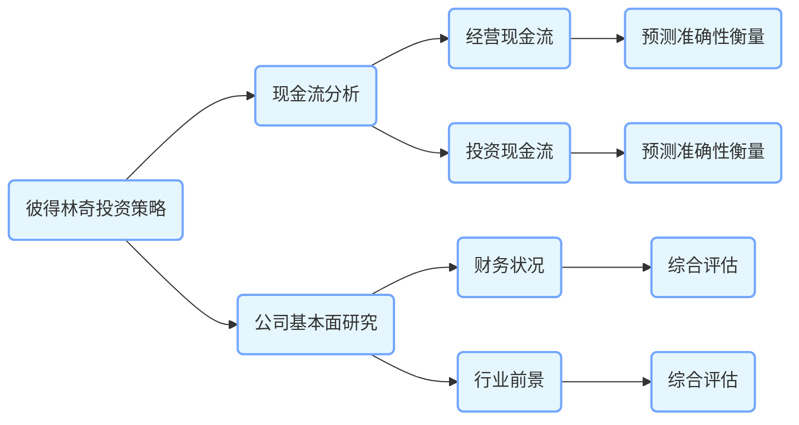

# 彼得林奇对公司现金流预测准确性的历史分析

> 关键词：彼得林奇、公司现金流、预测准确性、历史分析、投资策略

> 摘要：本文旨在深入分析彼得林奇对公司现金流预测准确性的历史贡献。彼得林奇作为投资界的传奇人物，其投资理念和方法影响深远。现金流作为公司财务状况的关键指标，准确预测对于投资者评估公司价值至关重要。通过对彼得林奇相关思想和实践的历史回顾，剖析其在公司现金流预测准确性方面的独特见解和方法，探讨其对现代投资决策的借鉴意义，帮助投资者更好地理解和运用现金流预测来做出明智的投资选择。

## 1. 背景介绍 
### 1.1 目的和范围
本研究的目的在于全面梳理彼得林奇在公司现金流预测准确性方面的理论与实践，分析其方法的有效性和局限性。范围涵盖彼得林奇的投资生涯、相关著作以及他所涉及的不同行业和公司的现金流预测案例。通过对这些内容的研究，为投资者提供更深入的投资思路和决策依据。

### 1.2 预期读者
本文预期读者包括对投资领域感兴趣的个人投资者、专业投资机构从业者、金融专业学生以及对公司财务分析有研究需求的人员。旨在为不同层次的读者提供关于彼得林奇现金流预测方法的详细解读和分析。

### 1.3 文档结构概述
本文首先介绍相关背景信息，包括目的、读者群体和文档结构。接着阐述核心概念，如现金流、预测准确性等，并展示其联系和架构。然后深入探讨彼得林奇所涉及的核心算法原理和具体操作步骤，结合数学模型和公式进行详细讲解。通过项目实战部分的代码案例，进一步说明现金流预测的实际应用。分析实际应用场景，推荐相关的学习资源、开发工具和论文著作。最后总结未来发展趋势与挑战，提供常见问题解答和扩展阅读参考资料。

### 1.4 术语表
#### 1.4.1 核心术语定义
- **现金流**：指企业在一定会计期间按照现金收付实现制，通过一定经济活动（包括经营活动、投资活动、筹资活动和非经常性项目）而产生的现金流入、现金流出及其总量情况的总称。
- **预测准确性**：指预测结果与实际发生情况的相符程度，通常用误差率等指标来衡量。
- **彼得林奇投资策略**：彼得林奇在投资过程中所采用的一系列方法和原则，强调对公司基本面的深入研究和对行业趋势的把握。

#### 1.4.2 相关概念解释
- **自由现金流**：企业产生的、在满足了再投资需要之后剩余的现金流量，这部分现金流量是在不影响公司持续发展的前提下可供分配给企业资本供应者的最大现金额。
- **营运现金流**：企业在日常经营活动中产生的现金流量，反映了企业经营活动的现金创造能力。

#### 1.4.3 缩略词列表
- **FCF**：Free Cash Flow，自由现金流
- **OCF**：Operating Cash Flow，营运现金流

## 2. 核心概念与联系 

### 2.1 现金流的概念与分类
现金流是企业财务状况的重要体现，主要分为经营活动现金流、投资活动现金流和筹资活动现金流。经营活动现金流反映了企业核心业务的现金创造能力，投资活动现金流涉及企业的资产购置和处置等，筹资活动现金流则与企业的融资和还款等活动相关。

### 2.2 预测准确性的衡量
预测准确性通常通过误差率、均方误差、平均绝对误差等指标来衡量。误差率反映了预测值与实际值之间的偏差程度，均方误差和平均绝对误差则从不同角度更精确地描述了预测的准确性。

### 2.3 彼得林奇投资策略与现金流预测的联系
彼得林奇强调对公司基本面的研究，而现金流是公司基本面的重要组成部分。准确的现金流预测可以帮助投资者更好地评估公司的价值和发展潜力，从而做出更明智的投资决策。彼得林奇通过对公司现金流的深入分析，寻找具有投资价值的公司。

### 2.4 核心概念原理和架构的文本示意图
```plaintext
               彼得林奇投资策略
                     |
                     |
        +----------------------+
        |                      |
    现金流分析           公司基本面研究
        |                      |
        |                      |
+--------+-------+       +-------+--------+
|                |       |                |
经营现金流       投资现金流  财务状况      行业前景
|                |       |                |
|                |       |                |
预测准确性衡量  预测准确性衡量  综合评估    综合评估
```

### 2.5 Mermaid 流程图


## 3. 核心算法原理 & 具体操作步骤 

### 3.1 现金流预测的基本原理
现金流预测的基本原理是基于对公司历史财务数据的分析和对未来业务发展的合理假设。通过对经营活动、投资活动和筹资活动的各项现金流项目进行预测，最终得出公司未来的现金流情况。

### 3.2 彼得林奇的现金流预测方法
彼得林奇注重对公司业务的深入了解，他会分析公司的产品、市场份额、竞争优势等因素，以此来预测公司未来的经营现金流。同时，他也会关注公司的投资计划和筹资需求，对投资活动和筹资活动现金流进行合理预测。

### 3.3 具体操作步骤

#### 3.3.1 收集历史财务数据
收集公司过去若干年的财务报表，包括资产负债表、利润表和现金流量表，提取与现金流相关的数据，如销售收入、成本、折旧、资本支出等。

#### 3.3.2 分析业务趋势
对公司的业务进行深入分析，了解其市场地位、产品竞争力、行业发展趋势等。根据这些信息，预测公司未来的销售收入、成本和利润增长情况。

#### 3.3.3 预测经营现金流
根据业务趋势预测，结合历史财务数据，对经营活动现金流的各项项目进行预测。例如，根据销售收入的预测，结合应收账款和存货的周转情况，预测销售现金流入；根据成本预测，结合应付账款的周转情况，预测采购现金流出。

#### 3.3.4 预测投资活动现金流
了解公司的投资计划，包括固定资产投资、并购等，预测投资活动的现金流出。同时，考虑公司的投资收益，预测投资活动的现金流入。

#### 3.3.5 预测筹资活动现金流
根据公司的融资需求和还款计划，预测筹资活动的现金流入和流出。例如，预测公司的股权融资、债权融资情况，以及债务偿还的现金支出。

#### 3.3.6 综合预测现金流
将经营活动、投资活动和筹资活动的现金流预测结果进行汇总，得到公司未来的现金流预测情况。

### 3.4 Python 源代码实现
```python
import pandas as pd

# 读取历史财务数据
def read_financial_data(file_path):
    data = pd.read_excel(file_path)
    return data

# 分析业务趋势（简单示例：线性趋势预测）
def analyze_business_trend(data):
    # 假设以销售收入为例进行趋势分析
    sales_data = data['Sales']
    time_index = pd.Series(range(len(sales_data)))
    trend_coef = pd.np.polyfit(time_index, sales_data, 1)
    return trend_coef

# 预测经营现金流
def predict_operating_cash_flow(data, trend_coef, future_periods):
    last_sales = data['Sales'].iloc[-1]
    sales_growth_rate = trend_coef[0]
    future_sales = [last_sales * (1 + sales_growth_rate) ** i for i in range(1, future_periods + 1)]
    # 简单假设销售现金流入率为 90%
    cash_inflow = [sales * 0.9 for sales in future_sales]
    # 简单假设采购现金流出率为 60%
    cash_outflow = [sales * 0.6 for sales in future_sales]
    operating_cash_flow = [inflow - outflow for inflow, outflow in zip(cash_inflow, cash_outflow)]
    return operating_cash_flow

# 预测投资活动现金流（简单示例：固定投资支出）
def predict_investment_cash_flow(future_periods, investment_amount):
    investment_cash_flow = [-investment_amount] * future_periods
    return investment_cash_flow

# 预测筹资活动现金流（简单示例：无筹资活动）
def predict_financing_cash_flow(future_periods):
    financing_cash_flow = [0] * future_periods
    return financing_cash_flow

# 综合预测现金流
def comprehensive_cash_flow_prediction(file_path, future_periods, investment_amount):
    data = read_financial_data(file_path)
    trend_coef = analyze_business_trend(data)
    operating_cash_flow = predict_operating_cash_flow(data, trend_coef, future_periods)
    investment_cash_flow = predict_investment_cash_flow(future_periods, investment_amount)
    financing_cash_flow = predict_financing_cash_flow(future_periods)
    total_cash_flow = [op + inv + fin for op, inv, fin in zip(operating_cash_flow, investment_cash_flow, financing_cash_flow)]
    return total_cash_flow

# 示例调用
file_path = 'financial_data.xlsx'
future_periods = 3
investment_amount = 100000
predicted_cash_flow = comprehensive_cash_flow_prediction(file_path, future_periods, investment_amount)
print("预测的现金流：", predicted_cash_flow)
```

## 4. 数学模型和公式 & 详细讲解 & 举例说明 

### 4.1 线性趋势预测模型
在现金流预测中，线性趋势预测是一种常用的方法。其数学模型为：

$$y = ax + b$$

其中，$y$ 表示预测值，$x$ 表示时间序列，$a$ 为斜率，$b$ 为截距。斜率 $a$ 反映了数据的变化趋势，截距 $b$ 表示初始值。

### 4.2 现金流预测公式
#### 4.2.1 经营活动现金流预测
经营活动现金流入主要来自销售收入，假设销售现金流入率为 $r_{in}$，则经营活动现金流入预测公式为：

$$C_{in,op} = S \times r_{in}$$

其中，$C_{in,op}$ 表示经营活动现金流入，$S$ 表示销售收入。

经营活动现金流出主要包括采购成本、运营费用等，假设采购现金流出率为 $r_{out}$，则经营活动现金流出预测公式为：

$$C_{out,op} = S \times r_{out}$$

经营活动现金流预测公式为：

$$C_{op} = C_{in,op} - C_{out,op}$$

#### 4.2.2 投资活动现金流预测
投资活动现金流主要包括固定资产投资、并购等现金支出，假设投资支出为 $I$，则投资活动现金流预测公式为：

$$C_{inv} = -I$$

#### 4.2.3 筹资活动现金流预测
筹资活动现金流主要包括股权融资、债权融资等现金流入和债务偿还等现金流出。假设筹资活动现金流入为 $F_{in}$，现金流出为 $F_{out}$，则筹资活动现金流预测公式为：

$$C_{fin} = F_{in} - F_{out}$$

#### 4.2.4 综合现金流预测
综合现金流预测公式为：

$$C_{total} = C_{op} + C_{inv} + C_{fin}$$

### 4.3 举例说明
假设某公司过去 5 年的销售收入数据如下：

| 年份 | 销售收入（万元） |
|------|-----------------|
| 2016 | 100             |
| 2017 | 120             |
| 2018 | 140             |
| 2019 | 160             |
| 2020 | 180             |

销售现金流入率为 90%，采购现金流出率为 60%，未来 3 年每年的投资支出为 10 万元，无筹资活动。

首先，计算线性趋势预测的斜率和截距：

```python
import pandas as pd

sales_data = pd.Series([100, 120, 140, 160, 180])
time_index = pd.Series(range(len(sales_data)))
trend_coef = pd.np.polyfit(time_index, sales_data, 1)
print("斜率：", trend_coef[0])
print("截距：", trend_coef[1])
```

得到斜率 $a = 20$，截距 $b = 100$。

然后，预测未来 3 年的销售收入：

第 1 年销售收入：$S_1 = 180 \times (1 + 0.2) = 216$（万元）

第 2 年销售收入：$S_2 = 216 \times (1 + 0.2) = 259.2$（万元）

第 3 年销售收入：$S_3 = 259.2 \times (1 + 0.2) = 311.04$（万元）

接着，计算经营活动现金流：

第 1 年经营活动现金流入：$C_{in,op1} = 216 \times 0.9 = 194.4$（万元）

第 1 年经营活动现金流出：$C_{out,op1} = 216 \times 0.6 = 129.6$（万元）

第 1 年经营活动现金流：$C_{op1} = 194.4 - 129.6 = 64.8$（万元）

同理，计算第 2 年和第 3 年的经营活动现金流。

投资活动现金流：$C_{inv1} = C_{inv2} = C_{inv3} = -10$（万元）

筹资活动现金流：$C_{fin1} = C_{fin2} = C_{fin3} = 0$（万元）

最后，计算综合现金流：

第 1 年综合现金流：$C_{total1} = 64.8 - 10 + 0 = 54.8$（万元）

同理，计算第 2 年和第 3 年的综合现金流。

## 5. 项目实战：代码实际案例和详细解释说明 

### 5.1 开发环境搭建
#### 5.1.1 安装 Python
首先，需要安装 Python 环境。可以从 Python 官方网站（https://www.python.org/downloads/） 下载适合自己操作系统的 Python 版本进行安装。

#### 5.1.2 安装必要的库
在安装好 Python 后，需要安装一些必要的库，如 `pandas`、`numpy` 等。可以使用 `pip` 命令进行安装：

```sh
pip install pandas numpy
```

### 5.2 源代码详细实现和代码解读

```python
import pandas as pd

# 读取历史财务数据
def read_financial_data(file_path):
    data = pd.read_excel(file_path)
    return data

# 此函数用于读取历史财务数据，使用 pandas 的 read_excel 方法读取 Excel 文件中的数据，并返回一个 DataFrame 对象。

# 分析业务趋势（简单示例：线性趋势预测）
def analyze_business_trend(data):
    # 假设以销售收入为例进行趋势分析
    sales_data = data['Sales']
    time_index = pd.Series(range(len(sales_data)))
    trend_coef = pd.np.polyfit(time_index, sales_data, 1)
    return trend_coef

# 此函数用于分析业务趋势，以销售收入为例，使用 pandas 的 np.polyfit 方法进行线性拟合，得到斜率和截距，返回趋势系数。

# 预测经营现金流
def predict_operating_cash_flow(data, trend_coef, future_periods):
    last_sales = data['Sales'].iloc[-1]
    sales_growth_rate = trend_coef[0]
    future_sales = [last_sales * (1 + sales_growth_rate) ** i for i in range(1, future_periods + 1)]
    # 简单假设销售现金流入率为 90%
    cash_inflow = [sales * 0.9 for sales in future_sales]
    # 简单假设采购现金流出率为 60%
    cash_outflow = [sales * 0.6 for sales in future_sales]
    operating_cash_flow = [inflow - outflow for inflow, outflow in zip(cash_inflow, cash_outflow)]
    return operating_cash_flow

# 此函数用于预测经营现金流，根据历史销售收入和趋势系数预测未来销售收入，然后根据假设的销售现金流入率和采购现金流出率计算经营现金流。

# 预测投资活动现金流（简单示例：固定投资