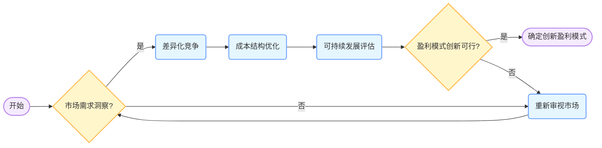

# 彼得林奇对公司盈利模式创新的判断

> 关键词：彼得林奇、公司盈利模式、创新判断、投资分析、财务指标

> 摘要：本文聚焦于彼得林奇对公司盈利模式创新的判断方法。通过深入剖析彼得林奇的投资理念和分析方法，探讨如何识别公司盈利模式的创新点及其对公司未来发展和投资价值的影响。文章首先介绍背景知识，包括目的、预期读者等；接着阐述核心概念，展示相关架构图和流程图；详细讲解核心算法原理及操作步骤，结合Python代码示例；分析数学模型和公式并举例说明；通过项目实战给出代码案例及解读；探讨实际应用场景；推荐学习、开发工具等资源；最后总结未来发展趋势与挑战，解答常见问题并提供参考资料，旨在为投资者和企业管理者提供全面且深入的见解。

## 1. 背景介绍 
### 1.1 目的和范围
本文章的目的是深入探讨彼得林奇在投资过程中对公司盈利模式创新的判断方法和思路。彼得林奇作为投资界的传奇人物，其投资策略和对公司的分析方法一直备受关注。通过研究他对公司盈利模式创新的判断，我们可以学习到如何评估一家公司的潜在价值和未来发展前景。文章的范围将涵盖彼得林奇的投资理念、他所关注的公司盈利模式创新的关键要素、具体的分析方法以及这些方法在实际投资中的应用。

### 1.2 预期读者
本文预期读者主要包括投资者，无论是个人投资者还是专业投资机构的从业者，他们希望从彼得林奇的经验中获取投资灵感和分析方法，以提高投资决策的准确性。同时，企业管理者也可以从中学到如何从投资者的角度审视公司的盈利模式，发现创新点并进行改进，以提升公司的市场竞争力和价值。此外，对金融投资和企业管理感兴趣的学生和研究人员也可以通过本文了解相关领域的知识和研究方法。

### 1.3 文档结构概述
本文将按照以下结构进行组织：首先介绍核心概念与联系，明确相关术语和概念，并通过文本示意图和Mermaid流程图展示核心概念的架构；接着详细阐述核心算法原理和具体操作步骤，结合Python代码进行说明；然后分析数学模型和公式，并通过具体例子进行讲解；随后进行项目实战，给出代码实际案例并详细解释；探讨实际应用场景；推荐学习、开发等相关工具和资源；总结未来发展趋势与挑战；解答常见问题；最后提供扩展阅读和参考资料。

### 1.4 术语表
#### 1.4.1 核心术语定义
- **盈利模式**：指企业通过何种方式获取收入并实现盈利的商业逻辑和运营方式。它描述了企业如何为客户创造价值，并将这种价值转化为经济收益。
- **盈利模式创新**：企业对现有的盈利模式进行改进、变革或创造全新的盈利模式，以提高盈利能力、增强市场竞争力或开拓新的市场空间。
- **投资价值**：指公司对于投资者而言所具有的潜在价值，通常基于公司的财务状况、盈利前景、市场竞争力等因素来评估。

#### 1.4.2 相关概念解释
- **护城河**：由巴菲特提出的概念，指企业所拥有的一种可持续的竞争优势，能够保护企业的市场份额和盈利能力，使其在长期竞争中脱颖而出。在判断公司盈利模式创新时，护城河是一个重要的考虑因素，创新的盈利模式有助于企业构建或强化自身的护城河。
- **现金流**：企业在一定时期内现金的流入和流出情况。正的现金流表明企业有足够的现金来维持运营、偿还债务和进行投资，是评估公司财务健康状况和盈利模式有效性的重要指标。

#### 1.4.3 缩略词列表
- **EPS**：Earnings Per Share，每股收益，是指普通股股东每持有一股所能享有的企业净利润或需承担的企业净亏损。它是衡量公司盈利能力的重要指标之一。
- **ROE**：Return on Equity，净资产收益率，是净利润与平均股东权益的百分比，反映了股东权益的收益水平，用以衡量公司运用自有资本的效率。

## 2. 核心概念与联系 

### 核心概念原理
彼得林奇在判断公司盈利模式创新时，主要基于以下几个核心概念：

- **市场需求洞察**：了解市场的需求变化和趋势是盈利模式创新的基础。企业需要敏锐地捕捉到消费者的新需求、未被满足的需求或潜在需求，并通过创新的盈利模式来满足这些需求。例如，随着互联网的普及和消费者对便捷购物的需求增加，电子商务企业应运而生，通过线上销售的盈利模式满足了消费者的需求。
- **差异化竞争**：创新的盈利模式应该能够使企业在市场中形成差异化竞争优势。企业可以通过提供独特的产品或服务、采用不同的定价策略、建立特殊的销售渠道等方式来实现差异化。例如，苹果公司通过将硬件、软件和服务相结合的盈利模式，为消费者提供了独特的用户体验，从而在智能手机市场中脱颖而出。
- **成本结构优化**：盈利模式创新也包括对成本结构的优化。企业可以通过降低生产成本、提高运营效率、减少不必要的开支等方式来降低成本，从而提高盈利能力。例如，戴尔公司通过直销模式，减少了中间环节，降低了销售成本，提高了产品的性价比。
- **可持续发展**：创新的盈利模式应该具有可持续性，能够在长期内为企业带来稳定的收益。这要求企业考虑到市场的变化、竞争对手的反应以及自身的资源和能力等因素，确保盈利模式的稳定性和适应性。

### 架构的文本示意图
```plaintext
彼得林奇对公司盈利模式创新的判断
|--市场需求洞察
|   |--消费者需求分析
|   |--市场趋势研究
|--差异化竞争
|   |--产品/服务差异化
|   |--定价策略差异化
|   |--销售渠道差异化
|--成本结构优化
|   |--生产成本降低
|   |--运营效率提高
|   |--开支减少
|--可持续发展
|   |--市场变化应对
|   |--竞争对手反应
|   |--自身资源和能力匹配
```

### Mermaid 流程图


## 3. 核心算法原理 & 具体操作步骤 

### 核心算法原理
彼得林奇判断公司盈利模式创新的核心算法原理可以概括为综合评估公司的多个方面因素，通过建立一套指标体系来衡量公司盈利模式的创新性和可行性。主要考虑的因素包括市场需求、竞争优势、成本结构和可持续发展等。具体来说，可以通过以下几个步骤来实现：

1. **数据收集**：收集公司的财务报表、市场调研报告、行业分析数据等相关信息，这些数据将作为后续分析的基础。
2. **指标计算**：根据收集到的数据，计算一系列关键指标，如EPS、ROE、毛利率、净利率等，以评估公司的盈利能力和财务状况。
3. **创新评估**：通过对市场需求、竞争优势、成本结构和可持续发展等方面的分析，评估公司盈利模式的创新性。可以采用定性和定量相结合的方法，例如通过市场调研了解消费者对公司产品或服务的满意度和需求变化，通过财务分析比较公司与竞争对手的成本结构和盈利能力。
4. **综合判断**：根据指标计算和创新评估的结果，综合判断公司盈利模式创新的可行性和潜在价值。可以采用打分法或加权平均法等方法，对各个因素进行综合评估，得出最终的判断结果。

### 具体操作步骤及Python代码示例
以下是一个使用Python实现的简单示例，展示如何计算一些关键指标来评估公司的盈利能力：

```python
import pandas as pd

# 假设我们有一个包含公司财务数据的CSV文件，文件名为 'financial_data.csv'
# 文件包含以下列：'revenue'（收入）、'cost_of_goods_sold'（商品销售成本）、'net_income'（净利润）、'total_equity'（股东权益）、'shares_outstanding'（流通股数）

# 读取数据
data = pd.read_csv('financial_data.csv')

# 计算毛利率
data['gross_margin'] = (data['revenue'] - data['cost_of_goods_sold']) / data['revenue']

# 计算净利率
data['net_profit_margin'] = data['net_income'] / data['revenue']

# 计算每股收益（EPS）
data['EPS'] = data['net_income'] / data['shares_outstanding']

# 计算净资产收益率（ROE）
data['ROE'] = data['net_income'] / data['total_equity']

# 打印计算结果
print(data[['gross_margin', 'net_profit_margin', 'EPS', 'ROE']])
```

在这个示例中，我们首先使用`pandas`库读取包含公司财务数据的CSV文件。然后，根据财务数据计算了毛利率、净利率、每股收益和净资产收益率等关键指标。最后，打印出计算结果，以便进行进一步的分析。

## 4. 数学模型和公式 & 详细讲解 & 举例说明 

### 数学模型和公式
- **毛利率（Gross Margin）**：
  $$Gross\ Margin = \frac{Revenue - Cost\ of\ Goods\ Sold}{Revenue}$$
  毛利率反映了公司在扣除直接成本后剩余的利润空间，是衡量公司盈利能力的重要指标之一。较高的毛利率意味着公司在生产和销售过程中具有较强的成本控制能力或产品定价能力。

- **净利率（Net Profit Margin）**：
  $$Net\ Profit\ Margin = \frac{Net\ Income}{Revenue}$$
  净利率表示公司在扣除所有成本和费用后，每单位收入所获得的净利润。它综合考虑了公司的经营效率和成本管理水平，是评估公司盈利能力的核心指标之一。

- **每股收益（EPS）**：
  $$EPS = \frac{Net\ Income}{Shares\ Outstanding}$$
  每股收益反映了普通股股东每持有一股所能享有的企业净利润。它是衡量公司盈利能力和股东回报的重要指标，通常被投资者用来比较不同公司的投资价值。

- **净资产收益率（ROE）**：
  $$ROE = \frac{Net\ Income}{Average\ Shareholders'\ Equity}$$
  净资产收益率衡量了公司运用自有资本的效率，反映了股东权益的收益水平。较高的ROE表明公司能够有效地利用股东投入的资金创造利润。

### 详细讲解
- **毛利率**：毛利率的高低取决于公司的产品或服务类型、市场竞争状况和成本管理能力。例如，奢侈品行业的毛利率通常较高，因为其产品具有较高的品牌价值和定价权；而制造业的毛利率则相对较低，因为面临着激烈的市场竞争和成本压力。
- **净利率**：净利率受到多种因素的影响，包括毛利率、运营费用、财务费用和税收等。一家公司即使毛利率较高，但如果运营费用过高，也可能导致净利率较低。因此，在分析净利率时，需要综合考虑公司的各项成本和费用。
- **每股收益**：每股收益是投资者关注的重点指标之一，它直接影响到股票的价格和股息分配。较高的每股收益通常意味着公司具有较强的盈利能力和较好的发展前景，从而吸引更多的投资者。
- **净资产收益率**：ROE是评估公司股东权益回报的重要指标，它反映了公司的盈利能力和资本运营效率。一家公司的ROE持续高于行业平均水平，说明其在利用股东资金创造价值方面表现出色。

### 举例说明
假设公司A和公司B的财务数据如下：

| 公司 | 收入（万元） | 商品销售成本（万元） | 净利润（万元） | 股东权益（万元） | 流通股数（万股） |
| ---- | ---- | ---- | ---- | ---- | ---- |
| A | 1000 | 600 | 200 | 800 | 100 |
| B | 1500 | 900 | 300 | 1200 | 150 |

- **毛利率计算**：
  - 公司A的毛利率：$Gross\ Margin_A = \frac{1000 - 600}{1000} = 0.4$ 或 40%
  - 公司B的毛利率：$Gross\ Margin_B = \frac{1500 - 900}{1500} = 0.4$ 或 40%
  两家公司的毛利率相同，说明它们在扣除直接成本后剩余的利润空间相当。

- **净利率计算**：
  - 公司A的净利率：$Net\ Profit\ Margin_A = \frac{200}{1000} = 0.2$ 或 20%
  - 公司B的净利率：$Net\ Profit\ Margin_B = \frac{300}{1500} = 0.2$ 或 20%
  两家公司的净利率也相同，表明它们在扣除所有成本和费用后，每单位收入所获得的净利润相同。

- **每股收益计算**：
  - 公司A的每股收益：$EPS_A = \frac{200}{100} = 2$（元/股）
  - 公司B的每股收益：$EPS_B = \frac{300}{150} = 2$（元/股）
  两家公司的每股收益相等，意味着普通股股东每持有一股所能享有的企业净利润相同。

- **净资产收益率计算**：
  - 公司A的净资产收益率：$ROE_A = \frac{200}{800} = 0.25$ 或 25%
  - 公司B的净资产收益率：$ROE_B = \frac{300}{1200} = 0.25$ 或 25%
  两家公司的ROE相同，说明它们在利用股东资金创造利润方面的效率相当。

## 5. 项目实战：代码实际案例和详细解释说明 

### 5.1  开发环境搭建
在进行项目实战之前，需要搭建相应的开发环境。以下是具体的步骤：

1. **安装Python**：可以从Python官方网站（https://www.python.org/downloads/）下载并安装适合你操作系统的Python版本。建议安装Python 3.x版本。
2. **安装必要的库**：在本项目中，我们将使用`pandas`库进行数据处理和分析，使用`matplotlib`库进行数据可视化。可以使用以下命令来安装这些库：
```sh
pip install pandas matplotlib
```
3. **准备数据**：假设我们有一个包含多家公司财务数据的CSV文件，文件名为`company_financial_data.csv`，文件包含以下列：`company_name`（公司名称）、`revenue`（收入）、`cost_of_goods_sold`（商品销售成本）、`net_income`（净利润）、`total_equity`（股东权益）、`shares_outstanding`（流通股数）。

### 5.2  源代码详细实现和代码解读
```python
import pandas as pd
import matplotlib.pyplot as plt

# 读取数据
data = pd.read_csv('company_financial_data.csv')

# 计算关键指标
data['gross_margin'] = (data['revenue'] - data['cost_of_goods_sold']) / data['revenue']
data['net_profit_margin'] = data['net_income'] / data['revenue']
data['EPS'] = data['net_income'] / data['shares_outstanding']
data['ROE'] = data['net_income'] / data['total_equity']

# 筛选出盈利能力较强的公司（假设毛利率大于30%，净利率大于15%）
profitable_companies = data[(data['gross_margin'] > 0.3) & (data['net_profit_margin'] > 0.15)]

# 按ROE降序排序
sorted_companies = profitable_companies.sort_values(by='ROE', ascending=False)

# 选取排名前5的公司
top_5_companies = sorted_companies.head(5)

# 可视化排名前5的公司的ROE
plt.bar(top_5_companies['company_name'], top_5_companies['ROE'])
plt.xlabel('Company Name')
plt.ylabel('ROE')
plt.title('Top 5 Companies with Highest ROE')
plt.xticks(rotation=45)
plt.show()
```

### 代码解读与分析
1. **数据读取**：使用`pandas`库的`read_csv`函数读取包含公司财务数据的CSV文件，并将数据存储在`data`变量中。
2. **指标计算**：根据前面介绍的公式，计算每家公司的毛利率、净利率、每股收益和净资产收益率，并将计算结果添加到数据框中。
3. **筛选盈利能力较强的公司**：使用布尔索引筛选出毛利率大于30%且净利率大于15%的公司，将筛选结果存储在`profitable_companies`变量中。
4. **排序和选取前5的公司**：使用`sort_values`函数按ROE降序排序`profitable_companies`数据框，并选取排名前5的公司，将结果存储在`top_5_companies`变量中。
5. **数据可视化**：使用`matplotlib`库的`bar`函数绘制排名前5的公司的ROE柱状图，直观地展示这些公司的盈利能力。

通过这个项目实战，我们可以学习到如何使用Python进行数据处理、指标计算和数据可视化，以及如何根据财务指标筛选出盈利能力较强的公司。

## 6. 实际应用场景 
### 投资决策
投资者可以运用彼得林奇对公司盈利模式创新的判断方法来评估潜在的投资对象。通过分析公司的盈利模式是否具有创新性和可持续性，以及计算关键财务指标，投资者可以判断公司的投资价值和未来发展前景。例如，如果一家公司通过创新的盈利模式成功开拓了新的市场，并且其毛利率、净利率和ROE等指标呈现上升趋势，那么该公司可能具有较高的投资价值。

### 企业战略规划
企业管理者可以借鉴彼得林奇的分析方法，审视公司现有的盈利模式，发现其中的问题和不足，并寻找创新的机会。通过对市场需求、竞争优势和成本结构的分析，企业可以制定出更具竞争力的战略规划，优化盈利模式，提高盈利能力和市场竞争力。例如，企业可以根据市场需求的变化，推出新的产品或服务，并采用新的盈利模式来满足消费者的需求。

### 行业研究
研究人员可以使用彼得林奇的方法对某个行业内的公司进行分析，了解行业的发展趋势和竞争格局。通过比较不同公司的盈利模式和财务指标，研究人员可以找出行业内的领先企业和具有创新潜力的公司，为行业的发展提供参考和建议。例如，在研究互联网行业时，可以分析不同电商平台的盈利模式创新情况，以及它们对行业发展的影响。

## 7. 工具和资源推荐
### 7.1 学习资源推荐
#### 7.1.1 书籍推荐
- 《彼得林奇的成功投资》：彼得林奇的经典著作，详细介绍了他的投资理念和方法，包括如何选择股票、分析公司等内容。
- 《聪明的投资者》：本杰明·格雷厄姆的代表作，被誉为投资界的圣经。书中阐述了价值投资的基本原理和方法，对投资者具有重要的指导意义。
- 《财务报表分析与证券定价》：全面介绍了财务报表分析的方法和技巧，以及如何运用财务报表分析来评估公司的投资价值。

#### 7.1.2 在线课程
- Coursera上的“投资学原理”：由知名大学教授授课，系统地介绍了投资学的基本原理和方法，包括股票投资、债券投资等内容。
- edX上的“财务报表分析”：提供了深入的财务报表分析课程，帮助学习者掌握财务报表的解读和分析技巧。

#### 7.1.3 技术博客和网站
- 雪球网：国内知名的投资社区，提供了丰富的股票分析、投资策略和财经资讯等内容。
- Seeking Alpha：国外知名的投资研究网站，汇聚了众多专业投资者和分析师的观点和研究报告。

### 7.2 开发工具框架推荐
#### 7.2.1 IDE和编辑器
- PyCharm：一款专业的Python集成开发环境，提供了丰富的代码编辑、调试和项目管理功能，适合Python开发。
- Jupyter Notebook：一个交互式的编程环境，支持多种编程语言，特别适合数据科学和数据分析任务。

#### 7.2.2 调试和性能分析工具
- pdb：Python自带的调试工具，可以帮助开发者逐行调试代码，查找和解决问题。
- cProfile：Python的性能分析工具，可以分析代码的运行时间和函数调用情况，帮助开发者优化代码性能。

#### 7.2.3 相关框架和库
- pandas：用于数据处理和分析的Python库，提供了高效的数据结构和数据分析工具。
- matplotlib：用于数据可视化的Python库，可以绘制各种类型的图表和图形。

### 7.3 相关论文著作推荐
#### 7.3.1 经典论文
- Fama, E. F., & French, K. R. (1992). The cross-section of expected stock returns. Journal of Finance, 47(2), 427-465. 该论文提出了著名的Fama-French三因子模型，对股票收益率的影响因素进行了深入研究。
- Modigliani, F., & Miller, M. H. (1958). The cost of capital, corporation finance and the theory of investment. American Economic Review, 48(3), 261-297. 该论文提出了Modigliani-Miller定理，对企业资本结构和价值的关系进行了开创性的研究。

#### 7.3.2 最新研究成果
- 可以关注顶级金融学术期刊，如Journal of Financial Economics、Review of Financial Studies等，获取最新的投资和财务研究成果。

#### 7.3.3 应用案例分析
- Harvard Business Review上经常发表一些关于企业盈利模式创新和投资案例的分析文章，可以从中学习到实际的应用经验和分析方法。

## 8. 总结：未来发展趋势与挑战
### 未来发展趋势
- **数字化转型加速**：随着信息技术的不断发展，越来越多的公司将进行数字化转型，创新盈利模式。例如，传统制造业企业可能会通过引入物联网、大数据和人工智能等技术，实现智能制造和服务化转型，从而创造新的收入来源。
- **共享经济和平台经济的发展**：共享经济和平台经济模式将继续发展壮大，为企业提供新的盈利机会。例如，共享出行、共享住宿等领域的企业通过整合资源和优化运营，实现了快速发展。同时，平台企业通过构建生态系统，连接供需双方，创造了新的价值和盈利模式。
- **可持续发展成为重要因素**：消费者和投资者对企业的可持续发展越来越关注，企业的盈利模式创新也将更多地考虑环境保护、社会责任等因素。例如，一些企业通过推出环保产品和服务，满足消费者的需求，同时也提高了企业的社会形象和竞争力。

### 挑战
- **技术创新的不确定性**：虽然技术创新为企业盈利模式创新提供了机遇，但也带来了不确定性。新技术的发展速度和应用效果难以预测，企业在进行技术创新时可能面临研发失败、市场接受度低等风险。
- **竞争加剧**：随着盈利模式创新的普及，市场竞争将更加激烈。企业需要不断创新和优化自己的盈利模式，以保持竞争优势。同时，新进入者也可能通过创新的盈利模式挑战现有企业的市场地位。
- **法律法规和监管的挑战**：盈利模式创新可能会涉及到一些法律法规和监管问题。例如，共享经济模式可能会面临交通、住宿等行业的监管限制；金融科技企业可能会面临金融监管的挑战。企业需要密切关注法律法规的变化，确保自己的盈利模式合法合规。

## 9. 附录：常见问题与解答
### 问题1：如何判断一个公司的盈利模式是否具有创新性？
解答：可以从市场需求洞察、差异化竞争、成本结构优化和可持续发展等方面进行判断。具体来说，观察公司是否能够捕捉到市场的新需求并提供相应的产品或服务；是否具有独特的竞争优势，如产品差异化、定价策略差异化等；是否能够优化成本结构，提高盈利能力；以及盈利模式是否具有可持续性，能够在长期内为企业带来稳定的收益。

### 问题2：财务指标在判断公司盈利模式创新中起到什么作用？
解答：财务指标是判断公司盈利模式创新的重要依据之一。通过计算和分析关键财务指标，如毛利率、净利率、每股收益和净资产收益率等，可以了解公司的盈利能力、财务状况和经营效率。如果公司的盈利模式具有创新性，通常会在财务指标上有所体现，例如毛利率和净利率的提高、每股收益的增长等。

### 问题3：在实际投资中，如何结合彼得林奇的方法进行决策？
解答：在实际投资中，可以首先运用彼得林奇的方法对潜在的投资对象进行筛选和分析，评估公司的盈利模式创新情况和投资价值。然后，结合自己的投资目标、风险承受能力和投资期限等因素，制定合理的投资策略。同时，需要注意分散投资风险，避免过度集中投资于某一家公司或某一个行业。

## 10. 扩展阅读 & 参考资料
### 扩展阅读
- 《怎样选择成长股》：菲利普·费雪的经典著作，介绍了如何选择具有成长潜力的股票，对投资者具有重要的参考价值。
- 《巴菲特致股东的信：股份公司教程》：沃伦·巴菲特每年写给股东的信，包含了他的投资理念、经营哲学和对市场的看法，是学习价值投资的宝贵资料。

### 参考资料
- Lynch, P., & Rothchild, J. (1989). One Up on Wall Street: How to Use What You Already Know to Make Money in the Market. Simon & Schuster.
- Graham, B. (2003). The Intelligent Investor: The Definitive Book on Value Investing. HarperBusiness.
- Koller, T., Goedhart, M., & Wessels, D. (2015). Valuation: Measuring and Managing the Value of Companies. Wiley.

作者：AI天才研究院/AI Genius Institute & 禅与计算机程序设计艺术 /Zen And The Art of Computer Programming