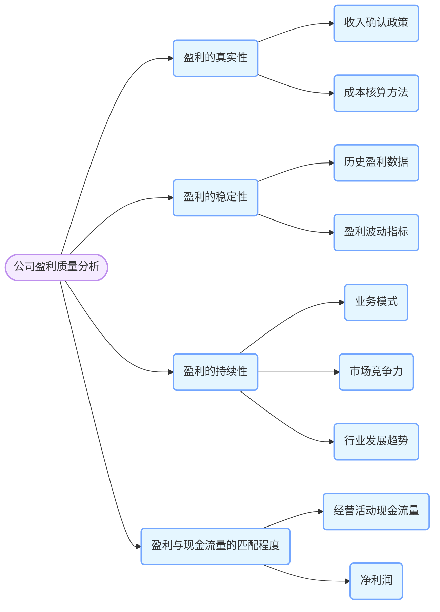

# 彼得林奇对公司盈利质量的分析

> 关键词：彼得林奇、公司盈利质量、财务分析、投资策略、成长型公司

> 摘要：本文深入探讨了彼得林奇对公司盈利质量的分析方法。彼得林奇作为投资界的传奇人物，其投资理念和分析方法对投资者具有重要的指导意义。文章首先介绍了研究此主题的背景，包括目的、预期读者等内容。接着阐述了与公司盈利质量相关的核心概念及它们之间的联系，并通过流程图进行直观展示。详细讲解了彼得林奇分析公司盈利质量的核心算法原理，结合Python代码进行说明。运用数学模型和公式对盈利质量分析进行深入剖析，并举例说明。通过项目实战，搭建开发环境，给出实际代码案例并进行解读。分析了盈利质量分析在实际投资中的应用场景，推荐了相关的学习资源、开发工具框架以及论文著作。最后总结了未来公司盈利质量分析的发展趋势与挑战，解答常见问题，并提供扩展阅读和参考资料，旨在帮助投资者更好地理解和运用彼得林奇的方法进行公司盈利质量分析，做出更明智的投资决策。

## 1. 背景介绍 
### 1.1 目的和范围
彼得林奇是投资领域的杰出代表，他管理的麦哲伦基金创造了惊人的业绩。研究彼得林奇对公司盈利质量的分析方法，目的在于深入挖掘其投资智慧，为投资者提供一套系统、有效的评估公司盈利状况的方法。范围涵盖了彼得林奇在其著作和投资实践中所涉及的各种与公司盈利质量相关的因素，包括财务指标、业务模式、行业竞争等方面的分析。

### 1.2 预期读者
本文预期读者包括广大的个人投资者，无论是初入投资领域的新手，还是有一定经验的投资者，都可以从彼得林奇的分析方法中获得启示。同时，专业的投资分析师、基金经理等金融从业者也能通过本文进一步深入理解彼得林奇的投资理念，完善自己的分析体系。此外，对财务分析和投资学感兴趣的学生和研究人员也可以将本文作为学习和研究的参考资料。

### 1.3 文档结构概述
本文将按照以下结构进行阐述：首先介绍与公司盈利质量分析相关的核心概念及其联系，通过文本示意图和流程图进行直观展示；接着详细讲解彼得林奇分析公司盈利质量的核心算法原理，并给出Python代码实现；运用数学模型和公式对盈利质量分析进行量化分析，并举例说明；通过项目实战，搭建开发环境，给出实际代码案例并进行详细解读；分析盈利质量分析在实际投资中的应用场景；推荐相关的学习资源、开发工具框架以及论文著作；最后总结未来公司盈利质量分析的发展趋势与挑战，解答常见问题，并提供扩展阅读和参考资料。

### 1.4 术语表
#### 1.4.1 核心术语定义
- **盈利质量**：指公司盈利的真实性、稳定性、持续性以及与现金流量的匹配程度。高质量的盈利意味着公司的盈利是真实可靠的，具有较好的稳定性和持续性，并且能够转化为实际的现金流入。
- **自由现金流**：公司经营活动产生的现金流量扣除资本性支出后的剩余现金流量，它反映了公司在不影响正常经营和未来发展的前提下，可自由支配的现金数量。
- **市盈率（P/E）**：股票价格与每股盈利的比率，用于衡量股票的估值水平。较低的市盈率可能表示股票被低估，具有投资价值。
- **市净率（P/B）**：股票价格与每股净资产的比率，反映了市场对公司净资产的估值。市净率较低的股票可能具有一定的安全边际。

#### 1.4.2 相关概念解释
- **财务报表**：公司向外界披露其财务状况和经营成果的重要文件，包括资产负债表、利润表和现金流量表。通过分析财务报表，可以了解公司的资产、负债、收入、成本、利润等方面的信息，从而评估公司的盈利质量。
- **行业竞争格局**：指行业内各企业之间的竞争关系和市场份额分布情况。了解行业竞争格局有助于判断公司在行业中的地位和竞争力，进而影响对公司盈利质量的评估。
- **成长型公司**：指那些具有较高的盈利增长速度和发展潜力的公司。成长型公司的盈利质量分析需要关注其增长的可持续性和驱动因素。

#### 1.4.3 缩略词列表
- **P/E**：市盈率（Price-to-Earnings Ratio）
- **P/B**：市净率（Price-to-Book Ratio）
- **FCF**：自由现金流（Free Cash Flow）

## 2. 核心概念与联系 

### 核心概念原理
彼得林奇对公司盈利质量的分析主要基于以下几个核心概念：

#### 盈利的真实性
盈利的真实性是指公司报告的盈利是否真实反映了其实际经营成果。这需要关注公司的收入确认政策、成本核算方法等是否合理。例如，一些公司可能通过提前确认收入或推迟确认成本来虚增盈利，这种盈利是不真实的，会影响公司的盈利质量。

#### 盈利的稳定性
盈利的稳定性是指公司盈利在不同时期的波动程度。稳定的盈利表明公司的经营状况较为健康，具有较强的抗风险能力。可以通过分析公司过去几年的盈利数据，计算盈利的标准差或变异系数来评估盈利的稳定性。

#### 盈利的持续性
盈利的持续性是指公司未来是否能够保持当前的盈利水平或实现持续增长。这需要关注公司的业务模式、市场竞争力、行业发展趋势等因素。例如，具有独特的技术优势或品牌优势的公司，其盈利的持续性可能较强。

#### 盈利与现金流量的匹配程度
盈利与现金流量的匹配程度是指公司的盈利是否能够转化为实际的现金流入。如果公司的盈利主要是应收账款等非现金资产的增加，而现金流量不足，那么公司的盈利质量可能存在问题。可以通过分析公司的现金流量表，计算经营活动现金流量与净利润的比率来评估盈利与现金流量的匹配程度。

### 架构的文本示意图
```plaintext
公司盈利质量
|-- 盈利的真实性
|   |-- 收入确认政策
|   |-- 成本核算方法
|-- 盈利的稳定性
|   |-- 历史盈利数据
|   |-- 盈利波动指标
|-- 盈利的持续性
|   |-- 业务模式
|   |-- 市场竞争力
|   |-- 行业发展趋势
|-- 盈利与现金流量的匹配程度
|   |-- 经营活动现金流量
|   |-- 净利润
```

### Mermaid 流程图


## 3. 核心算法原理 & 具体操作步骤 

### 盈利稳定性分析算法原理
为了评估公司盈利的稳定性，我们可以计算盈利的变异系数。变异系数是标准差与均值的比值，它反映了数据的相对离散程度。变异系数越小，说明盈利的稳定性越好。

以下是使用Python实现盈利稳定性分析的代码：
```python
import numpy as np

def calculate_coefficient_of_variation(earnings):
    """
    计算盈利的变异系数
    :param earnings: 盈利数据列表
    :return: 变异系数
    """
    mean_earnings = np.mean(earnings)
    std_earnings = np.std(earnings)
    coefficient_of_variation = std_earnings / mean_earnings
    return coefficient_of_variation

# 示例盈利数据
earnings = [100, 110, 120, 105, 115]
cv = calculate_coefficient_of_variation(earnings)
print(f"盈利的变异系数为: {cv}")
```
### 操作步骤
1. 收集公司过去几年的盈利数据，存储在一个列表中。
2. 调用`calculate_coefficient_of_variation`函数，将盈利数据列表作为参数传入。
3. 函数返回盈利的变异系数，根据变异系数的大小评估公司盈利的稳定性。

### 盈利与现金流量匹配程度分析算法原理
为了评估盈利与现金流量的匹配程度，我们可以计算经营活动现金流量与净利润的比率。该比率越接近1，说明盈利与现金流量的匹配程度越好。

以下是使用Python实现盈利与现金流量匹配程度分析的代码：
```python
def calculate_cash_flow_to_net_income_ratio(cash_flow, net_income):
    """
    计算经营活动现金流量与净利润的比率
    :param cash_flow: 经营活动现金流量
    :param net_income: 净利润
    :return: 比率
    """
    ratio = cash_flow / net_income
    return ratio

# 示例数据
cash_flow = 150
net_income = 120
ratio = calculate_cash_flow_to_net_income_ratio(cash_flow, net_income)
print(f"经营活动现金流量与净利润的比率为: {ratio}")
```
### 操作步骤
1. 获取公司的经营活动现金流量和净利润数据。
2. 调用`calculate_cash_flow_to_net_income_ratio`函数，将经营活动现金流量和净利润作为参数传入。
3. 函数返回经营活动现金流量与净利润的比率，根据比率的大小评估盈利与现金流量的匹配程度。

## 4. 数学模型和公式 & 详细讲解 & 举例说明 

### 盈利稳定性分析的数学模型和公式
#### 均值公式
均值是一组数据的平均值，计算公式为：
$$\bar{x} = \frac{1}{n} \sum_{i=1}^{n} x_i$$
其中，$\bar{x}$ 表示均值，$n$ 表示数据的个数，$x_i$ 表示第 $i$ 个数据。

#### 标准差公式
标准差是衡量数据离散程度的指标，计算公式为：
$$\sigma = \sqrt{\frac{1}{n} \sum_{i=1}^{n} (x_i - \bar{x})^2}$$
其中，$\sigma$ 表示标准差。

#### 变异系数公式
变异系数是标准差与均值的比值，计算公式为：
$$CV = \frac{\sigma}{\bar{x}}$$
其中，$CV$ 表示变异系数。

### 详细讲解
均值反映了数据的集中趋势，标准差反映了数据的离散程度。变异系数则是将标准差标准化，消除了数据量级的影响，更适合用于比较不同数据集的离散程度。在盈利稳定性分析中，变异系数越小，说明公司盈利的波动越小，稳定性越好。

### 举例说明
假设公司A过去5年的盈利数据分别为100、110、120、105、115，我们可以按照以下步骤计算其盈利的变异系数：
1. 计算均值：
$$\bar{x} = \frac{100 + 110 + 120 + 105 + 115}{5} = 110$$
2. 计算标准差：
$$\sigma = \sqrt{\frac{(100 - 110)^2 + (110 - 110)^2 + (120 - 110)^2 + (105 - 110)^2 + (115 - 110)^2}{5}} \approx 6.71$$
3. 计算变异系数：
$$CV = \frac{6.71}{110} \approx 0.061$$

### 盈利与现金流量匹配程度分析的数学模型和公式
#### 经营活动现金流量与净利润比率公式
经营活动现金流量与净利润的比率计算公式为：
$$Ratio = \frac{CF}{NI}$$
其中，$Ratio$ 表示经营活动现金流量与净利润的比率，$CF$ 表示经营活动现金流量，$NI$ 表示净利润。

### 详细讲解
该比率反映了公司盈利转化为现金流量的能力。如果比率接近1，说明公司的盈利大部分能够转化为现金流入，盈利质量较高；如果比率远小于1，说明公司的盈利可能存在较多的应收账款等非现金资产，盈利质量可能存在问题。

### 举例说明
假设公司B的经营活动现金流量为150万元，净利润为120万元，则其经营活动现金流量与净利润的比率为：
$$Ratio = \frac{150}{120} = 1.25$$
这表明公司B的盈利转化为现金流量的能力较强，盈利质量较好。

## 5. 项目实战：代码实际案例和详细解释说明 

### 5.1  开发环境搭建
为了完成本项目实战，我们需要搭建以下开发环境：
1. **Python环境**：建议使用Python 3.7及以上版本。可以从Python官方网站（https://www.python.org/downloads/）下载并安装。
2. **开发工具**：推荐使用PyCharm或Jupyter Notebook。PyCharm是一款功能强大的Python集成开发环境，适合开发大型项目；Jupyter Notebook则是一个交互式的开发环境，适合进行数据分析和代码演示。
3. **所需库**：我们需要安装`pandas`和`numpy`库。可以使用以下命令进行安装：
```sh
pip install pandas numpy
```

### 5.2  源代码详细实现和代码解读
以下是一个完整的项目实战代码，用于分析公司的盈利质量：
```python
import pandas as pd
import numpy as np

def calculate_coefficient_of_variation(earnings):
    """
    计算盈利的变异系数
    :param earnings: 盈利数据列表
    :return: 变异系数
    """
    mean_earnings = np.mean(earnings)
    std_earnings = np.std(earnings)
    coefficient_of_variation = std_earnings / mean_earnings
    return coefficient_of_variation

def calculate_cash_flow_to_net_income_ratio(cash_flow, net_income):
    """
    计算经营活动现金流量与净利润的比率
    :param cash_flow: 经营活动现金流量
    :param net_income: 净利润
    :return: 比率
    """
    ratio = cash_flow / net_income
    return ratio

# 读取数据
data = pd.read_csv('company_financial_data.csv')

# 提取盈利数据和现金流量数据
earnings = data['Net Income'].tolist()
cash_flow = data['Operating Cash Flow'].tolist()
net_income = data['Net Income'].tolist()

# 计算盈利的变异系数
cv = calculate_coefficient_of_variation(earnings)
print(f"盈利的变异系数为: {cv}")

# 计算经营活动现金流量与净利润的比率
ratios = []
for cf, ni in zip(cash_flow, net_income):
    ratio = calculate_cash_flow_to_net_income_ratio(cf, ni)
    ratios.append(ratio)

# 输出平均比率
average_ratio = np.mean(ratios)
print(f"经营活动现金流量与净利润的平均比率为: {average_ratio}")
```
### 代码解读
1. **导入必要的库**：导入`pandas`和`numpy`库，用于数据处理和数值计算。
2. **定义函数**：定义`calculate_coefficient_of_variation`函数和`calculate_cash_flow_to_net_income_ratio`函数，分别用于计算盈利的变异系数和经营活动现金流量与净利润的比率。
3. **读取数据**：使用`pandas`的`read_csv`函数读取存储公司财务数据的CSV文件。
4. **提取数据**：从数据中提取盈利数据和现金流量数据，并转换为列表。
5. **计算盈利的变异系数**：调用`calculate_coefficient_of_variation`函数，计算盈利的变异系数并输出结果。
6. **计算经营活动现金流量与净利润的比率**：遍历现金流量数据和净利润数据，调用`calculate_cash_flow_to_net_income_ratio`函数，计算每个时期的比率，并存储在列表中。
7. **输出平均比率**：计算经营活动现金流量与净利润的平均比率并输出结果。

### 5.3  代码解读与分析
通过上述代码，我们可以对公司的盈利质量进行量化分析。盈利的变异系数反映了公司盈利的稳定性，变异系数越小，说明盈利越稳定。经营活动现金流量与净利润的比率反映了公司盈利转化为现金流量的能力，比率越接近1，说明盈利质量越高。

在实际应用中，我们可以根据计算结果对不同公司的盈利质量进行比较，选择盈利质量较高的公司进行投资。同时，我们还可以结合其他因素，如行业竞争格局、公司的发展前景等，进行综合分析，做出更明智的投资决策。

## 6. 实际应用场景 
### 股票投资
在股票投资中，彼得林奇对公司盈利质量的分析方法具有重要的应用价值。投资者可以通过分析公司的盈利质量，筛选出具有投资价值的股票。例如，选择盈利稳定、盈利与现金流量匹配程度高的公司股票进行投资，降低投资风险，提高投资回报率。

### 基金投资
基金经理在选择投资标的时，也可以运用彼得林奇的分析方法对上市公司进行评估。通过对公司盈利质量的分析，选择优质的上市公司纳入基金投资组合，提高基金的业绩表现。

### 企业并购
在企业并购过程中，收购方需要对目标企业的盈利质量进行深入分析。了解目标企业的盈利真实性、稳定性和持续性，以及盈利与现金流量的匹配程度，有助于评估目标企业的价值，制定合理的并购价格。

### 银行信贷
银行在发放贷款时，需要评估企业的还款能力。通过分析企业的盈利质量，银行可以了解企业的经营状况和财务实力，判断企业是否有足够的现金流来偿还贷款，从而降低信贷风险。

## 7. 工具和资源推荐
### 7.1 学习资源推荐
#### 7.1.1 书籍推荐
- 《彼得林奇的成功投资》：彼得林奇的经典著作，详细介绍了他的投资理念和方法，包括对公司盈利质量的分析。
- 《财务报表分析与股票估值》：本书系统地介绍了财务报表分析的方法和技巧，以及如何运用财务报表分析进行股票估值，对理解公司盈利质量分析具有重要的参考价值。
- 《聪明的投资者》：本杰明·格雷厄姆的经典著作，阐述了价值投资的理念和方法，对投资者的思维方式和投资决策具有深远的影响。

#### 7.1.2 在线课程
- Coursera上的“财务分析与决策”课程：由清华大学教授授课，系统地介绍了财务分析的基本原理和方法，包括盈利质量分析。
- edX上的“投资学原理”课程：该课程涵盖了投资学的各个方面，包括股票投资、基金投资等，对理解彼得林奇的投资理念和方法有很大的帮助。

#### 7.1.3 技术博客和网站
- 雪球网：国内知名的投资社区，提供了丰富的股票分析和投资策略分享，投资者可以在上面学习其他投资者的经验和方法。
- 价值投资网：专注于价值投资领域，提供了大量的财务分析和投资研究文章，对理解公司盈利质量分析具有重要的参考价值。

### 7.2 开发工具框架推荐
#### 7.2.1 IDE和编辑器
- PyCharm：功能强大的Python集成开发环境，提供了代码编辑、调试、版本控制等一系列功能，适合开发大型Python项目。
- Jupyter Notebook：交互式的开发环境，支持代码、文本、图表等多种形式的展示，适合进行数据分析和代码演示。

#### 7.2.2 调试和性能分析工具
- pdb：Python自带的调试工具，可以帮助开发者快速定位和解决代码中的问题。
- cProfile：Python的性能分析工具，可以分析代码的运行时间和内存使用情况，帮助开发者优化代码性能。

#### 7.2.3 相关框架和库
- pandas：强大的数据处理和分析库，提供了丰富的数据结构和数据处理函数，适合处理和分析财务数据。
- numpy：高性能的数值计算库，提供了多维数组和各种数学函数，适合进行数值计算和统计分析。

### 7.3 相关论文著作推荐
#### 7.3.1 经典论文
- Ball, R., & Brown, P. (1968). An empirical evaluation of accounting income numbers. Journal of Accounting Research, 6(2), 159-178. 该论文是会计领域的经典之作，对会计盈余的信息含量进行了实证研究，为公司盈利质量分析提供了理论基础。
- Beaver, W. H. (1966). Financial ratios as predictors of failure. Journal of Accounting Research, 4(Supplement), 71-111. 该论文探讨了财务比率在预测企业失败方面的应用，对理解公司盈利质量与企业风险之间的关系具有重要的参考价值。

#### 7.3.2 最新研究成果
- Dechow, P. M., Ge, W., & Schrand, C. M. (2010). Understanding earnings quality: A review of the proxies, their determinants and their consequences. Journal of Accounting and Economics, 50(2-3), 344-401. 该论文对盈利质量的衡量指标、影响因素和经济后果进行了全面的综述，反映了该领域的最新研究成果。
- Khan, M., & Watts, R. L. (2009). Estimation and empirical properties of a firm-year measure of conservatism. Journal of Accounting and Economics, 48(2-3), 132-150. 该论文提出了一种衡量公司会计稳健性的方法，会计稳健性与盈利质量密切相关，对公司盈利质量分析具有重要的启示。

#### 7.3.3 应用案例分析
- Kothari, S. P., Leone, A. J., & Wasley, C. E. (2005). Performance matched discretionary accrual measures. Journal of Accounting and Economics, 39(1), 163-197. 该论文通过实证研究，分析了业绩匹配的操控性应计利润指标在评估公司盈利质量方面的应用，为实际应用提供了案例参考。

## 8. 总结：未来发展趋势与挑战
### 未来发展趋势
#### 数据驱动的分析方法
随着信息技术的发展，越来越多的财务数据和非财务数据可供使用。未来，公司盈利质量分析将更加依赖数据驱动的方法，运用大数据、人工智能等技术，挖掘更多有价值的信息，提高分析的准确性和效率。

#### 综合分析框架的构建
单一的财务指标分析已经不能满足投资者的需求，未来将构建更加综合的分析框架，结合财务指标、非财务指标、行业信息等多方面因素，全面评估公司的盈利质量。

#### 国际化视角的关注
随着经济全球化的发展，跨国公司的数量不断增加。未来，公司盈利质量分析将更加关注国际化视角，考虑不同国家和地区的会计准则、税收政策、市场环境等因素的影响。

### 挑战
#### 数据质量问题
数据质量是影响公司盈利质量分析准确性的关键因素。由于数据来源的多样性和数据采集过程中的误差，可能会导致数据不准确或不完整。因此，如何保证数据的质量是未来面临的一个重要挑战。

#### 模型的复杂性和解释性
为了提高分析的准确性，未来的分析模型可能会越来越复杂。然而，复杂的模型往往缺乏解释性，投资者难以理解模型的结果和决策依据。因此，如何在提高模型准确性的同时，保证模型的解释性是一个需要解决的问题。

#### 行业差异的处理
不同行业的公司具有不同的经营特点和盈利模式，因此在进行盈利质量分析时需要考虑行业差异。如何准确地识别和处理行业差异，制定适合不同行业的分析方法和指标体系，是未来面临的另一个挑战。

## 9. 附录：常见问题与解答
### 问题1：盈利质量分析是否只适用于上市公司？
解答：不是的，盈利质量分析适用于所有类型的企业，包括上市公司和非上市公司。无论是投资者、债权人还是企业管理者，都可以通过分析企业的盈利质量，了解企业的经营状况和财务实力，做出合理的决策。

### 问题2：如何判断盈利的真实性？
解答：判断盈利的真实性需要关注公司的收入确认政策、成本核算方法、关联交易等方面。例如，查看公司的收入是否有相应的合同和发票支持，成本核算是否符合会计准则，关联交易是否存在利益输送等问题。同时，还可以通过分析公司的现金流量表，判断盈利是否能够转化为实际的现金流入。

### 问题3：盈利稳定性和持续性有什么区别？
解答：盈利稳定性是指公司盈利在不同时期的波动程度，主要关注盈利的短期波动情况。而盈利持续性是指公司未来是否能够保持当前的盈利水平或实现持续增长，主要关注盈利的长期发展趋势。一个公司的盈利可能具有较好的稳定性，但不一定具有持续性，例如公司可能通过削减成本等方式在短期内提高盈利，但这种盈利增长可能不可持续。

### 问题4：经营活动现金流量与净利润的比率是否越高越好？
解答：一般来说，经营活动现金流量与净利润的比率越接近1，说明盈利与现金流量的匹配程度越好。但该比率并不是越高越好，如果比率过高，可能意味着公司的应收账款管理不善，或者存在过度投资等问题。因此，需要综合考虑公司的实际情况，对该比率进行合理的分析和判断。

## 10. 扩展阅读 & 参考资料
### 扩展阅读
- 《巴菲特致股东的信：投资者和公司高管教程》：本书收录了巴菲特历年致股东的信，阐述了他的投资理念和管理思想，对投资者具有重要的启示。
- 《金融炼金术》：乔治·索罗斯的经典著作，介绍了他的反身性理论和投资实践，对理解金融市场的运行规律和投资策略具有重要的参考价值。

### 参考资料
- Lynch, P. (1989). One Up on Wall Street: How to Use What You Already Know to Make Money in the Market. Simon & Schuster.
- Damodaran, A. (2012). The Little Book of Valuation: How to Value a Company, Pick a Stock and Profit. Wiley.
- Kieso, D. E., Weygandt, J. J., & Warfield, T. D. (2019). Intermediate Accounting. Wiley.

作者：AI天才研究院/AI Genius Institute & 禅与计算机程序设计艺术 /Zen And The Art of Computer Programming