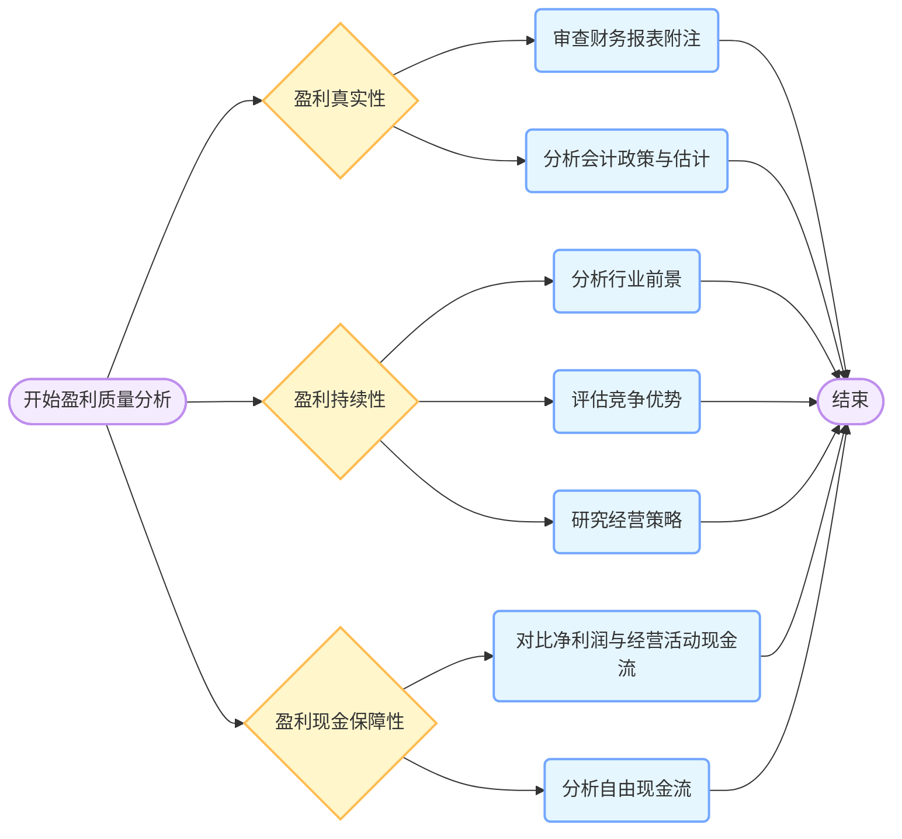

# 彼得林奇对公司盈利质量的分析方法

> 关键词：彼得林奇、公司盈利质量、分析方法、财务分析、投资决策

> 摘要：本文深入探讨了彼得林奇对公司盈利质量的分析方法。彼得林奇作为投资界的传奇人物，其分析方法具有重要的实践价值。文章首先介绍了研究该方法的背景，包括目的、预期读者等内容。接着阐述了核心概念与联系，以清晰的文本示意图和Mermaid流程图展示。详细讲解了核心算法原理及具体操作步骤，并结合Python代码进行说明。同时给出了相关数学模型和公式，辅以举例说明。通过项目实战案例，展示了如何运用该方法进行实际分析。探讨了其在不同场景下的实际应用，推荐了学习该方法所需的工具和资源，最后总结了未来发展趋势与挑战，解答了常见问题，并提供了扩展阅读和参考资料，旨在帮助投资者更好地理解和运用彼得林奇的盈利质量分析方法进行投资决策。

## 1. 背景介绍 
### 1.1 目的和范围
彼得林奇在投资领域取得了巨大的成功，他的投资理念和分析方法备受关注。本文章的目的在于深入剖析彼得林奇对公司盈利质量的分析方法，将其方法进行系统整理和详细解读，使投资者能够更好地理解和运用这些方法来评估公司的盈利质量，从而做出更明智的投资决策。文章的范围涵盖了彼得林奇分析方法的核心概念、算法原理、实际应用以及相关工具和资源等方面。

### 1.2 预期读者
本文的预期读者主要包括广大的投资者，无论是个人投资者还是机构投资者，都可以从本文中获取关于公司盈利质量分析的有价值信息。同时，对于金融专业的学生、研究人员以及对投资分析感兴趣的人士来说，本文也具有一定的参考意义。

### 1.3 文档结构概述
本文将按照以下结构进行组织：首先介绍核心概念与联系，让读者对彼得林奇分析公司盈利质量的基本概念有清晰的认识；接着阐述核心算法原理和具体操作步骤，并通过Python代码进行详细说明；然后给出相关的数学模型和公式，并举例进行讲解；通过项目实战案例，展示该方法在实际中的应用；探讨其在不同场景下的实际应用；推荐学习该方法所需的工具和资源；最后总结未来发展趋势与挑战，解答常见问题，并提供扩展阅读和参考资料。

### 1.4 术语表
#### 1.4.1 核心术语定义
- **盈利质量**：指公司盈利的真实性、持续性、稳定性以及现金保障性等方面的综合表现。高质量的盈利意味着公司的盈利是真实可靠的，能够持续稳定地增长，并且有充足的现金流入作为支撑。
- **自由现金流**：是指公司在满足了运营和资本支出后剩余的现金流量，它反映了公司实际可用于分配给股东、偿还债务或进行再投资的现金数量。
- **市盈率（P/E）**：是指股票价格除以每股收益的比率，它反映了市场对公司盈利的预期和估值水平。
- **市净率（P/B）**：是指股票价格除以每股净资产的比率，它反映了市场对公司净资产的估值水平。

#### 1.4.2 相关概念解释
- **权责发生制**：是会计核算的基础之一，它是以权利和责任的发生来决定收入和费用归属期的一项原则。在权责发生制下，收入和费用的确认与现金的收付不一定同步，这可能导致公司的账面盈利与实际现金流量存在差异。
- **现金流折现模型**：是一种用于评估公司价值的方法，它通过预测公司未来的现金流量，并将其折现到当前时刻，从而得到公司的内在价值。

#### 1.4.3 缩略词列表
- **P/E**：市盈率（Price-to-Earnings Ratio）
- **P/B**：市净率（Price-to-Book Ratio）
- **FCF**：自由现金流（Free Cash Flow）

## 2. 核心概念与联系 
### 核心概念原理
彼得林奇认为，评估公司盈利质量需要综合考虑多个因素。盈利质量不仅仅取决于公司的净利润数字，还与盈利的来源、持续性、现金保障性等密切相关。

#### 盈利的真实性
公司的盈利应该是真实可靠的，不能通过会计手段进行操纵。彼得林奇会关注公司的财务报表附注，检查是否存在不合理的会计政策选择或会计估计变更，以确保盈利数据的真实性。

#### 盈利的持续性
持续稳定的盈利是公司健康发展的重要标志。彼得林奇会分析公司所处的行业前景、竞争优势以及公司的经营策略，判断公司的盈利是否具有可持续性。例如，具有独特品牌、技术壁垒或成本优势的公司，其盈利往往更具有持续性。

#### 盈利的现金保障性
盈利最终要转化为现金才能真正为股东带来价值。彼得林奇非常重视公司的现金流量状况，他会比较公司的净利润和经营活动现金流量，若经营活动现金流量长期低于净利润，可能意味着公司的盈利质量存在问题。

### 架构的文本示意图
```plaintext
盈利质量分析
|-- 盈利真实性
|   |-- 财务报表附注审查
|   |-- 会计政策与估计分析
|-- 盈利持续性
|   |-- 行业前景分析
|   |-- 竞争优势评估
|   |-- 经营策略研究
|-- 盈利现金保障性
|   |-- 净利润与经营活动现金流对比
|   |-- 自由现金流分析
```

### Mermaid流程图


## 3. 核心算法原理 & 具体操作步骤 
### 核心算法原理
彼得林奇分析公司盈利质量的核心算法原理主要基于对公司财务数据的分析和比较。以下是几个关键的算法原理：

#### 净利润与经营活动现金流量比率
该比率用于衡量公司净利润的现金保障性。计算公式为：

$$净利润与经营活动现金流量比率 = \frac{经营活动现金流量}{净利润}$$

若该比率大于1，说明公司的净利润有充足的现金流入作为支撑，盈利质量较高；若该比率小于1，则可能存在盈利质量问题。

#### 自由现金流分析
自由现金流是评估公司财务健康状况和盈利质量的重要指标。自由现金流的计算公式为：

$$自由现金流 = 经营活动现金流量 - 资本支出$$

正的自由现金流表明公司在满足运营和资本支出后还有剩余现金，可用于其他用途，如分红、偿还债务或进行再投资；负的自由现金流则可能意味着公司需要外部融资来维持运营。

### 具体操作步骤
#### 步骤1：收集公司财务报表
收集公司的年度财务报表，包括资产负债表、利润表和现金流量表。这些报表可以从公司的官方网站、证券交易所网站或金融数据提供商处获取。

#### 步骤2：计算关键指标
根据财务报表数据，计算净利润与经营活动现金流量比率、自由现金流等关键指标。

#### 步骤3：分析指标结果
将计算得到的指标与同行业其他公司进行比较，同时分析指标的变化趋势。如果指标表现良好且呈上升趋势，说明公司的盈利质量较高；反之，则需要进一步深入分析原因。

#### 步骤4：综合评估
结合公司的行业前景、竞争优势、经营策略等因素，对公司的盈利质量进行综合评估。

### Python源代码实现
```python
import pandas as pd

def calculate_net_income_cash_flow_ratio(operating_cash_flow, net_income):
    """
    计算净利润与经营活动现金流量比率
    :param operating_cash_flow: 经营活动现金流量
    :param net_income: 净利润
    :return: 净利润与经营活动现金流量比率
    """
    if net_income == 0:
        return 0
    return operating_cash_flow / net_income

def calculate_free_cash_flow(operating_cash_flow, capital_expenditure):
    """
    计算自由现金流
    :param operating_cash_flow: 经营活动现金流量
    :param capital_expenditure: 资本支出
    :return: 自由现金流
    """
    return operating_cash_flow - capital_expenditure

# 示例数据
data = {
    'operating_cash_flow': [1000, 1200, 1500],
    'net_income': [800, 1000, 1300],
    'capital_expenditure': [300, 400, 500]
}
df = pd.DataFrame(data)

# 计算关键指标
df['net_income_cash_flow_ratio'] = df.apply(lambda row: calculate_net_income_cash_flow_ratio(row['operating_cash_flow'], row['net_income']), axis=1)
df['free_cash_flow'] = df.apply(lambda row: calculate_free_cash_flow(row['operating_cash_flow'], row['capital_expenditure']), axis=1)

print(df)
```

## 4. 数学模型和公式 & 详细讲解 & 举例说明 
### 净利润与经营活动现金流量比率
#### 数学公式
$$净利润与经营活动现金流量比率 = \frac{经营活动现金流量}{净利润}$$

#### 详细讲解
该比率反映了公司净利润的现金实现程度。经营活动现金流量是公司通过主营业务实际收到的现金，而净利润是按照权责发生制计算的会计利润。当该比率大于1时，说明公司经营活动产生的现金流量超过了净利润，意味着公司的盈利有较强的现金保障，盈利质量较高；当该比率小于1时，可能存在以下情况：一是公司存在大量的应收账款，销售虽然实现了但现金尚未收回；二是公司可能存在存货积压，占用了大量资金；三是公司可能采用了激进的会计政策，导致净利润虚增。

#### 举例说明
假设公司A的净利润为1000万元，经营活动现金流量为1200万元，则净利润与经营活动现金流量比率为：

$$\frac{1200}{1000} = 1.2$$

这表明公司A的盈利有较好的现金保障，盈利质量较高。

再假设公司B的净利润为800万元，经营活动现金流量为600万元，则净利润与经营活动现金流量比率为：

$$\frac{600}{800} = 0.75$$

这可能意味着公司B的盈利质量存在问题，需要进一步分析其应收账款、存货等情况。

### 自由现金流
#### 数学公式
$$自由现金流 = 经营活动现金流量 - 资本支出$$

#### 详细讲解
自由现金流反映了公司在满足日常运营和资本投资后剩余的现金流量。它是公司真正可自由支配的现金，可用于分红、偿还债务、进行并购等活动。正的自由现金流表示公司有足够的现金来支持自身的发展和回报股东；负的自由现金流则可能意味着公司需要外部融资来维持运营，增加了公司的财务风险。

#### 举例说明
假设公司C的经营活动现金流量为1500万元，资本支出为800万元，则自由现金流为：

$$1500 - 800 = 700$$（万元）

这表明公司C在满足运营和资本支出后还有700万元的剩余现金，财务状况较为健康。

假设公司D的经营活动现金流量为1000万元，资本支出为1200万元，则自由现金流为：

$$1000 - 1200 = -200$$（万元）

这意味着公司D需要外部融资200万元来满足资本支出的需求，存在一定的财务风险。

## 5. 项目实战：代码实际案例和详细解释说明 
### 5.1  开发环境搭建
#### 安装Python
首先需要安装Python编程语言，建议使用Python 3.7及以上版本。可以从Python官方网站（https://www.python.org/downloads/）下载并安装适合自己操作系统的Python版本。

#### 安装必要的库
在本项目中，需要使用`pandas`库进行数据处理和分析。可以使用以下命令来安装`pandas`库：

```sh
pip install pandas
```

### 5.2  源代码详细实现和代码解读
```python
import pandas as pd

def calculate_net_income_cash_flow_ratio(operating_cash_flow, net_income):
    """
    计算净利润与经营活动现金流量比率
    :param operating_cash_flow: 经营活动现金流量
    :param net_income: 净利润
    :return: 净利润与经营活动现金流量比率
    """
    if net_income == 0:
        return 0
    return operating_cash_flow / net_income

def calculate_free_cash_flow(operating_cash_flow, capital_expenditure):
    """
    计算自由现金流
    :param operating_cash_flow: 经营活动现金流量
    :param capital_expenditure: 资本支出
    :return: 自由现金流
    """
    return operating_cash_flow - capital_expenditure

# 模拟从文件中读取公司财务数据
# 假设文件名为 financial_data.csv，包含三列：operating_cash_flow, net_income, capital_expenditure
try:
    df = pd.read_csv('financial_data.csv')
except FileNotFoundError:
    print("文件未找到，请检查文件路径和文件名。")
else:
    # 计算关键指标
    df['net_income_cash_flow_ratio'] = df.apply(lambda row: calculate_net_income_cash_flow_ratio(row['operating_cash_flow'], row['net_income']), axis=1)
    df['free_cash_flow'] = df.apply(lambda row: calculate_free_cash_flow(row['operating_cash_flow'], row['capital_expenditure']), axis=1)

    # 分析指标结果
    high_quality_companies = df[df['net_income_cash_flow_ratio'] > 1]
    low_quality_companies = df[df['net_income_cash_flow_ratio'] < 1]

    print("盈利质量较高的公司：")
    print(high_quality_companies)
    print("盈利质量可能存在问题的公司：")
    print(low_quality_companies)
```

### 5.3  代码解读与分析
#### 函数定义
- `calculate_net_income_cash_flow_ratio`函数：用于计算净利润与经营活动现金流量比率。该函数接受两个参数：经营活动现金流量和净利润，返回计算得到的比率。在计算过程中，若净利润为0，则返回0，以避免除零错误。
- `calculate_free_cash_flow`函数：用于计算自由现金流。该函数接受两个参数：经营活动现金流量和资本支出，返回计算得到的自由现金流。

#### 数据读取
使用`pandas`库的`read_csv`函数从CSV文件中读取公司的财务数据。若文件不存在，则输出错误信息。

#### 指标计算
使用`apply`方法对数据框的每一行应用自定义函数，计算净利润与经营活动现金流量比率和自由现金流，并将结果添加到数据框的新列中。

#### 指标分析
根据净利润与经营活动现金流量比率将公司分为盈利质量较高和可能存在问题的两类，并分别输出结果。

## 6. 实际应用场景 
### 股票投资决策
投资者在选择股票时，可以运用彼得林奇的盈利质量分析方法来评估公司的投资价值。通过分析公司的盈利质量，投资者可以筛选出盈利真实、持续且有充足现金保障的公司，避免投资那些盈利质量不佳的公司。例如，在对比两只同行业股票时，投资者可以优先选择盈利质量较高的股票，因为这类公司往往具有更强的抗风险能力和更好的发展前景。

### 企业并购评估
在企业进行并购活动时，需要对目标企业的盈利质量进行深入分析。通过评估目标企业的盈利真实性、持续性和现金保障性，并购方可以更好地了解目标企业的财务状况和经营能力，从而确定合理的并购价格和交易方案。例如，如果目标企业的盈利质量较差，可能需要在并购价格上进行折扣，或者要求目标企业在并购前采取措施改善盈利质量。

### 银行信贷审批
银行在审批企业贷款时，也可以参考彼得林奇的盈利质量分析方法。银行需要评估企业的还款能力，而盈利质量是衡量企业还款能力的重要指标之一。通过分析企业的盈利质量，银行可以判断企业是否有足够的现金流量来偿还贷款本息，从而降低信贷风险。例如，如果企业的净利润与经营活动现金流量比率较低，或者自由现金流为负数，银行可能会谨慎考虑是否给予贷款，或者提高贷款利率以补偿风险。

## 7. 工具和资源推荐
### 7.1 学习资源推荐
#### 7.1.1 书籍推荐
- 《彼得·林奇的成功投资》：这是彼得林奇的经典著作之一，书中详细介绍了他的投资理念和方法，包括如何分析公司的盈利质量。通过阅读这本书，读者可以深入了解彼得林奇的投资思想和实践经验。
- 《财务报表分析与证券定价》：该书系统地介绍了财务报表分析的方法和技巧，以及如何运用财务报表信息进行证券定价。对于理解彼得林奇的盈利质量分析方法具有重要的参考价值。

#### 7.1.2 在线课程
- Coursera平台上的“财务分析基础”课程：该课程由知名大学的教授授课，内容涵盖了财务报表分析的基本原理和方法，有助于学习者掌握分析公司盈利质量的基础知识。
- edX平台上的“投资分析与组合管理”课程：该课程介绍了投资分析的各种方法和工具，包括对公司盈利质量的分析，适合有一定投资基础的学习者深入学习。

#### 7.1.3 技术博客和网站
- 雪球网：是国内知名的投资交流平台，上面有许多投资者分享的关于公司分析和投资策略的文章，其中不乏对彼得林奇投资方法的讨论和应用案例。
- Seeking Alpha：是国外知名的财经网站，提供了大量的公司分析报告和投资研究文章，对于了解国际市场上的公司盈利质量分析有很大帮助。

### 7.2 开发工具框架推荐
#### 7.2.1 IDE和编辑器
- PyCharm：是一款专门为Python开发设计的集成开发环境，具有强大的代码编辑、调试和项目管理功能，适合用于编写和调试分析公司盈利质量的Python代码。
- Jupyter Notebook：是一个交互式的开发环境，支持多种编程语言，特别适合进行数据探索和分析。可以使用Jupyter Notebook来进行数据可视化和模型验证。

#### 7.2.2 调试和性能分析工具
- `pdb`：是Python内置的调试器，可以帮助开发者在代码执行过程中进行调试，定位和解决问题。
- `cProfile`：是Python的性能分析工具，可以帮助开发者分析代码的性能瓶颈，优化代码执行效率。

#### 7.2.3 相关框架和库
- `pandas`：是Python中用于数据处理和分析的强大库，提供了丰富的数据结构和函数，方便进行财务数据的读取、处理和分析。
- `numpy`：是Python的数值计算库，提供了高效的数组操作和数学函数，可用于进行数据的计算和统计分析。

### 7.3 相关论文著作推荐
#### 7.3.1 经典论文
- “Earnings Quality: Some Evidence Based on the Realization of Earnings”：该论文深入研究了盈利质量的概念和评估方法，通过实证分析探讨了盈利质量与公司价值之间的关系，对于理解彼得林奇的盈利质量分析方法具有重要的理论指导意义。
- “The Information Content of Cash Flows and Accruals”：论文分析了现金流量和应计项目在财务报表中的信息含量，为评估公司盈利质量提供了新的视角和方法。

#### 7.3.2 最新研究成果
- 关注国内外顶尖学术期刊，如《Journal of Financial Economics》《The Accounting Review》等，这些期刊上经常发表关于公司财务和盈利质量的最新研究成果。

#### 7.3.3 应用案例分析
- 可以参考一些专业的金融研究报告和案例集，如麦肯锡、波士顿咨询等咨询公司发布的行业研究报告，其中包含了大量的公司盈利质量分析案例，有助于学习者将理论知识应用到实际案例中。

## 8. 总结：未来发展趋势与挑战
### 未来发展趋势
#### 数据驱动的分析方法
随着信息技术的不断发展，金融数据的获取和处理变得更加便捷和高效。未来，基于大数据和人工智能的分析方法将在公司盈利质量分析中得到更广泛的应用。通过对海量的财务数据和非财务数据进行挖掘和分析，可以更准确地评估公司的盈利质量和发展趋势。

#### 跨学科融合
公司盈利质量分析不再局限于财务领域，而是与管理学、经济学、统计学等多个学科进行深度融合。例如，结合管理学的战略分析和市场营销理论，可以更好地理解公司的盈利模式和竞争优势；运用统计学的方法可以对盈利数据进行更精确的建模和预测。

#### 国际化视野
在经济全球化的背景下，投资者的投资范围不再局限于本国市场，而是越来越多地关注国际市场上的公司。因此，对公司盈利质量的分析也需要具备国际化视野，考虑不同国家和地区的会计准则、税收政策、市场环境等因素的影响。

### 挑战
#### 数据质量和可靠性
虽然金融数据的获取变得更加容易，但数据质量和可靠性仍然是一个挑战。公司可能会存在财务造假、数据披露不完整等问题，这给盈利质量分析带来了困难。因此，如何识别和处理这些问题数据，提高分析结果的准确性，是未来需要解决的重要问题。

#### 复杂的经济环境
全球经济环境日益复杂多变，宏观经济因素、政策变化、行业竞争等都会对公司的盈利质量产生影响。准确地评估这些因素的影响程度，并将其纳入盈利质量分析模型中，是一项具有挑战性的任务。

#### 技术更新换代快
随着信息技术的快速发展，分析工具和方法也在不断更新换代。投资者和分析师需要不断学习和掌握新的技术和方法，以适应市场的变化和需求。这对于一些传统的投资者和分析师来说，可能是一个较大的挑战。

## 9. 附录：常见问题与解答
### 问题1：净利润与经营活动现金流量比率小于1一定意味着公司盈利质量有问题吗？
不一定。净利润与经营活动现金流量比率小于1可能是由多种原因导致的，如公司处于快速扩张阶段，需要大量的资金用于存货采购和应收账款的增加；或者公司采用了合理的信用政策，以促进销售增长。因此，需要结合公司的具体情况进行深入分析，不能仅仅根据该比率小于1就判断公司盈利质量有问题。

### 问题2：自由现金流为负数就一定不好吗？
不一定。自由现金流为负数可能是由于公司进行了大规模的资本投资，如新建工厂、研发新产品等。这些投资虽然会导致短期内自由现金流为负数，但从长远来看，可能会为公司带来更高的收益和增长潜力。因此，需要分析自由现金流为负数的原因，并结合公司的发展战略和未来前景进行综合判断。

### 问题3：如何判断公司是否存在财务造假行为？
可以通过以下方法来判断公司是否存在财务造假行为：一是分析公司的财务报表附注，检查是否存在不合理的会计政策选择或会计估计变更；二是对比公司的财务数据与同行业其他公司的情况，若存在较大差异，需要进一步深入分析；三是关注公司的经营活动现金流量与净利润的关系，若长期存在较大背离，可能存在财务造假的嫌疑；四是关注公司的管理层背景和信誉，以及是否存在重大的违规行为。

## 10. 扩展阅读 & 参考资料
### 扩展阅读
- 《聪明的投资者》：本杰明·格雷厄姆的经典著作，介绍了价值投资的基本理念和方法，与彼得林奇的投资思想有一定的关联，可以帮助读者进一步拓宽投资视野。
- 《金融炼金术》：乔治·索罗斯的著作，阐述了他的反身性理论和投资哲学，对于理解金融市场的运行规律和公司的财务状况有一定的启发作用。

### 参考资料
- 彼得·林奇. 《彼得·林奇的成功投资》. 机械工业出版社.
- 斯蒂芬·H·佩因曼. 《财务报表分析与证券定价》. 中国人民大学出版社.
- “Earnings Quality: Some Evidence Based on the Realization of Earnings”. Journal of Accounting and Economics.
- “The Information Content of Cash Flows and Accruals”. The Accounting Review.

作者：AI天才研究院/AI Genius Institute & 禅与计算机程序设计艺术 /Zen And The Art of Computer Programming