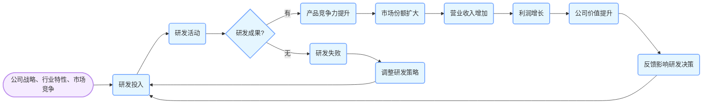

# 彼得林奇对公司研发投入的评估方法

> 关键词：彼得林奇、公司研发投入、评估方法、投资分析、财务指标、成长潜力、竞争优势

> 摘要：本文深入探讨彼得林奇对公司研发投入的评估方法。彼得林奇作为投资界的传奇人物，其投资理念和方法影响深远。公司的研发投入对于其长期发展和竞争优势至关重要，而彼得林奇独特的评估视角能帮助投资者更准确地判断公司的价值和潜力。文章将从背景介绍出发，阐述相关核心概念，剖析彼得林奇评估方法的算法原理和数学模型，通过项目实战案例详细说明其应用，探讨实际应用场景，推荐相关工具和资源，最后总结未来发展趋势与挑战，解答常见问题并提供扩展阅读和参考资料，旨在为投资者和相关研究人员提供全面且深入的知识和实践指导。

## 1. 背景介绍 
### 1.1 目的和范围
本部分旨在全面解析彼得林奇对公司研发投入的评估方法，帮助投资者、分析师以及对公司财务分析感兴趣的人士理解如何通过研发投入评估公司的发展潜力和投资价值。范围涵盖彼得林奇评估方法的各个方面，包括核心概念、算法原理、数学模型、实际应用案例等，同时探讨该方法在不同行业和市场环境下的适用性和局限性。

### 1.2 预期读者
本文预期读者包括专业投资者、金融分析师、企业管理人员、商学院学生以及对投资和公司财务分析有兴趣的普通读者。这些读者希望通过了解彼得林奇的评估方法，提升自己对公司研发投入的分析能力，从而在投资决策、企业战略规划等方面做出更明智的选择。

### 1.3 文档结构概述
本文首先介绍背景信息，包括目的、预期读者和文档结构概述，以及相关术语的定义和解释。接着阐述核心概念与联系，通过文本示意图和 Mermaid 流程图展示研发投入与公司发展的关系。然后详细讲解核心算法原理和具体操作步骤，结合 Python 源代码进行说明。随后介绍数学模型和公式，并举例说明其应用。通过项目实战案例，展示如何在实际中运用这些方法进行公司研发投入的评估。接着探讨该评估方法的实际应用场景，推荐相关的学习资源、开发工具和论文著作。最后总结未来发展趋势与挑战，解答常见问题并提供扩展阅读和参考资料。

### 1.4 术语表
#### 1.4.1 核心术语定义
- **研发投入**：指公司在研究与开发活动中所投入的资源，包括人力、物力和财力等方面的支出，通常以货币形式表示。
- **投资回报率（ROI）**：是指通过投资而应返回的价值，即企业从一项投资活动中得到的经济回报，计算公式为 $ROI = \frac{投资收益 - 投资成本}{投资成本} \times 100\%$。
- **市研率（PRR）**：是指公司市值与研发投入的比率，反映了市场对公司研发投入的预期和估值。
- **成长潜力**：指公司在未来一段时间内实现业务增长和价值提升的可能性和能力。
- **竞争优势**：指公司在市场竞争中相对于竞争对手所具有的优势，包括技术、品牌、成本等方面。

#### 1.4.2 相关概念解释
- **研发强度**：通常用研发投入占营业收入的比例来衡量，反映了公司对研发的重视程度和资源投入力度。较高的研发强度可能意味着公司更注重创新和长期发展。
- **研发效率**：指公司在研发投入过程中所取得的成果与投入资源的比例关系。研发效率高的公司能够以较少的投入获得更多的研发成果，如新产品、新技术等。
- **研发风险**：指公司在研发过程中面临的各种不确定性和挑战，包括技术难题、市场需求变化、竞争压力等。研发风险可能导致研发项目失败或无法达到预期效果。

#### 1.4.3 缩略词列表
- **ROI**：投资回报率（Return on Investment）
- **PRR**：市研率（Price - Research Ratio）

## 2. 核心概念与联系 

### 核心概念原理
彼得林奇认为，公司的研发投入是其未来发展的重要驱动力。研发投入可以帮助公司开发新产品、改进现有产品、提高生产效率、降低成本等，从而增强公司的竞争优势和成长潜力。然而，研发投入并不是越多越好，还需要考虑研发投入的效率和回报。如果公司的研发投入不能转化为实际的经济效益，那么过高的研发投入可能会成为公司的负担。

公司的研发投入与多个因素密切相关。首先，行业特性对研发投入有重要影响。例如，高科技行业通常需要较高的研发投入来保持技术领先地位，而传统制造业的研发投入相对较低。其次，公司的战略定位也决定了其研发投入的规模和方向。一些公司注重创新和技术突破，会加大研发投入；而另一些公司则更侧重于成本控制和市场份额的扩大，研发投入相对较少。此外，市场竞争环境也会促使公司增加研发投入，以提升自身的竞争力。

### 架构的文本示意图
研发投入与公司发展的关系可以用以下文本示意图表示：

研发投入 -> 研发成果（新产品、新技术等） -> 产品竞争力提升 -> 市场份额扩大 -> 营业收入增加 -> 利润增长 -> 公司价值提升

同时，研发投入也受到公司战略、行业特性、市场竞争等因素的影响，而公司的发展状况又会反馈影响研发投入的决策。

### Mermaid 流程图


## 3. 核心算法原理 & 具体操作步骤 

### 核心算法原理
彼得林奇评估公司研发投入的方法主要基于对研发投入与公司财务指标、市场表现等因素的综合分析。其中，市研率（PRR）和研发强度是两个重要的指标。

市研率（PRR）反映了市场对公司研发投入的预期和估值。计算公式为：

$PRR = \frac{公司市值}{研发投入}$

研发强度则反映了公司对研发的重视程度和资源投入力度。计算公式为：

$研发强度 = \frac{研发投入}{营业收入}$

通过比较不同公司的市研率和研发强度，可以初步判断公司的研发投入是否合理，以及市场对其研发投入的认可度。

此外，还需要考虑研发投入的回报率。投资回报率（ROI）可以用来衡量研发投入的经济效益。计算公式为：

$ROI = \frac{研发带来的收益 - 研发成本}{研发成本} \times 100\%$

### 具体操作步骤

#### 步骤 1：收集数据
收集公司的财务报表，包括研发投入、营业收入、净利润、市值等数据。这些数据可以从公司的年报、季报以及相关金融数据库中获取。

#### 步骤 2：计算指标
根据收集到的数据，计算市研率（PRR）、研发强度和投资回报率（ROI）等指标。

#### 步骤 3：比较分析
将计算得到的指标与同行业其他公司进行比较，分析公司在研发投入方面的优势和劣势。同时，观察这些指标的变化趋势，判断公司的研发投入是否具有可持续性和有效性。

#### 步骤 4：综合评估
结合公司的战略规划、行业发展趋势、市场竞争环境等因素，对公司的研发投入进行综合评估。判断公司的研发投入是否能够支持其长期发展，是否具有投资价值。

### Python 源代码实现
```python
import pandas as pd

# 定义计算市研率的函数
def calculate_prr(market_value, r_d_expense):
    """
    计算市研率（PRR）
    :param market_value: 公司市值
    :param r_d_expense: 研发投入
    :return: 市研率
    """
    if r_d_expense == 0:
        return None
    else:
        return market_value / r_d_expense

# 定义计算研发强度的函数
def calculate_rd_intensity(r_d_expense, operating_income):
    """
    计算研发强度
    :param r_d_expense: 研发投入
    :param operating_income: 营业收入
    :return: 研发强度
    """
    if operating_income == 0:
        return None
    else:
        return r_d_expense / operating_income

# 定义计算投资回报率的函数
def calculate_roi(research_income, r_d_cost):
    """
    计算投资回报率（ROI）
    :param research_income: 研发带来的收益
    :param r_d_cost: 研发成本
    :return: 投资回报率
    """
    if r_d_cost == 0:
        return None
    else:
        return (research_income - r_d_cost) / r_d_cost * 100

# 示例数据
data = {
    '公司名称': ['A公司', 'B公司', 'C公司'],
    '市值': [1000000000, 800000000, 1200000000],
    '研发投入': [50000000, 40000000, 60000000],
    '营业收入': [500000000, 400000000, 600000000],
    '研发带来的收益': [80000000, 60000000, 90000000],
    '研发成本': [50000000, 40000000, 60000000]
}

df = pd.DataFrame(data)

# 计算各项指标
df['市研率'] = df.apply(lambda row: calculate_prr(row['市值'], row['研发投入']), axis=1)
df['研发强度'] = df.apply(lambda row: calculate_rd_intensity(row['研发投入'], row['营业收入']), axis=1)
df['投资回报率'] = df.apply(lambda row: calculate_roi(row['研发带来的收益'], row['研发成本']), axis=1)

print(df)
```

## 4. 数学模型和公式 & 详细讲解 & 举例说明 

### 数学模型和公式
#### 市研率（PRR）
$PRR = \frac{公司市值}{研发投入}$

市研率反映了市场对公司研发投入的预期和估值。较高的市研率可能意味着市场对公司的研发前景较为乐观，认为公司的研发投入有望带来较高的回报；而较低的市研率可能表示市场对公司的研发能力和前景不太看好。

#### 研发强度
$研发强度 = \frac{研发投入}{营业收入}$

研发强度反映了公司对研发的重视程度和资源投入力度。一般来说，研发强度较高的公司更注重创新和长期发展，但也可能面临较高的研发风险。

#### 投资回报率（ROI）
$ROI = \frac{研发带来的收益 - 研发成本}{研发成本} \times 100\%$

投资回报率衡量了研发投入的经济效益。较高的投资回报率表明研发投入能够带来较好的回报，而较低的投资回报率则可能意味着研发效率较低或研发项目失败。

### 详细讲解
市研率是一个相对指标，它将公司的市值与研发投入联系起来。市值反映了市场对公司未来价值的预期，而研发投入则是公司为实现未来增长所进行的投资。通过市研率，可以比较不同公司在研发投入方面的市场认可度。

研发强度则是从公司内部的财务结构角度来衡量研发投入的规模。它可以帮助我们了解公司在不同业务发展阶段对研发的资源分配情况。例如，处于成长阶段的公司可能会加大研发投入，导致研发强度较高；而成熟阶段的公司可能会相对减少研发投入，研发强度较低。

投资回报率是评估研发投入效果的关键指标。它直接反映了研发活动所带来的经济效益。在计算投资回报率时，需要准确确定研发带来的收益和研发成本。研发带来的收益可能包括新产品销售收入、成本降低带来的利润增加等；研发成本则包括研发人员工资、设备购置费用、实验材料费用等。

### 举例说明
假设 A 公司的市值为 10 亿元，研发投入为 5000 万元，则其市研率为：

$PRR = \frac{1000000000}{50000000} = 20$

这表明市场愿意为 A 公司每 1 元的研发投入支付 20 元的市值。

假设 A 公司的营业收入为 5 亿元，则其研发强度为：

$研发强度 = \frac{50000000}{500000000} = 0.1 = 10\%$

这意味着 A 公司将 10% 的营业收入用于研发投入。

假设 A 公司的研发带来的收益为 8000 万元，研发成本为 5000 万元，则其投资回报率为：

$ROI = \frac{80000000 - 50000000}{50000000} \times 100\% = 60\%$

这表明 A 公司的研发投入获得了 60% 的回报，研发效果较好。

## 5. 项目实战：代码实际案例和详细解释说明 

### 5.1  开发环境搭建
#### 安装 Python
首先，需要安装 Python 环境。可以从 Python 官方网站（https://www.python.org/downloads/）下载适合自己操作系统的 Python 版本，并按照安装向导进行安装。

#### 安装必要的库
在本项目中，需要使用 `pandas` 库进行数据处理和分析。可以使用以下命令安装 `pandas` 库：

```sh
pip install pandas
```

### 5.2  源代码详细实现和代码解读
```python
import pandas as pd

# 定义计算市研率的函数
def calculate_prr(market_value, r_d_expense):
    """
    计算市研率（PRR）
    :param market_value: 公司市值
    :param r_d_expense: 研发投入
    :return: 市研率
    """
    if r_d_expense == 0:
        return None
    else:
        return market_value / r_d_expense

# 定义计算研发强度的函数
def calculate_rd_intensity(r_d_expense, operating_income):
    """
    计算研发强度
    :param r_d_expense: 研发投入
    :param operating_income: 营业收入
    :return: 研发强度
    """
    if operating_income == 0:
        return None
    else:
        return r_d_expense / operating_income

# 定义计算投资回报率的函数
def calculate_roi(research_income, r_d_cost):
    """
    计算投资回报率（ROI）
    :param research_income: 研发带来的收益
    :param r_d_cost: 研发成本
    :return: 投资回报率
    """
    if r_d_cost == 0:
        return None
    else:
        return (research_income - r_d_cost) / r_d_cost * 100

# 示例数据
data = {
    '公司名称': ['A公司', 'B公司', 'C公司'],
    '市值': [1000000000, 800000000, 1200000000],
    '研发投入': [50000000, 40000000, 60000000],
    '营业收入': [500000000, 400000000, 600000000],
    '研发带来的收益': [80000000, 60000000, 90000000],
    '研发成本': [50000000, 40000000, 60000000]
}

df = pd.DataFrame(data)

# 计算各项指标
df['市研率'] = df.apply(lambda row: calculate_prr(row['市值'], row['研发投入']), axis=1)
df['研发强度'] = df.apply(lambda row: calculate_rd_intensity(row['研发投入'], row['营业收入']), axis=1)
df['投资回报率'] = df.apply(lambda row: calculate_roi(row['研发带来的收益'], row['研发成本']), axis=1)

print(df)
```

### 代码解读与分析
#### 函数定义
- `calculate_prr` 函数：该函数接受公司市值和研发投入作为参数，计算市研率。如果研发投入为 0，则返回 `None`，以避免除零错误。
- `calculate_rd_intensity` 函数：该函数接受研发投入和营业收入作为参数，计算研发强度。如果营业收入为 0，则返回 `None`。
- `calculate_roi` 函数：该函数接受研发带来的收益和研发成本作为参数，计算投资回报率。如果研发成本为 0，则返回 `None`。

#### 数据处理
- `data` 字典：定义了一个包含公司名称、市值、研发投入、营业收入、研发带来的收益和研发成本的示例数据。
- `df = pd.DataFrame(data)`：使用 `pandas` 库将示例数据转换为 DataFrame 格式，方便进行数据处理和分析。

#### 指标计算
- `df['市研率'] = df.apply(lambda row: calculate_prr(row['市值'], row['研发投入']), axis=1)`：使用 `apply` 方法遍历 DataFrame 的每一行，调用 `calculate_prr` 函数计算市研率，并将结果添加到新的列 `市研率` 中。
- `df['研发强度'] = df.apply(lambda row: calculate_rd_intensity(row['研发投入'], row['营业收入']), axis=1)`：同理，计算研发强度并添加到新的列 `研发强度` 中。
- `df['投资回报率'] = df.apply(lambda row: calculate_roi(row['研发带来的收益'], row['研发成本']), axis=1)`：计算投资回报率并添加到新的列 `投资回报率` 中。

#### 结果输出
- `print(df)`：打印包含各项指标的 DataFrame，方便查看计算结果。

## 6. 实际应用场景 
### 投资决策
投资者在选择投资标的时，可以使用彼得林奇的评估方法来分析公司的研发投入情况。通过比较不同公司的市研率、研发强度和投资回报率等指标，投资者可以筛选出具有较高研发潜力和投资价值的公司。例如，如果一家公司的市研率较低，但研发强度较高且投资回报率也不错，那么可能意味着该公司的研发投入被市场低估，具有投资机会。

### 企业战略规划
企业管理者可以运用这些评估方法来制定公司的研发战略。通过分析同行业其他公司的研发投入情况，企业可以了解自身在研发方面的优势和劣势，从而调整研发投入的规模和方向。如果企业的研发强度低于行业平均水平，可能需要加大研发投入以提升竞争力；如果投资回报率较低，则需要优化研发项目管理，提高研发效率。

### 行业分析
分析师可以使用这些方法对整个行业的研发投入情况进行分析。通过比较不同行业的市研率和研发强度等指标，可以了解各行业的创新活力和发展趋势。例如，高科技行业通常具有较高的研发强度和市研率，表明该行业对研发的重视程度较高，创新能力较强。

### 风险评估
在评估公司的风险时，研发投入也是一个重要的考虑因素。如果公司的研发投入过高，但投资回报率较低，可能意味着公司面临较高的研发风险。投资者和管理者需要关注研发项目的进展和成果，及时调整研发策略，以降低风险。

## 7. 工具和资源推荐
### 7.1 学习资源推荐
#### 7.1.1 书籍推荐
- 《彼得林奇的成功投资》：彼得林奇的经典著作，详细阐述了他的投资理念和方法，包括对公司研发投入的评估等内容。
- 《聪明的投资者》：本杰明·格雷厄姆的著作，是价值投资领域的经典之作，对投资者理解公司基本面分析和财务评估有很大帮助。
- 《财务报表分析》：全面介绍了财务报表的分析方法和技巧，有助于读者深入理解公司的财务状况，包括研发投入等相关指标。

#### 7.1.2 在线课程
- Coursera 平台上的“投资学原理”课程：由知名大学教授授课，系统讲解投资学的基本原理和方法，包括公司分析和估值等内容。
- 网易云课堂上的“财务报表分析实战”课程：通过实际案例，详细讲解如何分析公司的财务报表，对理解研发投入相关指标有很大帮助。

#### 7.1.3 技术博客和网站
- 雪球网：一个投资者交流的社区，有很多关于公司分析和投资策略的讨论，其中不乏对公司研发投入的分析和见解。
- 东方财富网：提供丰富的金融数据和资讯，包括公司的财务报表等信息，方便投资者进行数据收集和分析。

### 7.2 开发工具框架推荐
#### 7.2.1 IDE和编辑器
- PyCharm：一款专业的 Python 集成开发环境，具有强大的代码编辑、调试和分析功能，适合进行数据分析和算法实现。
- Jupyter Notebook：一个交互式的开发环境，方便进行数据探索和可视化，适合快速验证算法和展示分析结果。

#### 7.2.2 调试和性能分析工具
- PDB：Python 自带的调试器，可以帮助开发者逐行调试代码，查找问题。
- cProfile：Python 的性能分析工具，可以分析代码的运行时间和函数调用情况，帮助优化代码性能。

#### 7.2.3 相关框架和库
- Pandas：一个强大的数据处理和分析库，提供了丰富的数据结构和函数，方便进行数据清洗、转换和分析。
- NumPy：Python 的数值计算库，提供了高效的数组操作和数学函数，为数据分析提供了基础支持。
- Matplotlib：一个常用的绘图库，可以用于数据可视化，将分析结果以图表的形式展示出来。

### 7.3 相关论文著作推荐
#### 7.3.1 经典论文
- 《研发投入与企业绩效的关系研究》：深入探讨了研发投入对企业绩效的影响机制，为评估公司研发投入提供了理论支持。
- 《基于财务指标的公司价值评估模型研究》：介绍了基于财务指标的公司价值评估方法，其中包括对研发投入等指标的分析。

#### 7.3.2 最新研究成果
- 关注顶级学术期刊如《管理世界》、《经济研究》等发表的关于公司研发投入和创新的最新研究成果，了解行业前沿动态。

#### 7.3.3 应用案例分析
- 一些专业的金融研究机构会发布关于公司研发投入评估的应用案例分析报告，可以从中学习实际应用中的方法和技巧。

## 8. 总结：未来发展趋势与挑战
### 未来发展趋势
#### 数据驱动的评估方法
随着大数据和人工智能技术的发展，未来对公司研发投入的评估将更加依赖数据驱动的方法。通过收集更多的相关数据，如专利数据、市场反馈数据等，可以更全面、准确地评估公司的研发投入效果和潜力。

#### 跨学科融合
研发投入评估将不再局限于财务和投资领域，而是与管理学、社会学、心理学等多学科进行融合。例如，考虑研发团队的创新文化、员工激励机制等因素对研发效率的影响。

#### 可持续发展导向
在可持续发展理念的推动下，未来的研发投入评估将更加关注公司的研发活动对环境、社会和治理（ESG）的影响。具有良好 ESG 表现的公司可能会获得更高的市场估值和投资机会。

### 挑战
#### 数据质量和可靠性
准确的评估依赖于高质量的数据，但获取准确、完整的研发投入相关数据可能存在困难。例如，研发成本的核算可能存在模糊性，研发带来的收益难以准确衡量。

#### 行业差异和动态变化
不同行业的研发特点和规律差异较大，难以制定统一的评估标准。而且，行业技术和市场环境不断变化，研发投入的效果和价值也会随之变化，增加了评估的难度。

#### 研发风险的不确定性
研发活动本身具有较高的风险和不确定性，研发项目可能会失败或无法达到预期效果。如何准确评估研发风险，并将其纳入评估体系是一个挑战。

## 9. 附录：常见问题与解答
### 问题 1：如何准确确定研发带来的收益？
研发带来的收益可能包括新产品销售收入、成本降低带来的利润增加、品牌价值提升等。确定研发带来的收益需要综合考虑多个因素，可以采用增量分析法，即比较研发前后公司的业绩变化来估算研发带来的收益。同时，还可以参考市场调研数据和行业平均水平进行调整。

### 问题 2：市研率和研发强度的合理范围是多少？
市研率和研发强度的合理范围因行业而异。一般来说，高科技行业的市研率和研发强度相对较高，而传统行业相对较低。投资者和分析师可以通过比较同行业其他公司的指标来确定合理范围。

### 问题 3：研发投入评估方法是否适用于所有类型的公司？
研发投入评估方法适用于大多数需要进行研发活动的公司，但对于一些特殊行业，如金融行业，研发投入的比重相对较小，该方法的适用性可能会受到一定限制。在应用时，需要结合公司的实际情况进行调整和分析。

### 问题 4：如何处理研发投入数据缺失的情况？
如果研发投入数据缺失，可以尝试从其他渠道获取相关信息，如公司的公告、行业研究报告等。如果无法获取准确数据，可以采用估算的方法，如根据公司的营业收入和行业平均研发强度来估算研发投入。

## 10. 扩展阅读 & 参考资料
### 扩展阅读
- 《创新者的窘境》：探讨了创新对企业发展的影响，以及企业如何应对创新带来的挑战，与研发投入和公司发展密切相关。
- 《从 0 到 1》：介绍了创业公司如何实现从无到有的创新和发展，对理解研发投入在创业过程中的作用有很大帮助。

### 参考资料
- 彼得林奇相关著作和访谈记录
- 各公司的财务报表和年报
- 金融数据库和行业研究报告
- 相关学术期刊和论文

作者：AI天才研究院/AI Genius Institute & 禅与计算机程序设计艺术 /Zen And The Art of Computer Programming