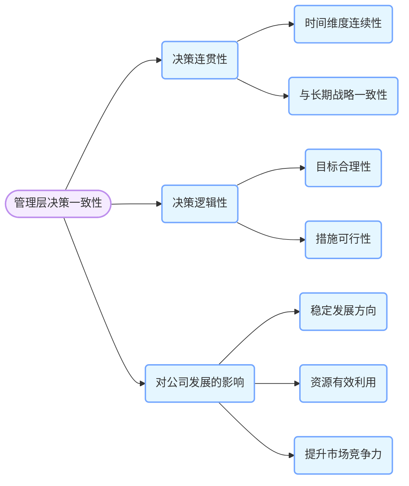

# 彼得林奇对公司管理层决策一致性的评估

> 关键词：彼得林奇、公司管理层、决策一致性、评估方法、投资分析

> 摘要：本文围绕彼得林奇对公司管理层决策一致性的评估展开深入探讨。首先介绍彼得林奇投资理念中关注管理层决策一致性的背景，阐述相关核心概念及联系。接着详细分析其评估的核心算法原理与具体操作步骤，通过数学模型和公式进行理论阐释，并辅以实例说明。结合项目实战，给出代码实际案例并进行详细解读。探讨该评估方法在实际投资等场景中的应用，推荐相关学习资源、开发工具框架以及论文著作。最后总结未来发展趋势与挑战，解答常见问题并提供扩展阅读和参考资料，旨在为投资者和相关研究人员提供全面且深入的知识体系，助力更好地理解和运用彼得林奇的评估方法。

## 1. 背景介绍 
### 1.1 目的和范围
彼得林奇作为投资界的传奇人物，其投资理念和方法一直备受关注。对公司管理层决策一致性进行评估是其投资分析体系中的重要一环。本文的目的在于深入剖析彼得林奇评估公司管理层决策一致性的方法，帮助投资者更好地理解如何通过评估管理层决策来判断公司的投资价值。范围涵盖从理论概念的阐述到实际应用案例的分析，包括核心算法原理、数学模型、项目实战以及相关资源推荐等多个方面。

### 1.2 预期读者
本文预期读者主要包括对投资领域感兴趣的个人投资者，他们希望从彼得林奇的投资智慧中获取更多评估公司的方法；金融专业的学生和研究人员，可将其作为学术研究和学习的参考资料；以及从事证券分析、投资咨询等相关职业的专业人士，为其实际工作提供理论和实践的支持。

### 1.3 文档结构概述
本文首先介绍背景信息，让读者了解研究的目的和适用对象。接着阐述核心概念与联系，明确相关术语和原理。然后详细讲解核心算法原理和具体操作步骤，并通过数学模型和公式进行理论支撑和实例说明。在项目实战部分，给出代码案例并进行详细解读。之后探讨实际应用场景，为读者展示该评估方法的实际用途。再推荐相关的工具和资源，方便读者进一步学习和研究。最后总结未来发展趋势与挑战，解答常见问题并提供扩展阅读和参考资料。

### 1.4 术语表
#### 1.4.1 核心术语定义
- **管理层决策一致性**：指公司管理层在不同时期、不同业务领域的决策具有连贯性和逻辑性，决策目标和方向保持相对稳定，不会出现频繁的重大决策偏差或矛盾。
- **投资价值**：指公司对于投资者而言所具有的潜在获利能力和风险特征，是综合考虑公司的财务状况、市场竞争力、管理层能力等多方面因素后得出的对公司价值的评估。
- **决策连贯性**：强调管理层决策在时间维度上的连续性，即后续决策是基于前期决策的合理延伸和发展，而非突然转变。

#### 1.4.2 相关概念解释
- **长期战略规划**：公司管理层为实现长期发展目标而制定的一系列具有前瞻性和全局性的计划，决策一致性有助于确保长期战略规划的有效实施。
- **短期经营策略**：为应对当前市场环境和短期业务目标而采取的具体措施，虽然可能会根据实际情况进行调整，但仍应与长期战略保持一致。

#### 1.4.3 缩略词列表
- **ROE**：Return on Equity，净资产收益率，用于衡量公司运用自有资本的效率，是评估公司盈利能力的重要指标之一。
- **EPS**：Earnings Per Share，每股收益，反映普通股的获利水平，是投资者关注的重要财务指标。

## 2. 核心概念与联系 
### 核心概念原理
彼得林奇认为，公司管理层决策一致性对于公司的长期发展至关重要。一致的决策能够使公司保持稳定的发展方向，避免资源的浪费和内部的混乱。当管理层的决策具有连贯性时，公司能够更好地执行长期战略规划，逐步实现预定的目标。例如，一家公司如果一直专注于某一核心业务领域的研发和拓展，通过持续的投入和合理的决策，不断提升产品的竞争力和市场份额，那么其决策就体现了较好的一致性。相反，如果管理层频繁改变业务方向，盲目跟风投资一些不熟悉的领域，可能会导致公司资源分散，陷入困境。

### 架构的文本示意图
```plaintext
管理层决策一致性
|-- 决策连贯性
|   |-- 时间维度连续性
|   |-- 与长期战略一致性
|-- 决策逻辑性
|   |-- 目标合理性
|   |-- 措施可行性
|-- 对公司发展的影响
|   |-- 稳定发展方向
|   |-- 资源有效利用
|   |-- 提升市场竞争力
```

### Mermaid 流程图


## 3. 核心算法原理 & 具体操作步骤 
### 核心算法原理
彼得林奇评估公司管理层决策一致性的核心思路是通过分析公司的历史决策记录，对比不同时期的决策目标、措施和结果，来判断决策的连贯性和逻辑性。可以从以下几个方面进行量化分析：
1. **目标一致性**：对比不同时期公司设定的战略目标，计算目标的相似度。例如，可以将目标分解为若干关键指标，计算这些指标在不同时期的重合度。
2. **措施连贯性**：分析公司为实现目标所采取的具体措施，观察措施之间的关联性和延续性。可以通过构建措施的关联矩阵，计算措施之间的相关性得分。
3. **结果稳定性**：考察公司决策实施后的实际结果，如财务指标（ROE、EPS 等）的变化情况。计算这些指标在一定时期内的波动幅度，波动越小说明决策的稳定性越高。

### 具体操作步骤
#### 步骤 1：收集数据
收集公司的历史决策文件、年报、季报等资料，提取其中关于决策目标、措施和结果的信息。可以使用 Python 的网络爬虫库（如 Scrapy）来自动获取相关数据。以下是一个简单的示例代码：
```python
import scrapy

class CompanyInfoSpider(scrapy.Spider):
    name = "company_info"
    start_urls = ['https://example.com/company_reports']  # 替换为实际的公司报告页面 URL

    def parse(self, response):
        # 解析页面，提取决策相关信息
        decision_targets = response.css('div.targets::text').getall()
        decision_measures = response.css('div.measures::text').getall()
        decision_results = response.css('div.results::text').getall()

        # 存储数据
        data = {
            'targets': decision_targets,
            'measures': decision_measures,
            'results': decision_results
        }
        yield data
```
#### 步骤 2：数据预处理
对收集到的数据进行清洗和整理，去除无效信息，统一数据格式。例如，将决策目标和措施进行分词处理，将财务指标数据转换为数值类型。以下是一个简单的数据预处理示例：
```python
import re

def preprocess_data(data):
    # 清洗决策目标
    cleaned_targets = []
    for target in data['targets']:
        target = re.sub(r'[^\w\s]', '', target).strip().lower()
        cleaned_targets.append(target)

    # 清洗决策措施
    cleaned_measures = []
    for measure in data['measures']:
        measure = re.sub(r'[^\w\s]', '', measure).strip().lower()
        cleaned_measures.append(measure)

    # 转换财务指标为数值类型
    cleaned_results = []
    for result in data['results']:
        try:
            result = float(result)
            cleaned_results.append(result)
        except ValueError:
            cleaned_results.append(None)

    preprocessed_data = {
        'targets': cleaned_targets,
        'measures': cleaned_measures,
        'results': cleaned_results
    }
    return preprocessed_data
```
#### 步骤 3：计算指标
根据前面提到的核心算法原理，计算目标一致性、措施连贯性和结果稳定性指标。以下是一个简单的计算示例：
```python
from difflib import SequenceMatcher

def calculate_target_similarity(targets):
    similarity_scores = []
    for i in range(len(targets) - 1):
        score = SequenceMatcher(None, targets[i], targets[i + 1]).ratio()
        similarity_scores.append(score)
    average_similarity = sum(similarity_scores) / len(similarity_scores)
    return average_similarity

def calculate_measure_coherence(measures):
    # 这里可以使用更复杂的方法，如构建关联矩阵
    # 简单示例：计算相邻措施的相似度
    coherence_scores = []
    for i in range(len(measures) - 1):
        score = SequenceMatcher(None, measures[i], measures[i + 1]).ratio()
        coherence_scores.append(score)
    average_coherence = sum(coherence_scores) / len(coherence_scores)
    return average_coherence

def calculate_result_stability(results):
    valid_results = [result for result in results if result is not None]
    if len(valid_results) < 2:
        return 0
    import numpy as np
    std_dev = np.std(valid_results)
    return std_dev

def calculate_decision_consistency(data):
    target_similarity = calculate_target_similarity(data['targets'])
    measure_coherence = calculate_measure_coherence(data['measures'])
    result_stability = calculate_result_stability(data['results'])

    # 可以根据实际情况调整权重
    weights = [0.4, 0.3, 0.3]
    consistency_score = (target_similarity * weights[0] +
                         measure_coherence * weights[1] +
                         result_stability * weights[2])
    return consistency_score
```
#### 步骤 4：评估结果
根据计算得到的决策一致性得分，对公司管理层的决策一致性进行评估。得分越高，说明决策一致性越好。可以设定一个阈值，如 0.7，得分高于该阈值的公司被认为具有较好的决策一致性。

## 4. 数学模型和公式 & 详细讲解 & 举例说明 
### 目标一致性
目标一致性可以通过计算不同时期决策目标的相似度来衡量。假设公司在 $n$ 个时期的决策目标分别为 $T_1, T_2, \cdots, T_n$，可以使用编辑距离（Levenshtein 距离）或序列匹配算法（如 `difflib.SequenceMatcher`）来计算相邻目标之间的相似度。设 $S_{i, i + 1}$ 表示目标 $T_i$ 和 $T_{i + 1}$ 之间的相似度得分，则目标一致性得分 $TS$ 可以表示为：
$$TS = \frac{1}{n - 1} \sum_{i = 1}^{n - 1} S_{i, i + 1}$$

**举例说明**：假设公司在三个时期的决策目标分别为：
- $T_1$: "扩大市场份额，提升产品质量"
- $T_2$: "扩大市场份额，加强品牌建设"
- $T_3$: "提升产品质量，拓展新客户群体"

使用 `difflib.SequenceMatcher` 计算相似度：
```python
from difflib import SequenceMatcher

T1 = "扩大市场份额，提升产品质量"
T2 = "扩大市场份额，加强品牌建设"
T3 = "提升产品质量，拓展新客户群体"

S12 = SequenceMatcher(None, T1, T2).ratio()
S23 = SequenceMatcher(None, T2, T3).ratio()

TS = (S12 + S23) / 2
print(f"目标一致性得分: {TS}")
```

### 措施连贯性
措施连贯性可以通过构建措施的关联矩阵来衡量。假设公司在 $n$ 个时期采取的决策措施分别为 $M_1, M_2, \cdots, M_n$，可以计算任意两个措施之间的相关性得分，构建一个 $n \times n$ 的关联矩阵 $C$，其中 $C_{i, j}$ 表示措施 $M_i$ 和 $M_j$ 之间的相关性得分。措施连贯性得分 $MC$ 可以表示为：
$$MC = \frac{2}{n(n - 1)} \sum_{1 \leq i < j \leq n} C_{i, j}$$

**举例说明**：假设公司在三个时期采取的决策措施分别为：
- $M_1$: "增加研发投入"
- $M_2$: "加强市场推广"
- $M_3$: "优化产品生产流程"

可以使用文本相似度算法计算相关性得分，构建关联矩阵：
```python
from difflib import SequenceMatcher

M1 = "增加研发投入"
M2 = "加强市场推广"
M3 = "优化产品生产流程"

C12 = SequenceMatcher(None, M1, M2).ratio()
C13 = SequenceMatcher(None, M1, M3).ratio()
C23 = SequenceMatcher(None, M2, M3).ratio()

MC = (C12 + C13 + C23) / 3
print(f"措施连贯性得分: {MC}")
```

### 结果稳定性
结果稳定性可以通过计算公司决策实施后财务指标（如 ROE、EPS 等）的标准差来衡量。假设公司在 $n$ 个时期的财务指标值分别为 $R_1, R_2, \cdots, R_n$，则结果稳定性得分 $RS$ 可以表示为：
$$RS = \sqrt{\frac{1}{n} \sum_{i = 1}^{n} (R_i - \bar{R})^2}$$
其中，$\bar{R} = \frac{1}{n} \sum_{i = 1}^{n} R_i$ 是财务指标的平均值。

**举例说明**：假设公司在五个时期的 EPS 值分别为 1.2, 1.3, 1.25, 1.32, 1.28。
```python
import numpy as np

EPS = [1.2, 1.3, 1.25, 1.32, 1.28]
RS = np.std(EPS)
print(f"结果稳定性得分: {RS}")
```

### 决策一致性得分
综合考虑目标一致性、措施连贯性和结果稳定性，决策一致性得分 $DC$ 可以表示为：
$$DC = w_1 \times TS + w_2 \times MC + w_3 \times RS$$
其中，$w_1, w_2, w_3$ 分别是目标一致性、措施连贯性和结果稳定性的权重，且 $w_1 + w_2 + w_3 = 1$。

## 5. 项目实战：代码实际案例和详细解释说明 
### 5.1  开发环境搭建
#### 安装 Python
首先需要安装 Python 环境，建议使用 Python 3.7 及以上版本。可以从 Python 官方网站（https://www.python.org/downloads/）下载并安装适合自己操作系统的版本。

#### 安装必要的库
使用 `pip` 命令安装项目所需的库，包括 `scrapy`、`numpy` 等。
```sh
pip install scrapy numpy
```

### 5.2  源代码详细实现和代码解读
以下是一个完整的项目实战代码示例，包括数据收集、预处理、指标计算和结果评估：
```python
import scrapy
import re
from difflib import SequenceMatcher
import numpy as np

# 数据收集爬虫
class CompanyInfoSpider(scrapy.Spider):
    name = "company_info"
    start_urls = ['https://example.com/company_reports']  # 替换为实际的公司报告页面 URL

    def parse(self, response):
        # 解析页面，提取决策相关信息
        decision_targets = response.css('div.targets::text').getall()
        decision_measures = response.css('div.measures::text').getall()
        decision_results = response.css('div.results::text').getall()

        # 存储数据
        data = {
            'targets': decision_targets,
            'measures': decision_measures,
            'results': decision_results
        }
        yield data

# 数据预处理
def preprocess_data(data):
    # 清洗决策目标
    cleaned_targets = []
    for target in data['targets']:
        target = re.sub(r'[^\w\s]', '', target).strip().lower()
        cleaned_targets.append(target)

    # 清洗决策措施
    cleaned_measures = []
    for measure in data['measures']:
        measure = re.sub(r'[^\w\s]', '', measure).strip().lower()
        cleaned_measures.append(measure)

    # 转换财务指标为数值类型
    cleaned_results = []
    for result in data['results']:
        try:
            result = float(result)
            cleaned_results.append(result)
        except ValueError:
            cleaned_results.append(None)

    preprocessed_data = {
        'targets': cleaned_targets,
        'measures': cleaned_measures,
        'results': cleaned_results
    }
    return preprocessed_data

# 计算目标一致性
def calculate_target_similarity(targets):
    similarity_scores = []
    for i in range(len(targets) - 1):
        score = SequenceMatcher(None, targets[i], targets[i + 1]).ratio()
        similarity_scores.append(score)
    average_similarity = sum(similarity_scores) / len(similarity_scores)
    return average_similarity

# 计算措施连贯性
def calculate_measure_coherence(measures):
    coherence_scores = []
    for i in range(len(measures) - 1):
        score = SequenceMatcher(None, measures[i], measures[i + 1]).ratio()
        coherence_scores.append(score)
    average_coherence = sum(coherence_scores) / len(coherence_scores)
    return average_coherence

# 计算结果稳定性
def calculate_result_stability(results):
    valid_results = [result for result in results if result is not None]
    if len(valid_results) < 2:
        return 0
    std_dev = np.std(valid_results)
    return std_dev

# 计算决策一致性得分
def calculate_decision_consistency(data):
    target_similarity = calculate_target_similarity(data['targets'])
    measure_coherence = calculate_measure_coherence(data['measures'])
    result_stability = calculate_result_stability(data['results'])

    # 可以根据实际情况调整权重
    weights = [0.4, 0.3, 0.3]
    consistency_score = (target_similarity * weights[0] +
                         measure_coherence * weights[1] +
                         result_stability * weights[2])
    return consistency_score

# 主函数
def main():
    # 数据收集
    # 这里需要手动运行 scrapy 命令，将数据保存到文件中
    # scrapy crawl company_info -o company_data.json
    import json
    with open('company_data.json', 'r', encoding='utf-8') as f:
        data = json.load(f)[0]

    # 数据预处理
    preprocessed_data = preprocess_data(data)

    # 计算决策一致性得分
    consistency_score = calculate_decision_consistency(preprocessed_data)

    # 评估结果
    threshold = 0.7
    if consistency_score >= threshold:
        print("公司管理层决策一致性较好")
    else:
        print("公司管理层决策一致性有待提高")

if __name__ == "__main__":
    main()
```
### 5.3  代码解读与分析
#### 数据收集部分
`CompanyInfoSpider` 类是一个 Scrapy 爬虫，用于从指定的网页上提取公司的决策相关信息。通过 `parse` 方法解析页面，将决策目标、措施和结果存储在字典中并返回。

#### 数据预处理部分
`preprocess_data` 函数对收集到的数据进行清洗和整理。去除目标和措施中的特殊字符，将其转换为小写形式，并将财务指标数据转换为数值类型。

#### 指标计算部分
- `calculate_target_similarity` 函数计算目标一致性得分，通过计算相邻目标之间的相似度并求平均值。
- `calculate_measure_coherence` 函数计算措施连贯性得分，通过计算相邻措施之间的相似度并求平均值。
- `calculate_result_stability` 函数计算结果稳定性得分，通过计算财务指标的标准差。
- `calculate_decision_consistency` 函数综合考虑目标一致性、措施连贯性和结果稳定性，计算决策一致性得分。

#### 主函数部分
`main` 函数首先运行 Scrapy 爬虫收集数据，并将数据保存到文件中。然后读取文件中的数据，进行预处理和指标计算。最后根据设定的阈值对决策一致性进行评估，并输出结果。

## 6. 实际应用场景 
### 投资决策
投资者可以使用彼得林奇的评估方法来评估公司管理层的决策一致性，从而判断公司的投资价值。决策一致性较好的公司通常具有更稳定的发展前景，投资者可以更有信心地进行长期投资。例如，当投资者考虑投资某家科技公司时，通过分析该公司管理层在过去几年的决策，发现其一直专注于核心技术的研发和市场拓展，决策目标和措施具有较好的连贯性，财务指标也相对稳定，那么该公司可能是一个较好的投资选择。

### 公司战略评估
公司内部的战略规划部门可以使用该评估方法来评估自身管理层的决策一致性，发现决策过程中存在的问题和不足，及时调整战略方向。例如，如果发现公司在不同业务领域的决策缺乏连贯性，导致资源分散和效率低下，那么可以重新审视战略规划，明确核心业务和发展方向。

### 行业研究
行业研究机构可以对不同公司的管理层决策一致性进行评估和比较，分析行业内的竞争格局和发展趋势。例如，通过对比同行业几家公司的决策一致性得分，可以发现哪些公司具有更强的竞争力和发展潜力，为行业发展提供参考。

## 7. 工具和资源推荐
### 7.1 学习资源推荐
#### 7.1.1 书籍推荐
- 《彼得林奇的成功投资》：彼得林奇的经典著作，详细介绍了他的投资理念和方法，包括对公司管理层的评估。
- 《聪明的投资者》：本杰明·格雷厄姆的著作，是价值投资的经典之作，对投资者理解公司基本面分析和管理层评估有很大帮助。
- 《财务报表分析与证券定价》：帮助读者深入理解公司的财务报表，掌握通过财务数据评估公司管理层决策的方法。

#### 7.1.2 在线课程
- Coursera 上的“投资学原理”课程：系统介绍投资学的基本原理和方法，包括公司分析和估值。
- edX 上的“财务报表分析”课程：专注于财务报表的解读和分析，为评估公司管理层决策提供财务视角。

#### 7.1.3 技术博客和网站
- Seeking Alpha：提供专业的投资分析和研究报告，包括对公司管理层的分析和评价。
- ValueWalk：专注于价值投资领域，分享投资策略和公司分析的文章。

### 7.2 开发工具框架推荐
#### 7.2.1 IDE和编辑器
- PyCharm：功能强大的 Python 集成开发环境，提供代码编辑、调试、版本控制等功能。
- Jupyter Notebook：交互式的开发环境，适合进行数据探索和分析，方便展示代码和结果。

#### 7.2.2 调试和性能分析工具
- PDB：Python 内置的调试器，可用于调试 Python 代码，查找问题所在。
- cProfile：Python 标准库中的性能分析工具，可用于分析代码的运行时间和性能瓶颈。

#### 7.2.3 相关框架和库
- Scrapy：强大的 Python 网络爬虫框架，用于数据收集和提取。
- Pandas：数据处理和分析库，提供高效的数据结构和数据操作方法。
- Numpy：科学计算库，用于处理数值计算和矩阵运算。

### 7.3 相关论文著作推荐
#### 7.3.1 经典论文
- Jensen, M. C., & Meckling, W. H. (1976). Theory of the firm: Managerial behavior, agency costs and ownership structure. Journal of Financial Economics, 3(4), 305-360. 该论文提出了代理理论，探讨了管理层决策与股东利益之间的关系。
- Fama, E. F., & French, K. R. (1992). The cross-section of expected stock returns. The Journal of Finance, 47(2), 427-465. 提出了 Fama-French 三因子模型，为股票收益的分析提供了理论基础，也可用于评估公司管理层决策对股票收益的影响。

#### 7.3.2 最新研究成果
- 关注顶尖学术期刊，如 The Journal of Finance、The Review of Financial Studies 等，这些期刊会发表关于公司治理、管理层决策等方面的最新研究成果。

#### 7.3.3 应用案例分析
- Harvard Business Review 上的案例研究文章，提供了许多公司管理层决策的实际案例和分析，有助于读者更好地理解和应用相关理论。

## 8. 总结：未来发展趋势与挑战
### 未来发展趋势
#### 数字化评估手段的应用
随着信息技术的不断发展，未来将有更多的数字化手段应用于公司管理层决策一致性的评估。例如，利用大数据和人工智能技术，可以更全面、准确地收集和分析公司的决策数据，提高评估的效率和准确性。

#### 多维度评估体系的完善
未来的评估体系将不仅仅局限于财务指标和决策记录，还将综合考虑公司的社会责任、创新能力、员工满意度等多维度因素，构建更加全面的评估体系。

#### 与可持续发展的结合
在全球可持续发展的背景下，公司管理层的决策一致性评估将更加注重与可持续发展目标的结合。例如，评估公司在环境保护、社会公平等方面的决策连贯性，以推动公司的可持续发展。

### 挑战
#### 数据获取的难度
虽然信息技术的发展为数据收集提供了便利，但仍然存在数据获取的难度。一些公司可能不愿意公开详细的决策信息，或者数据的质量参差不齐，这给评估工作带来了一定的挑战。

#### 评估标准的主观性
决策一致性的评估在一定程度上存在主观性，不同的评估者可能会采用不同的标准和方法，导致评估结果的差异。因此，需要建立更加客观、统一的评估标准。

#### 复杂环境下的决策评估
随着市场环境的日益复杂和多变，公司管理层面临的决策情境也越来越复杂。如何在复杂环境下准确评估管理层的决策一致性，是未来需要解决的一个重要问题。

## 9. 附录：常见问题与解答
### 问题 1：如何确定目标一致性和措施连贯性的权重？
权重的确定可以根据具体情况进行调整。一般来说，可以参考历史数据和经验，分析目标一致性和措施连贯性对公司发展的影响程度。如果目标的稳定性对公司的长期发展更为关键，可以适当提高目标一致性的权重；如果措施的执行连贯性对公司的短期业绩影响较大，可以提高措施连贯性的权重。也可以采用专家打分法或层次分析法等方法来确定权重。

### 问题 2：决策一致性得分是否可以完全代表公司的投资价值？
决策一致性得分只是评估公司投资价值的一个方面，不能完全代表公司的投资价值。公司的投资价值还受到市场环境、行业竞争、财务状况等多种因素的影响。决策一致性得分高的公司通常具有更稳定的发展前景，但并不意味着一定会带来高回报。投资者在进行投资决策时，需要综合考虑多个因素。

### 问题 3：如何处理缺失的财务数据？
在实际数据收集过程中，可能会遇到财务数据缺失的情况。可以采用以下方法处理：
- 忽略缺失数据：如果缺失的数据较少，对整体评估影响不大，可以直接忽略这些数据。
- 插值法：根据相邻时期的数据进行插值计算，填补缺失值。
- 均值法：用该财务指标的历史平均值或行业平均值来替代缺失值。

## 10. 扩展阅读 & 参考资料
### 扩展阅读
- 《战胜华尔街》：彼得林奇的另一本经典著作，分享了他在投资实践中的经验和故事。
- 《公司治理》：深入探讨公司治理的理论和实践，包括管理层决策与公司治理的关系。

### 参考资料
- 彼得林奇相关的官方网站和社交媒体账号，获取最新的投资观点和信息。
- 公司的官方年报、季报等公开资料，是了解公司管理层决策的重要依据。

作者：AI天才研究院/AI Genius Institute & 禅与计算机程序设计艺术 /Zen And The Art of Computer Programming