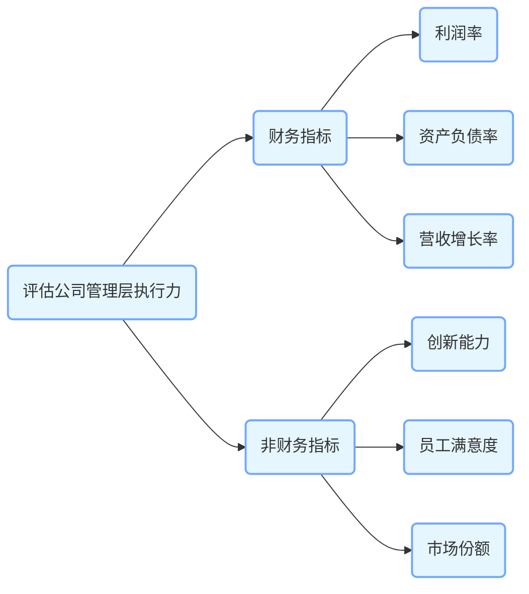

# 彼得林奇对公司管理层执行力的量化评估

> 关键词：彼得林奇、公司管理层、执行力、量化评估、财务指标、非财务指标

> 摘要：本文深入探讨彼得林奇对公司管理层执行力的量化评估方法。通过对彼得林奇投资理念的研究，阐述了评估公司管理层执行力的重要性。详细介绍了从财务和非财务等多方面进行量化评估的核心概念、算法原理、数学模型等内容，并结合项目实战案例进行详细分析。同时，探讨了其在实际应用场景中的作用，推荐了相关学习资源、开发工具和论文著作。最后总结了未来发展趋势与挑战，为投资者和企业管理者提供了全面且深入的参考。

## 1. 背景介绍 
### 1.1 目的和范围
本文章的目的在于深入剖析彼得林奇对公司管理层执行力量化评估的方法和理念。彼得林奇作为投资界的传奇人物，其投资策略和对公司管理层的评估方法具有极高的借鉴价值。通过对其方法的研究和梳理，我们旨在帮助投资者更好地判断公司的投资价值，也为企业管理者提供改进管理层执行力的参考。范围涵盖了彼得林奇所涉及的各类评估指标和方法，包括财务指标、非财务指标等，以及如何将这些指标综合运用进行量化评估。

### 1.2 预期读者
预期读者包括广大投资者，无论是专业投资者还是普通散户，都能从本文中获取对公司管理层执行力评估的有效方法，从而提高投资决策的准确性。企业管理者也能从中学到如何提升自身管理层的执行力，优化企业运营。此外，对金融投资和企业管理理论研究感兴趣的学者和学生也可将本文作为参考资料。

### 1.3 文档结构概述
本文首先介绍背景信息，包括目的、预期读者和文档结构概述等内容。接着阐述核心概念与联系，展示评估的原理和架构。然后详细讲解核心算法原理和具体操作步骤，结合Python源代码进行说明。随后介绍数学模型和公式，并举例说明。通过项目实战案例，包括开发环境搭建、源代码实现和解读等，进一步加深对量化评估的理解。之后探讨实际应用场景，推荐相关工具和资源。最后总结未来发展趋势与挑战，解答常见问题，并提供扩展阅读和参考资料。

### 1.4 术语表
#### 1.4.1 核心术语定义
- **管理层执行力**：指公司管理层将战略目标转化为实际成果的能力，包括决策的执行效率、资源的合理配置、团队的协作能力等方面。
- **量化评估**：将管理层执行力这一较为抽象的概念，通过一系列具体的指标和方法转化为可度量的数据，以便进行比较和分析。
- **财务指标**：反映公司财务状况和经营成果的指标，如利润率、资产负债率、营收增长率等。
- **非财务指标**：除财务指标外，用于评估公司管理层执行力的其他指标，如创新能力、员工满意度、市场份额等。

#### 1.4.2 相关概念解释
- **彼得林奇投资理念**：彼得林奇强调通过深入研究公司基本面，包括管理层素质、业务模式、行业前景等，来寻找具有投资价值的公司。他注重实地调研和对公司细节的了解，认为优秀的管理层是公司成功的关键因素之一。
- **公司基本面分析**：对公司的财务状况、经营管理、行业竞争等方面进行全面分析，以评估公司的内在价值和发展潜力。

#### 1.4.3 缩略词列表
- **ROE**：净资产收益率（Return on Equity）
- **EPS**：每股收益（Earnings Per Share）
- **PEG**：市盈率相对盈利增长比率（Price/Earnings to Growth Ratio）

## 2. 核心概念与联系 

### 核心概念原理
彼得林奇对公司管理层执行力的量化评估基于一个全面的视角，认为管理层执行力的强弱直接影响公司的业绩和发展前景。评估主要从财务和非财务两个维度展开。

从财务维度来看，管理层的决策和执行能力会直接体现在公司的财务报表中。例如，高效的管理层能够合理控制成本，提高利润率；善于把握市场机会，实现营收的增长；合理配置资产，优化资产负债率等。通过对这些财务指标的分析，可以在一定程度上反映管理层的执行力。

从非财务维度来看，管理层的领导能力、创新能力、团队协作能力等也对公司的长期发展至关重要。例如，具有创新精神的管理层能够带领公司推出新产品、开拓新市场；良好的团队协作能力能够提高员工的工作效率和满意度，从而提升公司的整体竞争力。

### 架构的文本示意图
彼得林奇的量化评估架构可以概括为以下几个层次：

- **目标层**：评估公司管理层的执行力。
- **准则层**：分为财务指标和非财务指标两个子准则层。
- **指标层**：财务指标包括利润率、资产负债率、营收增长率等；非财务指标包括创新能力、员工满意度、市场份额等。

### Mermaid 流程图


## 3. 核心算法原理 & 具体操作步骤 

### 核心算法原理
彼得林奇的量化评估算法主要是通过对各个指标进行打分，然后根据一定的权重进行加权求和，得到一个综合的评估分数。具体步骤如下：

1. **确定评估指标**：根据前面介绍的财务和非财务指标体系，确定具体的评估指标。
2. **设定指标权重**：根据各个指标对管理层执行力的重要程度，设定相应的权重。权重之和为 1。
3. **数据收集**：收集公司的相关数据，包括财务报表数据、市场调研数据、员工调查数据等。
4. **指标打分**：根据收集到的数据，对每个指标进行打分。打分可以采用百分制或其他合适的评分标准。
5. **加权求和**：将每个指标的得分乘以其对应的权重，然后将所有指标的加权得分相加，得到综合评估分数。

### 具体操作步骤及 Python 源代码
以下是一个简单的 Python 示例，演示如何实现上述量化评估算法：

```python
# 定义评估指标和权重
financial_weights = {
    "利润率": 0.3,
    "资产负债率": 0.2,
    "营收增长率": 0.3
}

non_financial_weights = {
    "创新能力": 0.1,
    "员工满意度": 0.05,
    "市场份额": 0.05
}

# 定义指标得分
financial_scores = {
    "利润率": 80,
    "资产负债率": 70,
    "营收增长率": 85
}

non_financial_scores = {
    "创新能力": 75,
    "员工满意度": 80,
    "市场份额": 70
}

# 计算财务指标加权得分
financial_total_score = 0
for metric, weight in financial_weights.items():
    financial_total_score += financial_scores[metric] * weight

# 计算非财务指标加权得分
non_financial_total_score = 0
for metric, weight in non_financial_weights.items():
    non_financial_total_score += non_financial_scores[metric] * weight

# 计算综合评估分数
total_score = financial_total_score + non_financial_total_score

print(f"综合评估分数: {total_score}")
```

### 代码解释
1. **定义评估指标和权重**：使用字典 `financial_weights` 和 `non_financial_weights` 分别存储财务和非财务指标的权重。
2. **定义指标得分**：使用字典 `financial_scores` 和 `non_financial_scores` 分别存储财务和非财务指标的得分。
3. **计算财务指标加权得分**：遍历财务指标的权重字典，将每个指标的得分乘以其对应的权重，然后累加得到财务指标的加权总分。
4. **计算非财务指标加权得分**：同理，遍历非财务指标的权重字典，计算非财务指标的加权总分。
5. **计算综合评估分数**：将财务指标和非财务指标的加权总分相加，得到综合评估分数。

## 4. 数学模型和公式 & 详细讲解 & 举例说明 

### 数学模型和公式
设评估指标共有 $n$ 个，分别为 $x_1, x_2, \cdots, x_n$，对应的权重为 $w_1, w_2, \cdots, w_n$，且 $\sum_{i=1}^{n} w_i = 1$。每个指标的得分记为 $s_i$，则综合评估分数 $S$ 的计算公式为：

$$S = \sum_{i=1}^{n} w_i s_i$$

### 详细讲解
这个公式的原理是将每个指标的得分乘以其对应的权重，然后将所有指标的加权得分相加，得到综合评估分数。权重的作用是体现每个指标在整体评估中的重要程度。例如，如果某个指标的权重较大，说明该指标对管理层执行力的影响较大，其得分对综合评估分数的贡献也会更大。

### 举例说明
假设我们有三个财务指标：利润率（权重 0.3）、资产负债率（权重 0.2）、营收增长率（权重 0.3），以及三个非财务指标：创新能力（权重 0.1）、员工满意度（权重 0.05）、市场份额（权重 0.05）。各指标的得分如下：

- 利润率：80 分
- 资产负债率：70 分
- 营收增长率：85 分
- 创新能力：75 分
- 员工满意度：80 分
- 市场份额：70 分

根据上述公式，计算综合评估分数：

财务指标加权得分：

$S_{财务} = 0.3 \times 80 + 0.2 \times 70 + 0.3 \times 85 = 24 + 14 + 25.5 = 63.5$

非财务指标加权得分：

$S_{非财务} = 0.1 \times 75 + 0.05 \times 80 + 0.05 \times 70 = 7.5 + 4 + 3.5 = 15$

综合评估分数：

$S = S_{财务} + S_{非财务} = 63.5 + 15 = 78.5$

因此，该公司管理层执行力的综合评估分数为 78.5 分。

## 5. 项目实战：代码实际案例和详细解释说明 

### 5.1  开发环境搭建
- **Python 安装**：首先需要安装 Python 开发环境。可以从 Python 官方网站（https://www.python.org/downloads/） 下载适合你操作系统的 Python 版本，并按照安装向导进行安装。
- **开发工具**：推荐使用 PyCharm 作为开发工具。PyCharm 是一款功能强大的 Python 集成开发环境（IDE），提供了代码编辑、调试、版本控制等一系列功能。可以从 JetBrains 官方网站（https://www.jetbrains.com/pycharm/download/） 下载并安装。
- **必要库安装**：在这个项目中，我们主要使用 Python 内置的库，无需额外安装第三方库。如果后续需要进行数据处理和分析，可以安装 `pandas`、`numpy` 等库。可以使用以下命令进行安装：

```sh
pip install pandas numpy
```

### 5.2  源代码详细实现和代码解读
以下是一个更完整的 Python 代码示例，包含数据输入、指标打分、加权求和等功能：

```python
# 定义评估指标和权重
financial_weights = {
    "利润率": 0.3,
    "资产负债率": 0.2,
    "营收增长率": 0.3
}

non_financial_weights = {
    "创新能力": 0.1,
    "员工满意度": 0.05,
    "市场份额": 0.05
}

# 数据输入函数
def input_scores():
    financial_scores = {}
    non_financial_scores = {}

    print("请输入财务指标得分：")
    for metric in financial_weights.keys():
        score = float(input(f"{metric} 得分: "))
        financial_scores[metric] = score

    print("请输入非财务指标得分：")
    for metric in non_financial_weights.keys():
        score = float(input(f"{metric} 得分: "))
        non_financial_scores[metric] = score

    return financial_scores, non_financial_scores

# 计算加权得分函数
def calculate_weighted_scores(scores, weights):
    total_score = 0
    for metric, weight in weights.items():
        total_score += scores[metric] * weight
    return total_score

# 主函数
def main():
    financial_scores, non_financial_scores = input_scores()

    financial_total_score = calculate_weighted_scores(financial_scores, financial_weights)
    non_financial_total_score = calculate_weighted_scores(non_financial_scores, non_financial_weights)

    total_score = financial_total_score + non_financial_total_score

    print(f"综合评估分数: {total_score}")

if __name__ == "__main__":
    main()
```

### 代码解读
1. **数据输入函数 `input_scores`**：该函数用于从用户输入中获取财务和非财务指标的得分。通过循环遍历指标列表，提示用户输入每个指标的得分，并将其存储在相应的字典中。
2. **计算加权得分函数 `calculate_weighted_scores`**：该函数接受指标得分字典和权重字典作为参数，遍历权重字典，将每个指标的得分乘以其对应的权重，然后累加得到加权总分。
3. **主函数 `main`**：调用 `input_scores` 函数获取用户输入的指标得分，然后分别调用 `calculate_weighted_scores` 函数计算财务和非财务指标的加权得分，最后将两者相加得到综合评估分数并输出。

### 5.3  代码解读与分析
- **灵活性**：该代码通过函数的封装，使得代码具有较高的灵活性。可以方便地修改评估指标和权重，以适应不同的评估需求。
- **可扩展性**：如果需要添加新的评估指标，只需要在相应的权重字典中添加新的指标和权重，同时在 `input_scores` 函数中添加相应的输入提示即可。
- **用户交互性**：通过用户输入的方式获取指标得分，增强了代码的用户交互性，使得用户可以根据实际情况进行评估。

## 6. 实际应用场景 
### 投资者决策
投资者在选择投资标的时，可以使用彼得林奇的量化评估方法对公司管理层的执行力进行评估。通过综合考虑财务和非财务指标，投资者可以更全面地了解公司的基本面，判断公司的投资价值。例如，如果一家公司的管理层执行力评估分数较高，说明该公司的管理层具有较强的决策和执行能力，公司的业绩和发展前景可能较好，投资者可以考虑增加对该公司的投资。

### 企业内部管理
企业管理者可以使用该方法对自身管理层的执行力进行评估，发现存在的问题和不足，及时采取措施进行改进。例如，如果发现某个部门的员工满意度较低，可能意味着该部门的管理层在团队管理方面存在问题，需要加强沟通和激励机制。通过不断优化管理层的执行力，企业可以提高运营效率，增强市场竞争力。

### 行业研究
行业研究人员可以使用该方法对不同公司的管理层执行力进行比较分析，了解行业内企业的竞争态势。通过分析行业内优秀企业的管理层执行力特点，为其他企业提供借鉴和参考。例如，研究发现某个行业内的领先企业在创新能力方面表现突出，其他企业可以学习其创新管理模式，提升自身的创新能力。

## 7. 工具和资源推荐
### 7.1 学习资源推荐
#### 7.1.1 书籍推荐
- 《彼得林奇的成功投资》：彼得林奇的经典著作，详细介绍了他的投资理念和方法，包括如何评估公司管理层的素质和执行力。
- 《聪明的投资者》：本杰明·格雷厄姆的著作，被誉为投资界的圣经，对价值投资理念和公司基本面分析有深入的阐述。
- 《财务报表分析》：帮助读者了解如何解读公司的财务报表，掌握财务指标的分析方法，为评估管理层执行力提供基础。

#### 7.1.2 在线课程
- Coursera 上的《投资学原理》：由知名大学教授授课，系统介绍投资学的基本原理和方法，包括公司基本面分析和管理层评估。
- edX 上的《财务分析与决策》：通过案例分析和实践操作，帮助学习者掌握财务分析的技巧和方法，提升对公司财务状况的理解能力。

#### 7.1.3 技术博客和网站
- 雪球网：国内知名的投资社区，汇聚了众多投资者和投资专家，提供丰富的公司分析和投资策略分享。
- Seeking Alpha：国外知名的投资研究网站，提供全球范围内的公司分析和投资观点，有助于拓宽投资视野。

### 7.2 开发工具框架推荐
#### 7.2.1 IDE和编辑器
- PyCharm：功能强大的 Python 集成开发环境，提供代码编辑、调试、版本控制等一系列功能，适合开发 Python 程序。
- Visual Studio Code：轻量级的代码编辑器，支持多种编程语言，具有丰富的插件生态系统，可以根据需要进行扩展。

#### 7.2.2 调试和性能分析工具
- pdb：Python 内置的调试器，可以帮助开发者定位代码中的问题。
- cProfile：Python 内置的性能分析工具，可以分析代码的执行时间和性能瓶颈。

#### 7.2.3 相关框架和库
- pandas：用于数据处理和分析的 Python 库，提供了高效的数据结构和数据操作方法，方便对公司财务数据进行处理和分析。
- numpy：Python 的科学计算库，提供了高效的数组操作和数学函数，有助于进行数值计算和模型实现。

### 7.3 相关论文著作推荐
#### 7.3.1 经典论文
- Fama, E. F., & French, K. R. (1992). The cross-section of expected stock returns. Journal of Finance, 47(2), 427-465. 该论文提出了著名的 Fama-French 三因子模型，对股票收益率的影响因素进行了深入研究，为公司基本面分析提供了理论基础。
- Jensen, M. C., & Meckling, W. H. (1976). Theory of the firm: Managerial behavior, agency costs and ownership structure. Journal of Financial Economics, 3(4), 305-360. 该论文探讨了公司治理中的委托代理问题，对理解管理层行为和公司绩效之间的关系具有重要意义。

#### 7.3.2 最新研究成果
- 关注顶级金融学术期刊，如 the Journal of Financial Economics、Review of Financial Studies 等，了解关于公司管理层评估和投资决策的最新研究动态。

#### 7.3.3 应用案例分析
- 可以参考一些知名投资机构的研究报告和案例分析，了解他们在评估公司管理层执行力方面的实践经验和方法。

## 8. 总结：未来发展趋势与挑战
### 未来发展趋势
- **数据驱动的精细化评估**：随着大数据和人工智能技术的发展，未来对公司管理层执行力的量化评估将更加依赖于海量的数据。通过挖掘更多维度的数据，如社交媒体数据、供应链数据等，可以实现更加精细化的评估，提高评估的准确性和可靠性。
- **跨学科融合**：评估方法将不再局限于财务和管理领域，而是会融合心理学、社会学等多学科的知识。例如，通过研究管理层的心理特征和行为模式，更好地理解其决策过程和执行力表现。
- **实时动态评估**：传统的评估方法往往是基于历史数据进行的，具有一定的滞后性。未来的评估将更加注重实时性和动态性，能够及时反映管理层执行力的变化情况，为投资者和企业管理者提供更及时的决策依据。

### 挑战
- **数据质量和隐私问题**：在数据驱动的评估中，数据质量是关键。不准确或不完整的数据可能导致评估结果的偏差。同时，随着数据的大量收集和使用，数据隐私问题也日益突出，如何在保护数据隐私的前提下进行有效的评估是一个亟待解决的问题。
- **模型的复杂性和可解释性**：为了提高评估的准确性，模型可能会变得越来越复杂。然而，复杂的模型往往缺乏可解释性，使得投资者和企业管理者难以理解评估结果背后的逻辑。如何在保证模型准确性的同时，提高其可解释性是一个挑战。
- **环境变化的适应性**：公司所处的市场环境和行业竞争态势不断变化，管理层执行力的评估标准也需要相应地调整。如何使评估方法具有足够的适应性，能够及时反映环境变化的影响，是未来需要解决的问题。

## 9. 附录：常见问题与解答
### 问题 1：如何确定评估指标的权重？
答：确定评估指标的权重需要综合考虑多个因素，包括指标的重要性、数据的可获取性、行业特点等。可以采用专家打分法、层次分析法等方法来确定权重。在实际应用中，也可以根据经验和实际情况进行调整。

### 问题 2：非财务指标的数据如何获取？
答：非财务指标的数据获取相对较为困难，可以通过以下途径获取：市场调研、员工问卷调查、行业报告、媒体报道等。例如，创新能力可以通过公司的专利数量、新产品推出频率等数据来衡量；员工满意度可以通过员工问卷调查来获取。

### 问题 3：量化评估结果是否完全准确？
答：量化评估结果只是一个参考，不能完全准确地反映公司管理层的执行力。因为管理层执行力是一个复杂的概念，受到多种因素的影响，有些因素难以用数据进行量化。因此，在使用量化评估结果时，还需要结合定性分析和实地调研等方法，进行综合判断。

## 10. 扩展阅读 & 参考资料
- 彼得林奇相关的其他著作和访谈资料，深入了解其投资理念和方法。
- 金融和管理领域的学术期刊，如 the Journal of Finance、Academy of Management Journal 等，获取最新的研究成果和理论进展。
- 公司年报、行业研究报告等资料，用于获取公司和行业的实际数据和案例。

作者：AI天才研究院/AI Genius Institute & 禅与计算机程序设计艺术 /Zen And The Art of Computer Programming