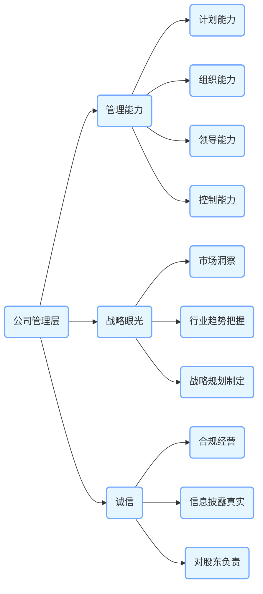

# 彼得林奇对公司管理层的要求

> 关键词：彼得林奇、公司管理层、投资理念、管理能力、企业发展

> 摘要：本文深入探讨了彼得林奇对公司管理层的要求。彼得林奇作为投资界的传奇人物，其投资理念中对公司管理层的考量占据重要地位。文章首先介绍了研究这一主题的背景、目的、预期读者等内容；接着阐述了与公司管理层相关的核心概念及联系；详细分析了彼得林奇评判管理层的核心算法原理与具体操作步骤，并给出相关数学模型和公式；通过项目实战案例，进一步说明如何根据这些要求分析公司管理层；探讨了这些要求在实际应用场景中的体现；推荐了学习、开发相关的工具和资源；最后总结了未来发展趋势与挑战，解答了常见问题，并提供了扩展阅读和参考资料，旨在帮助读者全面理解彼得林奇对公司管理层的要求及其在投资和企业管理中的重要意义。

## 1. 背景介绍 
### 1.1 目的和范围
彼得林奇在投资领域取得了辉煌成就，他的投资策略和对公司的分析方法备受关注。研究他对公司管理层的要求，目的在于深入理解他的投资理念，为投资者在选择投资标的时提供更全面的视角，同时也为企业管理层提供参考，明确自身应具备的素质和能力，以提升企业的竞争力和价值。本文章的范围涵盖了彼得林奇对公司管理层各个方面的要求，包括管理能力、战略眼光、诚信等，并探讨这些要求在实际企业中的应用和评估方法。

### 1.2 预期读者
本文预期读者包括投资者，无论是专业投资者还是个人投资者，都可以从彼得林奇的经验中学习如何评估公司管理层，从而做出更明智的投资决策；企业管理者可以借鉴这些要求来提升自身管理水平和团队素质；金融和管理领域的研究人员可以将其作为研究投资理论和企业管理的参考资料。

### 1.3 文档结构概述
本文将按照以下结构展开：首先介绍相关背景信息，让读者了解研究的目的和意义；接着阐述核心概念，包括公司管理层的定义、与企业发展的联系等；详细讲解彼得林奇评判管理层的核心算法原理和具体操作步骤，并给出相应的数学模型和公式；通过项目实战案例，展示如何在实际中运用这些方法分析公司管理层；探讨实际应用场景，说明这些要求在不同行业和企业中的体现；推荐学习和开发相关的工具和资源；最后总结未来发展趋势与挑战，解答常见问题，并提供扩展阅读和参考资料。

### 1.4 术语表
#### 1.4.1 核心术语定义
- **公司管理层**：指负责公司日常运营和战略决策的高级管理人员团队，包括首席执行官（CEO）、首席财务官（CFO）、首席运营官（COO）等。
- **投资回报率（ROI）**：是指通过投资而应返回的价值，即企业从一项投资活动中得到的经济回报，计算公式为 $ROI = \frac{投资收益 - 投资成本}{投资成本} \times 100\%$。
- **股东权益报酬率（ROE）**：又称净资产收益率，是净利润与平均股东权益的百分比，反映股东权益的收益水平，用以衡量公司运用自有资本的效率，计算公式为 $ROE = \frac{净利润}{平均股东权益} \times 100\%$。

#### 1.4.2 相关概念解释
- **管理能力**：包括计划、组织、领导和控制等方面的能力，管理层需要能够制定合理的战略规划，有效地组织资源，激励员工，确保企业目标的实现。
- **战略眼光**：指管理层能够洞察市场趋势和行业发展方向，提前布局，为企业的长期发展制定正确的战略。
- **诚信**：管理层在经营活动中要遵守法律法规和道德规范，诚实守信，对股东和员工负责。

#### 1.4.3 缩略词列表
- **CEO**：Chief Executive Officer，首席执行官
- **CFO**：Chief Financial Officer，首席财务官
- **COO**：Chief Operating Officer，首席运营官
- **ROI**：Return on Investment，投资回报率
- **ROE**：Return on Equity，股东权益报酬率

## 2. 核心概念与联系 
### 核心概念原理
公司管理层是企业的核心决策和执行团队，他们的素质和能力直接影响企业的发展和绩效。彼得林奇认为，优秀的管理层应该具备良好的管理能力、敏锐的战略眼光和高度的诚信。管理能力确保企业能够高效运营，合理配置资源；战略眼光使企业能够适应市场变化，抓住发展机遇；诚信则是企业长期稳定发展的基础，能够赢得投资者和客户的信任。

### 架构的文本示意图
```plaintext
公司管理层
|-- 管理能力
|   |-- 计划能力
|   |-- 组织能力
|   |-- 领导能力
|   |-- 控制能力
|-- 战略眼光
|   |-- 市场洞察
|   |-- 行业趋势把握
|   |-- 战略规划制定
|-- 诚信
|   |-- 合规经营
|   |-- 信息披露真实
|   |-- 对股东负责
```

### Mermaid 流程图


## 3. 核心算法原理 & 具体操作步骤 
### 核心算法原理
彼得林奇评判公司管理层的核心算法可以理解为一个综合评估模型，通过对管理能力、战略眼光和诚信等多个维度进行量化评估，得出一个综合得分，以此来判断管理层的优劣。具体来说，每个维度可以进一步细分为多个指标，为每个指标赋予一定的权重，根据实际情况对每个指标进行评分，最后将各指标得分乘以相应权重并求和，得到综合得分。

### Python 源代码详细阐述
```python
# 定义各维度指标及权重
dimensions = {
    "管理能力": {
        "计划能力": 0.2,
        "组织能力": 0.2,
        "领导能力": 0.3,
        "控制能力": 0.3
    },
    "战略眼光": {
        "市场洞察": 0.3,
        "行业趋势把握": 0.3,
        "战略规划制定": 0.4
    },
    "诚信": {
        "合规经营": 0.4,
        "信息披露真实": 0.3,
        "对股东负责": 0.3
    }
}

# 定义各指标评分函数
def rate_management_ability(plan_score, organize_score, lead_score, control_score):
    """
    计算管理能力维度得分
    :param plan_score: 计划能力得分
    :param organize_score: 组织能力得分
    :param lead_score: 领导能力得分
    :param control_score: 控制能力得分
    :return: 管理能力维度得分
    """
    management_ability_score = (
        dimensions["管理能力"]["计划能力"] * plan_score +
        dimensions["管理能力"]["组织能力"] * organize_score +
        dimensions["管理能力"]["领导能力"] * lead_score +
        dimensions["管理能力"]["控制能力"] * control_score
    )
    return management_ability_score

def rate_strategic_vision(market_insight_score, industry_trend_score, strategy_planning_score):
    """
    计算战略眼光维度得分
    :param market_insight_score: 市场洞察得分
    :param industry_trend_score: 行业趋势把握得分
    :param strategy_planning_score: 战略规划制定得分
    :return: 战略眼光维度得分
    """
    strategic_vision_score = (
        dimensions["战略眼光"]["市场洞察"] * market_insight_score +
        dimensions["战略眼光"]["行业趋势把握"] * industry_trend_score +
        dimensions["战略眼光"]["战略规划制定"] * strategy_planning_score
    )
    return strategic_vision_score

def rate_integrity(compliance_score, disclosure_score, shareholder_responsibility_score):
    """
    计算诚信维度得分
    :param compliance_score: 合规经营得分
    :param disclosure_score: 信息披露真实得分
    :param shareholder_responsibility_score: 对股东负责得分
    :return: 诚信维度得分
    """
    integrity_score = (
        dimensions["诚信"]["合规经营"] * compliance_score +
        dimensions["诚信"]["信息披露真实"] * disclosure_score +
        dimensions["诚信"]["对股东负责"] * shareholder_responsibility_score
    )
    return integrity_score

# 定义综合评分函数
def overall_score(management_ability_score, strategic_vision_score, integrity_score):
    """
    计算综合得分
    :param management_ability_score: 管理能力维度得分
    :param strategic_vision_score: 战略眼光维度得分
    :param integrity_score: 诚信维度得分
    :return: 综合得分
    """
    # 假设各维度权重相等
    overall = (management_ability_score + strategic_vision_score + integrity_score) / 3
    return overall

# 示例评分
plan_score = 8
organize_score = 7
lead_score = 9
control_score = 8
market_insight_score = 7
industry_trend_score = 8
strategy_planning_score = 9
compliance_score = 9
disclosure_score = 8
shareholder_responsibility_score = 9

# 计算各维度得分
management_ability = rate_management_ability(plan_score, organize_score, lead_score, control_score)
strategic_vision = rate_strategic_vision(market_insight_score, industry_trend_score, strategy_planning_score)
integrity = rate_integrity(compliance_score, disclosure_score, shareholder_responsibility_score)

# 计算综合得分
final_score = overall_score(management_ability, strategic_vision, integrity)

print(f"管理能力维度得分: {management_ability}")
print(f"战略眼光维度得分: {strategic_vision}")
print(f"诚信维度得分: {integrity}")
print(f"综合得分: {final_score}")
```

### 具体操作步骤
1. **确定各维度指标及权重**：根据彼得林奇的投资理念和经验，确定管理能力、战略眼光和诚信三个维度，并进一步细分每个维度的指标，为每个指标赋予合理的权重。
2. **收集数据并评分**：通过查阅公司年报、新闻报道、行业研究报告等资料，收集与各指标相关的数据，对每个指标进行评分。评分可以采用 1 - 10 分制，1 分表示最差，10 分表示最好。
3. **计算各维度得分**：根据各指标的评分和权重，使用上述 Python 代码中的评分函数计算各维度得分。
4. **计算综合得分**：将各维度得分按照一定的权重进行加权平均，得到综合得分。综合得分越高，说明公司管理层越优秀。

## 4. 数学模型和公式 & 详细讲解 & 举例说明 
### 数学模型
设管理能力维度为 $M$，战略眼光维度为 $S$，诚信维度为 $I$，各维度的权重分别为 $w_M$、$w_S$、$w_I$（$w_M + w_S + w_I = 1$）。每个维度又包含多个指标，设管理能力维度的指标为 $m_1, m_2, \cdots, m_n$，其权重分别为 $w_{m_1}, w_{m_2}, \cdots, w_{m_n}$（$\sum_{i=1}^{n} w_{m_i} = 1$）；战略眼光维度的指标为 $s_1, s_2, \cdots, s_p$，其权重分别为 $w_{s_1}, w_{s_2}, \cdots, w_{s_p}$（$\sum_{j=1}^{p} w_{s_j} = 1$）；诚信维度的指标为 $i_1, i_2, \cdots, i_q$，其权重分别为 $w_{i_1}, w_{i_2}, \cdots, w_{i_q}$（$\sum_{k=1}^{q} w_{i_k} = 1$）。各指标的评分为 $r_{m_i}$、$r_{s_j}$、$r_{i_k}$。

则管理能力维度得分 $M$ 为：
$$M = \sum_{i=1}^{n} w_{m_i} r_{m_i}$$

战略眼光维度得分 $S$ 为：
$$S = \sum_{j=1}^{p} w_{s_j} r_{s_j}$$

诚信维度得分 $I$ 为：
$$I = \sum_{k=1}^{q} w_{i_k} r_{i_k}$$

综合得分 $O$ 为：
$$O = w_M M + w_S S + w_I I$$

### 详细讲解
- **各维度得分计算**：每个维度的得分是该维度下各指标得分的加权平均值。权重的设置反映了各指标在该维度中的重要程度。例如，在管理能力维度中，如果认为领导能力比计划能力更重要，可以为领导能力赋予更高的权重。
- **综合得分计算**：综合得分是各维度得分的加权平均值，权重的设置反映了各维度在评估公司管理层中的重要程度。例如，如果认为诚信在评估中更为重要，可以为诚信维度赋予更高的权重。

### 举例说明
假设各维度权重相等，即 $w_M = w_S = w_I = \frac{1}{3}$。管理能力维度包含计划能力、组织能力、领导能力和控制能力四个指标，权重分别为 $0.2$、$0.2$、$0.3$、$0.3$；战略眼光维度包含市场洞察、行业趋势把握和战略规划制定三个指标，权重分别为 $0.3$、$0.3$、$0.4$；诚信维度包含合规经营、信息披露真实和对股东负责三个指标，权重分别为 $0.4$、$0.3$、$0.3$。各指标评分如下：

| 维度 | 指标 | 评分 |
| ---- | ---- | ---- |
| 管理能力 | 计划能力 | 8 |
| 管理能力 | 组织能力 | 7 |
| 管理能力 | 领导能力 | 9 |
| 管理能力 | 控制能力 | 8 |
| 战略眼光 | 市场洞察 | 7 |
| 战略眼光 | 行业趋势把握 | 8 |
| 战略眼光 | 战略规划制定 | 9 |
| 诚信 | 合规经营 | 9 |
| 诚信 | 信息披露真实 | 8 |
| 诚信 | 对股东负责 | 9 |

首先计算管理能力维度得分：
$$M = 0.2 \times 8 + 0.2 \times 7 + 0.3 \times 9 + 0.3 \times 8 = 8.1$$

战略眼光维度得分：
$$S = 0.3 \times 7 + 0.3 \times 8 + 0.4 \times 9 = 8.1$$

诚信维度得分：
$$I = 0.4 \times 9 + 0.3 \times 8 + 0.3 \times 9 = 8.7$$

综合得分：
$$O = \frac{1}{3} \times 8.1 + \frac{1}{3} \times 8.1 + \frac{1}{3} \times 8.7 = 8.3$$

通过这个例子可以看出，根据各指标的评分和权重，可以计算出各维度得分和综合得分，从而对公司管理层进行量化评估。

## 5. 项目实战：代码实际案例和详细解释说明 
### 5.1  开发环境搭建
- **Python 安装**：首先需要安装 Python 环境，建议安装 Python 3.7 及以上版本。可以从 Python 官方网站（https://www.python.org/downloads/）下载适合自己操作系统的安装包，按照安装向导进行安装。
- **开发工具**：推荐使用 PyCharm 作为开发工具，它是一款功能强大的 Python 集成开发环境（IDE），可以提供代码编辑、调试、自动补全等功能。可以从 JetBrains 官方网站（https://www.jetbrains.com/pycharm/download/）下载社区版或专业版。

### 5.2  源代码详细实现和代码解读
```python
# 定义各维度指标及权重
dimensions = {
    "管理能力": {
        "计划能力": 0.2,
        "组织能力": 0.2,
        "领导能力": 0.3,
        "控制能力": 0.3
    },
    "战略眼光": {
        "市场洞察": 0.3,
        "行业趋势把握": 0.3,
        "战略规划制定": 0.4
    },
    "诚信": {
        "合规经营": 0.4,
        "信息披露真实": 0.3,
        "对股东负责": 0.3
    }
}

# 定义各指标评分函数
def rate_management_ability(plan_score, organize_score, lead_score, control_score):
    """
    计算管理能力维度得分
    :param plan_score: 计划能力得分
    :param organize_score: 组织能力得分
    :param lead_score: 领导能力得分
    :param control_score: 控制能力得分
    :return: 管理能力维度得分
    """
    management_ability_score = (
        dimensions["管理能力"]["计划能力"] * plan_score +
        dimensions["管理能力"]["组织能力"] * organize_score +
        dimensions["管理能力"]["领导能力"] * lead_score +
        dimensions["管理能力"]["控制能力"] * control_score
    )
    return management_ability_score

def rate_strategic_vision(market_insight_score, industry_trend_score, strategy_planning_score):
    """
    计算战略眼光维度得分
    :param market_insight_score: 市场洞察得分
    :param industry_trend_score: 行业趋势把握得分
    :param strategy_planning_score: 战略规划制定得分
    :return: 战略眼光维度得分
    """
    strategic_vision_score = (
        dimensions["战略眼光"]["市场洞察"] * market_insight_score +
        dimensions["战略眼光"]["行业趋势把握"] * industry_trend_score +
        dimensions["战略眼光"]["战略规划制定"] * strategy_planning_score
    )
    return strategic_vision_score

def rate_integrity(compliance_score, disclosure_score, shareholder_responsibility_score):
    """
    计算诚信维度得分
    :param compliance_score: 合规经营得分
    :param disclosure_score: 信息披露真实得分
    :param shareholder_responsibility_score: 对股东负责得分
    :return: 诚信维度得分
    """
    integrity_score = (
        dimensions["诚信"]["合规经营"] * compliance_score +
        dimensions["诚信"]["信息披露真实"] * disclosure_score +
        dimensions["诚信"]["对股东负责"] * shareholder_responsibility_score
    )
    return integrity_score

# 定义综合评分函数
def overall_score(management_ability_score, strategic_vision_score, integrity_score):
    """
    计算综合得分
    :param management_ability_score: 管理能力维度得分
    :param strategic_vision_score: 战略眼光维度得分
    :param integrity_score: 诚信维度得分
    :return: 综合得分
    """
    # 假设各维度权重相等
    overall = (management_ability_score + strategic_vision_score + integrity_score) / 3
    return overall

# 示例评分
plan_score = 8
organize_score = 7
lead_score = 9
control_score = 8
market_insight_score = 7
industry_trend_score = 8
strategy_planning_score = 9
compliance_score = 9
disclosure_score = 8
shareholder_responsibility_score = 9

# 计算各维度得分
management_ability = rate_management_ability(plan_score, organize_score, lead_score, control_score)
strategic_vision = rate_strategic_vision(market_insight_score, industry_trend_score, strategy_planning_score)
integrity = rate_integrity(compliance_score, disclosure_score, shareholder_responsibility_score)

# 计算综合得分
final_score = overall_score(management_ability, strategic_vision, integrity)

print(f"管理能力维度得分: {management_ability}")
print(f"战略眼光维度得分: {strategic_vision}")
print(f"诚信维度得分: {integrity}")
print(f"综合得分: {final_score}")
```

### 代码解读与分析
- **维度和指标权重定义**：通过 `dimensions` 字典定义了管理能力、战略眼光和诚信三个维度，以及每个维度下的具体指标和相应的权重。权重的设置可以根据实际情况进行调整。
- **评分函数**：定义了 `rate_management_ability`、`rate_strategic_vision` 和 `rate_integrity` 三个函数，分别用于计算管理能力、战略眼光和诚信维度的得分。这些函数根据各指标的评分和权重进行加权求和。
- **综合评分函数**：`overall_score` 函数用于计算综合得分，这里假设各维度权重相等，将三个维度的得分相加后除以 3 得到综合得分。
- **示例评分和计算**：给出了各指标的示例评分，调用上述函数计算各维度得分和综合得分，并将结果打印输出。

通过这个代码示例，可以方便地对公司管理层进行量化评估，根据不同的指标评分和权重设置，得到不同的评估结果。

## 6. 实际应用场景 
### 投资决策
投资者在选择投资标的时，可以运用彼得林奇对公司管理层的要求来评估目标公司。通过分析管理层的管理能力、战略眼光和诚信程度，判断公司的发展潜力和风险。如果公司管理层优秀，具有良好的管理能力和战略眼光，并且诚信经营，那么该公司更有可能在市场竞争中取得成功，投资者可以考虑增加对该公司的投资。相反，如果管理层存在问题，如管理混乱、战略失误或诚信缺失，投资者则需要谨慎对待。

### 企业管理咨询
企业管理咨询公司可以根据彼得林奇的标准，为企业提供管理层评估和改进建议。通过对企业管理层的全面评估，发现存在的问题和不足之处，为企业制定针对性的改进方案，提升管理层的素质和能力，从而提高企业的管理水平和竞争力。

### 企业并购与重组
在企业并购与重组过程中，对目标公司管理层的评估至关重要。收购方需要了解目标公司管理层的能力和素质，判断他们是否能够适应新的组织架构和发展战略。如果目标公司管理层优秀，收购方可以考虑保留原管理层，以确保企业的稳定发展；如果管理层存在问题，收购方可能需要进行管理层调整，引入新的管理团队。

### 企业内部管理
企业自身也可以运用这些标准来评估和提升管理层的绩效。通过定期对管理层进行评估，激励管理层不断提高自身素质和能力，促进企业的持续发展。同时，企业可以根据评估结果，为管理层提供针对性的培训和发展机会，帮助他们更好地履行职责。

## 7. 工具和资源推荐
### 7.1 学习资源推荐
#### 7.1.1 书籍推荐
- 《彼得·林奇的成功投资》：彼得·林奇的经典著作，详细介绍了他的投资理念和方法，包括如何评估公司管理层等内容。
- 《战胜华尔街》：进一步阐述了彼得·林奇的投资策略和实践经验，对投资者有很大的启发。
- 《管理学原理》：系统介绍了管理学的基本原理和方法，有助于读者深入理解管理能力的内涵。

#### 7.1.2 在线课程
- Coursera 平台上的“投资学原理”课程：由知名教授授课，涵盖了投资分析的各个方面，包括公司基本面分析和管理层评估。
- edX 平台上的“企业战略管理”课程：帮助学习者了解企业战略制定和执行的过程，提升战略眼光。

#### 7.1.3 技术博客和网站
- 雪球网：国内知名的投资社区，有很多投资者分享对公司管理层的分析和看法。
- Seeking Alpha：国外的金融投资网站，提供丰富的公司研究报告和分析文章，包括对管理层的评估。

### 7.2 开发工具框架推荐
#### 7.2.1 IDE和编辑器
- PyCharm：功能强大的 Python 集成开发环境，适合开发和调试与管理层评估相关的 Python 代码。
- Jupyter Notebook：交互式编程环境，方便进行数据探索和分析，可用于对管理层评估数据的处理和可视化。

#### 7.2.2 调试和性能分析工具
- Py-Spy：用于分析 Python 程序的性能瓶颈，帮助优化代码性能。
- pdb：Python 自带的调试器，可用于调试 Python 代码中的逻辑错误。

#### 7.2.3 相关框架和库
- Pandas：用于数据处理和分析，可方便地处理管理层评估数据。
- Matplotlib：用于数据可视化，可将评估结果以图表的形式展示出来，更直观地呈现管理层的表现。

### 7.3 相关论文著作推荐
#### 7.3.1 经典论文
- Fama, E. F., & Jensen, M. C. (1983). Separation of ownership and control. The Journal of Law and Economics, 26(2), 301 - 325. 该论文探讨了公司所有权和控制权分离的问题，对理解管理层的角色和责任有重要意义。
- Jensen, M. C., & Meckling, W. H. (1976). Theory of the firm: Managerial behavior, agency costs and ownership structure. Journal of financial economics, 3(4), 305 - 360. 提出了代理理论，分析了管理层与股东之间的利益冲突和代理成本问题。

#### 7.3.2 最新研究成果
- 在 SSRN（社会科学研究网络）和 Google Scholar 上可以搜索到关于公司管理层评估和治理的最新研究论文，了解该领域的前沿动态。

#### 7.3.3 应用案例分析
- 《哈佛商业评论》上有很多关于企业管理层成功或失败案例的分析文章，通过学习这些案例，可以更好地理解彼得林奇对公司管理层的要求在实际中的应用。

## 8. 总结：未来发展趋势与挑战
### 未来发展趋势
- **数字化和智能化评估**：随着信息技术的发展，未来对公司管理层的评估将越来越多地采用数字化和智能化手段。利用大数据分析、人工智能算法等技术，可以更全面、准确地收集和分析管理层的相关数据，提高评估的效率和准确性。
- **多元化评估指标**：除了传统的管理能力、战略眼光和诚信等指标外，未来的评估指标将更加多元化。例如，会更加关注管理层的创新能力、可持续发展意识、社会责任履行等方面，以适应社会和市场的发展需求。
- **全球化视角**：在全球化背景下，企业的竞争日益激烈，对公司管理层的要求也越来越高。未来的评估将更加注重管理层的国际化视野和跨文化管理能力，以帮助企业在全球市场中取得竞争优势。

### 挑战
- **数据获取和质量问题**：要进行准确的管理层评估，需要大量的相关数据。然而，数据的获取可能存在困难，特别是一些非公开的数据。同时，数据的质量也可能存在问题，如数据不准确、不完整等，这会影响评估结果的可靠性。
- **主观因素影响**：在评估管理层的过程中，不可避免地会受到主观因素的影响。不同的评估者对同一管理层的评价可能存在差异，如何减少主观因素的影响，提高评估的客观性是一个挑战。
- **环境变化快速**：市场环境和行业发展变化迅速，管理层需要不断适应新的变化。这使得评估管理层的难度增加，如何准确评估管理层在动态环境中的适应能力和应变能力是一个亟待解决的问题。

## 9. 附录：常见问题与解答
### 1. 如何确定各指标的权重？
各指标的权重可以根据不同的行业、企业发展阶段和评估目的进行确定。一般来说，可以参考行业标准、专家意见和历史数据。例如，在高科技行业，创新能力可能更为重要，可以为与创新相关的指标赋予较高的权重；在传统制造业，管理效率和成本控制可能更为关键，可以相应调整相关指标的权重。

### 2. 评分的依据是什么？
评分的依据可以包括多个方面，如公司的财务报表、业绩指标、市场表现、新闻报道、行业研究报告等。例如，评估管理能力时，可以参考公司的利润率、资产回报率等财务指标；评估战略眼光时，可以关注公司的新产品研发、市场拓展等战略举措。同时，也可以结合投资者的实地调研和与管理层的交流来获取更全面的信息。

### 3. 评估结果如何应用？
评估结果可以应用于投资决策、企业管理咨询、企业并购与重组等多个方面。在投资决策中，可以根据评估结果选择更具潜力的投资标的；在企业管理咨询中，可以为企业提供改进建议，提升管理层的素质和能力；在企业并购与重组中，可以帮助收购方了解目标公司管理层的情况，做出合理的决策。

### 4. 评估结果的准确性如何保证？
为了保证评估结果的准确性，需要从多个方面入手。首先，要确保数据的准确性和完整性，尽量收集多渠道的数据进行验证。其次，要合理确定各指标的权重和评分标准，避免主观因素的影响。此外，还可以采用多种评估方法进行综合评估，提高评估结果的可靠性。

## 10. 扩展阅读 & 参考资料
### 扩展阅读
- 《聪明的投资者》：本杰明·格雷厄姆的经典著作，介绍了价值投资的理念和方法，与彼得林奇的投资理念有一定的关联。
- 《基业长青》：探讨了优秀企业长期保持卓越的原因，对理解公司管理层的重要性和作用有很大的帮助。

### 参考资料
- 彼得·林奇. 《彼得·林奇的成功投资》. 机械工业出版社.
- 彼得·林奇. 《战胜华尔街》. 机械工业出版社.
- Fama, E. F., & Jensen, M. C. (1983). Separation of ownership and control. The Journal of Law and Economics, 26(2), 301 - 325.
- Jensen, M. C., & Meckling, W. H. (1976). Theory of the firm: Managerial behavior, agency costs and ownership structure. Journal of financial economics, 3(4), 305 - 360.

作者：AI天才研究院/AI Genius Institute & 禅与计算机程序设计艺术 /Zen And The Art of Computer Programming