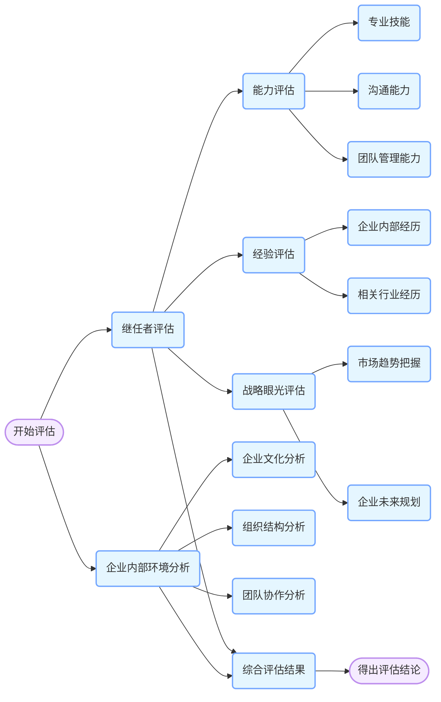

# 彼得林奇对公司管理层继任计划的评估

> 关键词：彼得林奇、公司管理层、继任计划、评估方法、企业发展

> 摘要：本文聚焦于彼得林奇对公司管理层继任计划的评估这一主题。深入探讨彼得林奇评估公司管理层继任计划的方法、背后的原理以及在实际企业中的应用。通过详细分析核心概念、算法原理、数学模型，结合项目实战案例，阐述评估继任计划对于企业长期发展的重要性。同时介绍相关工具和资源，最后总结未来发展趋势与挑战，并对常见问题进行解答，为投资者和企业管理者提供全面的参考。

## 1. 背景介绍 
### 1.1 目的和范围
目的在于深入研究彼得林奇评估公司管理层继任计划的方式和思路，为投资者和企业管理者提供可借鉴的评估方法。范围涵盖彼得林奇评估的各个方面，包括对继任者能力、经验、战略眼光等的考量，以及评估对企业未来发展的影响。

### 1.2 预期读者
本文预期读者包括投资者，他们希望通过评估公司管理层继任计划来判断企业的投资价值；企业管理者，借鉴评估方法完善自身企业的管理层继任计划；以及对企业管理和投资领域感兴趣的研究人员和学生。

### 1.3 文档结构概述
文档首先介绍相关背景知识，包括目的、预期读者和文档结构。接着阐述核心概念与联系，说明彼得林奇评估的关键要素及其相互关系。然后详细讲解核心算法原理和具体操作步骤，结合数学模型和公式进行说明。通过项目实战案例展示评估方法的实际应用。介绍实际应用场景和相关工具资源。最后总结未来发展趋势与挑战，解答常见问题，并提供扩展阅读和参考资料。

### 1.4 术语表
#### 1.4.1 核心术语定义
- **管理层继任计划**：企业为确保在现任管理层离职（如退休、辞职等）时，有合适的人员能够顺利接替其职位，保证企业的正常运营和持续发展而制定的计划。
- **彼得林奇评估法**：彼得林奇在评估公司管理层继任计划时所采用的一系列方法和考量因素，综合考虑继任者的个人素质、企业内部环境等多方面因素。

#### 1.4.2 相关概念解释
- **企业可持续发展**：企业在长期的经营过程中，不仅要实现当前的经济效益，还要考虑社会、环境等多方面的因素，保持稳定、健康的发展态势。管理层继任计划的有效实施是企业可持续发展的重要保障之一。
- **继任者能力匹配度**：继任者的专业技能、管理能力、领导风格等与即将接任的职位要求相契合的程度。匹配度越高，继任者越有可能成功履行职责。

#### 1.4.3 缩略词列表
本文暂无缩略词。

## 2. 核心概念与联系 

### 核心概念原理
彼得林奇评估公司管理层继任计划主要基于对企业长期发展的考量。他认为一个良好的继任计划能够确保企业在管理层更替时保持稳定的运营和发展。核心概念包括对继任者的评估和对企业内部环境的分析。

对继任者的评估主要关注其能力、经验和战略眼光。能力包括专业技能、沟通能力、团队管理能力等；经验涵盖在企业内部或相关行业的工作经历；战略眼光则体现为对市场趋势的把握和对企业未来发展方向的规划能力。

对企业内部环境的分析包括企业文化、组织结构和团队协作等方面。一个积极向上、注重创新的企业文化有利于吸引和培养优秀的继任者；合理的组织结构能够为继任者提供清晰的发展路径；良好的团队协作氛围有助于继任者顺利开展工作。

### 架构的文本示意图
```plaintext
彼得林奇对公司管理层继任计划的评估
|-- 继任者评估
|   |-- 能力
|   |   |-- 专业技能
|   |   |-- 沟通能力
|   |   |-- 团队管理能力
|   |-- 经验
|   |   |-- 企业内部经历
|   |   |-- 相关行业经历
|   |-- 战略眼光
|       |-- 市场趋势把握
|       |-- 企业未来规划
|-- 企业内部环境分析
|   |-- 企业文化
|   |-- 组织结构
|   |-- 团队协作
```

### Mermaid 流程图


## 3. 核心算法原理 & 具体操作步骤 

### 核心算法原理
彼得林奇的评估方法并非基于严格的数学算法，而是一种综合的评估体系。可以用以下方式来近似表示其评估过程：

设继任者评估得分 $S_{successor}$ 由能力得分 $S_{ability}$、经验得分 $S_{experience}$ 和战略眼光得分 $S_{strategy}$ 组成，权重分别为 $w_{ability}$、$w_{experience}$ 和 $w_{strategy}$，且 $w_{ability}+w_{experience}+w_{strategy}=1$。

$S_{successor}=w_{ability}S_{ability}+w_{experience}S_{experience}+w_{strategy}S_{strategy}$

企业内部环境得分 $S_{environment}$ 由企业文化得分 $S_{culture}$、组织结构得分 $S_{structure}$ 和团队协作得分 $S_{collaboration}$ 组成，权重分别为 $w_{culture}$、$w_{structure}$ 和 $w_{collaboration}$，且 $w_{culture}+w_{structure}+w_{collaboration}=1$。

$S_{environment}=w_{culture}S_{culture}+w_{structure}S_{structure}+w_{collaboration}S_{collaboration}$

最终的评估得分 $S_{total}$ 由继任者评估得分和企业内部环境得分加权得到，权重分别为 $w_{successor}$ 和 $w_{environment}$，且 $w_{successor}+w_{environment}=1$。

$S_{total}=w_{successor}S_{successor}+w_{environment}S_{environment}$

### 具体操作步骤

```python
# 定义权重
w_ability = 0.4
w_experience = 0.3
w_strategy = 0.3
w_culture = 0.3
w_structure = 0.3
w_collaboration = 0.4
w_successor = 0.6
w_environment = 0.4

def evaluate_successor(ability_score, experience_score, strategy_score):
    """
    评估继任者得分
    :param ability_score: 能力得分
    :param experience_score: 经验得分
    :param strategy_score: 战略眼光得分
    :return: 继任者评估得分
    """
    return w_ability * ability_score + w_experience * experience_score + w_strategy * strategy_score

def evaluate_environment(culture_score, structure_score, collaboration_score):
    """
    评估企业内部环境得分
    :param culture_score: 企业文化得分
    :param structure_score: 组织结构得分
    :param collaboration_score: 团队协作得分
    :return: 企业内部环境得分
    """
    return w_culture * culture_score + w_structure * structure_score + w_collaboration * collaboration_score

def evaluate_total(successor_score, environment_score):
    """
    评估最终得分
    :param successor_score: 继任者评估得分
    :param environment_score: 企业内部环境得分
    :return: 最终评估得分
    """
    return w_successor * successor_score + w_environment * environment_score

# 示例数据
ability_score = 80
experience_score = 70
strategy_score = 75
culture_score = 75
structure_score = 80
collaboration_score = 85

# 计算得分
successor_score = evaluate_successor(ability_score, experience_score, strategy_score)
environment_score = evaluate_environment(culture_score, structure_score, collaboration_score)
total_score = evaluate_total(successor_score, environment_score)

print(f"继任者评估得分: {successor_score}")
print(f"企业内部环境得分: {environment_score}")
print(f"最终评估得分: {total_score}")
```

在上述代码中，首先定义了各个因素的权重。然后定义了三个函数分别用于计算继任者评估得分、企业内部环境得分和最终评估得分。最后使用示例数据进行计算并输出结果。

## 4. 数学模型和公式 & 详细讲解 & 举例说明 

### 数学模型和公式
如前文所述，主要的数学模型包括：

- 继任者评估得分公式：$S_{successor}=w_{ability}S_{ability}+w_{experience}S_{experience}+w_{strategy}S_{strategy}$
- 企业内部环境得分公式：$S_{environment}=w_{culture}S_{culture}+w_{structure}S_{structure}+w_{collaboration}S_{collaboration}$
- 最终评估得分公式：$S_{total}=w_{successor}S_{successor}+w_{environment}S_{environment}$

### 详细讲解
- **继任者评估得分公式**：该公式通过对继任者的能力、经验和战略眼光三个方面进行加权求和得到继任者的评估得分。权重的设置反映了不同因素在评估中的重要程度。例如，$w_{ability}=0.4$ 表示能力在继任者评估中占比 40%。
- **企业内部环境得分公式**：此公式用于评估企业内部环境，考虑了企业文化、组织结构和团队协作三个方面。权重的分配体现了各个因素对企业内部环境的影响程度。
- **最终评估得分公式**：将继任者评估得分和企业内部环境得分进行加权求和，得到最终的评估得分。权重的选择取决于评估者对继任者和企业内部环境的重视程度。

### 举例说明
假设一家公司正在评估其管理层继任计划。评估团队对继任者的能力、经验和战略眼光进行打分，分别为 85 分、78 分和 82 分。对企业的企业文化、组织结构和团队协作进行打分，分别为 72 分、75 分和 80 分。根据上述公式和设定的权重进行计算：

$S_{ability}=85$，$S_{experience}=78$，$S_{strategy}=82$

$S_{successor}=0.4\times85 + 0.3\times78 + 0.3\times82$
$=34 + 23.4 + 24.6$
$=82$

$S_{culture}=72$，$S_{structure}=75$，$S_{collaboration}=80$

$S_{environment}=0.3\times72 + 0.3\times75 + 0.4\times80$
$=21.6 + 22.5 + 32$
$=76.1$

$S_{total}=0.6\times82 + 0.4\times76.1$
$=49.2 + 30.44$
$=79.64$

通过计算得到该公司管理层继任计划的最终评估得分是 79.64 分。根据这个得分，评估团队可以对该继任计划的优劣做出判断，并提出相应的改进建议。

## 5. 项目实战：代码实际案例和详细解释说明 

### 5.1  开发环境搭建
- **Python 安装**：首先需要安装 Python 环境，建议使用 Python 3.7 及以上版本。可以从 Python 官方网站（https://www.python.org/downloads/）下载适合自己操作系统的安装包进行安装。
- **开发工具**：可以选择使用 PyCharm、VS Code 等集成开发环境（IDE），也可以使用 Jupyter Notebook 进行代码的编写和调试。以 PyCharm 为例，从 JetBrains 官方网站（https://www.jetbrains.com/pycharm/download/）下载并安装社区版。

### 5.2  源代码详细实现和代码解读
```python
# 定义权重
w_ability = 0.4
w_experience = 0.3
w_strategy = 0.3
w_culture = 0.3
w_structure = 0.3
w_collaboration = 0.4
w_successor = 0.6
w_environment = 0.4

def evaluate_successor(ability_score, experience_score, strategy_score):
    """
    评估继任者得分
    :param ability_score: 能力得分
    :param experience_score: 经验得分
    :param strategy_score: 战略眼光得分
    :return: 继任者评估得分
    """
    return w_ability * ability_score + w_experience * experience_score + w_strategy * strategy_score

def evaluate_environment(culture_score, structure_score, collaboration_score):
    """
    评估企业内部环境得分
    :param culture_score: 企业文化得分
    :param structure_score: 组织结构得分
    :param collaboration_score: 团队协作得分
    :return: 企业内部环境得分
    """
    return w_culture * culture_score + w_structure * structure_score + w_collaboration * collaboration_score

def evaluate_total(successor_score, environment_score):
    """
    评估最终得分
    :param successor_score: 继任者评估得分
    :param environment_score: 企业内部环境得分
    :return: 最终评估得分
    """
    return w_successor * successor_score + w_environment * environment_score

# 模拟输入数据
ability_score = float(input("请输入继任者的能力得分: "))
experience_score = float(input("请输入继任者的经验得分: "))
strategy_score = float(input("请输入继任者的战略眼光得分: "))
culture_score = float(input("请输入企业文化得分: "))
structure_score = float(input("请输入组织结构得分: "))
collaboration_score = float(input("请输入团队协作得分: "))

# 计算得分
successor_score = evaluate_successor(ability_score, experience_score, strategy_score)
environment_score = evaluate_environment(culture_score, structure_score, collaboration_score)
total_score = evaluate_total(successor_score, environment_score)

# 输出结果
print(f"继任者评估得分: {successor_score}")
print(f"企业内部环境得分: {environment_score}")
print(f"最终评估得分: {total_score}")
```

### 代码解读与分析
- **权重定义**：在代码开头定义了各个因素的权重，这些权重可以根据实际情况进行调整。
- **评估函数**：定义了三个评估函数 `evaluate_successor`、`evaluate_environment` 和 `evaluate_total`，分别用于计算继任者评估得分、企业内部环境得分和最终评估得分。
- **输入数据**：使用 `input` 函数获取用户输入的各项得分，并将其转换为浮点数类型。
- **得分计算**：调用评估函数计算各项得分。
- **结果输出**：使用 `print` 函数输出计算结果，方便用户查看。

通过这个代码案例，用户可以根据实际情况输入各项得分，快速得到公司管理层继任计划的评估结果。

## 6. 实际应用场景 
### 投资者决策
投资者在选择投资标的时，会关注公司管理层的稳定性和未来发展潜力。通过评估公司管理层继任计划，投资者可以判断公司在管理层更替时是否能够保持稳定的运营和发展，从而决定是否投资该公司。例如，如果一家公司的继任计划完善，继任者能力出众，企业内部环境良好，投资者可能会更愿意投资该公司。

### 企业内部管理
企业自身也需要对管理层继任计划进行评估，以确保计划的有效性。通过评估，企业可以发现继任计划中存在的问题，如继任者能力不足、企业文化不适应等，并及时采取措施进行改进。同时，评估结果也可以为企业的人才培养和选拔提供参考。

### 行业研究
研究机构和学者可以通过对不同公司管理层继任计划的评估，了解行业内企业的管理水平和发展趋势。这有助于推动行业的整体发展，为行业政策的制定提供依据。

## 7. 工具和资源推荐
### 7.1 学习资源推荐
#### 7.1.1 书籍推荐
- 《彼得·林奇的成功投资》：彼得·林奇的经典著作，详细介绍了他的投资理念和方法，其中包含对公司管理层评估的相关内容。
- 《基业长青》：探讨了优秀企业长期保持卓越的秘诀，其中涉及到企业管理层继任计划的重要性和实施方法。

#### 7.1.2 在线课程
- Coursera 上的“企业管理与领导力”课程：系统介绍企业管理的各个方面，包括管理层继任计划的制定和评估。
- edX 上的“投资分析与决策”课程：讲解投资分析的方法和技巧，其中会涉及到对公司管理层的评估。

#### 7.1.3 技术博客和网站
- Seeking Alpha：提供专业的投资分析和研究报告，其中有很多关于公司管理层评估的文章。
- Harvard Business Review：哈佛商业评论网站，发布了大量关于企业管理和领导力的前沿研究成果。

### 7.2 开发工具框架推荐
#### 7.2.1 IDE和编辑器
- PyCharm：功能强大的 Python 集成开发环境，提供代码编辑、调试、版本控制等功能。
- VS Code：轻量级的代码编辑器，支持多种编程语言，通过安装插件可以扩展功能。

#### 7.2.2 调试和性能分析工具
- Py-Spy：用于分析 Python 程序的性能，找出性能瓶颈。
- PDB：Python 内置的调试器，可以帮助开发者定位和解决代码中的问题。

#### 7.2.3 相关框架和库
- Pandas：用于数据处理和分析，在评估过程中可以方便地处理和存储各项得分数据。
- Matplotlib：用于数据可视化，将评估结果以图表的形式展示出来，更直观地呈现数据。

### 7.3 相关论文著作推荐
#### 7.3.1 经典论文
- "Succession Planning and Firm Performance: An Empirical Investigation"：该论文研究了管理层继任计划与企业绩效之间的关系，为评估继任计划提供了理论支持。
- "The Role of Leadership in Organizational Succession"：探讨了领导力在企业继任过程中的作用，对评估继任者的领导能力有重要参考价值。

#### 7.3.2 最新研究成果
- 关注顶级管理学期刊如《Academy of Management Journal》《Strategic Management Journal》上发表的关于管理层继任计划的最新研究，了解该领域的前沿动态。

#### 7.3.3 应用案例分析
- 一些知名咨询公司如麦肯锡、波士顿咨询集团发布的企业管理案例报告，其中包含了很多关于管理层继任计划的实际应用案例和分析。

## 8. 总结：未来发展趋势与挑战
### 未来发展趋势
- **数字化评估**：随着信息技术的发展，未来对公司管理层继任计划的评估将越来越多地采用数字化手段。利用大数据和人工智能技术，可以更全面、准确地收集和分析相关数据，提高评估的效率和准确性。
- **国际化视野**：在全球化的背景下，企业的管理层继任计划需要考虑国际化因素。继任者需要具备跨文化管理能力和国际市场的战略眼光，评估方法也将更加注重国际化标准。
- **多元化考量**：除了传统的能力、经验和战略眼光等因素，未来的评估还将更加关注继任者的创新能力、社会责任意识等多元化因素，以适应不断变化的市场环境和社会需求。

### 挑战
- **数据获取难度**：评估公司管理层继任计划需要大量的数据支持，但部分数据可能涉及企业机密或个人隐私，获取难度较大。如何在保护数据安全和隐私的前提下，获取准确、全面的数据是一个挑战。
- **评估标准的主观性**：虽然可以建立数学模型进行评估，但评估过程中仍然存在一定的主观性。不同的评估者对各个因素的权重和评分标准可能存在差异，导致评估结果的不一致性。
- **快速变化的市场环境**：市场环境变化迅速，企业的发展战略和管理层需求也会随之改变。如何确保评估方法能够及时适应市场变化，准确评估继任计划的有效性是一个挑战。

## 9. 附录：常见问题与解答
### 问题 1：权重的设置有固定的标准吗？
解答：权重的设置没有固定的标准，需要根据企业的实际情况和评估者的侧重点进行调整。例如，对于技术创新型企业，可能更看重继任者的创新能力和战略眼光，相应地可以提高这两个因素的权重。

### 问题 2：如何确定各项得分？
解答：各项得分可以通过多种方式确定。对于能力、经验等方面，可以通过面试、绩效考核、行业评价等方式进行评估打分；对于企业文化、组织结构等方面，可以通过问卷调查、内部访谈等方式收集数据并进行打分。

### 问题 3：评估结果如何应用？
解答：评估结果可以为投资者的投资决策提供参考，也可以帮助企业发现继任计划中存在的问题并进行改进。企业可以根据评估结果制定针对性的人才培养和选拔计划，提高继任计划的有效性。

## 10. 扩展阅读 & 参考资料
- 《金融炼金术》，乔治·索罗斯著
- 《聪明的投资者》，本杰明·格雷厄姆著
- 彼得·林奇官方网站
- 各大财经媒体关于公司管理层评估的相关报道

作者：AI天才研究院/AI Genius Institute & 禅与计算机程序设计艺术 /Zen And The Art of Computer Programming