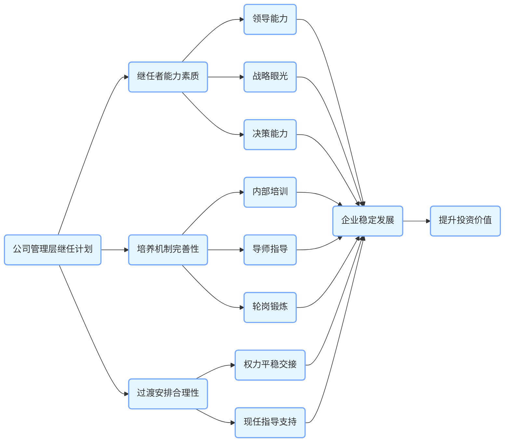

# 彼得林奇对公司管理层继任计划的质量评估

> 关键词：彼得林奇、公司管理层继任计划、质量评估、企业管理、投资分析

> 摘要：本文聚焦于彼得林奇对公司管理层继任计划质量评估的相关内容。首先介绍了背景信息，包括目的范围、预期读者等。接着阐述了核心概念，即公司管理层继任计划及其与企业发展的联系。通过分析核心算法原理和数学模型，构建评估思路。然后结合项目实战，给出实际案例及详细解释。探讨了该评估在实际中的应用场景，推荐了相关学习资源、开发工具和论文著作。最后总结未来发展趋势与挑战，并提供常见问题解答和扩展阅读参考资料，旨在为读者全面剖析彼得林奇评估方法的价值和应用。

## 1. 背景介绍 
### 1.1 目的和范围
本研究的目的在于深入剖析彼得林奇对公司管理层继任计划质量评估的方法、标准和重要性。彼得林奇作为投资界的传奇人物，其投资理念和分析方法对投资者和企业管理者都具有极高的借鉴价值。我们将探讨他如何通过评估管理层继任计划来判断一家公司的长期发展潜力和稳定性，以及这种评估对投资决策和企业战略规划的影响。

研究范围涵盖了彼得林奇在其投资生涯中所涉及的各类公司，包括不同行业、规模和发展阶段的企业。我们将分析他所关注的继任计划的关键要素，如继任者的能力、培养机制、过渡安排等，并研究这些要素如何影响公司的业绩和市场表现。

### 1.2 预期读者
本文的预期读者包括投资者、企业管理者、金融分析师以及对企业管理和投资领域感兴趣的学者和研究人员。对于投资者来说，了解彼得林奇的评估方法可以帮助他们在选择投资标的时，更加关注公司管理层的稳定性和可持续发展能力；企业管理者可以借鉴这些方法来优化自身的管理层继任计划，提升公司的竞争力；金融分析师可以将其作为评估公司价值的重要参考；而学者和研究人员则可以通过本文深入研究彼得林奇的投资思想和企业管理理论。

### 1.3 文档结构概述
本文将按照以下结构展开：首先介绍核心概念，明确公司管理层继任计划的定义、重要性以及与企业发展的联系；接着阐述核心算法原理和具体操作步骤，通过 Python 代码示例展示如何进行初步的评估分析；然后引入数学模型和公式，对评估过程进行量化和深入讲解；通过项目实战部分，给出实际案例，详细解释代码实现和评估过程；探讨该评估在实际中的应用场景；推荐相关的学习资源、开发工具和论文著作；最后总结未来发展趋势与挑战，提供常见问题解答和扩展阅读参考资料。

### 1.4 术语表
#### 1.4.1 核心术语定义
- **公司管理层继任计划**：指公司为确保管理层的连续性和稳定性，提前规划和培养合适的继任者，以应对现任管理层退休、离职或其他突发情况的一系列策略和措施。
- **继任者**：指被公司选定或培养，有望在未来接替现任管理层职位的人员。
- **质量评估**：对公司管理层继任计划的合理性、有效性和可行性进行综合评价，以判断其对公司长期发展的支持程度。

#### 1.4.2 相关概念解释
- **企业可持续发展**：企业在追求经济效益的同时，注重社会、环境和利益相关者的需求，实现长期稳定的发展。管理层继任计划是保障企业可持续发展的重要因素之一，因为稳定的管理层能够制定和执行连贯的战略。
- **投资价值**：指一家公司在市场上的潜在价值，包括其盈利能力、增长潜力、资产质量等。彼得林奇认为，良好的管理层继任计划可以提升公司的投资价值，因为它降低了管理层变动带来的不确定性。

#### 1.4.3 缩略词列表
目前本文未涉及特定的缩略词。

## 2. 核心概念与联系 

### 公司管理层继任计划的定义和重要性
公司管理层继任计划是企业战略管理的重要组成部分。它不仅仅是为了应对管理层的更替，更重要的是确保公司的战略方向能够持续贯彻，业务能够稳定发展。一个完善的继任计划可以减少管理层变动对公司运营的冲击，避免因关键岗位空缺而导致的决策延误和业务混乱。

从企业发展的角度来看，管理层继任计划有助于培养和留住优秀人才。通过为员工提供明确的职业发展路径和晋升机会，公司可以激励员工积极进取，提高员工的忠诚度和工作满意度。同时，继任计划也可以吸引外部优秀人才的加入，为公司注入新的活力和创新思维。

### 彼得林奇评估的核心要点
彼得林奇在评估公司管理层继任计划的质量时，主要关注以下几个方面：
1. **继任者的能力和素质**：继任者应具备与现任管理层相当或更优秀的能力，包括领导能力、战略眼光、决策能力、团队管理能力等。彼得林奇认为，一个优秀的继任者能够在不同的市场环境下带领公司实现增长。
2. **培养机制的完善性**：公司是否有一套系统的培养机制来选拔和培养继任者。这包括内部培训、导师指导、轮岗锻炼等多种方式，以确保继任者能够全面了解公司的业务和文化。
3. **过渡安排的合理性**：在现任管理层和继任者之间是否有合理的过渡安排，以确保权力的平稳交接。例如，现任管理层可以在一定时间内对继任者进行指导和支持，帮助其顺利适应新的角色。

### 核心概念的联系示意图


从示意图中可以看出，公司管理层继任计划的各个核心要素相互关联，共同影响着企业的稳定发展和投资价值。继任者的能力素质、培养机制的完善性和过渡安排的合理性是保障企业稳定发展的基础，而企业的稳定发展又有助于提升其投资价值，这正是彼得林奇在投资决策中所关注的重点。

## 3. 核心算法原理 & 具体操作步骤 

### 核心算法原理
我们可以将彼得林奇对公司管理层继任计划的质量评估看作一个多因素综合评估的过程。每个因素（如继任者能力、培养机制、过渡安排）都可以赋予一定的权重，然后根据公司在每个因素上的表现进行打分，最后将各个因素的得分加权求和，得到一个综合评估分数。

具体来说，设共有 $n$ 个评估因素，第 $i$ 个因素的权重为 $w_i$，公司在第 $i$ 个因素上的得分是 $s_i$，则综合评估分数 $S$ 可以通过以下公式计算：

$S = \sum_{i=1}^{n} w_i \times s_i$

其中，$\sum_{i=1}^{n} w_i = 1$，即所有因素的权重之和为 1。

### 具体操作步骤
#### 步骤 1：确定评估因素和权重
根据彼得林奇的评估要点，我们可以确定以下评估因素和建议权重：
| 评估因素 | 权重 |
| ---- | ---- |
| 继任者能力素质 | 0.4 |
| 培养机制完善性 | 0.3 |
| 过渡安排合理性 | 0.3 |

#### 步骤 2：对每个因素进行打分
可以采用 1 - 5 分的评分标准，1 分表示非常差，5 分表示非常好。例如：
- **继任者能力素质**：可以从领导能力、战略眼光、决策能力等方面进行综合评估。如果继任者具备丰富的行业经验、卓越的领导才能和清晰的战略思维，可打 5 分；如果能力一般，可打 3 分；如果明显不足，可打 1 分。
- **培养机制完善性**：考察公司是否有系统的培训计划、导师指导和轮岗锻炼等。如果培养机制非常完善，可打 5 分；如果有一些基本的培养措施，但不够全面，可打 3 分；如果几乎没有培养机制，可打 1 分。
- **过渡安排合理性**：评估现任管理层和继任者之间的过渡安排是否合理，是否能够确保权力的平稳交接。如果过渡安排非常合理，有明确的交接计划和时间节点，可打 5 分；如果过渡安排存在一些问题，但不影响基本的交接，可打 3 分；如果过渡安排混乱，可打 1 分。

#### 步骤 3：计算综合评估分数
根据上述公式，将每个因素的权重和得分相乘，然后求和得到综合评估分数。

### Python 代码实现
```python
# 定义评估因素的权重
weights = {
    "继任者能力素质": 0.4,
    "培养机制完善性": 0.3,
    "过渡安排合理性": 0.3
}

# 定义公司在每个因素上的得分
scores = {
    "继任者能力素质": 4,
    "培养机制完善性": 3,
    "过渡安排合理性": 4
}

# 计算综合评估分数
total_score = 0
for factor, weight in weights.items():
    score = scores[factor]
    total_score += weight * score

print(f"综合评估分数: {total_score}")
```

在上述代码中，我们首先定义了评估因素的权重和公司在每个因素上的得分。然后，通过遍历权重字典，将每个因素的权重和得分相乘，并累加到总分数中。最后，打印出综合评估分数。

## 4. 数学模型和公式 & 详细讲解 & 举例说明 

### 数学模型
我们在上一节中已经介绍了综合评估分数的计算公式：

$S = \sum_{i=1}^{n} w_i \times s_i$

其中，$S$ 表示综合评估分数，$n$ 表示评估因素的数量，$w_i$ 表示第 $i$ 个因素的权重，$s_i$ 表示公司在第 $i$ 个因素上的得分。

这个数学模型的核心思想是将多个评估因素进行加权求和，以反映每个因素对整体评估的重要程度。权重的设置可以根据不同的情况进行调整，例如，如果我们认为继任者能力素质对公司的影响更大，可以适当提高其权重。

### 详细讲解
- **权重的确定**：权重的确定是评估过程中的关键步骤。它需要综合考虑各个因素对公司管理层继任计划质量的影响程度。在实际应用中，可以通过专家意见、历史数据分析或经验判断等方法来确定权重。例如，通过对大量成功和失败的继任计划案例进行分析，统计每个因素在其中的作用，从而确定合理的权重。
- **得分的评估**：每个因素的得分需要根据具体的评估标准进行确定。评估标准应该明确、客观，并且具有可操作性。例如，对于继任者能力素质的评估，可以制定详细的能力指标体系，如领导能力、沟通能力、专业技能等，然后根据继任者在这些指标上的表现进行打分。

### 举例说明
假设我们要评估两家公司（公司 A 和公司 B）的管理层继任计划质量。根据上述评估因素和权重，我们对两家公司在每个因素上的得分进行评估，结果如下：

| 公司 | 继任者能力素质（权重 0.4） | 培养机制完善性（权重 0.3） | 过渡安排合理性（权重 0.3） |
| ---- | ---- | ---- | ---- |
| 公司 A | 4 分 | 3 分 | 4 分 |
| 公司 B | 3 分 | 4 分 | 3 分 |

我们可以分别计算两家公司的综合评估分数：

公司 A 的综合评估分数：

$S_A = 0.4 \times 4 + 0.3 \times 3 + 0.3 \times 4$
$= 1.6 + 0.9 + 1.2$
$= 3.7$

公司 B 的综合评估分数：

$S_B = 0.4 \times 3 + 0.3 \times 4 + 0.3 \times 3$
$= 1.2 + 1.2 + 0.9$
$= 3.3$

通过比较两家公司的综合评估分数，我们可以看出公司 A 的管理层继任计划质量相对较高。这意味着在其他条件相同的情况下，公司 A 可能具有更好的长期发展潜力和稳定性，更值得投资者关注。

## 5. 项目实战：代码实际案例和详细解释说明 

### 5.1  开发环境搭建
为了运行我们的评估代码，我们需要搭建一个 Python 开发环境。以下是具体的步骤：

#### 步骤 1：安装 Python
可以从 Python 官方网站（https://www.python.org/downloads/）下载适合你操作系统的 Python 安装包，并按照安装向导进行安装。建议安装 Python 3.6 及以上版本。

#### 步骤 2：安装开发工具
可以选择使用 PyCharm、VS Code 等集成开发环境（IDE），或者使用 Jupyter Notebook 进行交互式开发。这里以 VS Code 为例，你可以从 VS Code 官方网站（https://code.visualstudio.com/）下载并安装。安装完成后，在 VS Code 中安装 Python 扩展，以便支持 Python 代码的编写和调试。

#### 步骤 3：创建项目目录
在本地创建一个新的项目目录，例如 `succession_plan_evaluation`，并在该目录下创建一个 Python 文件，例如 `evaluation.py`。

### 5.2  源代码详细实现和代码解读
以下是一个完整的 Python 代码示例，用于评估多个公司的管理层继任计划质量：

```python
# 定义评估因素的权重
weights = {
    "继任者能力素质": 0.4,
    "培养机制完善性": 0.3,
    "过渡安排合理性": 0.3
}

# 定义多个公司的得分数据
companies_scores = {
    "公司 A": {
        "继任者能力素质": 4,
        "培养机制完善性": 3,
        "过渡安排合理性": 4
    },
    "公司 B": {
        "继任者能力素质": 3,
        "培养机制完善性": 4,
        "过渡安排合理性": 3
    },
    "公司 C": {
        "继任者能力素质": 5,
        "培养机制完善性": 2,
        "过渡安排合理性": 3
    }
}

# 定义评估函数
def evaluate_succession_plan(company_scores):
    total_score = 0
    for factor, weight in weights.items():
        score = company_scores[factor]
        total_score += weight * score
    return total_score

# 评估每个公司的继任计划质量
for company, scores in companies_scores.items():
    score = evaluate_succession_plan(scores)
    print(f"{company} 的综合评估分数: {score}")
```

### 代码解读与分析
#### 代码结构
- **权重定义**：`weights` 字典定义了各个评估因素的权重，这些权重反映了每个因素在综合评估中的重要程度。
- **得分数据**：`companies_scores` 字典存储了多个公司在每个评估因素上的得分。每个公司对应一个子字典，子字典的键是评估因素，值是该公司在该因素上的得分。
- **评估函数**：`evaluate_succession_plan` 函数接受一个公司的得分字典作为输入，根据上述的综合评估公式计算该公司的综合评估分数，并返回结果。
- **评估过程**：通过遍历 `companies_scores` 字典，调用 `evaluate_succession_plan` 函数对每个公司的继任计划质量进行评估，并打印出综合评估分数。

#### 代码扩展性
该代码具有一定的扩展性。如果需要增加或修改评估因素，可以直接修改 `weights` 字典和 `companies_scores` 字典。如果需要对评估结果进行更复杂的处理，例如排序、筛选等，可以在评估过程中添加相应的代码逻辑。

## 6. 实际应用场景 

### 投资决策
对于投资者来说，评估公司管理层继任计划的质量是投资决策的重要参考因素之一。一个良好的继任计划可以降低管理层变动带来的不确定性，提高公司的稳定性和可持续发展能力。例如，彼得林奇在选择投资标的时，会关注公司是否有明确的继任计划以及继任者的能力和素质。如果一家公司的继任计划质量较高，投资者可能更愿意长期持有该公司的股票。

### 企业战略规划
企业管理者可以通过评估管理层继任计划的质量，发现自身在人才培养和管理方面的不足，从而制定相应的战略规划。例如，如果发现培养机制不完善，企业可以加大对内部培训和人才发展的投入；如果过渡安排不合理，企业可以制定更详细的交接计划，确保权力的平稳过渡。

### 企业并购与重组
在企业并购与重组过程中，评估目标公司的管理层继任计划质量可以帮助收购方了解目标公司的管理稳定性和未来发展潜力。如果目标公司的继任计划质量较高，收购方可以更放心地进行并购，因为这意味着在收购后公司的管理层能够顺利过渡，业务能够持续稳定发展。

### 行业研究与比较
金融分析师和研究机构可以通过对不同公司管理层继任计划质量的评估，进行行业研究和比较。这有助于了解不同行业在人才管理和继任规划方面的差异，发现行业的发展趋势和潜在问题。例如，通过比较科技行业和传统制造业的继任计划质量，可以发现科技行业更加注重创新人才的培养和继任者的技术能力，而传统制造业则更强调经验传承和管理稳定性。

## 7. 工具和资源推荐
### 7.1 学习资源推荐
#### 7.1.1 书籍推荐
- 《彼得林奇的成功投资》：彼得林奇的经典著作，详细介绍了他的投资理念和方法，其中包括对公司管理层和企业基本面的分析，对理解他对管理层继任计划的评估方法有很大帮助。
- 《基业长青》：该书研究了多家具有长期竞争优势的企业，探讨了这些企业在管理层继任、企业文化等方面的成功经验，为企业制定和评估继任计划提供了丰富的案例和理论支持。
- 《人力资源管理概论》：全面介绍了人力资源管理的各个方面，包括人才选拔、培养和继任规划等内容，对于深入理解管理层继任计划的相关概念和实践有重要的参考价值。

#### 7.1.2 在线课程
- Coursera 上的“企业战略管理”课程：该课程涵盖了企业战略制定、实施和评估的各个环节，其中包括对管理层继任计划在企业战略中的作用和评估方法的讲解。
- edX 上的“人力资源管理基础”课程：系统介绍了人力资源管理的基本理论和实践，对管理层继任计划的设计和管理有详细的阐述。

#### 7.1.3 技术博客和网站
- Seeking Alpha：一个知名的金融投资博客网站，有许多专业的分析师和投资者分享对公司基本面和管理层的分析文章，其中不乏关于管理层继任计划的讨论。
- Harvard Business Review（哈佛商业评论）：提供了大量关于企业管理、领导力和人力资源管理的前沿研究和实践案例，对于了解管理层继任计划的最新趋势和最佳实践有很大帮助。

### 7.2 开发工具框架推荐
#### 7.2.1 IDE和编辑器
- PyCharm：一款专业的 Python 集成开发环境，具有强大的代码编辑、调试和自动补全功能，适合进行 Python 代码的开发和管理。
- VS Code：一款轻量级的代码编辑器，支持多种编程语言和插件扩展，通过安装 Python 扩展可以方便地进行 Python 开发。

#### 7.2.2 调试和性能分析工具
- pdb：Python 自带的调试工具，可以在代码中设置断点，逐步执行代码，查看变量的值和程序的执行流程，帮助调试代码中的错误。
- cProfile：Python 标准库中的性能分析工具，可以统计代码的运行时间和函数调用次数，帮助找出代码中的性能瓶颈。

#### 7.2.3 相关框架和库
- Pandas：一个强大的数据分析库，提供了高效的数据结构和数据处理工具，可用于对评估数据进行整理、分析和可视化。
- Matplotlib：一个常用的 Python 绘图库，可以绘制各种类型的图表，如柱状图、折线图等，用于展示评估结果。

### 7.3 相关论文著作推荐
#### 7.3.1 经典论文
- “The Impact of CEO Succession on Firm Performance”：该论文研究了 CEO 继任对公司业绩的影响，分析了不同继任方式和继任者特征对公司绩效的作用机制，为评估管理层继任计划的质量提供了理论依据。
- “Succession Planning in Family Firms: A Review and Extension”：聚焦于家族企业的继任规划问题，探讨了家族企业在管理层继任过程中面临的特殊挑战和解决方案，对于理解不同类型企业的继任计划有重要参考价值。

#### 7.3.2 最新研究成果
- 近年来，一些学者开始运用大数据和机器学习方法来评估管理层继任计划的质量。相关研究成果可以在学术数据库如 IEEE Xplore、ACM Digital Library 等上查找。这些研究通过挖掘大量的企业数据，建立预测模型，以更准确地评估继任计划对公司未来发展的影响。

#### 7.3.3 应用案例分析
- 许多咨询公司和研究机构会发布关于企业管理层继任计划的应用案例分析报告。例如，麦肯锡公司的相关报告中会详细分析一些知名企业在继任规划方面的成功经验和失败教训，对于企业管理者和投资者来说具有很强的借鉴意义。

## 8. 总结：未来发展趋势与挑战
### 未来发展趋势
#### 数字化和智能化评估
随着大数据、人工智能和机器学习技术的不断发展，未来对公司管理层继任计划的评估将更加数字化和智能化。通过收集和分析大量的企业数据，包括员工绩效数据、市场竞争数据等，可以建立更准确的评估模型，实现对继任计划质量的实时监测和预测。

#### 多元化和个性化
不同行业、不同规模和不同发展阶段的企业对管理层继任计划的需求存在差异。未来的继任计划将更加多元化和个性化，企业会根据自身的特点和战略目标，制定适合自己的继任计划。例如，科技企业可能更注重创新人才的培养和继任者的技术能力，而传统制造业则更强调经验传承和管理稳定性。

#### 全球化视野
在全球化的背景下，企业的管理层继任计划也需要具有全球化视野。企业需要考虑如何培养和选拔具有国际竞争力的继任者，以适应全球市场的竞争。同时，跨国企业在进行管理层继任时，还需要考虑不同国家和地区的文化差异和法律法规要求。

### 挑战
#### 数据获取和质量问题
数字化和智能化评估需要大量准确的数据支持。然而，企业在获取相关数据时可能会面临困难，例如数据分散、数据不完整、数据质量不高等问题。此外，一些敏感数据的获取和使用还需要遵守相关的法律法规和隐私政策。

#### 人才竞争加剧
随着对优秀继任者的需求不断增加，企业之间的人才竞争将更加激烈。如何吸引和留住优秀的继任者，是企业面临的一大挑战。企业需要提供有吸引力的薪酬福利、职业发展机会和企业文化，以提高自身的人才竞争力。

#### 文化和变革阻力
实施新的管理层继任计划可能会面临文化和变革阻力。一些员工可能对新的继任方式和管理理念不适应，甚至会产生抵触情绪。企业需要加强沟通和培训，营造积极的变革文化，以确保继任计划的顺利实施。

## 9. 附录：常见问题与解答
### 问题 1：如何确定评估因素的权重？
确定评估因素的权重可以采用多种方法，如专家意见法、层次分析法、历史数据分析法等。专家意见法是邀请相关领域的专家根据他们的经验和知识，对各个评估因素的重要程度进行打分，然后取平均值作为权重。层次分析法是一种系统的决策分析方法，通过构建层次结构模型，比较各因素之间的相对重要性，从而确定权重。历史数据分析法是通过分析大量的历史案例，统计每个因素在其中的作用，进而确定合理的权重。

### 问题 2：评估分数的高低如何判断继任计划的质量？
一般来说，评估分数越高，说明公司管理层继任计划的质量越好。但具体的判断标准需要根据不同的行业和企业情况来确定。可以通过与同行业其他公司的评估分数进行比较，或者与企业自身的历史评估分数进行对比，来判断继任计划的质量是否处于较好的水平。此外，还需要结合公司的实际情况，如业务发展阶段、市场竞争环境等，进行综合分析。

### 问题 3：如果公司没有明确的继任计划，如何进行评估？
如果公司没有明确的继任计划，可以从公司的人才培养机制、管理层的发展规划等方面进行评估。例如，考察公司是否有内部培训计划、是否鼓励员工轮岗锻炼、管理层是否有对未来人才需求的规划等。可以根据这些方面的表现，对公司的潜在继任计划质量进行评估，并提出相应的改进建议。

### 问题 4：评估结果对公司有什么实际意义？
评估结果可以为公司的管理层提供决策依据，帮助他们发现继任计划中存在的问题和不足，从而制定相应的改进措施。对于投资者来说，评估结果可以作为投资决策的参考，帮助他们选择具有更好发展潜力和稳定性的公司。此外，评估结果还可以为企业的人力资源管理提供指导，促进企业的人才培养和发展。

## 10. 扩展阅读 & 参考资料
### 扩展阅读
- 《竞争优势》：迈克尔·波特的经典著作，深入探讨了企业如何在市场竞争中获得优势，其中涉及到企业战略、组织管理等方面的内容，与管理层继任计划密切相关。
- 《从优秀到卓越》：研究了从优秀企业到卓越企业的转变过程，分析了这些企业在领导力、企业文化等方面的特点，对于理解管理层继任计划在企业发展中的作用有很大帮助。

### 参考资料
- 彼得林奇. 《彼得林奇的成功投资》. 机械工业出版社.
- 吉姆·柯林斯. 《基业长青》. 中信出版社.
- 加里·德斯勒. 《人力资源管理概论》. 中国人民大学出版社.
- 相关学术论文和研究报告，如 “The Impact of CEO Succession on Firm Performance” 等。

作者：AI天才研究院/AI Genius Institute & 禅与计算机程序设计艺术 /Zen And The Art of Computer Programming