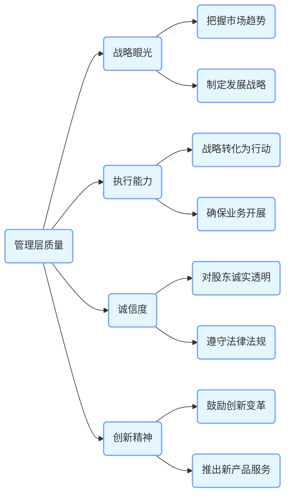

# 彼得林奇对公司管理层质量的要求

> 关键词：彼得林奇、公司管理层质量、投资分析、管理能力、企业发展

> 摘要：本文深入探讨了彼得林奇对公司管理层质量的要求。彼得林奇作为投资界的传奇人物，其投资理念中对公司管理层质量极为看重。文章从背景介绍出发，阐述了研究这一话题的目的、范围、预期读者等内容。接着详细分析了核心概念，包括管理层质量的内涵及与企业发展的联系，并通过示意图和流程图直观展示。对彼得林奇评判管理层质量的核心算法原理及操作步骤进行解读，结合数学模型和公式进一步剖析。通过项目实战案例，展示如何在实际中应用这些评判标准。同时列举了相关的实际应用场景，推荐了学习和研究所需的工具和资源。最后总结了未来发展趋势与挑战，解答常见问题并提供扩展阅读和参考资料，旨在帮助投资者更好地理解和运用彼得林奇的投资智慧，评估公司管理层质量。

## 1. 背景介绍 
### 1.1 目的和范围
彼得林奇是投资领域的杰出代表，他在管理富达麦哲伦基金期间创造了惊人的业绩。研究彼得林奇对公司管理层质量的要求，目的在于帮助投资者掌握一种重要的投资分析方法。通过了解他所看重的管理层特质和能力，投资者能够更准确地评估一家公司的投资价值。本文章的范围涵盖了彼得林奇评判管理层质量的各个方面，包括管理层的决策能力、诚信度、创新精神等，以及如何将这些要求应用于实际的投资决策中。

### 1.2 预期读者
本文的预期读者主要包括投资者，无论是个人投资者还是专业投资机构的从业者，都可以从中学到实用的投资分析技巧。同时，企业管理者也可以从中获得启示，了解优秀管理层应具备的素质，以提升自身管理水平。此外，对投资学、管理学感兴趣的学生和研究人员也能通过本文深入了解彼得林奇的投资理念。

### 1.3 文档结构概述
本文首先介绍背景信息，让读者了解研究的目的和范围。接着阐述核心概念，明确管理层质量的具体含义以及与企业发展的关系。然后讲解核心算法原理和具体操作步骤，通过Python代码详细说明。之后介绍相关的数学模型和公式，并举例说明。再通过项目实战案例，展示如何在实际中运用这些理论。随后列举实际应用场景，推荐学习和研究所需的工具和资源。最后总结未来发展趋势与挑战，解答常见问题并提供扩展阅读和参考资料。

### 1.4 术语表
#### 1.4.1 核心术语定义
- **管理层质量**：指公司管理层在决策、领导、运营等方面所表现出的能力和素质，包括战略眼光、执行能力、诚信度等多个维度。
- **投资价值**：指一家公司对于投资者而言所具有的潜在收益和风险特征，是投资者决定是否投资的重要依据。
- **股东权益**：指公司股东对公司净资产的所有权，反映了股东在公司中的利益。

#### 1.4.2 相关概念解释
- **战略决策**：管理层为实现公司长期目标而制定的重大决策，涉及公司的发展方向、市场定位等关键问题。
- **运营管理**：对公司日常业务活动的管理，包括生产、销售、人力资源等方面，旨在提高公司的运营效率和效益。
- **信息披露**：公司向投资者和社会公众公开其财务状况、经营成果等信息的行为，是保证市场透明度和投资者知情权的重要措施。

#### 1.4.3 缩略词列表
- **ROE**：Return on Equity，净资产收益率，衡量公司盈利能力和股东权益回报水平的指标。
- **EPS**：Earnings Per Share，每股收益，反映公司每股普通股的盈利水平。

## 2. 核心概念与联系 

### 管理层质量的内涵
彼得林奇认为，公司管理层质量是影响公司发展和投资价值的关键因素。一个高质量的管理层应具备以下几个方面的特质：
- **战略眼光**：能够准确把握市场趋势和行业发展方向，制定出符合公司实际情况的长期发展战略。例如，苹果公司的管理层在智能手机市场尚未成熟时，就推出了具有创新性的iPhone，引领了行业的发展潮流。
- **执行能力**：能够将战略决策有效地转化为实际行动，确保公司的各项业务顺利开展。例如，亚马逊的管理层通过高效的物流配送体系和强大的技术支持，实现了快速扩张和持续增长。
- **诚信度**：对股东和投资者保持诚实和透明，遵守法律法规和道德规范。例如，巴菲特非常看重公司管理层的诚信度，他认为只有诚信的管理层才能赢得投资者的信任。
- **创新精神**：鼓励创新和变革，不断推出新产品、新服务和新的商业模式。例如，特斯拉的管理层通过创新的电动汽车技术和自动驾驶技术，颠覆了传统汽车行业。

### 管理层质量与企业发展的联系
管理层质量与企业发展密切相关。一个高质量的管理层能够带领公司在激烈的市场竞争中取得优势，实现可持续发展。具体表现在以下几个方面：
- **提高公司盈利能力**：通过合理的战略决策和高效的运营管理，管理层能够提高公司的生产效率和产品质量，降低成本，从而提高公司的盈利能力。
- **增强公司竞争力**：具备创新精神的管理层能够不断推出新产品和新服务，满足市场需求，提高公司的市场份额和竞争力。
- **保障股东权益**：诚信的管理层能够确保公司的信息披露真实、准确、完整，保障股东的知情权和决策权，维护股东的合法权益。

### 文本示意图
```plaintext
管理层质量
|--战略眼光
|   |--把握市场趋势
|   |--制定发展战略
|--执行能力
|   |--战略转化为行动
|   |--确保业务开展
|--诚信度
|   |--对股东诚实透明
|   |--遵守法律法规
|--创新精神
|   |--鼓励创新变革
|   |--推出新产品服务
```

### Mermaid 流程图


## 3. 核心算法原理 & 具体操作步骤 

### 核心算法原理
彼得林奇评判公司管理层质量并没有一个固定的算法，但可以通过一些指标和方法来综合评估。以下是一些常用的指标和方法：
- **财务指标分析**：通过分析公司的财务报表，如净资产收益率（ROE）、每股收益（EPS）等，来评估管理层的盈利能力和股东权益回报水平。一般来说，ROE和EPS较高的公司，其管理层的经营能力相对较强。
- **管理层行为分析**：观察管理层的决策行为、信息披露情况等，评估其诚信度和战略眼光。例如，如果管理层频繁进行不合理的关联交易，或者信息披露存在虚假陈述，那么其诚信度就值得怀疑。
- **行业比较分析**：将公司的管理层质量与同行业的其他公司进行比较，找出其优势和劣势。例如，如果一家公司的管理层在创新能力方面明显落后于同行业其他公司，那么就需要关注其未来的发展潜力。

### 具体操作步骤
以下是一个使用Python代码实现的简单示例，用于分析公司的财务指标：

```python
import pandas as pd

# 定义公司财务数据
data = {
    '公司名称': ['A公司', 'B公司', 'C公司'],
    '净资产收益率(ROE)': [0.2, 0.15, 0.18],
    '每股收益(EPS)': [2.5, 2.0, 2.2]
}

# 创建DataFrame
df = pd.DataFrame(data)

# 计算综合得分
df['综合得分'] = df['净资产收益率(ROE)'] * 0.6 + df['每股收益(EPS)'] * 0.4

# 按照综合得分排序
df = df.sort_values(by='综合得分', ascending=False)

# 输出结果
print('公司管理层质量评估结果：')
print(df)
```

### 代码解释
1. **导入必要的库**：使用`pandas`库来处理和分析数据。
2. **定义公司财务数据**：将公司的名称、净资产收益率和每股收益存储在一个字典中。
3. **创建DataFrame**：将字典转换为`pandas`的DataFrame对象，方便进行数据处理。
4. **计算综合得分**：根据净资产收益率和每股收益的权重，计算每个公司的综合得分。
5. **排序并输出结果**：按照综合得分从高到低对公司进行排序，并输出评估结果。

## 4. 数学模型和公式 & 详细讲解 & 举例说明 

### 数学模型和公式
在评估公司管理层质量时，常用的数学模型和公式如下：
- **净资产收益率（ROE）**：
$$ROE = \frac{净利润}{股东权益} \times 100\%$$
ROE反映了公司运用自有资本的效率，是衡量公司盈利能力和股东权益回报水平的重要指标。一般来说，ROE越高，说明公司的盈利能力越强，管理层的经营能力也越好。

- **每股收益（EPS）**：
$$EPS = \frac{净利润}{发行在外普通股股数}$$
EPS反映了公司每股普通股的盈利水平，是投资者关注的重要指标之一。EPS越高，说明公司的盈利能力越强，股东的收益也越高。

- **综合得分模型**：
$$综合得分 = ROE \times w_{ROE} + EPS \times w_{EPS}$$
其中，$w_{ROE}$和$w_{EPS}$分别是ROE和EPS的权重，根据不同的投资策略和风险偏好，可以调整权重的大小。

### 详细讲解
- **净资产收益率（ROE）**：ROE是一个综合性的指标，它受到多个因素的影响，如销售净利率、总资产周转率和权益乘数等。通过分析ROE的变化趋势和构成因素，可以深入了解公司的盈利能力和经营效率。例如，如果一家公司的ROE连续多年保持在较高水平，且销售净利率和总资产周转率也在不断提高，那么说明该公司的管理层在成本控制、市场拓展和资产管理等方面表现出色。
- **每股收益（EPS）**：EPS是衡量公司盈利能力的直接指标，它反映了公司每股普通股的盈利水平。EPS的增长速度和稳定性是投资者关注的重点。如果一家公司的EPS连续多年保持增长，且增长速度较快，那么说明该公司的盈利能力较强，具有较好的投资价值。
- **综合得分模型**：综合得分模型是一种综合评估公司管理层质量的方法，它考虑了多个指标的影响，能够更全面地反映公司的经营状况和管理层的能力。通过调整权重的大小，可以根据不同的投资策略和风险偏好，对不同的指标进行加权，从而得出更符合投资者需求的评估结果。

### 举例说明
假设我们要评估两家公司A和B的管理层质量，相关数据如下：

| 公司名称 | 净利润（万元） | 股东权益（万元） | 发行在外普通股股数（万股） |
| ---- | ---- | ---- | ---- |
| A公司 | 1000 | 5000 | 1000 |
| B公司 | 800 | 4000 | 800 |

首先，计算两家公司的ROE和EPS：

- **A公司**：
$$ROE_A = \frac{1000}{5000} \times 100\% = 20\%$$
$$EPS_A = \frac{1000}{1000} = 1（元/股）$$

- **B公司**：
$$ROE_B = \frac{800}{4000} \times 100\% = 20\%$$
$$EPS_B = \frac{800}{800} = 1（元/股）$$

假设$w_{ROE} = 0.6$，$w_{EPS} = 0.4$，则两家公司的综合得分分别为：

- **A公司**：
$$综合得分_A = 20\% \times 0.6 + 1 \times 0.4 = 0.52$$

- **B公司**：
$$综合得分_B = 20\% \times 0.6 + 1 \times 0.4 = 0.52$$

从计算结果可以看出，两家公司的ROE、EPS和综合得分都相同，说明它们的管理层质量在这几个指标上表现相当。但在实际评估中，还需要考虑其他因素，如管理层的诚信度、创新精神等。

## 5. 项目实战：代码实际案例和详细解释说明 

### 5.1  开发环境搭建
在进行项目实战之前，需要搭建好开发环境。以下是具体的步骤：
1. **安装Python**：从Python官方网站（https://www.python.org/downloads/）下载并安装Python 3.x版本。
2. **安装必要的库**：使用`pip`命令安装`pandas`、`numpy`等必要的库。例如：
```sh
pip install pandas numpy
```
3. **选择开发工具**：可以选择使用Jupyter Notebook、PyCharm等开发工具。Jupyter Notebook适合进行交互式数据分析和代码演示，PyCharm则是一个功能强大的Python集成开发环境。

### 5.2  源代码详细实现和代码解读
以下是一个完整的项目实战代码示例，用于评估多家公司的管理层质量：

```python
import pandas as pd

# 定义公司财务数据
data = {
    '公司名称': ['A公司', 'B公司', 'C公司', 'D公司', 'E公司'],
    '净利润（万元）': [1000, 800, 1200, 900, 1100],
    '股东权益（万元）': [5000, 4000, 6000, 4500, 5500],
    '发行在外普通股股数（万股）': [1000, 800, 1200, 900, 1100]
}

# 创建DataFrame
df = pd.DataFrame(data)

# 计算ROE和EPS
df['净资产收益率(ROE)'] = df['净利润（万元）'] / df['股东权益（万元）']
df['每股收益(EPS)'] = df['净利润（万元）'] / df['发行在外普通股股数（万股）']

# 定义权重
w_ROE = 0.6
w_EPS = 0.4

# 计算综合得分
df['综合得分'] = df['净资产收益率(ROE)'] * w_ROE + df['每股收益(EPS)'] * w_EPS

# 按照综合得分排序
df = df.sort_values(by='综合得分', ascending=False)

# 输出结果
print('公司管理层质量评估结果：')
print(df)
```

### 代码解读
1. **导入必要的库**：使用`pandas`库来处理和分析数据。
2. **定义公司财务数据**：将公司的名称、净利润、股东权益和发行在外普通股股数存储在一个字典中。
3. **创建DataFrame**：将字典转换为`pandas`的DataFrame对象，方便进行数据处理。
4. **计算ROE和EPS**：根据ROE和EPS的计算公式，在DataFrame中添加相应的列。
5. **定义权重**：设置ROE和EPS的权重，这里假设$w_{ROE} = 0.6$，$w_{EPS} = 0.4$。
6. **计算综合得分**：根据综合得分模型，在DataFrame中添加综合得分列。
7. **排序并输出结果**：按照综合得分从高到低对公司进行排序，并输出评估结果。

### 5.3  代码解读与分析
通过上述代码，我们可以对多家公司的管理层质量进行评估。综合得分越高的公司，其管理层质量相对越好。但需要注意的是，这只是一个简单的评估模型，实际评估中还需要考虑更多的因素，如管理层的诚信度、创新精神、行业竞争等。

此外，我们可以根据实际情况调整权重的大小，以反映不同指标的重要性。例如，如果投资者更看重公司的盈利能力，可以适当提高ROE的权重；如果投资者更关注股东的收益，可以适当提高EPS的权重。

## 6. 实际应用场景 
### 投资决策
在进行股票投资时，投资者可以通过评估公司管理层质量，选择具有优秀管理层的公司进行投资。优秀的管理层能够带领公司实现可持续发展，提高公司的盈利能力和市场竞争力，从而为投资者带来丰厚的回报。例如，彼得林奇在投资过程中，非常注重公司管理层的质量，他通过深入研究公司的管理层，发现了许多具有投资价值的公司。

### 企业并购
在企业并购过程中，收购方需要评估被收购方的管理层质量。如果被收购方的管理层质量较高，那么收购后企业的整合和发展将更加顺利；反之，如果被收购方的管理层质量较低，那么收购后可能会面临一系列的问题，如管理混乱、员工流失等。因此，评估被收购方的管理层质量是企业并购决策的重要依据之一。

### 企业战略规划
企业在制定战略规划时，需要考虑管理层的能力和素质。优秀的管理层能够制定出符合公司实际情况的战略规划，并有效地组织实施。因此，企业在制定战略规划时，应该对管理层进行全面的评估，确保管理层具备实施战略规划的能力和素质。

### 股权激励
在实施股权激励计划时，企业需要考虑管理层的表现和贡献。通过评估管理层质量，企业可以确定合理的股权激励方案，激励管理层更加努力地工作，为企业创造更大的价值。例如，一些企业会根据管理层的业绩指标，如ROE、EPS等，来确定股权激励的额度和条件。

## 7. 工具和资源推荐
### 7.1 学习资源推荐
#### 7.1.1 书籍推荐
- 《彼得林奇的成功投资》：彼得林奇的经典著作，详细介绍了他的投资理念和方法，包括如何评估公司管理层质量。
- 《聪明的投资者》：本杰明·格雷厄姆的经典著作，被誉为投资界的圣经，对投资者的理念和方法有很大的启发。
- 《财务报表分析与股票估值》：介绍了如何通过分析财务报表来评估公司的投资价值，对评估公司管理层质量也有很大的帮助。

#### 7.1.2 在线课程
- Coursera上的“投资学原理”：由知名教授授课，系统介绍了投资学的基本原理和方法。
- edX上的“财务报表分析”：详细讲解了如何分析财务报表，对评估公司管理层质量有很大的帮助。

#### 7.1.3 技术博客和网站
- 雪球网：国内知名的投资社区，提供了丰富的投资资讯和分析文章，投资者可以在这里学习和交流投资经验。
- Seeking Alpha：国外知名的投资网站，提供了大量的投资分析和研究报告，对投资者了解国际市场和评估公司管理层质量有很大的帮助。

### 7.2 开发工具框架推荐
#### 7.2.1 IDE和编辑器
- PyCharm：功能强大的Python集成开发环境，提供了丰富的代码编辑、调试和分析功能，适合专业的Python开发者。
- Jupyter Notebook：交互式的开发环境，适合进行数据分析和代码演示，方便用户快速验证和展示代码。

#### 7.2.2 调试和性能分析工具
- PySnooper：简单易用的Python调试工具，可以自动记录函数的调用过程和变量的值，方便用户快速定位和解决问题。
- cProfile：Python自带的性能分析工具，可以分析代码的运行时间和函数调用次数，帮助用户优化代码性能。

#### 7.2.3 相关框架和库
- pandas：强大的数据分析库，提供了丰富的数据处理和分析功能，适合处理和分析公司财务数据。
- numpy：高性能的数值计算库，提供了丰富的数学函数和数组操作功能，适合进行数学模型的计算和分析。

### 7.3 相关论文著作推荐
#### 7.3.1 经典论文
- Jensen, M. C., & Meckling, W. H. (1976). Theory of the firm: Managerial behavior, agency costs and ownership structure. Journal of Financial Economics, 3(4), 305-360.
- Fama, E. F., & Jensen, M. C. (1983). Separation of ownership and control. Journal of Law and Economics, 26(2), 301-325.

#### 7.3.2 最新研究成果
- Adams, R. B., Almeida, H., & Ferreira, D. (2005). Powerful CEOs and their impact on corporate performance. Review of Financial Studies, 18(4), 1403-1432.
- Bertrand, M., & Schoar, A. (2003). Managing with style: The effect of managers on firm policies. Quarterly Journal of Economics, 118(4), 1169-1208.

#### 7.3.3 应用案例分析
- Khurana, R. (2002). Searching for a corporate savior: The irrational quest for charismatic CEOs. Princeton University Press.
- Useem, M. (1996). Executive defense: Making corporations safe from takeover. Harvard Business School Press.

## 8. 总结：未来发展趋势与挑战
### 未来发展趋势
- **数字化转型**：随着信息技术的快速发展，公司管理层需要具备数字化转型的能力，推动公司的业务创新和升级。例如，利用大数据、人工智能等技术，优化公司的运营管理和决策流程。
- **可持续发展**：越来越多的投资者和社会公众关注公司的可持续发展，公司管理层需要将可持续发展纳入公司战略，推动公司在环境保护、社会责任等方面取得更好的成绩。
- **国际化竞争**：随着经济全球化的深入发展，公司面临着更加激烈的国际化竞争。公司管理层需要具备国际化视野和跨文化管理能力，拓展国际市场，提高公司的国际竞争力。

### 挑战
- **技术变革**：信息技术的快速发展带来了技术变革的挑战，公司管理层需要不断学习和掌握新的技术，以适应市场的变化。例如，人工智能、区块链等技术的出现，对公司的商业模式和管理方式产生了深远的影响。
- **人才竞争**：优秀的管理人才是公司发展的关键，但是人才竞争也越来越激烈。公司管理层需要制定合理的人才战略，吸引和留住优秀的管理人才。
- **监管加强**：随着监管政策的不断加强，公司管理层需要遵守更加严格的法律法规和道德规范。例如，在信息披露、内幕交易等方面，公司管理层需要承担更多的责任和义务。

## 9. 附录：常见问题与解答
### 问题1：如何判断管理层的诚信度？
解答：可以通过观察管理层的决策行为、信息披露情况、是否存在违规违法行为等方面来判断管理层的诚信度。例如，如果管理层频繁进行不合理的关联交易，或者信息披露存在虚假陈述，那么其诚信度就值得怀疑。

### 问题2：除了财务指标，还有哪些因素可以评估管理层质量？
解答：除了财务指标，还可以考虑管理层的战略眼光、执行能力、创新精神、团队合作能力等因素。例如，管理层是否能够准确把握市场趋势，制定出符合公司实际情况的发展战略；是否能够有效地组织实施战略决策，确保公司的各项业务顺利开展；是否鼓励创新和变革，不断推出新产品、新服务和新的商业模式等。

### 问题3：如何评估管理层的创新精神？
解答：可以通过观察公司的新产品研发、技术创新、商业模式创新等方面来评估管理层的创新精神。例如，公司是否不断推出具有创新性的产品和服务；是否积极采用新的技术和管理方法；是否鼓励员工创新和创业等。

### 问题4：综合得分模型中的权重如何确定？
解答：综合得分模型中的权重可以根据不同的投资策略和风险偏好来确定。一般来说，如果投资者更看重公司的盈利能力，可以适当提高ROE的权重；如果投资者更关注股东的收益，可以适当提高EPS的权重。此外，还可以通过历史数据的分析和回归分析等方法，来确定最优的权重。

## 10. 扩展阅读 & 参考资料
### 扩展阅读
- 《巴菲特致股东的信：投资者和公司高管教程》：巴菲特是投资界的传奇人物，这本书收录了他多年来致股东的信，对投资者的理念和方法有很大的启发。
- 《从优秀到卓越》：吉姆·柯林斯的经典著作，研究了从优秀公司到卓越公司的转变过程，对公司管理层的领导力和管理能力有很大的启示。

### 参考资料
- Lynch, P. (1989). One up on Wall Street: How to use what you already know to make money in the market. Simon & Schuster.
- Graham, B., & Dodd, D. L. (1934). Security analysis. McGraw-Hill.
- Damodaran, A. (2012). The little book of valuation: How to value a company, pick a stock and profit. Wiley.

作者：AI天才研究院/AI Genius Institute & 禅与计算机程序设计艺术 /Zen And The Art of Computer Programming