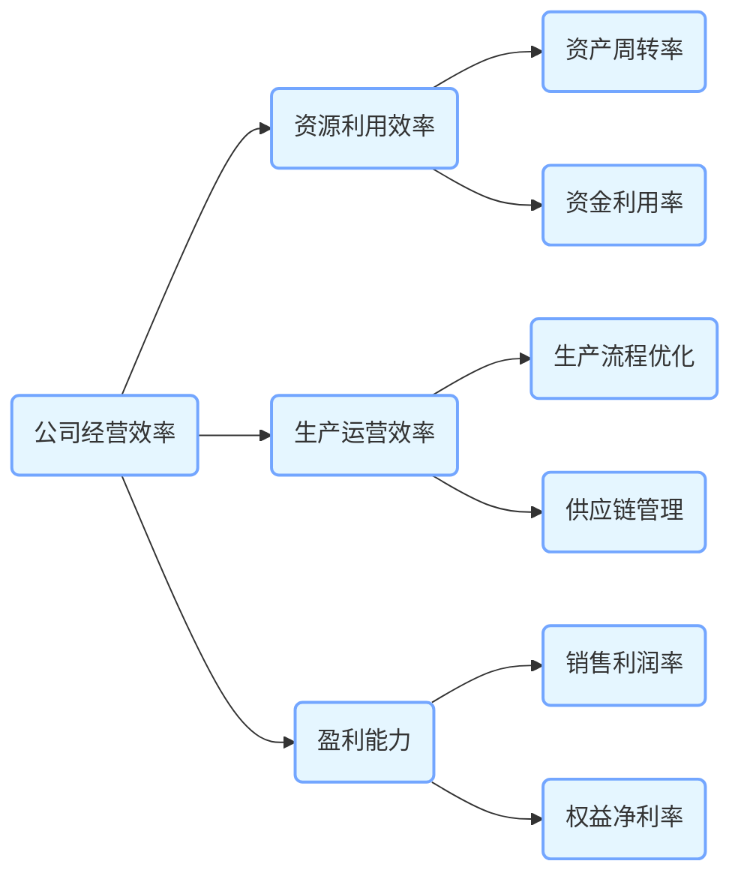

# 彼得林奇对公司经营效率的重视

> 关键词：彼得林奇、公司经营效率、投资分析、财务指标、企业竞争力

> 摘要：本文深入探讨了投资大师彼得林奇对公司经营效率的重视。详细介绍了彼得林奇的投资理念中经营效率的重要地位，分析了经营效率相关的核心概念与联系，阐述了评估经营效率的核心算法原理及具体操作步骤，给出了相关数学模型和公式并举例说明。通过项目实战展示了如何在实际中运用这些知识进行公司经营效率分析。同时探讨了其在实际应用场景中的作用，推荐了相关的学习工具、资源和论文著作。最后总结了未来公司经营效率评估的发展趋势与挑战，并提供了常见问题的解答及扩展阅读和参考资料，旨在帮助投资者更好地理解彼得林奇的投资智慧，提升对公司经营效率的分析能力。

## 1. 背景介绍 
### 1.1 目的和范围
本文的目的在于深入剖析投资界传奇人物彼得林奇对公司经营效率的重视这一重要投资理念。通过全面探讨公司经营效率在彼得林奇投资决策中的关键作用，详细阐述评估经营效率的方法和相关理论，为投资者和企业管理者提供有价值的参考。范围涵盖了彼得林奇投资思想中与经营效率相关的核心概念、评估方法、实际应用场景，以及相关的学习资源和未来发展趋势等方面。

### 1.2 预期读者
本文预期读者包括广大的投资者，无论是个人投资者还是专业投资机构的从业者，都可以从彼得林奇对公司经营效率的重视中汲取投资智慧，提升投资分析能力。同时，企业管理者也能从中获得启示，了解如何提高公司的经营效率，增强企业的竞争力。此外，对金融投资和企业管理领域感兴趣的学生和研究人员也可以将本文作为学习和研究的参考资料。

### 1.3 文档结构概述
本文将按照以下结构展开：首先介绍核心概念与联系，明确经营效率相关的基本概念和它们之间的关系，并通过文本示意图和 Mermaid 流程图进行直观展示。接着阐述核心算法原理和具体操作步骤，使用 Python 源代码详细说明如何评估公司经营效率。然后给出相关的数学模型和公式，并进行详细讲解和举例说明。通过项目实战部分，展示如何在实际中运用这些方法进行公司经营效率分析。之后探讨实际应用场景，介绍经营效率评估在投资决策、企业管理等方面的应用。推荐相关的工具和资源，包括学习资源、开发工具框架和论文著作。最后总结未来发展趋势与挑战，提供常见问题解答和扩展阅读及参考资料。

### 1.4 术语表
#### 1.4.1 核心术语定义
- **公司经营效率**：指公司利用各种资源进行生产经营活动，以实现利润最大化和价值创造的能力。它反映了公司在资源配置、生产流程、市场营销等方面的综合表现。
- **资产周转率**：衡量公司资产运营效率的指标，计算公式为营业收入除以平均资产总额。它表示公司资产在一定时期内的周转次数，周转次数越多，表明资产运营效率越高。
- **销售利润率**：反映公司销售收入中利润所占的比例，计算公式为净利润除以营业收入。它体现了公司在销售环节的盈利能力。
- **权益净利率**：也称为净资产收益率，是衡量股东权益收益水平的指标，计算公式为净利润除以平均净资产。它综合反映了公司运用自有资本的效率和盈利能力。

#### 1.4.2 相关概念解释
- **规模经济**：随着企业生产规模的扩大，单位产品的成本会逐渐降低，从而提高企业的经营效率和盈利能力。例如，大型企业可以通过批量采购原材料、采用先进的生产设备等方式实现规模经济。
- **成本控制**：企业通过优化生产流程、降低采购成本、减少浪费等手段，控制生产经营过程中的各项成本，以提高经营效率和利润水平。
- **创新能力**：企业在技术、产品、管理等方面进行创新的能力。创新可以提高企业的生产效率、产品质量和市场竞争力，从而提升经营效率。

#### 1.4.3 缩略词列表
- **ROE**：Return on Equity，权益净利率
- **ROA**：Return on Assets，资产收益率
- **EPS**：Earnings Per Share，每股收益

## 2. 核心概念与联系 
### 核心概念原理
在彼得林奇的投资理念中，公司经营效率是评估一家公司是否具有投资价值的重要因素之一。公司经营效率主要体现在资源利用效率、生产运营效率和盈利能力等方面。

资源利用效率反映了公司如何有效地利用其资产和资金。例如，资产周转率衡量了公司资产的运营效率，较高的资产周转率意味着公司能够快速地将资产转化为销售收入，说明公司的资产利用效率较高。

生产运营效率涉及到公司的生产流程、供应链管理等方面。高效的生产运营可以降低生产成本，提高产品质量和生产速度，从而增强公司的竞争力。

盈利能力是公司经营效率的最终体现。销售利润率和权益净利率等指标可以反映公司在销售和股东权益回报方面的能力。较高的销售利润率表明公司能够在销售环节获得更多的利润，而较高的权益净利率则说明公司能够有效地运用股东的资金创造价值。

### 架构的文本示意图
```plaintext
公司经营效率
|-- 资源利用效率
|   |-- 资产周转率
|   |-- 资金利用率
|-- 生产运营效率
|   |-- 生产流程优化
|   |-- 供应链管理
|-- 盈利能力
|   |-- 销售利润率
|   |-- 权益净利率
```

### Mermaid 流程图


## 3. 核心算法原理 & 具体操作步骤 
### 核心算法原理
在评估公司经营效率时，常用的指标包括资产周转率、销售利润率和权益净利率。下面分别介绍这些指标的算法原理。

#### 资产周转率
资产周转率反映了公司资产的运营效率，其计算公式为：
$$资产周转率 = \frac{营业收入}{平均资产总额}$$
其中，平均资产总额可以通过以下公式计算：
$$平均资产总额 = \frac{期初资产总额 + 期末资产总额}{2}$$

#### 销售利润率
销售利润率体现了公司在销售环节的盈利能力，其计算公式为：
$$销售利润率 = \frac{净利润}{营业收入}$$

#### 权益净利率
权益净利率衡量了股东权益的收益水平，其计算公式为：
$$权益净利率 = \frac{净利润}{平均净资产}$$
其中，平均净资产可以通过以下公式计算：
$$平均净资产 = \frac{期初净资产 + 期末净资产}{2}$$

### 具体操作步骤及 Python 代码实现
以下是使用 Python 代码计算上述指标的示例：
```python
import pandas as pd

# 假设我们有以下财务数据
data = {
    '营业收入': [1000000, 1200000],  # 第 1 年和第 2 年的营业收入
    '期初资产总额': [500000, 600000],
    '期末资产总额': [600000, 700000],
    '净利润': [100000, 120000],
    '期初净资产': [300000, 350000],
    '期末净资产': [350000, 400000]
}

df = pd.DataFrame(data)

# 计算平均资产总额
df['平均资产总额'] = (df['期初资产总额'] + df['期末资产总额']) / 2

# 计算资产周转率
df['资产周转率'] = df['营业收入'] / df['平均资产总额']

# 计算销售利润率
df['销售利润率'] = df['净利润'] / df['营业收入']

# 计算平均净资产
df['平均净资产'] = (df['期初净资产'] + df['期末净资产']) / 2

# 计算权益净利率
df['权益净利率'] = df['净利润'] / df['平均净资产']

print(df)
```
### 代码解释
1. 首先，我们使用 `pandas` 库创建一个包含财务数据的 DataFrame。
2. 然后，根据公式计算平均资产总额和平均净资产。
3. 接着，分别计算资产周转率、销售利润率和权益净利率，并将结果添加到 DataFrame 中。
4. 最后，打印出包含所有计算结果的 DataFrame。

## 4. 数学模型和公式 & 详细讲解 & 举例说明 
### 数学模型和公式
在评估公司经营效率时，除了前面提到的资产周转率、销售利润率和权益净利率外，还可以使用杜邦分析模型来进一步分析权益净利率的影响因素。杜邦分析模型的公式为：
$$权益净利率 = 销售利润率 \times 资产周转率 \times 权益乘数$$
其中，权益乘数的计算公式为：
$$权益乘数 = \frac{平均资产总额}{平均净资产}$$

### 详细讲解
杜邦分析模型将权益净利率分解为销售利润率、资产周转率和权益乘数三个因素，通过分析这三个因素的变化，可以深入了解公司盈利能力、资产运营效率和财务杠杆的使用情况。

- 销售利润率反映了公司的盈利能力，提高销售利润率可以通过提高产品价格、降低成本等方式实现。
- 资产周转率体现了公司的资产运营效率，提高资产周转率可以通过优化生产流程、加快存货周转等方式实现。
- 权益乘数衡量了公司的财务杠杆水平，较高的权益乘数意味着公司使用了较多的债务资金，可能会带来较高的风险，但也可能会提高股东的回报。

### 举例说明
假设一家公司的财务数据如下：
- 营业收入：1000 万元
- 净利润：100 万元
- 平均资产总额：500 万元
- 平均净资产：250 万元

首先，计算各项指标：
- 销售利润率：$销售利润率 = \frac{净利润}{营业收入} = \frac{100}{1000} = 0.1 = 10\%$
- 资产周转率：$资产周转率 = \frac{营业收入}{平均资产总额} = \frac{1000}{500} = 2$
- 权益乘数：$权益乘数 = \frac{平均资产总额}{平均净资产} = \frac{500}{250} = 2$

然后，根据杜邦分析模型计算权益净利率：
$权益净利率 = 销售利润率 \times 资产周转率 \times 权益乘数 = 0.1 \times 2 \times 2 = 0.4 = 40\%$

通过杜邦分析，我们可以看到该公司的权益净利率较高，主要是由于较高的资产周转率和权益乘数。如果要进一步提高权益净利率，可以考虑提高销售利润率，例如通过降低成本或提高产品价格。

## 5. 项目实战：代码实际案例和详细解释说明 
### 5.1  开发环境搭建
在进行公司经营效率分析的项目实战时，我们可以使用 Python 作为开发语言，并使用以下库：
- `pandas`：用于数据处理和分析。
- `numpy`：用于数值计算。
- `matplotlib`：用于数据可视化。

可以使用以下命令安装这些库：
```sh
pip install pandas numpy matplotlib
```

### 5.2  源代码详细实现和代码解读
以下是一个完整的项目实战代码示例，用于分析一家公司的经营效率并进行可视化展示：
```python
import pandas as pd
import numpy as np
import matplotlib.pyplot as plt

# 模拟财务数据
years = np.arange(2015, 2021)
data = {
    '营业收入': [800000, 900000, 1000000, 1100000, 1200000, 1300000],
    '期初资产总额': [400000, 450000, 500000, 550000, 600000, 650000],
    '期末资产总额': [450000, 500000, 550000, 600000, 650000, 700000],
    '净利润': [80000, 90000, 100000, 110000, 120000, 130000],
    '期初净资产': [200000, 220000, 240000, 260000, 280000, 300000],
    '期末净资产': [220000, 240000, 260000, 280000, 300000, 320000]
}

df = pd.DataFrame(data, index=years)

# 计算平均资产总额
df['平均资产总额'] = (df['期初资产总额'] + df['期末资产总额']) / 2

# 计算资产周转率
df['资产周转率'] = df['营业收入'] / df['平均资产总额']

# 计算销售利润率
df['销售利润率'] = df['净利润'] / df['营业收入']

# 计算平均净资产
df['平均净资产'] = (df['期初净资产'] + df['期末净资产']) / 2

# 计算权益净利率
df['权益净利率'] = df['净利润'] / df['平均净资产']

# 绘制资产周转率、销售利润率和权益净利率的变化趋势图
plt.figure(figsize=(12, 6))
plt.plot(df.index, df['资产周转率'], label='资产周转率')
plt.plot(df.index, df['销售利润率'], label='销售利润率')
plt.plot(df.index, df['权益净利率'], label='权益净利率')
plt.xlabel('年份')
plt.ylabel('比率')
plt.title('公司经营效率指标变化趋势')
plt.legend()
plt.grid(True)
plt.show()
```

### 代码解读与分析
1. **数据模拟**：使用 `numpy` 生成年份数据，使用字典创建包含财务数据的 DataFrame。
2. **指标计算**：根据前面介绍的公式，计算平均资产总额、资产周转率、销售利润率、平均净资产和权益净利率，并将结果添加到 DataFrame 中。
3. **数据可视化**：使用 `matplotlib` 库绘制资产周转率、销售利润率和权益净利率的变化趋势图，直观地展示公司经营效率的变化情况。

通过分析这个趋势图，我们可以了解公司在不同年份的经营效率变化情况，例如资产周转率是否提高、销售利润率是否稳定等，从而为投资决策提供参考。

## 6. 实际应用场景 
### 投资决策
在投资领域，彼得林奇对公司经营效率的重视为投资者提供了重要的决策依据。投资者可以通过分析公司的经营效率指标，如资产周转率、销售利润率和权益净利率等，评估公司的盈利能力和发展潜力。例如，如果一家公司的资产周转率持续提高，说明公司的资产运营效率在不断提升，可能具有较好的投资价值。同时，通过杜邦分析模型，投资者可以深入了解公司权益净利率的影响因素，判断公司的财务状况和经营策略是否合理。

### 企业管理
对于企业管理者来说，关注公司经营效率可以帮助他们发现企业运营中存在的问题，并采取相应的措施进行改进。例如，如果企业的销售利润率较低，管理者可以分析成本结构，寻找降低成本的方法；如果资产周转率较低，管理者可以优化生产流程，加快存货周转。通过不断提高公司的经营效率，企业可以增强自身的竞争力，实现可持续发展。

### 行业比较
在分析不同行业的公司时，经营效率指标可以作为一个重要的比较标准。不同行业的经营特点和竞争环境不同，其经营效率指标的水平也会有所差异。通过比较同行业内不同公司的经营效率指标，投资者和管理者可以找出行业内的领先企业和落后企业，了解行业的竞争格局和发展趋势。

## 7. 工具和资源推荐
### 7.1 学习资源推荐
#### 7.1.1 书籍推荐
- 《彼得林奇的成功投资》：彼得林奇的经典著作，详细介绍了他的投资理念和方法，包括如何评估公司的经营效率和投资价值。
- 《财务报表分析与证券定价》：系统介绍了财务报表分析的方法和技巧，对于理解公司经营效率相关的财务指标和分析方法有很大帮助。
- 《竞争优势：透视企业护城河》：探讨了企业竞争优势的来源和评估方法，与公司经营效率密切相关。

#### 7.1.2 在线课程
- Coursera 上的“Financial Markets”：由耶鲁大学教授罗伯特·席勒（Robert Shiller）授课，介绍了金融市场的基本原理和投资分析方法。
- edX 上的“Financial Accounting Fundamentals”：提供了财务会计的基础知识和财务报表分析的方法。

#### 7.1.3 技术博客和网站
- Seeking Alpha：提供了大量的金融分析文章和投资研究报告，包括对公司经营效率的分析。
- Bloomberg：全球知名的金融信息服务提供商，提供了丰富的金融数据和市场分析。

### 7.2 开发工具框架推荐
#### 7.2.1 IDE和编辑器
- PyCharm：功能强大的 Python 集成开发环境，适合进行数据分析和编程。
- Jupyter Notebook：交互式的编程环境，方便进行数据探索和可视化。

#### 7.2.2 调试和性能分析工具
- `pdb`：Python 内置的调试工具，可以帮助开发者找出代码中的错误。
- `cProfile`：用于分析 Python 代码的性能，找出性能瓶颈。

#### 7.2.3 相关框架和库
- `pandas`：用于数据处理和分析，提供了丰富的数据结构和函数。
- `numpy`：用于数值计算，提供了高效的数组操作和数学函数。
- `matplotlib`：用于数据可视化，支持多种图表类型。

### 7.3 相关论文著作推荐
#### 7.3.1 经典论文
- “The DuPont Analysis of Return on Equity”：详细介绍了杜邦分析模型的原理和应用。
- “Efficiency and Productivity Analysis”：探讨了企业效率和生产率分析的方法和理论。

#### 7.3.2 最新研究成果
- 可以关注《Journal of Financial Economics》、《The Review of Financial Studies》等金融领域的顶级学术期刊，获取关于公司经营效率和投资分析的最新研究成果。

#### 7.3.3 应用案例分析
- 一些知名投资机构的研究报告和案例分析可以为投资者提供实际应用的参考，例如巴菲特的伯克希尔·哈撒韦公司的年报和投资案例分析。

## 8. 总结：未来发展趋势与挑战
### 未来发展趋势
- **数据驱动的分析**：随着大数据和人工智能技术的发展，未来对公司经营效率的评估将更加依赖于数据驱动的分析方法。通过收集和分析大量的财务数据、市场数据和行业数据，可以更准确地评估公司的经营效率和发展潜力。
- **综合评估指标体系**：除了传统的财务指标外，未来的评估体系可能会更加注重非财务指标，如创新能力、客户满意度、社会责任等。这些指标可以更全面地反映公司的经营效率和可持续发展能力。
- **跨行业和跨国分析**：随着全球经济一体化的发展，投资者和企业管理者需要进行跨行业和跨国的经营效率分析。未来的分析方法将更加注重考虑不同行业和国家的特点和差异，提供更有针对性的评估和建议。

### 挑战
- **数据质量和可靠性**：数据质量和可靠性是数据驱动分析的基础。然而，在实际应用中，财务数据可能存在造假、不准确等问题，影响分析结果的可靠性。因此，如何保证数据的质量和可靠性是一个重要的挑战。
- **非财务指标的量化**：非财务指标如创新能力、客户满意度等难以进行量化评估。如何将这些非财务指标转化为可量化的指标，并纳入到经营效率评估体系中，是未来需要解决的问题。
- **市场环境的不确定性**：市场环境的不确定性增加了公司经营效率评估的难度。例如，宏观经济波动、政策变化、行业竞争加剧等因素都可能对公司的经营效率产生影响。如何在不确定的市场环境中准确评估公司的经营效率，是投资者和企业管理者面临的挑战。

## 9. 附录：常见问题与解答
### 问题 1：如何判断公司的经营效率是否良好？
解答：可以通过比较公司的经营效率指标与同行业其他公司的指标，以及公司自身历史数据的变化情况来判断。一般来说，如果公司的资产周转率、销售利润率和权益净利率等指标高于同行业平均水平，且呈现出上升趋势，说明公司的经营效率良好。

### 问题 2：权益乘数越高越好吗？
解答：权益乘数反映了公司的财务杠杆水平。较高的权益乘数意味着公司使用了较多的债务资金，可能会带来较高的风险。虽然在一定情况下，适当提高权益乘数可以提高股东的回报，但如果公司的盈利能力不足，过高的权益乘数可能会导致财务风险增加。因此，不能简单地认为权益乘数越高越好，需要综合考虑公司的盈利能力和财务状况。

### 问题 3：经营效率指标与公司股价有什么关系？
解答：一般来说，公司的经营效率越好，其盈利能力和发展潜力也越大，这通常会对公司股价产生积极影响。然而，股价还受到市场情绪、宏观经济环境等多种因素的影响，因此经营效率指标与公司股价之间并不是简单的线性关系。投资者在进行投资决策时，需要综合考虑多种因素。

## 10. 扩展阅读 & 参考资料
### 扩展阅读
- 《聪明的投资者》：本杰明·格雷厄姆（Benjamin Graham）的经典著作，介绍了价值投资的理念和方法。
- 《穷查理宝典》：收录了查理·芒格（Charlie Munger）的演讲和文章，阐述了他的投资哲学和思维方式。

### 参考资料
- Lynch, Peter. *One Up on Wall Street*. Simon & Schuster, 1989.
- Penman, Stephen H. *Financial Statement Analysis and Security Valuation*. McGraw-Hill Education, 2019.

作者：AI天才研究院/AI Genius Institute & 禅与计算机程序设计艺术 /Zen And The Art of Computer Programming