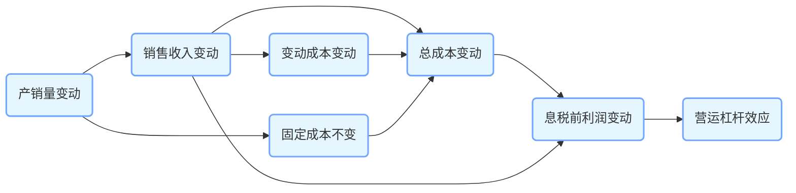

# 彼得林奇对公司营运杠杆效应的动态分析

> 关键词：彼得林奇、营运杠杆效应、动态分析、公司经营、财务分析

> 摘要：本文深入探讨了彼得林奇对公司营运杠杆效应的动态分析方法。首先介绍了研究此内容的背景，包括目的、预期读者、文档结构和相关术语。接着阐述了营运杠杆效应的核心概念、原理及架构，通过Mermaid流程图进行直观展示。详细讲解了核心算法原理，结合Python代码说明具体操作步骤，并给出数学模型和公式进行深入剖析。以实际项目为例，展示代码实现和解读。分析了营运杠杆效应的实际应用场景，推荐了学习资源、开发工具和相关论文著作。最后总结了未来发展趋势与挑战，解答常见问题并提供扩展阅读和参考资料，旨在帮助读者全面理解彼得林奇对公司营运杠杆效应的动态分析，提升对公司经营和财务状况的分析能力。

## 1. 背景介绍 
### 1.1 目的和范围
彼得林奇作为投资界的传奇人物，他的投资理念和分析方法一直备受关注。公司的营运杠杆效应是影响企业经营业绩和财务状况的重要因素。本研究的目的在于深入剖析彼得林奇对公司营运杠杆效应的动态分析方法，揭示其在投资决策中的应用价值。研究范围涵盖了营运杠杆效应的基本概念、动态分析原理、实际应用场景以及相关的数学模型和代码实现等方面。通过对这些内容的研究，帮助投资者更好地理解公司的经营状况，做出更明智的投资决策。

### 1.2 预期读者
本文的预期读者包括投资者、财务分析师、企业管理人员以及对投资和财务管理感兴趣的专业人士和学生。对于投资者来说，了解彼得林奇的分析方法可以帮助他们筛选出具有投资价值的公司；财务分析师可以借鉴这种分析方法，提升对公司财务状况的评估能力；企业管理人员可以从营运杠杆效应的角度审视公司的经营策略，优化资源配置；而学生则可以通过学习本文，加深对投资和财务管理理论的理解。

### 1.3 文档结构概述
本文共分为十个部分。第一部分为背景介绍，阐述了研究的目的、范围、预期读者和文档结构。第二部分介绍了营运杠杆效应的核心概念、原理及架构，并通过Mermaid流程图进行直观展示。第三部分讲解了核心算法原理，结合Python代码说明具体操作步骤。第四部分给出了数学模型和公式，并进行详细讲解和举例说明。第五部分通过实际项目案例，展示代码实现和解读。第六部分分析了营运杠杆效应的实际应用场景。第七部分推荐了学习资源、开发工具和相关论文著作。第八部分总结了未来发展趋势与挑战。第九部分解答了常见问题。第十部分提供了扩展阅读和参考资料。

### 1.4 术语表
#### 1.4.1 核心术语定义
- **营运杠杆效应**：指由于固定成本的存在，导致企业息税前利润（EBIT）变动率大于产销量变动率的现象。它反映了企业经营风险的大小。
- **固定成本**：不随产量或销售量的变化而变化的成本，如厂房租金、设备折旧等。
- **变动成本**：随产量或销售量的变化而呈正比例变化的成本，如原材料成本、直接人工成本等。
- **息税前利润（EBIT）**：企业在支付利息和所得税之前的利润，反映了企业经营活动的盈利能力。

#### 1.4.2 相关概念解释
- **经营风险**：企业在经营过程中面临的各种不确定性因素导致的风险，营运杠杆效应是影响经营风险的重要因素之一。当营运杠杆系数较高时，企业的经营风险也相对较高。
- **财务杠杆效应**：由于债务利息的存在，导致普通股每股收益（EPS）变动率大于息税前利润变动率的现象。它反映了企业财务风险的大小。
- **总杠杆效应**：营运杠杆效应和财务杠杆效应的综合作用，反映了企业总体风险的大小。

#### 1.4.3 缩略词列表
- **EBIT**：息税前利润（Earnings Before Interest and Taxes）
- **EPS**：普通股每股收益（Earnings Per Share）

## 2. 核心概念与联系 

### 营运杠杆效应的核心概念
营运杠杆效应的本质在于固定成本对企业利润的影响。当企业的产销量发生变化时，固定成本不会随之变动，而变动成本会随着产销量的增加或减少而相应地增加或减少。因此，产销量的变动会引起息税前利润更大幅度的变动。这种由于固定成本的存在而导致的息税前利润变动率大于产销量变动率的现象，就是营运杠杆效应。

### 营运杠杆效应的原理
假设企业的总成本 $C$ 由固定成本 $F$ 和变动成本 $V$ 组成，即 $C = F + V$。变动成本 $V$ 与产销量 $Q$ 成正比例关系，设单位变动成本为 $v$，则 $V = vQ$。企业的销售收入 $S$ 与产销量 $Q$ 也成正比例关系，设单位售价为 $p$，则 $S = pQ$。息税前利润 $EBIT$ 可以表示为：

$$EBIT = S - C = pQ - (F + vQ) = (p - v)Q - F$$

当产销量从 $Q_1$ 变动到 $Q_2$ 时，息税前利润从 $EBIT_1$ 变动到 $EBIT_2$。则产销量的变动率 $\Delta Q/Q_1$ 和息税前利润的变动率 $\Delta EBIT/EBIT_1$ 分别为：

$$\frac{\Delta Q}{Q_1}=\frac{Q_2 - Q_1}{Q_1}$$

$$\frac{\Delta EBIT}{EBIT_1}=\frac{EBIT_2 - EBIT_1}{EBIT_1}$$

营运杠杆系数（DOL）定义为息税前利润变动率与产销量变动率的比值，即：

$$DOL=\frac{\frac{\Delta EBIT}{EBIT_1}}{\frac{\Delta Q}{Q_1}}$$

将 $EBIT = (p - v)Q - F$ 代入上式，可以得到：

$$DOL=\frac{Q(p - v)}{Q(p - v)-F}$$

从上述公式可以看出，当固定成本 $F$ 不为零时，营运杠杆系数 $DOL$ 大于 1，即息税前利润变动率大于产销量变动率。固定成本 $F$ 越大，营运杠杆系数 $DOL$ 越大，营运杠杆效应越明显。

### 营运杠杆效应的架构

下面是一个简单的Mermaid流程图，展示了营运杠杆效应的主要架构：



这个流程图展示了产销量变动如何通过影响销售收入、变动成本和固定成本，进而影响息税前利润，最终产生营运杠杆效应。

## 3. 核心算法原理 & 具体操作步骤 

### 核心算法原理
根据前面的分析，营运杠杆系数（DOL）的计算公式为：

$$DOL=\frac{Q(p - v)}{Q(p - v)-F}$$

其中，$Q$ 为产销量，$p$ 为单位售价，$v$ 为单位变动成本，$F$ 为固定成本。

要计算营运杠杆系数，需要知道产销量、单位售价、单位变动成本和固定成本这四个参数的值。通过将这些参数代入上述公式，就可以得到营运杠杆系数的值。

### 具体操作步骤
下面是使用Python代码实现计算营运杠杆系数的具体操作步骤：

```python
def calculate_dol(Q, p, v, F):
    """
    计算营运杠杆系数（DOL）

    参数:
    Q (float): 产销量
    p (float): 单位售价
    v (float): 单位变动成本
    F (float): 固定成本

    返回:
    float: 营运杠杆系数
    """
    numerator = Q * (p - v)
    denominator = numerator - F
    if denominator == 0:
        raise ValueError("分母不能为零，固定成本和变动成本的计算可能导致不合理结果。")
    dol = numerator / denominator
    return dol

# 示例数据
Q = 1000  # 产销量
p = 10    # 单位售价
v = 5     # 单位变动成本
F = 2000  # 固定成本

try:
    dol = calculate_dol(Q, p, v, F)
    print(f"营运杠杆系数 (DOL): {dol}")
except ValueError as e:
    print(f"计算错误: {e}")
```

### 代码解释
- `calculate_dol` 函数接受四个参数：产销量 `Q`、单位售价 `p`、单位变动成本 `v` 和固定成本 `F`。
- 在函数内部，首先计算分子 `numerator = Q * (p - v)` 和分母 `denominator = numerator - F`。
- 然后检查分母是否为零，如果为零，则抛出 `ValueError` 异常，提示分母不能为零。
- 如果分母不为零，则计算营运杠杆系数 `dol = numerator / denominator` 并返回。
- 在示例中，我们设置了产销量、单位售价、单位变动成本和固定成本的值，调用 `calculate_dol` 函数计算营运杠杆系数，并打印结果。

## 4. 数学模型和公式 & 详细讲解 & 举例说明 

### 数学模型和公式
前面已经介绍了营运杠杆系数（DOL）的计算公式：

$$DOL=\frac{Q(p - v)}{Q(p - v)-F}$$

这个公式是基于企业的成本 - 产量 - 利润（CVP）分析模型推导出来的。CVP 分析模型描述了企业的成本、产量和利润之间的关系，是营运杠杆效应分析的基础。

### 详细讲解
- **分子 $Q(p - v)$**：表示边际贡献，即每增加一单位产销量所增加的利润。边际贡献反映了企业在扣除变动成本后，用于弥补固定成本和创造利润的能力。
- **分母 $Q(p - v)-F$**：表示息税前利润（EBIT）。当产销量增加时，边际贡献也会增加，但固定成本不变，因此息税前利润会以更大的幅度增加。
- **营运杠杆系数 $DOL$**：反映了息税前利润变动率与产销量变动率的倍数关系。当 $DOL > 1$ 时，说明息税前利润变动率大于产销量变动率，即存在营运杠杆效应；当 $DOL = 1$ 时，说明息税前利润变动率等于产销量变动率，不存在营运杠杆效应；当 $DOL < 1$ 时，这种情况在实际中一般不会出现，因为固定成本的存在通常会导致息税前利润变动率大于产销量变动率。

### 举例说明
假设一家企业的产销量 $Q = 1000$ 件，单位售价 $p = 10$ 元，单位变动成本 $v = 5$ 元，固定成本 $F = 2000$ 元。

首先计算边际贡献：

$$Q(p - v)=1000\times(10 - 5)=5000$$

然后计算息税前利润：

$$EBIT = Q(p - v)-F = 5000 - 2000 = 3000$$

最后计算营运杠杆系数：

$$DOL=\frac{Q(p - v)}{Q(p - v)-F}=\frac{5000}{3000}\approx1.67$$

这意味着产销量每变动 1%，息税前利润将变动约 1.67%。如果产销量增加 10%，则息税前利润将增加约 $10\% \times 1.67 = 16.7\%$。

## 5. 项目实战：代码实际案例和详细解释说明 

### 5.1  开发环境搭建
为了运行本项目的代码，需要搭建以下开发环境：
- **Python 环境**：建议使用 Python 3.7 及以上版本。可以从 Python 官方网站（https://www.python.org/downloads/）下载并安装。
- **代码编辑器**：推荐使用 Visual Studio Code 或 PyCharm。Visual Studio Code 是一款轻量级的开源代码编辑器，支持多种编程语言和插件扩展；PyCharm 是专门为 Python 开发设计的集成开发环境（IDE），提供了丰富的功能和工具。

### 5.2  源代码详细实现和代码解读
以下是一个更完整的 Python 代码示例，用于计算不同产销量下的营运杠杆系数，并绘制营运杠杆系数随产销量变化的曲线：

```python
import numpy as np
import matplotlib.pyplot as plt

def calculate_dol(Q, p, v, F):
    """
    计算营运杠杆系数（DOL）

    参数:
    Q (float): 产销量
    p (float): 单位售价
    v (float): 单位变动成本
    F (float): 固定成本

    返回:
    float: 营运杠杆系数
    """
    numerator = Q * (p - v)
    denominator = numerator - F
    if denominator == 0:
        raise ValueError("分母不能为零，固定成本和变动成本的计算可能导致不合理结果。")
    dol = numerator / denominator
    return dol

# 定义参数
p = 10    # 单位售价
v = 5     # 单位变动成本
F = 2000  # 固定成本

# 生成不同产销量的数组
Q_values = np.linspace(500, 2000, 100)

# 计算每个产销量对应的营运杠杆系数
dol_values = []
for Q in Q_values:
    try:
        dol = calculate_dol(Q, p, v, F)
        dol_values.append(dol)
    except ValueError as e:
        print(f"计算错误: {e}")

# 绘制营运杠杆系数随产销量变化的曲线
plt.plot(Q_values, dol_values)
plt.xlabel('产销量')
plt.ylabel('营运杠杆系数 (DOL)')
plt.title('营运杠杆系数随产销量变化的曲线')
plt.grid(True)
plt.show()
```

### 代码解读与分析
- **导入必要的库**：导入 `numpy` 库用于生成数组，导入 `matplotlib.pyplot` 库用于绘制图形。
- **定义 `calculate_dol` 函数**：该函数用于计算营运杠杆系数，与前面的代码示例相同。
- **定义参数**：设置单位售价 `p`、单位变动成本 `v` 和固定成本 `F` 的值。
- **生成不同产销量的数组**：使用 `np.linspace` 函数生成从 500 到 2000 的 100 个等间距的产销量值。
- **计算每个产销量对应的营运杠杆系数**：遍历产销量数组，调用 `calculate_dol` 函数计算每个产销量对应的营运杠杆系数，并将结果存储在 `dol_values` 列表中。
- **绘制营运杠杆系数随产销量变化的曲线**：使用 `plt.plot` 函数绘制曲线，设置 x 轴标签为“产销量”，y 轴标签为“营运杠杆系数 (DOL)”，标题为“营运杠杆系数随产销量变化的曲线”，并显示网格线。最后使用 `plt.show` 函数显示图形。

通过分析绘制的曲线，可以直观地观察到营运杠杆系数随产销量的变化趋势。一般来说，随着产销量的增加，营运杠杆系数会逐渐减小，这意味着企业的经营风险会逐渐降低。

## 6. 实际应用场景 
### 投资决策
投资者在选择投资标的时，可以通过分析企业的营运杠杆系数来评估企业的经营风险。营运杠杆系数较高的企业，其息税前利润对产销量的变化更为敏感，经营风险相对较高；而营运杠杆系数较低的企业，经营风险相对较低。投资者可以根据自己的风险偏好，选择合适的投资对象。例如，对于风险偏好较高的投资者，可以选择营运杠杆系数较高的企业，以获取更高的潜在收益；对于风险偏好较低的投资者，则可以选择营运杠杆系数较低的企业，以降低投资风险。

### 企业经营决策
企业管理人员在制定经营策略时，也可以利用营运杠杆效应的分析结果。例如，当企业面临市场需求增长的机会时，如果企业的营运杠杆系数较高，适当增加产销量可以带来更大幅度的息税前利润增长；但如果市场需求不稳定，过高的营运杠杆系数也会使企业面临较大的经营风险。因此，企业管理人员需要根据市场情况和企业的实际情况，合理调整固定成本和变动成本的比例，优化营运杠杆系数，以实现企业利润的最大化和经营风险的最小化。

### 财务分析
财务分析师在对企业进行财务分析时，营运杠杆系数是一个重要的指标。通过分析营运杠杆系数的变化趋势，可以了解企业经营状况的稳定性和盈利能力的变化情况。如果营运杠杆系数持续上升，可能意味着企业的固定成本占比增加，经营风险增大；如果营运杠杆系数持续下降，则可能表示企业的经营状况趋于稳定，经营风险降低。财务分析师可以结合其他财务指标，对企业的财务状况进行全面、深入的分析。

## 7. 工具和资源推荐
### 7.1 学习资源推荐
#### 7.1.1 书籍推荐
- 《彼得林奇的成功投资》：彼得林奇的经典著作，详细介绍了他的投资理念和方法，包括如何分析公司的基本面和评估企业的价值。
- 《财务报表分析与证券定价》：全面介绍了财务报表分析的方法和技巧，以及如何运用财务报表信息进行证券定价，对理解营运杠杆效应在财务分析中的应用有很大帮助。
- 《公司理财》：一本经典的公司理财教材，涵盖了公司财务管理的各个方面，包括成本 - 产量 - 利润分析、营运杠杆效应等内容。

#### 7.1.2 在线课程
- Coursera 上的“财务分析与决策”课程：由知名教授授课，系统介绍了财务分析的基本方法和工具，包括营运杠杆效应的分析和应用。
- edX 上的“投资学原理”课程：讲解了投资学的基本原理和方法，包括如何评估企业的风险和收益，以及如何进行投资组合管理。

#### 7.1.3 技术博客和网站
- Seeking Alpha：一个知名的投资研究网站，提供了大量的公司分析报告和投资观点，其中不乏对营运杠杆效应的分析和讨论。
- Investopedia：一个专业的金融知识学习网站，提供了丰富的金融术语解释和投资分析文章，对理解营运杠杆效应的概念和原理有很大帮助。

### 7.2 开发工具框架推荐
#### 7.2.1 IDE和编辑器
- Visual Studio Code：一款轻量级的开源代码编辑器，支持多种编程语言和插件扩展，适合 Python 开发。
- PyCharm：专门为 Python 开发设计的集成开发环境（IDE），提供了丰富的功能和工具，如代码调试、代码分析、自动补全等。

#### 7.2.2 调试和性能分析工具
- `pdb`：Python 内置的调试工具，可以帮助开发者定位和解决代码中的问题。
- `cProfile`：Python 标准库中的性能分析工具，可以分析代码的运行时间和函数调用情况，帮助开发者优化代码性能。

#### 7.2.3 相关框架和库
- `numpy`：一个强大的 Python 科学计算库，提供了高效的数组操作和数学函数，在处理大量数据时非常有用。
- `pandas`：一个用于数据处理和分析的 Python 库，提供了丰富的数据结构和数据操作方法，方便进行数据清洗、分析和可视化。
- `matplotlib`：一个用于绘制图形的 Python 库，支持多种图形类型，如折线图、柱状图、散点图等，可用于可视化营运杠杆系数的变化趋势。

### 7.3 相关论文著作推荐
#### 7.3.1 经典论文
- Modigliani, F., & Miller, M. H. (1958). The cost of capital, corporation finance and the theory of investment. The American Economic Review, 48(3), 261 - 297. 这篇经典论文提出了著名的 MM 定理，对企业的资本结构和价值评估产生了深远影响，也为营运杠杆效应的研究提供了理论基础。
- Brealey, R. A., Myers, S. C., & Allen, F. (2006). Principles of corporate finance. McGraw - Hill. 这本书是公司财务领域的经典教材，其中包含了对营运杠杆效应的详细讨论和分析。

#### 7.3.2 最新研究成果
可以通过学术数据库如 IEEE Xplore、ACM Digital Library、ScienceDirect 等搜索关于营运杠杆效应的最新研究论文。这些论文可能涉及到营运杠杆效应在不同行业、不同市场环境下的应用和变化规律，以及如何结合其他因素进行综合分析等方面的内容。

#### 7.3.3 应用案例分析
一些知名的商业杂志和财经媒体，如《哈佛商业评论》、《财经》等，经常会刊登一些企业经营和投资案例分析，其中可能会涉及到营运杠杆效应的应用。通过阅读这些案例分析，可以更好地理解营运杠杆效应在实际中的应用和作用。

## 8. 总结：未来发展趋势与挑战
### 未来发展趋势
- **多因素综合分析**：未来对营运杠杆效应的分析将不仅仅局限于传统的成本 - 产量 - 利润关系，还会结合宏观经济环境、行业竞争态势、技术创新等多方面因素进行综合分析。例如，随着科技的不断进步，企业的生产方式和成本结构可能会发生重大变化，固定成本和变动成本的界限可能会变得更加模糊，因此需要更加全面地考虑各种因素对营运杠杆效应的影响。
- **动态模拟和预测**：借助大数据、人工智能等技术，对营运杠杆效应进行动态模拟和预测将成为未来的发展趋势。通过建立复杂的数学模型和数据分析算法，可以实时监测企业的经营数据，预测产销量、成本和利润的变化趋势，从而更加准确地评估营运杠杆效应和企业的经营风险。
- **跨行业和跨国比较**：随着全球经济一体化的发展，企业面临的竞争环境越来越复杂。未来对营运杠杆效应的研究将更加注重跨行业和跨国比较，分析不同行业、不同国家和地区企业的营运杠杆特征和差异，为企业的国际化经营和投资决策提供更有价值的参考。

### 挑战
- **数据质量和获取难度**：准确分析营运杠杆效应需要大量准确的企业经营数据，包括产销量、成本、价格等。然而，在实际中，企业的数据质量可能存在问题，如数据不完整、不准确等。此外，获取一些关键数据可能存在一定的难度，特别是对于一些非上市公司和中小企业。
- **模型的复杂性和适用性**：为了更准确地分析营运杠杆效应，需要建立复杂的数学模型和数据分析算法。然而，这些模型和算法的复杂性可能会导致其难以理解和应用，同时也需要大量的专业知识和技能。此外，不同的企业和行业具有不同的特点，模型的适用性也需要进一步验证和调整。
- **市场环境的不确定性**：宏观经济环境、政策法规、行业竞争态势等市场环境因素的不确定性增加了营运杠杆效应分析的难度。这些因素的变化可能会导致企业的产销量、成本和价格发生波动，从而影响营运杠杆效应的稳定性和准确性。

## 9. 附录：常见问题与解答
### 问题 1：营运杠杆系数是否越大越好？
答：营运杠杆系数并非越大越好。营运杠杆系数越大，说明息税前利润对产销量的变化越敏感，企业的经营风险也相对较高。当市场需求增长时，较高的营运杠杆系数可以带来更大幅度的息税前利润增长；但当市场需求下降时，企业的息税前利润也会以更大的幅度下降。因此，企业需要根据自身的实际情况和市场环境，合理控制营运杠杆系数，以实现利润最大化和风险最小化的平衡。

### 问题 2：如何降低企业的营运杠杆系数？
答：降低企业的营运杠杆系数可以从以下几个方面入手：
- **降低固定成本**：企业可以通过优化生产流程、减少固定资产投资、降低租金等方式，降低固定成本的支出。
- **提高变动成本占比**：适当增加变动成本的比例，如采用外包生产、按产量支付薪酬等方式，可以降低固定成本在总成本中的占比，从而降低营运杠杆系数。
- **稳定产销量**：通过市场调研、营销策略等手段，稳定企业的产销量，减少产销量的波动，也可以降低营运杠杆系数带来的经营风险。

### 问题 3：营运杠杆效应与财务杠杆效应有什么关系？
答：营运杠杆效应和财务杠杆效应是企业经营和财务活动中的两个重要概念，它们之间存在密切的关系。营运杠杆效应反映了企业经营活动中固定成本对息税前利润的影响，而财务杠杆效应反映了企业财务活动中债务利息对普通股每股收益的影响。两者的综合作用形成了总杠杆效应，反映了企业总体风险的大小。当营运杠杆系数和财务杠杆系数都较高时，企业的总体风险也相对较高；反之，当两者都较低时，企业的总体风险也较低。企业可以通过合理搭配营运杠杆和财务杠杆，来控制总体风险水平。

## 10. 扩展阅读 & 参考资料
### 扩展阅读
- 《聪明的投资者》：本杰明·格雷厄姆的经典著作，强调了价值投资的理念和方法，对投资者的思维方式和投资决策有很大的启发。
- 《金融炼金术》：乔治·索罗斯的著作，介绍了他的投资哲学和操作方法，以及对金融市场的深刻理解。
- 《穷查理宝典》：收录了查理·芒格的演讲和文章，展现了他的多元思维模型和投资智慧，对投资者和企业管理者都有很大的借鉴意义。

### 参考资料
- 彼得林奇. 《彼得林奇的成功投资》. 机械工业出版社.
- 斯蒂芬·A·罗斯等. 《公司理财》. 机械工业出版社.
- 佩普等. 《财务报表分析与证券定价》. 中国财政经济出版社.

作者：AI天才研究院/AI Genius Institute & 禅与计算机程序设计艺术 /Zen And The Art of Computer Programming