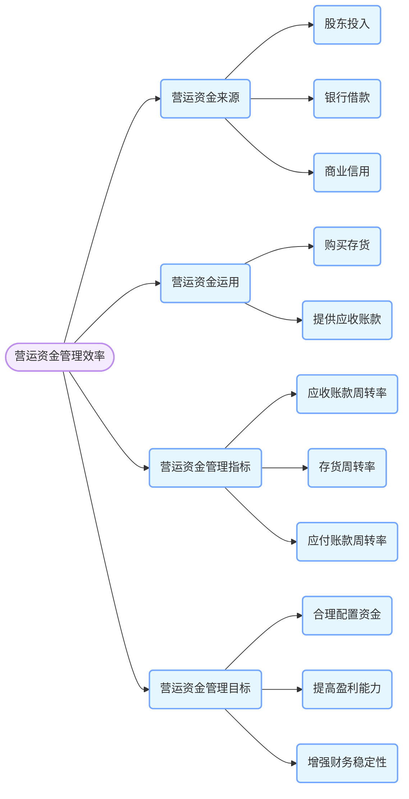

# 彼得林奇对公司营运资金管理效率的跨行业比较

> 关键词：彼得林奇、营运资金管理效率、跨行业比较、财务分析、公司评估

> 摘要：本文围绕彼得林奇的投资理念，深入探讨公司营运资金管理效率的跨行业比较。先介绍相关背景知识，包括目的、预期读者等，接着阐述营运资金管理效率的核心概念与联系，剖析其核心算法原理及操作步骤，用数学模型和公式详细说明。通过项目实战给出代码案例并解读，探讨实际应用场景。推荐学习、开发工具等资源，总结未来发展趋势与挑战，解答常见问题，最后提供扩展阅读和参考资料，旨在帮助读者全面理解如何运用彼得林奇的思路进行跨行业的营运资金管理效率比较。

## 1. 背景介绍 
### 1.1 目的和范围
目的在于借鉴彼得林奇的投资分析思路，对不同行业公司的营运资金管理效率进行比较研究。通过这种比较，投资者可以更清晰地了解各行业公司在营运资金运用方面的特点和差异，从而更好地评估公司的财务健康状况和投资价值。范围涵盖多个具有代表性的行业，包括但不限于制造业、零售业、服务业等，选取各行业中的典型公司进行分析。

### 1.2 预期读者
本文预期读者包括投资者、财务分析师、企业管理者以及对公司财务分析和投资策略感兴趣的人士。投资者可以借助本文的分析方法和结论，优化投资组合，提高投资收益；财务分析师可以将其作为深入研究公司财务状况的参考；企业管理者可以通过跨行业比较，发现自身在营运资金管理方面的优势与不足，改进管理策略；对相关领域感兴趣的人士则可以借此拓宽知识视野，加深对公司财务运作的理解。

### 1.3 文档结构概述
本文首先介绍背景知识，包括目的、读者群体和文档结构等。接着阐述核心概念与联系，明确营运资金管理效率的相关原理和架构。然后讲解核心算法原理和具体操作步骤，用 Python 代码详细说明。通过数学模型和公式进一步解释相关概念，并举例说明。进行项目实战，给出代码实际案例并详细解读。探讨实际应用场景，推荐学习、开发工具等资源。最后总结未来发展趋势与挑战，解答常见问题，提供扩展阅读和参考资料。

### 1.4 术语表
#### 1.4.1 核心术语定义
- **营运资金**：是指流动资产减去流动负债后的余额，它反映了企业在短期内可用于经营活动的资金量。
- **营运资金管理效率**：衡量企业营运资金运用效果的指标，反映企业在采购、生产、销售等经营环节中对营运资金的利用能力和周转速度。
- **跨行业比较**：对不同行业的公司在某一特定指标或多个指标上进行对比分析，以发现各行业之间的差异和特点。

#### 1.4.2 相关概念解释
- **流动资产**：企业在一年内或一个营业周期内能够变现或运用的资产，包括货币资金、应收账款、存货等。
- **流动负债**：企业在一年内或一个营业周期内需要偿还的债务，如短期借款、应付账款等。
- **周转率**：反映资产或资金在一定时期内周转的次数，是衡量营运资金管理效率的重要指标之一，常见的有应收账款周转率、存货周转率等。

#### 1.4.3 缩略词列表
- **WC**：营运资金（Working Capital）
- **AR**：应收账款（Accounts Receivable）
- **AP**：应付账款（Accounts Payable）
- **INV**：存货（Inventory）

## 2. 核心概念与联系 
### 核心概念原理
营运资金管理效率的核心在于合理配置流动资产和流动负债，以实现企业经营活动的顺畅进行和资金的高效利用。企业的营运资金管理涉及到采购、生产、销售等多个环节。在采购环节，企业需要合理安排资金采购原材料，既要保证生产的连续性，又要避免存货积压；在生产环节，要提高生产效率，缩短生产周期，减少在产品占用的资金；在销售环节，要及时收回应收账款，降低坏账风险，提高资金回笼速度。

一个企业的营运资金管理效率直接影响其盈利能力和财务稳定性。如果营运资金管理不善，可能导致存货积压、应收账款回收缓慢，从而占用大量资金，增加企业的资金成本和财务风险；相反，高效的营运资金管理可以使企业在相同的资金规模下实现更高的销售额和利润，提高企业的竞争力。

### 架构的文本示意图
营运资金管理效率的架构可以从以下几个方面来理解：
- **营运资金来源**：包括股东投入的资金、银行借款、商业信用等。这些资金来源的结构和成本会影响企业的营运资金管理策略。
- **营运资金运用**：主要用于流动资产的投资，如购买存货、提供应收账款等。不同行业的企业在营运资金运用上有不同的特点，例如制造业企业可能需要大量的资金用于购买原材料和生产设备，而服务业企业的存货占用资金相对较少。
- **营运资金管理指标**：包括应收账款周转率、存货周转率、应付账款周转率等。这些指标可以反映企业在各个经营环节的营运资金管理效率。
- **营运资金管理目标**：实现营运资金的合理配置和高效利用，提高企业的盈利能力和财务稳定性。

### Mermaid 流程图


## 3. 核心算法原理 & 具体操作步骤 
### 核心算法原理
在评估公司营运资金管理效率时，常用的指标包括应收账款周转率、存货周转率和应付账款周转率。这些指标的计算原理如下：

- **应收账款周转率（ART）**：反映企业应收账款周转速度的指标，计算公式为：
\[ART=\frac{销售收入}{平均应收账款余额}\]
其中，平均应收账款余额可以通过（期初应收账款余额 + 期末应收账款余额）/ 2 计算得到。应收账款周转率越高，说明企业收回应收账款的速度越快，资金回笼效率越高。

- **存货周转率（IT）**：衡量企业存货周转速度的指标，计算公式为：
\[IT=\frac{销售成本}{平均存货余额}\]
平均存货余额的计算方法与平均应收账款余额类似。存货周转率越高，表明企业存货管理越有效，存货积压的风险越小。

- **应付账款周转率（APT）**：反映企业应付账款周转速度的指标，计算公式为：
\[APT=\frac{购买成本}{平均应付账款余额}\]
应付账款周转率越高，说明企业支付应付账款的速度越快。

### 具体操作步骤及 Python 源代码
以下是使用 Python 实现计算这些指标的示例代码：

```python
# 定义一个公司类，包含相关财务数据
class Company:
    def __init__(self, sales_revenue, cost_of_sales, purchase_cost, 
                 beginning_ar, ending_ar, beginning_inv, ending_inv, 
                 beginning_ap, ending_ap):
        self.sales_revenue = sales_revenue
        self.cost_of_sales = cost_of_sales
        self.purchase_cost = purchase_cost
        self.beginning_ar = beginning_ar
        self.ending_ar = ending_ar
        self.beginning_inv = beginning_inv
        self.ending_inv = ending_inv
        self.beginning_ap = beginning_ap
        self.ending_ap = ending_ap

    # 计算平均应收账款余额
    def average_accounts_receivable(self):
        return (self.beginning_ar + self.ending_ar) / 2

    # 计算平均存货余额
    def average_inventory(self):
        return (self.beginning_inv + self.ending_inv) / 2

    # 计算平均应付账款余额
    def average_accounts_payable(self):
        return (self.beginning_ap + self.ending_ap) / 2

    # 计算应收账款周转率
    def accounts_receivable_turnover(self):
        average_ar = self.average_accounts_receivable()
        if average_ar == 0:
            return 0
        return self.sales_revenue / average_ar

    # 计算存货周转率
    def inventory_turnover(self):
        average_inv = self.average_inventory()
        if average_inv == 0:
            return 0
        return self.cost_of_sales / average_inv

    # 计算应付账款周转率
    def accounts_payable_turnover(self):
        average_ap = self.average_accounts_payable()
        if average_ap == 0:
            return 0
        return self.purchase_cost / average_ap

# 示例数据
company1 = Company(1000000, 600000, 500000, 50000, 60000, 80000, 90000, 40000, 50000)

# 计算各项指标
art = company1.accounts_receivable_turnover()
it = company1.inventory_turnover()
apt = company1.accounts_payable_turnover()

print(f"应收账款周转率: {art}")
print(f"存货周转率: {it}")
print(f"应付账款周转率: {apt}")
```

### 代码解释
1. **Company 类**：定义了一个公司类，包含销售收入、销售成本、购买成本、期初和期末的应收账款、存货、应付账款等属性。
2. **计算平均余额的方法**：通过 `average_accounts_receivable`、`average_inventory` 和 `average_accounts_payable` 方法分别计算平均应收账款余额、平均存货余额和平均应付账款余额。
3. **计算周转率的方法**：`accounts_receivable_turnover`、`inventory_turnover` 和 `accounts_payable_turnover` 方法分别计算应收账款周转率、存货周转率和应付账款周转率。在计算过程中，为了避免除以零的错误，会先检查分母是否为零。
4. **示例数据和计算结果输出**：创建一个 `Company` 类的实例，使用示例数据初始化，然后调用相应的方法计算各项周转率并输出结果。

## 4. 数学模型和公式 & 详细讲解 & 举例说明 
### 数学模型和公式
- **应收账款周转率（ART）**：
\[ART=\frac{销售收入}{平均应收账款余额}\]
平均应收账款余额 $=\frac{期初应收账款余额 + 期末应收账款余额}{2}$

- **存货周转率（IT）**：
\[IT=\frac{销售成本}{平均存货余额}\]
平均存货余额 $=\frac{期初存货余额 + 期末存货余额}{2}$

- **应付账款周转率（APT）**：
\[APT=\frac{购买成本}{平均应付账款余额}\]
平均应付账款余额 $=\frac{期初应付账款余额 + 期末应付账款余额}{2}$

### 详细讲解
- **应收账款周转率**：该指标反映了企业收回应收账款的效率。较高的应收账款周转率意味着企业能够快速收回应收账款，减少了资金被客户占用的时间，降低了坏账风险，提高了资金的使用效率。例如，一家企业的销售收入为 100 万元，平均应收账款余额为 20 万元，则应收账款周转率为 $100\div20 = 5$ 次。这表示该企业在一定时期内应收账款平均周转了 5 次。

- **存货周转率**：存货周转率衡量了企业存货的管理水平。较高的存货周转率说明企业能够快速地将存货销售出去，减少了存货积压的风险，降低了存货持有成本。例如，某企业的销售成本为 80 万元，平均存货余额为 10 万元，则存货周转率为 $80\div10 = 8$ 次，即该企业的存货在一定时期内平均周转了 8 次。

- **应付账款周转率**：应付账款周转率反映了企业支付应付账款的速度。较高的应付账款周转率表示企业能够及时支付供应商的货款，维护良好的商业信用。例如，企业的购买成本为 60 万元，平均应付账款余额为 15 万元，则应付账款周转率为 $60\div15 = 4$ 次。

### 举例说明
假设有两家不同行业的公司 A 和公司 B，其财务数据如下表所示：

| 公司 | 销售收入（万元） | 销售成本（万元） | 购买成本（万元） | 期初应收账款（万元） | 期末应收账款（万元） | 期初存货（万元） | 期末存货（万元） | 期初应付账款（万元） | 期末应付账款（万元） |
|---|---|---|---|---|---|---|---|---|---|
| A | 500 | 300 | 250 | 40 | 60 | 50 | 70 | 30 | 50 |
| B | 800 | 500 | 400 | 60 | 80 | 80 | 100 | 40 | 60 |

计算两家公司的各项周转率：

- **公司 A**：
    - 平均应收账款余额 $=\frac{40 + 60}{2}=50$ 万元
    - 应收账款周转率 $=\frac{500}{50}=10$ 次
    - 平均存货余额 $=\frac{50 + 70}{2}=60$ 万元
    - 存货周转率 $=\frac{300}{60}=5$ 次
    - 平均应付账款余额 $=\frac{30 + 50}{2}=40$ 万元
    - 应付账款周转率 $=\frac{250}{40}=6.25$ 次

- **公司 B**：
    - 平均应收账款余额 $=\frac{60 + 80}{2}=70$ 万元
    - 应收账款周转率 $=\frac{800}{70}\approx11.43$ 次
    - 平均存货余额 $=\frac{80 + 100}{2}=90$ 万元
    - 存货周转率 $=\frac{500}{90}\approx5.56$ 次
    - 平均应付账款余额 $=\frac{40 + 60}{2}=50$ 万元
    - 应付账款周转率 $=\frac{400}{50}=8$ 次

通过比较可以看出，公司 B 在应收账款周转率和存货周转率方面略高于公司 A，而在应付账款周转率方面也高于公司 A。这可能表明公司 B 在营运资金管理效率方面相对更优，但还需要结合行业特点进行综合分析。

## 5. 项目实战：代码实际案例和详细解释说明 
### 5.1  开发环境搭建
- **Python 安装**：首先需要安装 Python 环境，建议安装 Python 3.7 及以上版本。可以从 Python 官方网站（https://www.python.org/downloads/） 下载适合自己操作系统的安装包，按照安装向导进行安装。
- **开发工具选择**：可以选择 PyCharm、VS Code 等集成开发环境（IDE）。以 PyCharm 为例，从 JetBrains 官方网站（https://www.jetbrains.com/pycharm/download/） 下载并安装 PyCharm 社区版或专业版。
- **依赖库安装**：本项目主要使用 Python 的内置库，无需额外安装其他依赖库。

### 5.2  源代码详细实现和代码解读
以下是一个扩展的 Python 代码示例，用于对多个公司的营运资金管理效率进行比较：

```python
# 定义一个公司类，包含相关财务数据
class Company:
    def __init__(self, name, sales_revenue, cost_of_sales, purchase_cost, 
                 beginning_ar, ending_ar, beginning_inv, ending_inv, 
                 beginning_ap, ending_ap):
        self.name = name
        self.sales_revenue = sales_revenue
        self.cost_of_sales = cost_of_sales
        self.purchase_cost = purchase_cost
        self.beginning_ar = beginning_ar
        self.ending_ar = ending_ar
        self.beginning_inv = beginning_inv
        self.ending_inv = ending_inv
        self.beginning_ap = beginning_ap
        self.ending_ap = ending_ap

    # 计算平均应收账款余额
    def average_accounts_receivable(self):
        return (self.beginning_ar + self.ending_ar) / 2

    # 计算平均存货余额
    def average_inventory(self):
        return (self.beginning_inv + self.ending_inv) / 2

    # 计算平均应付账款余额
    def average_accounts_payable(self):
        return (self.beginning_ap + self.ending_ap) / 2

    # 计算应收账款周转率
    def accounts_receivable_turnover(self):
        average_ar = self.average_accounts_receivable()
        if average_ar == 0:
            return 0
        return self.sales_revenue / average_ar

    # 计算存货