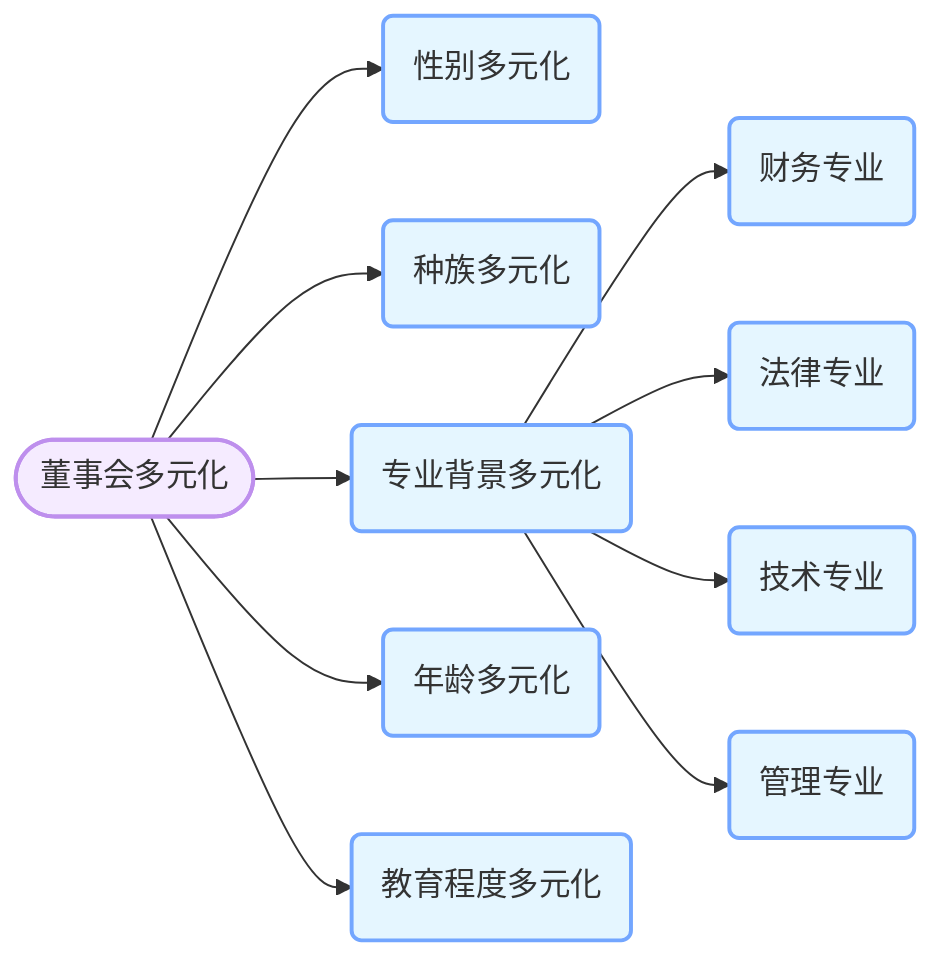

# 彼得林奇对公司董事会多元化的长期影响研究

> 关键词：彼得林奇、公司董事会多元化、长期影响、投资策略、企业绩效

> 摘要：本文聚焦于彼得林奇的投资理念和研究视角，深入探讨公司董事会多元化的长期影响。首先介绍研究的背景、目的、预期读者等内容，接着阐述公司董事会多元化的核心概念及相关联系，分析其背后的核心算法原理和具体操作步骤。运用数学模型和公式进一步说明董事会多元化与企业绩效等方面的关系，并结合实际案例进行详细解释。探讨董事会多元化在实际中的应用场景，推荐相关的学习资源、开发工具框架以及论文著作。最后总结未来发展趋势与挑战，解答常见问题并提供扩展阅读和参考资料，旨在全面揭示彼得林奇视角下公司董事会多元化长期影响的奥秘。

## 1. 背景介绍 
### 1.1 目的和范围
本研究的目的在于从彼得林奇的投资理念和研究方法出发，全面探究公司董事会多元化对企业的长期影响。彼得林奇作为投资界的传奇人物，其强调实地调研、关注企业基本面等投资策略深入人心。通过研究董事会多元化的长期影响，有助于投资者更好地理解企业的潜在价值，为投资决策提供更全面的参考。同时，对于企业管理者而言，也能明确董事会多元化在企业长期发展中的重要性，从而优化董事会结构。

研究范围涵盖不同行业、不同规模的公司，分析董事会成员在性别、种族、专业背景、年龄等方面的多元化特征对企业战略制定、决策质量、创新能力以及财务绩效等方面的长期影响。

### 1.2 预期读者
本文预期读者包括金融投资者、企业管理者、学术研究人员以及对公司治理和投资领域感兴趣的人士。对于投资者来说，可以借助本文的研究成果改进投资策略，寻找具有长期增长潜力的公司；企业管理者能够从中获取优化董事会结构的思路，提升企业的竞争力；学术研究人员则可以在此基础上开展更深入的理论和实证研究。

### 1.3 文档结构概述
本文将按照以下结构展开：首先介绍相关背景知识，包括研究目的、预期读者和文档结构等内容；接着阐述公司董事会多元化的核心概念以及各要素之间的联系，并通过示意图和流程图进行直观展示；然后详细讲解分析董事会多元化长期影响的核心算法原理和具体操作步骤，并用 Python 代码进行实现；运用数学模型和公式进一步说明其与企业绩效等方面的关系，并举例说明；通过实际项目案例展示董事会多元化的应用和影响；探讨董事会多元化在不同场景下的实际应用；推荐相关的学习资源、开发工具框架和论文著作；总结未来发展趋势与挑战；解答常见问题并提供扩展阅读和参考资料。

### 1.4 术语表
#### 1.4.1 核心术语定义
- **董事会多元化**：指董事会成员在性别、种族、专业背景、年龄、教育程度等多个维度上存在差异的特征。这种多元化可以为董事会带来不同的观点、经验和技能，从而影响董事会的决策过程和企业的发展方向。
- **企业绩效**：衡量企业在一定时期内经营成果的指标，包括财务绩效（如净利润、资产回报率等）和非财务绩效（如市场份额、客户满意度等）。
- **长期影响**：指董事会多元化对企业在较长时间跨度（通常为数年甚至更长）内产生的持续作用和效果。

#### 1.4.2 相关概念解释
- **投资策略**：投资者为实现投资目标而采取的一系列决策和行动，包括资产配置、选股方法等。彼得林奇的投资策略强调关注企业的基本面，通过实地调研和对企业的深入了解来选择具有潜力的股票。
- **公司治理**：通过一套包括正式或非正式的、内部或外部的制度或机制来协调公司与所有利益相关者之间的利益关系，以保证公司决策的科学性和公正性，从而维护公司各方面的利益。董事会多元化是公司治理的一个重要方面。

#### 1.4.3 缩略词列表
- ROA：Return on Assets，资产回报率，用于衡量企业运用全部资产获取利润的能力。
- ROE：Return on Equity，净资产收益率，反映股东权益的收益水平。

## 2. 核心概念与联系 
### 核心概念原理
董事会多元化的核心在于通过引入不同背景的成员，为董事会带来多样化的视角和经验。不同性别、种族、专业背景的董事在思考问题、分析情况和做出决策时会有不同的方式和观点。例如，女性董事可能更注重社会责任和可持续发展，具有不同专业背景的董事（如财务、法律、技术等）能够从各自的专业领域为企业提供专业的建议和支持。

这种多元化的组合有助于打破传统思维定式，提高董事会的决策质量。在制定企业战略时，多元化的董事会可以更全面地考虑各种因素，避免因单一视角导致的决策失误。同时，多元化的董事会也能够更好地适应市场的变化和挑战，增强企业的创新能力和竞争力。

### 架构的文本示意图
董事会多元化可以从多个维度进行考量，以下是一个简单的架构示意图：

- 董事会多元化
    - 性别多元化
    - 种族多元化
    - 专业背景多元化
        - 财务专业
        - 法律专业
        - 技术专业
        - 管理专业
    - 年龄多元化
    - 教育程度多元化

### Mermaid 流程图


## 3. 核心算法原理 & 具体操作步骤 
### 核心算法原理
为了研究董事会多元化的长期影响，我们可以采用回归分析的方法。回归分析是一种用于研究自变量与因变量之间关系的统计方法。在本研究中，我们将董事会多元化的各个维度（如性别多元化、专业背景多元化等）作为自变量，企业绩效（如 ROA、ROE 等）作为因变量，通过建立回归模型来分析它们之间的关系。

假设我们有 $n$ 个样本数据，每个样本包含董事会多元化的 $k$ 个自变量 $x_{i1}, x_{i2}, \cdots, x_{ik}$ 和一个因变量 $y_i$（$i = 1, 2, \cdots, n$）。我们可以建立如下的线性回归模型：

$$y_i = \beta_0 + \beta_1 x_{i1} + \beta_2 x_{i2} + \cdots + \beta_k x_{ik} + \epsilon_i$$

其中，$\beta_0$ 是截距项，$\beta_1, \beta_2, \cdots, \beta_k$ 是回归系数，$\epsilon_i$ 是误差项，服从均值为 0、方差为 $\sigma^2$ 的正态分布。

我们的目标是通过样本数据估计出回归系数 $\beta_0, \beta_1, \cdots, \beta_k$ 的值，使得模型的预测值与实际值之间的误差最小。常用的估计方法是最小二乘法，即通过最小化误差平方和：

$$S(\beta_0, \beta_1, \cdots, \beta_k) = \sum_{i = 1}^{n} (y_i - \beta_0 - \beta_1 x_{i1} - \beta_2 x_{i2} - \cdots - \beta_k x_{ik})^2$$

来求解回归系数。

### 具体操作步骤
1. **数据收集**：收集不同公司的董事会多元化数据和企业绩效数据。董事会多元化数据可以包括董事会成员的性别、种族、专业背景等信息，企业绩效数据可以包括 ROA、ROE 等财务指标。
2. **数据预处理**：对收集到的数据进行清洗和整理，处理缺失值和异常值。将定性数据（如性别、种族等）进行编码转换为定量数据。
3. **模型建立**：根据上述回归模型的原理，使用 Python 中的统计库（如 `statsmodels`）建立线性回归模型。
4. **模型估计**：使用最小二乘法对回归系数进行估计。
5. **模型评估**：通过计算决定系数 $R^2$、调整决定系数 $\bar{R}^2$、F 检验等指标来评估模型的拟合优度和显著性。
6. **结果分析**：根据估计得到的回归系数，分析董事会多元化的各个维度对企业绩效的影响方向和程度。

### Python 源代码实现
```python
import pandas as pd
import statsmodels.api as sm

# 假设我们已经收集并预处理好了数据，存储在一个 CSV 文件中
data = pd.read_csv('board_diversity_data.csv')

# 定义自变量和因变量
X = data[['gender_diversity', 'professional_diversity', 'age_diversity']]  # 假设这是董事会多元化的几个维度
y = data['ROA']  # 因变量为资产回报率

# 添加常数项
X = sm.add_constant(X)

# 建立线性回归模型
model = sm.OLS(y, X)

# 拟合模型
results = model.fit()

# 输出回归结果
print(results.summary())
```

## 4. 数学模型和公式 & 详细讲解 & 举例说明 
### 数学模型和公式
在前面的回归分析中，我们使用了线性回归模型：

$$y_i = \beta_0 + \beta_1 x_{i1} + \beta_2 x_{i2} + \cdots + \beta_k x_{ik} + \epsilon_i$$

其中，$y_i$ 是第 $i$ 个样本的因变量（如企业的 ROA），$x_{ij}$ 是第 $i$ 个样本的第 $j$ 个自变量（如董事会的性别多元化程度），$\beta_j$ 是回归系数，表示自变量 $x_j$ 对因变量 $y$ 的影响程度，$\epsilon_i$ 是误差项。

最小二乘法的目标是最小化误差平方和 $S(\beta_0, \beta_1, \cdots, \beta_k)$：

$$S(\beta_0, \beta_1, \cdots, \beta_k) = \sum_{i = 1}^{n} (y_i - \beta_0 - \beta_1 x_{i1} - \beta_2 x_{i2} - \cdots - \beta_k x_{ik})^2$$

通过对 $S(\beta_0, \beta_1, \cdots, \beta_k)$ 分别求关于 $\beta_0, \beta_1, \cdots, \beta_k$ 的偏导数，并令其等于 0，可以得到一组正规方程组：

$$\begin{cases}
\frac{\partial S}{\partial \beta_0} = -2\sum_{i = 1}^{n} (y_i - \beta_0 - \beta_1 x_{i1} - \beta_2 x_{i2} - \cdots - \beta_k x_{ik}) = 0 \\
\frac{\partial S}{\partial \beta_1} = -2\sum_{i = 1}^{n} x_{i1} (y_i - \beta_0 - \beta_1 x_{i1} - \beta_2 x_{i2} - \cdots - \beta_k x_{ik}) = 0 \\
\cdots \\
\frac{\partial S}{\partial \beta_k} = -2\sum_{i = 1}^{n} x_{ik} (y_i - \beta_0 - \beta_1 x_{i1} - \beta_2 x_{i2} - \cdots - \beta_k x_{ik}) = 0
\end{cases}$$

解这个正规方程组就可以得到回归系数的估计值 $\hat{\beta}_0, \hat{\beta}_1, \cdots, \hat{\beta}_k$。

### 详细讲解
- **回归系数的意义**：回归系数 $\beta_j$ 表示在其他自变量不变的情况下，自变量 $x_j$ 每增加一个单位，因变量 $y$ 的平均变化量。如果 $\beta_j > 0$，说明 $x_j$ 与 $y$ 正相关；如果 $\beta_j < 0$，说明 $x_j$ 与 $y$ 负相关。
- **决定系数 $R^2$**：$R^2$ 是衡量回归模型拟合优度的指标，它表示因变量的总变异中可以由自变量解释的比例。$R^2$ 的取值范围是 $[0, 1]$，$R^2$ 越接近 1，说明模型的拟合效果越好。

### 举例说明
假设我们通过回归分析得到如下结果：

$$\text{ROA} = 0.05 + 0.02 \times \text{gender_diversity} + 0.03 \times \text{professional_diversity} - 0.01 \times \text{age_diversity}$$

这意味着：
- 截距项 0.05 表示当所有自变量都为 0 时，企业的预期 ROA 为 5%。
- 性别多元化程度每增加 1 个单位，企业的 ROA 平均增加 2%。
- 专业背景多元化程度每增加 1 个单位，企业的 ROA 平均增加 3%。
- 年龄多元化程度每增加 1 个单位，企业的 ROA 平均减少 1%。

同时，如果 $R^2 = 0.6$，说明董事会多元化的这三个维度可以解释企业 ROA 总变异的 60%。

## 5. 项目实战：代码实际案例和详细解释说明 
### 5.1  开发环境搭建
- **Python 安装**：首先需要安装 Python 环境，建议使用 Python 3.7 及以上版本。可以从 Python 官方网站（https://www.python.org/downloads/）下载并安装。
- **库安装**：需要安装一些必要的 Python 库，如 `pandas`、`statsmodels` 等。可以使用 `pip` 命令进行安装：
```sh
pip install pandas statsmodels
```
- **IDE 选择**：可以选择使用 PyCharm、Jupyter Notebook 等集成开发环境。PyCharm 是一个功能强大的 Python IDE，适合开发大型项目；Jupyter Notebook 则更适合进行数据分析和实验，具有交互性强的特点。

### 5.2  源代码详细实现和代码解读
```python
import pandas as pd
import statsmodels.api as sm

# 数据读取
data = pd.read_csv('board_diversity_data.csv')

# 代码解读：使用 pandas 的 read_csv 函数读取存储在 CSV 文件中的数据。
# 假设 CSV 文件中包含董事会多元化数据和企业绩效数据，如性别多元化程度、专业背景多元化程度、年龄多元化程度和 ROA 等。

# 定义自变量和因变量
X = data[['gender_diversity', 'professional_diversity', 'age_diversity']]
y = data['ROA']

# 代码解读：从数据中提取自变量和因变量。自变量是董事会多元化的几个维度，因变量是企业的资产回报率 ROA。

# 添加常数项
X = sm.add_constant(X)

# 代码解读：在自变量矩阵中添加常数项，用于拟合回归模型的截距项。

# 建立线性回归模型
model = sm.OLS(y, X)

# 代码解读：使用 statsmodels 库的 OLS 函数建立普通最小二乘线性回归模型。

# 拟合模型
results = model.fit()

# 代码解读：使用 fit 方法对模型进行拟合，得到回归结果。

# 输出回归结果
print(results.summary())

# 代码解读：使用 summary 方法输出回归结果的详细信息，包括回归系数、标准误差、t 检验值、p 值、决定系数等。
```

### 5.3  代码解读与分析
- **数据读取**：使用 `pandas` 库的 `read_csv` 函数读取存储在 CSV 文件中的数据。确保 CSV 文件的路径正确，并且文件中的列名与代码中使用的列名一致。
- **自变量和因变量的选择**：根据研究目的选择合适的自变量和因变量。在本案例中，自变量是董事会多元化的几个维度，因变量是企业的 ROA。可以根据实际情况添加或删除自变量。
- **常数项的添加**：在建立线性回归模型时，需要添加常数项来拟合截距项。`sm.add_constant` 函数会在自变量矩阵的第一列添加一列全为 1 的向量。
- **模型建立和拟合**：使用 `statsmodels` 库的 `OLS` 函数建立普通最小二乘线性回归模型，并使用 `fit` 方法对模型进行拟合。
- **结果输出和分析**：使用 `summary` 方法输出回归结果的详细信息。重点关注回归系数的显著性（p 值）和决定系数 $R^2$。如果某个自变量的 p 值小于 0.05，则说明该自变量对因变量有显著影响；$R^2$ 越接近 1，说明模型的拟合效果越好。

## 6. 实际应用场景 
### 投资者决策
对于投资者来说，了解公司董事会多元化的长期影响可以帮助他们做出更明智的投资决策。如果研究表明董事会多元化与企业绩效呈正相关，那么投资者可以更倾向于投资那些董事会多元化程度较高的公司。例如，通过分析不同公司的董事会构成，发现某公司的董事会在性别、专业背景等方面具有较高的多元化程度，且历史数据显示该公司的绩效也较为优秀，那么投资者可以考虑将该公司纳入投资组合。

### 企业战略制定
企业管理者可以根据董事会多元化的研究结果来优化董事会结构，制定更有效的企业战略。例如，如果发现专业背景多元化的董事会能够为企业带来更多的创新思路和战略眼光，那么企业可以在选拔董事时注重引入不同专业领域的人才，如技术专家、市场营销专家等。同时，多元化的董事会也可以更好地应对市场的变化和挑战，制定出更具适应性的战略。

### 公司治理评估
监管机构和评估机构可以将董事会多元化作为评估公司治理水平的一个重要指标。一个多元化的董事会通常意味着更广泛的视角和更科学的决策过程，有助于提高公司的治理效率和透明度。通过对公司董事会多元化程度的评估，可以促使企业重视董事会结构的优化，提升整体治理水平。

### 社会责任履行
在当今社会，企业越来越注重社会责任的履行。董事会多元化可以体现企业对多元化和包容性的重视，有助于提升企业的社会形象。例如，增加女性董事和少数族裔董事的比例，可以向社会传递企业公平、包容的价值观，增强企业的社会认可度。

## 7. 工具和资源推荐
### 7.1 学习资源推荐
#### 7.1.1 书籍推荐
- 《彼得林奇的成功投资》：彼得林奇的经典著作，详细介绍了他的投资理念和方法，对于理解如何从基本面分析企业具有重要的指导意义。
- 《公司治理》：全面介绍了公司治理的理论和实践，包括董事会的结构、职能和运作机制等内容，有助于深入了解董事会多元化在公司治理中的作用。
- 《计量经济学导论》：系统介绍了计量经济学的基本原理和方法，对于学习如何运用回归分析等统计方法研究董事会多元化的影响非常有帮助。

#### 7.1.2 在线课程
- Coursera 上的“Investment Management Specialization”：提供了投资管理的全面课程，包括投资策略、资产定价等内容，有助于投资者和研究人员提升专业知识。
- edX 上的“Corporate Governance and Accountability”：专注于公司治理的课程，涵盖了董事会结构、股东权益等方面的知识。
- 中国大学 MOOC 上的“计量经济学”：由国内知名高校的教授授课，详细讲解了计量经济学的理论和应用，适合初学者学习。

#### 7.1.3 技术博客和网站
- Seeking Alpha：一个专业的金融投资博客平台，提供了大量关于公司分析、投资策略的文章和观点，有助于了解市场动态和企业基本面。
- Harvard Business Review：哈佛商业评论的官方网站，发表了许多关于公司治理、战略管理等方面的前沿研究和实践案例，对于企业管理者和研究人员具有很高的参考价值。
- SSRN：社会科学研究网络，汇集了大量的学术研究论文，包括公司治理、金融投资等领域的最新研究成果。

### 7.2 开发工具框架推荐
#### 7.2.1 IDE和编辑器
- PyCharm：功能强大的 Python IDE，提供了代码编辑、调试、版本控制等一系列功能，适合开发大型 Python 项目。
- Jupyter Notebook：交互式的开发环境，支持代码、文本、图表等多种元素的混合展示，非常适合进行数据分析和实验。
- Visual Studio Code：轻量级的代码编辑器，支持多种编程语言，具有丰富的插件生态系统，可以方便地进行 Python 开发。

#### 7.2.2 调试和性能分析工具
- PDB：Python 自带的调试工具，可以帮助开发者定位代码中的问题和错误。
- cProfile：Python 的性能分析工具，可以分析代码的运行时间和函数调用情况，帮助开发者优化代码性能。
- Py-Spy：一个用于分析 Python 程序性能的工具，能够实时监控 Python 进程的 CPU 使用率和函数调用情况。

#### 7.2.3 相关框架和库
- Pandas：用于数据处理和分析的 Python 库，提供了高效的数据结构和数据操作方法，非常适合处理董事会多元化和企业绩效数据。
- Statsmodels：用于统计建模和分析的 Python 库，支持线性回归、逻辑回归等多种统计模型，方便进行回归分析。
- Scikit-learn：一个强大的机器学习库，提供了丰富的机器学习算法和工具，可用于进一步的数据分析和预测。

### 7.3 相关论文著作推荐
#### 7.3.1 经典论文
- “The Effects of Board Diversity on Firm Performance: A Meta-Analytic Review”：该论文对董事会多元化与企业绩效之间的关系进行了元分析，综合了多项研究结果，具有较高的权威性。
- “Women in the Boardroom and Their Impact on Governance and Performance”：研究了女性董事对公司治理和绩效的影响，为董事会性别多元化的研究提供了重要的理论支持。
- “Diversity in the Boardroom and Firm Financial Performance”：通过实证研究分析了董事会多元化与企业财务绩效之间的关系，提出了一些有价值的观点和结论。

#### 7.3.2 最新研究成果
可以通过学术数据库（如 Web of Science、EBSCOhost 等）搜索关于董事会多元化的最新研究论文。近年来，随着对公司治理和社会责任的关注度不断提高，相关研究也在不断涌现，涉及董事会多元化的影响机制、影响因素等多个方面。

#### 7.3.3 应用案例分析
- 可以关注一些知名企业的案例研究，如谷歌、苹果等公司在董事会多元化方面的实践和经验。这些案例可以为企业管理者提供实际操作的参考，了解如何通过优化董事会结构提升企业的竞争力。
- 一些专业的商业杂志（如《财富》、《福布斯》等）也会报道一些公司在董事会多元化方面的成功案例和挑战，有助于深入了解实际应用中的情况。

## 8. 总结：未来发展趋势与挑战
### 未来发展趋势
- **多元化维度的拓展**：未来，董事会多元化的维度可能会进一步拓展，除了性别、种族、专业背景和年龄等传统维度外，还可能会考虑董事的文化背景、国际经验、数字技术能力等因素。随着全球化和数字化的发展，这些新的多元化维度将为董事会带来更广阔的视野和更丰富的资源。
- **与企业战略的深度融合**：董事会多元化将不再仅仅是一种形式，而是会与企业的战略规划和业务发展深度融合。企业会更加注重根据自身的战略目标来选拔具有相应背景和能力的董事，以确保董事会能够为企业的战略决策提供有力支持。
- **数据驱动的决策**：随着大数据和人工智能技术的发展，企业在评估董事会多元化的效果和优化董事会结构时将更多地依赖数据驱动的决策。通过收集和分析大量的董事会数据和企业绩效数据，可以更准确地了解董事会多元化与企业绩效之间的关系，从而制定更科学的决策。
- **社会责任的强化**：在社会对企业社会责任关注度不断提高的背景下，董事会多元化将被视为企业履行社会责任的重要体现。企业会更加积极地推动董事会多元化，以提升企业的社会形象和声誉。

### 挑战
- **多元化与决策效率的平衡**：虽然董事会多元化可以带来不同的观点和创新思路，但也可能会导致决策过程的复杂性增加，影响决策效率。如何在保证多元化的同时，确保董事会能够高效地做出决策，是企业面临的一个重要挑战。
- **多元化人才的选拔和培养**：寻找具有不同背景和能力的多元化人才并将其纳入董事会并非易事。企业需要建立有效的人才选拔机制，拓宽人才来源渠道，同时加强对多元化人才的培养和发展，以满足董事会多元化的需求。
- **文化冲突和沟通障碍**：多元化的董事会成员来自不同的背景和文化，可能会存在文化冲突和沟通障碍。如何促进董事会成员之间的有效沟通和协作，营造一个和谐的工作氛围，是企业需要解决的问题。
- **数据质量和隐私保护**：在数据驱动的决策过程中，数据质量和隐私保护是至关重要的。企业需要确保收集到的数据准确、可靠，同时遵守相关的法律法规，保护数据的隐私和安全。

## 9. 附录：常见问题与解答
### 1. 董事会多元化的衡量标准有哪些？
董事会多元化可以从多个维度进行衡量，常见的标准包括：
- **性别多元化**：可以用女性董事的比例来衡量。
- **种族多元化**：统计不同种族董事的比例。
- **专业背景多元化**：计算具有不同专业背景（如财务、法律、技术等）董事的比例。
- **年龄多元化**：分析董事会成员年龄的分布情况。

### 2. 董事会多元化一定会提高企业绩效吗？
董事会多元化并不一定会直接提高企业绩效。虽然多元化的董事会可以带来不同的观点和经验，有助于提高决策质量和创新能力，但企业绩效还受到多种因素的影响，如市场环境、行业竞争、企业战略等。董事会多元化与企业绩效之间的关系是复杂的，需要综合考虑各种因素。

### 3. 如何在实践中实现董事会多元化？
在实践中实现董事会多元化可以从以下几个方面入手：
- **制定多元化战略**：企业应明确董事会多元化的目标和计划，将其纳入企业的整体战略中。
- **拓宽人才选拔渠道**：除了传统的选拔方式外，还可以通过专业机构、行业协会等渠道寻找具有不同背景的人才。
- **加强培训和发展**：为多元化的董事会成员提供培训和发展机会，帮助他们更好地融入董事会，发挥各自的优势。
- **建立评估机制**：定期评估董事会多元化的进展和效果，根据评估结果进行调整和改进。

### 4. 数据驱动的董事会多元化决策需要注意什么？
在进行数据驱动的董事会多元化决策时，需要注意以下几点：
- **数据质量**：确保收集到的数据准确、完整、可靠，避免因数据误差导致决策失误。
- **数据分析方法**：选择合适的数据分析方法，如回归分析、聚类分析等，以准确揭示董事会多元化与企业绩效之间的关系。
- **数据隐私保护**：遵守相关的法律法规，保护数据的隐私和安全，避免数据泄露。
- **结合实际情况**：数据只是决策的参考，还需要结合企业的实际情况和战略目标进行综合考虑。

## 10. 扩展阅读 & 参考资料
### 扩展阅读
- 《金融炼金术》：乔治·索罗斯的著作，探讨了金融市场的运行规律和投资哲学，对于理解投资决策和市场变化具有重要的启示。
- 《创新者的窘境》：克莱顿·克里斯坦森的经典之作，分析了企业在面对技术创新和市场变革时所面临的挑战和机遇，有助于企业管理者制定更具前瞻性的战略。
- 《影响力》：罗伯特·西奥迪尼的著作，介绍了影响人类决策和行为的各种因素，对于理解董事会成员之间的沟通和协作具有一定的帮助。

### 参考资料
- 彼得林奇的相关著作和演讲。
- 学术期刊上发表的关于董事会多元化和公司治理的研究论文，如《Journal of Financial Economics》、《Administrative Science Quarterly》等。
- 各大金融机构和咨询公司发布的关于企业绩效和董事会结构的研究报告。

作者：AI天才研究院/AI Genius Institute & 禅与计算机程序设计艺术 /Zen And The Art of Computer Programming