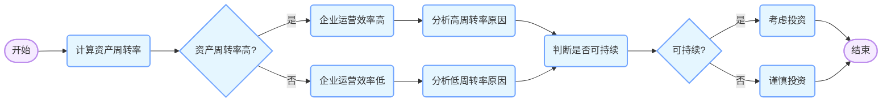

# 彼得林奇对公司资产周转率趋势的分析

> 关键词：彼得林奇、公司资产周转率、趋势分析、财务指标、投资决策

> 摘要：本文深入探讨了彼得林奇对公司资产周转率趋势的分析方法与重要意义。从背景介绍出发，阐述了资产周转率在投资领域的核心地位，详细解析了资产周转率的核心概念、相关算法原理以及涉及的数学模型。通过项目实战案例，展示了如何运用资产周转率进行实际的公司财务分析。同时，列举了资产周转率的实际应用场景，并推荐了相关的学习工具、资源和论文著作。最后，总结了未来资产周转率分析的发展趋势与挑战，解答了常见问题，为投资者和财务分析人员提供了全面且深入的参考。

## 1. 背景介绍 
### 1.1 目的和范围
在投资领域，准确评估一家公司的运营效率和盈利能力至关重要。彼得林奇作为投资界的传奇人物，他的投资理念和方法影响深远。其中，对公司资产周转率趋势的分析是他评估公司基本面的重要手段之一。本文旨在深入剖析彼得林奇如何运用资产周转率趋势来评估公司，并探讨这一分析方法在实际投资决策中的应用。文章将涵盖资产周转率的基本概念、计算方法、实际案例分析以及未来发展趋势等方面。

### 1.2 预期读者
本文预期读者包括投资者、财务分析人员、金融专业学生以及对投资和财务分析感兴趣的人士。无论是专业投资者寻找新的投资分析工具，还是初学者希望了解公司财务分析的基本方法，本文都将提供有价值的信息。

### 1.3 文档结构概述
本文首先介绍资产周转率相关的背景知识，包括术语定义和相关概念解释。接着阐述资产周转率的核心概念、算法原理以及涉及的数学模型。然后通过实际项目案例展示如何运用资产周转率进行公司财务分析。之后列举资产周转率在不同场景下的实际应用。再推荐一些学习资产周转率分析的工具和资源，以及相关的论文著作。最后总结未来发展趋势与挑战，解答常见问题，并提供扩展阅读和参考资料。

### 1.4 术语表
#### 1.4.1 核心术语定义
- **资产周转率**：是衡量企业资产管理效率的重要财务比率，它反映了企业资产在一定时期内的运营效率。计算公式为：资产周转率 = 营业收入 / 平均资产总额。
- **平均资产总额**：是指企业在一定时期内资产总额的平均值，通常采用期初资产总额与期末资产总额的平均值来计算，即平均资产总额 = （期初资产总额 + 期末资产总额）/ 2。
- **营业收入**：是指企业在从事销售商品、提供劳务和让渡资产使用权等日常经营业务过程中所形成的经济利益的总流入。

#### 1.4.2 相关概念解释
- **运营效率**：指企业利用各项资产创造收入的能力。资产周转率越高，说明企业运营效率越高，资产利用越充分。
- **投资决策**：是指投资者为了实现其预期的投资目标，运用一定的科学理论、方法和手段，通过一定的程序对投资的必要性、投资目标、投资规模、投资方向、投资结构、投资成本与收益等经济活动中重大问题所进行的分析、判断和方案选择。

#### 1.4.3 缩略词列表
在本文中，未涉及相关缩略词。

## 2. 核心概念与联系 

### 核心概念原理
资产周转率反映了企业资产运营的效率，它衡量了企业每单位资产所创造的营业收入。较高的资产周转率意味着企业能够更有效地利用其资产来产生收入，而较低的资产周转率则可能表示企业资产利用不充分，存在闲置或低效使用的情况。

从原理上讲，资产周转率受到多个因素的影响。一方面，营业收入的增长会直接提高资产周转率，因为在资产总额不变的情况下，更多的收入意味着单位资产创造的价值增加。另一方面，资产总额的变化也会对资产周转率产生影响。如果企业增加了资产投资，但营业收入没有相应增长，那么资产周转率就会下降。

### 架构的文本示意图
```plaintext
资产周转率
|
|-- 影响因素
|   |-- 营业收入
|   |   |-- 产品销售数量
|   |   |-- 产品销售价格
|   |-- 平均资产总额
|       |-- 流动资产
|       |   |-- 货币资金
|       |   |-- 应收账款
|       |   |-- 存货
|       |-- 非流动资产
|           |-- 固定资产
|           |-- 无形资产
|
|-- 分析意义
|   |-- 评估企业运营效率
|   |-- 比较不同企业竞争力
|   |-- 预测企业未来发展趋势
```

### Mermaid 流程图


## 3. 核心算法原理 & 具体操作步骤 

### 核心算法原理
资产周转率的计算基于简单的数学公式：资产周转率 = 营业收入 / 平均资产总额。这个公式的原理在于通过比较企业在一定时期内的营业收入和平均资产总额，来衡量企业资产的运营效率。

### 具体操作步骤
以下是使用 Python 代码计算资产周转率的详细步骤和示例代码：

```python
# 步骤 1: 定义营业收入和期初、期末资产总额
revenue = 1000000  # 假设营业收入为 100 万元
beginning_assets = 500000  # 假设期初资产总额为 50 万元
ending_assets = 600000  # 假设期末资产总额为 60 万元

# 步骤 2: 计算平均资产总额
average_assets = (beginning_assets + ending_assets) / 2

# 步骤 3: 计算资产周转率
asset_turnover = revenue / average_assets

# 步骤 4: 输出结果
print(f"资产周转率为: {asset_turnover}")
```

### 代码解释
- 首先，我们定义了营业收入 `revenue`、期初资产总额 `beginning_assets` 和期末资产总额 `ending_assets`。
- 然后，根据平均资产总额的计算公式 `(期初资产总额 + 期末资产总额) / 2`，计算出平均资产总额 `average_assets`。
- 接着，使用资产周转率的计算公式 `营业收入 / 平均资产总额`，计算出资产周转率 `asset_turnover`。
- 最后，使用 `print` 函数输出计算结果。

## 4. 数学模型和公式 & 详细讲解 & 举例说明 

### 数学模型和公式
资产周转率的计算公式为：
$$
\text{资产周转率} = \frac{\text{营业收入}}{\text{平均资产总额}}
$$
其中，平均资产总额的计算公式为：
$$
\text{平均资产总额} = \frac{\text{期初资产总额} + \text{期末资产总额}}{2}
$$

### 详细讲解
资产周转率的计算公式直观地反映了企业资产的运营效率。营业收入是企业在一定时期内通过销售商品或提供劳务所获得的收入，它代表了企业的经营成果。平均资产总额则是企业在该时期内资产的平均水平，反映了企业所拥有的资源规模。通过将营业收入除以平均资产总额，我们可以得到每单位资产所创造的营业收入，从而评估企业资产的利用效率。

### 举例说明
假设一家公司在 2023 年初的资产总额为 800 万元，年末的资产总额为 1000 万元，全年的营业收入为 2000 万元。

首先，计算平均资产总额：
$$
\text{平均资产总额} = \frac{800 + 1000}{2} = 900 \text{（万元）}
$$

然后，计算资产周转率：
$$
\text{资产周转率} = \frac{2000}{900} \approx 2.22
$$

这意味着该公司每 1 元的资产在 2023 年创造了约 2.22 元的营业收入，说明该公司的资产运营效率较高。

## 5. 项目实战：代码实际案例和详细解释说明 

### 5.1  开发环境搭建
为了进行资产周转率的计算和分析，我们可以使用 Python 编程语言。以下是搭建开发环境的步骤：

1. **安装 Python**：访问 Python 官方网站（https://www.python.org/downloads/），下载并安装适合你操作系统的 Python 版本。建议安装 Python 3.7 及以上版本。
2. **安装开发工具**：可以选择使用集成开发环境（IDE）如 PyCharm，或者轻量级编辑器如 Visual Studio Code。这里以 Visual Studio Code 为例，下载并安装 Visual Studio Code（https://code.visualstudio.com/），然后安装 Python 扩展。

### 5.2  源代码详细实现和代码解读
以下是一个更完整的 Python 代码示例，用于计算并分析一家公司多年的资产周转率：

```python
# 定义每年的营业收入和资产总额数据
revenues = [800000, 900000, 1000000, 1100000]  # 营业收入数据
beginning_assets = [400000, 450000, 500000, 550000]  # 期初资产总额数据
ending_assets = [450000, 500000, 550000, 600000]  # 期末资产总额数据

# 初始化一个空列表来存储每年的资产周转率
asset_turnovers = []

# 循环计算每年的资产周转率
for i in range(len(revenues)):
    # 计算平均资产总额
    average_asset = (beginning_assets[i] + ending_assets[i]) / 2
    # 计算资产周转率
    asset_turnover = revenues[i] / average_asset
    # 将计算结果添加到列表中
    asset_turnovers.append(asset_turnover)

# 输出每年的资产周转率
for year, turnover in enumerate(asset_turnovers, start=1):
    print(f"第 {year} 年的资产周转率为: {turnover}")

# 分析资产周转率趋势
if len(asset_turnovers) > 1:
    if asset_turnovers[-1] > asset_turnovers[-2]:
        print("资产周转率呈上升趋势，企业运营效率可能在提高。")
    elif asset_turnovers[-1] < asset_turnovers[-2]:
        print("资产周转率呈下降趋势，企业运营效率可能在降低。")
    else:
        print("资产周转率保持稳定。")
```

### 代码解读与分析
- **数据定义**：我们首先定义了每年的营业收入 `revenues`、期初资产总额 `beginning_assets` 和期末资产总额 `ending_assets`。这些数据可以从公司的财务报表中获取。
- **循环计算**：使用 `for` 循环遍历每年的数据，计算每年的平均资产总额和资产周转率，并将结果存储在 `asset_turnovers` 列表中。
- **结果输出**：使用另一个 `for` 循环输出每年的资产周转率。
- **趋势分析**：通过比较最后一年和倒数第二年的资产周转率，判断资产周转率的趋势，并输出相应的分析结果。

## 6. 实际应用场景 
### 投资决策
投资者在选择投资标的时，可以通过分析公司的资产周转率趋势来评估其运营效率和盈利能力。如果一家公司的资产周转率持续上升，说明其运营效率在不断提高，可能具有较好的投资价值；反之，如果资产周转率持续下降，则需要谨慎考虑投资。

### 企业内部管理
企业管理者可以利用资产周转率来评估企业内部各部门或业务单元的运营效率。通过比较不同部门或业务单元的资产周转率，找出效率低下的环节，并采取相应的措施进行改进，如优化生产流程、加强库存管理等。

### 行业比较
投资者和分析师可以通过比较同行业不同公司的资产周转率，了解各公司在行业中的竞争力。一般来说，资产周转率较高的公司在行业中具有更强的竞争力，因为它们能够更有效地利用资产来创造收入。

### 预测企业未来发展
资产周转率的趋势可以为预测企业未来的发展提供参考。如果一家公司的资产周转率持续上升，且营业收入也随之增长，那么可以预期该公司未来的业绩有望继续增长；反之，如果资产周转率下降，可能预示着企业未来的发展面临挑战。

## 7. 工具和资源推荐
### 7.1 学习资源推荐
#### 7.1.1 书籍推荐
- 《彼得林奇的成功投资》：彼得林奇的经典著作，详细介绍了他的投资理念和方法，包括如何分析公司的基本面，其中对资产周转率等财务指标的分析有深入的阐述。
- 《财务报表分析》：这本书系统地介绍了财务报表分析的方法和技巧，对于理解资产周转率等财务指标的含义和应用具有重要的指导作用。

#### 7.1.2 在线课程
- Coursera 上的“财务分析基础”课程：由知名高校的教授授课，内容涵盖了财务报表分析的基本原理和方法，包括资产周转率的计算和分析。
- 网易云课堂上的“投资分析实战”课程：结合实际案例，讲解如何运用财务指标进行投资分析，对资产周转率在投资决策中的应用有详细的讲解。

#### 7.1.3 技术博客和网站
- 雪球网：是一个投资者交流社区，上面有很多关于公司财务分析的文章和讨论，其中不乏对资产周转率等财务指标的分析和解读。
- 东方财富网：提供丰富的财经数据和分析工具，投资者可以在上面查询公司的财务报表和资产周转率等指标，并进行比较和分析。

### 7.2 开发工具框架推荐
#### 7.2.1 IDE和编辑器
- PyCharm：是一款专业的 Python 集成开发环境，具有强大的代码编辑、调试和智能提示功能，适合开发复杂的 Python 程序。
- Visual Studio Code：是一款轻量级的代码编辑器，支持多种编程语言，通过安装 Python 扩展可以方便地进行 Python 开发。

#### 7.2.2 调试和性能分析工具
- Py-Spy：是一个用于分析 Python 程序性能的工具，可以帮助开发者找出程序中的性能瓶颈。
- PDB：是 Python 自带的调试器，可以在程序运行过程中设置断点，查看变量的值，帮助开发者调试程序。

#### 7.2.3 相关框架和库
- Pandas：是一个强大的数据分析库，提供了丰富的数据结构和数据分析工具，可以方便地处理和分析财务数据。
- Matplotlib：是一个用于绘制图表的 Python 库，可以将资产周转率等财务指标以直观的图表形式展示出来，便于分析和比较。

### 7.3 相关论文著作推荐
#### 7.3.1 经典论文
- “The Analysis of Financial Statements”：这篇经典论文系统地介绍了财务报表分析的方法和理论，对资产周转率等财务指标的分析有深入的探讨。
- “Asset Turnover and Firm Performance”：该论文研究了资产周转率与企业绩效之间的关系，为理解资产周转率的重要性提供了理论支持。

#### 7.3.2 最新研究成果
- 关注金融领域的顶级学术期刊，如《Journal of Finance》、《Review of Financial Studies》等，这些期刊上经常发表关于财务分析和投资决策的最新研究成果，其中可能涉及到资产周转率的新研究方法和应用。

#### 7.3.3 应用案例分析
- 一些商业财经杂志，如《财经》、《商业周刊》等，会经常刊登一些公司的财务分析案例，其中包括对资产周转率等指标的分析和解读，可以从中学习到实际应用中的经验和方法。

## 8. 总结：未来发展趋势与挑战
### 未来发展趋势
- **数据驱动的分析**：随着大数据和人工智能技术的发展，未来对资产周转率的分析将更加依赖于海量的财务数据和先进的数据分析技术。通过挖掘更多的数据信息，可以更准确地评估企业的资产运营效率和未来发展趋势。
- **跨行业综合分析**：投资者和分析师将不仅仅局限于对单一行业内公司的资产周转率进行比较，而是会进行跨行业的综合分析。这样可以更全面地了解不同行业的特点和企业的竞争力，为投资决策提供更丰富的信息。
- **与其他指标的结合**：资产周转率将与更多的财务指标和非财务指标相结合，形成更全面的分析体系。例如，将资产周转率与毛利率、净利率、客户满意度等指标结合起来，可以更深入地评估企业的盈利能力和市场竞争力。

### 挑战
- **数据质量问题**：准确的资产周转率分析依赖于高质量的财务数据。然而，在实际情况中，财务数据可能存在不准确、不完整或造假等问题，这会影响分析结果的可靠性。
- **行业差异**：不同行业的资产结构和运营模式存在很大差异，导致资产周转率的合理范围也不同。在进行跨行业比较时，需要充分考虑行业特点，否则可能会得出错误的结论。
- **经济环境变化**：宏观经济环境的变化会对企业的资产周转率产生影响。例如，经济衰退期间，企业的营业收入可能下降，资产周转率也会随之降低。因此，在分析资产周转率时，需要考虑经济环境的变化因素。

## 9. 附录：常见问题与解答
### 问题 1：资产周转率越高越好吗？
一般来说，资产周转率越高，说明企业的运营效率越高，资产利用越充分。但这并不是绝对的，有些行业由于其自身特点，资产周转率可能较低，但仍然具有较好的盈利能力。例如，一些资本密集型行业，如钢铁、电力等，需要大量的固定资产投资，资产周转率相对较低，但通过规模效应和技术优势，仍然可以实现较高的利润。

### 问题 2：如何提高资产周转率？
提高资产周转率可以从以下几个方面入手：
- **增加营业收入**：通过拓展市场、推出新产品、提高产品质量等方式，增加企业的销售收入。
- **优化资产结构**：减少闲置资产，提高资产的使用效率。例如，合理控制存货水平，加快应收账款的回收等。
- **提高生产效率**：通过优化生产流程、采用先进的生产技术等方式，提高企业的生产效率，降低生产成本。

### 问题 3：资产周转率与其他财务指标有什么关系？
资产周转率与其他财务指标密切相关。例如，与毛利率、净利率等盈利能力指标相结合，可以全面评估企业的盈利能力。如果一家公司的资产周转率较高，但毛利率和净利率较低，可能说明企业的产品附加值较低，需要进一步提高产品的竞争力。此外，资产周转率还与偿债能力指标、营运能力指标等相关，可以从不同角度反映企业的财务状况和经营成果。

## 10. 扩展阅读 & 参考资料
### 扩展阅读
- 《聪明的投资者》：本杰明·格雷厄姆的经典投资著作，介绍了价值投资的理念和方法，对投资者理解公司基本面分析有很大的帮助。
- 《金融炼金术》：乔治·索罗斯的著作，探讨了金融市场的运行规律和投资者的心理行为，对于理解宏观经济环境对企业财务指标的影响有一定的启示。

### 参考资料
- 公司财务报表：可以从证券交易所网站、公司官方网站等渠道获取公司的财务报表，这些报表是进行资产周转率分析的基础数据来源。
- 金融数据库：如 Wind 资讯、东方财富 Choice 等金融数据库，提供了丰富的财经数据和分析工具，方便投资者进行财务指标的查询和分析。

作者：AI天才研究院/AI Genius Institute & 禅与计算机程序设计艺术 /Zen And The Art of Computer Programming