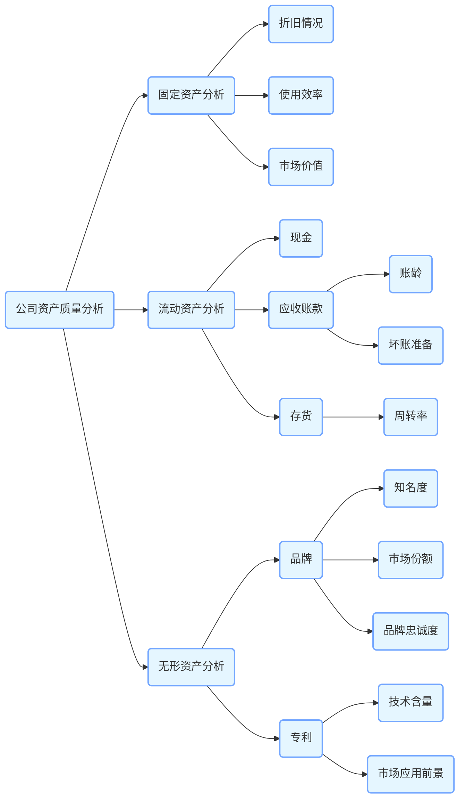

# 彼得林奇对公司资产质量的深度分析

> 关键词：彼得林奇、公司资产质量、财务分析、投资策略、资产估值

> 摘要：本文围绕彼得林奇对公司资产质量的深度分析展开。详细介绍了彼得林奇分析公司资产质量的背景、核心概念、算法原理、数学模型等内容。通过实际案例展示如何运用其方法进行公司资产质量评估，并探讨了在不同场景下的应用。同时，推荐了相关的学习资源、开发工具和论文著作，最后总结了未来发展趋势与挑战，解答常见问题并提供扩展阅读和参考资料，旨在帮助投资者深入理解彼得林奇的投资理念，提升对公司资产质量的分析能力。

## 1. 背景介绍 
### 1.1 目的和范围
本文章的主要目的是深入剖析彼得林奇对公司资产质量的分析方法和理念。彼得林奇作为投资界的传奇人物，其投资策略和对公司基本面的分析方法具有极高的参考价值。通过研究他对公司资产质量的深度分析，投资者可以更好地评估公司的投资价值，做出更明智的投资决策。本文的范围涵盖了彼得林奇分析公司资产质量所涉及的各个方面，包括核心概念、算法原理、数学模型以及实际应用案例等。

### 1.2 预期读者
本文预期读者主要包括对投资领域感兴趣的个人投资者、金融专业学生、从事投资研究的专业人士等。对于希望学习如何评估公司资产质量、提升投资分析能力的人群，本文提供了系统而深入的知识和方法。

### 1.3 文档结构概述
本文首先介绍彼得林奇分析公司资产质量的背景信息，包括目的、预期读者和文档结构。接着阐述核心概念与联系，展示相关的文本示意图和 Mermaid 流程图。然后详细讲解核心算法原理和具体操作步骤，并用 Python 源代码进行说明。随后介绍数学模型和公式，并举例说明。通过项目实战部分，展示代码实际案例和详细解释。之后探讨实际应用场景，推荐相关的工具和资源。最后总结未来发展趋势与挑战，解答常见问题并提供扩展阅读和参考资料。

### 1.4 术语表
#### 1.4.1 核心术语定义
- **公司资产质量**：指公司拥有的各类资产的优劣程度，包括资产的流动性、盈利能力、安全性等方面。优质资产通常具有较强的变现能力、稳定的盈利能力和较低的风险。
- **账面价值**：指公司资产负债表上所记录的资产价值，通常是按照历史成本减去累计折旧或摊销后的金额。
- **重置成本**：指在当前市场条件下，重新购置或建造相同资产所需的成本。
- **隐蔽资产**：指那些在公司财务报表中未被充分反映，但实际上具有一定价值的资产，如土地、专利、品牌等。

#### 1.4.2 相关概念解释
- **资产流动性**：指资产能够以合理价格快速变现的能力。流动性强的资产如现金、短期债券等，可以在短时间内转化为现金，满足公司的资金需求。
- **资产盈利能力**：指资产为公司创造利润的能力。通过分析资产的收益率、利润率等指标，可以评估资产的盈利能力。
- **资产安全性**：指资产遭受损失的可能性。评估资产安全性需要考虑市场风险、信用风险、经营风险等因素。

#### 1.4.3 缩略词列表
- **P/E**：市盈率（Price-to-Earnings Ratio），是指股票价格与每股收益的比率，用于衡量股票的估值水平。
- **P/B**：市净率（Price-to-Book Ratio），是指股票价格与每股净资产的比率，反映了市场对公司净资产的估值。
- **ROE**：净资产收益率（Return on Equity），是指净利润与股东权益的比率，衡量了公司运用自有资本的效率。

## 2. 核心概念与联系 

### 核心概念原理
彼得林奇认为，分析公司资产质量是投资决策的重要环节。公司的资产质量直接影响其盈利能力、偿债能力和未来发展潜力。他关注公司的各类资产，包括固定资产、流动资产、无形资产等，并通过多种方法评估资产的真实价值。

例如，对于固定资产，他会考虑其折旧情况、使用效率和市场价值。如果固定资产的账面价值过高，但实际使用效率低下，或者市场价值已经大幅下降，那么该资产的质量可能存在问题。对于流动资产，他注重其流动性和变现能力，如现金、应收账款和存货等。现金是最具流动性的资产，而应收账款和存货的质量则需要进一步分析，例如应收账款的账龄、坏账准备情况，存货的周转率等。

无形资产如品牌、专利等也具有重要价值。彼得林奇会关注公司品牌的知名度、市场份额和品牌忠诚度，以及专利的技术含量和市场应用前景。这些无形资产虽然在财务报表上可能没有充分体现其价值，但对于公司的长期发展具有重要意义。

### 架构的文本示意图
```plaintext
公司资产质量分析
|-- 固定资产分析
|   |-- 折旧情况
|   |-- 使用效率
|   |-- 市场价值
|-- 流动资产分析
|   |-- 现金
|   |-- 应收账款
|   |   |-- 账龄
|   |   |-- 坏账准备
|   |-- 存货
|   |   |-- 周转率
|-- 无形资产分析
|   |-- 品牌
|   |   |-- 知名度
|   |   |-- 市场份额
|   |   |-- 品牌忠诚度
|   |-- 专利
|   |   |-- 技术含量
|   |   |-- 市场应用前景
```

### Mermaid 流程图


## 3. 核心算法原理 & 具体操作步骤 

### 核心算法原理
彼得林奇分析公司资产质量的核心算法原理是通过对公司财务报表的深入分析，结合市场情况和行业特点，评估公司各类资产的真实价值和质量。以下是一些常用的算法和指标：

#### 1. 市盈率（P/E）
市盈率是衡量股票估值的常用指标，计算公式为：
$$P/E = \frac{股票价格}{每股收益}$$
较低的市盈率可能意味着股票被低估，但也可能反映公司的盈利能力较弱。彼得林奇会结合公司的行业地位、成长前景等因素综合判断市盈率的合理性。

#### 2. 市净率（P/B）
市净率反映了市场对公司净资产的估值，计算公式为：
$$P/B = \frac{股票价格}{每股净资产}$$
较低的市净率可能表示股票具有投资价值，但需要注意公司资产的质量和盈利能力。

#### 3. 净资产收益率（ROE）
净资产收益率衡量了公司运用自有资本的效率，计算公式为：
$$ROE = \frac{净利润}{股东权益} \times 100\%$$
较高的 ROE 通常表示公司具有较强的盈利能力和管理效率。

### 具体操作步骤
#### 1. 收集公司财务报表
收集公司的资产负债表、利润表和现金流量表等财务报表，这些报表是分析公司资产质量的基础数据来源。

#### 2. 分析固定资产
- 查看固定资产的折旧政策和折旧情况，判断折旧是否合理。
- 评估固定资产的使用效率，例如通过计算固定资产周转率等指标。
- 了解固定资产的市场价值，对于一些特殊资产如土地、房产等，可以参考市场价格进行评估。

#### 3. 分析流动资产
- 检查现金的持有量和流动性，确保公司有足够的现金满足日常运营和偿债需求。
- 分析应收账款的账龄和坏账准备情况，评估应收账款的质量和回收风险。
- 计算存货周转率，了解存货的管理效率和销售情况。

#### 4. 分析无形资产
- 研究公司的品牌价值，包括品牌知名度、市场份额和品牌忠诚度等。
- 评估公司的专利技术，了解其技术含量和市场应用前景。

#### 5. 计算关键指标
根据财务报表数据，计算市盈率、市净率、净资产收益率等关键指标，并与同行业公司进行比较。

#### 6. 综合评估
综合考虑以上各项分析结果，对公司的资产质量进行全面评估，判断公司是否具有投资价值。

### Python 源代码示例
```python
import pandas as pd

# 示例财务数据
data = {
    '股票价格': [20, 30, 40],
    '每股收益': [1, 2, 3],
    '每股净资产': [5, 10, 15],
    '净利润': [100, 200, 300],
    '股东权益': [500, 1000, 1500]
}

df = pd.DataFrame(data)

# 计算市盈率
df['市盈率'] = df['股票价格'] / df['每股收益']

# 计算市净率
df['市净率'] = df['股票价格'] / df['每股净资产']

# 计算净资产收益率
df['净资产收益率'] = (df['净利润'] / df['股东权益']) * 100

print(df)
```

## 4. 数学模型和公式 & 详细讲解 & 举例说明 

### 数学模型和公式
#### 1. 市盈率（P/E）
$$P/E = \frac{股票价格}{每股收益}$$
市盈率反映了投资者为获取公司每股收益所愿意支付的价格。例如，某公司股票价格为 50 元，每股收益为 5 元，则该公司的市盈率为：
$$P/E = \frac{50}{5} = 10$$
这意味着投资者为获取该公司每股 5 元的收益，愿意支付 10 倍的价格。

#### 2. 市净率（P/B）
$$P/B = \frac{股票价格}{每股净资产}$$
市净率衡量了市场对公司净资产的估值。假设某公司股票价格为 30 元，每股净资产为 10 元，则该公司的市净率为：
$$P/B = \frac{30}{10} = 3$$
即市场对该公司净资产的估值是其账面价值的 3 倍。

#### 3. 净资产收益率（ROE）
$$ROE = \frac{净利润}{股东权益} \times 100\%$$
净资产收益率反映了公司运用自有资本的效率。若某公司净利润为 200 万元，股东权益为 1000 万元，则该公司的净资产收益率为：
$$ROE = \frac{200}{1000} \times 100\% = 20\%$$
表示该公司每投入 1 元自有资本，能够创造 0.2 元的净利润。

#### 4. 固定资产周转率
$$固定资产周转率 = \frac{营业收入}{固定资产平均净值}$$
固定资产周转率衡量了固定资产的使用效率。例如，某公司营业收入为 5000 万元，固定资产平均净值为 1000 万元，则该公司的固定资产周转率为：
$$固定资产周转率 = \frac{5000}{1000} = 5$$
表明该公司的固定资产在一年内周转了 5 次。

#### 5. 存货周转率
$$存货周转率 = \frac{营业成本}{存货平均余额}$$
存货周转率反映了存货的管理效率。假设某公司营业成本为 3000 万元，存货平均余额为 500 万元，则该公司的存货周转率为：
$$存货周转率 = \frac{3000}{500} = 6$$
意味着该公司的存货在一年内周转了 6 次。

### 详细讲解
- **市盈率**：市盈率是一个相对指标，不同行业的市盈率水平可能存在较大差异。一般来说，成长型行业的市盈率较高，因为投资者对其未来的盈利增长有较高的预期；而成熟行业的市盈率相对较低。在使用市盈率进行分析时，需要结合公司的基本面和行业特点进行综合判断。
- **市净率**：市净率可以帮助投资者判断股票是否被低估或高估。较低的市净率可能表示股票具有投资价值，但需要注意公司资产的质量和盈利能力。如果公司的资产存在大量的不良资产或潜在的损失，那么即使市净率较低，也不一定意味着股票具有投资价值。
- **净资产收益率**：净资产收益率是衡量公司盈利能力和管理效率的重要指标。较高的 ROE 通常表示公司具有较强的盈利能力和良好的管理水平。但需要注意的是，ROE 可能受到财务杠杆的影响，因此在分析时需要结合公司的资产负债率等指标进行综合判断。
- **固定资产周转率**：固定资产周转率越高，表明固定资产的使用效率越高，公司能够用较少的固定资产投入获得较多的营业收入。反之，固定资产周转率较低可能表示固定资产闲置或使用效率低下。
- **存货周转率**：存货周转率越高，说明存货的周转速度越快，存货占用的资金越少，公司的经营效率越高。存货周转率较低可能意味着存货积压，存在滞销风险。

### 举例说明
假设我们要分析两家公司 A 和 B 的资产质量。以下是两家公司的部分财务数据：

| 公司 | 股票价格（元） | 每股收益（元） | 每股净资产（元） | 净利润（万元） | 股东权益（万元） | 营业收入（万元） | 固定资产平均净值（万元） | 营业成本（万元） | 存货平均余额（万元） |
| ---- | ---- | ---- | ---- | ---- | ---- | ---- | ---- | ---- | ---- |
| A | 20 | 2 | 10 | 200 | 1000 | 5000 | 1000 | 3000 | 500 |
| B | 30 | 3 | 15 | 300 | 1500 | 6000 | 1200 | 3600 | 600 |

#### 1. 计算关键指标
- **市盈率**：
  - 公司 A：$P/E_A = \frac{20}{2} = 10$
  - 公司 B：$P/E_B = \frac{30}{3} = 10$
- **市净率**：
  - 公司 A：$P/B_A = \frac{20}{10} = 2$
  - 公司 B：$P/B_B = \frac{30}{15} = 2$
- **净资产收益率**：
  - 公司 A：$ROE_A = \frac{200}{1000} \times 100\% = 20\%$
  - 公司 B：$ROE_B = \frac{300}{1500} \times 100\% = 20\%$
- **固定资产周转率**：
  - 公司 A：$固定资产周转率_A = \frac{5000}{1000} = 5$
  - 公司 B：$固定资产周转率_B = \frac{6000}{1200} = 5$
- **存货周转率**：
  - 公司 A：$存货周转率_A = \frac{3000}{500} = 6$
  - 公司 B：$存货周转率_B = \frac{3600}{600} = 6$

#### 2. 分析比较
从以上计算结果可以看出，两家公司的市盈率、市净率、净资产收益率、固定资产周转率和存货周转率均相同。这表明在这些指标上，两家公司的资产质量和经营效率相当。但在实际分析中，还需要进一步考虑其他因素，如公司的行业地位、竞争优势、未来发展前景等。

## 5. 项目实战：代码实际案例和详细解释说明 

### 5.1  开发环境搭建
在进行公司资产质量分析的项目实战时，我们可以使用 Python 语言进行数据处理和分析。以下是开发环境搭建的步骤：

#### 1. 安装 Python
从 Python 官方网站（https://www.python.org/downloads/）下载并安装适合你操作系统的 Python 版本。建议安装 Python 3.x 版本。

#### 2. 安装必要的库
我们需要安装一些常用的 Python 库，如 Pandas、Numpy 等。可以使用以下命令进行安装：
```sh
pip install pandas numpy
```

### 5.2  源代码详细实现和代码解读
以下是一个完整的 Python 代码示例，用于分析公司的资产质量：

```python
import pandas as pd

# 定义公司财务数据
data = {
    '公司名称': ['公司 A', '公司 B', '公司 C'],
    '股票价格': [20, 30, 40],
    '每股收益': [1, 2, 3],
    '每股净资产': [5, 10, 15],
    '净利润': [100, 200, 300],
    '股东权益': [500, 1000, 1500],
    '营业收入': [5000, 6000, 7000],
    '固定资产平均净值': [1000, 1200, 1400],
    '营业成本': [3000, 3600, 4200],
    '存货平均余额': [500, 600, 700]
}

# 创建 DataFrame
df = pd.DataFrame(data)

# 计算关键指标
df['市盈率'] = df['股票价格'] / df['每股收益']
df['市净率'] = df['股票价格'] / df['每股净资产']
df['净资产收益率'] = (df['净利润'] / df['股东权益']) * 100
df['固定资产周转率'] = df['营业收入'] / df['固定资产平均净值']
df['存货周转率'] = df['营业成本'] / df['存货平均余额']

# 输出结果
print(df[['公司名称', '市盈率', '市净率', '净资产收益率', '固定资产周转率', '存货周转率']])
```

### 代码解读与分析
#### 1. 数据定义
```python
data = {
    '公司名称': ['公司 A', '公司 B', '公司 C'],
    '股票价格': [20, 30, 40],
    '每股收益': [1, 2, 3],
    '每股净资产': [5, 10, 15],
    '净利润': [100, 200, 300],
    '股东权益': [500, 1000, 1500],
    '营业收入': [5000, 6000, 7000],
    '固定资产平均净值': [1000, 1200, 1400],
    '营业成本': [3000, 3600, 4200],
    '存货平均余额': [500, 600, 700]
}
```
这部分代码定义了一个包含多家公司财务数据的字典，其中包括公司名称、股票价格、每股收益等各项指标。

#### 2. 创建 DataFrame
```python
df = pd.DataFrame(data)
```
使用 Pandas 的 `DataFrame` 函数将字典数据转换为数据框，方便进行数据处理和分析。

#### 3. 计算关键指标
```python
df['市盈率'] = df['股票价格'] / df['每股收益']
df['市净率'] = df['股票价格'] / df['每股净资产']
df['净资产收益率'] = (df['净利润'] / df['股东权益']) * 100
df['固定资产周转率'] = df['营业收入'] / df['固定资产平均净值']
df['存货周转率'] = df['营业成本'] / df['存货平均余额']
```
通过对数据框中的列进行运算，计算出市盈率、市净率、净资产收益率、固定资产周转率和存货周转率等关键指标。

#### 4. 输出结果
```python
print(df[['公司名称', '市盈率', '市净率', '净资产收益率', '固定资产周转率', '存货周转率']])
```
最后，选择需要的列并打印输出结果，展示每家公司的关键指标数据。

## 6. 实际应用场景 
### 个人投资决策
对于个人投资者来说，运用彼得林奇的方法分析公司资产质量可以帮助他们筛选出具有投资价值的股票。通过对公司固定资产、流动资产和无形资产的深入分析，以及计算关键指标如市盈率、市净率、净资产收益率等，投资者可以评估公司的盈利能力、偿债能力和未来发展潜力，从而做出更明智的投资决策。

例如，投资者在选择股票时，可以比较不同公司的资产质量指标，选择那些资产质量较好、估值合理的公司进行投资。同时，投资者还可以关注公司的隐蔽资产，如土地、专利等，这些资产可能在未来为公司带来额外的收益。

### 机构投资者研究
机构投资者如基金公司、证券公司等，需要对大量的公司进行研究和分析，以制定投资策略和资产配置方案。彼得林奇的分析方法可以为机构投资者提供一种系统而有效的评估公司资产质量的框架。

机构投资者可以利用专业的金融数据平台收集公司的财务报表和相关信息，运用 Python 等编程语言进行数据处理和分析，计算各种关键指标，并结合行业研究和市场趋势，对公司的投资价值进行全面评估。通过对不同行业和公司的资产质量进行比较和分析，机构投资者可以优化投资组合，提高投资收益。

### 企业战略规划
企业管理层在制定战略规划时，也可以借鉴彼得林奇的方法分析公司的资产质量。通过对公司自身资产的评估，管理层可以了解公司的优势和劣势，发现潜在的问题和机会，从而制定出更加合理的战略规划。

例如，企业可以分析固定资产的使用效率，决定是否需要进行设备更新或扩建；可以评估存货周转率，优化库存管理策略；可以关注无形资产的价值，加强品牌建设和技术创新。通过不断提高公司的资产质量，企业可以提升自身的竞争力和盈利能力。

## 7. 工具和资源推荐
### 7.1 学习资源推荐
#### 7.1.1 书籍推荐
- 《彼得·林奇的成功投资》（*One Up On Wall Street*）：彼得林奇的经典著作，详细介绍了他的投资理念和方法，包括如何分析公司基本面、寻找优质股票等内容。
- 《战胜华尔街》（*Beating the Street*）：这本书进一步阐述了彼得林奇的投资策略，通过实际案例展示了他如何在不同市场环境下进行投资决策。
- 《财务报表分析与证券定价》（*Financial Statement Analysis and Security Valuation*）：全面介绍了财务报表分析的方法和技巧，以及如何运用财务数据进行证券定价，对于理解公司资产质量分析具有重要参考价值。

#### 7.1.2 在线课程
- Coursera 上的“Financial Markets”课程：由耶鲁大学教授罗伯特·席勒（Robert Shiller）主讲，涵盖了金融市场的基本概念、投资理论和实践等内容，对投资者提升金融知识和分析能力有很大帮助。
- edX 上的“Accounting Fundamentals”课程：介绍了会计学的基本原理和方法，帮助学习者掌握财务报表的阅读和分析技巧。

#### 7.1.3 技术博客和网站
- Seeking Alpha：一个提供金融市场分析和投资建议的网站，有许多专业投资者和分析师分享他们的研究成果和观点。
- Morningstar：提供基金、股票等金融产品的评级和分析报告，以及市场数据和投资工具，是投资者进行研究和决策的重要参考网站。

### 7.2 开发工具框架推荐
#### 7.2.1 IDE和编辑器
- PyCharm：一款专业的 Python 集成开发环境，提供了丰富的代码编辑、调试和分析功能，适合进行数据分析和算法开发。
- Jupyter Notebook：一个交互式的开发环境，支持 Python、R 等多种编程语言，方便进行数据探索、可视化和代码演示。

#### 7.2.2 调试和性能分析工具
- pdb：Python 自带的调试工具，可以帮助开发者逐行调试代码，查找和解决问题。
- cProfile：Python 的性能分析工具，可以分析代码的运行时间和函数调用情况，帮助开发者优化代码性能。

#### 7.2.3 相关框架和库
- Pandas：一个强大的数据处理和分析库，提供了丰富的数据结构和函数，方便进行数据清洗、转换和分析。
- Numpy：用于科学计算的基础库，提供了高效的数组操作和数学函数，是许多数据分析和机器学习库的基础。

### 7.3 相关论文著作推荐
#### 7.3.1 经典论文
- “The Cross-Section of Expected Stock Returns” by Eugene F. Fama and Kenneth R. French：提出了著名的 Fama-French 三因子模型，对股票收益率的影响因素进行了深入研究，对于理解公司估值和投资回报具有重要意义。
- “Efficient Capital Markets: A Review of Theory and Empirical Work” by Eugene F. Fama：这篇论文对有效市场假说进行了系统的阐述和总结，是金融经济学领域的经典之作。

#### 7.3.2 最新研究成果
- 关注《Journal of Financial Economics》、《The Review of Financial Studies》等顶级金融学术期刊，这些期刊会发表关于公司财务、资产定价、投资策略等方面的最新研究成果。

#### 7.3.3 应用案例分析
- 可以参考一些知名投资机构的研究报告和案例分析，了解他们在实际投资中如何运用各种分析方法评估公司资产质量和进行投资决策。

## 8. 总结：未来发展趋势与挑战
### 未来发展趋势
- **数据驱动的分析方法**：随着信息技术的不断发展，金融数据的获取和处理变得更加便捷和高效。未来，基于大数据和人工智能的分析方法将在公司资产质量分析中得到更广泛的应用。例如，通过机器学习算法对大量的财务数据和非财务数据进行挖掘和分析，可以发现更多隐藏的信息和规律，提高分析的准确性和效率。
- **跨学科融合**：公司资产质量分析不仅仅涉及财务和金融领域的知识，还需要结合经济学、管理学、统计学等多个学科的方法和理论。未来，跨学科的融合将成为发展的趋势，投资者和分析师需要具备更广泛的知识和技能，才能更好地进行公司资产质量分析。
- **关注可持续发展**：随着社会对可持续发展的关注度不断提高，投资者越来越重视公司的环境、社会和治理（ESG）表现。未来，在分析公司资产质量时，将更多地考虑公司的 ESG 因素，将其纳入到评估体系中，以评估公司的长期发展潜力和风险。

### 挑战
- **数据质量和可靠性**：金融数据的质量和可靠性是进行公司资产质量分析的基础。然而，现实中存在数据不准确、不完整、滞后等问题，这给分析带来了一定的挑战。投资者和分析师需要采取有效的方法对数据进行清洗和验证，以确保分析结果的准确性。
- **市场不确定性**：金融市场充满了不确定性，宏观经济环境、政策变化、行业竞争等因素都会对公司的资产质量和投资价值产生影响。如何在不确定性的市场环境中准确评估公司的资产质量和未来发展趋势，是投资者和分析师面临的一大挑战。
- **技术更新换代快**：随着信息技术的快速发展，分析工具和方法也在不断更新换代。投资者和分析师需要不断学习和掌握新的技术和方法，以适应市场的变化和需求。否则，可能会因为技术落后而无法准确评估公司的资产质量。

## 9. 附录：常见问题与解答
### 1. 如何判断公司的隐蔽资产价值？
判断公司的隐蔽资产价值需要综合考虑多个因素。首先，可以关注公司的土地、房产等固定资产，了解其地理位置、市场价格和潜在开发价值。对于专利、商标等无形资产，可以评估其技术含量、市场应用前景和竞争优势。此外，还可以研究公司的品牌价值、客户资源、渠道优势等，这些也可能是潜在的隐蔽资产。同时，可以参考同行业公司的类似资产价值，以及专业评估机构的意见。

### 2. 市盈率和市净率哪个更重要？
市盈率和市净率都是评估公司投资价值的重要指标，但它们的侧重点不同。市盈率主要反映了市场对公司盈利的预期，侧重于公司的盈利能力；市净率则反映了市场对公司净资产的估值，侧重于公司的资产质量。在实际分析中，需要综合考虑这两个指标，并结合公司的行业特点、成长前景等因素进行判断。一般来说，对于成长型公司，市盈率可能更重要；对于价值型公司，市净率可能更有参考价值。

### 3. 如何处理财务报表中的异常数据？
当遇到财务报表中的异常数据时，首先要仔细核实数据的真实性和准确性。可以查看报表的附注说明，了解数据异常的原因。如果是由于会计政策变更、一次性事件等原因导致的异常，可以对数据进行调整或剔除，以更准确地反映公司的真实情况。如果无法确定数据异常的原因，建议进一步收集相关信息，或咨询专业的财务分析师。

### 4. 公司资产质量分析是否适用于所有行业？
公司资产质量分析的基本方法和原则适用于大多数行业，但不同行业的资产特点和评估重点可能会有所不同。例如，制造业公司通常更注重固定资产的质量和使用效率；金融行业公司则更关注资产的流动性和风险控制；科技行业公司的无形资产如专利、技术等可能更为重要。因此，在进行公司资产质量分析时，需要结合行业特点进行具体分析。

## 10. 扩展阅读 & 参考资料
### 扩展阅读
- 《聪明的投资者》（*The Intelligent Investor*）：本杰明·格雷厄姆（Benjamin Graham）的经典著作，强调了价值投资的理念和方法，对投资者培养正确的投资思维有很大帮助。
- 《金融炼金术》（*The Alchemy of Finance*）：乔治·索罗斯（George Soros）的著作，介绍了他的反身性理论和投资实践，对于理解金融市场的复杂性和不确定性具有重要启示。

### 参考资料
- 彼得·林奇相关的演讲和访谈记录，可以在财经媒体网站和视频平台上查找。
- 上市公司的年度报告、季度报告等财务信息，可通过证券交易所官方网站获取。

作者：AI天才研究院/AI Genius Institute & 禅与计算机程序设计艺术 /Zen And The Art of Computer Programming