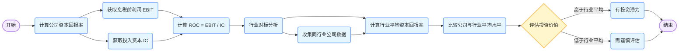

# 彼得林奇对公司资本回报率的行业对标分析

> 关键词：彼得林奇、资本回报率、行业对标分析、公司评估、投资决策

> 摘要：本文深入探讨了彼得林奇关于公司资本回报率的行业对标分析方法。通过对相关概念的介绍，阐述了资本回报率在评估公司绩效中的重要性，详细分析了进行行业对标分析的核心原理与步骤，并给出了相应的数学模型和公式。结合实际案例，展示了如何运用该方法进行公司评估和投资决策。同时，介绍了在该领域可利用的工具和资源，最后对未来发展趋势与挑战进行了总结，旨在为投资者和相关研究人员提供全面且深入的参考。

## 1. 背景介绍 
### 1.1 目的和范围
彼得林奇作为投资界的传奇人物，其投资理念和方法一直备受关注。公司资本回报率的行业对标分析是他评估公司投资价值的重要手段之一。本文的目的在于深入剖析彼得林奇的这一分析方法，详细阐述其原理、步骤和应用。范围涵盖了资本回报率的概念、行业对标分析的具体操作、相关数学模型以及实际案例分析等方面，旨在帮助投资者更好地理解和运用这一方法进行投资决策。

### 1.2 预期读者
本文预期读者主要包括投资者、金融分析师、投资学专业学生以及对投资分析方法感兴趣的人士。对于投资者来说，了解彼得林奇的分析方法有助于他们更准确地评估公司的投资价值，提高投资决策的准确性；金融分析师可以将其作为一种重要的分析工具，丰富自己的分析手段；投资学专业学生能够通过学习本文，深入理解投资分析的实际应用；而对投资分析方法感兴趣的人士则可以从中获取专业的知识和思路。

### 1.3 文档结构概述
本文首先介绍了与彼得林奇的公司资本回报率行业对标分析相关的核心概念，包括资本回报率的定义和行业对标分析的意义。接着阐述了核心算法原理，给出具体操作步骤并使用 Python 代码进行详细说明。然后介绍了相关的数学模型和公式，并通过举例进行详细讲解。之后通过实际案例展示了如何运用该方法进行公司评估和投资决策，包括开发环境搭建、源代码实现和代码解读。再介绍了该方法在实际中的应用场景，以及可利用的工具和资源。最后对未来发展趋势与挑战进行总结，并提供了常见问题的解答和扩展阅读的参考资料。

### 1.4 术语表
#### 1.4.1 核心术语定义
- **资本回报率（Return on Capital，ROC）**：是指投出和/或使用资金与相关回报（回报通常表现为获取的利息和/或分得利润）之比例，用于衡量公司运用资本获得收益的能力。计算公式为：$ROC = \frac{息税前利润（EBIT）}{投入资本（IC）}$。
- **行业对标分析**：将公司的某项指标（如资本回报率）与同行业其他公司进行对比分析，以评估该公司在行业中的相对地位和竞争力。
- **息税前利润（Earnings Before Interest and Taxes，EBIT）**：企业在支付利息和所得税之前的利润，反映了企业经营活动的盈利能力，不受融资结构和税收政策的影响。计算公式为：$EBIT = 净利润 + 所得税 + 利息$。
- **投入资本（Invested Capital，IC）**：指企业在经营过程中投入的长期资金，通常包括股东权益和长期负债。计算公式为：$IC = 股东权益 + 长期负债$。

#### 1.4.2 相关概念解释
- **投资价值**：指资产对于具有明确投资目标的特定投资者或某一类投资者所具有的价值，通常与资产的盈利能力、成长潜力等因素相关。在运用资本回报率进行行业对标分析时，投资价值可以通过公司与同行业其他公司的对比来评估。
- **竞争力**：企业在市场中相对于竞争对手所具有的优势和能力，资本回报率是衡量企业竞争力的重要指标之一。较高的资本回报率通常意味着企业在利用资本创造利润方面具有更强的竞争力。

#### 1.4.3 缩略词列表
- **ROC**：Return on Capital（资本回报率）
- **EBIT**：Earnings Before Interest and Taxes（息税前利润）
- **IC**：Invested Capital（投入资本）

## 2. 核心概念与联系 
### 核心概念原理
彼得林奇强调通过分析公司的资本回报率并与同行业进行对标，来评估公司的投资价值。资本回报率反映了公司运用投入资本获取利润的效率，是衡量公司经营绩效的重要指标。行业对标分析则是将公司的资本回报率与同行业其他公司进行比较，以判断该公司在行业中的相对地位。

如果一家公司的资本回报率高于行业平均水平，说明该公司在利用资本创造利润方面表现出色，可能具有更强的竞争力和投资价值；反之，如果低于行业平均水平，则可能意味着该公司在经营效率、成本控制等方面存在问题，投资价值相对较低。

### 架构的文本示意图
```plaintext
资本回报率分析
|-- 计算公司资本回报率
|   |-- 获取息税前利润（EBIT）
|   |-- 获取投入资本（IC）
|   |-- 计算 ROC = EBIT / IC
|-- 行业对标分析
|   |-- 收集同行业公司数据
|   |-- 计算行业平均资本回报率
|   |-- 比较公司与行业平均水平
|-- 评估投资价值
|   |-- 高于行业平均：有投资潜力
|   |-- 低于行业平均：需谨慎评估
```

### Mermaid 流程图


## 3. 核心算法原理 & 具体操作步骤 
### 核心算法原理
核心算法主要围绕资本回报率的计算和行业对标分析展开。首先，根据公司的财务数据计算其资本回报率，公式为：$ROC = \frac{EBIT}{IC}$。然后，收集同行业其他公司的资本回报率数据，计算行业平均资本回报率。最后，将公司的资本回报率与行业平均水平进行比较，以评估公司的投资价值。

### 具体操作步骤
1. **数据收集**：收集目标公司和同行业其他公司的财务报表，从中获取息税前利润（EBIT）和投入资本（IC）的数据。
2. **计算公司资本回报率**：使用公式 $ROC = \frac{EBIT}{IC}$ 计算目标公司的资本回报率。
3. **计算行业平均资本回报率**：对同行业其他公司的资本回报率进行求和并除以公司数量，得到行业平均资本回报率。
4. **比较分析**：将目标公司的资本回报率与行业平均水平进行比较，判断其在行业中的相对地位。
5. **评估投资价值**：根据比较结果，评估目标公司的投资价值。

### Python 源代码实现
```python
# 假设已经收集到了目标公司和同行业其他公司的 EBIT 和 IC 数据
# 目标公司数据
target_ebit = 1000000  # 目标公司息税前利润
target_ic = 5000000    # 目标公司投入资本

# 同行业其他公司数据
industry_ebits = [800000, 900000, 1100000, 1200000]  # 同行业其他公司息税前利润
industry_ics = [4000000, 4500000, 5500000, 6000000]  # 同行业其他公司投入资本

# 计算目标公司资本回报率
target_roc = target_ebit / target_ic

# 计算同行业其他公司资本回报率
industry_rocs = []
for ebit, ic in zip(industry_ebits, industry_ics):
    roc = ebit / ic
    industry_rocs.append(roc)

# 计算行业平均资本回报率
industry_avg_roc = sum(industry_rocs) / len(industry_rocs)

# 比较分析
if target_roc > industry_avg_roc:
    print("目标公司资本回报率高于行业平均水平，有投资潜力。")
else:
    print("目标公司资本回报率低于行业平均水平，需谨慎评估。")

print(f"目标公司资本回报率: {target_roc * 100:.2f}%")
print(f"行业平均资本回报率: {industry_avg_roc * 100:.2f}%")
```

## 4. 数学模型和公式 & 详细讲解 & 举例说明 
### 数学模型和公式
- **资本回报率计算公式**：$ROC = \frac{EBIT}{IC}$
其中，$ROC$ 表示资本回报率，$EBIT$ 表示息税前利润，$IC$ 表示投入资本。

- **行业平均资本回报率计算公式**：$行业平均 ROC = \frac{\sum_{i=1}^{n} ROC_i}{n}$
其中，$ROC_i$ 表示第 $i$ 个同行业公司的资本回报率，$n$ 表示同行业公司的数量。

### 详细讲解
资本回报率公式反映了公司每投入一单位资本所能获得的利润。息税前利润是企业在支付利息和所得税之前的利润，它不受融资结构和税收政策的影响，能够更纯粹地反映企业经营活动的盈利能力。投入资本则包括股东权益和长期负债，代表了企业在经营过程中投入的长期资金。

行业平均资本回报率是通过对同行业多个公司的资本回报率进行平均计算得到的，它可以作为一个参考基准，用于衡量目标公司在行业中的相对表现。

### 举例说明
假设某行业有三家公司 A、B、C，其相关财务数据如下：
| 公司 | 息税前利润（EBIT） | 投入资本（IC） |
| ---- | ---- | ---- |
| A | 200 万元 | 1000 万元 |
| B | 300 万元 | 1500 万元 |
| C | 400 万元 | 2000 万元 |

首先，计算各公司的资本回报率：
- 公司 A 的资本回报率：$ROC_A = \frac{200}{1000} = 0.2 = 20\%$
- 公司 B 的资本回报率：$ROC_B = \frac{300}{1500} = 0.2 = 20\%$
- 公司 C 的资本回报率：$ROC_C = \frac{400}{2000} = 0.2 = 20\%$

然后，计算行业平均资本回报率：
$行业平均 ROC = \frac{20\% + 20\% + 20\%}{3} = 20\%$

假设现在有一家目标公司 D，其息税前利润为 350 万元，投入资本为 1600 万元，则其资本回报率为：
$ROC_D = \frac{350}{1600} \approx 0.21875 = 21.88\%$

由于 $ROC_D > 行业平均 ROC$，说明目标公司 D 在利用资本创造利润方面表现优于行业平均水平，可能具有更强的竞争力和投资价值。

## 5. 项目实战：代码实际案例和详细解释说明 
### 5.1  开发环境搭建
为了运行上述 Python 代码，需要搭建以下开发环境：
1. **Python 安装**：从 Python 官方网站（https://www.python.org/downloads/）下载并安装 Python 3.x 版本。
2. **开发工具**：可以选择使用 PyCharm、Jupyter Notebook 等开发工具。这里以 PyCharm 为例，从 JetBrains 官方网站（https://www.jetbrains.com/pycharm/download/）下载并安装 PyCharm Community Edition。
3. **依赖库安装**：上述代码没有使用额外的第三方库，因此无需安装其他依赖库。

### 5.2  源代码详细实现和代码解读
```python
# 假设已经收集到了目标公司和同行业其他公司的 EBIT 和 IC 数据
# 目标公司数据
target_ebit = 1000000  # 目标公司息税前利润
target_ic = 5000000    # 目标公司投入资本

# 同行业其他公司数据
industry_ebits = [800000, 900000, 1100000, 1200000]  # 同行业其他公司息税前利润
industry_ics = [4000000, 4500000, 5500000, 6000000]  # 同行业其他公司投入资本

# 计算目标公司资本回报率
target_roc = target_ebit / target_ic

# 计算同行业其他公司资本回报率
industry_rocs = []
for ebit, ic in zip(industry_ebits, industry_ics):
    roc = ebit / ic
    industry_rocs.append(roc)

# 计算行业平均资本回报率
industry_avg_roc = sum(industry_rocs) / len(industry_rocs)

# 比较分析
if target_roc > industry_avg_roc:
    print("目标公司资本回报率高于行业平均水平，有投资潜力。")
else:
    print("目标公司资本回报率低于行业平均水平，需谨慎评估。")

print(f"目标公司资本回报率: {target_roc * 100:.2f}%")
print(f"行业平均资本回报率: {industry_avg_roc * 100:.2f}%")
```
### 代码解读
1. **数据初始化**：定义了目标公司的息税前利润 `target_ebit` 和投入资本 `target_ic`，以及同行业其他公司的息税前利润列表 `industry_ebits` 和投入资本列表 `industry_ics`。
2. **计算目标公司资本回报率**：使用公式 $ROC = \frac{EBIT}{IC}$ 计算目标公司的资本回报率 `target_roc`。
3. **计算同行业其他公司资本回报率**：使用 `for` 循环遍历同行业其他公司的息税前利润和投入资本列表，计算每个公司的资本回报率，并将其添加到 `industry_rocs` 列表中。
4. **计算行业平均资本回报率**：使用 `sum()` 函数对 `industry_rocs` 列表中的元素求和，再除以列表的长度，得到行业平均资本回报率 `industry_avg_roc`。
5. **比较分析**：使用 `if-else` 语句比较目标公司的资本回报率和行业平均资本回报率，并输出相应的评估结果。
6. **输出结果**：使用 `print()` 函数输出目标公司的资本回报率和行业平均资本回报率。

### 5.3  代码解读与分析
上述代码实现了彼得林奇的公司资本回报率行业对标分析方法。通过收集目标公司和同行业其他公司的财务数据，计算各自的资本回报率，并比较目标公司与行业平均水平的差异，从而评估目标公司的投资价值。

代码的优点在于简单易懂，易于实现。但在实际应用中，可能需要考虑更多因素，如数据的准确性、行业的细分程度等。同时，可以进一步扩展代码，实现数据的自动化收集和处理，提高分析效率。

## 6. 实际应用场景 
### 投资决策
投资者在选择投资标的时，可以运用彼得林奇的公司资本回报率行业对标分析方法，评估目标公司在行业中的相对地位和投资价值。如果目标公司的资本回报率高于行业平均水平，说明该公司在利用资本创造利润方面表现出色，可能是一个较好的投资选择；反之，如果低于行业平均水平，则需要谨慎评估。

### 公司战略规划
公司管理层可以通过与同行业其他公司进行资本回报率的对标分析，了解自身在行业中的竞争力水平。如果公司的资本回报率低于行业平均水平，管理层可以分析原因，采取相应的措施提高经营效率，如优化成本结构、提高资产利用率等；如果高于行业平均水平，可以进一步巩固优势，寻找新的增长点。

### 行业研究
研究机构和分析师可以运用该方法对不同行业进行研究，比较各行业的资本回报率水平，分析行业的发展趋势和竞争格局。通过对行业内公司的资本回报率进行排序，可以找出行业内的领先企业和落后企业，为行业研究提供有价值的参考。

## 7. 工具和资源推荐
### 7.1 学习资源推荐
#### 7.1.1 书籍推荐
- 《彼得林奇的成功投资》：彼得林奇的经典著作，详细介绍了他的投资理念和方法，包括如何通过分析公司的财务指标进行投资决策。
- 《财务报表分析与证券定价》：这本书深入讲解了财务报表分析的方法和技巧，以及如何运用财务数据评估公司的价值，对于理解资本回报率等财务指标有很大帮助。
- 《聪明的投资者》：本杰明·格雷厄姆的经典著作，阐述了价值投资的基本原理和方法，是投资者必读的书籍之一。

#### 7.1.2 在线课程
- Coursera 上的“Financial Markets”课程：由耶鲁大学教授罗伯特·席勒讲授，涵盖了金融市场的基本概念、投资分析方法等内容。
- edX 上的“Introduction to Financial Accounting”课程：提供了财务会计的基础知识，有助于理解财务报表和相关指标的计算。

#### 7.1.3 技术博客和网站
- Seeking Alpha：一个提供股票分析和投资建议的网站，有许多专业的分析师和投资者分享他们的研究成果和观点。
- Investopedia：一个金融知识学习网站，提供了丰富的金融术语解释、投资分析方法等内容。

### 7.2 开发工具框架推荐
#### 7.2.1 IDE和编辑器
- PyCharm：一款功能强大的 Python 集成开发环境，提供了代码编辑、调试、版本控制等功能，适合专业开发者使用。
- Jupyter Notebook：一个交互式的开发环境，支持 Python 等多种编程语言，适合数据探索和分析。

#### 7.2.2 调试和性能分析工具
- PDB：Python 自带的调试工具，可以帮助开发者定位代码中的错误。
- cProfile：Python 标准库中的性能分析工具，可以分析代码的运行时间和函数调用情况。

#### 7.2.3 相关框架和库
- Pandas：一个用于数据处理和分析的 Python 库，提供了高效的数据结构和数据操作方法，适合处理财务数据。
- NumPy：一个用于科学计算的 Python 库，提供了高效的数组操作和数学函数，可用于计算资本回报率等指标。

### 7.3 相关论文著作推荐
#### 7.3.1 经典论文
- “The Cross - Section of Expected Stock Returns” by Eugene F. Fama and Kenneth R. French：提出了著名的 Fama - French 三因子模型，对股票收益率的影响因素进行了深入研究。
- “Efficient Capital Markets: A Review of Theory and Empirical Work” by Eugene F. Fama：对有效市场假说进行了系统的阐述和总结，是金融领域的经典论文之一。

#### 7.3.2 最新研究成果
- 关注《Journal of Finance》、《Review of Financial Studies》等顶级金融学术期刊，这些期刊发表了许多关于投资分析、公司财务等方面的最新研究成果。

#### 7.3.3 应用案例分析
- 可以参考一些专业的金融研究报告和案例分析书籍，了解如何运用资本回报率等指标进行公司评估和投资决策的实际案例。

## 8. 总结：未来发展趋势与挑战
### 未来发展趋势
- **数据驱动的精细化分析**：随着信息技术的发展，数据的获取和处理变得更加便捷和高效。未来，投资者和分析师将能够获取更多、更详细的公司财务数据和行业数据，运用更先进的数据分析方法进行资本回报率的行业对标分析，实现更加精细化的投资决策。
- **多指标综合分析**：资本回报率只是评估公司投资价值的一个指标，未来可能会结合更多的财务指标和非财务指标进行综合分析，如净利润增长率、现金流状况、市场份额、创新能力等，以更全面地评估公司的竞争力和发展潜力。
- **人工智能和机器学习的应用**：人工智能和机器学习技术在金融领域的应用越来越广泛。未来，这些技术可能会被应用于资本回报率的行业对标分析中，帮助投资者和分析师更快速、准确地发现投资机会和风险。

### 挑战
- **数据质量和准确性**：数据的质量和准确性是进行资本回报率行业对标分析的基础。然而，实际中可能存在数据缺失、错误、不一致等问题，这会影响分析结果的可靠性。因此，如何确保数据的质量和准确性是一个重要的挑战。
- **行业变化和不确定性**：行业的发展是动态的，受到市场环境、技术创新、政策法规等多种因素的影响。行业平均资本回报率也会随着时间的推移而发生变化，因此在进行对标分析时需要考虑行业的变化和不确定性，及时调整分析方法和参考标准。
- **模型和方法的局限性**：目前的资本回报率行业对标分析方法存在一定的局限性，如无法完全考虑公司的特殊情况和未来发展潜力等。如何开发更完善、更准确的分析模型和方法，是未来需要解决的问题。

## 9. 附录：常见问题与解答
### 问题 1：资本回报率和净资产收益率有什么区别？
资本回报率（ROC）衡量的是公司运用全部投入资本（包括股东权益和长期负债）获取利润的能力，计算公式为 $ROC = \frac{EBIT}{IC}$；而净资产收益率（ROE）衡量的是公司运用股东权益获取利润的能力，计算公式为 $ROE = \frac{净利润}{股东权益}$。资本回报率更侧重于反映公司整体的资本运营效率，而净资产收益率更关注股东权益的回报情况。

### 问题 2：在进行行业对标分析时，如何选择同行业公司？
选择同行业公司时，应考虑以下因素：
- **业务范围**：选择与目标公司业务相似的公司，确保它们在同一行业细分领域内竞争。
- **规模和市场地位**：尽量选择规模和市场地位相近的公司，避免因规模差异过大而导致分析结果不准确。
- **地域因素**：如果目标公司主要在特定地区开展业务，应选择在同一地区或具有相似市场环境的同行业公司进行对标。

### 问题 3：资本回报率高就一定意味着公司有投资价值吗？
不一定。资本回报率高只能说明公司在利用资本创造利润方面表现出色，但不能完全代表公司具有投资价值。还需要考虑其他因素，如公司的成长潜力、市场竞争力、行业前景、财务风险等。例如，一家公司可能通过过度负债来提高资本回报率，但这也会增加公司的财务风险。因此，在评估公司的投资价值时，需要综合考虑多个因素。

## 10. 扩展阅读 & 参考资料
### 扩展阅读
- 《漫步华尔街》：介绍了各种投资理论和方法，对投资者了解市场和投资决策有很大帮助。
- 《金融炼金术》：乔治·索罗斯的著作，阐述了他的投资哲学和反身性理论。

### 参考资料
- 彼得林奇相关书籍和演讲资料。
- 各大金融数据库和财经网站提供的公司财务数据和行业报告。
- 相关金融学术期刊发表的研究论文。

作者：AI天才研究院/AI Genius Institute & 禅与计算机程序设计艺术 /Zen And The Art of Computer Programming