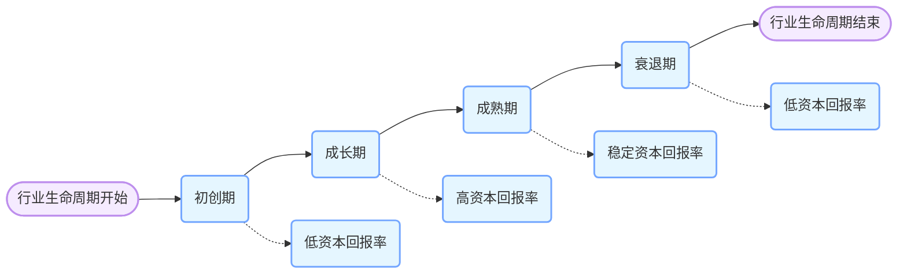

# 彼得林奇对公司资本回报率的行业生命周期调整分析

> 关键词：彼得林奇、资本回报率、行业生命周期、调整分析、投资决策

> 摘要：本文深入探讨了彼得林奇对公司资本回报率进行行业生命周期调整分析的方法和意义。通过详细阐述行业生命周期不同阶段的特点，以及资本回报率在各阶段的表现，分析了如何根据行业特性对资本回报率进行合理调整。这有助于投资者更准确地评估公司的盈利能力和投资价值，为投资决策提供科学依据。同时，结合实际案例和相关数据，展示了该分析方法在实际投资中的应用和效果，最后对未来投资领域的发展趋势和挑战进行了展望。

## 1. 背景介绍 
### 1.1 目的和范围
本研究的目的在于深入剖析彼得林奇所提出的对公司资本回报率进行行业生命周期调整分析的方法及其重要性。通过系统研究，旨在帮助投资者更精准地评估不同行业、不同发展阶段公司的资本回报率，从而做出更明智的投资决策。研究范围涵盖了多个常见行业，分析不同行业在初创期、成长期、成熟期和衰退期等各个阶段的资本回报率特征，并探讨如何进行有效的调整。

### 1.2 预期读者
本文主要面向专业投资者、投资分析师、金融从业者以及对投资领域感兴趣的学者和学生。对于那些希望深入了解投资分析方法，尤其是如何结合行业特性评估公司价值的读者具有较高的参考价值。

### 1.3 文档结构概述
本文将首先介绍相关术语和概念，为后续分析奠定基础。接着阐述核心概念，包括行业生命周期的划分和资本回报率的原理，并通过文本示意图和 Mermaid 流程图进行直观展示。然后详细讲解核心算法原理和具体操作步骤，使用 Python 代码进行说明。之后引入数学模型和公式，结合实际案例进行详细讲解。再通过项目实战，展示代码的实际应用和解读。分析实际应用场景，为投资者提供实际操作的参考。推荐相关的学习资源、开发工具框架和论文著作。最后对未来发展趋势和挑战进行总结，并提供常见问题解答和扩展阅读参考资料。

### 1.4 术语表
#### 1.4.1 核心术语定义
- **资本回报率（Return on Capital，ROC）**：指投出和/或使用资金与相关回报（回报通常表现为获取的利息和/或分得利润）之比例。用于衡量投出资金的使用效果，是评估公司盈利能力的重要指标之一。其计算公式为：$ROC = \frac{息税前利润(EBIT)}{投入资本(IC)}$。
- **行业生命周期**：行业从出现到完全退出社会经济活动所经历的时间。一般分为初创期、成长期、成熟期和衰退期四个阶段，不同阶段具有不同的市场特征和竞争格局。

#### 1.4.2 相关概念解释
- **息税前利润（EBIT）**：是指企业在支付利息和所得税之前的利润。它反映了企业自身的经营盈利能力，不考虑财务杠杆和税收政策的影响。
- **投入资本（IC）**：是指企业在经营活动中所投入的全部资本，包括股权资本和债务资本。它代表了企业用于创造利润的资源总和。

#### 1.4.3 缩略词列表
- **ROC**：Return on Capital，资本回报率
- **EBIT**：Earnings Before Interest and Taxes，息税前利润
- **IC**：Invested Capital，投入资本

## 2. 核心概念与联系 
### 2.1 行业生命周期的划分
行业生命周期通常分为以下四个阶段：
- **初创期**：行业刚刚兴起，技术尚不成熟，市场需求较小，企业数量较少。此时企业面临较高的风险，研发投入大，盈利困难，但具有较大的发展潜力。
- **成长期**：市场需求迅速增长，技术逐渐成熟，企业数量增加，竞争加剧。在这个阶段，企业的销售额和利润快速增长，市场份额逐渐扩大。
- **成熟期**：市场需求趋于稳定，行业竞争格局基本形成，企业数量相对稳定。此时企业的增长速度放缓，盈利能力相对稳定，竞争主要集中在成本控制和市场份额的争夺上。
- **衰退期**：市场需求逐渐减少，行业出现产能过剩，企业利润下降，部分企业开始退出市场。

### 2.2 资本回报率与行业生命周期的关系
在不同的行业生命周期阶段，公司的资本回报率表现出不同的特征：
- **初创期**：由于企业需要大量的研发和市场投入，短期内难以实现盈利，资本回报率通常较低甚至为负。
- **成长期**：随着市场需求的增长和企业规模的扩大，资本回报率逐渐提高，并且可能会超过行业平均水平。
- **成熟期**：市场竞争激烈，企业的增长速度放缓，资本回报率趋于稳定，但可能会受到行业竞争和成本压力的影响。
- **衰退期**：市场需求下降，企业盈利能力减弱，资本回报率逐渐降低。

### 2.3 核心概念原理和架构的文本示意图
```plaintext
行业生命周期
|-- 初创期
|   |-- 技术不成熟
|   |-- 市场需求小
|   |-- 企业数量少
|   |-- 资本回报率低
|-- 成长期
|   |-- 市场需求增长
|   |-- 技术成熟
|   |-- 企业数量增加
|   |-- 资本回报率提高
|-- 成熟期
|   |-- 市场需求稳定
|   |-- 竞争格局形成
|   |-- 企业数量稳定
|   |-- 资本回报率稳定
|-- 衰退期
|   |-- 市场需求减少
|   |-- 产能过剩
|   |-- 企业利润下降
|   |-- 资本回报率降低
```

### 2.4 Mermaid 流程图


## 3. 核心算法原理 & 具体操作步骤 
### 3.1 资本回报率的计算原理
资本回报率（ROC）的计算公式为：
$ROC = \frac{EBIT}{IC}$
其中，$EBIT$ 为息税前利润，$IC$ 为投入资本。

### 3.2 行业生命周期调整分析的算法原理
彼得林奇认为，不同行业在不同生命周期阶段的资本回报率具有不同的合理范围。因此，需要根据行业生命周期对资本回报率进行调整，以更准确地评估公司的盈利能力。具体步骤如下：
1. **确定行业生命周期阶段**：通过分析行业的市场规模、增长率、竞争格局等因素，确定行业所处的生命周期阶段。
2. **获取行业基准资本回报率**：参考行业研究报告、统计数据等，获取该行业在不同生命周期阶段的基准资本回报率。
3. **计算公司实际资本回报率**：根据公司的财务报表，计算公司的实际资本回报率。
4. **进行调整分析**：将公司的实际资本回报率与行业基准资本回报率进行比较，判断公司的盈利能力是否高于或低于行业平均水平。

### 3.3 Python 代码实现
```python
# 定义计算资本回报率的函数
def calculate_roc(ebit, ic):
    """
    计算资本回报率
    :param ebit: 息税前利润
    :param ic: 投入资本
    :return: 资本回报率
    """
    if ic == 0:
        return 0
    return ebit / ic

# 定义行业生命周期阶段
industry_lifecycle_stages = ['初创期', '成长期', '成熟期', '衰退期']

# 定义行业基准资本回报率（示例数据）
benchmark_roc = {
    '初创期': 0.05,
    '成长期': 0.15,
    '成熟期': 0.1,
    '衰退期': 0.03
}

# 示例公司数据
company_ebit = 1000000
company_ic = 5000000
company_industry_stage = '成长期'

# 计算公司实际资本回报率
company_roc = calculate_roc(company_ebit, company_ic)

# 获取行业基准资本回报率
industry_benchmark_roc = benchmark_roc[company_industry_stage]

# 进行调整分析
if company_roc > industry_benchmark_roc:
    print(f"公司资本回报率为 {company_roc * 100:.2f}%，高于行业基准资本回报率 {industry_benchmark_roc * 100:.2f}%，盈利能力较强。")
elif company_roc < industry_benchmark_roc:
    print(f"公司资本回报率为 {company_roc * 100:.2f}%，低于行业基准资本回报率 {industry_benchmark_roc * 100:.2f}%，盈利能力较弱。")
else:
    print(f"公司资本回报率为 {company_roc * 100:.2f}%，与行业基准资本回报率 {industry_benchmark_roc * 100:.2f}% 持平，盈利能力一般。")
```

### 3.4 代码解释
上述代码首先定义了一个计算资本回报率的函数 `calculate_roc`，接受息税前利润和投入资本作为参数，返回资本回报率。然后定义了行业生命周期阶段和行业基准资本回报率的字典。接着，给出了示例公司的财务数据和所处的行业生命周期阶段，计算公司的实际资本回报率，并与行业基准资本回报率进行比较，最后输出分析结果。

## 4. 数学模型和公式 & 详细讲解 & 举例说明 
### 4.1 资本回报率的数学模型
资本回报率（ROC）的数学模型为：
$ROC = \frac{EBIT}{IC}$
其中，$EBIT$ 表示息税前利润，$IC$ 表示投入资本。

### 4.2 行业生命周期调整系数
为了更准确地进行行业生命周期调整分析，可以引入行业生命周期调整系数 $\alpha$。调整后的资本回报率 $ROC_{adjusted}$ 计算公式为：
$ROC_{adjusted} = ROC \times \alpha$
其中，$\alpha$ 根据行业生命周期阶段确定。例如，在初创期，$\alpha$ 可能小于 1，表示初创期公司的资本回报率通常较低；在成长期，$\alpha$ 可能大于 1，表示成长期公司的资本回报率有较高的增长潜力。

### 4.3 举例说明
假设一家公司的息税前利润 $EBIT = 200$ 万元，投入资本 $IC = 1000$ 万元，则该公司的资本回报率为：
$ROC = \frac{200}{1000} = 0.2 = 20\%$
如果该公司所处行业处于成长期，行业生命周期调整系数 $\alpha = 1.2$，则调整后的资本回报率为：
$ROC_{adjusted} = 0.2 \times 1.2 = 0.24 = 24\%$
这表明在考虑行业生命周期因素后，该公司的资本回报率相对更高，具有更好的投资价值。

## 5. 项目实战：代码实际案例和详细解释说明 
### 5.1  开发环境搭建
为了实现彼得林奇对公司资本回报率的行业生命周期调整分析，我们需要搭建以下开发环境：
- **编程语言**：Python 3.x
- **开发工具**：推荐使用 Jupyter Notebook 或 PyCharm 等集成开发环境。
- **所需库**：`pandas` 用于数据处理，`matplotlib` 用于数据可视化。
可以使用以下命令安装所需库：
```sh
pip install pandas matplotlib
```

### 5.2  源代码详细实现和代码解读
```python
import pandas as pd
import matplotlib.pyplot as plt

# 读取公司财务数据文件（假设文件名为 company_financial_data.csv）
data = pd.read_csv('company_financial_data.csv')

# 计算资本回报率
data['ROC'] = data['EBIT'] / data['IC']

# 定义行业生命周期阶段和对应的调整系数
lifecycle_stages = ['初创期', '成长期', '成熟期', '衰退期']
adjustment_factors = [0.8, 1.2, 1.0, 0.6]

# 根据行业生命周期阶段进行调整
def adjust_roc(row):
    stage_index = lifecycle_stages.index(row['Industry_Lifecycle_Stage'])
    return row['ROC'] * adjustment_factors[stage_index]

data['ROC_Adjusted'] = data.apply(adjust_roc, axis=1)

# 可视化调整前后的资本回报率
plt.figure(figsize=(10, 6))
plt.plot(data['Company_Name'], data['ROC'], label='Original ROC')
plt.plot(data['Company_Name'], data['ROC_Adjusted'], label='Adjusted ROC')
plt.xlabel('Company Name')
plt.ylabel('Return on Capital')
plt.title('Comparison of Original and Adjusted ROC')
plt.legend()
plt.xticks(rotation=45)
plt.show()
```

### 5.3  代码解读与分析
1. **数据读取**：使用 `pandas` 库的 `read_csv` 函数读取公司财务数据文件，文件中应包含 `EBIT`（息税前利润）、`IC`（投入资本）和 `Industry_Lifecycle_Stage`（行业生命周期阶段）等列。
2. **资本回报率计算**：根据公式 $ROC = \frac{EBIT}{IC}$ 计算每家公司的资本回报率，并将结果存储在新的列 `ROC` 中。
3. **行业生命周期调整**：定义行业生命周期阶段和对应的调整系数，通过自定义函数 `adjust_roc` 对每家公司的资本回报率进行调整，将调整后的结果存储在新的列 `ROC_Adjusted` 中。
4. **数据可视化**：使用 `matplotlib` 库绘制调整前后的资本回报率折线图，直观展示调整的效果。

通过这个项目实战，我们可以清晰地看到不同公司在考虑行业生命周期因素后资本回报率的变化情况，从而更准确地评估公司的盈利能力和投资价值。

## 6. 实际应用场景 
### 6.1 投资决策
投资者在选择投资标的时，可以使用彼得林奇的行业生命周期调整分析方法来评估公司的资本回报率。通过比较不同公司调整后的资本回报率，选择具有较高盈利能力和增长潜力的公司进行投资。例如，在新兴科技行业的成长期，一些公司的实际资本回报率可能看起来不高，但经过行业生命周期调整后，其投资价值可能会凸显出来。

### 6.2 行业分析
分析师可以利用该方法对不同行业进行分析，了解各行业在不同生命周期阶段的资本回报率特征。这有助于发现行业的发展趋势和潜在机会，为行业研究和投资策略制定提供依据。例如，通过对比传统制造业和新兴服务业在成熟期的资本回报率调整情况，可以判断哪个行业更具投资吸引力。

### 6.3 公司战略规划
公司管理层可以运用该方法评估自身在行业中的竞争力和盈利能力。根据调整后的资本回报率，制定合理的战略规划，如在成长期加大投资以扩大市场份额，在衰退期进行业务转型或收缩等。例如，一家处于成熟期的传统零售公司，如果发现自身调整后的资本回报率低于行业平均水平，可以考虑拓展线上业务或进行多元化经营。

## 7. 工具和资源推荐
### 7.1 学习资源推荐
#### 7.1.1 书籍推荐
- 《彼得林奇的成功投资》：彼得林奇的经典著作，详细介绍了他的投资理念和方法，包括对公司基本面的分析和行业研究。
- 《聪明的投资者》：本杰明·格雷厄姆的代表作，阐述了价值投资的基本原理和方法，对投资者具有重要的指导意义。
- 《财务报表分析与证券定价》：全面介绍了财务报表分析的方法和技巧，以及如何运用财务数据进行证券定价和投资决策。

#### 7.1.2 在线课程
- Coursera 上的“投资学原理”课程：由知名教授授课，系统介绍投资学的基本理论和方法，包括资产定价、投资组合管理等内容。
- 网易云课堂的“财务分析实战”课程：结合实际案例，讲解财务报表分析的方法和技巧，帮助学员掌握财务分析的核心要点。

#### 7.1.3 技术博客和网站
- 雪球网：国内知名的投资交流平台，提供大量的公司研究报告、投资策略分享和市场分析文章。
- Seeking Alpha：国外知名的财经网站，汇聚了众多投资专家和分析师的观点和研究报告，对全球市场和行业动态有深入的分析。

### 7.2 开发工具框架推荐
#### 7.2.1 IDE和编辑器
- Jupyter Notebook：一种交互式的开发环境，适合数据探索和分析，支持多种编程语言，方便代码的编写和调试。
- PyCharm：专业的 Python 集成开发环境，具有强大的代码编辑、调试和自动补全功能，提高开发效率。

#### 7.2.2 调试和性能分析工具
- `pdb`：Python 内置的调试工具，可用于调试 Python 代码，帮助定位和解决代码中的问题。
- `cProfile`：Python 标准库中的性能分析工具，可用于分析代码的执行时间和性能瓶颈，优化代码性能。

#### 7.2.3 相关框架和库
- `pandas`：强大的数据处理和分析库，提供了丰富的数据结构和函数，方便进行数据清洗、转换和分析。
- `numpy`：Python 科学计算的基础库，提供了高效的多维数组对象和数学函数，用于数值计算和数据分析。

### 7.3 相关论文著作推荐
#### 7.3.1 经典论文
- Fama, E. F., & French, K. R. (1992). The cross-section of expected stock returns. The Journal of Finance, 47(2), 427-465. 该论文提出了著名的 Fama-French 三因子模型，对股票预期收益率的横截面进行了深入研究。
- Modigliani, F., & Miller, M. H. (1958). The cost of capital, corporation finance and the theory of investment. The American Economic Review, 48(3), 261-297. 这篇论文奠定了现代资本结构理论的基础，提出了著名的 MM 定理。

#### 7.3.2 最新研究成果
- 关注顶级金融学术期刊，如 The Journal of Finance、The Review of Financial Studies 等，及时了解行业生命周期和资本回报率相关的最新研究成果。

#### 7.3.3 应用案例分析
- 一些专业的金融研究机构和咨询公司会发布关于行业分析和投资案例的报告，如麦肯锡、波士顿咨询等公司的研究报告，可从中获取实际应用案例和分析方法。

## 8. 总结：未来发展趋势与挑战
### 8.1 未来发展趋势
- **数字化和智能化**：随着信息技术的快速发展，投资分析将越来越依赖于大数据、人工智能和机器学习等技术。通过对海量数据的分析和挖掘，可以更准确地评估行业生命周期和公司资本回报率，提高投资决策的效率和准确性。
- **跨行业融合**：不同行业之间的界限越来越模糊，跨行业融合的趋势日益明显。投资者需要更加关注行业的交叉点和新兴领域，运用综合的分析方法评估公司的投资价值。
- **可持续投资**：社会对环境保护、社会责任和公司治理（ESG）的关注度不断提高，可持续投资将成为未来投资的重要方向。在评估公司资本回报率时，需要考虑 ESG 因素对公司长期发展的影响。

### 8.2 挑战
- **数据质量和可靠性**：投资分析依赖于大量的数据，但数据的质量和可靠性存在差异。不准确或不完整的数据可能导致分析结果的偏差，影响投资决策的正确性。
- **行业变化的不确定性**：行业生命周期的划分并不是绝对的，行业发展受到多种因素的影响，如技术创新、政策法规、市场需求等，这些因素的变化具有不确定性，增加了行业生命周期判断和资本回报率调整的难度。
- **模型的局限性**：目前的行业生命周期调整分析方法和模型存在一定的局限性，不能完全准确地反映公司的实际情况。投资者需要结合多种分析方法和主观判断，综合评估公司的投资价值。

## 9. 附录：常见问题与解答
### 9.1 如何准确判断行业所处的生命周期阶段？
可以从多个方面进行判断，如市场规模的增长率、行业内企业的数量和竞争格局、技术创新的程度等。同时，参考行业研究报告和专家意见也是很有帮助的。

### 9.2 行业基准资本回报率是如何确定的？
行业基准资本回报率可以通过收集行业内多家公司的财务数据进行统计分析得到，也可以参考行业研究机构发布的报告和数据。

### 9.3 调整系数的取值有什么依据？
调整系数的取值通常根据行业的特点和经验来确定。一般来说，初创期的调整系数小于 1，成长期的调整系数大于 1，成熟期的调整系数接近 1，衰退期的调整系数小于 1。但具体取值需要结合行业实际情况进行调整。

### 9.4 该分析方法适用于所有行业吗？
该分析方法适用于大多数行业，但对于一些特殊行业，如新兴的高科技行业或受政策影响较大的行业，可能需要进行适当的调整和改进。

## 10. 扩展阅读 & 参考资料
### 10.1 扩展阅读
- 《金融炼金术》：乔治·索罗斯的著作，介绍了他的投资哲学和反身性理论，对投资者的思维方式有很大的启发。
- 《邓普顿教你逆向投资》：讲述了约翰·邓普顿的逆向投资策略，如何在市场低迷时寻找投资机会。

### 10.2 参考资料
- 各公司的财务报表和年报，可从证券交易所网站或公司官方网站获取。
- 行业研究报告，如艾瑞咨询、易观智库等机构发布的报告。
- 相关学术论文，可通过学术数据库如知网、万方、Web of Science 等进行检索。

作者：AI天才研究院/AI Genius Institute & 禅与计算机程序设计艺术 /Zen And The Art of Computer Programming