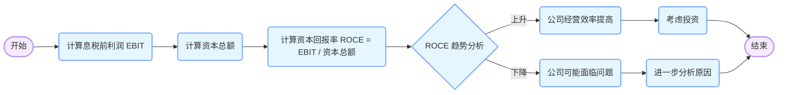

# 彼得林奇对公司资本回报率趋势的分析

> 关键词：彼得林奇、资本回报率、公司分析、趋势分析、投资策略

> 摘要：本文深入探讨了彼得林奇对公司资本回报率趋势的分析方法与理念。资本回报率是评估公司经营效率和盈利能力的关键指标，彼得林奇通过对其趋势的研究来筛选具有投资价值的公司。文章详细阐述了资本回报率的核心概念、相关算法原理、数学模型，结合实际案例进行分析，并介绍了在不同实际应用场景中的运用。同时，提供了学习资本回报率分析所需的工具和资源推荐，最后总结了该分析方法的未来发展趋势与挑战，为投资者和相关从业者提供了全面而深入的参考。

## 1. 背景介绍 
### 1.1 目的和范围
本文旨在全面剖析彼得林奇对公司资本回报率趋势的分析方法和理念。通过研究彼得林奇的投资智慧，我们可以更好地理解如何利用资本回报率这一重要指标来评估公司的经营状况和投资价值。范围涵盖了资本回报率的基本概念、计算方法、趋势分析的要点，以及如何将这些分析应用于实际的投资决策中。

### 1.2 预期读者
本文预期读者包括股票投资者、金融分析师、投资顾问以及对价值投资感兴趣的人士。无论是专业的金融从业者还是普通的个人投资者，都可以从彼得林奇的分析方法中获得有益的启示，提升自己的投资分析能力。

### 1.3 文档结构概述
本文首先介绍资本回报率的核心概念及其与公司经营的联系，通过文本示意图和Mermaid流程图进行直观展示。接着阐述资本回报率的核心算法原理，并给出具体的Python代码实现。然后讲解相关的数学模型和公式，并通过举例进行详细说明。之后通过项目实战，给出实际案例并对代码进行详细解读。再探讨资本回报率趋势分析在实际投资场景中的应用。随后推荐学习该分析方法所需的工具和资源。最后总结未来发展趋势与挑战，并提供常见问题解答和扩展阅读参考资料。

### 1.4 术语表
#### 1.4.1 核心术语定义
- **资本回报率（Return on Capital Employed，ROCE）**：是指公司运用资本所获得的回报，它衡量了公司利用投入资本产生利润的效率。计算公式为：$ROCE = \frac{息税前利润（EBIT）}{资本总额}$。
- **息税前利润（Earnings Before Interest and Taxes，EBIT）**：是指企业在支付利息和所得税之前的利润，它反映了企业经营活动的盈利能力，不考虑企业的融资结构和税收政策的影响。
- **资本总额**：通常是指企业长期投入的资本，包括股东权益和长期负债。

#### 1.4.2 相关概念解释
- **趋势分析**：通过观察资本回报率在一段时间内的变化情况，判断公司经营效率的发展方向。如果资本回报率呈现上升趋势，说明公司的经营效率在提高；反之，如果呈现下降趋势，则可能意味着公司面临一些问题。
- **投资价值**：根据资本回报率等指标评估公司是否值得投资。具有较高且稳定增长的资本回报率的公司通常被认为具有较高的投资价值。

#### 1.4.3 缩略词列表
- ROCE：Return on Capital Employed（资本回报率）
- EBIT：Earnings Before Interest and Taxes（息税前利润）

## 2. 核心概念与联系 

### 核心概念原理
资本回报率（ROCE）是评估公司经营效率和盈利能力的重要指标。它反映了公司每投入一单位资本所能获得的利润。较高的资本回报率意味着公司能够有效地利用其资本，创造出更多的利润。

公司的资本回报率受到多个因素的影响，包括公司的业务模式、市场竞争力、成本控制能力等。一个具有良好业务模式的公司，能够在市场上获得较高的定价权，从而提高其息税前利润，进而提高资本回报率。同时，有效的成本控制也能够降低公司的运营成本，增加利润，提高资本回报率。

### 架构的文本示意图
```plaintext
资本回报率（ROCE）
|
|-- 分子：息税前利润（EBIT）
|   |-- 销售收入
|   |   |-- 产品或服务价格
|   |   |-- 销售数量
|   |-- 成本
|       |-- 原材料成本
|       |-- 人工成本
|       |-- 制造费用
|       |-- 销售费用
|       |-- 管理费用
|
|-- 分母：资本总额
    |-- 股东权益
    |   |-- 股本
    |   |-- 留存收益
    |-- 长期负债
        |-- 银行贷款
        |-- 债券发行
```

### Mermaid流程图


## 3. 核心算法原理 & 具体操作步骤 

### 核心算法原理
资本回报率（ROCE）的计算基于以下公式：

$ROCE = \frac{EBIT}{资本总额}$

其中，$EBIT$ 为息税前利润，资本总额通常是股东权益和长期负债之和。

### 具体操作步骤
1. **获取财务数据**：从公司的财务报表中获取息税前利润（EBIT）和资本总额的数据。这些数据通常可以在公司的年度报告、季度报告中找到。
2. **计算资本回报率**：将息税前利润除以资本总额，得到资本回报率。
3. **趋势分析**：观察资本回报率在多个期间（如多年）的变化情况，判断其趋势是上升、下降还是保持稳定。

### Python源代码实现
```python
import pandas as pd

# 假设我们有一个包含公司财务数据的DataFrame
# 列名分别为 'EBIT'（息税前利润）和 'Capital'（资本总额）
data = {
    'Year': [2018, 2019, 2020, 2021, 2022],
    'EBIT': [100, 120, 130, 150, 160],
    'Capital': [500, 550, 600, 650, 700]
}
df = pd.DataFrame(data)

# 计算资本回报率
df['ROCE'] = df['EBIT'] / df['Capital']

# 打印结果
print(df[['Year', 'ROCE']])

# 趋势分析：判断ROCE是上升、下降还是稳定
if df['ROCE'].is_monotonic_increasing:
    print("资本回报率呈上升趋势")
elif df['ROCE'].is_monotonic_decreasing:
    print("资本回报率呈下降趋势")
else:
    print("资本回报率趋势不稳定")
```

### 代码解释
1. **数据准备**：创建一个包含年份、息税前利润和资本总额的DataFrame。
2. **计算资本回报率**：使用 `df['ROCE'] = df['EBIT'] / df['Capital']` 计算每一年的资本回报率。
3. **趋势分析**：使用 `is_monotonic_increasing` 和 `is_monotonic_decreasing` 方法判断资本回报率的趋势。

## 4. 数学模型和公式 & 详细讲解 & 举例说明 

### 数学模型和公式
资本回报率（ROCE）的计算公式为：

$$ROCE = \frac{EBIT}{资本总额}$$

其中，$EBIT$ 表示息税前利润，资本总额通常为股东权益和长期负债之和。

### 详细讲解
- **分子（EBIT）**：息税前利润是公司在支付利息和所得税之前的利润。它反映了公司经营活动的盈利能力，不考虑公司的融资结构和税收政策的影响。较高的 $EBIT$ 意味着公司的经营活动能够产生更多的利润。
- **分母（资本总额）**：资本总额是公司长期投入的资本，包括股东权益和长期负债。它代表了公司用于经营活动的资源总量。分母越大，说明公司投入的资本越多，需要产生更多的利润才能获得较高的资本回报率。

### 举例说明
假设公司A在2022年的息税前利润（EBIT）为200万元，资本总额为1000万元。则该公司2022年的资本回报率为：

$$ROCE = \frac{200}{1000} = 0.2 = 20\%$$

这意味着公司A每投入1元资本，能够获得0.2元的回报。如果公司A在2021年的资本回报率为18%，则说明公司的经营效率在提高，利用资本创造利润的能力增强。

再假设公司B在2022年的息税前利润为150万元，资本总额为1200万元。则公司B的资本回报率为：

$$ROCE = \frac{150}{1200} = 0.125 = 12.5\%$$

与公司A相比，公司B的资本回报率较低，说明公司B在利用资本创造利润方面的效率不如公司A。投资者在选择投资对象时，通常会更倾向于资本回报率较高且趋势向好的公司。

## 5. 项目实战：代码实际案例和详细解释说明 

### 5.1  开发环境搭建
- **Python环境**：推荐使用Python 3.7及以上版本。可以从Python官方网站（https://www.python.org/downloads/）下载并安装。
- **开发工具**：可以使用Jupyter Notebook、PyCharm等开发工具。Jupyter Notebook适合交互式开发和数据分析，PyCharm则是一个功能强大的Python集成开发环境。
- **所需库**：需要安装 `pandas` 库用于数据处理和分析。可以使用以下命令进行安装：
```sh
pip install pandas
```

### 5.2  源代码详细实现和代码解读
```python
import pandas as pd

# 模拟从CSV文件中读取公司财务数据
# 假设CSV文件名为 'company_financials.csv'，包含 'Year'、'EBIT' 和 'Capital' 三列
file_path = 'company_financials.csv'
try:
    df = pd.read_csv(file_path)
except FileNotFoundError:
    print(f"文件 {file_path} 未找到，请检查文件路径。")
    exit(1)

# 计算资本回报率
df['ROCE'] = df['EBIT'] / df['Capital']

# 趋势分析：计算ROCE的年度变化率
df['ROCE_Change'] = df['ROCE'].pct_change()

# 找出ROCE上升幅度最大的年份
max_increase_year = df[df['ROCE_Change'] == df['ROCE_Change'].max()]['Year'].values[0]
max_increase_rate = df['ROCE_Change'].max()

# 找出ROCE下降幅度最大的年份
max_decrease_year = df[df['ROCE_Change'] == df['ROCE_Change'].min()]['Year'].values[0]
max_decrease_rate = df['ROCE_Change'].min()

# 打印结果
print("资本回报率计算结果：")
print(df[['Year', 'ROCE', 'ROCE_Change']])
print(f"ROCE上升幅度最大的年份：{max_increase_year}，上升幅度：{max_increase_rate * 100:.2f}%")
print(f"ROCE下降幅度最大的年份：{max_decrease_year}，下降幅度：{max_decrease_rate * 100:.2f}%")
```

### 代码解读与分析
1. **数据读取**：使用 `pd.read_csv` 函数从CSV文件中读取公司的财务数据。如果文件不存在，会输出错误信息并退出程序。
2. **计算资本回报率**：通过 `df['ROCE'] = df['EBIT'] / df['Capital']` 计算每一年的资本回报率。
3. **趋势分析**：使用 `pct_change` 方法计算资本回报率的年度变化率，并将结果存储在 `ROCE_Change` 列中。
4. **找出最大上升和下降年份**：使用条件筛选找出资本回报率上升幅度最大和下降幅度最大的年份，并打印相关信息。

通过这个项目实战，我们可以更深入地了解公司资本回报率的变化趋势，为投资决策提供更有价值的参考。

## 6. 实际应用场景 
### 股票投资决策
投资者在选择股票时，可以使用资本回报率趋势分析来评估公司的投资价值。具有较高且稳定上升的资本回报率的公司通常意味着其经营效率高、盈利能力强，更有可能为投资者带来良好的回报。例如，彼得林奇在投资过程中，会重点关注那些资本回报率持续上升的公司，认为这些公司具有更大的成长潜力。

### 公司战略规划
公司管理层可以通过分析资本回报率趋势来评估公司的经营策略是否有效。如果资本回报率呈现下降趋势，管理层需要深入分析原因，可能是市场竞争加剧、成本控制不力等问题，从而及时调整战略，提高公司的经营效率。

### 行业比较分析
在进行行业研究时，资本回报率趋势分析可以帮助投资者和分析师比较不同公司在同一行业中的竞争力。不同行业的资本回报率水平可能存在差异，但在同一行业内，资本回报率较高且趋势向好的公司通常具有更强的市场竞争力。

### 并购和重组决策
在进行并购和重组时，收购方可以通过分析目标公司的资本回报率趋势来评估其价值和潜力。如果目标公司的资本回报率较低但有上升趋势，可能意味着该公司具有被改善和提升的空间，通过整合资源和优化经营，有望提高其资本回报率。

## 7. 工具和资源推荐
### 7.1 学习资源推荐
#### 7.1.1 书籍推荐
- 《彼得·林奇的成功投资》（*One Up On Wall Street*）：彼得·林奇的经典著作，详细介绍了他的投资理念和方法，包括如何通过分析公司的财务指标来选择股票。
- 《财务报表分析与证券定价》（*Financial Statement Analysis and Security Valuation*）：这本书深入讲解了如何通过财务报表分析来评估公司的价值，其中包括对资本回报率等指标的详细分析。
- 《聪明的投资者》（*The Intelligent Investor*）：本杰明·格雷厄姆的经典著作，强调了价值投资的重要性，对投资者理解公司基本面分析和资本回报率的意义有很大帮助。

#### 7.1.2 在线课程
- Coursera上的“财务分析与决策”课程：由知名高校教授授课，系统介绍了财务分析的方法和技巧，包括资本回报率的计算和分析。
- edX上的“投资学原理”课程：涵盖了投资领域的基础知识和分析方法，对理解资本回报率在投资决策中的应用有很大帮助。

#### 7.1.3 技术博客和网站
- Seeking Alpha：一个提供金融分析和投资建议的网站，有很多关于公司财务分析和资本回报率的文章和研究报告。
- Motley Fool：专注于投资教育和股票分析，提供了丰富的投资知识和案例分析，包括对资本回报率的解读。

### 7.2 开发工具框架推荐
#### 7.2.1 IDE和编辑器
- Jupyter Notebook：适合进行数据分析和交互式编程，方便对财务数据进行处理和可视化。
- PyCharm：功能强大的Python集成开发环境，提供了丰富的代码编辑、调试和分析功能。

#### 7.2.2 调试和性能分析工具
- IPython：增强的Python交互式解释器，提供了强大的调试和分析功能，方便对代码进行调试和优化。
- Pandas Profiling：可以快速生成数据的详细报告，包括数据的基本信息、统计分析、相关性分析等，有助于对财务数据进行初步探索和分析。

#### 7.2.3 相关框架和库
- Pandas：用于数据处理和分析的Python库，提供了丰富的数据结构和方法，方便对财务数据进行读取、清洗、计算和分析。
- Matplotlib和Seaborn：用于数据可视化的Python库，可以将资本回报率的趋势数据以图表的形式直观展示出来，便于分析和理解。

### 7.3 相关论文著作推荐
#### 7.3.1 经典论文
- “The Relationship between Return on Capital Employed and Stock Returns”：研究了资本回报率与股票回报率之间的关系，为投资者提供了重要的理论依据。
- “Financial Ratios and the Probabilistic Prediction of Bankruptcy”：探讨了财务比率（包括资本回报率）在预测公司破产风险方面的应用。

#### 7.3.2 最新研究成果
- 关注顶级金融学术期刊，如《Journal of Finance》《Review of Financial Studies》等，这些期刊经常发表关于公司财务分析和资本回报率的最新研究成果。

#### 7.3.3 应用案例分析
- 可以参考一些专业的金融研究机构发布的报告，如麦肯锡、波士顿咨询等，这些报告通常包含了大量的公司案例分析，展示了资本回报率在实际投资和企业决策中的应用。

## 8. 总结：未来发展趋势与挑战
### 未来发展趋势
- **数字化分析工具的应用**：随着科技的发展，越来越多的数字化分析工具将被应用于资本回报率的分析中。例如，人工智能和机器学习算法可以帮助投资者更快速、准确地分析大量的财务数据，挖掘潜在的投资机会。
- **综合指标分析**：未来，投资者可能会更加注重综合指标的分析，将资本回报率与其他指标（如现金流、市场份额等）相结合，以更全面地评估公司的投资价值。
- **行业细分和个性化分析**：不同行业的资本回报率水平和影响因素可能存在差异，未来的分析将更加注重行业细分和个性化。投资者需要根据不同行业的特点，制定更适合的分析方法和投资策略。

### 挑战
- **数据质量和可靠性**：资本回报率的分析依赖于准确的财务数据，但财务数据可能存在造假、误差等问题，影响分析结果的可靠性。投资者需要加强对数据质量的审核和验证。
- **宏观经济环境的不确定性**：宏观经济环境的变化（如利率波动、通货膨胀等）会对公司的资本回报率产生影响。投资者需要考虑宏观经济因素的不确定性，制定相应的风险管理策略。
- **新兴行业的分析难度**：随着新兴行业的不断涌现，如人工智能、区块链等，这些行业的商业模式和财务特征与传统行业有很大差异，对资本回报率的分析带来了挑战。投资者需要不断学习和探索新的分析方法。

## 9. 附录：常见问题与解答
### 问题1：资本回报率和净资产收益率（ROE）有什么区别？
答：资本回报率（ROCE）考虑了公司的全部资本（包括股东权益和长期负债），反映了公司利用所有投入资本创造利润的效率。而净资产收益率（ROE）只考虑股东权益，衡量的是股东投入资本的回报水平。ROCE更全面地反映了公司的经营效率，而ROE更侧重于股东权益的回报。

### 问题2：资本回报率的合理范围是多少？
答：资本回报率的合理范围因行业而异。一般来说，具有较高进入壁垒和竞争优势的行业，资本回报率可能会相对较高。例如，一些垄断性行业的资本回报率可能在20%以上，而一些竞争激烈的传统行业的资本回报率可能在10% - 15%左右。投资者在分析时，应该将公司的资本回报率与同行业的平均水平进行比较。

### 问题3：资本回报率下降一定意味着公司经营不善吗？
答：不一定。资本回报率下降可能是由多种原因引起的，如公司进行大规模的投资扩张、市场竞争加剧、行业周期波动等。投资者需要深入分析下降的原因，结合公司的战略规划和未来发展前景进行综合判断。

### 问题4：如何获取公司的财务数据来计算资本回报率？
答：可以通过以下途径获取公司的财务数据：
- 公司的官方网站：通常会公布年度报告、季度报告等财务信息。
- 证券交易所网站：可以查询上市公司的财务报表。
- 金融数据提供商：如Wind、东方财富等，提供了丰富的金融数据和分析工具。

## 10. 扩展阅读 & 参考资料
### 扩展阅读
- 《巴菲特致股东的信：股份公司教程》（*The Essays of Warren Buffett: Lessons for Corporate America*）：巴菲特的信件中包含了很多关于公司基本面分析和投资决策的智慧，对理解资本回报率的应用有很大帮助。
- 《价值投资实战手册》：详细介绍了价值投资的方法和实践，包括如何通过分析财务指标来评估公司的价值。

### 参考资料
- 彼得·林奇. 《彼得·林奇的成功投资》. 机械工业出版社.
- 斯蒂芬·佩因曼. 《财务报表分析与证券定价》. 中国财政经济出版社.
- 本杰明·格雷厄姆. 《聪明的投资者》. 人民邮电出版社.

作者：AI天才研究院/AI Genius Institute & 禅与计算机程序设计艺术 /Zen And The Art of Computer Programming