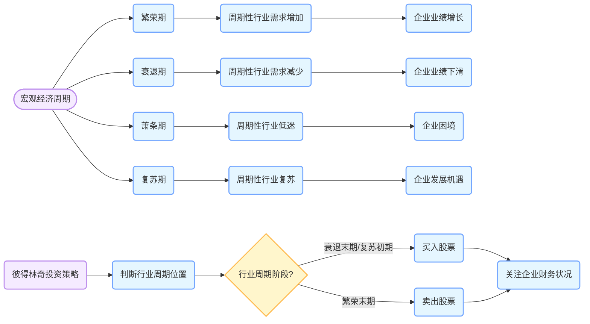

# 彼得林奇对周期性行业的投资策略

> 关键词：彼得林奇、周期性行业、投资策略、行业分析、财务分析

> 摘要：本文深入探讨了彼得林奇对周期性行业的投资策略。彼得林奇作为投资界的传奇人物，其对周期性行业的投资见解和方法具有极高的参考价值。文章从背景介绍入手，阐述了相关概念和术语，详细剖析了核心概念与联系，介绍了核心算法原理及具体操作步骤，结合数学模型和公式进行讲解，通过项目实战案例进行代码分析，探讨了实际应用场景，推荐了学习工具和资源，最后总结了未来发展趋势与挑战，并提供常见问题解答和扩展阅读资料，旨在帮助投资者更好地理解和运用彼得林奇的投资策略在周期性行业中获取收益。

## 1. 背景介绍 
### 1.1 目的和范围
本文的目的是全面深入地研究彼得林奇针对周期性行业所提出的投资策略。通过对其策略的详细解读和分析，帮助投资者更好地理解周期性行业的特点和投资规律，从而在投资决策中做出更为明智的选择。研究范围涵盖了彼得林奇投资策略的各个方面，包括对周期性行业的识别、行业周期的判断、公司财务分析、估值方法以及具体的投资时机选择等。

### 1.2 预期读者
本文的预期读者主要包括对投资领域感兴趣的个人投资者、金融专业学生、投资机构从业者以及对彼得林奇投资理念有研究需求的人士。无论你是投资新手，希望通过学习彼得林奇的策略来入门周期性行业投资，还是有一定经验的投资者，想要进一步优化自己的投资方法，本文都将为你提供有价值的参考。

### 1.3 文档结构概述
本文将按照以下结构进行阐述：首先介绍核心概念与联系，明确周期性行业等相关概念；接着讲解核心算法原理和具体操作步骤，包括如何运用相关指标进行分析；然后通过数学模型和公式对投资策略进行量化分析；之后通过项目实战案例展示如何在实际中运用这些策略；再探讨实际应用场景，说明这些策略在不同情况下的适用性；随后推荐学习所需的工具和资源；最后总结未来发展趋势与挑战，解答常见问题并提供扩展阅读资料。

### 1.4 术语表
#### 1.4.1 核心术语定义
- **周期性行业**：指那些经营业绩随着经济周期的涨缩而变动的行业。在经济繁荣时期，这些行业的业务量和利润通常会大幅增长；而在经济衰退时期，业务量和利润则会显著下降。例如钢铁、汽车、化工等行业。
- **市盈率（P/E）**：是指股票价格除以每股收益（EPS）的比率。它反映了市场对公司盈利的预期和估值水平。计算公式为：$P/E=\frac{股价}{每股收益}$。
- **市净率（P/B）**：是指每股股价与每股净资产的比率。它衡量了市场对公司净资产的估值情况。计算公式为：$P/B=\frac{股价}{每股净资产}$。
- **行业周期**：周期性行业所经历的从繁荣到衰退再到复苏的循环过程。一般可分为繁荣期、衰退期、萧条期和复苏期四个阶段。

#### 1.4.2 相关概念解释
- **经济周期**：经济活动沿着经济发展的总体趋势所经历的有规律的扩张和收缩。通常包括繁荣、衰退、萧条和复苏四个阶段，是影响周期性行业发展的重要宏观因素。
- **财务杠杆**：指企业通过债务融资来增加投资回报率的一种方式。合理运用财务杠杆可以提高企业的盈利能力，但同时也会增加企业的财务风险。
- **行业竞争格局**：指行业内各企业之间的竞争关系和市场份额分布情况。了解行业竞争格局有助于判断企业在行业中的地位和竞争力。

#### 1.4.3 缩略词列表
- **EPS**：Earnings Per Share，每股收益。
- **P/E**：Price-to-Earnings Ratio，市盈率。
- **P/B**：Price-to-Book Ratio，市净率。

## 2. 核心概念与联系 

### 周期性行业的特点
周期性行业的核心特点在于其业绩与宏观经济周期密切相关。在经济繁荣阶段，市场需求旺盛，企业的产品或服务销售量大幅增加，价格也可能随之上涨，从而带动企业利润的快速增长。例如，在房地产市场繁荣时期，钢铁行业的需求会大幅上升，因为建筑工程需要大量的钢铁材料。钢铁企业的订单增多，产能利用率提高，利润也会相应增加。

相反，在经济衰退阶段，市场需求萎缩，企业的产品或服务销售量下降，价格可能下跌，导致企业利润减少甚至出现亏损。以汽车行业为例，当经济不景气时，消费者的购买能力下降，对汽车的需求减少，汽车制造商的销售额和利润都会受到影响。

### 彼得林奇投资策略的核心要点
彼得林奇认为，投资周期性行业的关键在于准确判断行业周期的位置。他强调要关注行业的供需关系、库存水平、产能利用率等指标，以此来判断行业是处于繁荣期、衰退期还是复苏期。

在投资时机的选择上，彼得林奇主张在行业处于衰退末期或复苏初期时买入股票，因为此时股票价格通常较低，而随着行业的复苏和繁荣，股票价格有望大幅上涨。在行业处于繁荣末期时卖出股票，以避免在行业衰退时遭受损失。

此外，彼得林奇还注重对企业财务状况的分析。他认为，即使是在周期性行业中，财务状况良好、具有较强竞争力的企业也更有可能在行业低谷中生存下来，并在行业复苏时获得更大的发展。

### 核心概念的架构示意图


## 3. 核心算法原理 & 具体操作步骤 

### 核心算法原理
彼得林奇在投资周期性行业时，主要运用了一些基本的财务指标和数据分析方法来评估企业的价值和判断行业周期。以下是一些核心算法原理的Python实现示例。

#### 市盈率（P/E）计算
```python
def calculate_pe(stock_price, eps):
    """
    计算市盈率
    :param stock_price: 股票价格
    :param eps: 每股收益
    :return: 市盈率
    """
    if eps == 0:
        return None
    return stock_price / eps

# 示例数据
stock_price = 50
eps = 5
pe_ratio = calculate_pe(stock_price, eps)
print(f"市盈率: {pe_ratio}")
```
#### 市净率（P/B）计算
```python
def calculate_pb(stock_price, book_value_per_share):
    """
    计算市净率
    :param stock_price: 股票价格
    :param book_value_per_share: 每股净资产
    :return: 市净率
    """
    if book_value_per_share == 0:
        return None
    return stock_price / book_value_per_share

# 示例数据
stock_price = 50
book_value_per_share = 10
pb_ratio = calculate_pb(stock_price, book_value_per_share)
print(f"市净率: {pb_ratio}")
```

### 具体操作步骤
#### 步骤1：识别周期性行业
首先，投资者需要识别出哪些行业属于周期性行业。这可以通过研究行业的历史数据和与宏观经济的相关性来判断。一般来说，工业、原材料、金融、房地产等行业通常具有较强的周期性。

#### 步骤2：分析行业周期
通过关注行业的供需关系、库存水平、产能利用率等指标，判断行业目前处于周期的哪个阶段。例如，当行业库存水平下降、产能利用率提高时，可能意味着行业正处于复苏期；而当库存水平上升、产能利用率下降时，可能表示行业正进入衰退期。

#### 步骤3：筛选优质企业
在确定行业处于合适的投资阶段后，需要筛选出行业内财务状况良好、具有较强竞争力的企业。可以通过分析企业的财务报表，如资产负债表、利润表和现金流量表，评估企业的盈利能力、偿债能力和运营能力。

#### 步骤4：估值分析
运用市盈率、市净率等指标对筛选出的企业进行估值分析，判断股票价格是否合理。一般来说，较低的市盈率和市净率可能意味着股票被低估，具有投资价值。

#### 步骤5：确定投资时机
根据行业周期和企业估值情况，确定投资时机。在行业处于衰退末期或复苏初期，且企业估值合理时买入股票；在行业处于繁荣末期，且股票价格过高时卖出股票。

## 4. 数学模型和公式 & 详细讲解 & 举例说明 

### 市盈率模型
市盈率（P/E）是衡量股票估值的常用指标之一。其计算公式为：
$$P/E=\frac{股价}{每股收益}$$
市盈率反映了市场对公司盈利的预期和估值水平。一般来说，较低的市盈率可能意味着股票被低估，具有投资价值；而较高的市盈率可能表示股票被高估，投资风险较大。

例如，假设某股票的价格为50元，每股收益为5元，则该股票的市盈率为：
$$P/E=\frac{50}{5}=10$$
这意味着投资者为了获得该公司每股1元的收益，愿意支付10元的价格。

### 市净率模型
市净率（P/B）是另一个重要的估值指标。其计算公式为：
$$P/B=\frac{股价}{每股净资产}$$
市净率衡量了市场对公司净资产的估值情况。较低的市净率可能表示股票被低估，具有投资价值；而较高的市净率可能意味着股票被高估。

例如，假设某股票的价格为50元，每股净资产为10元，则该股票的市净率为：
$$P/B=\frac{50}{10}=5$$
这表明投资者为了获得该公司每股1元的净资产，愿意支付5元的价格。

### 盈利增长率模型
盈利增长率是评估企业成长能力的重要指标。其计算公式为：
$$盈利增长率=\frac{本期净利润 - 上期净利润}{上期净利润}\times100\%$$
盈利增长率越高，说明企业的盈利能力越强，成长潜力越大。

例如，某公司上期净利润为100万元，本期净利润为120万元，则该公司的盈利增长率为：
$$盈利增长率=\frac{120 - 100}{100}\times100\% = 20\%$$

### 举例说明
假设我们要分析一家钢铁企业的投资价值。通过研究该企业的财务报表，我们得到以下数据：
- 股票价格：20元
- 每股收益：2元
- 每股净资产：10元
- 上期净利润：1000万元
- 本期净利润：1200万元

首先，计算该股票的市盈率和市净率：
- 市盈率：$P/E=\frac{20}{2}=10$
- 市净率：$P/B=\frac{20}{10}=2$

然后，计算该企业的盈利增长率：
$$盈利增长率=\frac{1200 - 1000}{1000}\times100\% = 20\%$$

通过与同行业其他企业的指标进行比较，我们可以判断该股票的估值是否合理，以及该企业的成长能力如何。如果该企业的市盈率和市净率低于同行业平均水平，且盈利增长率高于同行业平均水平，则该股票可能具有投资价值。

## 5. 项目实战：代码实际案例和详细解释说明 

### 5.1  开发环境搭建
为了实现彼得林奇投资策略的项目实战，我们需要搭建以下开发环境：
- **Python环境**：建议使用Python 3.7及以上版本。可以从Python官方网站（https://www.python.org/downloads/）下载并安装。
- **开发工具**：推荐使用PyCharm作为开发工具，它具有强大的代码编辑、调试和项目管理功能。可以从JetBrains官方网站（https://www.jetbrains.com/pycharm/download/）下载并安装。
- **相关库**：需要安装一些Python库，如pandas、numpy、matplotlib等，用于数据处理、分析和可视化。可以使用以下命令进行安装：
```sh
pip install pandas numpy matplotlib
```

### 5.2  源代码详细实现和代码解读
以下是一个简单的Python代码示例，用于分析周期性行业企业的财务数据并进行投资决策。

```python
import pandas as pd
import matplotlib.pyplot as plt

# 模拟企业财务数据
data = {
    '年份': [2016, 2017, 2018, 2019, 2020],
    '每股收益': [1.0, 1.2, 1.5, 0.8, 1.1],
    '每股净资产': [5.0, 5.5, 6.0, 5.2, 5.8],
    '股票价格': [10, 12, 15, 8, 11]
}

df = pd.DataFrame(data)

# 计算市盈率和市净率
df['市盈率'] = df['股票价格'] / df['每股收益']
df['市净率'] = df['股票价格'] / df['每股净资产']

# 绘制市盈率和市净率变化曲线
plt.figure(figsize=(10, 6))
plt.plot(df['年份'], df['市盈率'], label='市盈率')
plt.plot(df['年份'], df['市净率'], label='市净率')
plt.xlabel('年份')
plt.ylabel('比率')
plt.title('市盈率和市净率变化曲线')
plt.legend()
plt.grid(True)
plt.show()

# 投资决策示例
for i in range(len(df)):
    if df['市盈率'][i] < 10 and df['市净率'][i] < 2:
        print(f"{df['年份'][i]}年：可以考虑买入股票")
    elif df['市盈率'][i] > 20 and df['市净率'][i] > 3:
        print(f"{df['年份'][i]}年：可以考虑卖出股票")
    else:
        print(f"{df['年份'][i]}年：继续观察")
```

### 5.3  代码解读与分析
- **数据模拟**：使用字典`data`模拟了一家企业在2016 - 2020年的每股收益、每股净资产和股票价格数据，并将其转换为`pandas`的`DataFrame`对象`df`。
- **指标计算**：通过`df['市盈率'] = df['股票价格'] / df['每股收益']`和`df['市净率'] = df['股票价格'] / df['每股净资产']`计算了每年的市盈率和市净率。
- **数据可视化**：使用`matplotlib`库绘制了市盈率和市净率随年份变化的曲线，方便直观地观察指标的变化趋势。
- **投资决策**：通过遍历`DataFrame`中的每一行，根据市盈率和市净率的阈值进行投资决策。当市盈率小于10且市净率小于2时，建议买入股票；当市盈率大于20且市净率大于3时，建议卖出股票；否则，建议继续观察。

## 6. 实际应用场景 
### 钢铁行业投资
在钢铁行业中，彼得林奇的投资策略可以帮助投资者把握投资时机。当经济处于复苏阶段，基础设施建设和房地产市场需求增加，钢铁行业的需求也会随之上升。此时，投资者可以关注钢铁企业的库存水平和产能利用率。如果库存水平下降，产能利用率提高，且企业的市盈率和市净率处于较低水平，那么可以考虑买入钢铁企业的股票。

例如，在2009年全球金融危机后，中国政府推出了大规模的基础设施建设计划，钢铁行业需求迅速回升。一些有远见的投资者根据彼得林奇的策略，在行业复苏初期买入了钢铁企业的股票，获得了丰厚的回报。

### 汽车行业投资
汽车行业也是典型的周期性行业。在经济繁荣时期，消费者的购买能力增强，对汽车的需求增加，汽车企业的业绩也会相应增长。投资者可以通过分析汽车企业的财务报表，如销售收入、净利润、市场份额等指标，来评估企业的竞争力和投资价值。

当汽车行业处于衰退末期时，一些优质汽车企业的股票价格可能会被低估。此时，投资者可以关注这些企业的新产品研发计划、市场拓展策略等因素。如果企业具有较强的创新能力和市场竞争力，且市盈率和市净率较低，那么可以考虑买入该企业的股票。

### 化工行业投资
化工行业的产品广泛应用于各个领域，其需求与宏观经济形势密切相关。在化工行业中，投资者可以关注行业的供需平衡情况、原材料价格波动以及企业的环保政策执行情况。

当化工行业处于复苏期时，企业的盈利能力通常会逐渐增强。投资者可以选择那些具有成本优势、技术创新能力和良好市场口碑的化工企业进行投资。同时，要密切关注行业的周期性变化，及时调整投资策略。

## 7. 工具和资源推荐
### 7.1 学习资源推荐
#### 7.1.1 书籍推荐
- 《彼得林奇的成功投资》：这是彼得林奇的经典著作之一，详细介绍了他的投资理念、方法和实践经验，对投资者具有很高的指导价值。
- 《战胜华尔街》：该书进一步阐述了彼得林奇的投资策略，通过实际案例分析了如何在不同行业中寻找投资机会。
- 《聪明的投资者》：作者是本杰明·格雷厄姆，被誉为“价值投资之父”。这本书是价值投资的经典之作，对彼得林奇的投资理念产生了重要影响。

#### 7.1.2 在线课程
- Coursera上的“投资学原理”：该课程由知名大学的教授授课，系统地介绍了投资学的基本原理和方法，包括股票投资、债券投资、资产配置等内容。
- 网易云课堂上的“股票投资实战技巧”：课程结合实际案例，讲解了股票投资的技巧和策略，对理解彼得林奇的投资策略有一定的帮助。

#### 7.1.3 技术博客和网站
- 雪球网：国内知名的投资社区，汇集了众多投资者的观点和经验分享。在雪球网上可以找到关于周期性行业投资的讨论和分析。
- 东方财富网：提供丰富的金融资讯和数据，包括股票行情、财务报表、行业分析等内容，有助于投资者了解周期性行业的动态。

### 7.2 开发工具框架推荐
#### 7.2.1 IDE和编辑器
- PyCharm：功能强大的Python集成开发环境，具有代码自动补全、调试、版本控制等功能，适合开发投资分析相关的Python程序。
- Jupyter Notebook：交互式的开发环境，支持Python、R等多种编程语言。可以方便地进行数据处理、分析和可视化，适合进行投资策略的实验和验证。

#### 7.2.2 调试和性能分析工具
- pdb：Python自带的调试工具，可以帮助开发者定位代码中的错误和问题。
- cProfile：Python的性能分析工具，可以分析程序的运行时间和资源消耗情况，帮助优化代码性能。

#### 7.2.3 相关框架和库
- pandas：用于数据处理和分析的Python库，提供了丰富的数据结构和函数，方便处理和分析金融数据。
- numpy：Python的数值计算库，提供了高效的数组和矩阵运算功能，在投资分析中经常用于数据计算和模型实现。
- matplotlib：用于数据可视化的Python库，可以绘制各种类型的图表，如折线图、柱状图、散点图等，帮助投资者直观地理解数据。

### 7.3 相关论文著作推荐
#### 7.3.1 经典论文
- 《有效市场假说》：由尤金·法玛提出，该论文阐述了市场效率的概念，对投资理论和实践产生了深远影响。
- 《资本资产定价模型》：威廉·夏普提出的资产定价模型，为投资组合的选择和资产定价提供了理论基础。

#### 7.3.2 最新研究成果
- 一些学术期刊，如《金融研究》、《投资研究》等，经常发表关于周期性行业投资的最新研究成果。投资者可以关注这些期刊，了解行业的前沿动态。

#### 7.3.3 应用案例分析
- 一些专业的投资研究机构会发布周期性行业投资的应用案例分析报告。这些报告通过实际案例，详细分析了投资策略的实施过程和效果，对投资者具有一定的参考价值。

## 8. 总结：未来发展趋势与挑战
### 未来发展趋势
- **科技融合**：随着科技的不断发展，周期性行业将与人工智能、大数据、物联网等技术深度融合。例如，钢铁企业可以利用物联网技术实现生产过程的智能化管理，提高生产效率和质量；汽车企业可以通过人工智能技术开发自动驾驶汽车，拓展市场空间。这将为周期性行业带来新的发展机遇，也为投资者提供了更多的投资选择。
- **绿色发展**：全球对环境保护的重视程度不断提高，周期性行业将面临绿色转型的压力和机遇。化工企业需要加强环保技术研发，减少污染物排放；钢铁企业需要推广节能减排技术，提高资源利用效率。绿色发展将成为周期性行业未来的发展方向，相关企业的投资价值也将受到更多关注。
- **国际化竞争**：随着经济全球化的深入发展，周期性行业的国际化竞争将日益激烈。企业需要拓展国际市场，提高自身的国际竞争力。投资者在进行周期性行业投资时，需要关注国际市场的动态和企业的国际化战略。

### 挑战
- **宏观经济不确定性**：周期性行业的发展高度依赖宏观经济形势，而宏观经济受到多种因素的影响，如政策变化、国际贸易摩擦、自然灾害等。这些因素的不确定性增加了周期性行业投资的风险，投资者需要密切关注宏观经济动态，及时调整投资策略。
- **行业竞争加剧**：周期性行业的市场竞争激烈，企业之间的价格战、技术创新竞争等不断加剧。投资者需要准确判断企业的竞争力和市场地位，避免投资于竞争力较弱的企业。
- **技术变革风险**：科技的快速发展带来了技术变革的风险。如果企业不能及时跟上技术发展的步伐，可能会被市场淘汰。投资者需要关注企业的技术创新能力和研发投入，评估企业应对技术变革的能力。

## 9. 附录：常见问题与解答
### 问题1：如何准确判断周期性行业的周期位置？
解答：判断周期性行业的周期位置需要综合考虑多个因素。可以关注行业的供需关系、库存水平、产能利用率等指标。此外，还可以参考宏观经济数据，如GDP增长率、通货膨胀率等。同时，研究行业的历史数据和发展规律也有助于提高判断的准确性。

### 问题2：市盈率和市净率在不同行业的合理范围是多少？
解答：市盈率和市净率的合理范围因行业而异。一般来说，新兴行业的市盈率和市净率可能会相对较高，因为投资者对其未来的成长潜力有较高的预期；而传统行业的市盈率和市净率可能会相对较低。投资者可以通过与同行业其他企业的指标进行比较，以及参考行业的历史平均水平来判断股票的估值是否合理。

### 问题3：彼得林奇的投资策略适用于所有周期性行业吗？
解答：彼得林奇的投资策略具有一定的通用性，但并不是适用于所有周期性行业。不同的周期性行业具有不同的特点和发展规律，投资者在应用该策略时需要结合行业的实际情况进行调整。例如，一些新兴的周期性行业可能受到技术创新的影响较大，投资者需要更加关注企业的技术实力和创新能力。

## 10. 扩展阅读 & 参考资料
### 扩展阅读
- 《金融炼金术》：乔治·索罗斯的著作，介绍了他的投资哲学和交易策略，对投资者的思维方式有很大的启发。
- 《漫步华尔街》：伯顿·马尔基尔的经典投资书籍，探讨了股票市场的有效性和投资策略，适合投资者深入学习。

### 参考资料
- 《彼得林奇的成功投资》，彼得·林奇著
- 《战胜华尔街》，彼得·林奇著
- 《聪明的投资者》，本杰明·格雷厄姆著
- 雪球网、东方财富网等金融资讯网站

作者：AI天才研究院/AI Genius Institute & 禅与计算机程序设计艺术 /Zen And The Art of Computer Programming