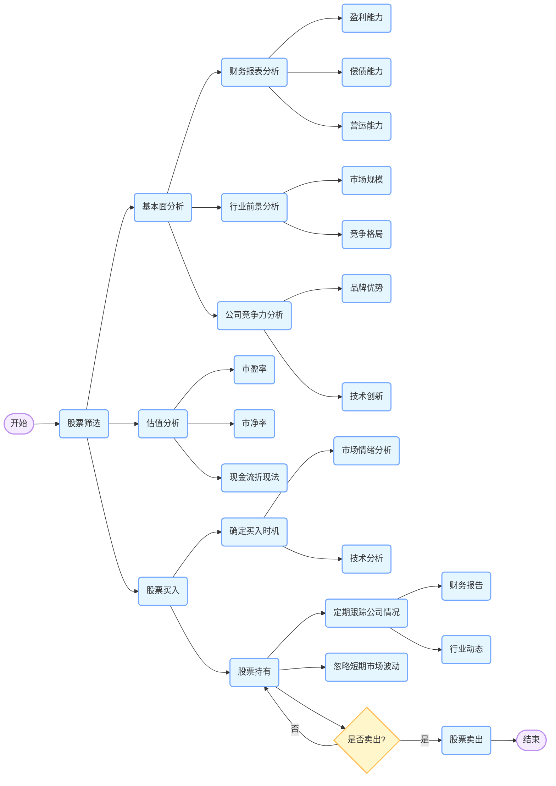

# 彼得林奇的"买入并持有"策略

> 关键词：彼得林奇、买入并持有策略、价值投资、股票投资、长期收益

> 摘要：本文围绕彼得林奇的“买入并持有”策略展开深入探讨。详细介绍了该策略的背景，包括目的、预期读者和文档结构等内容。阐述了其核心概念、算法原理、数学模型，并通过项目实战案例进行详细说明。同时，分析了该策略在实际中的应用场景，推荐了相关的学习工具、资源和论文著作。最后总结了该策略的未来发展趋势与挑战，并提供常见问题解答和扩展阅读参考资料，旨在帮助投资者深入理解和运用这一经典投资策略。

## 1. 背景介绍 
### 1.1 目的和范围
彼得林奇是投资界的传奇人物，他所倡导的“买入并持有”策略在股票投资领域具有深远影响。本文的目的在于全面剖析这一策略，深入探究其核心原理、实施步骤以及在实际投资中的应用。我们将从理论层面阐述该策略的基本概念、算法原理和数学模型，同时通过具体的项目实战案例展示其操作方法和效果。范围涵盖了股票市场的投资，主要聚焦于如何运用“买入并持有”策略选择优质股票并长期持有以获取稳定收益。

### 1.2 预期读者
本文预期读者主要包括对股票投资感兴趣的初学者、有一定投资经验但希望深入学习经典投资策略的投资者、金融专业的学生以及从事金融投资研究的专业人士。对于初学者来说，可以通过本文初步了解“买入并持有”策略的基本理念和操作方法；有经验的投资者能够从中获取新的思路和方法，进一步优化自己的投资组合；金融专业学生和研究人员则可以将其作为研究投资策略的参考资料，深入分析该策略的理论基础和实践效果。

### 1.3 文档结构概述
本文将按照以下结构进行阐述：首先介绍“买入并持有”策略的背景信息，包括目的、预期读者和文档结构等；接着详细讲解核心概念，分析其原理和架构，并通过文本示意图和 Mermaid 流程图进行直观展示；然后阐述核心算法原理和具体操作步骤，使用 Python 源代码进行详细说明；再介绍相关的数学模型和公式，并举例说明；通过项目实战案例，展示该策略在实际中的应用，包括开发环境搭建、源代码实现和代码解读；分析该策略在不同场景下的实际应用；推荐学习该策略所需的工具和资源，包括书籍、在线课程、技术博客、开发工具、相关框架和库以及论文著作等；最后总结该策略的未来发展趋势与挑战，提供常见问题解答和扩展阅读参考资料。

### 1.4 术语表
#### 1.4.1 核心术语定义
- **买入并持有策略**：指投资者在选择了优质股票后，长期持有这些股票，不被短期市场波动所影响，通过股票的长期增值来获取收益的投资策略。
- **价值投资**：一种基于对股票内在价值的分析，寻找被市场低估的股票进行投资的方法，强调股票的基本面和长期投资价值。
- **股票内在价值**：指股票所代表的公司的真实价值，通常通过对公司的财务状况、盈利能力、行业前景等因素进行分析评估得出。

#### 1.4.2 相关概念解释
- **股息**：公司根据盈利情况向股东分配的利润，是投资者持有股票获取收益的一种方式。
- **市盈率（PE）**：股票价格与每股盈利的比率，用于衡量股票的估值水平，反映投资者为获取公司每一元盈利所愿意支付的价格。
- **市净率（PB）**：股票价格与每股净资产的比率，用于评估股票的投资价值，反映了市场对公司净资产的定价。

#### 1.4.3 缩略词列表
- **PE**：Price-to-Earnings Ratio，市盈率
- **PB**：Price-to-Book Ratio，市净率

## 2. 核心概念与联系 
### 核心概念原理
彼得林奇的“买入并持有”策略基于价值投资的理念。其核心原理是通过深入研究和分析，寻找那些具有良好基本面、成长潜力和被市场低估的股票。一旦找到符合条件的股票，投资者就应该坚定地买入并长期持有，忽略短期的市场波动。因为从长期来看，股票的价格会逐渐反映其内在价值，优质公司的股票价格会随着公司的成长而不断上涨，投资者可以通过持有这些股票获得丰厚的回报。

例如，一家公司具有强大的品牌优势、优秀的管理团队、稳定的现金流和较高的市场份额，但其股票价格由于短期市场因素被低估。投资者通过“买入并持有”策略，在低价时买入该公司股票，随着公司业务的不断拓展和盈利的增加，股票价格也会相应上升，投资者就可以获得资本增值收益。同时，公司还可能会定期发放股息，为投资者提供额外的收益。

### 架构的文本示意图
```plaintext
买入并持有策略架构

|-- 股票筛选
|   |-- 基本面分析
|   |   |-- 财务报表分析
|   |   |   |-- 盈利能力
|   |   |   |-- 偿债能力
|   |   |   |-- 营运能力
|   |   |-- 行业前景分析
|   |   |   |-- 市场规模
|   |   |   |-- 竞争格局
|   |   |-- 公司竞争力分析
|   |       |-- 品牌优势
|   |       |-- 技术创新
|   |-- 估值分析
|       |-- 市盈率
|       |-- 市净率
|       |-- 现金流折现法
|-- 股票买入
|   |-- 确定买入时机
|   |   |-- 市场情绪分析
|   |   |-- 技术分析
|-- 股票持有
|   |-- 定期跟踪公司情况
|   |   |-- 财务报告
|   |   |-- 行业动态
|   |-- 忽略短期市场波动
|-- 股票卖出
|   |-- 公司基本面恶化
|   |-- 股票达到目标价格
|   |-- 发现更好的投资机会
```

### Mermaid 流程图


## 3. 核心算法原理 & 具体操作步骤 
### 核心算法原理
“买入并持有”策略的核心算法原理主要围绕股票的筛选和评估展开。通过对股票的基本面和估值进行分析，确定股票的投资价值。以下是使用 Python 实现的一个简单的股票筛选算法示例：

```python
import pandas as pd

def stock_screening(financial_data, industry_data):
    # 基本面分析
    # 筛选盈利能力强的公司，以净利润增长率为例
    profitable_companies = financial_data[financial_data['net_profit_growth_rate'] > 0.1]

    # 筛选偿债能力强的公司，以资产负债率为例
    solvent_companies = profitable_companies[profitable_companies['asset_liability_ratio'] < 0.5]

    # 筛选行业前景好的公司，以行业市场规模增长率为例
    promising_industry_companies = solvent_companies[solvent_companies['industry_id'].isin(
        industry_data[industry_data['market_size_growth_rate'] > 0.1]['industry_id']
    )]

    # 估值分析
    # 筛选低市盈率的公司
    undervalued_companies = promising_industry_companies[promising_industry_companies['pe_ratio'] < 20]

    return undervalued_companies

# 示例数据
financial_data = pd.DataFrame({
    'company_id': [1, 2, 3, 4],
    'net_profit_growth_rate': [0.15, 0.05, 0.2, 0.08],
    'asset_liability_ratio': [0.3, 0.6, 0.4, 0.55],
    'pe_ratio': [15, 25, 18, 22],
    'industry_id': [101, 102, 101, 103]
})

industry_data = pd.DataFrame({
    'industry_id': [101, 102, 103],
    'market_size_growth_rate': [0.12, 0.05, 0.08]
})

# 执行股票筛选
selected_stocks = stock_screening(financial_data, industry_data)
print(selected_stocks)
```

### 具体操作步骤
1. **股票筛选**
    - **基本面分析**
        - **财务报表分析**：收集公司的财务报表，包括资产负债表、利润表和现金流量表。分析公司的盈利能力（如净利润、毛利率、净利率等）、偿债能力（如资产负债率、流动比率、速动比率等）和营运能力（如存货周转率、应收账款周转率等）。
        - **行业前景分析**：研究公司所处行业的市场规模、增长趋势、竞争格局等。关注行业的政策环境、技术创新等因素对行业发展的影响。
        - **公司竞争力分析**：评估公司的品牌优势、技术创新能力、市场份额、管理团队等方面的竞争力。
    - **估值分析**
        - **市盈率（PE）**：计算公司股票的市盈率，与同行业其他公司和历史平均水平进行比较。较低的市盈率可能表示股票被低估。
        - **市净率（PB）**：计算公司股票的市净率，反映股票价格与每股净资产的关系。较低的市净率可能意味着股票具有较高的投资价值。
        - **现金流折现法（DCF）**：通过预测公司未来的现金流量，并将其折现到当前价值，评估股票的内在价值。

2. **股票买入**
    - **确定买入时机**
        - **市场情绪分析**：观察市场的整体情绪，如投资者的乐观或悲观程度。在市场情绪过度悲观时，可能是买入的好时机。
        - **技术分析**：运用技术分析工具，如移动平均线、相对强弱指标（RSI）等，判断股票的短期走势和买入信号。

3. **股票持有**
    - **定期跟踪公司情况**：定期关注公司的财务报告、行业动态和重大事件。了解公司的经营状况是否发生变化，以及行业竞争格局是否有新的发展。
    - **忽略短期市场波动**：避免被短期的市场波动所影响，坚持长期投资的理念。短期市场波动是正常现象，只要公司的基本面没有发生恶化，就应该继续持有股票。

4. **股票卖出**
    - **公司基本面恶化**：如果公司的盈利能力、偿债能力等基本面指标出现明显恶化，可能需要考虑卖出股票。
    - **股票达到目标价格**：在买入股票时，可以设定一个目标价格。当股票价格达到目标价格时，可以考虑卖出获利。
    - **发现更好的投资机会**：如果发现了更有投资价值的股票，可以卖出当前持有的股票，转而投资新的股票。

## 4. 数学模型和公式 & 详细讲解 & 举例说明 
### 市盈率（PE）
#### 公式
市盈率的计算公式为：
$$PE = \frac{P}{EPS}$$
其中，$P$ 表示股票价格，$EPS$ 表示每股盈利。

#### 详细讲解
市盈率是衡量股票估值水平的常用指标。它反映了投资者为获取公司每一元盈利所愿意支付的价格。一般来说，较低的市盈率可能表示股票被低估，具有较高的投资价值；而较高的市盈率可能表示股票被高估，投资风险相对较大。但市盈率的高低需要结合行业特点和公司的成长前景进行综合分析。

#### 举例说明
假设某公司的股票价格为 $50$ 元，每股盈利为 $2$ 元，则该公司的市盈率为：
$$PE = \frac{50}{2} = 25$$
如果同行业其他公司的平均市盈率为 $20$，则该公司的市盈率相对较高，可能需要进一步分析其原因，如公司是否具有较高的成长潜力等。

### 市净率（PB）
#### 公式
市净率的计算公式为：
$$PB = \frac{P}{BVPS}$$
其中，$P$ 表示股票价格，$BVPS$ 表示每股净资产。

#### 详细讲解
市净率反映了股票价格与每股净资产的关系。它可以用于评估股票的投资价值，特别是对于一些资产密集型行业的公司。较低的市净率可能表示股票被低估，具有一定的安全边际；而较高的市净率可能表示市场对公司的未来发展预期较高，但也可能存在估值泡沫的风险。

#### 举例说明
假设某公司的股票价格为 $30$ 元，每股净资产为 $10$ 元，则该公司的市净率为：
$$PB = \frac{30}{10} = 3$$
如果同行业其他公司的平均市净率为 $2$，则该公司的市净率相对较高，需要进一步分析公司的资产质量和盈利能力。

### 现金流折现法（DCF）
#### 公式
现金流折现法的基本公式为：
$$V = \sum_{t=1}^{n} \frac{CF_t}{(1 + r)^t} + \frac{TV}{(1 + r)^n}$$
其中，$V$ 表示股票的内在价值，$CF_t$ 表示第 $t$ 期的现金流量，$r$ 表示折现率，$n$ 表示预测期数，$TV$ 表示终值。

#### 详细讲解
现金流折现法是一种基于未来现金流量的估值方法。它通过预测公司未来的现金流量，并将其折现到当前价值，来评估股票的内在价值。折现率反映了投资者对投资风险的要求，一般可以使用加权平均资本成本（WACC）作为折现率。终值是指预测期结束后公司的价值，可以通过多种方法进行估算，如永续增长模型等。

#### 举例说明
假设某公司预计未来三年的现金流量分别为 $100$ 万元、$120$ 万元和 $150$ 万元，折现率为 $10\%$，预测期为三年。三年后公司的终值预计为 $2000$ 万元。则该公司股票的内在价值为：
$$V = \frac{100}{(1 + 0.1)^1} + \frac{120}{(1 + 0.1)^2} + \frac{150}{(1 + 0.1)^3} + \frac{2000}{(1 + 0.1)^3}$$
$$V = \frac{100}{1.1} + \frac{120}{1.21} + \frac{150}{1.331} + \frac{2000}{1.331}$$
$$V \approx 90.91 + 99.17 + 112.69 + 1502.63$$
$$V \approx 1805.4$$
如果该公司的股票市场价格低于 $1805.4$ 万元，则可能被低估，具有投资价值。

## 5. 项目实战：代码实际案例和详细解释说明 
### 5.1  开发环境搭建
#### 安装 Python
首先需要安装 Python 编程语言。可以从 Python 官方网站（https://www.python.org/downloads/）下载适合自己操作系统的 Python 安装包，并按照安装向导进行安装。

#### 安装必要的库
在使用 Python 进行股票分析时，需要安装一些必要的库，如 `pandas`、`numpy`、`matplotlib` 等。可以使用 `pip` 命令进行安装：
```sh
pip install pandas numpy matplotlib
```

#### 获取股票数据
可以使用 `pandas-datareader` 库从雅虎财经等数据源获取股票数据。安装 `pandas-datareader` 库：
```sh
pip install pandas-datareader
```

### 5.2  源代码详细实现和代码解读
以下是一个使用 Python 实现“买入并持有”策略的完整代码示例：

```python
import pandas as pd
import pandas_datareader.data as web
import matplotlib.pyplot as plt
import numpy as np

# 定义股票代码和时间范围
stock_symbol = 'AAPL'
start_date = '2010-01-01'
end_date = '2023-12-31'

# 获取股票数据
stock_data = web.DataReader(stock_symbol, 'yahoo', start_date, end_date)

# 计算累计收益率
stock_data['cumulative_returns'] = (1 + stock_data['Adj Close'].pct_change()).cumprod()

# 绘制累计收益率曲线
plt.figure(figsize=(12, 6))
plt.plot(stock_data.index, stock_data['cumulative_returns'], label=f'{stock_symbol} Cumulative Returns')
plt.title(f'{stock_symbol} Cumulative Returns from {start_date} to {end_date}')
plt.xlabel('Date')
plt.ylabel('Cumulative Returns')
plt.legend()
plt.grid(True)
plt.show()

# 计算年化收益率
years = (pd.Timestamp(end_date) - pd.Timestamp(start_date)).days / 365
final_return = stock_data['cumulative_returns'][-1]
annualized_return = (final_return ** (1 / years)) - 1

print(f'{stock_symbol} Annualized Return: {annualized_return * 100:.2f}%')
```

### 代码解读与分析
1. **导入必要的库**：导入 `pandas`、`pandas-datareader`、`matplotlib` 和 `numpy` 库，用于数据处理、数据获取、绘图和数值计算。
2. **定义股票代码和时间范围**：指定要分析的股票代码和时间范围。
3. **获取股票数据**：使用 `web.DataReader` 函数从雅虎财经获取指定股票在指定时间范围内的历史数据。
4. **计算累计收益率**：通过计算每日收益率的累积乘积，得到股票的累计收益率。
5. **绘制累计收益率曲线**：使用 `matplotlib` 库绘制股票的累计收益率曲线，直观展示股票在时间范围内的收益情况。
6. **计算年化收益率**：根据累计收益率和投资年限，计算股票的年化收益率。年化收益率可以更直观地反映股票的长期投资收益水平。
7. **输出结果**：打印股票的年化收益率。

通过这个代码示例，我们可以看到“买入并持有”策略的实际效果。如果在 2010 年 1 月 1 日买入苹果公司的股票并一直持有到 2023 年 12 月 31 日，我们可以通过累计收益率曲线和年化收益率来评估投资的收益情况。

## 6. 实际应用场景 
### 个人投资者
对于个人投资者来说，“买入并持有”策略是一种简单易行且有效的投资方法。个人投资者通常没有专业的投资知识和大量的时间进行频繁的交易。通过选择具有良好基本面和成长潜力的股票，然后长期持有，可以避免短期市场波动的影响，获得稳定的长期收益。例如，个人投资者可以将一部分资金投资于一些知名的蓝筹股，如苹果、微软等，长期持有这些股票，分享公司成长带来的红利。

### 养老基金和保险资金
养老基金和保险资金通常具有长期投资的需求和目标。它们需要保证资金的安全性和稳定性，并实现一定的增值。“买入并持有”策略非常适合这类资金的投资需求。养老基金和保险资金可以通过深入研究和分析，选择一些业绩稳定、分红较高的股票进行长期投资。例如，投资于一些公用事业类股票，这些股票通常具有稳定的现金流和较高的股息率，可以为养老基金和保险资金提供稳定的收益。

### 长期投资机构
长期投资机构，如私募股权投资基金、主权财富基金等，也常常采用“买入并持有”策略。这些机构具有较强的研究能力和资金实力，能够对公司进行深入的调研和分析。它们通过寻找具有潜在价值的公司进行投资，并长期持有这些公司的股票，等待公司价值的提升。例如，私募股权投资基金可能会投资于一些新兴行业的初创公司，通过提供资金和资源支持公司的发展，长期持有公司的股权，在公司上市或被收购后获得丰厚的回报。

## 7. 工具和资源推荐
### 7.1 学习资源推荐
#### 7.1.1 书籍推荐
- 《彼得·林奇的成功投资》：彼得·林奇亲自撰写的投资经典著作，详细介绍了他的投资理念、方法和策略，对于理解“买入并持有”策略具有重要的指导意义。
- 《聪明的投资者》：本杰明·格雷厄姆的代表作，被誉为投资界的圣经。书中阐述了价值投资的基本原理和方法，为“买入并持有”策略提供了坚实的理论基础。
- 《怎样选择成长股》：菲利普·费雪的经典著作，强调了寻找具有成长潜力的公司的重要性，对于如何筛选优质股票具有很大的启发作用。

#### 7.1.2 在线课程
- Coursera 上的“投资学原理”课程：由知名大学的教授授课，系统地介绍了投资学的基本原理和方法，包括股票投资、债券投资等内容。
- edX 上的“金融市场”课程：涵盖了金融市场的各个方面，包括股票市场、债券市场、衍生品市场等，对于理解股票投资的宏观环境和市场机制非常有帮助。
- 中国大学 MOOC 上的“证券投资学”课程：国内高校教师授课，结合中国证券市场的实际情况，介绍了证券投资的理论和实践知识。

#### 7.1.3 技术博客和网站
- 雪球网：国内知名的投资社区，提供股票行情、研究报告、投资讨论等服务。投资者可以在雪球网上关注一些投资达人的观点和分析，学习他们的投资经验。
- 东方财富网：提供全面的金融信息和数据服务，包括股票行情、财经新闻、研究报告等。投资者可以通过东方财富网获取最新的市场动态和公司信息。
- Seeking Alpha：国外知名的投资研究网站，汇聚了众多专业投资者和分析师的观点和分析。投资者可以在该网站上了解国际市场的投资机会和趋势。

### 7.2 开发工具框架推荐
#### 7.2.1 IDE和编辑器
- PyCharm：一款专业的 Python 集成开发环境，具有强大的代码编辑、调试、自动补全和代码分析等功能，适合进行 Python 股票分析项目的开发。
- Jupyter Notebook：一种交互式的开发环境，支持多种编程语言，如 Python、R 等。它可以将代码、文本、图表等内容整合在一起，方便进行数据分析和可视化展示。
- Visual Studio Code：一款轻量级的代码编辑器，支持多种编程语言和插件扩展。它具有简洁的界面和丰富的功能，适合快速开发和调试 Python 代码。

#### 7.2.2 调试和性能分析工具
- PDB：Python 自带的调试工具，可以帮助开发者在代码运行过程中进行调试，查看变量的值和程序的执行流程。
- cProfile：Python 标准库中的性能分析工具，可以统计代码的执行时间和函数调用次数，帮助开发者找出代码中的性能瓶颈。
- Py-Spy：一个轻量级的 Python 性能分析工具，可以实时监测 Python 程序的性能，无需修改代码。

#### 7.2.3 相关框架和库
- Pandas：用于数据处理和分析的 Python 库，提供了高效的数据结构和数据操作方法，非常适合处理股票数据。
- Numpy：用于数值计算的 Python 库，提供了高性能的多维数组对象和各种数学函数，在股票数据分析中经常用到。
- Matplotlib：用于数据可视化的 Python 库，可以绘制各种类型的图表，如折线图、柱状图、散点图等，帮助投资者直观地展示股票数据和分析结果。

### 7.3 相关论文著作推荐
#### 7.3.1 经典论文
- Fama, E. F., & French, K. R. (1992). The cross-section of expected stock returns. The Journal of Finance, 47(2), 427-465. 该论文提出了著名的 Fama-French 三因子模型，对股票收益的影响因素进行了深入分析，为股票投资提供了重要的理论基础。
- Markowitz, H. M. (1952). Portfolio selection. The Journal of Finance, 7(1), 77-91. 这篇论文开创了现代投资组合理论的先河，提出了通过资产组合来降低风险的方法，对于优化投资组合具有重要的指导意义。

#### 7.3.2 最新研究成果
- 通过学术数据库，如知网、万方、Web of Science 等，可以搜索到关于股票投资策略、市场有效性等方面的最新研究成果。这些研究成果可以帮助投资者了解当前股票投资领域的前沿动态和发展趋势。

#### 7.3.3 应用案例分析
- 一些金融研究机构和咨询公司会发布关于股票投资策略的应用案例分析报告。这些报告通过实际案例展示了不同投资策略的实施过程和效果，对于投资者学习和应用“买入并持有”策略具有很大的参考价值。

## 8. 总结：未来发展趋势与挑战
### 未来发展趋势
- **智能化和数字化**：随着人工智能和大数据技术的不断发展，股票投资领域也将越来越智能化和数字化。投资者可以利用人工智能算法和大数据分析工具，更准确地筛选股票、预测市场走势和评估投资风险。例如，通过机器学习算法对大量的股票数据进行分析，挖掘潜在的投资机会。
- **全球化投资**：全球经济一体化的趋势不断加强，投资者的投资视野也将更加全球化。“买入并持有”策略可以应用于全球范围内的股票市场，投资者可以通过投资不同国家和地区的优质股票，实现资产的多元化配置，降低投资风险。
- **社会责任投资**：越来越多的投资者开始关注企业的社会责任和可持续发展。未来，“买入并持有”策略可能会更多地考虑企业的环境、社会和治理（ESG）因素。投资者会选择那些具有良好 ESG 表现的公司进行投资，既实现了投资收益，又为社会做出了贡献。

### 挑战
- **市场不确定性增加**：全球政治经济环境的不确定性不断增加，如贸易摩擦、地缘政治冲突、经济衰退等，这些因素都会对股票市场产生较大的影响。在这种情况下，“买入并持有”策略可能会面临更大的挑战，投资者需要更加谨慎地选择股票和控制风险。
- **技术变革带来的挑战**：科技的快速发展可能会导致一些传统行业的公司面临被淘汰的风险。投资者需要及时了解行业的技术变革趋势，调整投资组合，避免投资那些因技术变革而失去竞争力的公司。
- **投资者情绪波动**：投资者的情绪波动往往会导致市场的非理性波动。在市场下跌时，投资者可能会因为恐慌而抛售股票，从而破坏“买入并持有”策略的实施。因此，投资者需要具备良好的心理素质和投资纪律，避免被情绪左右。

## 9. 附录：常见问题与解答
### 问题 1：“买入并持有”策略是否适用于所有股票？
答：不是的。“买入并持有”策略更适用于那些具有良好基本面、成长潜力和稳定现金流的优质股票。对于一些业绩不佳、前景不明朗或处于衰退行业的股票，不适合采用该策略。投资者在选择股票时，需要进行深入的研究和分析，筛选出符合条件的股票。

### 问题 2：如何判断股票的基本面是否恶化？
答：可以从多个方面判断股票的基本面是否恶化。首先，关注公司的财务报表，如净利润、毛利率、净利率等盈利能力指标是否下降，资产负债率、流动比率等偿债能力指标是否变差。其次，观察公司的市场份额是否被竞争对手抢占，行业地位是否下降。此外，还要关注公司的重大事件，如管理层变动、重大诉讼等，这些事件可能会对公司的基本面产生不利影响。

### 问题 3：在持有股票期间，是否需要定期调整投资组合？
答：一般来说，“买入并持有”策略强调长期持有，不建议频繁调整投资组合。但在某些情况下，如公司基本面发生重大变化、市场环境发生显著改变或发现更好的投资机会时，可以适当调整投资组合。投资者需要根据具体情况进行判断和决策，同时要注意控制调整的频率和幅度，避免过度交易带来的成本增加。

### 问题 4：如何确定股票的目标价格？
答：确定股票的目标价格可以采用多种方法。一种方法是基于估值分析，如使用市盈率、市净率等指标，结合同行业其他公司的估值水平和公司的成长前景，估算股票的合理价格。另一种方法是通过现金流折现法，预测公司未来的现金流量，并将其折现到当前价值，得到股票的内在价值。此外，还可以参考分析师的研究报告和市场共识，但需要注意对这些信息进行独立思考和判断。

## 10. 扩展阅读 & 参考资料
### 扩展阅读
- 《金融炼金术》：乔治·索罗斯的著作，介绍了他的反身性理论和投资哲学，对于理解市场的复杂性和不确定性具有很大的启发。
- 《漫步华尔街》：伯顿·马尔基尔的经典著作，系统地介绍了股票投资的各种理论和方法，包括有效市场假说、随机漫步理论等，帮助投资者建立正确的投资观念。
- 《邓普顿教你逆向投资》：约翰·邓普顿是著名的逆向投资者，这本书介绍了他的逆向投资策略和方法，对于在市场波动中寻找投资机会具有重要的参考价值。

### 参考资料
- 彼得·林奇. 《彼得·林奇的成功投资》. 机械工业出版社.
- 本杰明·格雷厄姆. 《聪明的投资者》. 人民邮电出版社.
- 菲利普·费雪. 《怎样选择成长股》. 地震出版社.
- Fama, E. F., & French, K. R. (1992). The cross-section of expected stock returns. The Journal of Finance, 47(2), 427-465.
- Markowitz, H. M. (1952). Portfolio selection. The Journal of Finance, 7(1), 77-91.

作者：AI天才研究院/AI Genius Institute & 禅与计算机程序设计艺术 /Zen And The Art of Computer Programming