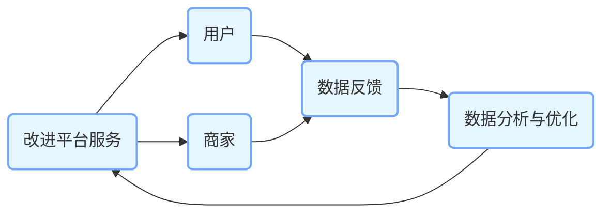

# 彼得林奇的"价值创造"在平台经济中的新衡量标准

> 关键词：彼得林奇、价值创造、平台经济、衡量标准、商业模式

> 摘要：本文深入探讨彼得林奇的“价值创造”理念在平台经济这一新兴经济形态中的新衡量标准。首先介绍了研究的背景、目的、预期读者等内容，阐述了相关核心概念及联系。接着详细剖析了适用于平台经济价值创造衡量的核心算法原理，并给出Python代码示例。同时引入数学模型和公式进行理论支撑与举例说明。通过项目实战展示代码实现及解读，分析其在实际应用场景中的作用。推荐了相关的学习资源、开发工具框架及论文著作。最后总结了未来发展趋势与挑战，解答常见问题并提供扩展阅读与参考资料，旨在为平台经济中价值创造的评估提供新的思路和方法。

## 1. 背景介绍 
### 1.1 目的和范围
彼得林奇作为投资领域的传奇人物，其“价值创造”理念在传统经济模式下具有重要的指导意义。然而，随着互联网技术的飞速发展，平台经济逐渐成为经济发展的重要力量。平台经济具有与传统经济不同的特点，如网络效应、双边市场等，这使得传统的价值创造衡量标准在平台经济中不再完全适用。本文的目的在于探讨如何将彼得林奇的“价值创造”理念应用于平台经济，提出适用于平台经济的新衡量标准。研究范围涵盖平台经济的各个领域，包括电商平台、社交平台、共享经济平台等。

### 1.2 预期读者
本文预期读者包括从事平台经济研究的学者、平台企业的管理者和决策者、投资领域的从业者以及对平台经济和价值创造感兴趣的技术爱好者。学者可以从本文中获取新的研究思路和理论框架；企业管理者和决策者可以借鉴新的衡量标准来评估平台的价值创造能力，制定战略决策；投资从业者可以利用这些标准进行投资分析和决策；技术爱好者可以了解平台经济背后的经济原理和价值创造机制。

### 1.3 文档结构概述
本文首先介绍背景信息，包括目的、预期读者和文档结构概述等。接着阐述核心概念与联系，通过文本示意图和Mermaid流程图展示平台经济中价值创造的原理和架构。然后详细讲解核心算法原理及具体操作步骤，给出Python代码示例。再引入数学模型和公式进行理论分析，并举例说明。通过项目实战展示代码的实际应用和详细解释。分析实际应用场景，推荐相关的工具和资源。最后总结未来发展趋势与挑战，解答常见问题并提供扩展阅读与参考资料。

### 1.4 术语表
#### 1.4.1 核心术语定义
- **彼得林奇的“价值创造”**：指企业通过提供满足消费者需求的产品或服务，实现盈利和持续增长，为股东、员工和社会创造价值的过程。
- **平台经济**：是一种基于数字技术，由数据驱动、平台支撑、网络协同的经济活动单元所构成的新经济系统，是基于数字平台的各种经济关系的总称。
- **价值创造衡量标准**：用于评估企业或平台在经济活动中创造价值的程度和效果的一系列指标和方法。

#### 1.4.2 相关概念解释
- **网络效应**：指当一种产品或服务的价值随着使用该产品或服务的用户数量的增加而增加的现象。在平台经济中，网络效应是平台吸引用户和实现价值创造的重要驱动力。
- **双边市场**：是一种有两组参与者需要通过中间平台进行交易，而且一组参与者加入平台的收益取决于加入该平台另一组参与者的数量的市场。平台在双边市场中起到连接和匹配供需双方的作用。

#### 1.4.3 缩略词列表
- **GDP**：国内生产总值（Gross Domestic Product）
- **ROI**：投资回报率（Return on Investment）

## 2. 核心概念与联系 
### 核心概念原理
在传统经济中，彼得林奇的“价值创造”主要关注企业的盈利能力、市场份额、产品创新等方面。企业通过生产和销售产品或服务，满足消费者的需求，从而获得利润，实现价值创造。然而，在平台经济中，价值创造的原理发生了变化。平台作为连接供需双方的中间媒介，通过提供高效的匹配服务、降低交易成本、促进网络效应的发挥等方式来创造价值。

平台的价值创造不仅取决于平台自身的运营效率，还取决于平台上用户的参与度和活跃度。用户在平台上的互动和交易行为会产生数据，这些数据可以被平台利用来优化服务、提高用户体验，进一步吸引更多的用户，形成良性循环。此外，平台经济中的价值创造还涉及到多方利益相关者，包括平台企业、用户、商家、合作伙伴等，他们之间的关系和互动对价值创造起着关键作用。

### 架构的文本示意图
```plaintext
          +---------------------+
          |     平台企业        |
          |                     |
          |  提供平台服务       |
          |  制定规则和政策     |
          +---------------------+
              /               \
             /                 \
+-----------------+       +-----------------+
|      用户       |       |      商家       |
|                 |       |                 |
|  使用平台服务  |       |  借助平台销售  |
+-----------------+       +-----------------+
        |                       |
        |                       |
        +-------- 数据反馈 -------+
        |                       |
        |                       |
+---------------------+
|     数据分析与优化  |
|                     |
|  改进平台服务       |
|  提高用户体验       |
+---------------------+
```

### Mermaid流程图


## 3. 核心算法原理 & 具体操作步骤 
### 核心算法原理
在平台经济中，衡量价值创造可以从多个维度进行，包括用户价值、商家价值和平台自身价值。为了综合评估平台的价值创造能力，我们可以采用加权平均的方法。具体来说，我们可以定义平台的价值创造指数 $VCI$ 为：

$VCI = w_1 \times UV + w_2 \times MV + w_3 \times PV$

其中，$UV$ 表示用户价值，$MV$ 表示商家价值，$PV$ 表示平台自身价值，$w_1$、$w_2$ 和 $w_3$ 分别是用户价值、商家价值和平台自身价值的权重，且 $w_1 + w_2 + w_3 = 1$。

用户价值可以通过用户活跃度、用户满意度等指标来衡量；商家价值可以通过商家销售额、商家满意度等指标来衡量；平台自身价值可以通过平台的营收、利润、市场份额等指标来衡量。

### 具体操作步骤
1. **数据收集**：收集平台的用户数据、商家数据和平台自身的运营数据，包括用户活跃度、用户满意度、商家销售额、商家满意度、平台营收、利润等。
2. **指标计算**：根据收集到的数据，计算用户价值、商家价值和平台自身价值的各项指标。
3. **权重确定**：根据平台的战略定位和发展阶段，确定用户价值、商家价值和平台自身价值的权重。
4. **价值创造指数计算**：根据上述公式，计算平台的价值创造指数。
5. **结果分析**：根据计算结果，分析平台的价值创造能力，找出存在的问题和改进的方向。

### Python源代码示例
```python
# 定义用户价值、商家价值和平台自身价值的指标
user_activity = 80  # 用户活跃度
user_satisfaction = 0.9  # 用户满意度
merchant_sales = 1000000  # 商家销售额
merchant_satisfaction = 0.85  # 商家满意度
platform_revenue = 500000  # 平台营收
platform_profit = 100000  # 平台利润

# 计算用户价值、商家价值和平台自身价值
user_value = (user_activity + user_satisfaction * 100) / 2
merchant_value = (merchant_sales + merchant_satisfaction * 1000000) / 2
platform_value = (platform_revenue + platform_profit) / 2

# 确定权重
w1 = 0.4  # 用户价值权重
w2 = 0.3  # 商家价值权重
w3 = 0.3  # 平台自身价值权重

# 计算价值创造指数
vci = w1 * user_value + w2 * merchant_value + w3 * platform_value

print(f"平台的价值创造指数为: {vci}")
```

## 4. 数学模型和公式 & 详细讲解 & 举例说明 
### 数学模型和公式
如前面所述，平台的价值创造指数 $VCI$ 的计算公式为：

$$VCI = w_1 \times UV + w_2 \times MV + w_3 \times PV$$

其中，$UV$、$MV$ 和 $PV$ 分别表示用户价值、商家价值和平台自身价值，$w_1$、$w_2$ 和 $w_3$ 分别是它们的权重，且满足 $w_1 + w_2 + w_3 = 1$。

用户价值 $UV$ 可以进一步表示为多个用户相关指标的加权平均：

$$UV = \sum_{i=1}^{n} a_i \times u_i$$

其中，$a_i$ 是第 $i$ 个用户指标的权重，$u_i$ 是第 $i$ 个用户指标的值，$n$ 是用户指标的数量。

商家价值 $MV$ 和平台自身价值 $PV$ 也可以类似地表示为多个相关指标的加权平均。

### 详细讲解
这个数学模型的核心思想是综合考虑平台经济中用户、商家和平台自身三个方面的价值创造。通过加权平均的方法，将不同维度的价值指标整合为一个综合的价值创造指数，以便更全面地评估平台的价值创造能力。

权重的确定是该模型的关键。不同的平台在不同的发展阶段，对用户、商家和平台自身的重视程度可能不同。例如，在平台的初创阶段，可能更注重用户的获取和留存，因此用户价值的权重可能较高；而在平台的成熟阶段，可能更关注平台的盈利能力和市场份额，因此平台自身价值的权重可能较高。

### 举例说明
假设一个电商平台，用户价值的相关指标包括用户活跃度、用户满意度和用户留存率，权重分别为 0.4、0.3 和 0.3。用户活跃度为 80，用户满意度为 0.9，用户留存率为 0.8。则用户价值为：

$$UV = 0.4 \times 80 + 0.3 \times 0.9 \times 100 + 0.3 \times 0.8 \times 100 = 32 + 27 + 24 = 83$$

商家价值的相关指标包括商家销售额、商家满意度和商家入驻率，权重分别为 0.5、0.3 和 0.2。商家销售额为 1000000 元，商家满意度为 0.85，商家入驻率为 0.9。则商家价值为：

$$MV = 0.5 \times 1000000 + 0.3 \times 0.85 \times 1000000 + 0.2 \times 0.9 \times 1000000 = 500000 + 255000 + 180000 = 935000$$

平台自身价值的相关指标包括平台营收、平台利润和市场份额，权重分别为 0.4、0.3 和 0.3。平台营收为 500000 元，平台利润为 100000 元，市场份额为 0.2。则平台自身价值为：

$$PV = 0.4 \times 500000 + 0.3 \times 100000 + 0.3 \times 0.2 \times 1000000 = 200000 + 30000 + 60000 = 290000$$

假设用户价值、商家价值和平台自身价值的权重分别为 0.4、0.3 和 0.3，则该平台的价值创造指数为：

$$VCI = 0.4 \times 83 + 0.3 \times 935000 + 0.3 \times 290000 = 33.2 + 280500 + 87000 = 367533.2$$

## 5. 项目实战：代码实际案例和详细解释说明 
### 5.1  开发环境搭建
为了实现上述的价值创造指数计算，我们可以使用Python语言进行开发。以下是开发环境的搭建步骤：

1. **安装Python**：从Python官方网站（https://www.python.org/downloads/）下载并安装Python 3.x版本。
2. **安装开发工具**：可以选择使用PyCharm、VS Code等集成开发环境（IDE），也可以使用Jupyter Notebook进行交互式开发。
3. **安装必要的库**：在本项目中，我们只需要使用Python的内置库，无需安装额外的第三方库。

### 5.2  源代码详细实现和代码解读
```python
# 定义用户价值相关指标
user_activity = 80
user_satisfaction = 0.9
user_retention_rate = 0.8

# 定义用户价值指标的权重
weight_user_activity = 0.4
weight_user_satisfaction = 0.3
weight_user_retention_rate = 0.3

# 计算用户价值
user_value = (weight_user_activity * user_activity + 
              weight_user_satisfaction * user_satisfaction * 100 + 
              weight_user_retention_rate * user_retention_rate * 100)

# 定义商家价值相关指标
merchant_sales = 1000000
merchant_satisfaction = 0.85
merchant_entry_rate = 0.9

# 定义商家价值指标的权重
weight_merchant_sales = 0.5
weight_merchant_satisfaction = 0.3
weight_merchant_entry_rate = 0.2

# 计算商家价值
merchant_value = (weight_merchant_sales * merchant_sales + 
                  weight_merchant_satisfaction * merchant_satisfaction * 1000000 + 
                  weight_merchant_entry_rate * merchant_entry_rate * 1000000)

# 定义平台自身价值相关指标
platform_revenue = 500000
platform_profit = 100000
market_share = 0.2

# 定义平台自身价值指标的权重
weight_platform_revenue = 0.4
weight_platform_profit = 0.3
weight_market_share = 0.3

# 计算平台自身价值
platform_value = (weight_platform_revenue * platform_revenue + 
                  weight_platform_profit * platform_profit + 
                  weight_market_share * market_share * 1000000)

# 定义用户价值、商家价值和平台自身价值的权重
weight_user = 0.4
weight_merchant = 0.3
weight_platform = 0.3

# 计算价值创造指数
vci = (weight_user * user_value + 
       weight_merchant * merchant_value + 
       weight_platform * platform_value)

print(f"平台的价值创造指数为: {vci}")
```

### 代码解读与分析
1. **用户价值计算**：首先定义了用户价值的相关指标，包括用户活跃度、用户满意度和用户留存率，并为每个指标分配了相应的权重。然后根据加权平均的方法计算用户价值。
2. **商家价值计算**：类似地，定义了商家价值的相关指标，包括商家销售额、商家满意度和商家入驻率，并为每个指标分配了相应的权重。然后计算商家价值。
3. **平台自身价值计算**：定义了平台自身价值的相关指标，包括平台营收、平台利润和市场份额，并为每个指标分配了相应的权重。然后计算平台自身价值。
4. **价值创造指数计算**：最后，为用户价值、商家价值和平台自身价值分配了相应的权重，并根据加权平均的方法计算平台的价值创造指数。

通过这个代码示例，我们可以看到如何将数学模型转化为具体的代码实现，从而计算平台的价值创造指数。

## 6. 实际应用场景 
### 电商平台
在电商平台中，价值创造指数可以用于评估平台的运营效果和发展潜力。平台管理者可以根据价值创造指数的变化，调整平台的战略和运营策略。例如，如果用户价值的权重较高，而用户活跃度和用户满意度较低，平台可以通过优化用户界面、提供更多的优惠活动等方式来提高用户体验，增加用户活跃度和满意度。

### 社交平台
对于社交平台来说，价值创造指数可以帮助平台了解用户的需求和行为，优化平台的功能和服务。如果商家价值的权重较高，平台可以通过与商家合作，提供更多的商业推广机会，提高商家的销售额和满意度。同时，平台也可以根据平台自身价值的指标，如营收、利润和市场份额，制定合理的