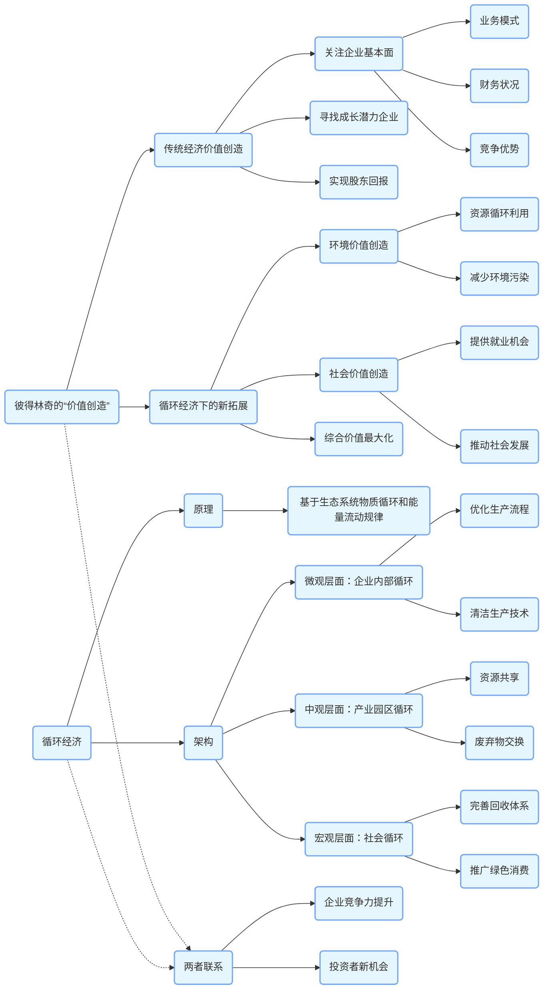

# 彼得林奇的"价值创造"在循环经济中的新定义

> 关键词：彼得林奇、价值创造、循环经济、新定义、可持续发展

> 摘要：本文深入探讨了彼得林奇的“价值创造”理念在循环经济背景下的新定义。首先介绍了研究的背景、目的、预期读者和文档结构等内容。接着阐述了相关核心概念及其联系，包括彼得林奇的价值创造理论和循环经济的原理与架构。详细讲解了核心算法原理和具体操作步骤，并通过Python代码进行了阐述。同时给出了数学模型和公式，辅以举例说明。通过项目实战案例展示了在循环经济中应用新定义的价值创造的具体实现和代码解读。分析了实际应用场景，推荐了相关的学习资源、开发工具框架和论文著作。最后总结了未来发展趋势与挑战，解答了常见问题并提供了扩展阅读和参考资料，旨在为读者全面呈现“价值创造”在循环经济中的新内涵和应用。

## 1. 背景介绍 
### 1.1 目的和范围
彼得林奇作为投资领域的传奇人物，其“价值创造”理念对传统经济模式下的企业发展和投资决策产生了深远影响。然而，随着全球资源环境问题的日益凸显，循环经济作为一种可持续发展的经济模式逐渐受到关注。本研究的目的在于探讨彼得林奇的“价值创造”理念在循环经济这一新兴经济模式中的新定义和应用，分析其如何适应循环经济的特点和要求，为企业在循环经济中实现价值创造提供理论支持和实践指导。研究范围涵盖了彼得林奇“价值创造”理念的核心内容、循环经济的基本原理和特点，以及两者结合后在企业战略规划、生产运营、投资决策等方面的应用。

### 1.2 预期读者
本文的预期读者主要包括企业管理者、投资者、研究循环经济和企业价值创造的学者、政策制定者以及对可持续发展经济模式感兴趣的相关人士。企业管理者可以从中获取在循环经济背景下实现企业价值创造的新思路和方法；投资者可以了解如何在循环经济领域寻找有价值的投资机会；学者可以进一步深入研究相关理论；政策制定者可以为制定促进循环经济发展的政策提供参考；对可持续发展经济模式感兴趣的人士可以拓宽对循环经济和价值创造的认识。

### 1.3 文档结构概述
本文将按照以下结构进行阐述：首先介绍背景相关内容，包括目的、预期读者和文档结构概述等。接着阐述核心概念与联系，明确彼得林奇的“价值创造”和循环经济的相关概念及其相互关系。然后详细讲解核心算法原理和具体操作步骤，通过Python代码进行示例。给出数学模型和公式，并举例说明其在实际中的应用。通过项目实战案例展示在循环经济中应用新定义的价值创造的具体实现和代码解读。分析实际应用场景，为不同行业提供参考。推荐相关的学习资源、开发工具框架和论文著作，方便读者进一步深入学习。最后总结未来发展趋势与挑战，解答常见问题并提供扩展阅读和参考资料。

### 1.4 术语表
#### 1.4.1 核心术语定义
- **彼得林奇的“价值创造”**：彼得林奇认为企业的价值创造主要体现在通过有效的经营管理，不断提高企业的盈利能力、市场竞争力和股东回报。包括寻找具有成长潜力的企业、关注企业的基本面、评估企业的内在价值等方面。
- **循环经济**：是一种以资源的高效利用和循环利用为核心，以“减量化、再利用、资源化”为原则，以低消耗、低排放、高效率为基本特征，符合可持续发展理念的经济增长模式。它强调经济活动与生态环境的和谐共生，通过建立资源循环利用体系，实现资源的最大化利用和废弃物的最小化排放。
- **价值创造新定义**：在循环经济背景下，彼得林奇的“价值创造”被赋予了新的内涵，不仅包括传统的经济价值创造，还包括环境价值和社会价值的创造。企业需要在资源循环利用、环境保护、社会责任等方面进行创新和实践，以实现综合价值的最大化。

#### 1.4.2 相关概念解释
- **资源循环利用**：指在生产、流通和消费等过程中，对资源进行回收、再加工、再利用，使其重新进入生产和消费领域，减少对原生资源的依赖和废弃物的排放。例如，将废旧金属回收后进行熔炼和加工，制成新的金属制品。
- **环境价值**：企业在生产经营过程中，通过采取环保措施、减少环境污染、保护生态系统等方式所创造的价值。这种价值可以表现为降低环境治理成本、提高企业的社会形象、获得政府的环保奖励等。
- **社会价值**：企业通过自身的经营活动，为社会提供就业机会、促进社会公平、推动社会发展等方面所创造的价值。例如，企业参与公益事业、支持社区建设、推动科技创新等。

#### 1.4.3 缩略词列表
- **GDP**：国内生产总值（Gross Domestic Product），是衡量一个国家或地区经济活动总量的指标。
- **ESG**：环境、社会和公司治理（Environmental, Social and Governance），是一种关注企业可持续发展和社会责任的投资理念和评价标准。

## 2. 核心概念与联系 

### 彼得林奇的“价值创造”原理
彼得林奇的价值创造理念核心在于对企业基本面的深入研究和分析。他强调投资者要关注企业的业务模式、财务状况、竞争优势等因素，寻找那些具有成长潜力和内在价值被低估的企业。通过长期投资这些企业，分享企业成长带来的收益。例如，他会关注企业的销售额、利润增长率、资产负债表等指标，评估企业的盈利能力和财务健康状况。他认为，一家优秀的企业应该能够不断创新，提高生产效率，降低成本，从而在市场竞争中脱颖而出，为股东创造价值。

### 循环经济的原理与架构
循环经济的原理基于生态系统的物质循环和能量流动规律，通过建立资源循环利用的产业链和生态系统，实现资源的高效利用和废弃物的最小化排放。其架构主要包括三个层面：微观层面的企业内部循环、中观层面的产业园区循环和宏观层面的社会循环。在企业内部，通过优化生产流程、采用清洁生产技术等方式，实现资源的循环利用和废弃物的减量化。在产业园区层面，不同企业之间通过资源共享、废弃物交换等方式，形成产业共生关系，提高资源利用效率。在社会层面，通过建立完善的回收体系、推广绿色消费等方式，实现全社会资源的循环利用。

### 两者的联系
在循环经济背景下，彼得林奇的“价值创造”理念有了新的拓展和延伸。循环经济要求企业在追求经济价值的同时，也要关注环境价值和社会价值的创造。企业通过参与循环经济活动，如资源回收利用、开发绿色产品等，可以降低生产成本、提高资源利用效率，从而增强企业的竞争力和盈利能力，这与彼得林奇寻找具有成长潜力的企业的理念相契合。同时，企业在循环经济中的良好表现也有助于提升企业的社会形象和品牌价值，吸引更多的投资者和消费者，进一步创造经济价值。此外，循环经济的发展也为投资者提供了新的投资机会，投资者可以关注那些在循环经济领域具有创新能力和发展潜力的企业，实现价值投资。

### 文本示意图
```plaintext
彼得林奇的“价值创造”
|--传统经济价值创造
|   |--关注企业基本面
|   |   |--业务模式
|   |   |--财务状况
|   |   |--竞争优势
|   |--寻找成长潜力企业
|   |--实现股东回报
|
|--循环经济下的新拓展
|   |--环境价值创造
|   |   |--资源循环利用
|   |   |--减少环境污染
|   |--社会价值创造
|   |   |--提供就业机会
|   |   |--推动社会发展
|   |--综合价值最大化

循环经济
|--原理
|   |--基于生态系统物质循环和能量流动规律
|--架构
|   |--微观层面：企业内部循环
|   |   |--优化生产流程
|   |   |--清洁生产技术
|   |--中观层面：产业园区循环
|   |   |--资源共享
|   |   |--废弃物交换
|   |--宏观层面：社会循环
|   |   |--完善回收体系
|   |   |--推广绿色消费
```

### Mermaid 流程图


## 3. 核心算法原理 & 具体操作步骤 

### 核心算法原理
在循环经济背景下，对彼得林奇的“价值创造”进行量化评估需要综合考虑经济价值、环境价值和社会价值。可以采用多指标综合评价的方法，将不同类型的价值指标进行标准化处理，然后赋予不同的权重，最后计算综合价值得分。具体来说，设经济价值指标为 $E$，环境价值指标为 $V$，社会价值指标为 $S$，对应的权重分别为 $w_E$、$w_V$ 和 $w_S$，且 $w_E + w_V + w_S = 1$。则综合价值得分 $CV$ 的计算公式为：

$$CV = w_E \times E + w_V \times V + w_S \times S$$

### Python 代码实现
```python
# 定义经济价值、环境价值和社会价值指标
economic_value = 80
environmental_value = 70
social_value = 75

# 定义各指标的权重
weight_economic = 0.5
weight_environmental = 0.3
weight_social = 0.2

# 计算综合价值得分
composite_value = weight_economic * economic_value + weight_environmental * environmental_value + weight_social * social_value

print(f"综合价值得分: {composite_value}")
```

### 具体操作步骤
1. **指标确定**：
    - **经济价值指标**：可以选择企业的净利润增长率、资产回报率、市场份额等指标来衡量。这些指标反映了企业的盈利能力和市场竞争力。
    - **环境价值指标**：例如企业的资源利用率、废弃物排放量、能源消耗降低率等。这些指标体现了企业在环境保护和资源循环利用方面的表现。
    - **社会价值指标**：可以考虑企业的就业人数增长率、员工培训投入、公益捐赠金额等。这些指标反映了企业对社会的贡献。
2. **数据收集**：通过企业的财务报表、环境报告、社会责任报告等渠道收集相关指标的数据。确保数据的准确性和可靠性。
3. **指标标准化**：由于不同指标的量纲和取值范围可能不同，需要对其进行标准化处理，使其具有可比性。常用的标准化方法有 min - max 标准化和 z - score 标准化。
    - **min - max 标准化**：对于指标 $x$，其标准化后的取值 $x_{norm}$ 计算公式为：
$$x_{norm}=\frac{x - x_{min}}{x_{max}-x_{min}}$$
其中，$x_{min}$ 和 $x_{max}$ 分别是该指标的最小值和最大值。
    - **z - score 标准化**：对于指标 $x$，其标准化后的取值 $x_{norm}$ 计算公式为：
$$x_{norm}=\frac{x-\mu}{\sigma}$$
其中，$\mu$ 是该指标的均值，$\sigma$ 是该指标的标准差。
4. **权重确定**：根据企业的战略目标、行业特点和社会需求等因素，确定经济价值、环境价值和社会价值指标的权重。可以采用专家打分法、层次分析法等方法来确定权重。
5. **综合价值计算**：将标准化后的指标值代入综合价值得分计算公式，计算企业的综合价值得分。
6. **结果分析**：根据综合价值得分，评估企业在循环经济中的价值创造水平。得分越高，说明企业在经济、环境和社会方面的综合表现越好。可以与同行业其他企业进行比较，找出企业的优势和不足，为企业的战略决策提供参考。

## 4. 数学模型和公式 & 详细讲解 & 举例说明 

### 综合价值评估模型
综合价值评估模型的核心公式为：

$$CV = w_E \times E + w_V \times V + w_S \times S$$

其中，$CV$ 表示综合价值得分，$w_E$、$w_V$ 和 $w_S$ 分别是经济价值、环境价值和社会价值的权重，$E$、$V$ 和 $S$ 分别是经济价值、环境价值和社会价值的指标值。

### 详细讲解
- **经济价值指标（$E$）**：经济价值是企业生存和发展的基础，反映了企业的盈利能力和市场竞争力。常用的经济价值指标包括净利润增长率、资产回报率、市场份额等。例如，净利润增长率可以反映企业的盈利增长趋势，资产回报率可以衡量企业利用资产创造利润的能力。
- **环境价值指标（$V$）**：环境价值体现了企业在环境保护和资源循环利用方面的表现。环境价值指标可以包括资源利用率、废弃物排放量、能源消耗降低率等。例如，资源利用率越高，说明企业对资源的利用效率越好；废弃物排放量越低，说明企业对环境的影响越小。
- **社会价值指标（$S$）**：社会价值反映了企业对社会的贡献，包括提供就业机会、推动社会发展、支持公益事业等方面。社会价值指标可以包括就业人数增长率、员工培训投入、公益捐赠金额等。例如，就业人数增长率越高，说明企业为社会创造的就业机会越多；员工培训投入越大，说明企业注重员工的发展和提升。
- **权重（$w_E$、$w_V$ 和 $w_S$）**：权重的确定需要综合考虑企业的战略目标、行业特点和社会需求等因素。不同的企业和行业对经济价值、环境价值和社会价值的重视程度可能不同。例如，对于一些资源密集型企业，可能会更注重环境价值；而对于一些劳动密集型企业，可能会更关注社会价值。

### 举例说明
假设一家制造企业的经济价值指标（净利润增长率）为 20%，环境价值指标（资源利用率）为 80%，社会价值指标（就业人数增长率）为 10%。经过专家打分法确定经济价值、环境价值和社会价值的权重分别为 0.5、0.3 和 0.2。

首先，对各指标进行标准化处理（假设采用 min - max 标准化，该行业净利润增长率的最小值为 0%，最大值为 30%；资源利用率的最小值为 50%，最大值为 90%；就业人数增长率的最小值为 0%，最大值为 20%）：

- 经济价值指标标准化：
$$E_{norm}=\frac{20 - 0}{30 - 0}=\frac{2}{3}\approx0.67$$

- 环境价值指标标准化：
$$V_{norm}=\frac{80 - 50}{90 - 50}=\frac{30}{40}=0.75$$

- 社会价值指标标准化：
$$S_{norm}=\frac{10 - 0}{20 - 0}=0.5$$

然后，计算综合价值得分：

$$CV = 0.5\times0.67 + 0.3\times0.75 + 0.2\times0.5$$
$$CV = 0.335+0.225 + 0.1$$
$$CV = 0.66$$

该企业的综合价值得分是 0.66，通过与同行业其他企业的综合价值得分进行比较，可以评估该企业在循环经济中的价值创造水平。如果同行业平均综合价值得分是 0.6，说明该企业在经济、环境和社会方面的综合表现优于行业平均水平。

## 5. 项目实战：代码实际案例和详细解释说明 

### 5.1  开发环境搭建
#### 开发环境选择
本项目使用 Python 进行开发，Python 是一种功能强大、易于学习和使用的编程语言，拥有丰富的库和工具。推荐使用 Anaconda 作为 Python 开发环境的管理工具，它可以方便地安装和管理 Python 版本以及各种库。

#### 安装必要的库
在项目中，需要使用一些 Python 库来进行数据处理、计算和可视化。可以使用以下命令安装所需的库：
```bash
pip install numpy pandas matplotlib
```
- **numpy**：用于进行数值计算和数组操作。
- **pandas**：用于数据处理和分析，提供了 DataFrame 等数据结构，方便数据的读取、处理和存储。
- **matplotlib**：用于数据可视化，生成各种图表和图形。

### 5.2  源代码详细实现和代码解读
```python
import numpy as np
import pandas as pd
import matplotlib.pyplot as plt

# 模拟数据
data = {
    '企业名称': ['企业 A', '企业 B', '企业 C', '企业 D'],
    '经济价值指标': [85, 70, 90, 75],
    '环境价值指标': [75, 80, 65, 85],
    '社会价值指标': [80, 70, 85, 75]
}

# 创建 DataFrame
df = pd.DataFrame(data)

# 定义各指标的权重
weight_economic = 0.5
weight_environmental = 0.3
weight_social = 0.2

# 计算综合价值得分
df['综合价值得分'] = weight_economic * df['经济价值指标'] + weight_environmental * df['环境价值指标'] + weight_social * df['社会价值指标']

# 打印结果
print(df)

# 可视化综合价值得分
plt.figure(figsize=(10, 6))
plt.bar(df['企业名称'], df['综合价值得分'])
plt.xlabel('企业名称')
plt.ylabel('综合价值得分')
plt.title('不同企业的综合价值得分')
plt.show()
```

### 代码解读与分析
#### 代码解读
1. **导入必要的库**：导入 `numpy`、`pandas` 和 `matplotlib.pyplot` 库，分别用于数值计算、数据处理和数据可视化。
2. **模拟数据**：使用字典 `data` 模拟了 4 家企业的经济价值指标、环境价值指标和社会价值指标。
3. **创建 DataFrame**：使用 `pandas` 的 `DataFrame` 函数将模拟数据转换为数据框，方便后续的数据处理和分析。
4. **定义权重**：定义了经济价值、环境价值和社会价值指标的权重，分别为 0.5、0.3 和 0.2。
5. **计算综合价值得分**：根据综合价值得分计算公式，使用 `DataFrame` 的列运算计算每家企业的综合价值得分，并将结果存储在新的列 `综合价值得分` 中。
6. **打印结果**：使用 `print` 函数打印包含综合价值得分的 `DataFrame`，显示每家企业的各项指标和综合价值得分。
7. **可视化综合价值得分**：使用 `matplotlib` 的 `bar` 函数绘制柱状图，直观地展示不同企业的综合价值得分。

#### 分析
通过这个代码示例，我们可以清晰地看到如何使用 Python 实现对企业在循环经济中的综合价值评估。代码首先模拟了企业的相关指标数据，然后根据设定的权重计算综合价值得分，最后通过可视化的方式展示结果。这有助于企业管理者和投资者直观地了解不同企业在经济、环境和社会方面的综合表现，为决策提供参考。同时，代码具有一定的可扩展性，可以根据实际需求修改指标数据、权重和可视化方式，以适应不同的应用场景。

## 6. 实际应用场景 

### 企业战略规划
在循环经济背景下，企业在制定战略规划时可以运用彼得林奇“价值创造”的新定义。企业可以通过评估自身的经济价值、环境价值和社会价值，确定企业的发展方向和重点。例如，一家制造业企业可以通过提高资源利用率、减少废弃物排放等方式提升环境价值，同时开发绿色产品，满足市场对环保产品的需求，从而提高企业的经济价值和市场竞争力。企业还可以加强员工培训、参与公益事业等方式提升社会价值，树立良好的企业形象。

### 投资决策
投资者在进行投资决策时，可以将企业在循环经济中的价值创造能力作为重要的考虑因素。通过分析企业的综合价值得分，投资者可以筛选出那些在经济、环境和社会方面表现优秀的企业进行投资。例如，投资于那些积极开展资源回收利用、研发环保技术的企业，不仅可以获得经济回报，还可以为推动循环经济的发展做出贡献。同时，关注企业的环境和社会表现也有助于降低投资风险，因为那些注重可持续发展的企业往往具有更强的抗风险能力。

### 政府政策制定
政府在制定促进循环经济发展的政策时，可以参考彼得林奇“价值创造”的新定义。政府可以通过制定相关政策，鼓励企业提高环境价值和社会价值，如给予环保企业税收优惠、补贴研发费用等。政府还可以建立企业综合价值评估体系，对企业在循环经济中的表现进行评价和排名，引导企业积极参与循环经济建设。此外，政府可以加强对循环经济产业的扶持和引导，促进产业升级和转型，推动整个社会的可持续发展。

### 供应链管理
在供应链管理中，企业可以运用新定义的价值创造理念来选择合作伙伴。企业可以优先选择那些在经济、环境和社会方面表现良好的供应商，建立长期稳定的合作关系。通过与环保型供应商合作，企业可以降低自身的环境风险，提高供应链的可持续性。同时，企业还可以与供应商共同开展资源循环利用项目，实现供应链的绿色化和循环化。例如，一家服装企业可以与采用环保面料生产的供应商合作，共同推广绿色服装产品，提高整个供应链的价值创造能力。

## 7. 工具和资源推荐
### 7.1 学习资源推荐
#### 7.1.1 书籍推荐
- 《彼得·林奇的成功投资》：彼得·林奇的经典著作，详细介绍了他的投资理念和方法，对理解传统经济模式下的价值创造具有重要意义。
- 《循环经济与产业转型》：全面阐述了循环经济的理论、实践和发展趋势，为读者深入了解循环经济提供了系统的知识体系。
- 《可持续发展经济学》：探讨了经济发展与环境保护、社会公平之间的关系，有助于读者理解在循环经济中实现综合价值创造的重要性。

#### 7.1.2 在线课程
- Coursera 上的“循环经济基础”课程：由知名高校的教授授课，系统讲解循环经济的基本概念、原理和应用案例。
- edX 上的“投资分析与组合管理”课程：介绍了投资分析的方法和技巧，对理解彼得林奇的价值投资理念有很大帮助。
- 中国大学 MOOC 上的“企业社会责任与可持续发展”课程：从企业的角度出发，探讨了企业在社会责任和可持续发展方面的实践和挑战。

#### 7.1.3 技术博客和网站
- 36氪：关注科技、创新和创业领域，经常发布关于循环经济、可持续发展等方面的文章和报告。
- 第一财经研究院：提供经济、金融、产业等方面的研究报告和分析文章，对循环经济和企业价值创造的研究具有一定的参考价值。
- 世界资源研究所（WRI）官网：专注于环境和可持续发展领域的研究和实践，发布了大量关于循环经济的研究成果和案例。

### 7.2 开发工具框架推荐
#### 7.2.1 IDE和编辑器
- PyCharm：一款专业的 Python 集成开发环境，提供了丰富的代码编辑、调试、版本控制等功能，适合 Python 项目的开发。
- Jupyter Notebook：一个交互式的开发环境，支持 Python、R 等多种编程语言，方便进行数据探索、分析和可视化。
- Visual Studio Code：一款轻量级的代码编辑器，支持多种编程语言和插件扩展，具有良好的用户体验和开发效率。

#### 7.2.2 调试和性能分析工具
- pdb：Python 自带的调试器，可以帮助开发者在代码运行过程中进行调试和定位问题。
- cProfile：Python 的性能分析工具，可以分析代码的运行时间和函数调用情况，帮助开发者优化代码性能。
- Py-Spy：一个跨平台的 Python 性能分析工具，可以实时监控 Python 程序的运行状态，找出性能瓶颈。

#### 7.2.3 相关框架和库
- Scikit-learn：一个强大的机器学习库，提供了丰富的机器学习算法和工具，可用于企业价值评估和预测。
- TensorFlow：一个开源的深度学习框架，可用于处理复杂的数据分析和预测任务，如循环经济中的资源需求预测等。
- Plotly：一个交互式的数据可视化库，支持多种图表类型和交互方式，可用于展示企业综合价值评估的结果。

### 7.3 相关论文著作推荐
#### 7.3.1 经典论文
- “The Concept of the Circular Economy”：该论文首次提出了循环经济的概念，对循环经济的理论发展具有重要的奠基作用。
- “Value Investing: The Use of Historical Financial Statement Information to Separate Winners from Losers”：探讨了价值投资的理论和方法，对理解彼得林奇的价值创造理念具有重要的参考价值。
- “Corporate Social Responsibility and Financial Performance: A Meta - analysis”：通过元分析的方法，研究了企业社会责任与财务绩效之间的关系，为企业在循环经济中实现综合价值创造提供了理论支持。

#### 7.3.2 最新研究成果
- 近年来，关于循环经济和企业价值创造的研究不断涌现。可以通过学术数据库如 Web of Science、IEEE Xplore、ACM Digital Library 等搜索相关的最新研究论文，了解该领域的前沿动态和研究成果。

#### 7.3.3 应用案例分析
- 《循环经济案例集》：收集了国内外大量循环经济的应用案例，涵盖了不同行业和领域，为企业在循环经济中的实践提供了借鉴和参考。
- 一些知名企业的社会责任报告和可持续发展报告也可以作为应用案例进行分析，了解企业在循环经济中实现价值创造的具体做法和经验。

## 8. 总结：未来发展趋势与挑战

### 未来发展趋势
#### 技术创新推动循环经济发展
随着科技的不断进步，如物联网、大数据、人工智能等技术将在循环经济中得到更广泛的应用。物联网技术可以实现对资源流动和废弃物排放的实时监测和管理，提高资源利用效率；大数据和人工智能技术可以对循环经济相关数据进行分析和预测，为企业决策提供支持。例如，通过物联网传感器可以实时监测企业的能源消耗和废弃物产生情况，利用大数据分析技术可以找出能源浪费和废弃物产生的原因，从而采取针对性的措施进行改进。

#### 产业融合促进循环经济升级
未来，循环经济将与其他产业进行更深入的融合，形成新的产业模式和业态。例如，循环经济与制造业的融合可以推动绿色制造的发展，实现产品的全生命周期管理；循环经济与服务业的融合可以催生新的服务模式，如资源回收利用服务、环境咨询服务等。产业融合将促进循环经济产业链的延伸和拓展，提高循环经济的附加值和竞争力。

#### 社会意识提升推动循环经济普及
随着社会对环境保护和可持续发展的关注度不断提高，消费者的环保意识和绿色消费观念将逐渐增强。这将促使企业更加重视循环经济，积极开展资源循环利用和绿色产品开发。同时，政府和社会组织也将加大对循环经济的宣传和推广力度，推动循环经济理念的普及和社会参与度的提高。

### 挑战
#### 技术难题
虽然科技的发展为循环经济带来了机遇，但也面临一些技术难题。例如，某些废弃物的回收利用技术还不够成熟，导致资源回收率较低；循环经济中的数据安全和隐私保护问题也需要进一步解决。此外，一些新兴技术在循环经济中的应用还处于探索阶段，需要投入大量的研发和实践来验证其可行性和有效性。

#### 经济成本
在循环经济的发展过程中，企业需要投入大量的资金用于技术研发、设备更新和生产流程改造等方面。这可能会增加企业的生产成本，降低企业的短期经济效益。同时，循环经济产业的发展还面临着市场需求不足、价格机制不完善等问题，导致企业的投资回报周期较长，影响企业参与循环经济的积极性。

#### 政策法规不完善
目前，我国关于循环经济的政策法规还不够完善，存在政策衔接不畅、监管不到位等问题。一些政策措施的实施效果不够理想，无法有效引导和激励企业参与循环经济建设。此外，循环经济涉及多个部门和领域，需要加强部门之间的协调和合作，但目前还存在部门之间职责不清、协同效率不高等问题。

#### 社会观念转变困难
虽然社会对环境保护和可持续发展的关注度有所提高，但要实现全社会观念的根本性转变还需要时间和努力。一些消费者仍然更注重产品的价格和性能，对绿色产品的认知度和接受度较低；一些企业也存在短视行为，只追求短期的经济利益，忽视了循环经济带来的长期效益和社会价值。

## 9. 附录：常见问题与解答

### 问题 1：如何确定经济价值、环境价值和社会价值指标的权重？
确定权重可以采用多种方法，如专家打分法、层次分析法等。专家打分法是邀请相关领域的专家对各指标的重要性进行打分，然后取平均值作为权重。层次分析法是一种系统分析方法，通过构建层次结构模型，比较各指标之间的相对重要性，从而确定权重。在实际应用中，可以根据企业的战略目标、行业特点和社会需求等因素综合考虑，选择合适的方法来确定权重。

### 问题 2：循环经济下的价值创造与传统经济模式下的价值创造有什么区别？
传统经济模式下的价值创造主要关注企业的经济价值，即通过提高生产效率、降低成本、扩大市场份额等方式实现利润最大化。而在循环经济下，价值创造不仅包括经济价值，还包括环境价值和社会价值。企业需要在资源循环利用、环境保护、社会责任等方面进行创新和实践，以实现综合价值的最大化。例如，企业在生产过程中减少废弃物排放、采用可再生能源等方式可以提高环境价值；提供就业机会、支持公益事业等方式可以提升社会价值。

### 问题 3：企业如何在循环经济中实现价值创造？
企业可以从以下几个方面入手在循环经济中实现价值创造：
- **优化生产流程**：采用清洁生产技术，提高资源利用率，减少废弃物排放。
- **开发绿色产品**：满足市场对环保产品的需求，提高产品的附加值和市场竞争力。
- **建立资源循环利用体系**：加强与供应商和合作伙伴的合作，实现资源的回收利用和再加工。
- **加强社会责任管理**：关注员工福利、参与公益事业、推动社会发展，提升企业的社会形象和品牌价值。

### 问题 4：投资循环经济领域的企业有哪些风险？
投资循环经济领域的企业可能面临以下风险：
- **技术风险**：循环经济相关技术还处于发展阶段，存在技术不成熟、研发失败等风险。
- **市场风险**：循环经济产业的市场需求和价格机制还不够完善，可能导致企业的产品销售不畅、投资回报周期较长等问题。
- **政策风险**：政策法规的变化可能会对循环经济企业的发展产生影响，如政策支持力度减弱、环保标准提高等。
- **经营风险**：循环经济企业在运营过程中可能面临管理不善、资金短缺、人才不足等问题，影响企业的正常发展。

### 问题 5：政府在循环经济发展中应该发挥什么作用？
政府在循环经济发展中应该发挥引导、监管和支持的作用：
- **制定政策法规**：制定促进循环经济发展的政策法规，如税收优惠、补贴政策、环保标准等，引导企业积极参与循环经济建设。
- **加强监管**：加强对企业的环境监管，确保企业遵守环保法律法规，减少废弃物排放和环境污染。
- **提供支持**：加大对循环经济技术研发、产业发展的支持力度，如设立专项资金、建设公共服务平台等。
- **宣传推广**：加强对循环经济理念的宣传和推广，提高全社会的环保意识和参与度。

## 10. 扩展阅读 & 参考资料

### 扩展阅读
- 《绿色供应链管理》：深入探讨了绿色供应链的理论和实践，为企业在供应链管理中实现循环经济提供了详细的指导。
- 《生态经济学》：研究了经济系统与生态系统之间的相互关系，对理解循环经济的生态基础具有重要意义。
- 《可持续投资：环境、社会和治理因素对投资决策的影响》：介绍了可持续投资的理念和方法，帮助投资者在循环经济领域做出更明智的投资决策。

### 参考资料
- 彼得·林奇. 《彼得·林奇的成功投资》. 机械工业出版社.
- 诸大建. 《循环经济与产业转型》. 同济大学出版社.
- 厉以宁. 《可持续发展经济学》. 商务印书馆.
- Stahel, W. R. “The Concept of the Circular Economy”. Nature, 1982.
- Fama, E. F., & French, K. R. “Value Investing: The Use of Historical Financial Statement Information to Separate Winners from Losers”. Journal of Finance, 1992.
- Orlitzky, M., Schmidt, F. L., & Rynes, S. L. “Corporate Social Responsibility and Financial Performance: A Meta - analysis”. Organization Studies, 2003.

作者：AI天才研究院/AI Genius Institute & 禅与计算机程序设计艺术 /Zen And The Art of Computer Programming