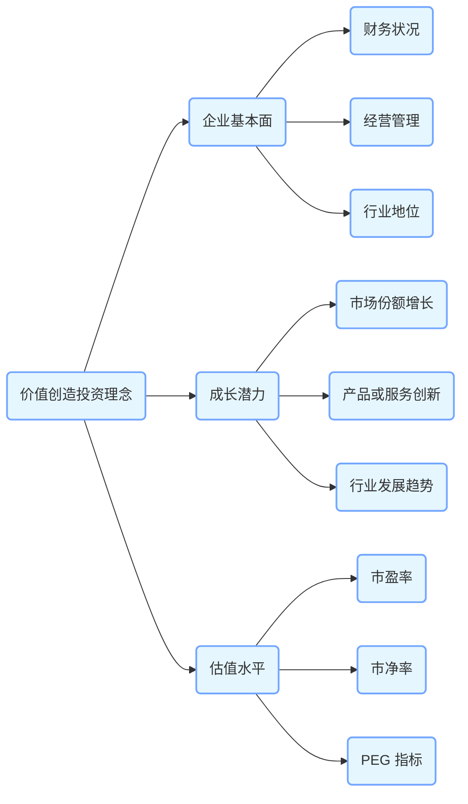

# 彼得林奇的“价值创造”投资理念

> 关键词：彼得林奇、价值创造、投资理念、成长股、基本面分析

> 摘要：本文深入探讨了彼得林奇的“价值创造”投资理念。首先介绍了该理念产生的背景和适用范围，明确预期读者。接着阐述了核心概念及相互联系，分析核心算法原理并给出具体操作步骤，用数学模型和公式对其进行量化解读。通过项目实战展示代码实现案例，分析其在实际应用场景中的表现。推荐了相关学习资源、开发工具和论文著作。最后总结了该投资理念的未来发展趋势与挑战，解答常见问题并提供扩展阅读和参考资料，帮助读者全面理解和运用彼得林奇的“价值创造”投资理念。

## 1. 背景介绍 
### 1.1 目的和范围
彼得林奇是投资界的传奇人物，他的“价值创造”投资理念影响深远。本文的目的是深入剖析这一投资理念，帮助投资者理解其核心思想、操作方法以及在实际投资中的应用。范围涵盖该理念的理论基础、具体操作步骤、数学模型、实际案例分析以及未来发展趋势等方面。

### 1.2 预期读者
本文预期读者包括对投资领域感兴趣的初学者，希望通过学习彼得林奇的投资理念来建立正确的投资思维；有一定投资经验但希望进一步优化投资策略的中级投资者；以及专业的投资研究人员，他们可以从本文中获取关于“价值创造”投资理念的深度分析和最新研究动态。

### 1.3 文档结构概述
本文将按照以下结构展开：首先介绍核心概念与联系，让读者对“价值创造”投资理念有一个初步的认识；接着阐述核心算法原理和具体操作步骤，为投资者提供实践指导；通过数学模型和公式对该理念进行量化分析，增强其科学性和可操作性；进行项目实战，展示代码实际案例并详细解释说明；探讨实际应用场景，让读者了解该理念在不同市场环境中的应用；推荐相关的工具和资源，帮助读者进一步学习和研究；总结未来发展趋势与挑战，为投资者提供前瞻性的思考；最后解答常见问题并提供扩展阅读和参考资料。

### 1.4 术语表
#### 1.4.1 核心术语定义
- **价值创造**：企业通过自身的经营活动，为股东、客户、员工等利益相关者创造价值的过程。在投资领域，价值创造意味着企业能够持续提高盈利能力和市场竞争力，从而提升股票的内在价值。
- **成长股**：指那些销售额和利润额持续增长，且增长速度快于整个经济平均增长速度的股票。成长股通常具有较高的市盈率，但投资者愿意为其未来的增长潜力支付较高的价格。
- **基本面分析**：通过对企业的财务状况、经营管理、行业前景等基本因素进行分析，评估企业的内在价值和投资价值的方法。

#### 1.4.2 相关概念解释
- **PEG 指标**：即市盈率相对盈利增长比率，是用公司的市盈率除以公司的盈利增长速度。该指标可以帮助投资者评估股票的估值是否合理，当 PEG 小于 1 时，通常认为股票被低估。
- **股东权益回报率（ROE）**：是净利润与平均股东权益的百分比，反映了股东权益的收益水平，用以衡量公司运用自有资本的效率。ROE 越高，说明公司为股东创造价值的能力越强。

#### 1.4.3 缩略词列表
- **PEG**：Price/Earnings to Growth Ratio
- **ROE**：Return on Equity

## 2. 核心概念与联系 
彼得林奇的“价值创造”投资理念核心在于寻找那些能够通过自身经营活动创造价值的企业，并长期持有其股票。其核心概念包括企业的基本面、成长潜力和估值水平，它们之间相互联系、相互影响。

### 核心概念原理
- **企业基本面**：是指企业的财务状况、经营管理、行业地位等基本情况。良好的基本面是企业创造价值的基础，包括稳定的盈利能力、合理的资产负债结构、优秀的管理团队等。
- **成长潜力**：企业的成长潜力是价值创造的关键因素。具有高成长潜力的企业能够不断扩大市场份额、提高产品或服务的质量，从而实现销售额和利润的持续增长。
- **估值水平**：估值水平反映了市场对企业价值的评估。合理的估值是投资成功的重要保障，投资者应该在企业价值被低估时买入股票，在价值被高估时卖出股票。

### 架构的文本示意图
```plaintext
价值创造投资理念
|-- 企业基本面
|   |-- 财务状况
|   |-- 经营管理
|   |-- 行业地位
|-- 成长潜力
|   |-- 市场份额增长
|   |-- 产品或服务创新
|   |-- 行业发展趋势
|-- 估值水平
|   |-- 市盈率
|   |-- 市净率
|   |-- PEG 指标
```

### Mermaid 流程图


## 3. 核心算法原理 & 具体操作步骤 
### 核心算法原理
彼得林奇的“价值创造”投资理念核心算法可以基于基本面分析和成长股筛选来实现。通过对企业的财务指标进行分析，筛选出具有高成长潜力和合理估值的股票。以下是一个简化的 Python 代码示例，用于筛选符合条件的股票：

```python
import pandas as pd

# 定义一个函数来筛选股票
def screen_stocks(data):
    # 筛选出 ROE 大于 15% 的股票
    roe_filter = data['ROE'] > 0.15
    # 筛选出 PEG 小于 1 的股票
    peg_filter = data['PEG'] < 1
    # 筛选出营业收入增长率大于 10% 的股票
    revenue_growth_filter = data['Revenue_Growth'] > 0.1
    # 综合筛选条件
    final_filter = roe_filter & peg_filter & revenue_growth_filter
    # 返回符合条件的股票数据
    return data[final_filter]

# 示例数据
data = pd.DataFrame({
    'Stock_Code': ['000001', '000002', '000003'],
    'ROE': [0.2, 0.12, 0.18],
    'PEG': [0.8, 1.2, 0.9],
    'Revenue_Growth': [0.15, 0.08, 0.2]
})

# 调用筛选函数
result = screen_stocks(data)
print(result)
```

### 具体操作步骤
1. **数据收集**：收集企业的财务数据，包括 ROE、PEG、营业收入增长率等指标。可以通过金融数据网站、证券交易所等渠道获取数据。
2. **数据预处理**：对收集到的数据进行清洗和整理，去除缺失值和异常值。
3. **筛选条件设定**：根据彼得林奇的投资理念，设定筛选条件，如 ROE 大于 15%、PEG 小于 1 等。
4. **股票筛选**：使用 Python 代码或其他数据分析工具，根据设定的筛选条件筛选出符合要求的股票。
5. **深入研究**：对筛选出的股票进行深入研究，了解企业的基本面、成长潜力和行业前景，评估其投资价值。
6. **投资决策**：根据研究结果，做出投资决策，选择合适的股票进行投资。

## 4. 数学模型和公式 & 详细讲解 & 举例说明 
### 数学模型和公式
- **市盈率（PE）**：$PE = \frac{股价}{每股收益}$
    - 市盈率反映了市场对企业盈利的预期。较高的市盈率意味着市场对企业未来的盈利增长有较高的期望，但也可能意味着股票被高估。
- **市净率（PB）**：$PB = \frac{股价}{每股净资产}$
    - 市净率反映了股票价格与企业净资产的关系。较低的市净率可能意味着股票被低估，但也可能反映了企业的盈利能力较弱。
- **PEG 指标**：$PEG = \frac{PE}{盈利增长率}$
    - PEG 指标综合考虑了市盈率和盈利增长率，用于评估股票的估值是否合理。当 PEG 小于 1 时，通常认为股票被低估。
- **股东权益回报率（ROE）**：$ROE = \frac{净利润}{平均股东权益}$
    - ROE 反映了企业运用自有资本的效率，是衡量企业盈利能力的重要指标。较高的 ROE 意味着企业能够为股东创造更多的价值。

### 详细讲解
- **市盈率（PE）**：市盈率是投资者最常用的估值指标之一。例如，某股票的股价为 20 元，每股收益为 1 元，则该股票的市盈率为 20 倍。这意味着投资者愿意为该股票的每 1 元盈利支付 20 元的价格。
- **市净率（PB）**：市净率可以帮助投资者判断股票的价格是否合理。例如，某股票的股价为 10 元，每股净资产为 5 元，则该股票的市净率为 2 倍。如果该行业的平均市净率为 3 倍，则该股票可能被低估。
- **PEG 指标**：PEG 指标考虑了企业的盈利增长因素，更适合用于评估成长股的估值。例如，某股票的市盈率为 30 倍，盈利增长率为 30%，则该股票的 PEG 为 1。如果该股票的 PEG 小于 1，则说明其估值相对较低，具有投资价值。
- **股东权益回报率（ROE）**：ROE 反映了企业的盈利能力和股东权益的增值情况。例如，某企业的净利润为 100 万元，平均股东权益为 500 万元，则该企业的 ROE 为 20%。较高的 ROE 表明企业能够有效地利用股东的资金，为股东创造更多的价值。

### 举例说明
假设我们要评估两家公司 A 和 B 的投资价值。以下是两家公司的财务数据：

| 公司 | 股价（元） | 每股收益（元） | 每股净资产（元） | 盈利增长率 |
| ---- | ---- | ---- | ---- | ---- |
| A | 50 | 2 | 10 | 20% |
| B | 30 | 1 | 5 | 30% |

- **市盈率（PE）**：
    - 公司 A 的 PE = $\frac{50}{2} = 25$ 倍
    - 公司 B 的 PE = $\frac{30}{1} = 30$ 倍
    - 从市盈率来看，公司 A 的估值相对较低。
- **市净率（PB）**：
    - 公司 A 的 PB = $\frac{50}{10} = 5$ 倍
    - 公司 B 的 PB = $\frac{30}{5} = 6$ 倍
    - 从市净率来看，公司 A 的估值也相对较低。
- **PEG 指标**：
    - 公司 A 的 PEG = $\frac{25}{20} = 1.25$
    - 公司 B 的 PEG = $\frac{30}{30} = 1$
    - 从 PEG 指标来看，公司 B 的估值相对更合理。
- **股东权益回报率（ROE）**：
    - 公司 A 的 ROE = $\frac{2}{10} = 20\%$
    - 公司 B 的 ROE = $\frac{1}{5} = 20\%$
    - 两家公司的 ROE 相同，说明它们的盈利能力相当。

综合考虑以上指标，公司 B 的 PEG 指标更优，虽然其市盈率和市净率略高于公司 A，但从成长股的角度来看，公司 B 可能具有更高的投资价值。

## 5. 项目实战：代码实际案例和详细解释说明 
### 5.1  开发环境搭建
为了实现基于彼得林奇“价值创造”投资理念的股票筛选程序，我们需要搭建以下开发环境：
- **Python 环境**：建议使用 Python 3.7 及以上版本。可以从 Python 官方网站（https://www.python.org/downloads/）下载并安装。
- **开发工具**：推荐使用 PyCharm 或 Jupyter Notebook 作为开发工具。PyCharm 是一款专业的 Python 集成开发环境，功能强大；Jupyter Notebook 则适合进行交互式编程和数据分析。
- **相关库**：需要安装 pandas、numpy 等数据分析库。可以使用以下命令进行安装：
```bash
pip install pandas numpy
```

### 5.2  源代码详细实现和代码解读
以下是一个完整的 Python 代码示例，用于实现基于彼得林奇投资理念的股票筛选程序：

```python
import pandas as pd

# 定义一个函数来计算 PEG 指标
def calculate_peg(data):
    data['PEG'] = data['PE'] / data['Earnings_Growth']
    return data

# 定义一个函数来筛选股票
def screen_stocks(data):
    # 筛选出 ROE 大于 15% 的股票
    roe_filter = data['ROE'] > 0.15
    # 筛选出 PEG 小于 1 的股票
    peg_filter = data['PEG'] < 1
    # 筛选出营业收入增长率大于 10% 的股票
    revenue_growth_filter = data['Revenue_Growth'] > 0.1
    # 综合筛选条件
    final_filter = roe_filter & peg_filter & revenue_growth_filter
    # 返回符合条件的股票数据
    return data[final_filter]

# 示例数据
data = pd.DataFrame({
    'Stock_Code': ['000001', '000002', '000003'],
    'PE': [20, 30, 25],
    'Earnings_Growth': [0.2, 0.3, 0.25],
    'ROE': [0.2, 0.12, 0.18],
    'Revenue_Growth': [0.15, 0.08, 0.2]
})

# 计算 PEG 指标
data = calculate_peg(data)

# 调用筛选函数
result = screen_stocks(data)

# 输出筛选结果
print(result)
```

### 代码解读与分析
1. **导入必要的库**：使用 `import pandas as pd` 导入 pandas 库，用于数据处理和分析。
2. **定义计算 PEG 指标的函数**：`calculate_peg` 函数接受一个 DataFrame 作为输入，计算并添加 PEG 指标列。
3. **定义筛选股票的函数**：`screen_stocks` 函数接受一个 DataFrame 作为输入，根据 ROE、PEG 和营业收入增长率等条件筛选出符合要求的股票。
4. **准备示例数据**：创建一个包含股票代码、市盈率、盈利增长率、ROE 和营业收入增长率等信息的 DataFrame。
5. **计算 PEG 指标**：调用 `calculate_peg` 函数计算 PEG 指标。
6. **筛选股票**：调用 `screen_stocks` 函数筛选出符合条件的股票。
7. **输出筛选结果**：使用 `print` 函数输出筛选结果。

通过以上代码，我们可以实现基于彼得林奇投资理念的股票筛选程序，帮助投资者快速找到具有投资价值的股票。

## 6. 实际应用场景 
彼得林奇的“价值创造”投资理念在实际投资中有广泛的应用场景，以下是一些常见的应用场景：
- **个人投资者**：个人投资者可以使用该理念进行股票投资。通过分析企业的基本面、成长潜力和估值水平，选择具有投资价值的股票进行长期投资。例如，个人投资者可以关注那些具有高 ROE、低 PEG 和高营业收入增长率的成长股，在股票价格被低估时买入，长期持有等待价值回归。
- **基金经理**：基金经理可以将该理念应用于基金的投资组合管理。通过筛选符合条件的股票，构建具有较高投资价值的投资组合，为基金投资者创造收益。例如，基金经理可以根据市场情况和投资目标，调整投资组合中不同股票的权重，以实现风险和收益的平衡。
- **企业战略投资**：企业在进行战略投资时，可以借鉴该理念评估目标企业的价值。通过分析目标企业的基本面、成长潜力和行业前景，判断其是否具有投资价值。例如，企业可以选择投资那些与自身业务具有协同效应、具有高成长潜力的企业，以实现资源共享和价值创造。
- **风险投资**：风险投资机构在选择投资项目时，可以使用该理念评估创业企业的价值。通过分析创业企业的商业模式、技术创新能力和市场前景，判断其是否具有高成长潜力和投资价值。例如，风险投资机构可以关注那些具有独特技术和创新商业模式的创业企业，在其发展初期进行投资，等待企业成长壮大后获得高额回报。

## 7. 工具和资源推荐
### 7.1 学习资源推荐
#### 7.1.1 书籍推荐
- 《彼得·林奇的成功投资》：彼得·林奇本人所著，详细介绍了他的投资理念、选股方法和投资策略，是学习彼得林奇投资理念的经典之作。
- 《战胜华尔街》：同样是彼得·林奇的著作，书中分享了他在富达麦哲伦基金的投资经验和案例，对投资者具有很高的参考价值。
- 《聪明的投资者》：本杰明·格雷厄姆的经典著作，强调了价值投资的重要性，为彼得林奇的投资理念提供了理论基础。

#### 7.1.2 在线课程
- Coursera 上的“投资学原理”：该课程由知名大学教授授课，涵盖了投资学的基本原理和方法，对理解彼得林奇的投资理念有很大帮助。
- edX 上的“金融市场”：课程介绍了金融市场的基本知识和投资策略，包括价值投资和成长投资等内容。

#### 7.1.3 技术博客和网站
- 雪球网：国内知名的投资社区，投资者可以在上面分享投资经验、交流投资心得，获取最新的市场信息和研究报告。
- 东方财富网：提供丰富的金融数据和资讯，包括股票行情、财务报表、研究报告等，方便投资者进行基本面分析。

### 7.2 开发工具框架推荐
#### 7.2.1 IDE和编辑器
- PyCharm：专业的 Python 集成开发环境，具有代码编辑、调试、自动补全、代码分析等功能，适合开发复杂的 Python 程序。
- Jupyter Notebook：交互式编程环境，支持多种编程语言，适合进行数据分析和可视化，方便投资者进行数据探索和模型验证。

#### 7.2.2 调试和性能分析工具
- pdb：Python 内置的调试工具，可以帮助开发者定位和解决代码中的问题。
- cProfile：Python 标准库中的性能分析工具，可以分析代码的运行时间和函数调用次数，帮助开发者优化代码性能。

#### 7.2.3 相关框架和库
- pandas：强大的数据分析库，提供了丰富的数据结构和数据处理方法，方便投资者进行数据清洗、整理和分析。
- numpy：高性能的数值计算库，支持多维数组和矩阵运算，在数据分析和机器学习中广泛应用。

### 7.3 相关论文著作推荐
#### 7.3.1 经典论文
- “The Cross - Section of Expected Stock Returns”（Fama and French，1992）：该论文提出了著名的 Fama - French 三因子模型，对股票收益率的影响因素进行了深入研究，为投资组合理论提供了重要的理论基础。
- “Common Risk Factors in the Returns on Stocks and Bonds”（Fama and French，1993）：进一步扩展了三因子模型，考虑了市场风险、规模因子和价值因子对股票和债券收益率的影响。

#### 7.3.2 最新研究成果
- 近年来，随着人工智能和机器学习技术的发展，越来越多的研究将这些技术应用于投资领域。例如，使用深度学习模型预测股票价格、使用自然语言处理技术分析新闻和公告对股票价格的影响等。

#### 7.3.3 应用案例分析
- 可以参考一些知名投资机构或基金经理的投资案例分析，了解他们如何运用彼得林奇的投资理念进行投资决策，以及取得的投资业绩。例如，巴菲特的伯克希尔·哈撒韦公司的投资案例，对投资者有很大的启发。

## 8. 总结：未来发展趋势与挑战
### 未来发展趋势
- **智能化投资**：随着人工智能和机器学习技术的不断发展，智能化投资将成为未来的发展趋势。投资者可以使用机器学习模型对海量的金融数据进行分析和挖掘，发现潜在的投资机会。例如，使用深度学习模型预测股票价格走势、使用自然语言处理技术分析新闻和公告对股票价格的影响等。
- **可持续投资**：越来越多的投资者开始关注企业的社会责任和可持续发展能力。未来，可持续投资将成为主流投资理念之一。投资者将更加注重企业的环境、社会和治理（ESG）表现，选择那些具有良好 ESG 表现的企业进行投资。
- **全球化投资**：随着全球经济一体化的发展，投资者将有更多的机会进行全球化投资。投资者可以通过投资海外市场，分散投资风险，获取更高的投资回报。例如，投资新兴市场国家的股票和债券，分享这些国家经济快速发展的红利。

### 挑战
- **数据质量和可靠性**：智能化投资需要大量的高质量金融数据作为支撑。然而，目前金融数据的质量和可靠性存在一定的问题，例如数据缺失、数据错误、数据不一致等。这些问题会影响机器学习模型的准确性和可靠性，给投资决策带来风险。
- **市场不确定性**：金融市场充满了不确定性，股票价格受到多种因素的影响，如宏观经济环境、政策变化、公司业绩等。即使使用先进的投资理念和技术，也难以准确预测市场走势和股票价格的变化。投资者需要具备较强的风险意识和风险管理能力，以应对市场不确定性带来的挑战。
- **竞争加剧**：随着投资市场的不断发展，投资者的数量和投资机构的数量不断增加，市场竞争日益激烈。投资者需要不断提升自己的投资能力和专业水平，才能在激烈的市场竞争中脱颖而出。

## 9. 附录：常见问题与解答
### 问题 1：彼得林奇的“价值创造”投资理念适合所有投资者吗？
解答：彼得林奇的投资理念虽然具有很高的参考价值，但并不适合所有投资者。该理念需要投资者具备一定的财务知识和分析能力，能够对企业的基本面进行深入研究。对于缺乏投资经验和专业知识的投资者来说，可能难以准确把握该理念的精髓。此外，该理念强调长期投资，需要投资者具备较强的耐心和风险承受能力。

### 问题 2：如何判断企业的成长潜力？
解答：判断企业的成长潜力可以从以下几个方面入手：
- **市场需求**：分析企业所处行业的市场需求是否具有增长潜力。如果行业市场需求不断扩大，企业有望受益于行业的发展。
- **产品或服务创新**：关注企业的产品或服务是否具有创新性和竞争力。具有创新能力的企业能够不断推出新产品或服务，满足市场需求，从而实现业务增长。
- **管理团队**：评估企业的管理团队是否具有优秀的领导能力和战略眼光。优秀的管理团队能够制定合理的发展战略，带领企业实现持续增长。
- **财务指标**：分析企业的财务指标，如营业收入增长率、净利润增长率、ROE 等。较高的财务指标表明企业具有较强的盈利能力和成长潜力。

### 问题 3：PEG 指标是否适用于所有行业？
解答：PEG 指标并不是适用于所有行业。该指标更适合用于评估成长股的估值，对于一些成熟行业或周期性行业，PEG 指标的参考价值可能有限。例如，在一些传统制造业中，企业的盈利增长相对稳定，PEG 指标可能无法准确反映其投资价值。此外，PEG 指标的计算需要准确的盈利增长率数据，而一些企业的盈利增长可能受到多种因素的影响，数据的准确性和可靠性可能存在问题。因此，在使用 PEG 指标时，需要结合其他估值指标和行业特点进行综合分析。

## 10. 扩展阅读 & 参考资料
### 扩展阅读
- 《金融炼金术》：乔治·索罗斯的著作，介绍了他的反身性理论和投资哲学，对投资者的思维方式和投资策略有很大的启发。
- 《投资最重要的事》：霍华德·马克斯的著作，分享了他在投资领域的经验和见解，强调了风险控制和逆向投资的重要性。

### 参考资料
- 《彼得·林奇的成功投资》，彼得·林奇著
- 《战胜华尔街》，彼得·林奇著
- 《聪明的投资者》，本杰明·格雷厄姆著
- “The Cross - Section of Expected Stock Returns”，Fama and French，1992
- “Common Risk Factors in the Returns on Stocks and Bonds”，Fama and French，1993

作者：AI天才研究院/AI Genius Institute & 禅与计算机程序设计艺术 /Zen And The Art of Computer Programming