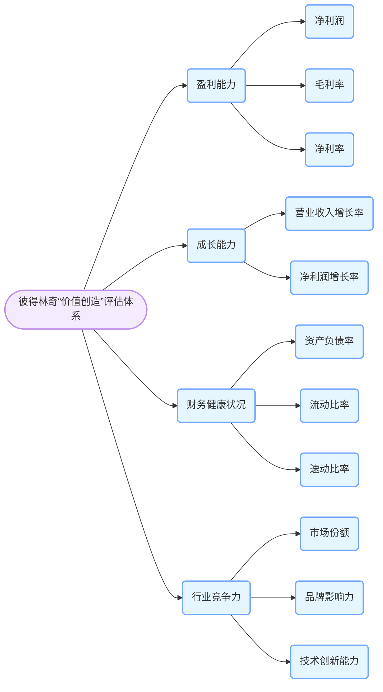

# 彼得林奇的"价值创造"评估体系

> 关键词：彼得林奇、价值创造评估体系、股票投资、财务分析、企业评估

> 摘要：本文深入探讨了彼得林奇的“价值创造”评估体系。彼得林奇作为投资界的传奇人物，其评估体系对于股票投资和企业价值判断具有重要指导意义。文章首先介绍了该体系的背景，包括目的、预期读者等内容；接着阐述了核心概念与联系，通过文本示意图和Mermaid流程图进行清晰展示；详细讲解了核心算法原理和具体操作步骤，并结合Python源代码进行说明；深入分析了数学模型和公式，并举例说明；通过项目实战给出代码实际案例并详细解释；探讨了该评估体系的实际应用场景；推荐了相关的学习资源、开发工具框架以及论文著作；最后总结了未来发展趋势与挑战，还设置了附录解答常见问题，并提供了扩展阅读和参考资料，旨在帮助读者全面理解和运用彼得林奇的“价值创造”评估体系。

## 1. 背景介绍 
### 1.1 目的和范围
彼得林奇的“价值创造”评估体系旨在帮助投资者筛选出具有投资价值的股票，通过对企业多个方面的评估，判断企业是否真正创造价值，从而为投资决策提供依据。该体系的范围涵盖了企业的财务状况、业务模式、行业竞争力等多个维度，从微观层面深入分析企业的运营情况，以确定其在市场中的地位和未来发展潜力。通过运用这一体系，投资者可以更准确地评估企业的内在价值，避免盲目投资，提高投资回报率。

### 1.2 预期读者
本文的预期读者主要包括股票投资者、金融分析师、企业管理人员以及对投资和企业评估感兴趣的人士。对于股票投资者来说，了解彼得林奇的评估体系可以帮助他们在众多股票中找到更有潜力的投资标的；金融分析师可以借助该体系更全面地分析企业，为客户提供更专业的投资建议；企业管理人员可以通过该体系审视自身企业的运营状况，发现问题并加以改进；而对投资和企业评估感兴趣的人士则可以通过学习该体系，拓宽自己的知识视野，提升对金融市场和企业运营的理解。

### 1.3 文档结构概述
本文将按照以下结构展开：首先介绍核心概念与联系，通过文本示意图和Mermaid流程图清晰呈现体系的基本构成和各要素之间的关系；接着详细阐述核心算法原理和具体操作步骤，使用Python源代码进行说明，让读者能够直观地了解如何运用该体系进行评估；然后介绍数学模型和公式，并结合实际例子进行讲解，帮助读者理解评估的理论基础；通过项目实战部分，给出代码实际案例并详细解释，让读者能够将理论应用到实际中；探讨该评估体系的实际应用场景，展示其在不同情况下的作用；推荐相关的学习资源、开发工具框架以及论文著作，为读者提供进一步学习和研究的途径；最后总结未来发展趋势与挑战，设置附录解答常见问题，并提供扩展阅读和参考资料，使读者能够全面深入地了解彼得林奇的“价值创造”评估体系。

### 1.4 术语表
#### 1.4.1 核心术语定义
- **价值创造**：指企业通过自身的经营活动，为股东、员工、客户等利益相关者创造出超过其投入成本的价值。在彼得林奇的评估体系中，价值创造是衡量企业是否值得投资的关键指标。
- **内在价值**：企业在未来持续经营过程中所能产生的现金流量的现值。它是企业真正的价值所在，与市场价格可能存在差异。投资者通过评估企业的内在价值，判断股票是否被低估或高估。
- **市盈率（P/E）**：股票价格与每股收益的比率，反映了市场对企业盈利的预期。较低的市盈率可能表示股票被低估，具有投资价值；而较高的市盈率则可能意味着市场对企业的未来增长预期较高，但也可能存在泡沫。
- **市净率（P/B）**：股票价格与每股净资产的比率，用于衡量股票价格相对于每股净资产的倍数。市净率较低的股票可能具有一定的安全边际，因为即使企业清算，股东也能获得相对较高的回报。

#### 1.4.2 相关概念解释
- **成长股**：指那些具有较高的盈利增长速度和发展潜力的股票。这类股票通常来自于新兴行业或具有创新能力的企业，其股价可能会随着企业的成长而大幅上涨。
- **价值股**：指那些股价相对其内在价值被低估的股票。这些股票可能来自于传统行业，企业的盈利相对稳定，但市场对其关注度较低，导致股价未能充分反映其真实价值。
- **现金流**：企业在一定时期内现金的流入和流出情况。正的现金流表示企业有足够的现金来支付债务、扩大生产等，是企业健康运营的重要标志。

#### 1.4.3 缩略词列表
- **P/E**：市盈率（Price-to-Earnings Ratio）
- **P/B**：市净率（Price-to-Book Ratio）
- **EPS**：每股收益（Earnings Per Share）
- **ROE**：净资产收益率（Return on Equity）

## 2. 核心概念与联系 
彼得林奇的“价值创造”评估体系核心在于综合评估企业的多个方面，以判断企业是否能够持续创造价值。该体系主要涉及以下几个核心概念：企业的盈利能力、成长能力、财务健康状况和行业竞争力。

### 核心概念原理
- **盈利能力**：企业的盈利能力是价值创造的基础。只有具备良好的盈利能力，企业才能为股东提供回报，实现价值增长。常用的衡量指标包括净利润、毛利率、净利率等。净利润反映了企业在扣除所有成本和费用后的盈利情况；毛利率则体现了企业产品或服务的基本盈利空间；净利率则更全面地考虑了企业的经营效率和成本控制能力。
- **成长能力**：成长能力是企业未来价值创造的关键。具有高成长能力的企业能够不断扩大市场份额，提高盈利能力，从而为投资者带来更高的回报。衡量成长能力的指标包括营业收入增长率、净利润增长率等。营业收入增长率反映了企业业务的扩张速度；净利润增长率则更直接地体现了企业盈利的增长情况。
- **财务健康状况**：良好的财务健康状况是企业持续经营和价值创造的保障。企业需要有合理的资产负债结构，足够的现金流来应对各种风险。常用的财务健康指标包括资产负债率、流动比率、速动比率等。资产负债率反映了企业的负债水平；流动比率和速动比率则衡量了企业的短期偿债能力。
- **行业竞争力**：企业所处的行业环境和自身的竞争力也会影响其价值创造能力。在一个竞争激烈的行业中，具有竞争优势的企业能够更好地抵御竞争对手的挑战，实现价值增长。衡量行业竞争力的指标包括市场份额、品牌影响力、技术创新能力等。

### 架构的文本示意图
```
彼得林奇的“价值创造”评估体系
|--盈利能力
|   |--净利润
|   |--毛利率
|   |--净利率
|--成长能力
|   |--营业收入增长率
|   |--净利润增长率
|--财务健康状况
|   |--资产负债率
|   |--流动比率
|   |--速动比率
|--行业竞争力
|   |--市场份额
|   |--品牌影响力
|   |--技术创新能力
```

### Mermaid流程图


## 3. 核心算法原理 & 具体操作步骤 
### 核心算法原理
彼得林奇的“价值创造”评估体系并没有一个固定的、统一的算法，而是通过对多个指标的综合分析来评估企业的价值创造能力。以下是一种常见的评估思路：

首先，分别计算企业的盈利能力、成长能力、财务健康状况和行业竞争力等方面的指标值。然后，根据这些指标值对企业进行打分，每个指标可以根据其重要性赋予不同的权重。最后，将各项指标的得分加权求和，得到企业的综合评估得分。综合评估得分越高，说明企业的价值创造能力越强，越具有投资价值。

### 具体操作步骤
#### 步骤1：收集数据
收集企业的财务报表、行业研究报告等相关数据，获取计算各项指标所需的信息。

#### 步骤2：计算指标值
- **盈利能力指标计算**：
    - 净利润 = 营业收入 - 营业成本 - 税金及附加 - 销售费用 - 管理费用 - 研发费用 - 财务费用 + 其他收益 + 投资收益等
    - 毛利率 = （营业收入 - 营业成本）/ 营业收入 × 100%
    - 净利率 = 净利润 / 营业收入 × 100%

- **成长能力指标计算**：
    - 营业收入增长率 = （本期营业收入 - 上期营业收入）/ 上期营业收入 × 100%
    - 净利润增长率 = （本期净利润 - 上期净利润）/ 上期净利润 × 100%

- **财务健康状况指标计算**：
    - 资产负债率 = 负债总额 / 资产总额 × 100%
    - 流动比率 = 流动资产 / 流动负债
    - 速动比率 = （流动资产 - 存货）/ 流动负债

- **行业竞争力指标计算**：
    - 市场份额 = 企业的营业收入 / 行业总营业收入 × 100%
    - 品牌影响力和技术创新能力可以通过市场调研、行业排名等方式进行定性评估。

#### 步骤3：指标打分
根据各项指标的数值，按照一定的标准进行打分。例如，可以将指标数值分为不同的区间，每个区间对应一个分数。

#### 步骤4：确定权重
根据各项指标的重要性，确定其在综合评估中的权重。权重的确定可以根据经验、行业特点等因素进行调整。

#### 步骤5：计算综合得分
将各项指标的得分乘以其对应的权重，然后求和，得到企业的综合评估得分。

### Python源代码实现
```python
# 示例数据
# 假设我们有两家企业的数据
company1 = {
    "net_profit": 1000,
    "revenue": 5000,
    "cost_of_goods_sold": 3000,
    "previous_revenue": 4500,
    "previous_net_profit": 900,
    "total_assets": 8000,
    "total_liabilities": 3000,
    "current_assets": 4000,
    "current_liabilities": 2000,
    "inventory": 1000,
    "industry_revenue": 50000
}

company2 = {
    "net_profit": 1200,
    "revenue": 6000,
    "cost_of_goods_sold": 3500,
    "previous_revenue": 5000,
    "previous_net_profit": 1000,
    "total_assets": 9000,
    "total_liabilities": 4000,
    "current_assets": 4500,
    "current_liabilities": 2200,
    "inventory": 1200,
    "industry_revenue": 50000
}

# 定义指标计算函数
def calculate_profitability(company):
    net_profit = company["net_profit"]
    revenue = company["revenue"]
    cost_of_goods_sold = company["cost_of_goods_sold"]
    gross_margin = (revenue - cost_of_goods_sold) / revenue * 100
    net_margin = net_profit / revenue * 100
    return gross_margin, net_margin

def calculate_growth(company):
    revenue = company["revenue"]
    previous_revenue = company["previous_revenue"]
    net_profit = company["net_profit"]
    previous_net_profit = company["previous_net_profit"]
    revenue_growth = (revenue - previous_revenue) / previous_revenue * 100
    net_profit_growth = (net_profit - previous_net_profit) / previous_net_profit * 100
    return revenue_growth, net_profit_growth

def calculate_financial_health(company):
    total_assets = company["total_assets"]
    total_liabilities = company["total_liabilities"]
    current_assets = company["current_assets"]
    current_liabilities = company["current_liabilities"]
    inventory = company["inventory"]
    debt_ratio = total_liabilities / total_assets * 100
    current_ratio = current_assets / current_liabilities
    quick_ratio = (current_assets - inventory) / current_liabilities
    return debt_ratio, current_ratio, quick_ratio

def calculate_market_share(company):
    revenue = company["revenue"]
    industry_revenue = company["industry_revenue"]
    market_share = revenue / industry_revenue * 100
    return market_share

# 计算各项指标
def calculate_all_metrics(company):
    gross_margin, net_margin = calculate_profitability(company)
    revenue_growth, net_profit_growth = calculate_growth(company)
    debt_ratio, current_ratio, quick_ratio = calculate_financial_health(company)
    market_share = calculate_market_share(company)
    return {
        "gross_margin": gross_margin,
        "net_margin": net_margin,
        "revenue_growth": revenue_growth,
        "net_profit_growth": net_profit_growth,
        "debt_ratio": debt_ratio,
        "current_ratio": current_ratio,
        "quick_ratio": quick_ratio,
        "market_share": market_share
    }

# 指标打分函数（简单示例）
def score_metrics(metrics):
    scores = {}
    # 毛利率打分
    if metrics["gross_margin"] > 40:
        scores["gross_margin"] = 5
    elif metrics["gross_margin"] > 30:
        scores["gross_margin"] = 4
    elif metrics["gross_margin"] > 20:
        scores["gross_margin"] = 3
    elif metrics["gross_margin"] > 10:
        scores["gross_margin"] = 2
    else:
        scores["gross_margin"] = 1
    
    # 净利率打分
    if metrics["net_margin"] > 20:
        scores["net_margin"] = 5
    elif metrics["net_margin"] > 15:
        scores["net_margin"] = 4
    elif metrics["net_margin"] > 10:
        scores["net_margin"] = 3
    elif metrics["net_margin"] > 5:
        scores["net_margin"] = 2
    else:
        scores["net_margin"] = 1
    
    # 营业收入增长率打分
    if metrics["revenue_growth"] > 30:
        scores["revenue_growth"] = 5
    elif metrics["revenue_growth"] > 20:
        scores["revenue_growth"] = 4
    elif metrics["revenue_growth"] > 10:
        scores["revenue_growth"] = 3
    elif metrics["revenue_growth"] > 5:
        scores["revenue_growth"] = 2
    else:
        scores["revenue_growth"] = 1
    
    # 净利润增长率打分
    if metrics["net_profit_growth"] > 30:
        scores["net_profit_growth"] = 5
    elif metrics["net_profit_growth"] > 20:
        scores["net_profit_growth"] = 4
    elif metrics["net_profit_growth"] > 10:
        scores["net_profit_growth"] = 3
    elif metrics["net_profit_growth"] > 5:
        scores["net_profit_growth"] = 2
    else:
        scores["net_profit_growth"] = 1
    
    # 资产负债率打分
    if metrics["debt_ratio"] < 30:
        scores["debt_ratio"] = 5
    elif metrics["debt_ratio"] < 40:
        scores["debt_ratio"] = 4
    elif metrics["debt_ratio"] < 50:
        scores["debt_ratio"] = 3
    elif metrics["debt_ratio"] < 60:
        scores["debt_ratio"] = 2
    else:
        scores["debt_ratio"] = 1
    
    # 流动比率打分
    if metrics["current_ratio"] > 2:
        scores["current_ratio"] = 5
    elif metrics["current_ratio"] > 1.5:
        scores["current_ratio"] = 4
    elif metrics["current_ratio"] > 1:
        scores["current_ratio"] = 3
    elif metrics["current_ratio"] > 0.8:
        scores["current_ratio"] = 2
    else:
        scores["current_ratio"] = 1
    
    # 速动比率打分
    if metrics["quick_ratio"] > 1.5:
        scores["quick_ratio"] = 5
    elif metrics["quick_ratio"] > 1:
        scores["quick_ratio"] = 4
    elif metrics["quick_ratio"] > 0.8:
        scores["quick_ratio"] = 3
    elif metrics["quick_ratio"] > 0.5:
        scores["quick_ratio"] = 2
    else:
        scores["quick_ratio"] = 1
    
    # 市场份额打分
    if metrics["market_share"] > 10:
        scores["market_share"] = 5
    elif metrics["market_share"] > 5:
        scores["market_share"] = 4
    elif metrics["market_share"] > 2:
        scores["market_share"] = 3
    elif metrics["market_share"] > 1:
        scores["market_share"] = 2
    else:
        scores["market_share"] = 1
    
    return scores

# 确定权重
weights = {
    "gross_margin": 0.1,
    "net_margin": 0.1,
    "revenue_growth": 0.2,
    "net_profit_growth": 0.2,
    "debt_ratio": 0.1,
    "current_ratio": 0.1,
    "quick_ratio": 0.1,
    "market_share": 0.1
}

# 计算综合得分
def calculate_total_score(scores, weights):
    total_score = 0
    for metric, score in scores.items():
        total_score += score * weights[metric]
    return total_score

# 计算两家企业的各项指标和综合得分
metrics1 = calculate_all_metrics(company1)
scores1 = score_metrics(metrics1)
total_score1 = calculate_total_score(scores1, weights)

metrics2 = calculate_all_metrics(company2)
scores2 = score_metrics(metrics2)
total_score2 = calculate_total_score(scores2, weights)

print(f"Company 1 total score: {total_score1}")
print(f"Company 2 total score: {total_score2}")
```

### 代码解释
上述代码首先定义了两家企业的示例数据，然后实现了一系列函数来计算各项指标，包括盈利能力、成长能力、财务健康状况和市场份额等。接着，定义了一个简单的指标打分函数，根据指标的数值范围给予相应的分数。最后，确定了各项指标的权重，并计算了两家企业的综合得分。通过比较综合得分，可以判断哪家企业的价值创造能力更强。

## 4. 数学模型和公式 & 详细讲解 & 举例说明 
### 数学模型和公式
#### 盈利能力指标
- **毛利率（$GM$）**：
$$GM = \frac{R - COGS}{R} \times 100\%$$
其中，$R$ 表示营业收入，$COGS$ 表示营业成本。

- **净利率（$NM$）**：
$$NM = \frac{NP}{R} \times 100\%$$
其中，$NP$ 表示净利润。

#### 成长能力指标
- **营业收入增长率（$RG$）**：
$$RG = \frac{R_t - R_{t-1}}{R_{t-1}} \times 100\%$$
其中，$R_t$ 表示本期营业收入，$R_{t-1}$ 表示上期营业收入。

- **净利润增长率（$NPG$）**：
$$NPG = \frac{NP_t - NP_{t-1}}{NP_{t-1}} \times 100\%$$
其中，$NP_t$ 表示本期净利润，$NP_{t-1}$ 表示上期净利润。

#### 财务健康状况指标
- **资产负债率（$DR$）**：
$$DR = \frac{TL}{TA} \times 100\%$$
其中，$TL$ 表示负债总额，$TA$ 表示资产总额。

- **流动比率（$CR$）**：
$$CR = \frac{CA}{CL}$$
其中，$CA$ 表示流动资产，$CL$ 表示流动负债。

- **速动比率（$QR$）**：
$$QR = \frac{CA - I}{CL}$$
其中，$I$ 表示存货。

#### 行业竞争力指标
- **市场份额（$MS$）**：
$$MS = \frac{R}{IR} \times 100\%$$
其中，$R$ 表示企业的营业收入，$IR$ 表示行业总营业收入。

### 详细讲解
#### 盈利能力指标
- **毛利率**：毛利率反映了企业产品或服务的基本盈利空间。较高的毛利率意味着企业在扣除直接成本后还有较多的利润可供支配，具有较强的盈利能力和成本控制能力。例如，一家科技公司的毛利率为 50%，说明每销售 100 元的产品，扣除 50 元的直接成本后，还有 50 元的毛利可以用于支付其他费用和创造利润。
- **净利率**：净利率考虑了企业的所有成本和费用，更全面地反映了企业的盈利能力。净利率越高，说明企业的经营效率越高，能够在扣除所有成本后获得更多的利润。例如，一家公司的净利率为 20%，表示每销售 100 元的产品，最终能够获得 20 元的净利润。

#### 成长能力指标
- **营业收入增长率**：营业收入增长率反映了企业业务的扩张速度。较高的营业收入增长率表明企业的产品或服务受到市场的欢迎，市场份额在不断扩大。例如，一家新兴的电商企业连续三年的营业收入增长率分别为 30%、40% 和 50%，说明该企业的业务处于快速增长阶段，具有较大的发展潜力。
- **净利润增长率**：净利润增长率直接体现了企业盈利的增长情况。如果净利润增长率高于营业收入增长率，说明企业的盈利能力在不断增强，成本控制和经营效率在提高。例如，一家企业的营业收入增长率为 20%，而净利润增长率为 30%，说明企业通过优化成本结构、提高产品附加值等方式，实现了盈利的快速增长。

#### 财务健康状况指标
- **资产负债率**：资产负债率反映了企业的负债水平。较低的资产负债率意味着企业的财务风险较小，有较强的偿债能力。一般来说，资产负债率在 30% - 50% 之间被认为是比较合理的。例如，一家企业的资产负债率为 40%，说明企业的负债占资产总额的 40%，相对较为稳健。
- **流动比率**：流动比率衡量了企业的短期偿债能力。流动比率大于 1 表示企业的流动资产能够覆盖流动负债，具有一定的短期偿债能力。一般来说，流动比率在 2 左右比较合适。例如，一家企业的流动比率为 2.5，说明企业每 1 元的流动负债有 2.5 元的流动资产作为保障。
- **速动比率**：速动比率是在流动比率的基础上，扣除了存货的影响，更准确地反映了企业的短期偿债能力。因为存货的变现能力相对较弱，可能存在积压、贬值等风险。一般来说，速动比率大于 1 比较理想。例如，一家企业的速动比率为 1.2，说明企业在不考虑存货的情况下，每 1 元的流动负债有 1.2 元的速动资产（如现金、应收账款等）作为保障。

#### 行业竞争力指标
- **市场份额**：市场份额反映了企业在行业中的地位。较高的市场份额意味着企业具有较强的竞争力，能够在市场中占据主导地位。例如，一家手机制造商在全球智能手机市场的市场份额为 20%，说明该企业在行业中具有较大的影响力，能够通过规模效应降低成本、提高利润。

### 举例说明
假设我们有一家制造业企业，其相关数据如下：
- 营业收入（$R$）：5000 万元
- 营业成本（$COGS$）：3000 万元
- 净利润（$NP$）：1000 万元
- 上期营业收入（$R_{t-1}$）：4500 万元
- 上期净利润（$NP_{t-1}$）：900 万元
- 负债总额（$TL$）：2000 万元
- 资产总额（$TA$）：8000 万元
- 流动资产（$CA$）：3000 万元
- 流动负债（$CL$）：1500 万元
- 存货（$I$）：800 万元
- 行业总营业收入（$IR$）：50000 万元

#### 盈利能力指标计算
- 毛利率（$GM$）：
$$GM = \frac{5000 - 3000}{5000} \times 100\% = 40\%$$
- 净利率（$NM$）：
$$NM = \frac{1000}{5000} \times 100\% = 20\%$$

#### 成长能力指标计算
- 营业收入增长率（$RG$）：
$$RG = \frac{5000 - 4500}{4500} \times 100\% \approx 11.11\%$$
- 净利润增长率（$NPG$）：
$$NPG = \frac{1000 - 900}{900} \times 100\% \approx 11.11\%$$

#### 财务健康状况指标计算
- 资产负债率（$DR$）：
$$DR = \frac{2000}{8000} \times 100\% = 25\%$$
- 流动比率（$CR$）：
$$CR = \frac{3000}{1500} = 2$$
- 速动比率（$QR$）：
$$QR = \frac{3000 - 800}{1500} \approx 1.47$$

#### 行业竞争力指标计算
- 市场份额（$MS$）：
$$MS = \frac{5000}{50000} \times 100\% = 10\%$$

通过以上计算，我们可以对该企业的价值创造能力有一个初步的了解。该企业的毛利率和净利率较高，说明盈利能力较强；营业收入增长率和净利润增长率较为稳定，表明企业处于持续发展阶段；资产负债率较低，流动比率和速动比率较为合理，说明财务健康状况良好；市场份额达到 10%，在行业中具有一定的竞争力。

## 5. 项目实战：代码实际案例和详细解释说明 
### 5.1  开发环境搭建
#### 安装Python
首先，确保你已经安装了Python。可以从Python官方网站（https://www.python.org/downloads/）下载适合你操作系统的Python版本，并按照安装向导进行安装。建议安装Python 3.x版本，因为它具有更多的新特性和更好的兼容性。

#### 安装必要的库
在项目中，我们需要使用一些Python库来处理数据和进行计算。可以使用以下命令来安装这些库：
```bash
pip install pandas numpy
```
- **pandas**：用于数据处理和分析，提供了强大的数据结构和数据操作功能。
- **numpy**：用于数值计算，提供了高效的数组操作和数学函数。

### 5.2  源代码详细实现和代码解读
```python
import pandas as pd
import numpy as np

# 读取企业财务数据文件（假设为CSV格式）
def read_financial_data(file_path):
    data = pd.read_csv(file_path)
    return data

# 计算各项指标
def calculate_metrics(data):
    # 盈利能力指标
    data['gross_margin'] = (data['revenue'] - data['cost_of_goods_sold']) / data['revenue'] * 100
    data['net_margin'] = data['net_profit'] / data['revenue'] * 100
    
    # 成长能力指标
    data['revenue_growth'] = (data['revenue'] - data['previous_revenue']) / data['previous_revenue'] * 100
    data['net_profit_growth'] = (data['net_profit'] - data['previous_net_profit']) / data['previous_net_profit'] * 100
    
    # 财务健康状况指标
    data['debt_ratio'] = data['total_liabilities'] / data['total_assets'] * 100
    data['current_ratio'] = data['current_assets'] / data['current_liabilities']
    data['quick_ratio'] = (data['current_assets'] - data['inventory']) / data['current_liabilities']
    
    # 行业竞争力指标
    data['market_share'] = data['revenue'] / data['industry_revenue'] * 100
    
    return data

# 指标打分函数
def score_metrics(data):
    # 毛利率打分
    data['gross_margin_score'] = np.where(data['gross_margin'] > 40, 5,
                                          np.where(data['gross_margin'] > 30, 4,
                                                   np.where(data['gross_margin'] > 20, 3,
                                                            np.where(data['gross_margin'] > 10, 2, 1))))
    
    # 净利率打分
    data['net_margin_score'] = np.where(data['net_margin'] > 20, 5,
                                        np.where(data['net_margin'] > 15, 4,
                                                 np.where(data['net_margin'] > 10, 3,
                                                          np.where(data['net_margin'] > 5, 2, 1))))
    
    # 营业收入增长率打分
    data['revenue_growth_score'] = np.where(data['revenue_growth'] > 30, 5,
                                            np.where(data['revenue_growth'] > 20, 4,
                                                     np.where(data['revenue_growth'] > 10, 3,
                                                              np.where(data['revenue_growth'] > 5, 2, 1))))
    
    # 净利润增长率打分
    data['net_profit_growth_score'] = np.where(data['net_profit_growth'] > 30, 5,
                                               np.where(data['net_profit_growth'] > 20, 4,
                                                        np.where(data['net_profit_growth'] > 10, 3,
                                                                 np.where(data['net_profit_growth'] > 5, 2, 1))))
    
    # 资产负债率打分
    data['debt_ratio_score'] = np.where(data['debt_ratio'] < 30, 5,
                                        np.where(data['debt_ratio'] < 40, 4,
                                                 np.where(data['debt_ratio'] < 50, 3,
                                                          np.where(data['debt_ratio'] < 60, 2, 1))))
    
    # 流动比率打分
    data['current_ratio_score'] = np.where(data['current_ratio'] > 2, 5,
                                           np.where(data['current_ratio'] > 1.5, 4,
                                                    np.where(data['current_ratio'] > 1, 3,
                                                             np.where(data['current_ratio'] > 0.8, 2, 1))))
    
    # 速动比率打分
    data['quick_ratio_score'] = np.where(data['quick_ratio'] > 1.5, 5,
                                         np.where(data['quick_ratio'] > 1, 4,
                                                  np.where(data['quick_ratio'] > 0.8, 3,
                                                           np.where(data['quick_ratio'] > 0.5, 2, 1))))
    
    # 市场份额打分
    data['market_share_score'] = np.where(data['market_share'] > 10, 5,
                                          np.where(data['market_share'] > 5, 4,
                                                   np.where(data['market_share'] > 2, 3,
                                                            np.where(data['market_share'] > 1, 2, 1))))
    
    return data

# 确定权重
weights = {
    "gross_margin_score": 0.1,
    "net_margin_score": 0.1,
    "revenue_growth_score": 0.2,
    "net_profit_growth_score": 0.2,
    "debt_ratio_score": 0.1,
    "current_ratio_score": 0.1,
    "quick_ratio_score": 0.1,
    "market_share_score": 0.1
}

# 计算综合得分
def calculate_total_score(data, weights):
    score_columns = [col for col in data.columns if col.endswith('_score')]
    data['total_score'] = 0
    for col in score_columns:
        data['total_score'] += data[col] * weights[col]
    return data

# 主函数
def main():
    file_path = 'financial_data.csv'  # 替换为实际的文件路径
    data = read_financial_data(file_path)
    data = calculate_metrics(data)
    data = score_metrics(data)
    data = calculate_total_score(data, weights)
    print(data[['company_name', 'total_score']])

if __name__ == "__main__":
    main()
```

### 5.3  代码解读与分析
#### 读取数据
`read_financial_data` 函数使用 `pandas` 库的 `read_csv` 函数读取企业的财务数据文件（假设为CSV格式），并返回一个 `DataFrame` 对象。

#### 计算指标
`calculate_metrics` 函数根据前面介绍的公式，计算企业的盈利能力、成长能力、财务健康状况和行业竞争力等各项指标，并将结果添加到 `DataFrame` 中。

#### 指标打分
`score_metrics` 函数根据指标的数值范围，使用 `numpy` 的 `where` 函数对各项指标进行打分，并将打分结果添加到 `DataFrame` 中。

#### 计算综合得分
`calculate_total_score` 函数根据预先设定的权重，将各项指标的得分加权求和，得到企业的综合得分，并将结果添加到 `DataFrame` 中。

#### 主函数
`main` 函数调用上述函数，完成数据读取、指标计算、打分和综合得分计算的整个流程，并打印出企业名称和综合得分。

通过这个项目实战，我们可以将彼得林奇的“价值创造”评估体系应用到实际的企业财务数据中，对企业的价值创造能力进行评估和比较。

## 6. 实际应用场景 
### 股票投资
彼得林奇的“价值创造”评估体系在股票投资中具有重要的应用价值。投资者可以使用该体系对不同的上市公司进行评估，筛选出具有较高价值创造能力的股票。例如，通过分析企业的盈利能力、成长能力、财务健康状况和行业竞争力等指标，投资者可以判断企业的内在价值，选择被低估的股票进行投资。同时，该体系也可以帮助投资者识别那些价值创造能力较弱的企业，避免投资风险。

### 企业并购
在企业并购过程中，收购方需要对目标企业进行全面的评估，以确定其是否具有投资价值。彼得林奇的评估体系可以为收购方提供一个系统的评估框架，帮助其分析目标企业的财务状况、业务模式和市场竞争力等方面。通过评估目标企业的价值创造能力，收购方可以合理确定收购价格，制定并购策略，提高并购的成功率。

### 企业战略规划
企业管理者可以使用该评估体系对自身企业的价值创造能力进行评估，发现企业的优势和不足，从而制定相应的战略规划。例如，如果企业的盈利能力较强，但成长能力不足，管理者可以考虑加大研发投入，开拓新市场，以提高企业的成长潜力。如果企业的财务健康状况不佳，管理者可以采取措施优化资产负债结构，提高资金使用效率。

### 行业研究
金融分析师和研究机构可以使用该评估体系对不同行业的企业进行比较分析，了解行业的发展趋势和竞争格局。通过分析行业内企业的价值创造能力，分析师可以发现行业的领先企业和潜在的投资机会，为投资者提供专业的研究报告和投资建议。

## 7. 工具和资源推荐
### 7.1 学习资源推荐
#### 7.1.1 书籍推荐
- 《彼得·林奇的成功投资》（*One Up on Wall Street*）：彼得·林奇的经典著作，详细介绍了他的投资理念和方法，包括如何选择股票、评估企业价值等内容。
- 《战胜华尔街》（*Beating the Street*）：该书进一步阐述了彼得·林奇的投资策略和实践经验，对投资者具有很高的参考价值。
- 《财务报表分析与证券定价》（*Financial Statement Analysis and Security Valuation*）：这本书系统地介绍了财务报表分析的方法和技术，以及如何运用财务报表信息进行证券定价，对于理解彼得林奇的评估体系具有重要的帮助。

#### 7.1.2 在线课程
- Coursera上的“投资学原理”（*Principles of Investments*）课程：该课程由知名大学的教授授课，涵盖了投资学的基本原理、股票投资、债券投资等内容，对于初学者来说是一个很好的学习资源。
- Udemy上的“财务报表分析实战”（*Financial Statement Analysis in Practice*）课程：该课程通过实际案例，详细讲解了财务报表分析的方法和技巧，帮助学员掌握如何运用财务报表评估企业的价值。

#### 7.1.3 技术博客和网站
- 雪球网（https://xueqiu.com/）：国内知名的投资社区，提供了丰富的股票分析、投资策略等内容，投资者可以在上面交流经验、分享观点。
- Seeking Alpha（https://seekingalpha.com/）：国外知名的投资研究网站，提供了大量的股票分析报告、财经新闻等内容，对于了解国际市场和学习投资分析方法具有重要的参考价值。

### 7.2 开发工具框架推荐
#### 7.2.1 IDE和编辑器
- PyCharm：一款专业的Python集成开发环境，具有代码编辑、调试、代码分析等功能，适合Python开发者使用。
- Jupyter Notebook：一个交互式的开发环境，支持Python等多种编程语言，方便用户进行数据分析和可视化。

#### 7.2.2 调试和性能分析工具
- PDB：Python自带的调试工具，可以帮助开发者定位代码中的问题。
- cProfile：Python的性能分析工具，可以分析代码的运行时间和资源消耗情况，帮助开发者优化代码性能。

#### 7.2.3 相关框架和库
- pandas：用于数据处理和分析，提供了强大的数据结构和数据操作功能。
- numpy：用于数值计算，提供了高效的数组操作和数学函数。
- matplotlib：用于数据可视化，支持多种图表类型的绘制。

### 7.3 相关论文著作推荐
#### 7.3.1 经典论文
- Fama, E. F., & French, K. R. (1992). The cross-section of expected stock returns. *The Journal of Finance*, 47(2), 427-465. 该论文提出了著名的Fama-French三因子模型，对于理解股票收益率的影响因素具有重要的意义。
- Sharpe, W. F. (1964). Capital asset prices: A theory of market equilibrium under conditions of risk. *The Journal of Finance*, 19(3), 425-442. 该论文提出了资本资产定价模型（CAPM），为投资组合理论和资产定价提供了重要的理论基础。

#### 7.3.2 最新研究成果
- Novy-Marx, R., & Velikov, M. (2021). Quality minus junk. *The Journal of Financial Economics*, 140(1), 3-33. 该论文研究了企业质量与股票收益率之间的关系，提出了“质量减垃圾”（Quality minus junk）因子，为投资者提供了新的投资策略。
- Hou, K., Xue, C., & Zhang, L. (2015). Digesting anomalies: An investment approach. *The Review of Financial Studies*, 28(3), 650-705. 该论文提出了一个基于投资的资产定价模型，能够更好地解释股票市场中的各种异常现象。

#### 7.3.3 应用案例分析
- Damodaran, A. (2012). Applied corporate finance: A user's manual. *John Wiley & Sons*. 该书通过大量的实际案例，介绍了企业财务分析、估值和投资决策等方面的应用方法，对于理解彼得林奇的评估体系在实际中的应用具有重要的参考价值。
- Koller, T., Goedhart, M., & Wessels, D. (2015). Valuation: Measuring and managing the value of companies. *John Wiley & Sons*. 该书系统地介绍了企业估值的方法和技术，包括现金流折现法、相对估值法等，并通过实际案例进行了详细的分析，对于投资者和企业管理者来说是一本非常实用的参考书。

## 8. 总结：未来发展趋势与挑战
### 未来发展趋势
#### 数据驱动的评估
随着信息技术的不断发展，企业的数据量越来越大，数据的质量和可用性也越来越高。未来，彼得林奇的“价值创造”评估体系将更加注重数据驱动的分析方法，通过大数据、人工智能等技术，挖掘更多的有价值信息，提高评估的准确性和效率。

#### 跨学科融合
价值创造的评估不仅仅涉及财务领域，还涉及到管理学、经济学、市场营销等多个学科。未来，该评估体系将与其他学科进行更深入的融合，综合考虑企业的战略、创新能力、社会责任等因素，构建更加全面、综合的评估模型。

#### 个性化评估
不同的投资者和企业具有不同的需求和目标。未来，评估体系将更加注重个性化定制，根据投资者的风险偏好、投资期限等因素，以及企业的行业特点、发展阶段等因素，提供个性化的评估报告和投资建议。

### 挑战
#### 数据质量和可靠性
数据是评估体系的基础，数据质量和可靠性直接影响评估结果的准确性。然而，企业的财务数据可能存在造假、粉饰等问题，同时，数据的获取和处理也面临着一定的困难。因此，如何保证