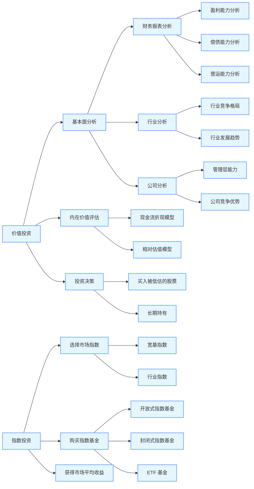

# 彼得林奇的"价值投资"vs"指数投资"

> 关键词：彼得林奇、价值投资、指数投资、投资策略、市场分析

> 摘要：本文深入探讨了彼得林奇所倡导的价值投资与指数投资这两种截然不同的投资策略。详细分析了它们的核心概念、算法原理、数学模型，通过项目实战案例展示其在实际投资中的应用，同时阐述了各自的实际应用场景。还为读者推荐了相关的学习资源、开发工具和研究论文。最后总结了这两种投资策略的未来发展趋势与挑战，并解答了常见问题，为投资者在选择投资策略时提供全面且深入的参考。

## 1. 背景介绍 
### 1.1 目的和范围
本文章的目的在于全面、深入地对比彼得林奇的价值投资和指数投资这两种重要的投资策略。通过剖析它们的核心原理、实际操作方法、应用场景以及优劣势，帮助投资者更好地理解这两种策略，从而能够根据自身的投资目标、风险承受能力和投资经验，做出更明智的投资决策。文章将涵盖这两种投资策略的理论基础、数学模型、实际案例分析以及未来发展趋势等方面。

### 1.2 预期读者
本文预期读者主要包括对投资领域感兴趣的初学者，他们希望通过了解不同的投资策略来开启自己的投资之旅；也包括有一定投资经验的投资者，他们希望进一步优化自己的投资组合，深入研究不同投资策略的适用性；同时，还包括金融专业的学生和研究人员，他们可以从本文中获取关于价值投资和指数投资的理论和实践知识，用于学术研究和学习。

### 1.3 文档结构概述
本文将按照以下结构展开：首先介绍价值投资和指数投资的核心概念及其相互联系，包括它们的原理和架构，并通过文本示意图和 Mermaid 流程图进行直观展示。接着详细讲解这两种投资策略的核心算法原理和具体操作步骤，使用 Python 源代码进行阐述。然后介绍相关的数学模型和公式，并结合具体例子进行说明。之后通过项目实战案例，包括开发环境搭建、源代码实现和代码解读，展示这两种策略在实际投资中的应用。再探讨它们的实际应用场景，为投资者提供参考。随后推荐相关的学习资源、开发工具和研究论文，帮助读者进一步深入学习。最后总结这两种投资策略的未来发展趋势与挑战，解答常见问题，并提供扩展阅读和参考资料。

### 1.4 术语表
#### 1.4.1 核心术语定义
- **价值投资**：是一种通过对股票内在价值的分析，寻找被市场低估的股票进行投资的策略。投资者认为市场有时会对股票的价值做出错误的评估，通过深入研究公司的基本面，如财务状况、盈利能力、行业地位等，选择那些股价低于其内在价值的股票，等待市场发现其真正价值后获得收益。
- **指数投资**：是一种通过投资于特定的市场指数来获取市场平均收益的投资策略。投资者购买跟踪特定指数的基金，如沪深 300 指数基金，该基金的表现基本与所跟踪的指数一致，投资者无需挑选个股，只需跟随市场整体走势即可。
- **内在价值**：指的是股票所代表的公司的真实价值，是基于公司的资产、盈利能力、现金流等基本面因素计算得出的。内在价值是价值投资的核心概念，投资者通过评估公司的内在价值来判断股票是否被低估或高估。
- **市场指数**：是衡量特定市场或行业表现的统计指标，它是由一组具有代表性的股票组成的。常见的市场指数有上证综指、道琼斯工业平均指数、标准普尔 500 指数等。市场指数反映了市场的整体走势和表现。

#### 1.4.2 相关概念解释
- **基本面分析**：是价值投资中常用的分析方法，通过研究公司的财务报表、行业竞争环境、管理层能力等基本面因素，评估公司的内在价值和未来发展潜力。基本面分析关注的是公司的实际经营状况和盈利能力，而不是股票的短期价格波动。
- **被动投资**：指数投资属于被动投资的一种，它不依赖于投资者对个股的选择和市场时机的把握，而是通过跟踪市场指数来获取市场平均收益。被动投资的优点是成本低、风险分散，适合那些没有时间和专业知识进行个股研究的投资者。
- **主动投资**：价值投资属于主动投资的范畴，投资者需要通过自己的研究和分析，选择被低估的股票，并在适当的时机买入和卖出。主动投资需要投资者具备较强的专业知识和分析能力，同时也需要花费大量的时间和精力进行研究。

#### 1.4.3 缩略词列表
- **PE**：市盈率（Price-to-Earnings Ratio），是指股票价格除以每股收益的比率，用于衡量股票的估值水平。
- **PB**：市净率（Price-to-Book Ratio），是指股票价格除以每股净资产的比率，反映了股票价格相对于公司净资产的倍数。
- **ROE**：净资产收益率（Return on Equity），是指公司净利润与净资产的比率，衡量了公司运用自有资本的效率。

## 2. 核心概念与联系 
### 价值投资核心概念
价值投资的核心思想是寻找被市场低估的股票，通过长期持有来获得股票价值回归带来的收益。其理论基础是股票的价格会围绕其内在价值波动，当市场情绪或短期因素导致股票价格低于其内在价值时，就是买入的时机。投资者需要通过深入的基本面分析，评估公司的财务状况、盈利能力、行业竞争力等因素，来确定股票的内在价值。

### 指数投资核心概念
指数投资则是基于市场有效假说，认为市场能够充分反映所有信息，因此投资者很难通过选股和择时来获得超越市场平均水平的收益。指数投资通过购买跟踪特定市场指数的基金，实现对市场的广泛投资，从而获得市场平均收益。这种策略的优点是成本低、风险分散，适合大多数投资者。

### 核心概念原理和架构的文本示意图
```plaintext
价值投资
|-- 基本面分析
|   |-- 财务报表分析
|   |   |-- 盈利能力分析（ROE、净利润增长率等）
|   |   |-- 偿债能力分析（资产负债率等）
|   |   |-- 营运能力分析（存货周转率等）
|   |-- 行业分析
|   |   |-- 行业竞争格局
|   |   |-- 行业发展趋势
|   |-- 公司分析
|       |-- 管理层能力
|       |-- 公司竞争优势
|-- 内在价值评估
|   |-- 现金流折现模型
|   |-- 相对估值模型（PE、PB 等）
|-- 投资决策
|   |-- 买入被低估的股票
|   |-- 长期持有

指数投资
|-- 选择市场指数
|   |-- 宽基指数（如沪深 300、上证综指）
|   |-- 行业指数（如医药指数、科技指数）
|-- 购买指数基金
|   |-- 开放式指数基金
|   |-- 封闭式指数基金
|   |-- ETF 基金
|-- 获得市场平均收益
```

### Mermaid 流程图


## 3. 核心算法原理 & 具体操作步骤 

### 价值投资核心算法原理及 Python 代码实现
#### 现金流折现模型（DCF）
现金流折现模型是价值投资中常用的评估公司内在价值的方法。其基本原理是将公司未来的现金流按照一定的折现率折现到当前时刻，从而得到公司的内在价值。公式如下：
$$V = \sum_{t=1}^{n} \frac{CF_t}{(1 + r)^t} + \frac{TV}{(1 + r)^n}$$
其中，$V$ 是公司的内在价值，$CF_t$ 是第 $t$ 年的现金流，$r$ 是折现率，$n$ 是预测期数，$TV$ 是终值。

以下是一个简单的 Python 代码实现：
```python
def dcf_valuation(cash_flows, discount_rate, terminal_value):
    """
    现金流折现模型计算公司内在价值
    :param cash_flows: 未来各年现金流列表
    :param discount_rate: 折现率
    :param terminal_value: 终值
    :return: 公司内在价值
    """
    n = len(cash_flows)
    present_value = 0
    for t in range(n):
        present_value += cash_flows[t] / ((1 + discount_rate) ** (t + 1))
    present_value += terminal_value / ((1 + discount_rate) ** n)
    return present_value

# 示例数据
cash_flows = [100, 120, 150, 180, 200]
discount_rate = 0.1
terminal_value = 2500

intrinsic_value = dcf_valuation(cash_flows, discount_rate, terminal_value)
print(f"公司内在价值: {intrinsic_value}")
```
#### 具体操作步骤
1. **收集数据**：收集公司的财务报表，预测未来各年的现金流和终值。
2. **确定折现率**：折现率通常根据公司的风险水平和市场利率来确定。
3. **计算内在价值**：使用现金流折现模型计算公司的内在价值。
4. **比较股价与内在价值**：如果股价低于内在价值，则认为股票被低估，可以考虑买入。

### 指数投资核心算法原理及 Python 代码实现
#### 指数收益率计算
指数收益率是衡量指数表现的重要指标，其计算公式为：
$$R = \frac{P_t - P_{t-1}}{P_{t-1}}$$
其中，$R$ 是指数收益率，$P_t$ 是当前指数点位，$P_{t-1}$ 是上一时期指数点位。

以下是一个简单的 Python 代码实现：
```python
def index_return(index_prices):
    """
    计算指数收益率
    :param index_prices: 指数点位列表
    :return: 指数收益率列表
    """
    returns = []
    for i in range(1, len(index_prices)):
        r = (index_prices[i] - index_prices[i - 1]) / index_prices[i - 1]
        returns.append(r)
    return returns

# 示例数据
index_prices = [1000, 1020, 1050, 1030, 1060]
returns = index_return(index_prices)
print(f"指数收益率: {returns}")
```
#### 具体操作步骤
1. **选择指数**：根据自己的投资目标和风险偏好，选择合适的市场指数。
2. **购买指数基金**：通过证券账户或基金销售平台购买跟踪所选指数的基金。
3. **定期投资**：可以采用定期定额投资的方式，降低市场波动的影响。
4. **长期持有**：指数投资是一种长期投资策略，投资者应避免频繁买卖，长期持有以获得市场平均收益。

## 4. 数学模型和公式 & 详细讲解 & 举例说明 

### 价值投资数学模型和公式
#### 现金流折现模型（DCF）
如前面所述，现金流折现模型的公式为：
$$V = \sum_{t=1}^{n} \frac{CF_t}{(1 + r)^t} + \frac{TV}{(1 + r)^n}$$
详细讲解：
- $CF_t$：第 $t$ 年的现金流，通常可以根据公司的历史财务数据和未来发展预测来确定。例如，一家公司过去几年的净利润增长率稳定在 10%，可以假设未来几年的现金流也按照这个增长率增长。
- $r$：折现率，反映了资金的时间价值和投资的风险。一般来说，折现率越高，说明投资的风险越大。折现率可以根据市场利率、公司的贝塔系数等因素来确定。
- $n$：预测期数，通常可以根据公司的行业特点和发展阶段来确定。对于一些成熟行业的公司，预测期数可以设置为 5 - 10 年；对于一些新兴行业的公司，预测期数可以适当延长。
- $TV$：终值，是指预测期结束后公司的价值。终值可以采用永续增长模型来计算，公式为：
$$TV = \frac{CF_{n+1}}{r - g}$$
其中，$CF_{n+1}$ 是预测期结束后下一年的现金流，$g$ 是永续增长率。

举例说明：
假设一家公司未来 5 年的现金流分别为 100 万元、120 万元、150 万元、180 万元、200 万元，折现率为 10%，永续增长率为 3%。预测期结束后下一年的现金流为 200 * (1 + 3%) = 206 万元。则终值为：
$$TV = \frac{206}{0.1 - 0.03} = 2942.86$$（万元）
公司的内在价值为：
$$V = \frac{100}{(1 + 0.1)^1} + \frac{120}{(1 + 0.1)^2} + \frac{150}{(1 + 0.1)^3} + \frac{180}{(1 + 0.1)^4} + \frac{200}{(1 + 0.1)^5} + \frac{2942.86}{(1 + 0.1)^5}$$
```python
import math

cash_flows = [100, 120, 150, 180, 200]
discount_rate = 0.1
perpetual_growth_rate = 0.03
terminal_cash_flow = 200 * (1 + perpetual_growth_rate)
terminal_value = terminal_cash_flow / (discount_rate - perpetual_growth_rate)

present_value = 0
for t in range(len(cash_flows)):
    present_value += cash_flows[t] / ((1 + discount_rate) ** (t + 1))
present_value += terminal_value / ((1 + discount_rate) ** len(cash_flows))

print(f"公司内在价值: {present_value} 万元")
```
运行上述代码，可得到公司的内在价值。

#### 相对估值模型
相对估值模型是通过比较同行业其他公司的估值指标，来评估目标公司的价值。常用的相对估值指标有市盈率（PE）、市净率（PB）等。

- **市盈率（PE）**：公式为 $PE = \frac{P}{EPS}$，其中 $P$ 是股票价格，$EPS$ 是每股收益。例如，同行业其他公司的平均市盈率为 20 倍，目标公司的每股收益为 2 元，则目标公司的合理股价为 $20 * 2 = 40$ 元。
- **市净率（PB）**：公式为 $PB = \frac{P}{BVPS}$，其中 $BVPS$ 是每股净资产。如果同行业其他公司的平均市净率为 3 倍，目标公司的每股净资产为 10 元，则目标公司的合理股价为 $3 * 10 = 30$ 元。

### 指数投资数学模型和公式
#### 指数收益率计算
指数收益率的公式为：
$$R = \frac{P_t - P_{t-1}}{P_{t-1}}$$
详细讲解：
- $P_t$：当前指数点位，反映了当前时刻市场的整体表现。
- $P_{t-1}$：上一时期指数点位，用于计算指数在一段时间内的变化情况。

举例说明：
假设某指数在第 1 天的点位为 1000 点，第 2 天的点位为 1020 点，则第 2 天的指数收益率为：
$$R = \frac{1020 - 1000}{1000} = 0.02 = 2\%$$

#### 指数基金跟踪误差计算
指数基金的跟踪误差是衡量基金表现与所跟踪指数表现差异的指标，公式为：
$$TE = \sqrt{\frac{1}{n} \sum_{i=1}^{n} (R_{fi} - R_{bi})^2}$$
其中，$TE$ 是跟踪误差，$R_{fi}$ 是指数基金在第 $i$ 期的收益率，$R_{bi}$ 是所跟踪指数在第 $i$ 期的收益率，$n$ 是样本期数。

举例说明：
假设某指数基金和所跟踪指数在过去 5 期的收益率分别为：
基金收益率：[0.02, 0.03, -0.01, 0.04, 0.02]
指数收益率：[0.025, 0.032, -0.008, 0.042, 0.018]
则跟踪误差为：
```python
import math

fund_returns = [0.02, 0.03, -0.01, 0.04, 0.02]
index_returns = [0.025, 0.032, -0.008, 0.042, 0.018]
n = len(fund_returns)

squared_errors = [(fund_returns[i] - index_returns[i]) ** 2 for i in range(n)]
tracking_error = math.sqrt(sum(squared_errors) / n)

print(f"跟踪误差: {tracking_error}")
```
运行上述代码，可得到指数基金的跟踪误差。

## 5. 项目实战：代码实际案例和详细解释说明 

### 5.1  开发环境搭建
#### 安装 Python
首先需要安装 Python 环境，建议使用 Python 3.7 及以上版本。可以从 Python 官方网站（https://www.python.org/downloads/）下载适合自己操作系统的安装包，按照安装向导进行安装。

#### 安装必要的库
在命令行中使用以下命令安装所需的库：
```sh
pip install pandas numpy matplotlib yfinance
```
- `pandas`：用于数据处理和分析。
- `numpy`：用于数值计算。
- `matplotlib`：用于数据可视化。
- `yfinance`：用于获取股票和指数数据。

### 5.2  源代码详细实现和代码解读
#### 价值投资实战案例
以下是一个简单的价值投资实战案例，通过计算股票的市盈率和市净率，筛选出被低估的股票。
```python
import yfinance as yf
import pandas as pd

# 定义股票列表
stocks = ['AAPL', 'MSFT', 'GOOG', 'AMZN']

# 获取股票数据
data = yf.download(stocks, start='2020-01-01', end='2023-01-01')

# 获取财务数据
financial_data = {}
for stock in stocks:
    ticker = yf.Ticker(stock)
    financial_data[stock] = {
        'PE': ticker.info.get('trailingPE'),
        'PB': ticker.info.get('priceToBook')
    }

# 转换为 DataFrame
financial_df = pd.DataFrame(financial_data).T

# 筛选被低估的股票
undervalued_stocks = financial_df[(financial_df['PE'] < 20) & (financial_df['PB'] < 3)]

print("被低估的股票:")
print(undervalued_stocks)
```
代码解读：
1. **导入必要的库**：导入 `yfinance` 和 `pandas` 库，用于获取股票数据和数据处理。
2. **定义股票列表**：定义要分析的股票列表。
3. **获取股票数据**：使用 `yfinance` 库的 `download` 函数获取股票的历史数据。
4. **获取财务数据**：遍历股票列表，使用 `yfinance` 库的 `Ticker` 类获取每只股票的市盈率和市净率。
5. **转换为 DataFrame**：将财务数据转换为 `pandas` 的 `DataFrame` 对象，方便进行数据处理和分析。
6. **筛选被低估的股票**：根据市盈率小于 20 和市净率小于 3 的条件，筛选出被低估的股票。
7. **打印结果**：打印出被低估的股票信息。

#### 指数投资实战案例
以下是一个简单的指数投资实战案例，通过计算指数收益率和绘制收益率曲线，分析指数的表现。
```python
import yfinance as yf
import matplotlib.pyplot as plt

# 定义指数代码
index_code = '^GSPC'  # 标普 500 指数

# 获取指数数据
index_data = yf.download(index_code, start='2020-01-01', end='2023-01-01')

# 计算指数收益率
index_returns = index_data['Close'].pct_change().dropna()

# 绘制收益率曲线
plt.figure(figsize=(10, 6))
index_returns.plot()
plt.title('S&P 500 Index Returns')
plt.xlabel('Date')
plt.ylabel('Returns')
plt.show()
```
代码解读：
1. **导入必要的库**：导入 `yfinance` 和 `matplotlib` 库，用于获取指数数据和数据可视化。
2. **定义指数代码**：定义要分析的指数代码，这里使用标普 500 指数。
3. **获取指数数据**：使用 `yfinance` 库的 `download` 函数获取指数的历史数据。
4. **计算指数收益率**：使用 `pct_change` 方法计算指数的日收益率，并删除缺失值。
5. **绘制收益率曲线**：使用 `matplotlib` 库的 `plot` 函数绘制指数收益率曲线，并添加标题和坐标轴标签。
6. **显示图形**：使用 `show` 方法显示绘制的图形。

### 5.3  代码解读与分析
#### 价值投资代码分析
- **数据获取**：通过 `yfinance` 库获取股票的历史数据和财务数据，该库提供了简单易用的接口，可以方便地获取金融数据。
- **数据处理**：使用 `pandas` 库对财务数据进行处理和分析，将数据转换为 `DataFrame` 对象，方便进行筛选和计算。
- **筛选条件**：市盈率小于 20 和市净率小于 3 是一个简单的筛选条件，实际应用中可以根据自己的投资策略和风险偏好进行调整。

#### 指数投资代码分析
- **数据获取**：同样使用 `yfinance` 库获取指数的历史数据，确保数据的准确性和及时性。
- **收益率计算**：使用 `pct_change` 方法计算指数的日收益率，该方法可以快速计算数据的百分比变化。
- **可视化分析**：使用 `matplotlib` 库绘制指数收益率曲线，通过可视化的方式直观地展示指数的表现，帮助投资者更好地理解市场走势。

## 6. 实际应用场景 
### 价值投资实际应用场景
#### 长期投资
价值投资适合那些有长期投资目标的投资者，如养老规划、子女教育等。通过深入研究公司的基本面，选择具有长期增长潜力的股票，长期持有可以获得公司成长带来的收益。例如，巴菲特长期持有可口可乐等股票，获得了丰厚的回报。
#### 市场低估时期
在市场整体估值较低时，价值投资策略更能发挥作用。此时，市场上可能存在许多被低估的股票，投资者可以通过价值分析，挑选出那些具有安全边际的股票进行投资。例如，在 2008 年金融危机后，许多优质公司的股价大幅下跌，价值投资者抓住机会买入，在随后的市场反弹中获得了高额收益。
#### 优质公司投资
价值投资注重公司的内在价值和竞争优势，适合投资那些具有优秀管理层、稳定现金流和行业领先地位的公司。这些公司在市场竞争中具有较强的抗风险能力，长期来看，其股价有望随着公司的发展而上涨。例如，苹果公司凭借其强大的品牌影响力、创新能力和盈利能力，一直是价值投资者青睐的对象。

### 指数投资实际应用场景
#### 分散投资
指数投资可以通过投资于跟踪市场指数的基金，实现对市场的广泛投资，分散投资风险。对于那些没有时间和专业知识进行个股研究的投资者来说，指数投资是一种简单有效的分散投资方式。例如，投资者可以购买沪深 300 指数基金，涵盖了沪深两市 300 只具有代表性的股票，降低了单只股票的风险。
#### 市场平均收益获取
指数投资的目标是获得市场平均收益，适合那些认为市场有效、难以通过选股和择时获得超额收益的投资者。通过长期投资指数基金，投资者可以跟随市场整体走势，分享经济发展带来的红利。例如，美国的标普 500 指数长期以来表现优异，投资者通过投资标普 500 指数基金，获得了市场平均水平的收益。
#### 定期投资
指数投资适合采用定期定额投资的方式，即每隔一段时间投入固定金额的资金。这种投资方式可以降低市场波动的影响，避免投资者在市场高点买入、低点卖出。例如，投资者每月定期投资 1000 元购买某指数基金，无论市场涨跌，都按照固定金额买入，长期下来可以平均成本，提高投资收益。

## 7. 工具和资源推荐
### 7.1 学习资源推荐
#### 7.1.1 书籍推荐
- 《聪明的投资者》（The Intelligent Investor）：本杰明·格雷厄姆（Benjamin Graham）著，价值投资领域的经典之作，被誉为投资界的“圣经”。本书介绍了价值投资的基本理念和方法，强调了投资者的心理素质和风险控制。
- 《彼得·林奇的成功投资》（One Up On Wall Street）：彼得·林奇（Peter Lynch）著，林奇是美国著名的基金经理，他在书中分享了自己的投资经验和选股技巧，通过生动的案例和通俗易懂的语言，让读者了解如何从日常生活中发现投资机会。
- 《漫步华尔街》（A Random Walk Down Wall Street）：伯顿·马尔基尔（Burton Malkiel）著，本书介绍了有效市场假说和指数投资的理论基础，对各种投资策略进行了客观的分析和评价，是一本适合初学者的投资入门书籍。

#### 7.1.2 在线课程
- Coursera 上的“投资学原理”（Principles of Investment）：由宾夕法尼亚大学沃顿商学院教授授课，课程涵盖了投资的基本概念、资产定价模型、投资组合理论等内容，适合对投资感兴趣的初学者和有一定基础的投资者。
- edX 上的“金融市场”（Financial Markets）：由耶鲁大学教授罗伯特·席勒（Robert Shiller）授课，席勒是诺贝尔经济学奖获得者，课程深入探讨了金融市场的运作机制、投资策略和风险管理等问题，具有较高的学术水平和实践指导意义。
- 中国大学 MOOC 上的“证券投资学”：由国内高校教授授课，课程结合中国证券市场的实际情况，介绍了证券投资的基本理论、分析方法和投资技巧，适合国内投资者学习。

#### 7.1.3 技术博客和网站
- 雪球网（https://xueqiu.com/）：国内知名的投资社区，提供股票、基金、债券等多种投资品种的信息和分析，投资者可以在上面交流投资经验、分享投资观点。
- 东方财富网（https://www.eastmoney.com/）：国内最大的财经网站之一，提供全面的金融信息和数据，包括股票行情、财经新闻、基金净值等，是投资者获取信息的重要渠道。
- Seeking Alpha（https://seekingalpha.com/）：美国知名的投资分析网站，提供全球金融市场的分析和评论，有许多专业的投资分析师和投资者在上面发表文章，为投资者提供参考。

### 7.2 开发工具框架推荐
#### 7.2.1 IDE和编辑器
- PyCharm：是一款专门为 Python 开发设计的集成开发环境（IDE），具有代码编辑、调试、代码分析等功能，支持多种 Python 库和框架，适合开发复杂的投资分析程序。
- Jupyter Notebook：是一个交互式的开发环境，支持 Python、R 等多种编程语言，适合进行数据探索、模型验证和可视化分析。在投资分析中，可以使用 Jupyter Notebook 进行数据处理、算法实现和结果展示。
- Visual Studio Code：是一款轻量级的代码编辑器，具有丰富的插件和扩展功能，支持多种编程语言。可以安装 Python 相关的插件，进行 Python 代码的开发和调试。

#### 7.2.2 调试和性能分析工具
- pdb：Python 内置的调试工具，可以在代码中设置断点，逐行调试代码，帮助开发者查找和解决代码中的问题。
- cProfile：Python 标准库中的性能分析工具，可以统计代码的运行时间和函数调用次数，帮助开发者找出代码中的性能瓶颈。
- Py-Spy：是一个跨平台的 Python 性能分析工具，可以实时监测 Python 程序的性能，生成火焰图等可视化结果，方便开发者进行性能优化。

#### 7.2.3 相关框架和库
- pandas：是一个强大的数据处理和分析库，提供了 DataFrame 和 Series 等数据结构，支持数据的读取、清洗、转换和分析等操作，在投资分析中可以用于处理和分析金融数据。
- numpy：是 Python 的数值计算库，提供了高效的数组和矩阵运算功能，支持各种数学函数和线性代数运算，在投资分析中可以用于计算收益率、风险指标等。
- scikit-learn：是一个常用的机器学习库，提供了各种机器学习算法和工具，如分类、回归、聚类等，在投资分析中可以用于构建预测模型和风险评估模型。

### 7.3 相关论文著作推荐
#### 7.3.1 经典论文
- 《证券分析》（Security Analysis）：本杰明·格雷厄姆和戴维·多德（David Dodd）著，是价值投资理论的奠基之作，提出了“内在价值”和“安全边际”的概念，对后来的投资理论和实践产生了深远的影响。
- 《有效资本市场：理论与实证研究回顾》（Efficient Capital Markets: A Review of Theory and Empirical Work）：尤金·法玛（Eugene F. Fama）著，该论文提出了有效市场假说，认为市场价格已经反映了所有可用的信息，投资者无法通过选股和择时获得超额收益，为指数投资提供了理论基础。
- 《资本资产定价模型：风险条件下的市场均衡理论》（Capital Asset Pricing Model: A Theory of Market Equilibrium under Conditions of Risk）：威廉·夏普（William F. Sharpe）著，该论文提出了资本资产定价模型（CAPM），用于描述资产的预期收益率与风险之间的关系，是现代投资组合理论的重要组成部分。

#### 7.3.2 最新研究成果
- 关注《金融研究》《经济研究》等国内权威学术期刊，以及 Journal of Finance、Journal of Financial Economics 等国际知名金融学术期刊，这些期刊会发表关于投资策略、资产定价、风险管理等方面的最新研究成果。
- 参加金融领域的学术会议，如中国金融学年会、美国金融协会年会等，与国内外的学者和专家交流最新的研究动态和成果。

#### 7.3.3 应用案例分析
- 《金融炼金术》（The Alchemy of Finance）：乔治·索罗斯（George Soros）著，索罗斯是著名的投资家，他在书中分享了自己的投资经验和哲学，通过对自己的投资案例进行分析，阐述了反身性理论在投资中的应用。
- 《大空头》（The Big Short）：迈克尔·刘易斯（Michael Lewis）著，本书讲述了 2008 年金融危机期间，几位投资者通过做空次贷市场获得巨额收益的故事，通过真实的案例展示了投资分析和风险管理的重要性。

## 8. 总结：未来发展趋势与挑战
### 价值投资未来发展趋势与挑战
#### 发展趋势
- **数字化和智能化**：随着科技的发展，价值投资者可以利用大数据、人工智能等技术，更高效地进行基本面分析和公司估值。例如，通过分析社交媒体数据、行业报告等非结构化数据，挖掘公司的潜在价值。
- **全球视野**：在全球化的背景下，价值投资者将更加关注全球市场的投资机会，寻找那些在国际市场上具有竞争优势的公司。同时，也需要考虑不同国家和地区的政治、经济、文化等因素对投资的影响。
- **可持续投资**：越来越多的投资者开始关注企业的社会责任和可持续发展，价值投资也将融入可持续投资的理念。投资者会更加注重公司的环境、社会和治理（ESG）表现，选择那些具有良好 ESG 记录的公司进行投资。

#### 挑战
- **信息过载**：在信息爆炸的时代，价值投资者面临着海量的信息，如何筛选和分析有价值的信息成为一个挑战。同时，虚假信息和误导性信息也可能影响投资者的决策。
- **市场有效性提高**：随着市场的发展和投资者的成熟，市场的有效性可能会不断提高，找到被低估的股票变得更加困难。价值投资者需要不断提高自己的分析能力和选股技巧，才能在市场中获得超额收益。
- **宏观经济不确定性**：全球宏观经济环境的不确定性增加，如贸易摩擦、利率波动、通货膨胀等，会对公司的经营和股价产生影响。价值投资者需要更加关注宏观经济因素，做好风险管理。

### 指数投资未来发展趋势与挑战
#### 发展趋势
- **产品创新**：指数基金市场将不断推出新的产品，如行业指数基金、主题指数基金、Smart Beta 指数基金等，满足投资者多样化的投资需求。例如，近年来，科技、医疗等行业指数基金受到了投资者的广泛关注。
- **国际化**：随着全球金融市场的一体化，指数投资将更加国际化。投资者可以通过投资全球指数基金，实现资产的全球配置，分散投资风险。例如，投资美国标普 500 指数基金、欧洲斯托克 50 指数基金等。
- **低成本竞争**：指数基金的低成本优势将更加凸显，基金公司之间的竞争将更加激烈。为了吸引投资者，基金公司可能会不断降低管理费和托管费，提高产品的性价比。

#### 挑战
- **跟踪误差控制**：指数基金的跟踪误差是一个重要的问题，如何控制跟踪误差，确保基金的表现与所跟踪指数的表现一致，是基金管理人面临的挑战。市场波动、交易成本、成分股调整等因素都可能导致跟踪误差的产生。
- **市场风险**：虽然指数投资可以分散投资风险，但仍然无法避免市场整体下跌的风险。在市场熊市中，指数基金的净值也会随之下跌。投资者需要根据自己的风险承受能力，合理配置资产，降低市场风险的影响。
- **投资者教育**：指数投资是一种相对简单的投资策略，但仍有许多投资者对其缺乏了解。基金公司和监管机构需要加强投资者教育，提高投资者对指数投资的认识和理解，引导投资者正确选择和使用指数基金。

## 9. 附录：常见问题与解答
### 价值投资相关问题
#### 问：价值投资需要具备哪些知识和技能？
答：价值投资需要具备财务分析、行业研究、公司估值等方面的知识和技能。投资者需要了解财务报表的分析方法，掌握市盈率、市净率、净资产收益率等估值指标的计算和应用。同时，还需要对不同行业的发展趋势和竞争格局有一定的了解，能够评估公司的竞争优势和发展潜力。此外，投资者还需要具备良好的心理素质和风险控制能力，避免受到市场情绪的影响。

#### 问：如何判断一只股票是否被低估？
答：判断一只股票是否被低估需要综合考虑多个因素。可以通过分析公司的财务报表，计算市盈率、市净率、现金流折现等估值指标，与同行业其他公司进行比较。同时，还需要考虑公司的基本面情况，如盈利能力、成长潜力、行业地位等。此外，市场情绪和宏观经济环境也会影响股票的估值，投资者需要结合这些因素进行综合判断。

#### 问：价值投资的持有期限一般是多久？
答：价值投资是一种长期投资策略，持有期限通常较长，一般在 3 - 5 年以上，甚至可以是 10 年、20 年。价值投资者认为，股票的价格会围绕其内在价值波动，通过长期持有，可以等待股票价值回归，获得公司成长带来的收益。当然，具体的持有期限还需要根据公司的基本面变化和市场情况进行调整。

### 指数投资相关问题
#### 问：指数基金和主动管理基金有什么区别？
答：指数基金属于被动投资，它通过跟踪特定的市场指数来获取市场平均收益，不需要基金经理进行选股和择时。指数基金的优点是成本低、风险分散、透明度高。主动管理基金则依赖于基金经理的专业能力，基金经理通过选股和择时来试图获得超越市场平均水平的收益。主动管理基金的优点是可能获得超额收益，但缺点是成本较高、风险较大，且基金经理的表现不稳定。

#### 问：如何选择适合自己的指数基金？
答：选择适合自己的指数基金需要考虑以下几个因素：
- **投资目标**：根据自己的投资目标，如长期投资、短期投资、资产配置等，选择不同类型的指数基金。例如，如果是长期投资，可以选择宽基指数基金；如果是短期投资，可以选择行业指数基金。
- **风险承受能力**：不同的指数基金风险水平不同，投资者需要根据自己的风险承受能力选择合适的指数基金。例如，大盘指数基金的风险相对较低，中小盘指数基金的风险相对较高。
- **跟踪误差**：跟踪误差是衡量指数基金表现与所跟踪指数表现差异的指标，跟踪误差越小，说明基金的表现越接近所跟踪指数。投资者可以选择跟踪误差较小的指数基金。
- **费用**：指数基金的费用包括管理费、托管费等，费用越低，投资者的实际收益越高。投资者可以选择费用较低的指数基金。

#### 问：指数投资适合所有投资者吗？
答：指数投资适合大多数投资者，尤其是那些没有时间和专业知识进行个股研究的投资者。指数投资可以实现分散投资，降低投资风险，同时成本较低，能够获得市场平均收益。但指数投资也并非适合所有投资者，对于那些具有较强的专业知识和分析能力，且愿意花费时间和精力进行选股和择时的投资者来说，主动投资可能更适合他们。

## 10. 扩展阅读 & 参考资料
### 扩展阅读
- 《金融市场与金融机构》（Financial Markets and Institutions）：弗雷德里克·米什金（Frederic S. Mishkin）著，本书介绍了金融市场和金融机构的基本概念、运作机制和监管政策，对于理解投资的宏观环境和金融市场的运行规律有很大帮助。
- 《投资最重要的事》（The Most Important Thing Illuminated）：霍华德·马克斯（Howard Marks）著，马克斯是著名的投资家，他在书中分享了自己的投资经验和投资哲学，强调了投资中的风险控制和逆向思维。
- 《随机漫步的傻瓜》（Fooled by Randomness）：纳西姆·尼古拉斯·塔勒布（Nassim Nicholas Taleb）著，本书探讨了随机性在金融市场中的作用，提醒投资者要警惕随机性带来的风险，避免被偶然事件所误导。

### 参考资料
- 《中国证券报》《上海证券报》《证券时报》等财经报纸，提供了大量的金融市场信息和投资分析文章。
- 各大金融机构的研究报告，如证券公司的研究报告、基金公司的投资策略报告等，具有较高的参考价值。
- 相关的学术数据库，如 CNKI、万方数据等，可以查阅到关于投资策略、资产定价等方面的学术论文。

作者：AI天才研究院/AI Genius Institute & 禅与计算机程序设计艺术 /Zen And The Art of Computer Programming