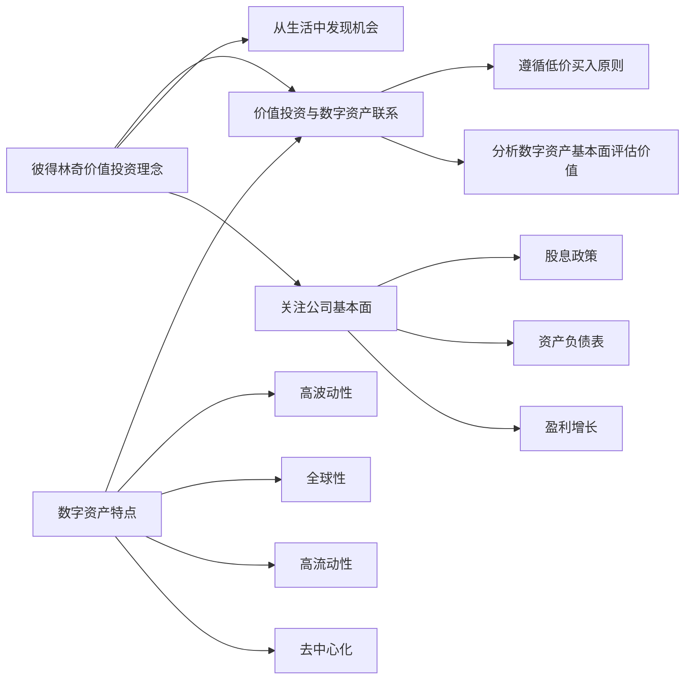

# 彼得林奇的“价值投资”在数字资产时代的重新定义

> 关键词：彼得林奇、价值投资、数字资产时代、重新定义、投资策略

> 摘要：本文聚焦于彼得林奇的价值投资理念在数字资产时代的重新定义。首先介绍了价值投资及数字资产的背景知识，接着阐述了核心概念与联系，分析了核心算法原理和操作步骤，通过数学模型和公式进行理论支撑，结合项目实战案例详细说明。探讨了价值投资在数字资产时代的实际应用场景，推荐了相关学习资源、开发工具和论文著作。最后总结了未来发展趋势与挑战，解答常见问题并提供扩展阅读和参考资料，旨在为投资者在数字资产领域运用价值投资提供全面的指导。

## 1. 背景介绍 
### 1.1 目的和范围
彼得林奇是投资界的传奇人物，他所倡导的价值投资理念在传统金融市场取得了巨大成功。然而，随着数字资产时代的到来，市场环境、资产特性等都发生了显著变化。本文的目的在于探讨如何将彼得林奇的价值投资理念重新定义并应用于数字资产领域。范围涵盖数字资产的各种类型，如加密货币、数字证券等，分析在这个新兴领域中价值投资的可行性、策略调整以及面临的挑战。

### 1.2 预期读者
本文预期读者包括对投资领域感兴趣的个人投资者，希望了解如何在数字资产市场运用价值投资策略的金融从业者，以及从事金融科技、区块链等相关领域研究的学者和研究人员。

### 1.3 文档结构概述
本文将按照以下结构展开：首先介绍核心概念，包括彼得林奇的价值投资理念和数字资产的相关知识；接着阐述核心算法原理和具体操作步骤，并用数学模型和公式进行详细讲解；通过项目实战案例展示价值投资在数字资产中的应用；探讨实际应用场景；推荐相关的学习资源、开发工具和论文著作；最后总结未来发展趋势与挑战，解答常见问题并提供扩展阅读和参考资料。

### 1.4 术语表
#### 1.4.1 核心术语定义
- **价值投资**：是一种投资策略，核心是寻找被低估的资产，通过分析资产的内在价值，在价格低于内在价值时买入，等待价格回归价值或超越价值时卖出以获取收益。
- **数字资产**：是指以电子数据形式存在的资产，包括但不限于加密货币、数字证券、虚拟土地等，具有去中心化、可追溯、可编程等特点。
- **内在价值**：资产本身所具有的价值，通常基于其基本面因素，如盈利能力、发展前景等进行评估。

#### 1.4.2 相关概念解释
- **彼得林奇的价值投资理念**：强调从日常生活中发现投资机会，关注公司的基本面，如盈利增长、资产负债情况等，同时注重实地调研和对行业的深入了解。
- **数字资产市场**：是一个新兴的金融市场，交易数字资产，市场特点包括高波动性、24 小时交易、全球化等。

#### 1.4.3 缩略词列表
- **ICO**：Initial Coin Offering，首次代币发行。
- **NFT**：Non - Fungible Token，非同质化代币。
- **DeFi**：Decentralized Finance，去中心化金融。

## 2. 核心概念与联系 

### 彼得林奇的价值投资理念核心原理
彼得林奇的价值投资理念基于对公司基本面的深入分析。他认为投资者应该关注公司的盈利增长、资产负债表、股息政策等因素。例如，一家公司如果能够持续保持较高的盈利增长率，那么其内在价值可能会不断提升。同时，他强调投资者要从日常生活中发现投资机会，如留意身边受欢迎的产品和服务，这些背后的公司可能具有投资价值。

### 数字资产的特点
数字资产具有独特的特点。首先，它们基于区块链技术，具有去中心化的特点，不受单一机构的控制。其次，数字资产的交易具有高度的流动性和全球性，任何人都可以在全球范围内进行交易。此外，数字资产的价格波动较大，这既带来了投资机会，也增加了投资风险。

### 价值投资与数字资产的联系
在数字资产时代，价值投资理念仍然具有一定的适用性。虽然数字资产与传统资产有很大的不同，但也可以通过分析其基本面来评估内在价值。例如，对于一个加密货币项目，可以分析其技术团队、社区活跃度、应用场景等因素来判断其价值。同时，价值投资的核心原则，如在价格低于内在价值时买入，仍然适用于数字资产投资。

### 文本示意图
```plaintext
彼得林奇价值投资理念
|--关注公司基本面
|   |--盈利增长
|   |--资产负债表
|   |--股息政策
|--从生活中发现机会

数字资产特点
|--去中心化
|--高流动性
|--全球性
|--高波动性

价值投资与数字资产联系
|--分析数字资产基本面评估价值
|--遵循低价买入原则
```

### Mermaid 流程图


## 3. 核心算法原理 & 具体操作步骤 

### 核心算法原理
在数字资产领域应用价值投资，核心算法原理是评估数字资产的内在价值，并与市场价格进行比较。可以采用多因素评估模型，综合考虑多个因素来确定内在价值。以下是一个简化的 Python 代码示例，用于计算数字资产的初步内在价值：

```python
def calculate_intrinsic_value(community_activity, technology_score, application_scenarios):
    """
    计算数字资产的内在价值
    :param community_activity: 社区活跃度评分
    :param technology_score: 技术评分
    :param application_scenarios: 应用场景评分
    :return: 内在价值
    """
    # 假设各因素的权重
    weight_community = 0.3
    weight_technology = 0.4
    weight_application = 0.3

    intrinsic_value = (community_activity * weight_community +
                       technology_score * weight_technology +
                       application_scenarios * weight_application)
    return intrinsic_value


# 示例数据
community_activity = 8
technology_score = 7
application_scenarios = 6

# 计算内在价值
intrinsic_value = calculate_intrinsic_value(community_activity, technology_score, application_scenarios)
print(f"数字资产的内在价值为: {intrinsic_value}")
```

### 具体操作步骤
1. **数据收集**：收集数字资产的相关数据，包括社区活跃度（如社交媒体讨论热度、开发者贡献数量等）、技术评分（如代码质量、创新性等）、应用场景（如是否有实际落地应用、应用的广泛程度等）。
2. **因素评分**：根据收集到的数据，对各个因素进行评分。可以采用主观评分和客观数据相结合的方法。例如，对于社区活跃度，可以根据社交媒体上的讨论数量和质量进行评分。
3. **计算内在价值**：使用上述的多因素评估模型，计算数字资产的内在价值。
4. **比较价格**：将计算得到的内在价值与数字资产的市场价格进行比较。如果市场价格低于内在价值，则认为该数字资产被低估，具有投资价值。
5. **决策投资**：根据比较结果，做出投资决策。如果数字资产被低估，可以考虑买入；如果市场价格高于内在价值，则需要谨慎投资。

## 4. 数学模型和公式 & 详细讲解 & 举例说明 

### 数学模型
在数字资产价值评估中，我们采用的多因素评估模型可以用以下公式表示：

$$V = w_1x_1 + w_2x_2 + w_3x_3$$

其中，$V$ 表示数字资产的内在价值，$w_1$、$w_2$、$w_3$ 分别表示社区活跃度、技术评分、应用场景评分的权重，且满足 $w_1 + w_2 + w_3 = 1$；$x_1$、$x_2$、$x_3$ 分别表示社区活跃度、技术评分、应用场景的评分。

### 详细讲解
- **权重的确定**：权重的确定需要根据不同数字资产的特点和市场情况进行调整。例如，对于一些以社区驱动的数字资产，社区活跃度的权重可以适当提高；对于一些技术创新型的数字资产，技术评分的权重可以更高。
- **评分的标准**：评分的标准可以根据实际情况制定。例如，社区活跃度可以根据社交媒体上的粉丝数量、讨论热度等指标进行评分，满分为 10 分；技术评分可以根据代码的开源程度、安全性等方面进行评分；应用场景评分可以根据应用的数量、用户数量等进行评分。

### 举例说明
假设我们要评估一个加密货币项目的内在价值。通过数据收集和分析，得到以下信息：
- 社区活跃度评分 $x_1 = 7$
- 技术评分 $x_2 = 8$
- 应用场景评分 $x_3 = 6$
- 社区活跃度权重 $w_1 = 0.3$
- 技术评分权重 $w_2 = 0.4$
- 应用场景权重 $w_3 = 0.3$

将这些值代入公式中，得到：

$$V = 0.3\times7 + 0.4\times8 + 0.3\times6$$
$$V = 2.1 + 3.2 + 1.8$$
$$V = 7.1$$

即该加密货币项目的内在价值为 7.1。如果该加密货币的市场价格为 6，则认为该项目被低估，具有投资价值。

## 5. 项目实战：代码实际案例和详细解释说明 

### 5.1  开发环境搭建
为了实现数字资产价值评估的代码，我们需要搭建以下开发环境：
- **Python 环境**：建议使用 Python 3.7 及以上版本。可以从 Python 官方网站（https://www.python.org/downloads/）下载并安装。
- **开发工具**：可以使用 PyCharm、VS Code 等集成开发环境（IDE）。这里以 PyCharm 为例，从 JetBrains 官方网站（https://www.jetbrains.com/pycharm/download/）下载并安装社区版。
- **必要的库**：在项目中，我们需要使用一些 Python 库，如 `pandas` 用于数据处理，`numpy` 用于数值计算。可以使用以下命令进行安装：
```bash
pip install pandas numpy
```

### 5.2  源代码详细实现和代码解读
以下是一个更完整的数字资产价值评估代码示例：

```python
import pandas as pd
import numpy as np

def calculate_intrinsic_value(data):
    """
    计算数字资产的内在价值
    :param data: 包含社区活跃度、技术评分、应用场景评分的 DataFrame
    :return: 内在价值数组
    """
    # 假设各因素的权重
    weights = np.array([0.3, 0.4, 0.3])
    values = data.values
    intrinsic_values = np.dot(values, weights)
    return intrinsic_values


# 示例数据
data = {
    'community_activity': [8, 7, 6],
    'technology_score': [7, 8, 9],
    'application_scenarios': [6, 7, 8]
}
df = pd.DataFrame(data)

# 计算内在价值
intrinsic_values = calculate_intrinsic_value(df)

# 输出结果
for i, value in enumerate(intrinsic_values):
    print(f"第 {i + 1} 个数字资产的内在价值为: {value}")
```

### 代码解读与分析
- **数据准备**：使用 `pandas` 库创建一个 `DataFrame` 对象，包含社区活跃度、技术评分、应用场景评分等数据。
- **权重设置**：定义一个权重数组，用于表示各因素在内在价值计算中的重要性。
- **内在价值计算**：使用 `numpy` 库的 `dot` 函数进行矩阵乘法，将数据矩阵与权重向量相乘，得到内在价值数组。
- **结果输出**：遍历内在价值数组，输出每个数字资产的内在价值。

## 6. 实际应用场景 
### 加密货币投资
在加密货币市场中，价值投资理念可以帮助投资者筛选出具有潜力的项目。通过分析加密货币的技术团队、社区活跃度、应用场景等因素，评估其内在价值。例如，对于一些有实际应用场景的公链项目，如以太坊，其内在价值不仅体现在技术层面，还体现在其生态系统的发展和应用的广泛程度上。投资者可以根据价值评估结果，在价格低于内在价值时买入，等待价格上涨。

### 数字证券投资
数字证券是将传统证券以数字化形式发行和交易的资产。在数字证券投资中，价值投资同样适用。投资者可以分析发行公司的财务状况、盈利能力、发展前景等基本面因素，结合数字证券的特点，如流动性、透明度等，评估其内在价值。例如，一些科技公司发行的数字证券，其价值可能与公司的技术创新能力和市场竞争力密切相关。

### 虚拟土地投资
随着元宇宙概念的兴起，虚拟土地成为一种新兴的数字资产。在虚拟土地投资中，价值投资可以从多个方面进行评估。例如，虚拟土地的地理位置、周边设施、开发潜力等因素都会影响其价值。投资者可以通过分析这些因素，评估虚拟土地的内在价值，做出投资决策。

## 7. 工具和资源推荐
### 7.1 学习资源推荐
#### 7.1.1 书籍推荐
- 《彼得林奇的成功投资》：彼得林奇的经典著作，详细阐述了他的投资理念和方法，对于理解价值投资具有重要意义。
- 《数字资产投资实战》：介绍了数字资产投资的相关知识和策略，包括加密货币、数字证券等领域。
- 《区块链技术原理与应用》：帮助读者了解区块链技术的基本原理，这对于理解数字资产的底层技术非常重要。

#### 7.1.2 在线课程
- Coursera 上的“投资学原理”：由知名大学教授授课，系统讲解投资学的基本原理和方法。
- Udemy 上的“数字资产投资入门”：专门针对数字资产投资的课程，涵盖了加密货币、NFT 等方面的内容。
- 网易云课堂上的“区块链与数字经济”：介绍区块链技术在数字经济中的应用，以及数字资产的发展趋势。

#### 7.1.3 技术博客和网站
- CoinDesk：专注于加密货币和区块链领域的新闻和分析，提供最新的市场动态和行业趋势。
- CryptoSlate：提供加密货币项目的详细信息和分析报告，帮助投资者了解项目的基本面。
- Medium 上的区块链和投资相关博客：有很多行业专家和投资者分享他们的观点和经验。

### 7.2 开发工具框架推荐
#### 7.2.1 IDE和编辑器
- PyCharm：功能强大的 Python 集成开发环境，适合开发数字资产价值评估等 Python 项目。
- VS Code：轻量级的代码编辑器，支持多种编程语言，具有丰富的插件生态系统。
- Jupyter Notebook：交互式的开发环境，适合进行数据分析和模型开发。

#### 7.2.2 调试和性能分析工具
- PySnooper：可以在代码运行时自动输出变量的值，方便调试代码。
- cProfile：Python 内置的性能分析工具，用于分析代码的性能瓶颈。
- Memory Profiler：用于分析 Python 代码的内存使用情况。

#### 7.2.3 相关框架和库
- Pandas：用于数据处理和分析，提供了丰富的数据结构和函数。
- Numpy：用于数值计算，提供了高效的数组操作和数学函数。
- Scikit - learn：机器学习库，可用于构建数字资产价值评估模型。

### 7.3 相关论文著作推荐
#### 7.3.1 经典论文
- 《有效市场假说》：探讨了市场效率与投资策略的关系，对于理解价值投资的理论基础具有重要意义。
- 《资本资产定价模型》：介绍了资产定价的基本模型，为价值评估提供了理论支持。
- 《区块链技术：架构与应用》：详细介绍了区块链技术的架构和应用场景，对于理解数字资产的底层技术有帮助。

#### 7.3.2 最新研究成果
- 关注顶级学术期刊，如《Journal of Financial Economics》《Management Science》等，了解数字资产投资领域的最新研究成果。
- 参加国际学术会议，如 IEEE Blockchain Conference、ACM Conference on Computer and Communications Security 等，获取最新的研究动态。

#### 7.3.3 应用案例分析
- 一些知名的投资机构和研究机构会发布数字资产投资的应用案例分析报告，如 Coinbase 的研究报告、普华永道的区块链行业报告等。

## 8. 总结：未来发展趋势与挑战
### 未来发展趋势
- **价值投资理念的深化应用**：随着数字资产市场的不断发展，价值投资理念将更加深入人心。投资者将更加注重数字资产的基本面分析，通过评估内在价值来做出投资决策。
- **与新兴技术的融合**：价值投资将与人工智能、大数据等新兴技术深度融合。利用人工智能算法可以更准确地评估数字资产的内在价值，大数据可以提供更全面的市场信息。
- **监管的加强**：随着数字资产市场的规模不断扩大，监管将逐渐加强。这将有助于规范市场秩序，提高投资者的信心，为价值投资提供更好的市场环境。

### 挑战
- **数据质量和可靠性**：数字资产市场的数据来源广泛，但数据质量和可靠性参差不齐。准确获取和分析数据是价值评估的关键，数据的不准确可能导致错误的投资决策。
- **市场波动性**：数字资产市场具有高度的波动性，价格波动较大。这增加了价值投资的难度，投资者需要具备更强的风险承受能力和市场判断能力。
- **技术更新换代快**：数字资产领域的技术更新换代非常快，新的项目和技术不断涌现。投资者需要不断学习和更新知识，以适应市场的变化。

## 9. 附录：常见问题与解答
### 问题 1：数字资产的内在价值评估是否准确？
答：数字资产的内在价值评估存在一定的不确定性。由于数字资产市场的特殊性，如技术发展的不确定性、市场情绪的影响等，很难准确评估其内在价值。但通过综合考虑多个因素，采用科学的评估方法，可以提高评估的准确性。

### 问题 2：价值投资在数字资产市场的回报率如何？
答：价值投资在数字资产市场的回报率受到多种因素的影响，如市场行情、所选数字资产的质量等。一般来说，如果能够准确评估数字资产的内在价值，在价格低估时买入，在价格回归价值或超越价值时卖出，有可能获得较高的回报率。但由于市场的波动性，回报率也存在不确定性。

### 问题 3：如何选择适合价值投资的数字资产？
答：选择适合价值投资的数字资产需要综合考虑多个因素。首先，要分析数字资产的基本面，如技术团队、社区活跃度、应用场景等。其次，要关注市场趋势和行业发展前景。此外，还可以参考专业机构的研究报告和评级。

## 10. 扩展阅读 & 参考资料
### 扩展阅读
- 《智能合约与区块链应用开发》：深入了解区块链技术中的智能合约，以及其在数字资产领域的应用。
- 《量化投资策略与实践》：学习如何运用量化方法进行投资，为数字资产价值投资提供更多的策略和思路。
- 《金融科技前沿趋势》：了解金融科技的最新发展趋势，以及其对数字资产市场的影响。

### 参考资料
- 彼得林奇. 《彼得林奇的成功投资》. 机械工业出版社.
- 中本聪. 《比特币：一种点对点的电子现金系统》.
- CoinDesk. 加密货币市场研究报告.
- 普华永道. 区块链行业报告.

作者：AI天才研究院/AI Genius Institute & 禅与计算机程序设计艺术 /Zen And The Art of Computer Programming