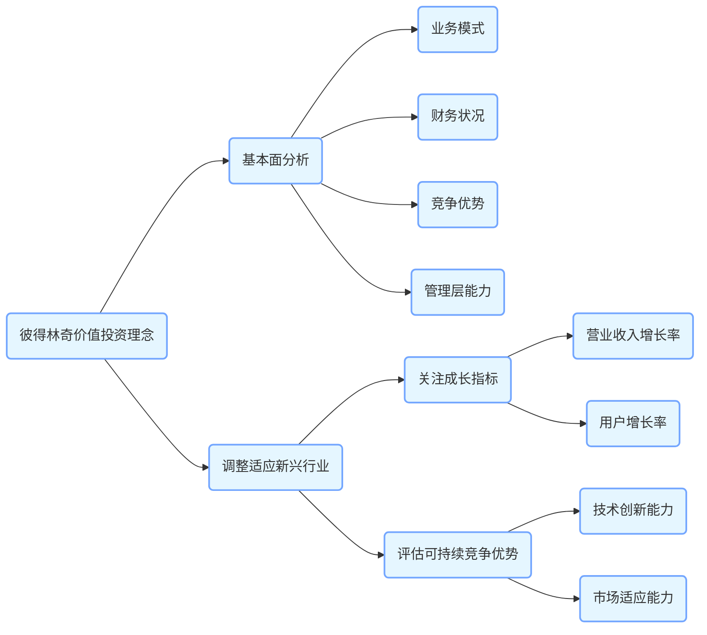

# 彼得林奇的"价值投资"在新兴行业的调整

> 关键词：彼得林奇、价值投资、新兴行业、投资调整、成长股

> 摘要：本文聚焦于彼得林奇的价值投资理念在新兴行业中的调整。首先介绍了彼得林奇价值投资的基本背景，包括其目的、预期读者等。接着阐述了价值投资的核心概念及与新兴行业的联系，分析了核心算法原理与操作步骤，并通过数学模型和公式进行详细说明。以实际项目案例展示了如何在新兴行业应用调整后的价值投资策略，探讨了其在不同新兴行业的应用场景。同时推荐了相关的学习资源、开发工具框架以及论文著作。最后总结了未来价值投资在新兴行业的发展趋势与挑战，还提供了常见问题解答和扩展阅读参考资料，旨在帮助投资者更好地在新兴行业运用价值投资理念。

## 1. 背景介绍 
### 1.1 目的和范围
彼得林奇是投资界的传奇人物，他的价值投资理念在传统行业取得了巨大成功。然而，随着科技的飞速发展，新兴行业如人工智能、生物技术、新能源等不断涌现，这些行业具有高增长、高不确定性和快速迭代等特点，与传统行业有很大差异。本文章的目的在于探讨如何对彼得林奇的价值投资理念进行调整，以适应新兴行业的投资需求。范围涵盖新兴行业的特点分析、价值投资理念的核心要素在新兴行业中的应用变化、以及具体的投资策略调整等方面。

### 1.2 预期读者
本文预期读者主要包括对投资领域感兴趣的个人投资者，希望通过学习价值投资理念在新兴行业的应用来提升自己的投资能力；金融机构的投资分析师和基金经理，他们需要不断探索新的投资策略以适应市场变化；以及相关专业的学生和研究人员，旨在深入了解投资理论在新兴行业的实践应用。

### 1.3 文档结构概述
本文首先介绍了彼得林奇价值投资理念的背景信息，包括目的、读者群体和文档结构。接着阐述了价值投资的核心概念以及与新兴行业的联系，通过流程图和示意图进行直观展示。然后详细讲解了核心算法原理和操作步骤，并结合 Python 代码进行说明。利用数学模型和公式进一步分析投资决策的依据，并举例说明。通过实际项目案例，从开发环境搭建到源代码实现和解读，展示价值投资在新兴行业的应用。探讨了新兴行业中价值投资的实际应用场景，推荐了相关的学习资源、开发工具框架和论文著作。最后总结了未来发展趋势与挑战，提供常见问题解答和扩展阅读参考资料。

### 1.4 术语表
#### 1.4.1 核心术语定义
- **价值投资**：是一种投资策略，强调通过分析公司的基本面，如财务状况、盈利能力、竞争优势等，寻找被市场低估的股票，并长期持有以获取投资回报。
- **新兴行业**：指的是处于发展初期，具有新技术、新商业模式或新市场需求的行业，如人工智能、区块链、新能源汽车等。
- **成长股**：是指那些具有高增长潜力的公司股票，通常表现为营业收入和净利润的快速增长。

#### 1.4.2 相关概念解释
- **PEG 比率**：即市盈率相对盈利增长比率，是用公司的市盈率除以盈利增长率得到的数值，用于评估股票的估值是否合理。较低的 PEG 比率通常表示股票具有较好的投资价值。
- **护城河**：是指公司拥有的可持续竞争优势，如品牌优势、技术专利、成本优势等，能够保护公司在市场竞争中获得稳定的利润。

#### 1.4.3 缩略词列表
- **PE**：市盈率（Price-to-Earnings Ratio），是指股票价格除以每股收益的比率，用于衡量股票的估值水平。
- **EPS**：每股收益（Earnings Per Share），是指公司净利润除以总股本得到的数值，反映了公司的盈利能力。

## 2. 核心概念与联系 
### 彼得林奇价值投资的核心概念
彼得林奇的价值投资理念主要基于对公司基本面的深入研究。他认为投资者应该关注公司的业务模式、财务状况、竞争优势和管理层能力等因素。通过分析这些因素，寻找那些被市场低估但具有良好发展前景的公司。

### 新兴行业的特点
新兴行业具有以下特点：
- **高增长潜力**：新兴行业往往受益于新技术的应用和市场需求的增长，具有较高的增长速度。
- **高不确定性**：由于技术和市场的快速变化，新兴行业的发展前景存在较大的不确定性。
- **快速迭代**：新兴行业的技术和产品更新换代速度快，公司需要不断创新才能保持竞争力。

### 两者的联系与调整
在新兴行业中应用彼得林奇的价值投资理念需要进行一些调整。传统的价值投资指标如市盈率、市净率等在新兴行业可能不再适用，因为新兴行业的公司往往处于亏损或微利状态，但具有较高的增长潜力。因此，需要更加关注公司的成长指标，如营业收入增长率、用户增长率等。

此外，新兴行业的竞争格局变化较快，公司的护城河可能不如传统行业那样稳定。投资者需要更加关注公司的技术创新能力和市场适应能力，以评估公司的可持续竞争优势。

### 文本示意图
```plaintext
彼得林奇价值投资理念
|
|-- 基本面分析
|   |-- 业务模式
|   |-- 财务状况
|   |-- 竞争优势
|   |-- 管理层能力
|
|-- 调整适应新兴行业
|   |-- 关注成长指标
|   |   |-- 营业收入增长率
|   |   |-- 用户增长率
|   |
|   |-- 评估可持续竞争优势
|       |-- 技术创新能力
|       |-- 市场适应能力
```

### Mermaid 流程图


## 3. 核心算法原理 & 具体操作步骤 
### 核心算法原理
在新兴行业应用彼得林奇的价值投资理念，核心算法原理是通过综合评估公司的成长指标和竞争优势，来判断公司的投资价值。可以使用以下公式来计算公司的综合得分：

$综合得分 = \alpha \times 成长指标得分 + \beta \times 竞争优势得分$

其中，$\alpha$ 和 $\beta$ 是权重系数，根据投资者对成长和竞争优势的重视程度进行调整。

### 成长指标得分计算
成长指标可以选择营业收入增长率、用户增长率等。以营业收入增长率为例，成长指标得分可以通过以下公式计算：

$成长指标得分 = \frac{营业收入增长率 - 行业平均营业收入增长率}{行业最高营业收入增长率 - 行业平均营业收入增长率}$

### 竞争优势得分计算
竞争优势得分可以通过对公司的技术创新能力、市场适应能力等因素进行评估得到。可以采用专家评分的方法，邀请行业专家对公司的各项竞争优势因素进行评分，然后取平均值得到竞争优势得分。

### 具体操作步骤
#### 步骤 1：数据收集
收集新兴行业中各公司的财务数据、业务数据和行业数据，包括营业收入、净利润、用户数量、行业平均营业收入增长率等。

#### 步骤 2：计算成长指标得分
根据上述成长指标得分计算公式，计算各公司的成长指标得分。

#### 步骤 3：评估竞争优势得分
邀请行业专家对各公司的技术创新能力、市场适应能力等竞争优势因素进行评分，计算各公司的竞争优势得分。

#### 步骤 4：计算综合得分
根据综合得分计算公式，计算各公司的综合得分。

#### 步骤 5：筛选投资标的
选择综合得分较高的公司作为投资标的。

### Python 源代码实现
```python
import pandas as pd

# 步骤 1：数据收集
data = {
    '公司名称': ['公司 A', '公司 B', '公司 C'],
    '营业收入增长率': [0.3, 0.2, 0.4],
    '行业平均营业收入增长率': [0.15, 0.15, 0.15],
    '行业最高营业收入增长率': [0.5, 0.5, 0.5],
    '竞争优势得分': [0.8, 0.7, 0.9]
}
df = pd.DataFrame(data)

# 步骤 2：计算成长指标得分
df['成长指标得分'] = (df['营业收入增长率'] - df['行业平均营业收入增长率']) / (df['行业最高营业收入增长率'] - df['行业平均营业收入增长率'])

# 步骤 3：权重设置
alpha = 0.6
beta = 0.4

# 步骤 4：计算综合得分
df['综合得分'] = alpha * df['成长指标得分'] + beta * df['竞争优势得分']

# 步骤 5：筛选投资标的
top_company = df[df['综合得分'] == df['综合得分'].max()]['公司名称'].values[0]

print("综合得分最高的公司是：", top_company)
```

## 4. 数学模型和公式 & 详细讲解 & 举例说明 
### 数学模型
在新兴行业的价值投资中，我们构建了一个综合评估模型，用于评估公司的投资价值。该模型的核心是通过综合考虑成长指标和竞争优势，计算公司的综合得分。

### 公式讲解
#### 综合得分公式
$综合得分 = \alpha \times 成长指标得分 + \beta \times 竞争优势得分$

$\alpha$ 和 $\beta$ 是权重系数，$\alpha + \beta = 1$。$\alpha$ 表示成长指标得分的权重，$\beta$ 表示竞争优势得分的权重。投资者可以根据自己的投资偏好和对新兴行业的理解，调整这两个权重系数。

#### 成长指标得分公式
$成长指标得分 = \frac{营业收入增长率 - 行业平均营业收入增长率}{行业最高营业收入增长率 - 行业平均营业收入增长率}$

该公式将公司的营业收入增长率与行业平均水平和最高水平进行比较，得到一个相对得分。得分越高，说明公司的成长能力越强。

### 举例说明
假设新兴行业中有三家公司 A、B、C，相关数据如下：

| 公司名称 | 营业收入增长率 | 行业平均营业收入增长率 | 行业最高营业收入增长率 | 竞争优势得分 |
| ---- | ---- | ---- | ---- | ---- |
| 公司 A | 0.3 | 0.15 | 0.5 | 0.8 |
| 公司 B | 0.2 | 0.15 | 0.5 | 0.7 |
| 公司 C | 0.4 | 0.15 | 0.5 | 0.9 |

#### 计算成长指标得分
- 公司 A 的成长指标得分：
$成长指标得分_A = \frac{0.3 - 0.15}{0.5 - 0.15} = \frac{0.15}{0.35} \approx 0.429$

- 公司 B 的成长指标得分：
$成长指标得分_B = \frac{0.2 - 0.15}{0.5 - 0.15} = \frac{0.05}{0.35} \approx 0.143$

- 公司 C 的成长指标得分：
$成长指标得分_C = \frac{0.4 - 0.15}{0.5 - 0.15} = \frac{0.25}{0.35} \approx 0.714$

#### 计算综合得分
假设 $\alpha = 0.6$，$\beta = 0.4$。

- 公司 A 的综合得分：
$综合得分_A = 0.6 \times 0.429 + 0.4 \times 0.8 = 0.2574 + 0.32 = 0.5774$

- 公司 B 的综合得分：
$综合得分_B = 0.6 \times 0.143 + 0.4 \times 0.7 = 0.0858 + 0.28 = 0.3658$

- 公司 C 的综合得分：
$综合得分_C = 0.6 \times 0.714 + 0.4 \times 0.9 = 0.4284 + 0.36 = 0.7884$

通过比较综合得分，我们可以看出公司 C 的综合得分最高，因此在这三家公司中，公司 C 具有较高的投资价值。

## 5. 项目实战：代码实际案例和详细解释说明 
### 5.1  开发环境搭建
#### 安装 Python
首先，需要安装 Python 环境。可以从 Python 官方网站（https://www.python.org/downloads/）下载适合自己操作系统的 Python 版本，并按照安装向导进行安装。

#### 安装必要的库
在本项目中，需要使用 `pandas` 库进行数据处理。可以使用以下命令安装 `pandas` 库：
```sh
pip install pandas
```

### 5.2  源代码详细实现和代码解读
```python
import pandas as pd

# 步骤 1：数据收集
data = {
    '公司名称': ['公司 A', '公司 B', '公司 C'],
    '营业收入增长率': [0.3, 0.2, 0.4],
    '行业平均营业收入增长率': [0.15, 0.15, 0.15],
    '行业最高营业收入增长率': [0.5, 0.5, 0.5],
    '竞争优势得分': [0.8, 0.7, 0.9]
}
df = pd.DataFrame(data)

# 代码解读：使用字典存储各公司的数据，并使用 pandas 的 DataFrame 类将数据转换为表格形式，方便后续处理。

# 步骤 2：计算成长指标得分
df['成长指标得分'] = (df['营业收入增长率'] - df['行业平均营业收入增长率']) / (df['行业最高营业收入增长率'] - df['行业平均营业收入增长率'])

# 代码解读：根据成长指标得分计算公式，对 DataFrame 中的数据进行计算，并将结果存储在新的列 '成长指标得分' 中。

# 步骤 3：权重设置
alpha = 0.6
beta = 0.4

# 代码解读：设置成长指标得分和竞争优势得分的权重系数。

# 步骤 4：计算综合得分
df['综合得分'] = alpha * df['成长指标得分'] + beta * df['竞争优势得分']

# 代码解读：根据综合得分计算公式，对 DataFrame 中的数据进行计算，并将结果存储在新的列 '综合得分' 中。

# 步骤 5：筛选投资标的
top_company = df[df['综合得分'] == df['综合得分'].max()]['公司名称'].values[0]

# 代码解读：通过筛选 DataFrame 中综合得分最高的行，获取对应的公司名称。

print("综合得分最高的公司是：", top_company)
```

### 5.3  代码解读与分析
- **数据处理**：使用 `pandas` 库将数据存储在 DataFrame 中，方便进行数据的计算和筛选。
- **指标计算**：通过对 DataFrame 中的列进行数学运算，计算成长指标得分和综合得分。
- **结果筛选**：使用布尔索引筛选出综合得分最高的公司名称。

通过这个代码示例，我们可以看到如何使用 Python 实现新兴行业价值投资的评估模型，帮助投资者筛选出具有较高投资价值的公司。

## 6. 实际应用场景 
### 人工智能行业
在人工智能行业，很多公司处于发展初期，尚未实现盈利，但具有较高的成长潜力。投资者可以使用调整后的价值投资策略，关注公司的技术创新能力、研发投入、用户数量增长等指标。例如，一家专注于人工智能芯片研发的公司，虽然目前财务报表可能不理想，但如果其拥有先进的技术和庞大的研发团队，并且用户数量在快速增长，那么该公司就可能具有较高的投资价值。

### 生物技术行业
生物技术行业的研发周期长、风险高，但一旦取得突破，回报也非常丰厚。投资者可以关注公司的在研产品管线、临床试验进展、专利技术等因素。例如，一家生物技术公司正在进行一种新型抗癌药物的研发，如果该药物在临床试验中显示出良好的疗效，并且公司拥有相关的专利技术，那么该公司的股票就可能值得投资。

### 新能源行业
新能源行业是当前的热门行业，受到政策支持和市场需求的推动。投资者可以关注公司的市场份额、技术成本、产能扩张等指标。例如，一家新能源汽车制造商，如果其市场份额不断扩大，并且在电池技术上有成本优势，同时正在积极扩张产能，那么该公司就具有较好的发展前景。

## 7. 工具和资源推荐
### 7.1 学习资源推荐
#### 7.1.1 书籍推荐
- 《彼得林奇的成功投资》：彼得林奇的经典著作，详细介绍了他的投资理念和方法。
- 《聪明的投资者》：本杰明·格雷厄姆的代表作，是价值投资领域的经典书籍。
- 《穷查理宝典》：收录了查理·芒格的演讲和文章，包含了许多关于投资和人生的智慧。

#### 7.1.2 在线课程
- Coursera 上的“投资学原理”课程：由知名教授授课，系统介绍了投资学的基本原理和方法。
- edX 上的“价值投资分析”课程：深入讲解了价值投资的分析技巧和实践应用。

#### 7.1.3 技术博客和网站
- 雪球网：国内知名的投资社区，提供了丰富的投资资讯和投资者交流平台。
- Seeking Alpha：国外的投资分析网站，有许多专业的投资分析师发布的研究报告。

### 7.2 开发工具框架推荐
#### 7.2.1 IDE和编辑器
- PyCharm：功能强大的 Python 集成开发环境，适合进行数据分析和机器学习项目。
- Jupyter Notebook：交互式的编程环境，方便进行数据探索和代码演示。

#### 7.2.2 调试和性能分析工具
- PDB：Python 自带的调试工具，可以帮助开发者定位代码中的问题。
- cProfile：Python 的性能分析工具，可以分析代码的运行时间和资源消耗。

#### 7.2.3 相关框架和库
- Pandas：用于数据处理和分析的 Python 库，提供了丰富的数据结构和函数。
- NumPy：用于科学计算的 Python 库，提供了高效的数组操作和数学函数。

### 7.3 相关论文著作推荐
#### 7.3.1 经典论文
- 《证券分析》：本杰明·格雷厄姆和戴维·多德的经典论文，奠定了价值投资的理论基础。
- 《有效市场假说》：尤金·法玛的论文，对市场效率和投资策略进行了深入探讨。

#### 7.3.2 最新研究成果
- 关注顶尖学术期刊如《金融研究》《管理科学学报》等，获取新兴行业价值投资的最新研究成果。

#### 7.3.3 应用案例分析
- 阅读行业研究报告和投资机构的分析报告，了解价值投资在新兴行业的实际应用案例。

## 8. 总结：未来发展趋势与挑战
### 未来发展趋势
- **数据驱动的投资决策**：随着大数据和人工智能技术的发展，投资者将更多地依赖数据和算法进行投资决策。通过对海量数据的分析，可以更准确地评估新兴行业公司的投资价值。
- **跨行业融合投资**：新兴行业之间的边界越来越模糊，出现了许多跨行业融合的创新模式。投资者需要具备跨行业的知识和视野，寻找跨行业融合带来的投资机会。
- **社会责任投资**：投资者越来越关注公司的社会责任和可持续发展能力。在新兴行业中，那些注重环境保护、社会公益和员工福利的公司可能更受投资者青睐。

### 挑战
- **技术变革快速**：新兴行业的技术变革速度非常快，公司的竞争优势可能很快被替代。投资者需要不断学习和跟踪新技术的发展，及时调整投资策略。
- **估值困难**：新兴行业的公司往往缺乏历史数据和盈利记录，传统的估值方法可能不再适用。如何准确评估新兴行业公司的价值是投资者面临的一大挑战。
- **政策风险**：新兴行业的发展往往受到政策的影响较大。政策的变化可能导致行业格局发生重大变化，给投资者带来不确定性。

## 9. 附录：常见问题与解答
### 问题 1：在新兴行业中，如何确定成长指标和竞争优势的权重？
解答：成长指标和竞争优势的权重可以根据投资者的投资偏好和对新兴行业的理解进行调整。如果投资者更注重公司的成长潜力，可以适当提高成长指标的权重；如果投资者更看重公司的竞争优势和稳定性，可以提高竞争优势的权重。一般来说，可以通过历史数据回测和模拟投资来确定最优的权重组合。

### 问题 2：新兴行业的公司财务数据往往不规范，如何进行有效的分析？
解答：对于财务数据不规范的新兴行业公司，可以采用以下方法进行分析：一是关注非财务指标，如用户数量、市场份额、研发投入等；二是与同行业的其他公司进行比较，找出相对优势和劣势；三是结合行业发展趋势和公司的战略规划，评估公司的未来发展潜力。

### 问题 3：如何判断新兴行业公司的技术创新能力？
解答：可以从以下几个方面判断新兴行业公司的技术创新能力：一是研发投入，研发投入占营业收入的比例越高，说明公司越重视技术创新；二是专利数量和质量，专利数量多且质量高的公司通常具有较强的技术创新能力；三是技术团队，拥有优秀的技术人才和研发团队是公司技术创新的重要保障。

## 10. 扩展阅读 & 参考资料
### 扩展阅读
- 《创新者的窘境》：探讨了新兴技术对传统行业的冲击和挑战，以及企业如何应对创新的问题。
- 《从 0 到 1》：介绍了创业和创新的理念和方法，对理解新兴行业的发展有很大帮助。

### 参考资料
- 彼得林奇的相关演讲和访谈记录。
- 各新兴行业的行业研究报告和市场分析数据。

作者：AI天才研究院/AI Genius Institute & 禅与计算机程序设计艺术 /Zen And The Art of Computer Programming