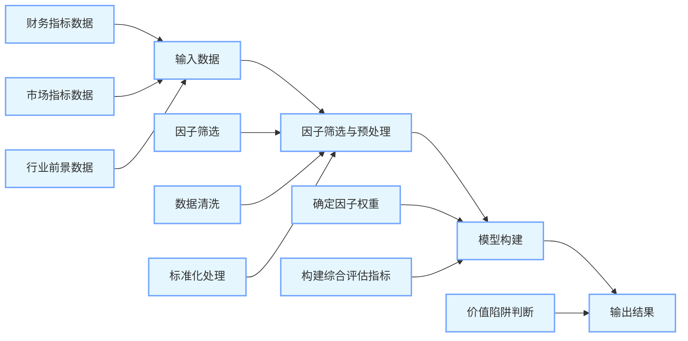

# 彼得林奇的"价值陷阱"在新兴科技股中的多因子识别模型

> 关键词：彼得林奇、价值陷阱、新兴科技股、多因子识别模型、投资分析

> 摘要：本文聚焦于彼得林奇提出的“价值陷阱”概念在新兴科技股领域的应用，旨在构建多因子识别模型以准确识别新兴科技股中的价值陷阱。通过对核心概念的阐释、算法原理的剖析、数学模型的推导，结合实际项目案例展示模型的构建与应用过程。同时，探讨该模型在实际投资场景中的应用，并推荐相关的学习资源、开发工具及论文著作。最后，对该领域的未来发展趋势与挑战进行总结，为投资者和研究人员提供全面的参考。

## 1. 背景介绍 
### 1.1 目的和范围
在当今金融市场中，新兴科技股以其高成长潜力吸引了众多投资者的目光。然而，这些股票往往伴随着高风险，其中“价值陷阱”是投资者面临的重要挑战之一。“价值陷阱”指的是那些看似具有投资价值，但实际上由于各种原因无法实现预期价值增长，甚至可能导致投资者遭受损失的股票。彼得林奇作为投资界的传奇人物，对“价值陷阱”有深刻的见解。本研究的目的是将彼得林奇的“价值陷阱”理念应用于新兴科技股，构建多因子识别模型，帮助投资者更准确地评估新兴科技股的投资价值，避免陷入价值陷阱。

本研究的范围主要涵盖新兴科技股，包括但不限于人工智能、生物医药、新能源、半导体等领域的上市公司股票。研究将综合考虑多个因素，如财务指标、市场指标、行业前景等，构建全面的多因子识别模型。

### 1.2 预期读者
本文预期读者包括金融投资者、投资分析师、金融研究人员以及对新兴科技股投资感兴趣的人士。对于投资者而言，本文提供的多因子识别模型可作为投资决策的参考工具；对于投资分析师，可作为深入研究新兴科技股的理论和实践依据；对于金融研究人员，可激发其在该领域的进一步研究；对于普通投资者，有助于提升其对新兴科技股投资风险的认识和评估能力。

### 1.3 文档结构概述
本文将按照以下结构展开：首先介绍核心概念，包括“价值陷阱”、新兴科技股和多因子识别模型的定义和联系；接着详细阐述核心算法原理和具体操作步骤，使用Python代码进行说明；然后推导数学模型和公式，并通过举例进行详细讲解；之后通过项目实战展示模型的开发过程，包括开发环境搭建、源代码实现和代码解读；再探讨该模型在实际投资场景中的应用；推荐相关的学习资源、开发工具和论文著作；最后总结未来发展趋势与挑战，并提供常见问题解答和扩展阅读参考资料。

### 1.4 术语表
#### 1.4.1 核心术语定义
- **价值陷阱**：指股票表面上看起来价格被低估，具有投资价值，但由于公司基本面存在问题、行业竞争激烈、技术变革等原因，导致股票价格长期无法上涨，甚至下跌，使投资者陷入亏损的情况。
- **新兴科技股**：指处于新兴科技领域，具有创新性和高成长潜力的上市公司股票。这些科技领域通常包括人工智能、生物技术、新能源、大数据、云计算等。
- **多因子识别模型**：一种综合考虑多个因素来评估股票投资价值的模型。通过选取与股票价值相关的多个因子，如财务指标、市场指标、行业指标等，构建数学模型来判断股票是否存在价值陷阱。

#### 1.4.2 相关概念解释
- **财务指标**：反映公司财务状况和经营成果的指标，如市盈率（PE）、市净率（PB）、净资产收益率（ROE）、净利润增长率等。这些指标可以帮助投资者了解公司的盈利能力、偿债能力和成长能力。
- **市场指标**：反映股票市场表现的指标，如成交量、换手率、股价波动幅度等。市场指标可以反映市场对股票的关注度和投资者的情绪。
- **行业前景**：指某一行业未来的发展趋势和潜力。新兴科技行业通常具有快速发展和变化的特点，行业前景对新兴科技股的投资价值有重要影响。

#### 1.4.3 缩略词列表
- **PE**：市盈率（Price-to-Earnings Ratio），指股票价格与每股收益的比率，用于衡量股票的估值水平。
- **PB**：市净率（Price-to-Book Ratio），指股票价格与每股净资产的比率，用于衡量股票的账面价值与市场价格的关系。
- **ROE**：净资产收益率（Return on Equity），指净利润与平均股东权益的百分比，用于衡量公司运用自有资本的效率。
- **EPS**：每股收益（Earnings Per Share），指税后利润与股本总数的比率，反映公司的盈利能力。

## 2. 核心概念与联系 
### 核心概念原理
#### 价值陷阱
彼得林奇认为，价值陷阱的出现往往是由于投资者对公司的基本面分析不够深入，仅仅关注了股票的低价或表面的财务指标，而忽略了公司面临的潜在问题。例如，一些公司可能由于技术落后、产品竞争力下降、管理层决策失误等原因，导致业绩持续下滑，但股票价格可能由于市场的短期波动或投资者的错误预期而看起来被低估。当投资者买入这些股票后，随着公司基本面的恶化，股票价格可能会进一步下跌，从而陷入价值陷阱。

#### 新兴科技股
新兴科技股具有高成长、高风险、高创新的特点。这些股票所处的行业通常处于快速发展和变革之中，技术创新不断涌现，市场竞争激烈。新兴科技公司的发展前景很大程度上取决于其技术实力、创新能力和市场份额。然而，由于科技行业的不确定性较高，新兴科技股的投资价值评估也相对困难。一些新兴科技公司可能在短期内取得了显著的业绩增长，但由于技术迭代速度快、竞争对手的挑战等原因，其未来的发展前景并不乐观，存在陷入价值陷阱的风险。

#### 多因子识别模型
多因子识别模型的基本原理是通过综合考虑多个与股票价值相关的因子，来全面评估股票的投资价值。每个因子都从不同的角度反映了股票的某些特征，如财务状况、市场表现、行业前景等。通过对这些因子进行量化分析和加权组合，可以构建一个综合的评估指标，用于判断股票是否存在价值陷阱。例如，一个简单的多因子识别模型可以考虑市盈率、市净率、净利润增长率等因子，通过对这些因子进行标准化处理和加权平均，得到一个综合得分，得分越低表示股票越有可能陷入价值陷阱。

### 架构的文本示意图
```plaintext
多因子识别模型
|-- 输入数据
|   |-- 财务指标数据（PE、PB、ROE等）
|   |-- 市场指标数据（成交量、换手率等）
|   |-- 行业前景数据（行业增长率、竞争格局等）
|-- 因子筛选与预处理
|   |-- 因子筛选：选择与价值陷阱相关性高的因子
|   |-- 数据清洗：去除异常值和缺失值
|   |-- 标准化处理：将因子数据进行标准化
|-- 模型构建
|   |-- 确定因子权重：通过统计方法或机器学习算法确定各因子的权重
|   |-- 构建综合评估指标：将各因子加权组合得到综合得分
|-- 输出结果
|   |-- 价值陷阱判断：根据综合得分判断股票是否存在价值陷阱
```

### Mermaid流程图


## 3. 核心算法原理 & 具体操作步骤 
### 核心算法原理
本多因子识别模型主要基于线性加权模型，通过对多个因子进行加权组合来构建综合评估指标。具体来说，假设我们选择了 $n$ 个因子 $x_1, x_2, \cdots, x_n$，每个因子的权重分别为 $w_1, w_2, \cdots, w_n$，则综合评估指标 $S$ 可以表示为：

$$S = \sum_{i=1}^{n} w_i x_i$$

其中，$x_i$ 是经过标准化处理后的因子值，$w_i$ 是因子 $x_i$ 的权重，且满足 $\sum_{i=1}^{n} w_i = 1$。

因子的权重可以通过多种方法确定，如主成分分析（PCA）、最小二乘法、机器学习算法（如线性回归、逻辑回归等）。在本模型中，我们将使用线性回归算法来确定因子的权重。线性回归的目标是找到一组权重 $w_1, w_2, \cdots, w_n$，使得综合评估指标 $S$ 与股票是否陷入价值陷阱的实际情况之间的误差最小。

### 具体操作步骤
#### 步骤1：数据收集
收集新兴科技股的相关数据，包括财务指标、市场指标和行业前景数据。财务指标可以从公司的财务报表中获取，市场指标可以从证券交易所的数据库中获取，行业前景数据可以从行业研究报告、咨询机构等渠道获取。

#### 步骤2：因子筛选
从收集到的数据中选择与价值陷阱相关性高的因子。可以通过相关性分析、显著性检验等方法来筛选因子。例如，我们可以选择市盈率、市净率、净资产收益率、净利润增长率、成交量、换手率等因子。

#### 步骤3：数据清洗
对收集到的数据进行清洗，去除异常值和缺失值。异常值可能会影响模型的准确性，缺失值可能会导致模型无法正常运行。可以使用统计方法（如均值、中位数、标准差等）来处理缺失值，使用箱线图等方法来识别和处理异常值。

#### 步骤4：标准化处理
对筛选后的因子数据进行标准化处理，使得每个因子的数据具有相同的尺度和分布。常用的标准化方法有Z-score标准化、Min-Max标准化等。Z-score标准化的公式为：

$$x_{i}^{*} = \frac{x_i - \mu_i}{\sigma_i}$$

其中，$x_{i}^{*}$ 是标准化后的因子值，$x_i$ 是原始因子值，$\mu_i$ 是因子 $x_i$ 的均值，$\sigma_i$ 是因子 $x_i$ 的标准差。

#### 步骤5：确定因子权重
使用线性回归算法来确定各因子的权重。将标准化后的因子数据作为自变量，股票是否陷入价值陷阱的实际情况作为因变量，进行线性回归分析。通过最小化误差平方和来求解最优的权重值。

#### 步骤6：构建综合评估指标
根据确定的因子权重，将各因子加权组合得到综合评估指标。综合评估指标的值越低，表示股票越有可能陷入价值陷阱。

#### 步骤7：价值陷阱判断
根据综合评估指标的值，设定一个阈值，当综合评估指标的值低于阈值时，判断该股票存在价值陷阱；否则，判断该股票不存在价值陷阱。

### Python源代码实现
```python
import pandas as pd
import numpy as np
from sklearn.linear_model import LinearRegression
from sklearn.preprocessing import StandardScaler

# 步骤1：数据收集
# 假设已经收集到了新兴科技股的相关数据，并存储在一个DataFrame中
data = pd.read_csv('emerging_tech_stocks.csv')

# 步骤2：因子筛选
selected_factors = ['PE', 'PB', 'ROE', 'NetProfitGrowthRate', 'Volume', 'TurnoverRate']
X = data[selected_factors]
y = data['ValueTrap']  # 假设 'ValueTrap' 是表示股票是否陷入价值陷阱的标签，1表示是，0表示否

# 步骤3：数据清洗
X = X.dropna()
y = y[X.index]

# 步骤4：标准化处理
scaler = StandardScaler()
X_scaled = scaler.fit_transform(X)

# 步骤5：确定因子权重
model = LinearRegression()
model.fit(X_scaled, y)
weights = model.coef_

# 步骤6：构建综合评估指标
S = np.dot(X_scaled, weights)

# 步骤7：价值陷阱判断
threshold = 0.5
value_trap_prediction = (S < threshold).astype(int)

# 输出结果
result = pd.DataFrame({
    'StockCode': data['StockCode'],
    'ActualValueTrap': y,
    'PredictedValueTrap': value_trap_prediction
})
print(result)
```

## 4. 数学模型和公式 & 详细讲解 & 举例说明 
### 线性回归模型
线性回归模型是本多因子识别模型中用于确定因子权重的核心模型。线性回归的基本假设是因变量 $y$ 与自变量 $x_1, x_2, \cdots, x_n$ 之间存在线性关系，可以表示为：

$$y = \beta_0 + \beta_1 x_1 + \beta_2 x_2 + \cdots + \beta_n x_n + \epsilon$$

其中，$y$ 是因变量，$x_1, x_2, \cdots, x_n$ 是自变量，$\beta_0, \beta_1, \beta_2, \cdots, \beta_n$ 是待估计的系数，$\epsilon$ 是误差项，服从均值为0、方差为 $\sigma^2$ 的正态分布。

线性回归的目标是找到一组最优的系数 $\beta_0, \beta_1, \beta_2, \cdots, \beta_n$，使得误差项 $\epsilon$ 的平方和最小。误差平方和可以表示为：

$$Q(\beta_0, \beta_1, \cdots, \beta_n) = \sum_{i=1}^{m} (y_i - \beta_0 - \beta_1 x_{i1} - \cdots - \beta_n x_{in})^2$$

其中，$m$ 是样本数量，$y_i$ 是第 $i$ 个样本的因变量值，$x_{i1}, x_{i2}, \cdots, x_{in}$ 是第 $i$ 个样本的自变量值。

通过最小化误差平方和 $Q(\beta_0, \beta_1, \cdots, \beta_n)$，可以得到最优的系数估计值 $\hat{\beta}_0, \hat{\beta}_1, \cdots, \hat{\beta}_n$。在本模型中，自变量 $x_1, x_2, \cdots, x_n$ 是标准化后的因子值，因变量 $y$ 是股票是否陷入价值陷阱的标签。

### 综合评估指标公式
综合评估指标 $S$ 的计算公式为：

$$S = \sum_{i=1}^{n} w_i x_i$$

其中，$x_i$ 是经过标准化处理后的因子值，$w_i$ 是因子 $x_i$ 的权重，且满足 $\sum_{i=1}^{n} w_i = 1$。

### 举例说明
假设我们选择了三个因子：市盈率（PE）、市净率（PB）和净资产收益率（ROE），并通过线性回归算法得到了它们的权重分别为 $w_1 = 0.3$，$w_2 = 0.4$，$w_3 = 0.3$。某只新兴科技股的标准化后的因子值分别为 $x_1 = 0.5$，$x_2 = 0.6$，$x_3 = 0.8$，则该股票的综合评估指标 $S$ 为：

$$S = 0.3 \times 0.5 + 0.4 \times 0.6 + 0.3 \times 0.8 = 0.63$$

假设我们设定的阈值为 $0.5$，由于 $S = 0.63 > 0.5$，则判断该股票不存在价值陷阱。

## 5. 项目实战：代码实际案例和详细解释说明 
### 5.1  开发环境搭建
#### 安装Python
首先，需要安装Python环境。建议使用Python 3.7及以上版本，可以从Python官方网站（https://www.python.org/downloads/）下载并安装。

#### 安装必要的库
本项目需要使用以下Python库：
- `pandas`：用于数据处理和分析。
- `numpy`：用于数值计算。
- `scikit-learn`：用于机器学习算法的实现。

可以使用以下命令来安装这些库：
```sh
pip install pandas numpy scikit-learn
```

#### 数据准备
收集新兴科技股的相关数据，并将其存储在一个CSV文件中。CSV文件的列名应包括所选的因子名称和股票是否陷入价值陷阱的标签。例如：
```plaintext
StockCode,PE,PB,ROE,NetProfitGrowthRate,Volume,TurnoverRate,ValueTrap
000001,20,2,15,0.2,1000000,0.05,0
000002,30,3,12,0.1,2000000,0.06,1
...
```

### 5.2  源代码详细实现和代码解读
```python
import pandas as pd
import numpy as np
from sklearn.linear_model import LinearRegression
from sklearn.preprocessing import StandardScaler

# 步骤1：数据收集
# 读取CSV文件
data = pd.read_csv('emerging_tech_stocks.csv')

# 步骤2：因子筛选
# 选择与价值陷阱相关性高的因子
selected_factors = ['PE', 'PB', 'ROE', 'NetProfitGrowthRate', 'Volume', 'TurnoverRate']
X = data[selected_factors]
y = data['ValueTrap']  # 假设 'ValueTrap' 是表示股票是否陷入价值陷阱的标签，1表示是，0表示否

# 步骤3：数据清洗
# 去除包含缺失值的行
X = X.dropna()
y = y[X.index]

# 步骤4：标准化处理
# 创建标准化对象
scaler = StandardScaler()
# 对因子数据进行标准化处理
X_scaled = scaler.fit_transform(X)

# 步骤5：确定因子权重
# 创建线性回归模型对象
model = LinearRegression()
# 使用标准化后的因子数据和标签进行模型训练
model.fit(X_scaled, y)
# 获取因子的权重
weights = model.coef_

# 步骤6：构建综合评估指标
# 计算综合评估指标
S = np.dot(X_scaled, weights)

# 步骤7：价值陷阱判断
# 设定阈值
threshold = 0.5
# 根据综合评估指标和阈值进行价值陷阱判断
value_trap_prediction = (S < threshold).astype(int)

# 输出结果
result = pd.DataFrame({
    'StockCode': data['StockCode'],
    'ActualValueTrap': y,
    'PredictedValueTrap': value_trap_prediction
})
print(result)
```

### 5.3  代码解读与分析
#### 数据收集
使用 `pandas` 库的 `read_csv` 函数读取存储新兴科技股数据的CSV文件，并将其存储在一个DataFrame中。

#### 因子筛选
选择与价值陷阱相关性高的因子，并将其存储在一个新的DataFrame `X` 中。同时，将股票是否陷入价值陷阱的标签存储在 `y` 中。

#### 数据清洗
使用 `dropna` 方法去除包含缺失值的行，确保数据的完整性。

#### 标准化处理
使用 `StandardScaler` 类对因子数据进行标准化处理，使得每个因子的数据具有相同的尺度和分布。

#### 确定因子权重
使用 `LinearRegression` 类创建线性回归模型对象，并使用标准化后的因子数据和标签进行模型训练。通过 `coef_` 属性获取因子的权重。

#### 构建综合评估指标
使用 `np.dot` 函数计算综合评估指标，即将标准化后的因子数据与因子权重进行点积运算。

#### 价值陷阱判断
设定一个阈值，当综合评估指标的值低于阈值时，判断该股票存在价值陷阱；否则，判断该股票不存在价值陷阱。

#### 输出结果
将股票代码、实际的价值陷阱标签和预测的价值陷阱标签存储在一个新的DataFrame中，并打印输出。

## 6. 实际应用场景 
### 投资决策参考
对于投资者而言，本多因子识别模型可以作为投资决策的重要参考工具。在选择新兴科技股进行投资时，投资者可以使用该模型对股票进行评估，判断其是否存在价值陷阱。对于被判断为存在价值陷阱的股票，投资者可以谨慎对待，避免盲目投资；对于被判断为不存在价值陷阱的股票，投资者可以进一步深入研究其投资价值，增加投资成功的概率。

### 投资组合管理
在构建投资组合时，投资者可以使用本模型对投资组合中的新兴科技股进行筛选和调整。剔除存在价值陷阱的股票，保留具有投资潜力的股票，从而优化投资组合的结构，降低投资风险，提高投资收益。

### 金融研究
金融研究人员可以使用本模型对新兴科技股市场进行深入研究，分析价值陷阱的形成原因和影响因素。通过对不同时期、不同行业的新兴科技股进行实证研究，揭示价值陷阱的变化规律，为投资者和监管机构提供决策依据。

### 风险预警
金融机构和监管部门可以使用本模型对新兴科技股市场进行风险监测和预警。当模型识别出大量股票存在价值陷阱时，及时发布风险预警信息，提醒投资者注意投资风险，防范金融市场系统性风险的发生。

## 7. 工具和资源推荐
### 7.1 学习资源推荐
#### 7.1.1 书籍推荐
- 《彼得林奇的成功投资》：彼得林奇的经典著作，介绍了他的投资理念和方法，对于理解“价值陷阱”概念有很大帮助。
- 《聪明的投资者》：本杰明·格雷厄姆的经典投资著作，强调了价值投资的重要性，对投资者的投资决策有重要的指导意义。
- 《金融市场学》：全面介绍了金融市场的基本概念、理论和实践，对于理解新兴科技股市场的运行机制有很大帮助。

#### 7.1.2 在线课程
- Coursera上的“投资学原理”：由知名大学教授授课，系统介绍了投资学的基本原理和方法。
- edX上的“金融数据分析与建模”：教授如何使用Python进行金融数据分析和建模，对于构建多因子识别模型有很大帮助。

#### 7.1.3 技术博客和网站
- 雪球网：国内知名的投资社区，提供了丰富的股票分析和投资策略分享。
- 东方财富网：提供了全面的金融信息和数据，包括股票行情、财务报表、行业研究报告等。
- Seeking Alpha：国外知名的金融博客网站，提供了大量的股票分析和投资建议。

### 7.2 开发工具框架推荐
#### 7.2.1 IDE和编辑器
- PyCharm：专业的Python集成开发环境，提供了丰富的代码编辑、调试和项目管理功能。
- Jupyter Notebook：交互式的开发环境，适合进行数据探索和模型开发。

#### 7.2.2 调试和性能分析工具
- PDB：Python自带的调试工具，用于调试Python代码。
- cProfile：Python自带的性能分析工具，用于分析Python代码的性能瓶颈。

#### 7.2.3 相关框架和库
- Pandas：用于数据处理和分析的Python库，提供了丰富的数据结构和数据操作方法。
- NumPy：用于数值计算的Python库，提供了高效的数组操作和数学函数。
- Scikit-learn：用于机器学习的Python库，提供了丰富的机器学习算法和工具。

### 7.3 相关论文著作推荐
#### 7.3.1 经典论文
- Fama, E. F., & French, K. R. (1992). The cross-section of expected stock returns. Journal of Finance, 47(2), 427-465. 该论文提出了著名的Fama-French三因子模型，为多因子模型的发展奠定了基础。
- Sharpe, W. F. (1964). Capital asset prices: A theory of market equilibrium under conditions of risk. The Journal of Finance, 19(3), 425-442. 该论文提出了资本资产定价模型（CAPM），是现代金融理论的重要基石之一。

#### 7.3.2 最新研究成果
- 关注顶级金融学术期刊，如Journal of Financial Economics、Review of Financial Studies等，了解新兴科技股投资和价值陷阱识别的最新研究成果。

#### 7.3.3 应用案例分析
- 参考金融机构和投资公司的研究报告，了解多因子识别模型在实际投资中的应用案例和效果评估。

## 8. 总结：未来发展趋势与挑战
### 未来发展趋势
#### 多因子模型的不断完善
随着金融市场的不断发展和变化，多因子识别模型也将不断完善。未来，可能会引入更多的因子，如宏观经济指标、政策因素、技术创新指标等，以提高模型的准确性和预测能力。同时，模型的算法和方法也将不断改进，如使用深度学习算法来处理复杂的非线性关系。

#### 与人工智能技术的融合
人工智能技术的快速发展为新兴科技股的投资分析带来了新的机遇。未来，多因子识别模型可能会与人工智能技术深度融合，如使用机器学习算法进行因子筛选和权重确定，使用自然语言处理技术对新闻和社交媒体数据进行分析，以获取更多的信息和洞察。

#### 跨市场和跨行业应用
随着全球金融市场的一体化和新兴科技行业的不断涌现，多因子识别模型将不仅仅局限于单一市场和行业。未来，模型可能会应用于跨市场和跨行业的投资分析，以帮助投资者在全球范围内寻找投资机会，降低投资风险。

### 挑战
#### 数据质量和可得性
多因子识别模型的准确性和可靠性很大程度上取决于数据的质量和可得性。新兴科技行业的数据往往具有较高的不确定性和复杂性，数据的质量和准确性可能存在问题。同时，一些关键数据可能难以获取，如公司的核心技术信息、未来的市场需求预测等，这给模型的构建和应用带来了一定的挑战。

#### 因子的选择和权重确定
在构建多因子识别模型时，因子的选择和权重确定是关键环节。然而，如何选择与价值陷阱相关性高的因子，以及如何合理确定各因子的权重，是一个复杂的问题。不同的因子选择和权重确定方法可能会导致不同的模型结果，因此需要不断地进行实证研究和优化。

#### 市场环境的变化
金融市场环境是不断变化的，新兴科技行业的发展也具有较高的不确定性。市场环境的变化可能会导致因子与价值陷阱之间的关系发生改变，从而影响模型的准确性和稳定性。因此，需要不断地对模型进行更新和调整，以适应市场环境的变化。

## 9. 附录：常见问题与解答
### 问题1：如何选择合适的因子？
答：选择合适的因子需要综合考虑多个因素。首先，可以参考相关的金融理论和研究成果，选择那些被广泛认为与股票价值相关的因子，如财务指标、市场指标等。其次，可以使用相关性分析、显著性检验等方法，从大量的因子中筛选出与价值陷阱相关性高的因子。最后，还需要结合新兴科技行业的特点，选择那些能够反映行业发展趋势和公司核心竞争力的因子。

### 问题2：如何确定因子的权重？
答：确定因子的权重可以使用多种方法，如主成分分析（PCA）、最小二乘法、机器学习算法（如线性回归、逻辑回归等）。在本模型中，我们使用线性回归算法来确定因子的权重。线性回归的目标是找到一组权重，使得综合评估指标与股票是否陷入价值陷阱的实际情况之间的误差最小。

### 问题3：模型的准确性如何评估？
答：可以使用多种指标来评估模型的准确性，如准确率、召回率、F1值等。准确率是指模型预测正确的样本数占总样本数的比例；召回率是指模型正确预测为正样本的样本数占实际正样本数的比例；F1值是准确率和召回率的调和平均数。此外，还可以使用交叉验证等方法来评估模型的稳定性和泛化能力。

### 问题4：模型是否适用于所有新兴科技股？
答：本模型是基于一定的假设和数据构建的，可能不适用于所有新兴科技股。不同的新兴科技行业具有不同的特点和发展规律，因此在应用模型时需要结合具体行业的情况进行调整和优化。同时，模型的准确性也受到数据质量和市场环境变化的影响，需要不断地进行更新和改进。

## 10. 扩展阅读 & 参考资料
### 扩展阅读
- 《量化投资：策略与技术》：介绍了量化投资的基本概念、策略和技术，对于深入理解多因子模型的应用有很大帮助。
- 《机器学习实战》：通过实际案例介绍了机器学习算法的应用，对于使用机器学习算法构建多因子识别模型有很大的参考价值。

### 参考资料
- 彼得林奇. 《彼得林奇的成功投资》. 机械工业出版社.
- Fama, E. F., & French, K. R. (1992). The cross-section of expected stock returns. Journal of Finance, 47(2), 427-465.
- Sharpe, W. F. (1964). Capital asset prices: A theory of market equilibrium under conditions of risk. The Journal of Finance, 19(3), 425-442.

作者：AI天才研究院/AI Genius Institute & 禅与计算机程序设计艺术 /Zen And The Art of Computer Programming