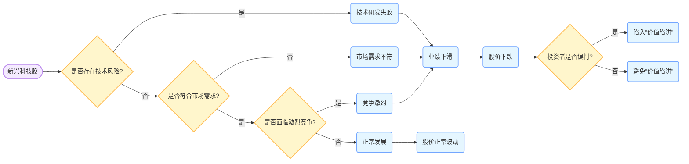

# 彼得林奇的"价值陷阱"在新兴科技股中的识别

> 关键词：彼得林奇、价值陷阱、新兴科技股、识别方法、投资策略

> 摘要：本文聚焦于彼得林奇提出的“价值陷阱”概念在新兴科技股领域的应用。首先介绍了研究的背景、目的、预期读者等信息，详细解释了核心概念及其联系，并给出相应的示意图和流程图。接着阐述了识别“价值陷阱”的核心算法原理和具体操作步骤，结合数学模型和公式进行深入分析，还列举了实际例子。通过项目实战，展示了如何在实际中识别新兴科技股的“价值陷阱”，包括开发环境搭建、源代码实现与解读。探讨了“价值陷阱”识别在新兴科技股投资中的实际应用场景，推荐了相关的学习资源、开发工具框架以及论文著作。最后总结了未来发展趋势与挑战，提供常见问题解答和扩展阅读参考资料，旨在帮助投资者更准确地识别新兴科技股中的“价值陷阱”，做出更明智的投资决策。

## 1. 背景介绍 
### 1.1 目的和范围
在当今的金融市场中，新兴科技股以其高增长潜力吸引了众多投资者的目光。然而，新兴科技行业的快速变化和不确定性也使得投资者面临着巨大的风险。彼得林奇提出的“价值陷阱”概念为我们分析和识别这些风险提供了重要的理论基础。本文的目的在于深入探讨如何运用彼得林奇的“价值陷阱”理论来识别新兴科技股中的潜在风险，帮助投资者避免陷入看似有价值但实际上可能带来损失的投资。研究范围涵盖了新兴科技行业的多个领域，包括人工智能、生物技术、新能源等热门行业。

### 1.2 预期读者
本文主要面向对新兴科技股投资感兴趣的投资者，包括个人投资者、机构投资者以及金融行业的从业者。同时，对于从事金融研究、数据分析的专业人士，也可以从本文中获取有关新兴科技股风险识别的新视角和方法。

### 1.3 文档结构概述
本文将按照以下结构展开：首先介绍核心概念，明确“价值陷阱”和新兴科技股的定义及它们之间的联系；然后阐述识别“价值陷阱”的核心算法原理和具体操作步骤，并结合数学模型进行分析；接着通过项目实战展示如何在实际中运用这些方法；之后探讨实际应用场景，为投资者提供参考；再推荐相关的学习资源、开发工具框架和论文著作；最后总结未来发展趋势与挑战，解答常见问题，并提供扩展阅读参考资料。

### 1.4 术语表
#### 1.4.1 核心术语定义
- **彼得林奇的“价值陷阱”**：指投资者因股票价格相对较低或某些表面的财务指标看似良好而认为该股票具有投资价值，但实际上公司的基本面存在严重问题，未来业绩可能无法支撑股价，导致投资者陷入亏损的情况。
- **新兴科技股**：指那些处于新兴科技行业，如人工智能、生物技术、新能源、区块链等领域，具有较高的创新性和增长潜力，但同时也伴随着较高风险的股票。

#### 1.4.2 相关概念解释
- **基本面分析**：通过研究公司的财务报表、经营状况、行业竞争力等方面来评估公司的内在价值和未来发展潜力的分析方法。
- **市场预期**：投资者对公司未来业绩和股价表现的预期，通常反映在股票的估值水平上。

#### 1.4.3 缩略词列表
- **PE**：市盈率（Price-to-Earnings Ratio），指股票价格除以每股收益的比率，用于衡量股票的估值水平。
- **PB**：市净率（Price-to-Book Ratio），指股票价格除以每股净资产的比率，反映了股票价格相对于公司净资产的倍数。

## 2. 核心概念与联系 
### 核心概念原理
#### 彼得林奇的“价值陷阱”原理
彼得林奇认为，投资者往往容易被股票的低价格或一些表面的财务指标所迷惑，而忽略了公司的基本面问题。例如，一家公司可能因为业绩下滑、行业竞争加剧等原因导致股价下跌，但投资者可能认为此时的股价已经足够便宜，从而买入该股票。然而，如果公司的基本面没有得到改善，甚至继续恶化，那么股价可能会继续下跌，投资者就会陷入“价值陷阱”。

#### 新兴科技股的特点
新兴科技股具有创新性、高增长潜力和高风险性等特点。这些公司通常处于技术创新的前沿，致力于开发新的产品或服务，具有较大的成长空间。然而，由于新兴科技行业的不确定性较大，公司的技术研发可能失败，市场需求可能不如预期，竞争也可能非常激烈，这些因素都使得新兴科技股的投资风险较高。

### 核心概念的联系
新兴科技股由于其高风险性，更容易出现“价值陷阱”。一方面，新兴科技行业的快速发展使得一些公司的估值可能被高估，当市场对这些公司的预期过高而实际业绩无法达到时，股价就会下跌，投资者可能误以为是买入机会，从而陷入“价值陷阱”。另一方面，新兴科技公司的技术更新换代快，如果公司不能及时跟上技术发展的步伐，就可能被市场淘汰，即使股价看似便宜，也可能是“价值陷阱”。

### 文本示意图
```plaintext
           彼得林奇的“价值陷阱”
                |
                |
                | 容易出现在
                |
                |
        新兴科技股（创新性、高增长、高风险）
        |         |         |
        |         |         |
    技术研发失败 市场需求不符 竞争激烈
        |         |         |
        |         |         |
    业绩下滑  估值过高  被市场淘汰
        |         |         |
        |         |         |
    股价下跌  股价下跌  股价下跌
        |         |         |
        |         |         |
    投资者可能误判为价值投资，陷入“价值陷阱”
```

### Mermaid 流程图


## 3. 核心算法原理 & 具体操作步骤 
### 核心算法原理
识别新兴科技股中的“价值陷阱”可以采用多指标综合分析的方法。通过对公司的财务指标、技术指标和市场指标进行综合评估，判断公司是否存在潜在的风险。以下是一些常用的指标和评估方法：

#### 财务指标分析
- **市盈率（PE）**：$PE=\frac{股价}{每股收益}$，用于衡量股票的估值水平。如果一家新兴科技公司的市盈率过高，可能意味着市场对其预期过高，存在估值泡沫；如果市盈率过低，需要进一步分析公司的业绩是否存在问题。
- **市净率（PB）**：$PB=\frac{股价}{每股净资产}$，反映了股票价格相对于公司净资产的倍数。较低的市净率可能表示股票被低估，但也可能是公司资产质量不佳或存在潜在风险。
- **净利润增长率**：$净利润增长率=\frac{本期净利润 - 上期净利润}{上期净利润}\times100\%$，用于衡量公司的盈利能力和增长速度。如果净利润增长率持续下降或为负数，可能表示公司的业绩出现问题。

#### 技术指标分析
- **研发投入占比**：$研发投入占比=\frac{研发投入}{营业收入}\times100\%$，反映了公司对技术研发的重视程度和投入力度。较高的研发投入占比通常表示公司具有较强的创新能力，但也需要关注研发成果的转化情况。
- **专利数量和质量**：专利数量和质量可以反映公司的技术实力和创新能力。拥有较多高质量专利的公司通常具有更强的竞争力和发展潜力。

#### 市场指标分析
- **市场份额**：市场份额反映了公司在行业中的竞争地位。如果一家公司的市场份额持续下降，可能表示公司面临着激烈的竞争或市场需求的变化。
- **机构持股比例**：机构投资者通常具有更专业的研究和分析能力，机构持股比例的变化可以反映机构投资者对公司的看法和预期。

### 具体操作步骤
#### 数据收集
收集新兴科技公司的财务报表、研发报告、市场调研数据等相关信息。可以通过证券交易所网站、财经媒体、专业数据库等渠道获取数据。

#### 指标计算
根据上述指标的计算公式，计算公司的各项指标值。

#### 指标评估
将计算得到的指标值与同行业其他公司进行比较，评估公司的相对表现。同时，分析指标的历史变化趋势，判断公司的发展状况。

#### 综合判断
根据各项指标的评估结果，综合判断公司是否存在“价值陷阱”。如果公司的多个指标都表现不佳，或者某些关键指标出现异常变化，那么需要进一步深入分析公司的基本面，谨慎做出投资决策。

### Python 源代码实现
```python
import pandas as pd

# 模拟收集到的新兴科技公司数据
data = {
    '公司名称': ['公司A', '公司B', '公司C'],
    '股价': [100, 80, 120],
    '每股收益': [5, 3, 6],
    '每股净资产': [20, 15, 25],
    '本期净利润': [1000, 800, 1200],
    '上期净利润': [900, 900, 1100],
    '研发投入': [200, 150, 250],
    '营业收入': [1000, 800, 1200],
    '市场份额': [0.2, 0.15, 0.25],
    '机构持股比例': [0.3, 0.2, 0.4]
}

df = pd.DataFrame(data)

# 计算各项指标
df['PE'] = df['股价'] / df['每股收益']
df['PB'] = df['股价'] / df['每股净资产']
df['净利润增长率'] = (df['本期净利润'] - df['上期净利润']) / df['上期净利润'] * 100
df['研发投入占比'] = df['研发投入'] / df['营业收入'] * 100

# 输出计算结果
print(df[['公司名称', 'PE', 'PB', '净利润增长率', '研发投入占比', '市场份额', '机构持股比例']])
```
### 代码解释
- 首先，使用 `pandas` 库创建一个包含新兴科技公司相关数据的 `DataFrame`。
- 然后，根据上述指标的计算公式，计算公司的市盈率（PE）、市净率（PB）、净利润增长率和研发投入占比。
- 最后，输出计算结果，方便进行指标评估和综合判断。

## 4. 数学模型和公式 & 详细讲解 & 举例说明 
### 财务指标公式及讲解
#### 市盈率（PE）
公式：$PE=\frac{股价}{每股收益}$
讲解：市盈率是衡量股票估值水平的常用指标。较高的市盈率表示市场对公司的未来盈利预期较高，愿意为每股收益支付较高的价格；较低的市盈率则可能表示市场对公司的预期较低，或者公司的业绩存在问题。需要注意的是，不同行业的市盈率水平可能存在较大差异，因此在使用市盈率进行评估时，需要与同行业其他公司进行比较。

举例：假设新兴科技公司 A 的股价为 100 元，每股收益为 5 元，则其市盈率为 $PE=\frac{100}{5}=20$ 倍。如果同行业其他公司的平均市盈率为 30 倍，那么公司 A 的估值相对较低，但需要进一步分析其业绩是否存在问题。

#### 市净率（PB）
公式：$PB=\frac{股价}{每股净资产}$
讲解：市净率反映了股票价格相对于公司净资产的倍数。较低的市净率可能表示股票被低估，但也可能是公司资产质量不佳或存在潜在风险。例如，一家公司的净资产主要由过时的设备或不良资产组成，那么即使市净率较低，也可能不值得投资。

举例：假设新兴科技公司 B 的股价为 80 元，每股净资产为 15 元，则其市净率为 $PB=\frac{80}{15}\approx5.33$ 倍。如果同行业其他公司的平均市净率为 4 倍，那么公司 B 的估值相对较高，需要进一步分析其资产质量和盈利能力。

#### 净利润增长率
公式：$净利润增长率=\frac{本期净利润 - 上期净利润}{上期净利润}\times100\%$
讲解：净利润增长率用于衡量公司的盈利能力和增长速度。持续增长的净利润增长率表示公司的业绩在不断提升，具有较好的发展前景；而净利润增长率下降或为负数，则可能表示公司的业绩出现问题。

举例：假设新兴科技公司 C 的本期净利润为 1200 万元，上期净利润为 1100 万元，则其净利润增长率为 $净利润增长率=\frac{1200 - 1100}{1100}\times100\%\approx9.09\%$。如果公司 C 的净利润增长率连续多个季度下降，那么需要关注其业绩下滑的原因。

### 技术指标公式及讲解
#### 研发投入占比
公式：$研发投入占比=\frac{研发投入}{营业收入}\times100\%$
讲解：研发投入占比反映了公司对技术研发的重视程度和投入力度。较高的研发投入占比通常表示公司具有较强的创新能力，但也需要关注研发成果的转化情况。如果公司的研发投入很高，但没有相应的新产品或服务推出，或者新产品的市场反响不佳，那么高研发投入可能无法带来实际的经济效益。

举例：假设新兴科技公司 D 的研发投入为 200 万元，营业收入为 1000 万元，则其研发投入占比为 $研发投入占比=\frac{200}{1000}\times100\%=20\%$。如果同行业其他公司的平均研发投入占比为 15%，那么公司 D 在研发方面的投入相对较高，需要进一步关注其研发成果的转化情况。

### 市场指标公式及讲解
#### 市场份额
公式：$市场份额=\frac{公司的销售额}{行业总销售额}\times100\%$
讲解：市场份额反映了公司在行业中的竞争地位。较高的市场份额表示公司在行业中具有较强的竞争力和话语权；而市场份额下降则可能表示公司面临着激烈的竞争或市场需求的变化。

举例：假设新兴科技行业的总销售额为 1 亿元，公司 E 的销售额为 2000 万元，则其市场份额为 $市场份额=\frac{2000}{10000}\times100\%=20\%$。如果公司 E 的市场份额连续多个季度下降，那么需要关注其市场竞争力是否下降。

## 5. 项目实战：代码实际案例和详细解释说明 
### 5.1  开发环境搭建
#### 安装 Python
首先，需要安装 Python 编程语言。可以从 Python 官方网站（https://www.python.org/downloads/）下载适合自己操作系统的 Python 版本，并按照安装向导进行安装。

#### 安装必要的库
在项目中，我们需要使用 `pandas` 库进行数据处理和分析，使用 `matplotlib` 库进行数据可视化。可以使用以下命令安装这些库：
```sh
pip install pandas matplotlib
```

### 5.2  源代码详细实现和代码解读
```python
import pandas as pd
import matplotlib.pyplot as plt

# 读取新兴科技公司数据文件（假设文件名为 tech_stocks.csv）
data = pd.read_csv('tech_stocks.csv')

# 计算各项指标
data['PE'] = data['股价'] / data['每股收益']
data['PB'] = data['股价'] / data['每股净资产']
data['净利润增长率'] = (data['本期净利润'] - data['上期净利润']) / data['上期净利润'] * 100
data['研发投入占比'] = data['研发投入'] / data['营业收入'] * 100

# 筛选出存在潜在“价值陷阱”的公司
potential_traps = data[(data['PE'] < data['PE'].mean()) & (data['净利润增长率'] < 0)]

# 可视化分析
plt.figure(figsize=(12, 6))
plt.subplot(1, 2, 1)
plt.scatter(data['PE'], data['净利润增长率'])
plt.xlabel('市盈率（PE）')
plt.ylabel('净利润增长率')
plt.title('市盈率与净利润增长率散点图')

plt.subplot(1, 2, 2)
plt.scatter(data['PB'], data['研发投入占比'])
plt.xlabel('市净率（PB）')
plt.ylabel('研发投入占比')
plt.title('市净率与研发投入占比散点图')

plt.show()

# 输出存在潜在“价值陷阱”的公司
print('存在潜在“价值陷阱”的公司：')
print(potential_traps[['公司名称', 'PE', '净利润增长率']])
```
### 代码解读
1. **数据读取**：使用 `pandas` 库的 `read_csv` 函数读取新兴科技公司的数据文件。
2. **指标计算**：根据前面介绍的公式，计算公司的市盈率（PE）、市净率（PB）、净利润增长率和研发投入占比。
3. **筛选潜在“价值陷阱”公司**：通过条件筛选，找出市盈率低于平均值且净利润增长率为负数的公司，这些公司可能存在潜在的“价值陷阱”。
4. **可视化分析**：使用 `matplotlib` 库绘制市盈率与净利润增长率、市净率与研发投入占比的散点图，帮助我们直观地观察数据之间的关系。
5. **输出结果**：输出存在潜在“价值陷阱”的公司的相关信息。

### 5.3  代码解读与分析
通过上述代码，我们可以对新兴科技公司的数据进行全面的分析和评估。首先，计算各项指标可以帮助我们了解公司的财务状况、技术实力和市场竞争力。然后，通过筛选潜在“价值陷阱”公司，我们可以找出那些可能存在风险的投资对象。最后，可视化分析可以帮助我们更直观地观察数据之间的关系，发现潜在的问题。

需要注意的是，上述代码只是一个简单的示例，实际应用中可能需要根据具体情况进行调整和优化。例如，可以增加更多的指标和条件进行筛选，或者使用更复杂的数据分析方法进行深入研究。

## 6. 实际应用场景 
### 个人投资者决策
对于个人投资者来说，识别新兴科技股中的“价值陷阱”可以帮助他们避免盲目投资，提高投资的成功率。在选择新兴科技股进行投资时，个人投资者可以运用本文介绍的方法和指标，对公司进行全面的分析和评估。例如，通过分析公司的市盈率、市净率、净利润增长率等财务指标，以及研发投入占比、市场份额等技术和市场指标，判断公司是否存在潜在的风险。如果发现公司存在“价值陷阱”的迹象，个人投资者可以谨慎考虑是否投资该股票，或者选择其他更具投资价值的股票。

### 机构投资者资产配置
机构投资者通常管理着大量的资金，需要进行合理的资产配置以降低风险和提高收益。在配置新兴科技股资产时，机构投资者可以运用“价值陷阱”识别方法，筛选出具有真正投资价值的公司，避免将资金投入到存在潜在风险的股票中。例如，机构投资者可以建立自己的投资模型，将本文介绍的各项指标纳入模型中，对新兴科技公司进行量化评估。根据评估结果，机构投资者可以调整投资组合，增加优质股票的持仓比例，减少或避免投资存在“价值陷阱”的股票。

### 金融分析师研究报告
金融分析师在撰写新兴科技股研究报告时，可以运用“价值陷阱”识别方法，为投资者提供更准确、更有价值的投资建议。金融分析师可以通过对公司的基本面分析、行业研究和市场调研，结合本文介绍的指标和方法，评估公司的投资价值和潜在风险。在研究报告中，金融分析师可以详细阐述公司的各项指标表现，分析公司是否存在“价值陷阱”的可能性，并给出相应的投资建议。投资者可以根据金融分析师的研究报告，做出更明智的投资决策。

## 7. 工具和资源推荐
### 7.1 学习资源推荐
#### 7.1.1 书籍推荐
- 《彼得林奇的成功投资》：彼得林奇的经典著作，详细介绍了他的投资理念和方法，对于理解“价值陷阱”概念和进行股票投资具有重要的指导意义。
- 《聪明的投资者》：本杰明·格雷厄姆的代表作，被誉为投资界的“圣经”。本书介绍了价值投资的基本原理和方法，对于投资者识别“价值陷阱”和进行理性投资具有重要的参考价值。
- 《新兴科技投资策略》：专门介绍新兴科技股投资的书籍，涵盖了新兴科技行业的发展趋势、投资机会和风险识别等方面的内容，对于投资者了解新兴科技股投资具有重要的帮助。

#### 7.1.2 在线课程
- Coursera 上的“金融市场”课程：由耶鲁大学教授罗伯特·席勒主讲，介绍了金融市场的基本原理、投资策略和风险管理等方面的内容，对于投资者提高金融素养和投资能力具有重要的帮助。
- 网易云课堂上的“新兴科技投资分析”课程：专门介绍新兴科技股投资分析的课程，涵盖了新兴科技行业的发展趋势、投资机会和风险识别等方面的内容，对于投资者了解新兴科技股投资具有重要的帮助。

#### 7.1.3 技术博客和网站
- 雪球网：国内知名的财经社交平台，提供股票行情、财经新闻、投资分析等方面的内容，投资者可以在雪球网上与其他投资者交流投资经验和心得，获取最新的投资信息。
- 东方财富网：国内知名的财经网站，提供股票行情、财经新闻、数据分析等方面的内容，投资者可以在东方财富网上获取丰富的金融信息和数据，进行投资分析和决策。

### 7.2 开发工具框架推荐
#### 7.2.1 IDE和编辑器
- PyCharm：一款专业的 Python 集成开发环境，提供代码编辑、调试、版本控制等功能，对于 Python 开发者来说是一个非常好的选择。
- Jupyter Notebook：一个交互式的开发环境，支持 Python、R 等多种编程语言，适合进行数据分析和可视化。

#### 7.2.2 调试和性能分析工具
- pdb：Python 自带的调试工具，可以帮助开发者定位和解决代码中的问题。
- cProfile：Python 自带的性能分析工具，可以帮助开发者分析代码的性能瓶颈，优化代码性能。

#### 7.2.3 相关框架和库
- pandas：一个强大的数据处理和分析库，提供了数据结构、数据清洗、数据分析等功能，对于处理金融数据非常方便。
- matplotlib：一个常用的数据可视化库，提供了各种绘图功能，可以帮助开发者直观地展示数据。

### 7.3 相关论文著作推荐
#### 7.3.1 经典论文
- “Security Analysis” by Benjamin Graham and David Dodd：本杰明·格雷厄姆和大卫·多德的经典论文，介绍了价值投资的基本原理和方法，对于投资者识别“价值陷阱”和进行理性投资具有重要的参考价值。
- “The Efficient Market Hypothesis and Its Critics” by Burton G. Malkiel：伯顿·马尔基尔的经典论文，介绍了有效市场假说的基本原理和争议，对于投资者理解金融市场的运行机制和投资策略具有重要的帮助。

#### 7.3.2 最新研究成果
- 可以关注《Journal of Financial Economics》、《The Review of Financial Studies》等金融领域的顶级学术期刊，获取有关新兴科技股投资和“价值陷阱”识别的最新研究成果。

#### 7.3.3 应用案例分析
- 可以关注一些金融研究机构和咨询公司发布的研究报告，了解新兴科技股投资的应用案例和实际经验，从中学习如何识别和避免“价值陷阱”。

## 8. 总结：未来发展趋势与挑战
### 未来发展趋势
#### 技术创新推动新兴科技股发展
随着人工智能、生物技术、新能源等新兴科技领域的不断发展和创新，新兴科技股的市场前景将更加广阔。未来，新兴科技公司将不断推出新的产品和服务，满足市场的需求，推动行业的发展。同时，技术创新也将提高新兴科技公司的竞争力和盈利能力，为投资者带来更多的投资机会。

#### 数据驱动的投资决策
随着大数据、人工智能等技术的发展，数据驱动的投资决策将成为未来投资的主流趋势。投资者可以利用大数据和人工智能技术，对新兴科技公司的海量数据进行分析和挖掘，识别“价值陷阱”，提高投资决策的准确性和效率。

#### 国际化投资趋势加强
随着全球经济一体化的发展，新兴科技股的国际化投资趋势将不断加强。投资者可以通过跨境投资，参与全球新兴科技市场的发展，获取更多的投资机会。同时，国际化投资也将促进新兴科技公司的国际化发展，提高其全球竞争力。

### 挑战
#### 技术不确定性
新兴科技行业的技术更新换代快，技术研发存在较大的不确定性。新兴科技公司可能面临技术研发失败、技术被替代等风险，这将对公司的业绩和股价产生不利影响。投资者在识别“价值陷阱”时，需要充分考虑技术不确定性因素，提高风险意识。

#### 市场波动风险
新兴科技股的市场波动较大，受到宏观经济环境、政策法规、行业竞争等多种因素的影响。投资者在投资新兴科技股时，需要承受较大的市场波动风险。同时，市场波动也可能导致投资者的情绪波动，影响投资决策的准确性。

#### 信息不对称
新兴科技行业的专业性较强，信息不对称问题较为突出。投资者可能难以获取新兴科技公司的真实、准确的信息，从而影响对公司的评估和投资决策。投资者在识别“价值陷阱”时，需要加强信息收集和分析能力，提高对信息的甄别和判断能力。

## 9. 附录：常见问题与解答
### 如何判断一家新兴科技公司是否存在“价值陷阱”？
可以通过对公司的财务指标、技术指标和市场指标进行综合分析来判断。例如，关注公司的市盈率、市净率、净利润增长率、研发投入占比、市场份额等指标。如果公司的多个指标都表现不佳，或者某些关键指标出现异常变化，那么需要进一步深入分析公司的基本面，谨慎做出投资决策。

### 新兴科技股的估值方法有哪些？
新兴科技股的估值方法有多种，常见的包括市盈率法、市净率法、现金流折现法等。市盈率法适用于盈利稳定的公司，市净率法适用于资产规模较大的公司，现金流折现法适用于具有明确现金流预测的公司。在实际应用中，需要根据公司的特点和行业情况选择合适的估值方法。

### 如何应对新兴科技股投资中的风险？
可以通过分散投资、控制仓位、加强研究和分析等方法来应对新兴科技股投资中的风险。分散投资可以降低单一股票的风险，控制仓位可以避免过度投资，加强研究和分析可以提高对公司的了解和判断能力，从而做出更明智的投资决策。

## 10. 扩展阅读 & 参考资料
### 扩展阅读
- 《金融炼金术》：乔治·索罗斯的著作，介绍了他的投资哲学和方法，对于投资者理解金融市场的运行机制和投资策略具有重要的启发。
- 《黑天鹅》：纳西姆·尼古拉斯·塔勒布的著作，介绍了不可预测的重大事件对金融市场的影响，对于投资者提高风险意识和应对不确定性具有重要的帮助。

### 参考资料
- 彼得林奇. 《彼得林奇的成功投资》. 机械工业出版社.
- 本杰明·格雷厄姆. 《聪明的投资者》. 人民邮电出版社.
- 相关财经网站和金融数据库提供的数据和信息。

作者：AI天才研究院/AI Genius Institute & 禅与计算机程序设计艺术 /Zen And The Art of Computer Programming