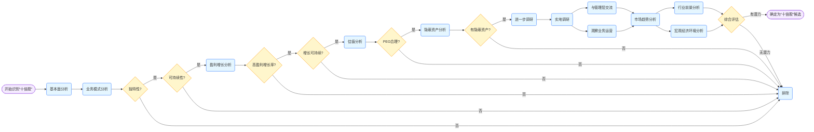

# 彼得林奇的“十倍股”识别方法

> 关键词：彼得林奇、十倍股、识别方法、股票投资、基本面分析

> 摘要：本文深入探讨了彼得林奇的“十倍股”识别方法。从背景介绍入手，阐述了该方法的目的、适用读者以及文档结构。详细讲解了“十倍股”相关的核心概念及其联系，剖析了识别“十倍股”的核心算法原理并给出具体操作步骤，同时运用数学模型和公式进行辅助说明。通过项目实战展示了实际案例及代码实现与解读，分析了“十倍股”在不同场景下的实际应用。还推荐了学习该方法所需的工具和资源，最后总结了未来发展趋势与挑战，解答常见问题并提供扩展阅读和参考资料，旨在帮助投资者掌握识别“十倍股”的有效方法，提升投资收益。

## 1. 背景介绍 
### 1.1 目的和范围
彼得林奇是投资界的传奇人物，他在管理富达麦哲伦基金期间创造了惊人的业绩。“十倍股”是指股价能上涨十倍的股票，识别“十倍股”对于投资者来说意味着巨大的收益。本文的目的就是深入剖析彼得林奇识别“十倍股”的方法，帮助投资者理解和运用这些方法来筛选具有潜力的股票。范围涵盖了“十倍股”识别方法的理论基础、核心算法、实际应用以及相关的学习资源等方面。

### 1.2 预期读者
本文预期读者主要包括股票投资者，无论是新手投资者希望学习有效的选股方法，还是有一定经验的投资者想要借鉴彼得林奇的投资智慧；也适用于金融专业的学生和研究人员，他们可以通过本文深入了解投资策略和股票分析方法；此外，对投资领域感兴趣的爱好者也能从本文中获取有价值的信息。

### 1.3 文档结构概述
本文首先介绍了相关背景，包括目的、读者和文档结构。接着阐述了“十倍股”的核心概念及其联系，通过文本示意图和Mermaid流程图进行清晰展示。然后详细讲解了识别“十倍股”的核心算法原理，并给出具体操作步骤，同时运用Python代码进行说明。之后介绍了相关的数学模型和公式，并举例说明。通过项目实战展示了代码实际案例和详细解释。分析了“十倍股”的实际应用场景，推荐了学习所需的工具和资源。最后总结了未来发展趋势与挑战，解答常见问题并提供扩展阅读和参考资料。

### 1.4 术语表
#### 1.4.1 核心术语定义
- **十倍股**：指股价相对于最初购买价格上涨十倍的股票。例如，某股票初始价格为10元，当股价上涨到100元时，就成为了十倍股。
- **PEG比率**：即市盈率相对盈利增长比率，是用公司的市盈率除以公司的盈利增长速度。它是一种评估股票估值的指标，可用于判断股票是否被高估或低估。
- **隐蔽资产**：指公司拥有但未在财务报表中充分体现其价值的资产，如土地、专利、品牌等。

#### 1.4.2 相关概念解释
- **基本面分析**：通过对公司的财务状况、经营管理、行业前景等基本方面进行分析，来评估公司的内在价值和投资潜力。彼得林奇非常重视基本面分析，认为这是识别“十倍股”的重要依据。
- **成长股**：指那些具有持续增长潜力的公司的股票。成长股通常具有较高的盈利增长率和市场竞争力，是彼得林奇寻找“十倍股”的重要目标之一。

#### 1.4.3 缩略词列表
- **PEG**：市盈率相对盈利增长比率（Price/Earnings to Growth Ratio）

## 2. 核心概念与联系 

### 核心概念原理
彼得林奇识别“十倍股”的核心原理基于对公司基本面的深入分析。他认为，一家具有成为“十倍股”潜力的公司通常具有以下特点：
- **良好的业务模式**：公司的业务应该具有独特性和可持续性，能够在市场中占据一定的竞争优势。例如，一些具有创新技术或独特商业模式的公司，往往能够获得更高的市场份额和利润。
- **强劲的盈利增长**：持续的盈利增长是推动股价上涨的重要动力。彼得林奇关注公司的盈利增长率，认为高盈利增长的公司更有可能成为“十倍股”。
- **合理的估值**：即使公司具有良好的发展前景，如果估值过高，也可能会影响投资回报。因此，需要评估公司的估值是否合理，常用的指标如PEG比率等。
- **隐蔽资产**：公司拥有的隐蔽资产可能会为其带来额外的价值，当这些资产的价值被市场发现时，股价可能会大幅上涨。

### 架构的文本示意图
```plaintext
彼得林奇“十倍股”识别方法
|-- 基本面分析
|   |-- 业务模式分析
|   |   |-- 独特性
|   |   |-- 可持续性
|   |-- 盈利增长分析
|   |   |-- 盈利增长率
|   |   |-- 增长的可持续性
|   |-- 估值分析
|   |   |-- PEG比率
|   |   |-- 市盈率
|   |-- 隐蔽资产分析
|       |-- 土地
|       |-- 专利
|       |-- 品牌
|-- 实地调研
|   |-- 与管理层交流
|   |-- 观察业务运营
|-- 市场趋势分析
|   |-- 行业前景
|   |-- 宏观经济环境
```

### Mermaid流程图


## 3. 核心算法原理 & 具体操作步骤 

### 核心算法原理
彼得林奇识别“十倍股”的核心算法可以概括为以下几个关键步骤：
1. **筛选初步候选股票**：从众多股票中筛选出具有一定潜力的股票，主要基于公司的基本面信息，如业务模式、盈利增长等。
2. **计算估值指标**：计算股票的估值指标，如PEG比率，以评估股票的估值是否合理。
3. **分析隐蔽资产**：寻找公司可能存在的隐蔽资产，评估其对公司价值的影响。
4. **实地调研和市场趋势分析**：对初步筛选出的股票进行实地调研，了解公司的实际运营情况，并分析市场趋势，判断公司的发展前景。
5. **综合评估**：综合考虑以上各方面因素，对股票进行综合评估，确定是否为“十倍股”候选。

### 具体操作步骤
#### 步骤1：筛选初步候选股票
可以使用以下Python代码从股票数据中筛选出具有一定盈利增长的股票：
```python
import pandas as pd

# 假设我们有一个包含股票信息的DataFrame，列名为 'ticker'（股票代码）、'earnings_growth'（盈利增长率）
stock_data = pd.DataFrame({
    'ticker': ['AAPL', 'GOOG', 'MSFT', 'AMZN'],
    'earnings_growth': [0.2, 0.15, 0.18, 0.25]
})

# 筛选出盈利增长率大于0.2的股票
candidate_stocks = stock_data[stock_data['earnings_growth'] > 0.2]
print(candidate_stocks)
```
#### 步骤2：计算估值指标
以下是计算PEG比率的Python代码：
```python
# 假设我们有一个包含市盈率（PE）和盈利增长率（earnings_growth）的DataFrame
stock_data = pd.DataFrame({
    'ticker': ['AAPL', 'GOOG', 'MSFT', 'AMZN'],
    'PE': [20, 25, 18, 30],
    'earnings_growth': [0.2, 0.15, 0.18, 0.25]
})

# 计算PEG比率
stock_data['PEG'] = stock_data['PE'] / (stock_data['earnings_growth'] * 100)
print(stock_data[['ticker', 'PEG']])
```
#### 步骤3：分析隐蔽资产
这一步需要对公司进行深入研究，查看公司的财务报表、行业报告等，寻找可能存在的隐蔽资产。目前没有直接的代码可以完成这一步，主要依靠人工分析。
#### 步骤4：实地调研和市场趋势分析
实地调研需要投资者亲自前往公司或通过与公司管理层交流等方式进行。市场趋势分析可以使用金融数据接口获取相关数据进行分析，以下是一个简单的示例：
```python
import yfinance as yf

# 获取某只股票的历史数据
ticker = 'AAPL'
stock = yf.Ticker(ticker)
hist = stock.history(period="1y")

# 简单分析股价走势
import matplotlib.pyplot as plt
plt.plot(hist['Close'])
plt.title(f'{ticker} Stock Price')
plt.xlabel('Date')
plt.ylabel('Price')
plt.show()
```
#### 步骤5：综合评估
综合考虑以上各方面因素，根据自己的投资标准对股票进行打分，确定是否为“十倍股”候选。以下是一个简单的示例：
```python
# 假设我们根据各方面因素给股票打分，满分为10分
scores = {
    'AAPL': 7,
    'GOOG': 6,
    'MSFT': 6,
    'AMZN': 8
}

# 筛选出分数大于7分的股票
final_candidates = [ticker for ticker, score in scores.items() if score > 7]
print(final_candidates)
```

## 4. 数学模型和公式 & 详细讲解 & 举例说明 

### 市盈率（PE）
#### 公式
市盈率是最常用的估值指标之一，其公式为：
$$PE = \frac{股价}{每股收益}$$
#### 详细讲解
市盈率反映了投资者为获取公司每一元盈利所愿意支付的价格。一般来说，市盈率越高，说明市场对公司的预期越高，但也可能意味着股票被高估；市盈率越低，可能表示股票被低估，但也可能反映出公司的发展前景不佳。
#### 举例说明
假设某公司的股价为50元，每股收益为5元，则该公司的市盈率为：
$$PE = \frac{50}{5} = 10$$

### 市盈率相对盈利增长比率（PEG）
#### 公式
PEG比率的公式为：
$$PEG = \frac{PE}{盈利增长率 \times 100}$$
#### 详细讲解
PEG比率综合考虑了公司的市盈率和盈利增长率，用于评估股票的估值是否合理。一般认为，PEG比率小于1表示股票可能被低估，具有投资价值；PEG比率大于1表示股票可能被高估。
#### 举例说明
假设某公司的市盈率为20，盈利增长率为0.2（即20%），则该公司的PEG比率为：
$$PEG = \frac{20}{0.2 \times 100} = 1$$

### 盈利增长率
#### 公式
盈利增长率可以通过以下公式计算：
$$盈利增长率 = \frac{本期盈利 - 上期盈利}{上期盈利} \times 100\%$$
#### 详细讲解
盈利增长率反映了公司盈利的增长速度，是评估公司发展潜力的重要指标。持续的高盈利增长通常意味着公司具有良好的发展前景。
#### 举例说明
假设某公司上期盈利为100万元，本期盈利为120万元，则该公司的盈利增长率为：
$$盈利增长率 = \frac{120 - 100}{100} \times 100\% = 20\%$$

## 5. 项目实战：代码实际案例和详细解释说明 

### 5.1  开发环境搭建
#### 安装Python
首先需要安装Python，建议使用Python 3.7及以上版本。可以从Python官方网站（https://www.python.org/downloads/）下载并安装。
#### 安装必要的库
使用以下命令安装项目所需的库：
```sh
pip install pandas yfinance matplotlib
```
### 5.2  源代码详细实现和代码解读
以下是一个完整的项目实战代码示例，用于识别“十倍股”候选：
```python
import pandas as pd
import yfinance as yf
import matplotlib.pyplot as plt

# 步骤1：筛选初步候选股票
stock_data = pd.DataFrame({
    'ticker': ['AAPL', 'GOOG', 'MSFT', 'AMZN'],
    'earnings_growth': [0.2, 0.15, 0.18, 0.25]
})
candidate_stocks = stock_data[stock_data['earnings_growth'] > 0.2]

# 步骤2：计算估值指标
# 获取股票的市盈率数据
pe_ratios = {}
for ticker in candidate_stocks['ticker']:
    stock = yf.Ticker(ticker)
    info = stock.info
    pe_ratios[ticker] = info.get('trailingPE', None)

# 计算PEG比率
candidate_stocks['PE'] = candidate_stocks['ticker'].map(pe_ratios)
candidate_stocks['PEG'] = candidate_stocks['PE'] / (candidate_stocks['earnings_growth'] * 100)

# 筛选出PEG比率小于1的股票
final_candidates = candidate_stocks[candidate_stocks['PEG'] < 1]

# 步骤3：分析市场趋势
for ticker in final_candidates['ticker']:
    stock = yf.Ticker(ticker)
    hist = stock.history(period="1y")
    plt.plot(hist['Close'])
    plt.title(f'{ticker} Stock Price')
    plt.xlabel('Date')
    plt.ylabel('Price')
    plt.show()

print(final_candidates)
```
### 代码解读与分析
#### 步骤1：筛选初步候选股票
使用`pandas`库创建一个包含股票信息的DataFrame，然后根据盈利增长率筛选出具有一定潜力的股票。
#### 步骤2：计算估值指标
使用`yfinance`库获取股票的市盈率数据，然后计算PEG比率。最后筛选出PEG比率小于1的股票，认为这些股票可能被低估。
#### 步骤3：分析市场趋势
使用`yfinance`库获取股票的历史数据，使用`matplotlib`库绘制股价走势图，帮助投资者直观地了解股票的走势。

## 6. 实际应用场景 
### 个人投资者
对于个人投资者来说，彼得林奇的“十倍股”识别方法可以帮助他们在众多股票中筛选出具有潜力的投资标的。通过对公司基本面的分析和估值评估，个人投资者可以降低投资风险，提高投资收益。例如，个人投资者可以使用上述方法筛选出一些PEG比率较低、盈利增长较高的股票，进行长期投资。
### 基金经理
基金经理可以运用彼得林奇的方法来构建投资组合。通过识别“十倍股”，基金经理可以提高基金的业绩表现，吸引更多的投资者。例如，基金经理可以在不同行业中寻找具有成为“十倍股”潜力的股票，分散投资风险。
### 金融研究机构
金融研究机构可以使用彼得林奇的方法进行股票研究和分析。通过对大量股票的筛选和评估，研究机构可以为投资者提供专业的投资建议和研究报告。例如，研究机构可以定期发布“十倍股”候选名单，帮助投资者把握投资机会。

## 7. 工具和资源推荐
### 7.1 学习资源推荐
#### 7.1.1 书籍推荐
- 《彼得林奇的成功投资》：彼得林奇亲自撰写的投资经典著作，详细介绍了他的投资理念和选股方法。
- 《战胜华尔街》：进一步阐述了彼得林奇的投资策略和实践经验，对投资者具有很高的参考价值。
#### 7.1.2 在线课程
- Coursera上的“投资学原理”课程：涵盖了投资的基本原理和方法，包括股票分析和估值等内容。
- Udemy上的“股票投资实战课程”：提供了实用的股票投资技巧和案例分析。
#### 7.1.3 技术博客和网站
- 雪球网：国内知名的投资社区，投资者可以在上面交流投资经验和分享研究成果。
- Seeking Alpha：国外的投资研究网站，提供了大量的股票分析和投资建议。
### 7.2 开发工具框架推荐
#### 7.2.1 IDE和编辑器
- PyCharm：功能强大的Python集成开发环境，适合开发Python代码。
- Jupyter Notebook：交互式的开发环境，方便进行数据分析和代码演示。
#### 7.2.2 调试和性能分析工具
- pdb：Python自带的调试工具，可以帮助开发者调试代码。
- cProfile：Python的性能分析工具，用于分析代码的性能瓶颈。
#### 7.2.3 相关框架和库
- pandas：强大的数据分析库，用于处理和分析股票数据。
- yfinance：用于获取股票的历史数据和基本面信息。
- matplotlib：用于绘制股票走势图和数据分析图表。
### 7.3 相关论文著作推荐
#### 7.3.1 经典论文
- 《有效市场假说》：阐述了市场有效性的概念，对股票投资理论有重要影响。
- 《资本资产定价模型》：提出了资产定价的基本模型，为股票估值提供了理论基础。
#### 7.3.2 最新研究成果
- 关注顶级金融学术期刊，如《Journal of Finance》《Review of Financial Studies》等，了解股票投资领域的最新研究动态。
#### 7.3.3 应用案例分析
- 可以在一些金融研究报告和投资案例分析网站上查找关于彼得林奇“十倍股”识别方法的应用案例，学习实际操作经验。

## 8. 总结：未来发展趋势与挑战
### 未来发展趋势
- **科技驱动的投资分析**：随着人工智能和大数据技术的发展，未来的“十倍股”识别方法可能会更加依赖科技手段。例如，利用机器学习算法对大量的股票数据进行分析和预测，提高识别的准确性和效率。
- **跨行业融合**：未来的“十倍股”可能更多地出现在跨行业融合的领域，如科技与医疗、科技与金融等。投资者需要具备更广泛的知识和视野，才能识别这些具有潜力的股票。
- **可持续投资**：随着社会对可持续发展的关注度不断提高，具有良好环境、社会和治理（ESG）表现的公司可能更容易成为“十倍股”。投资者将更加注重公司的可持续发展能力。

### 挑战
- **市场不确定性**：股票市场充满了不确定性，即使采用了彼得林奇的方法，也不能保证准确识别“十倍股”。宏观经济环境、政策变化等因素都可能对股票价格产生影响。
- **数据质量和获取难度**：准确的股票数据是识别“十倍股”的基础，但数据质量和获取难度可能会影响分析结果。一些公司的财务数据可能存在造假情况，而且获取某些数据可能需要支付高额费用。
- **竞争加剧**：随着越来越多的投资者关注“十倍股”，市场竞争将加剧。这可能导致具有潜力的股票提前被市场发现，估值上升，从而降低投资回报。

## 9. 附录：常见问题与解答
### 问题1：彼得林奇的“十倍股”识别方法适用于所有市场吗？
解答：彼得林奇的方法主要基于美国股票市场的经验，但其中的一些基本原则如基本面分析、估值评估等在其他市场也具有一定的适用性。不过，不同市场的特点和规则可能有所不同，投资者需要根据实际情况进行调整。

### 问题2：如何判断公司的隐蔽资产？
解答：判断公司的隐蔽资产需要对公司进行深入研究。可以查看公司的财务报表、行业报告，了解公司的业务布局和资产状况。例如，关注公司是否拥有闲置土地、未充分开发的专利技术、知名品牌等。

### 问题3：PEG比率小于1就一定是“十倍股”吗？
解答：PEG比率小于1只是一个参考指标，不能仅凭这一点就确定股票是“十倍股”。还需要综合考虑公司的业务模式、盈利增长的可持续性、市场趋势等因素。

### 问题4：实地调研有必要吗？
解答：实地调研是非常有必要的。通过实地调研，投资者可以直接了解公司的实际运营情况，与管理层交流，获取更准确的信息。这有助于投资者更全面地评估公司的投资价值。

## 10. 扩展阅读 & 参考资料
### 扩展阅读
- 《聪明的投资者》：本杰明·格雷厄姆的经典著作，介绍了价值投资的理念和方法。
- 《金融炼金术》：乔治·索罗斯的著作，阐述了他的投资哲学和市场理论。
### 参考资料
- 彼得林奇相关的演讲和访谈记录。
- 金融数据提供商（如雅虎财经、彭博等）的股票数据。

作者：AI天才研究院/AI Genius Institute & 禅与计算机程序设计艺术 /Zen And The Art of Computer Programming