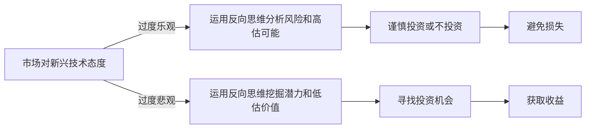

# 彼得林奇的"反向思维"在新兴技术估值中的运用

> 关键词：彼得林奇、反向思维、新兴技术估值、投资策略、市场分析

> 摘要：本文深入探讨了彼得林奇的“反向思维”在新兴技术估值中的运用。首先介绍了研究的背景、目的、预期读者、文档结构及相关术语。接着阐述了核心概念，包括彼得林奇反向思维的原理以及新兴技术估值的概念和二者的联系，并给出了相应的示意图和流程图。详细讲解了在新兴技术估值中运用反向思维的核心算法原理，结合 Python 代码进行说明。同时，给出了相关的数学模型和公式，并举例说明。通过项目实战案例，展示了在新兴技术估值中运用反向思维的具体过程，包括开发环境搭建、源代码实现和解读。分析了实际应用场景，推荐了学习资源、开发工具框架和相关论文著作。最后总结了未来发展趋势与挑战，提供了常见问题解答和扩展阅读参考资料，旨在为投资者和相关从业者在新兴技术估值中提供有益的思路和方法。

## 1. 背景介绍 
### 1.1 目的和范围
在当今快速发展的科技时代，新兴技术如人工智能、区块链、生物技术等不断涌现，为投资者带来了巨大的机遇，但同时也伴随着极高的不确定性和风险。准确地对新兴技术进行估值是投资决策的关键环节，但传统的估值方法往往难以适应新兴技术的特点，容易出现估值偏差。彼得林奇作为投资界的传奇人物，他所倡导的“反向思维”投资策略在股票投资领域取得了巨大的成功。本研究的目的在于探讨如何将彼得林奇的“反向思维”应用于新兴技术的估值过程中，为投资者提供一种新的、更有效的估值思路和方法。研究范围涵盖了各种常见的新兴技术领域，包括但不限于信息技术、生物科技、新能源等，同时涉及到新兴技术从研发阶段到商业化阶段的不同发展时期的估值问题。

### 1.2 预期读者
本文预期读者主要包括以下几类人群：一是专业的投资机构从业者，如基金经理、风险投资家等，他们在进行新兴技术项目投资时需要更精准的估值方法来做出决策；二是对新兴技术投资感兴趣的个人投资者，帮助他们提升在新兴技术投资中的分析和判断能力；三是科技企业的管理者和创业者，他们可以借助这种估值方法更好地了解自身企业的价值，为融资、合作等决策提供依据；四是金融和科技领域的研究人员，为他们的学术研究提供新的视角和思路。

### 1.3 文档结构概述
本文将按照以下结构展开：首先介绍核心概念，包括彼得林奇的“反向思维”和新兴技术估值的定义及二者之间的联系，并通过示意图和流程图进行直观展示；接着阐述在新兴技术估值中运用反向思维的核心算法原理，结合 Python 代码详细说明具体操作步骤；然后给出相关的数学模型和公式，并通过实际例子进行详细讲解；之后通过一个项目实战案例，介绍开发环境搭建、源代码实现和代码解读；分析反向思维在新兴技术估值中的实际应用场景；推荐学习资源、开发工具框架和相关论文著作；最后总结未来发展趋势与挑战，提供常见问题解答和扩展阅读参考资料。

### 1.4 术语表
#### 1.4.1 核心术语定义
- **彼得林奇的“反向思维”**：彼得林奇在投资过程中倡导的一种思维方式，即不随波逐流，当市场普遍看好或看淡某一投资对象时，通过深入研究和独立思考，从相反的角度去分析和判断其价值。例如，当市场对某类股票过度乐观时，反向思维者会关注其潜在的风险和被高估的可能性；而当市场对某类股票极度悲观时，会挖掘其被低估的价值和潜在的发展机会。
- **新兴技术估值**：对处于新兴发展阶段的技术进行价值评估的过程。新兴技术通常具有创新性、不确定性高、发展速度快等特点，其估值不仅仅基于当前的财务数据，还需要考虑技术的创新性、市场潜力、竞争态势、技术成熟度等多种因素。

#### 1.4.2 相关概念解释
- **市场情绪**：指市场参与者对某一投资对象或整个市场的整体心理状态和预期，包括乐观、悲观、恐慌等情绪。市场情绪往往会影响投资者的决策和资产价格的波动。在新兴技术领域，市场情绪可能会受到技术突破、政策变化、媒体报道等因素的影响。
- **技术成熟度曲线**：描述新兴技术从诞生到成熟的发展过程中，技术的可见度和市场预期随时间变化的曲线。一般包括技术萌芽期、期望膨胀期、泡沫破裂谷底期、稳步爬升恢复期和生产成熟期五个阶段。了解技术成熟度曲线有助于投资者判断新兴技术所处的发展阶段，从而更准确地进行估值。

#### 1.4.3 缩略词列表
- **AI**：Artificial Intelligence，人工智能
- **BTC**：Bitcoin，比特币
- **EV**：Enterprise Value，企业价值
- **PE**：Price-to-Earnings Ratio，市盈率

## 2. 核心概念与联系 

### 彼得林奇“反向思维”原理
彼得林奇的“反向思维”核心在于打破市场的一致性预期，不盲目跟从大众的投资决策。他认为市场上大多数投资者的观点往往受到情绪和短期信息的影响，容易出现过度乐观或过度悲观的情况。通过反向思维，投资者可以更客观地评估投资对象的真实价值。例如，当市场上普遍追捧某一热门行业的股票时，彼得林奇会思考这些股票是否已经被高估，其背后的企业是否真的具有可持续的竞争优势；而当市场对某一行业或公司极度悲观时，他会深入研究该行业或公司是否存在被忽视的亮点和潜力。

### 新兴技术估值概念
新兴技术估值是一个复杂的过程，需要综合考虑多个因素。由于新兴技术通常处于发展初期，缺乏历史数据和成熟的商业模式，传统的估值方法如市盈率法、市净率法等往往难以准确反映其价值。新兴技术的价值主要来源于其未来的增长潜力，包括技术的创新性、市场需求、竞争优势、团队能力等。例如，对于一家人工智能初创公司，其估值不仅要考虑当前的研发投入和收入情况，还要评估其技术在未来市场中的应用前景、是否能够形成有效的商业转化等。

### 二者联系
彼得林奇的“反向思维”在新兴技术估值中具有重要的应用价值。在新兴技术领域，市场情绪往往波动较大，容易出现过度炒作或过度悲观的情况。当市场对某一新兴技术过度乐观时，投资者可能会高估其未来的发展前景和商业价值，导致股价虚高；而当市场对某一新兴技术过度悲观时，投资者可能会忽视其潜在的发展机会，导致股价被低估。运用反向思维，投资者可以在市场过热时保持冷静，深入分析新兴技术的实际发展情况和面临的挑战，避免盲目跟风投资；在市场过冷时，挖掘被市场忽视的新兴技术的价值，寻找潜在的投资机会。

### 文本示意图
```plaintext
彼得林奇“反向思维”
        |
        | 打破市场一致性预期
        |
        | 应用于新兴技术估值
        |
        | 避免市场过热时盲目跟风
        | 挖掘市场过冷时潜在机会
        |
新兴技术估值
```

### Mermaid 流程图


## 3. 核心算法原理 & 具体操作步骤 

### 核心算法原理
在新兴技术估值中运用彼得林奇的“反向思维”，核心算法原理是通过对市场情绪和新兴技术的多维度分析，调整传统估值模型的参数，以更准确地反映新兴技术的真实价值。具体来说，我们可以将市场情绪量化为一个情绪因子，该因子会影响新兴技术的估值倍数。当市场情绪过度乐观时，降低估值倍数；当市场情绪过度悲观时，提高估值倍数。同时，结合新兴技术的技术成熟度、市场潜力等因素，对估值进行进一步的调整。

### 具体操作步骤
1. **市场情绪量化**：收集市场上关于新兴技术的各种信息，包括媒体报道、分析师评级、投资者情绪调查等，通过自然语言处理技术提取其中的情绪倾向，将其量化为一个情绪因子 $S$，取值范围为 $[-1, 1]$，其中 $-1$ 表示极度悲观，$1$ 表示极度乐观，$0$ 表示中性。
2. **确定基础估值倍数**：根据新兴技术所处的行业和发展阶段，选择合适的传统估值方法，如市盈率法、市销率法等，计算出基础估值倍数 $M_0$。
3. **调整估值倍数**：根据市场情绪因子 $S$ 对基础估值倍数进行调整，得到调整后的估值倍数 $M$，计算公式为：
$M = M_0 \times (1 - k \times S)$
其中 $k$ 为调整系数，取值范围为 $[0, 1]$，根据具体情况进行设定。
4. **结合其他因素调整估值**：考虑新兴技术的技术成熟度、市场潜力、竞争态势等因素，对调整后的估值倍数进行进一步的调整，得到最终的估值倍数 $M_{final}$。
5. **计算新兴技术的估值**：根据最终的估值倍数 $M_{final}$ 和新兴技术相关的财务指标（如净利润、销售收入等），计算出新兴技术的估值 $V$。

### Python 代码实现
```python
import pandas as pd
import numpy as np
import nltk
from nltk.sentiment.vader import SentimentIntensityAnalyzer

# 下载 NLTK 情感分析所需数据
nltk.download('vader_lexicon')

# 模拟市场情绪数据
market_sentiment_texts = [
    "新兴技术前景一片光明，未来潜力无限！",
    "这个新兴技术问题太多，很难有发展。",
    "新兴技术发展存在一定不确定性，但也有机会。"
]

# 初始化情感分析器
sia = SentimentIntensityAnalyzer()

# 量化市场情绪
def quantify_market_sentiment(texts):
    sentiment_scores = []
    for text in texts:
        score = sia.polarity_scores(text)['compound']
        sentiment_scores.append(score)
    return np.mean(sentiment_scores)

# 计算调整后的估值倍数
def adjust_valuation_multiplier(base_multiplier, sentiment_factor, k=0.5):
    return base_multiplier * (1 - k * sentiment_factor)

# 示例数据
base_multiplier = 20
market_sentiment = quantify_market_sentiment(market_sentiment_texts)
adjusted_multiplier = adjust_valuation_multiplier(base_multiplier, market_sentiment)

print(f"基础估值倍数: {base_multiplier}")
print(f"市场情绪因子: {market_sentiment}")
print(f"调整后的估值倍数: {adjusted_multiplier}")
```

### 代码解释
1. **市场情绪量化**：使用 NLTK 的 VADER 情感分析器对市场情绪文本进行量化，计算出平均情绪得分作为市场情绪因子。
2. **调整估值倍数**：根据市场情绪因子和调整系数，对基础估值倍数进行调整，得到调整后的估值倍数。
3. **示例输出**：打印出基础估值倍数、市场情绪因子和调整后的估值倍数，方便观察结果。

## 4. 数学模型和公式 & 详细讲解 & 举例说明 

### 数学模型和公式
#### 市场情绪量化公式
市场情绪因子 $S$ 可以通过对多个市场情绪文本的情感得分进行平均计算得到，公式为：
$S = \frac{1}{n} \sum_{i=1}^{n} s_i$
其中 $n$ 为市场情绪文本的数量，$s_i$ 为第 $i$ 个文本的情感得分，取值范围为 $[-1, 1]$。

#### 估值倍数调整公式
调整后的估值倍数 $M$ 计算公式为：
$M = M_0 \times (1 - k \times S)$
其中 $M_0$ 为基础估值倍数，$k$ 为调整系数，取值范围为 $[0, 1]$。

#### 新兴技术估值公式
新兴技术的估值 $V$ 可以根据调整后的估值倍数 $M$ 和相关财务指标 $F$（如净利润、销售收入等）计算得到，公式为：
$V = M \times F$

### 详细讲解
- **市场情绪量化公式**：通过对多个市场情绪文本的情感得分进行平均，可以更准确地反映市场整体的情绪倾向。情感得分越接近 $1$，表示市场情绪越乐观；越接近 $-1$，表示市场情绪越悲观。
- **估值倍数调整公式**：当市场情绪过度乐观（$S > 0$）时，调整后的估值倍数 $M$ 会小于基础估值倍数 $M_0$，从而降低新兴技术的估值；当市场情绪过度悲观（$S < 0$）时，调整后的估值倍数 $M$ 会大于基础估值倍数 $M_0$，从而提高新兴技术的估值。调整系数 $k$ 用于控制市场情绪对估值倍数的影响程度。
- **新兴技术估值公式**：根据调整后的估值倍数和相关财务指标，可以计算出新兴技术的估值。该公式考虑了市场情绪对估值的影响，使估值结果更符合实际情况。

### 举例说明
假设某新兴技术公司的基础估值倍数 $M_0$ 为 $30$，调整系数 $k$ 为 $0.5$。通过对市场情绪文本的分析，得到市场情绪因子 $S = 0.8$，表示市场对该新兴技术过度乐观。则调整后的估值倍数为：
$M = M_0 \times (1 - k \times S) = 30 \times (1 - 0.5 \times 0.8) = 30 \times 0.6 = 18$
如果该公司的净利润 $F$ 为 $1000$ 万元，则该新兴技术公司的估值为：
$V = M \times F = 18 \times 1000 = 18000$ 万元
如果市场情绪因子 $S = -0.8$，表示市场对该新兴技术过度悲观，则调整后的估值倍数为：
$M = M_0 \times (1 - k \times S) = 30 \times (1 - 0.5 \times (-0.8)) = 30 \times 1.4 = 42$
该新兴技术公司的估值为：
$V = M \times F = 42 \times 1000 = 42000$ 万元

通过这个例子可以看出，市场情绪对新兴技术的估值有很大的影响，运用反向思维调整估值倍数可以更准确地反映新兴技术的真实价值。

## 5. 项目实战：代码实际案例和详细解释说明 

### 5.1  开发环境搭建
为了实现彼得林奇的“反向思维”在新兴技术估值中的应用，我们需要搭建一个合适的开发环境。以下是具体的搭建步骤：

#### 安装 Python
首先，确保你已经安装了 Python 3.x 版本。可以从 Python 官方网站（https://www.python.org/downloads/）下载并安装适合你操作系统的 Python 版本。

#### 安装必要的库
使用以下命令安装所需的 Python 库：
```bash
pip install pandas numpy nltk
```
- **pandas**：用于数据处理和分析。
- **numpy**：用于数值计算。
- **nltk**：用于自然语言处理，进行市场情绪量化。

#### 下载 NLTK 数据
在 Python 环境中运行以下代码下载 NLTK 所需的数据：
```python
import nltk
nltk.download('vader_lexicon')
```

### 5.2  源代码详细实现和代码解读
```python
import pandas as pd
import numpy as np
import nltk
from nltk.sentiment.vader import SentimentIntensityAnalyzer

# 下载 NLTK 情感分析所需数据
nltk.download('vader_lexicon')

# 模拟市场情绪数据
market_sentiment_texts = [
    "新兴技术前景一片光明，未来潜力无限！",
    "这个新兴技术问题太多，很难有发展。",
    "新兴技术发展存在一定不确定性，但也有机会。"
]

# 初始化情感分析器
sia = SentimentIntensityAnalyzer()

# 量化市场情绪
def quantify_market_sentiment(texts):
    sentiment_scores = []
    for text in texts:
        score = sia.polarity_scores(text)['compound']
        sentiment_scores.append(score)
    return np.mean(sentiment_scores)

# 计算调整后的估值倍数
def adjust_valuation_multiplier(base_multiplier, sentiment_factor, k=0.5):
    return base_multiplier * (1 - k * sentiment_factor)

# 计算新兴技术估值
def calculate_technology_valuation(base_multiplier, sentiment_texts, financial_metric, k=0.5):
    sentiment_factor = quantify_market_sentiment(sentiment_texts)
    adjusted_multiplier = adjust_valuation_multiplier(base_multiplier, sentiment_factor, k)
    valuation = adjusted_multiplier * financial_metric
    return valuation

# 示例数据
base_multiplier = 20
financial_metric = 500  # 假设财务指标为 500
valuation = calculate_technology_valuation(base_multiplier, market_sentiment_texts, financial_metric)

print(f"新兴技术估值: {valuation}")
```

### 5.3  代码解读与分析
1. **导入必要的库**：导入 `pandas`、`numpy` 和 `nltk` 库，以及 `SentimentIntensityAnalyzer` 用于情感分析。
2. **模拟市场情绪数据**：定义一个包含市场情绪文本的列表 `market_sentiment_texts`，用于模拟市场上关于新兴技术的各种观点。
3. **量化市场情绪**：定义 `quantify_market_sentiment` 函数，使用 `SentimentIntensityAnalyzer` 对每个文本进行情感分析，计算出平均情感得分作为市场情绪因子。
4. **计算调整后的估值倍数**：定义 `adjust_valuation_multiplier` 函数，根据市场情绪因子和调整系数对基础估值倍数进行调整。
5. **计算新兴技术估值**：定义 `calculate_technology_valuation` 函数，结合市场情绪量化和估值倍数调整，计算出新兴技术的估值。
6. **示例输出**：设置基础估值倍数和财务指标，调用 `calculate_technology_valuation` 函数计算新兴技术的估值，并打印结果。

通过这个项目实战，我们可以看到如何运用 Python 代码实现彼得林奇的“反向思维”在新兴技术估值中的应用，通过量化市场情绪和调整估值倍数，更准确地评估新兴技术的价值。

## 6. 实际应用场景 
### 风险投资领域
在风险投资领域，投资者经常需要对新兴技术创业公司进行估值。由于新兴技术创业公司往往处于发展初期，缺乏稳定的财务数据和成熟的商业模式，传统的估值方法难以准确评估其价值。运用彼得林奇的“反向思维”，风险投资家可以在市场对某一新兴技术过度追捧时保持冷静，深入分析该技术的实际应用前景和商业可行性，避免盲目投资。例如，在人工智能热潮中，市场上很多人工智能创业公司获得了高额估值，但其中一些公司可能只是炒作概念，缺乏真正的技术实力和商业落地能力。风险投资家运用反向思维，对这些公司进行深入调研，可能会发现其潜在的风险，从而避免投资失误。相反，当市场对某一新兴技术领域过度悲观时，风险投资家可以挖掘那些被市场忽视的具有潜力的创业公司，以较低的价格进行投资，获得更高的回报。

### 企业并购领域
在企业并购过程中，准确评估目标企业的新兴技术价值至关重要。当市场对目标企业的新兴技术过度乐观时，收购方可能会支付过高的价格，导致并购后难以实现预期的协同效应和投资回报。运用反向思维，收购方可以对目标企业的新兴技术进行全面的评估，包括技术的创新性、市场竞争力、技术成熟度等方面，避免被市场情绪所左右。例如，某传统企业计划收购一家拥有新兴区块链技术的公司，市场上对区块链技术的前景普遍看好，目标企业的估值也水涨船高。收购方运用反向思维，深入分析区块链技术在目标企业业务中的实际应用情况和未来发展潜力，发现该技术目前还存在一些技术难题和应用瓶颈，从而合理调整收购价格，降低并购风险。

### 证券投资领域
在证券投资中，投资者需要对新兴技术相关的上市公司进行估值。市场情绪往往会对新兴技术股票的价格产生较大的影响，导致股价出现高估或低估的情况。运用彼得林奇的“反向思维”，投资者可以在市场对某一新兴技术股票过度乐观时，卖出或减持该股票；在市场对某一新兴技术股票过度悲观时，买入或增持该股票。例如，当市场对新能源汽车板块过度乐观，相关股票价格大幅上涨时，投资者运用反向思维，分析新能源汽车行业的实际发展情况和面临的挑战，如电池技术瓶颈、充电桩建设不足等，可能会选择卖出部分新能源汽车股票，锁定利润。而当市场对某一新兴半导体技术公司的股票过度悲观，股价大幅下跌时，投资者深入研究该公司的技术实力和市场潜力，发现其具有长期投资价值，可能会选择买入该股票。

## 7. 工具和资源推荐
### 7.1 学习资源推荐
#### 7.1.1 书籍推荐
- 《彼得林奇的成功投资》：彼得林奇亲自撰写的投资经典著作，详细介绍了他的投资理念和方法，包括反向思维的运用，对投资者具有很高的指导价值。
- 《聪明的投资者》：本杰明·格雷厄姆的经典投资著作，强调了价值投资的重要性，为投资者提供了基本的投资原则和方法，有助于培养反向思维能力。
- 《新兴技术投资：从趋势到利润》：专门介绍新兴技术投资的书籍，涵盖了新兴技术的估值方法、投资策略等内容，对在新兴技术领域运用反向思维进行投资具有重要的参考意义。

#### 7.1.2 在线课程
- Coursera 上的“投资学原理”课程：由知名大学教授授课，系统介绍了投资学的基本原理和方法，包括估值模型、市场分析等内容，帮助学习者建立投资分析的基础框架。
- edX 上的“新兴技术与创新管理”课程：聚焦于新兴技术的发展趋势和创新管理，讲解了如何评估新兴技术的价值和投资机会，对运用反向思维进行新兴技术估值有很大的帮助。
- 网易云课堂上的“彼得林奇投资策略实战”课程：专门针对彼得林奇的投资策略进行讲解和实战演练，通过案例分析和模拟投资，让学习者更好地掌握反向思维在投资中的应用。

#### 7.1.3 技术博客和网站
- 雪球网：国内知名的投资社区，汇聚了大量的投资者和投资专家，分享了各种投资经验和分析报告，包括新兴技术投资的相关内容，可以从中获取不同的观点和思路。
- Seeking Alpha：国外知名的投资研究网站，提供了丰富的金融市场分析和投资建议，对新兴技术领域的研究和分析较为深入，有助于拓宽投资者的视野。
- 36氪：专注于新兴科技和创业领域的媒体平台，及时报道新兴技术的发展动态和行业趋势，为投资者提供了最新的信息和数据。

### 7.2 开发工具框架推荐
#### 7.2.1 IDE和编辑器
- PyCharm：专业的 Python 集成开发环境，具有强大的代码编辑、调试和项目管理功能，适合开发和运行与新兴技术估值相关的 Python 代码。
- Jupyter Notebook：交互式的开发环境，支持代码、文本、图表等多种形式的展示，方便进行数据分析和实验，非常适合进行新兴技术估值的研究和实践。
- Visual Studio Code：轻量级的代码编辑器，支持多种编程语言和插件扩展，具有良好的用户体验和扩展性，可以用于编写和调试相关代码。

#### 7.2.2 调试和性能分析工具
- pdb：Python 自带的调试工具，可以帮助开发者在代码运行过程中进行调试，定位问题和分析代码执行流程。
- cProfile：Python 的性能分析工具，可以分析代码的运行时间和函数调用情况，帮助开发者优化代码性能。
- Py-Spy：一个轻量级的 Python 性能分析工具，可以实时监测 Python 程序的性能，找出性能瓶颈。

#### 7.2.3 相关框架和库
- Scikit-learn：强大的机器学习库，提供了各种机器学习算法和工具，可用于对新兴技术的市场数据进行分析和预测，辅助估值决策。
- TensorFlow：开源的深度学习框架，可用于构建和训练深度学习模型，对新兴技术的发展趋势进行预测和分析。
- Pandas：用于数据处理和分析的 Python 库，提供了高效的数据结构和数据分析工具，方便对新兴技术的财务数据和市场数据进行处理和分析。

### 7.3 相关论文著作推荐
#### 7.3.1 经典论文
- “Valuation of High - Tech Start - Ups”：该论文深入探讨了高科技初创企业的估值方法，分析了新兴技术企业估值的特点和挑战，为在新兴技术估值中运用反向思维提供了理论基础。
- “Behavioral Finance and Investor Sentiment”：研究了行为金融学和投资者情绪对投资决策的影响，有助于理解市场情绪的形成机制和对新兴技术估值的影响。
- “The Technology Adoption Lifecycle”：介绍了技术采用生命周期的理论，阐述了新兴技术从诞生到成熟的不同阶段的特点和市场表现，对判断新兴技术所处的发展阶段和进行估值有重要的参考价值。

#### 7.3.2 最新研究成果
- 近年来，学术界和业界对新兴技术估值的研究不断深入，一些最新的研究成果关注了人工智能、区块链、生物技术等新兴技术领域的估值方法创新。例如，有研究提出了基于机器学习和大数据分析的新兴技术估值模型，能够更准确地考虑多种因素对估值的影响。
- 关于投资者情绪和反向思维在投资中的应用也有新的研究进展，一些研究通过实证分析验证了反向思维投资策略的有效性，并提出了改进和优化的方法。

#### 7.3.3 应用案例分析
- 一些知名的投资机构和企业发布了关于新兴技术投资和估值的案例分析报告，这些报告详细介绍了在实际项目中如何运用各种估值方法和投资策略，包括反向思维的应用。例如，某风险投资机构发布的关于人工智能创业公司投资案例分析，展示了如何在市场过热和过冷的情况下运用反向思维进行估值和投资决策。

## 8. 总结：未来发展趋势与挑战
### 未来发展趋势
#### 技术融合与创新
随着科技的不断发展，新兴技术之间的融合趋势将越来越明显，如人工智能与生物技术、区块链与物联网的融合等。这种技术融合将创造出更多的创新应用和商业机会，也给新兴技术估值带来了新的挑战和机遇。运用反向思维，投资者需要更加敏锐地捕捉技术融合的趋势，提前布局那些具有潜力的融合技术领域，同时准确评估其价值。

#### 数据驱动的估值方法
随着大数据和人工智能技术的发展，未来新兴技术估值将越来越依赖于数据驱动的方法。通过收集和分析大量的市场数据、技术数据和企业财务数据，结合机器学习和深度学习算法，可以构建更准确的估值模型。反向思维在数据驱动的估值中仍然具有重要作用，投资者需要对数据进行深入的分析和思考，避免被数据表面的现象所迷惑，挖掘数据背后的真实价值。

#### 国际化投资趋势
新兴技术的发展是全球性的，未来国际化投资将成为趋势。投资者将面临更多来自不同国家和地区的新兴技术项目，需要考虑不同市场的特点、政策环境和文化差异。运用反向思维，投资者可以在国际市场中发现那些被其他投资者忽视的机会，同时避免盲目跟风投资国际热门项目。

### 挑战
#### 技术不确定性
新兴技术本身具有高度的不确定性，技术发展可能会受到各种因素的影响，如技术难题、政策法规、市场需求变化等。这使得准确评估新兴技术的价值变得非常困难，反向思维也难以完全消除这种不确定性。投资者需要不断关注技术的发展动态，及时调整估值和投资策略。

#### 市场情绪的复杂性
市场情绪受到多种因素的影响，包括媒体报道、政策变化、投资者心理等，其复杂性和波动性增加了反向思维应用的难度。有时候市场情绪可能会出现非理性的波动，导致估值偏差难以准确判断。投资者需要具备较强的市场分析能力和心理素质，才能在复杂的市场情绪中运用反向思维做出正确的决策。

#### 数据质量和隐私问题
数据驱动的估值方法依赖于大量的数据，但数据质量和隐私问题是一个挑战。低质量的数据可能会导致估值模型的不准确，而数据隐私问题则可能限制数据的获取和使用。投资者需要建立有效的数据质量控制机制，同时遵守相关的数据隐私法规，确保数据的安全和合法使用。

## 9. 附录：常见问题与解答
### 问题 1：反向思维在新兴技术估值中一定能取得成功吗？
答：反向思维在新兴技术估值中是一种有效的思维方式，但并不能保证一定能取得成功。新兴技术本身具有高度的不确定性，市场情况也复杂多变。反向思维只是帮助投资者从不同的角度去分析和评估新兴技术的价值，降低因市场情绪影响而导致的估值偏差。投资者还需要结合其他的分析方法和工具，不断关注技术和市场的变化，及时调整投资策略。

### 问题 2：如何准确量化市场情绪？
答：量化市场情绪是一个具有挑战性的任务。可以通过多种方法来实现，如收集市场上的媒体报道、分析师评级、投资者情绪调查等文本数据，使用自然语言处理技术对这些文本进行情感分析，计算出平均情感得分作为市场情绪因子。还可以结合一些市场指标，如成交量、换手率等，来辅助判断市场情绪。但需要注意的是，这些方法都存在一定的局限性，需要综合考虑多种因素来提高市场情绪量化的准确性。

### 问题 3：调整系数 $k$ 如何确定？
答：调整系数 $k$ 的确定需要根据具体情况进行设定。一般来说，$k$ 的取值范围为 $[0, 1]$，$k$ 值越大，市场情绪对估值倍数的影响就越大；$k$ 值越小，市场情绪对估值倍数的影响就越小。可以通过历史数据的回测和分析，结合新兴技术的特点和市场情况，来确定一个合适的 $k$ 值。也可以根据投资者的风险偏好进行调整，风险偏好较高的投资者可以适当增大 $k$ 值，以更充分地利用市场情绪的波动；风险偏好较低的投资者可以适当减小 $k$ 值，降低市场情绪对估值的影响。

### 问题 4：在运用反向思维进行新兴技术估值时，如何平衡市场情绪和技术基本面的关系？
答：市场情绪和技术基本面都是新兴技术估值中需要考虑的重要因素。在运用反向思维进行估值时，需要平衡两者的关系。一方面，要关注市场情绪的变化，利用反向思维对市场情绪过度乐观或过度悲观的情况进行调整，避免盲目跟风投资。另一方面，要深入研究新兴技术的基本面，包括技术的创新性、市场潜力、竞争态势、团队能力等，以技术基本面为基础来确定新兴技术的内在价值。可以将市场情绪作为一个调整因素，对基于技术基本面的估值进行适当的修正，从而得到更准确的估值结果。

## 10. 扩展阅读 & 参考资料
### 扩展阅读
- 《创新者的窘境》：探讨了新兴技术对传统企业的挑战和机遇，以及企业如何应对技术变革的问题，与新兴技术估值和投资决策密切相关。
- 《黑天鹅：如何应对不可预知的未来》：介绍了黑天鹅事件的概念和影响，提醒投资者在新兴技术投资中要关注不确定性和风险，培养反向思维和应对突发情况的能力。
- 《金融炼金术》：乔治·索罗斯的著作，阐述了他的反身性理论，对理解市场情绪和投资者行为对资产价格的影响有很大的启发，有助于在新兴技术估值中运用反向思维。

### 参考资料
- Lynch, Peter. One Up on Wall Street: How to Use What You Already Know to Make Money in the Market. Simon & Schuster, 1989.
- Graham, Benjamin. The Intelligent Investor: The Definitive Book on Value Investing. HarperBusiness, 2003.
- Damodaran, Aswath. Investment Valuation: Tools and Techniques for Determining the Value of Any Asset. Wiley, 2012.

作者：AI天才研究院/AI Genius Institute & 禅与计算机程序设计艺术 /Zen And The Art of Computer Programming