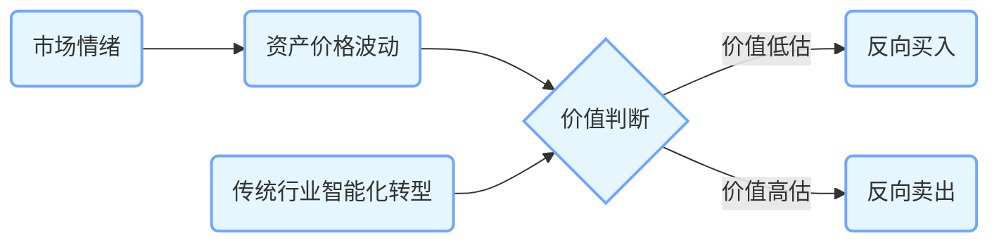

# 彼得林奇的“反向投资”在传统行业智能化转型中的应用

> 关键词：彼得林奇、反向投资、传统行业、智能化转型、投资策略

> 摘要：本文深入探讨了彼得林奇的“反向投资”策略在传统行业智能化转型中的应用。首先介绍了反向投资策略的背景和核心概念，剖析其原理与架构。接着详细阐述了该策略涉及的核心算法原理及具体操作步骤，运用 Python 代码进行说明，并给出相关数学模型和公式。通过实际项目案例展示了如何在传统行业智能化转型中运用反向投资策略，包括开发环境搭建、源代码实现与解读。同时分析了该策略在不同实际应用场景中的表现，推荐了学习该策略及相关技术的工具和资源，最后总结了未来发展趋势与挑战，解答了常见问题，并提供了扩展阅读和参考资料。

## 1. 背景介绍 
### 1.1 目的和范围
传统行业智能化转型是当前经济发展的重要趋势，然而这一过程充满了不确定性和挑战。彼得林奇的“反向投资”策略以其独特的视角和方法，为投资者在传统行业智能化转型中寻找投资机会提供了新的思路。本文的目的在于深入研究该策略在传统行业智能化转型中的应用，分析其可行性和有效性，探讨如何运用这一策略在复杂的市场环境中获得收益。研究范围涵盖了多个传统行业，如制造业、零售业、金融业等在智能化转型过程中的投资情况。

### 1.2 预期读者
本文预期读者包括投资者、金融分析师、传统行业企业管理者、从事智能化转型研究的学者以及对投资策略和传统行业发展感兴趣的人士。投资者可以从中获取在传统行业智能化转型中的投资建议；金融分析师可借鉴该策略进行市场分析；企业管理者能了解如何从投资角度推动企业的智能化转型；学者可以开展相关学术研究；而普通读者则可以拓宽对投资和行业发展的认知。

### 1.3 文档结构概述
本文将按照以下结构展开：首先介绍反向投资策略的核心概念与联系，包括原理和架构；接着阐述核心算法原理及具体操作步骤，并用 Python 代码进行详细说明；然后给出相关数学模型和公式，并举例说明；通过实际项目案例展示该策略在传统行业智能化转型中的应用；分析该策略的实际应用场景；推荐学习该策略及相关技术的工具和资源；总结未来发展趋势与挑战；解答常见问题；最后提供扩展阅读和参考资料。

### 1.4 术语表
#### 1.4.1 核心术语定义
- **反向投资**：彼得林奇提出的一种投资策略，指投资者与市场普遍观点相反，在市场对某类资产或行业过度悲观时买入，在过度乐观时卖出。
- **传统行业**：指发展历史较长、技术相对成熟、产业模式较为固定的行业，如制造业、采矿业、农业等。
- **智能化转型**：传统行业通过引入人工智能、大数据、物联网等新兴技术，对生产、管理、营销等环节进行升级改造，实现生产效率提升、产品和服务创新的过程。

#### 1.4.2 相关概念解释
- **市场情绪**：投资者对市场整体或特定行业、资产的乐观或悲观态度，通常会影响资产价格的波动。
- **价值低估**：资产的市场价格低于其内在价值的状态，可能是由于市场情绪、短期业绩不佳等因素导致。
- **价值高估**：资产的市场价格高于其内在价值的状态，可能是由于市场过度乐观、炒作等因素导致。

#### 1.4.3 缩略词列表
- AI：Artificial Intelligence，人工智能
- IoT：Internet of Things，物联网
- Big Data：大数据

## 2. 核心概念与联系 

### 反向投资策略原理
彼得林奇的反向投资策略基于对市场情绪和企业价值的深刻理解。市场参与者往往会受到情绪的影响，导致资产价格出现过度波动。当市场对某一传统行业的智能化转型前景过度悲观时，该行业相关企业的股价可能会被大幅低估。此时，反向投资者认为这些企业的内在价值并未发生实质性改变，或者其智能化转型的潜力被市场忽视，从而选择买入这些企业的股票。相反，当市场对某一传统行业的智能化转型过度乐观，企业股价被大幅高估时，反向投资者会选择卖出股票。

### 架构示意图

该示意图展示了反向投资策略的核心架构。市场情绪影响资产价格波动，投资者根据资产的价值判断（结合传统行业智能化转型的情况）做出反向买入或卖出的决策。

## 3. 核心算法原理 & 具体操作步骤 

### 核心算法原理
反向投资策略的核心算法主要是对企业价值进行评估，判断其是否被低估或高估。常用的方法是基于财务指标和行业分析。以下是一个简化的算法步骤：
1. **收集数据**：收集目标企业的财务报表、行业数据、市场情绪指标等。
2. **计算企业内在价值**：可以使用现金流折现模型（DCF）等方法计算企业的内在价值。
3. **比较市场价格与内在价值**：如果市场价格低于内在价值，则认为企业被低估；如果市场价格高于内在价值，则认为企业被高估。
4. **做出投资决策**：根据价值判断结果，决定是否进行反向买入或卖出操作。

### Python 代码实现
```python
import pandas as pd
import numpy as np

# 模拟收集企业财务数据
def collect_financial_data():
    # 这里简单模拟一些财务数据，实际应用中需要从数据库或 API 获取
    data = {
        'revenue': [100, 120, 130],  # 营业收入
        'net_income': [10, 12, 15],  # 净利润
        'discount_rate': [0.1, 0.1, 0.1]  # 折现率
    }
    df = pd.DataFrame(data)
    return df

# 计算企业内在价值（使用简单的现金流折现模型）
def calculate_intrinsic_value(financial_data):
    cash_flows = financial_data['net_income']
    discount_rates = financial_data['discount_rate']
    n = len(cash_flows)
    present_values = []
    for i in range(n):
        pv = cash_flows[i] / ((1 + discount_rates[i]) ** (i + 1))
        present_values.append(pv)
    intrinsic_value = sum(present_values)
    return intrinsic_value

# 比较市场价格与内在价值，做出投资决策
def make_investment_decision(intrinsic_value, market_price):
    if market_price < intrinsic_value:
        decision = 'Buy'
    elif market_price > intrinsic_value:
        decision = 'Sell'
    else:
        decision = 'Hold'
    return decision

# 主函数
def main():
    financial_data = collect_financial_data()
    intrinsic_value = calculate_intrinsic_value(financial_data)
    market_price = 20  # 模拟市场价格
    decision = make_investment_decision(intrinsic_value, market_price)
    print(f"企业内在价值: {intrinsic_value}")
    print(f"市场价格: {market_price}")
    print(f"投资决策: {decision}")

if __name__ == "__main__":
    main()
```
### 代码解释
- `collect_financial_data` 函数：模拟收集企业的财务数据，包括营业收入、净利润和折现率。
- `calculate_intrinsic_value` 函数：使用现金流折现模型计算企业的内在价值。
- `make_investment_decision` 函数：比较市场价格与内在价值，根据比较结果做出投资决策。
- `main` 函数：调用上述函数，完成数据收集、价值计算和投资决策，并输出结果。

## 4. 数学模型和公式 & 详细讲解 & 举例说明 

### 现金流折现模型（DCF）
现金流折现模型是一种常用的企业价值评估方法，其基本原理是将企业未来的现金流按照一定的折现率折现到当前时刻，得到企业的内在价值。公式如下：
$$V = \sum_{t=1}^{n} \frac{CF_t}{(1 + r)^t}$$
其中：
- $V$ 表示企业的内在价值
- $CF_t$ 表示第 $t$ 期的现金流
- $r$ 表示折现率
- $n$ 表示预测期数

### 详细讲解
- **现金流（$CF_t$）**：可以是企业的净利润、自由现金流等。在实际应用中，需要对未来的现金流进行预测，通常可以根据企业的历史数据、行业发展趋势等进行分析。
- **折现率（$r$）**：反映了资金的时间价值和投资的风险。折现率越高，未来现金流的现值越低。折现率的确定需要考虑市场利率、企业的风险水平等因素。
- **预测期数（$n$）**：根据企业的具体情况和分析目的确定。一般来说，预测期数越长，不确定性越大。

### 举例说明
假设某企业未来三年的净利润分别为 100 万元、120 万元和 150 万元，折现率为 10%。则该企业的内在价值计算如下：
$$V = \frac{100}{(1 + 0.1)^1} + \frac{120}{(1 + 0.1)^2} + \frac{150}{(1 + 0.1)^3}$$
$$V = \frac{100}{1.1} + \frac{120}{1.21} + \frac{150}{1.331}$$
$$V \approx 90.91 + 99.17 + 112.69$$
$$V \approx 302.77 \text{（万元）}$$
如果该企业的市场价格为 250 万元，由于市场价格低于内在价值，根据反向投资策略，可以考虑买入该企业的股票。

## 5. 项目实战：代码实际案例和详细解释说明 

### 5.1  开发环境搭建
- **操作系统**：推荐使用 Windows、Linux 或 macOS 操作系统。
- **Python 环境**：安装 Python 3.6 及以上版本。可以从 Python 官方网站（https://www.python.org/downloads/）下载安装包进行安装。
- **开发工具**：推荐使用 PyCharm 或 Jupyter Notebook 作为开发工具。
- **第三方库**：安装 pandas、numpy 等第三方库，可以使用以下命令进行安装：
```sh
pip install pandas numpy
```

### 5.2  源代码详细实现和代码解读
```python
import pandas as pd
import numpy as np

# 从 CSV 文件中读取企业财务数据
def read_financial_data(file_path):
    try:
        data = pd.read_csv(file_path)
        return data
    except FileNotFoundError:
        print(f"文件 {file_path} 未找到，请检查文件路径。")
        return None

# 计算企业内在价值（使用改进的现金流折现模型）
def calculate_intrinsic_value(financial_data, growth_rate, discount_rate, terminal_growth_rate, forecast_years):
    cash_flows = financial_data['net_income']
    last_cash_flow = cash_flows.iloc[-1]
    present_values = []
    for i in range(forecast_years):
        future_cash_flow = last_cash_flow * ((1 + growth_rate) ** (i + 1))
        pv = future_cash_flow / ((1 + discount_rate) ** (i + 1))
        present_values.append(pv)
    # 计算终值
    terminal_value = (last_cash_flow * ((1 + growth_rate) ** forecast_years) * (1 + terminal_growth_rate)) / (discount_rate - terminal_growth_rate)
    terminal_pv = terminal_value / ((1 + discount_rate) ** forecast_years)
    present_values.append(terminal_pv)
    intrinsic_value = sum(present_values)
    return intrinsic_value

# 比较市场价格与内在价值，做出投资决策
def make_investment_decision(intrinsic_value, market_price):
    if market_price < intrinsic_value:
        decision = 'Buy'
    elif market_price > intrinsic_value:
        decision = 'Sell'
    else:
        decision = 'Hold'
    return decision

# 主函数
def main():
    file_path = 'financial_data.csv'  # 财务数据文件路径
    financial_data = read_financial_data(file_path)
    if financial_data is not None:
        growth_rate = 0.1  # 预测期内的增长率
        discount_rate = 0.1  # 折现率
        terminal_growth_rate = 0.03  # 终值增长率
        forecast_years = 5  # 预测期数
        intrinsic_value = calculate_intrinsic_value(financial_data, growth_rate, discount_rate, terminal_growth_rate, forecast_years)
        market_price = 500  # 模拟市场价格
        decision = make_investment_decision(intrinsic_value, market_price)
        print(f"企业内在价值: {intrinsic_value}")
        print(f"市场价格: {market_price}")
        print(f"投资决策: {decision}")

if __name__ == "__main__":
    main()
```
### 代码解读
- `read_financial_data` 函数：从 CSV 文件中读取企业的财务数据。如果文件不存在，会输出错误信息。
- `calculate_intrinsic_value` 函数：使用改进的现金流折现模型计算企业的内在价值。考虑了预测期内的增长率、终值增长率等因素。
- `make_investment_decision` 函数：比较市场价格与内在价值，根据比较结果做出投资决策。
- `main` 函数：调用上述函数，完成数据读取、价值计算和投资决策，并输出结果。

### 5.3  代码解读与分析
- **数据读取**：通过 `read_financial_data` 函数从 CSV 文件中读取企业的财务数据，提高了代码的可扩展性和数据的可维护性。
- **价值计算**：`calculate_intrinsic_value` 函数使用了改进的现金流折现模型，考虑了预测期内的增长率和终值增长率，使计算结果更加准确。
- **投资决策**：`make_investment_decision` 函数根据市场价格与内在价值的比较结果做出投资决策，简单直观。

## 6. 实际应用场景 
### 制造业智能化转型
在制造业智能化转型过程中，市场可能对一些传统制造企业的转型前景持悲观态度，导致其股价下跌。然而，一些企业通过引入先进的智能制造技术，如工业互联网、机器人自动化等，提高了生产效率和产品质量。反向投资者可以通过分析这些企业的财务状况、技术实力和转型计划，判断其内在价值是否被低估。如果发现企业的智能化转型具有较大潜力，而市场价格却未能反映其真实价值，就可以考虑买入该企业的股票。

### 零售业智能化转型
随着电商的发展，传统零售业面临着巨大的挑战。一些传统零售企业开始进行智能化转型，如引入大数据分析、人工智能客服、无人零售等技术，提升顾客体验和运营效率。在转型初期，市场可能对这些企业的转型效果存在疑虑，导致其股价低迷。反向投资者可以关注这些企业的转型进展和创新举措，评估其未来的发展潜力。如果认为企业的智能化转型能够成功，就可以在市场悲观时买入股票，等待企业价值的提升。

### 金融业智能化转型
金融业也在积极推进智能化转型，如利用人工智能进行风险评估、智能投顾、区块链技术应用等。一些传统金融机构在转型过程中可能会面临短期的困难和挑战，市场对其转型前景可能会过度悲观。反向投资者可以深入研究这些金融机构的技术实力、业务模式和市场竞争力，判断其内在价值是否被低估。如果认为企业的智能化转型能够带来长期的竞争优势，就可以选择在合适的时机进行投资。

## 7. 工具和资源推荐
### 7.1 学习资源推荐
#### 7.1.1 书籍推荐
- 《彼得林奇的成功投资》：彼得林奇的经典著作，详细介绍了他的投资理念和方法。
- 《聪明的投资者》：本杰明·格雷厄姆的代表作，阐述了价值投资的基本原理和方法。
- 《金融炼金术》：乔治·索罗斯的著作，探讨了金融市场的运行规律和投资策略。

#### 7.1.2 在线课程
- Coursera 上的“投资学原理”课程：系统介绍了投资学的基本概念、理论和方法。
- edX 上的“金融市场与投资策略”课程：深入讲解了金融市场的运作机制和各种投资策略。

#### 7.1.3 技术博客和网站
- 雪球网：国内知名的投资社区，提供了丰富的股票分析、投资策略和行业研究等内容。
- 价值投资网：专注于价值投资理念的传播和研究，提供了大量的投资案例和分析文章。

### 7.2 开发工具框架推荐
#### 7.2.1 IDE和编辑器
- PyCharm：功能强大的 Python 集成开发环境，提供了代码编辑、调试、版本控制等功能。
- Jupyter Notebook：交互式的开发环境，适合进行数据分析和模型开发。

#### 7.2.2 调试和性能分析工具
- PySnooper：简单易用的 Python 调试工具，可以自动记录函数的执行过程和变量的值。
- cProfile：Python 内置的性能分析工具，可以分析代码的执行时间和调用关系。

#### 7.2.3 相关框架和库
- pandas：用于数据处理和分析的 Python 库，提供了丰富的数据结构和函数。
- numpy：用于科学计算的 Python 库，提供了高效的数组操作和数学函数。

### 7.3 相关论文著作推荐
#### 7.3.1 经典论文
- 《有效市场假说》：尤金·法玛提出的经典理论，探讨了金融市场的有效性。
- 《资本资产定价模型》：威廉·夏普提出的模型，用于计算资产的预期收益率。

#### 7.3.2 最新研究成果
- 《人工智能在投资决策中的应用》：研究了人工智能技术在投资决策中的应用和发展趋势。
- 《传统行业智能化转型的投资策略研究》：探讨了在传统行业智能化转型背景下的投资策略和方法。

#### 7.3.3 应用案例分析
- 《某制造业企业智能化转型的投资分析》：详细分析了某制造业企业在智能化转型过程中的投资机会和风险。
- 《零售业智能化转型的成功案例研究》：研究了一些零售业企业在智能化转型方面的成功经验和实践。

## 8. 总结：未来发展趋势与挑战
### 未来发展趋势
- **智能化转型加速**：随着科技的不断进步，传统行业的智能化转型将进一步加速。反向投资策略将有更多的应用机会，投资者可以通过挖掘被市场低估的转型企业获得收益。
- **数据驱动的投资决策**：大数据、人工智能等技术将在投资决策中发挥越来越重要的作用。投资者可以利用这些技术对企业的财务数据、市场数据、行业数据等进行深入分析，提高投资决策的准确性和效率。
- **跨行业融合**：传统行业之间以及传统行业与新兴行业之间的融合将更加频繁。反向投资者需要具备更广泛的知识和视野，才能准确把握投资机会。

### 挑战
- **技术变革风险**：科技发展迅速，传统行业智能化转型过程中可能面临技术过时、转型失败等风险。投资者需要准确评估企业的技术实力和转型能力，降低投资风险。
- **市场情绪波动**：市场情绪的波动可能导致资产价格的过度波动，增加了反向投资的难度。投资者需要保持冷静，不受市场情绪的影响，做出理性的投资决策。
- **数据质量和安全**：数据是投资决策的重要依据，数据质量和安全问题可能影响投资决策的准确性和可靠性。投资者需要确保获取的数据准确、完整，并采取有效的数据安全措施。

## 9. 附录：常见问题与解答
### 问题 1：反向投资策略是否适用于所有传统行业？
反向投资策略并不适用于所有传统行业。一些行业由于技术变革缓慢、市场竞争激烈等原因，可能不具备智能化转型的潜力或转型难度较大。投资者需要对不同行业进行深入分析，选择具有转型潜力和投资价值的行业。

### 问题 2：如何准确评估企业的内在价值？
评估企业的内在价值是反向投资策略的关键。可以使用多种方法，如现金流折现模型、市盈率法、市净率法等。同时，还需要考虑企业的财务状况、行业地位、技术实力、管理团队等因素。在实际应用中，需要综合运用多种方法和因素进行评估。

### 问题 3：反向投资策略的风险如何控制？
反向投资策略存在一定的风险，如企业转型失败、市场情绪逆转等。为了控制风险，投资者可以采取分散投资、设定止损点、定期评估投资组合等措施。同时，需要密切关注企业的转型进展和市场动态，及时调整投资策略。

## 10. 扩展阅读 & 参考资料
### 扩展阅读
- 《创新者的窘境》：探讨了企业在面对技术变革时的困境和应对策略。
- 《黑天鹅》：介绍了极端事件对金融市场和投资决策的影响。

### 参考资料
- 彼得林奇. 《彼得林奇的成功投资》. 机械工业出版社.
- 本杰明·格雷厄姆. 《聪明的投资者》. 人民邮电出版社.
- 乔治·索罗斯. 《金融炼金术》. 海南出版社.

作者：AI天才研究院/AI Genius Institute & 禅与计算机程序设计艺术 /Zen And The Art of Computer Programming