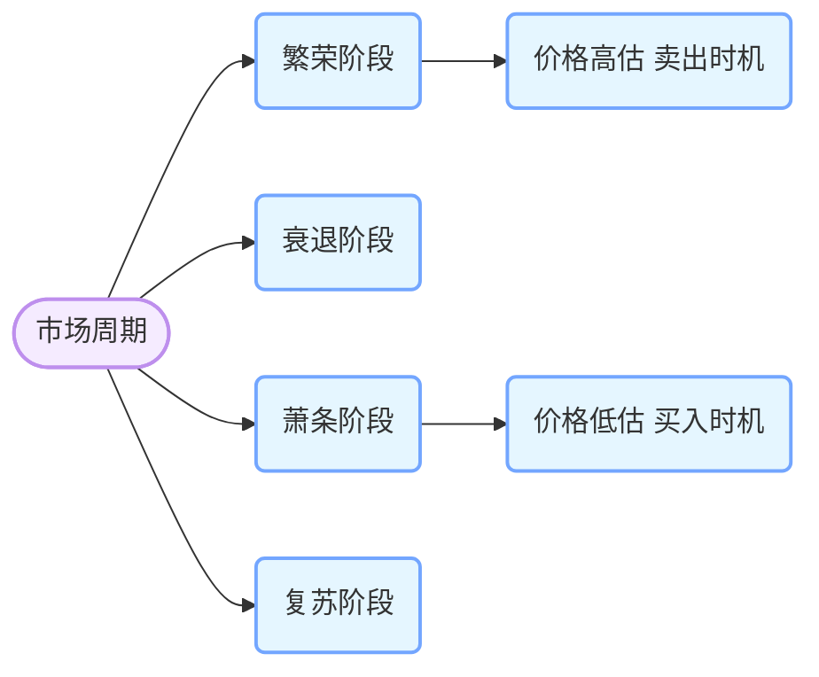

# 彼得林奇的"反周期"投资在商品市场的应用

> 关键词：彼得林奇、反周期投资、商品市场、投资策略、市场周期

> 摘要：本文深入探讨了彼得林奇的“反周期”投资策略在商品市场的应用。首先介绍了“反周期”投资的背景和相关概念，接着阐述了其核心原理和架构。通过详细的算法原理讲解、数学模型分析以及实际案例展示，说明了该策略在商品市场中的具体操作方法。同时，分析了其在不同实际应用场景中的表现，并推荐了相关的学习资源、开发工具和研究论文。最后，总结了该策略在商品市场的未来发展趋势与挑战，并对常见问题进行了解答。

## 1. 背景介绍 
### 1.1 目的和范围
彼得林奇作为投资界的传奇人物，他的“反周期”投资策略在股票市场取得了巨大的成功。然而，商品市场与股票市场有着不同的特点和运行规律，本研究的目的在于探索“反周期”投资策略在商品市场中的适用性和有效性。研究范围将涵盖各类主要商品市场，如能源、金属、农产品等，分析该策略在不同商品市场中的表现和应用方法。

### 1.2 预期读者
本文预期读者包括对投资领域感兴趣的专业投资者、金融从业者、经济学研究人员以及希望学习投资知识的普通投资者。通过阅读本文，读者能够深入了解“反周期”投资策略在商品市场的应用，为其投资决策提供参考。

### 1.3 文档结构概述
本文将按照以下结构进行阐述：首先介绍相关背景和核心概念，包括“反周期”投资的定义和原理；接着详细讲解核心算法原理和具体操作步骤，并通过数学模型和公式进行深入分析；然后通过实际案例展示该策略在商品市场的应用；随后探讨其实际应用场景和相关工具资源；最后总结未来发展趋势与挑战，并对常见问题进行解答。

### 1.4 术语表
#### 1.4.1 核心术语定义
- **反周期投资**：指投资者在市场周期的不同阶段采取与市场趋势相反的投资策略。当市场处于低迷阶段时，增加投资；当市场处于繁荣阶段时，减少投资。
- **商品市场**：是进行商品交易的场所，包括现货市场和期货市场。商品种类繁多，如能源、金属、农产品等。
- **市场周期**：指市场价格和经济活动呈现出的周期性波动，通常包括繁荣、衰退、萧条和复苏四个阶段。

#### 1.4.2 相关概念解释
- **顺周期投资**：与反周期投资相反，顺周期投资是指投资者在市场上升阶段增加投资，在市场下降阶段减少投资。
- **商品期货**：是一种标准化的合约，规定在未来某个特定时间和地点交割一定数量的商品。期货市场具有套期保值和投机的功能。

#### 1.4.3 缩略词列表
- **ETF**：交易型开放式指数基金（Exchange Traded Fund），是一种在证券交易所上市交易的开放式基金。

## 2. 核心概念与联系 
### 核心概念原理
彼得林奇的“反周期”投资策略基于对市场周期的深刻理解。市场周期是经济活动和市场价格波动的自然规律，不同的市场阶段具有不同的特征。在繁荣阶段，市场需求旺盛，价格上涨，投资者情绪乐观；而在衰退和萧条阶段，市场需求下降，价格下跌，投资者情绪悲观。

“反周期”投资策略的核心思想是在市场低迷时，由于投资者的过度悲观，商品价格往往被低估，此时是买入的好时机；而在市场繁荣时，由于投资者的过度乐观，商品价格往往被高估，此时是卖出的好时机。通过逆向操作，投资者可以在价格低估时买入，在价格高估时卖出，从而获得超额收益。

### 架构示意图


该流程图展示了市场周期与“反周期”投资策略的关系。市场周期包括繁荣、衰退、萧条和复苏四个阶段，在繁荣阶段商品价格高估，是卖出时机；在萧条阶段商品价格低估，是买入时机。

## 3. 核心算法原理 & 具体操作步骤 
### 核心算法原理
在商品市场应用“反周期”投资策略，核心算法的目标是判断市场处于周期的哪个阶段，从而确定买入和卖出的时机。以下是一个简单的基于价格和成交量的判断算法：

```python
import pandas as pd

def market_cycle_judgment(data):
    """
    判断市场周期阶段
    :param data: 包含价格和成交量的DataFrame
    :return: 市场周期阶段（繁荣、衰退、萧条、复苏）
    """
    price = data['price']
    volume = data['volume']
    
    # 计算价格和成交量的变化率
    price_change = price.pct_change()
    volume_change = volume.pct_change()
    
    # 简单的判断规则
    if price_change[-1] > 0 and volume_change[-1] > 0:
        return '繁荣'
    elif price_change[-1] < 0 and volume_change[-1] > 0:
        return '衰退'
    elif price_change[-1] < 0 and volume_change[-1] < 0:
        return '萧条'
    else:
        return '复苏'

# 示例数据
data = pd.DataFrame({
    'price': [100, 110, 105, 90, 85],
    'volume': [1000, 1200, 1100, 900, 800]
})

cycle = market_cycle_judgment(data)
print(f"当前市场周期阶段: {cycle}")
```

### 具体操作步骤
1. **数据收集**：收集商品市场的历史价格和成交量数据，可以从金融数据提供商、交易所等渠道获取。
2. **数据处理**：对收集到的数据进行清洗和整理，去除缺失值和异常值，并计算价格和成交量的变化率。
3. **市场周期判断**：使用上述算法判断市场处于周期的哪个阶段。
4. **投资决策**：根据市场周期阶段做出投资决策。如果处于萧条阶段，考虑买入商品；如果处于繁荣阶段，考虑卖出商品。
5. **风险控制**：设置止损和止盈点，控制投资风险。

## 4. 数学模型和公式 & 详细讲解 & 举例说明 
### 数学模型
在“反周期”投资策略中，可以使用一些数学模型来辅助判断市场周期和确定投资时机。以下是一个简单的基于移动平均线的模型：

设 $P_t$ 为第 $t$ 期的商品价格，$MA_n$ 为 $n$ 期的移动平均线，则 $MA_n$ 的计算公式为：

$$MA_n = \frac{1}{n} \sum_{i = t - n + 1}^{t} P_i$$

当 $P_t > MA_n$ 时，市场可能处于上升趋势；当 $P_t < MA_n$ 时，市场可能处于下降趋势。

### 详细讲解
移动平均线是一种常用的技术分析工具，它可以平滑价格波动，反映市场的长期趋势。通过比较当前价格和移动平均线的大小，可以判断市场的走势。

在“反周期”投资策略中，当价格低于移动平均线时，说明市场可能处于低迷阶段，此时可以考虑买入；当价格高于移动平均线时，说明市场可能处于繁荣阶段，此时可以考虑卖出。

### 举例说明
假设我们以 20 天的移动平均线为例，计算某商品的移动平均线。以下是使用 Python 实现的代码：

```python
import pandas as pd

# 示例数据
data = pd.DataFrame({
    'price': [100, 110, 105, 90, 85, 95, 100, 105, 110, 115, 120, 115, 110, 105, 100, 95, 90, 85, 80, 75]
})

# 计算 20 天移动平均线
data['MA_20'] = data['price'].rolling(window=20).mean()

# 打印结果
print(data)
```

通过观察价格和移动平均线的关系，我们可以判断市场的走势，并根据“反周期”投资策略做出投资决策。

## 5. 项目实战：代码实际案例和详细解释说明 
### 5.1  开发环境搭建
- **Python 环境**：建议使用 Python 3.7 及以上版本。可以从 Python 官方网站（https://www.python.org/downloads/）下载安装。
- **开发工具**：推荐使用 Jupyter Notebook 或 PyCharm 等开发工具。
- **第三方库**：需要安装 pandas、numpy 等第三方库，可以使用以下命令进行安装：
```sh
pip install pandas numpy
```

### 5.2  源代码详细实现和代码解读
以下是一个完整的“反周期”投资策略在商品市场的应用案例：

```python
import pandas as pd
import numpy as np

# 模拟商品市场数据
np.random.seed(0)
dates = pd.date_range(start='2020-01-01', periods=365, freq='D')
prices = np.random.randn(365).cumsum() + 100
volumes = np.random.randint(1000, 2000, size=365)

data = pd.DataFrame({
    'date': dates,
    'price': prices,
    'volume': volumes
})

# 计算价格和成交量的变化率
data['price_change'] = data['price'].pct_change()
data['volume_change'] = data['volume'].pct_change()

# 判断市场周期阶段
def market_cycle_judgment(row):
    if row['price_change'] > 0 and row['volume_change'] > 0:
        return '繁荣'
    elif row['price_change'] < 0 and row['volume_change'] > 0:
        return '衰退'
    elif row['price_change'] < 0 and row['volume_change'] < 0:
        return '萧条'
    else:
        return '复苏'

data['cycle'] = data.apply(market_cycle_judgment, axis=1)

# 投资决策
data['signal'] = 0
data.loc[data['cycle'] == '萧条', 'signal'] = 1  # 买入信号
data.loc[data['cycle'] == '繁荣', 'signal'] = -1  # 卖出信号

# 计算持仓
data['position'] = data['signal'].cumsum()

# 计算收益
data['returns'] = data['price_change'] * data['position'].shift(1)
cumulative_returns = (1 + data['returns']).cumprod()

# 绘制收益曲线
import matplotlib.pyplot as plt

plt.figure(figsize=(12, 6))
plt.plot(data['date'], cumulative_returns)
plt.title('反周期投资策略在商品市场的收益曲线')
plt.xlabel('日期')
plt.ylabel('累计收益')
plt.show()
```

### 代码解读与分析
1. **数据生成**：使用 `numpy` 和 `pandas` 生成模拟的商品市场数据，包括日期、价格和成交量。
2. **数据处理**：计算价格和成交量的变化率，并根据变化率判断市场周期阶段。
3. **投资决策**：根据市场周期阶段生成买入和卖出信号，并计算持仓。
4. **收益计算**：根据持仓和价格变化计算收益，并绘制累计收益曲线。

通过分析收益曲线，可以评估“反周期”投资策略在商品市场的表现。

## 6. 实际应用场景 
### 能源市场
在能源市场中，如原油市场，价格波动受到供需关系、地缘政治等多种因素的影响。当全球经济衰退时，原油需求下降，价格往往会大幅下跌，此时可以采用“反周期”投资策略，适当增加原油的投资。而当全球经济复苏，原油需求增加，价格上涨时，可以考虑卖出原油。

### 金属市场
金属市场，如黄金和铜市场，也具有明显的周期性。黄金通常被视为避险资产，在经济不稳定时期，投资者会增加对黄金的需求，导致价格上涨。而在经济繁荣时期，黄金的需求可能会下降，价格也会随之回落。因此，在经济低迷时买入黄金，在经济繁荣时卖出黄金，可以获得较好的收益。

### 农产品市场
农产品市场的价格波动受到季节、气候、政策等因素的影响。例如，在丰收季节，农产品供应增加，价格可能会下跌；而在歉收季节，农产品供应减少，价格可能会上涨。采用“反周期”投资策略，可以在价格低迷时买入农产品，在价格上涨时卖出。

## 7. 工具和资源推荐
### 7.1 学习资源推荐
#### 7.1.1 书籍推荐
- 《彼得林奇的成功投资》：彼得林奇的经典著作，详细介绍了他的投资理念和方法。
- 《聪明的投资者》：本杰明·格雷厄姆的经典著作，被誉为投资界的圣经，对价值投资和反周期投资有深入的阐述。
- 《期货市场技术分析》：约翰·墨菲的经典著作，介绍了期货市场的技术分析方法，对商品市场投资有很大的帮助。

#### 7.1.2 在线课程
- Coursera 上的“投资学原理”：由知名大学教授授课，系统介绍投资学的基本原理和方法。
- 网易云课堂上的“商品期货投资实战”：介绍商品期货市场的投资策略和实战技巧。

#### 7.1.3 技术博客和网站
- 雪球网：提供股票、基金、期货等投资领域的资讯和交流平台。
- 华尔街见闻：提供全球金融市场的实时资讯和分析。

### 7.2 开发工具框架推荐
#### 7.2.1 IDE和编辑器
- Jupyter Notebook：适合进行数据分析和模型开发，具有交互式编程的特点。
- PyCharm：功能强大的 Python 开发工具，提供代码编辑、调试、版本控制等功能。

#### 7.2.2 调试和性能分析工具
- `pdb`：Python 内置的调试工具，可以帮助开发者定位代码中的问题。
- `cProfile`：Python 内置的性能分析工具，可以分析代码的运行时间和性能瓶颈。

#### 7.2.3 相关框架和库
- `pandas`：用于数据处理和分析的 Python 库，提供了丰富的数据结构和函数。
- `numpy`：用于科学计算的 Python 库，提供了高效的数组和矩阵运算功能。
- `matplotlib`：用于数据可视化的 Python 库，可以绘制各种类型的图表。

### 7.3 相关论文著作推荐
#### 7.3.1 经典论文
- 《The Efficient Market Hypothesis and Its Critics》：对有效市场假说进行了深入的探讨和批判。
- 《Capital Asset Pricing Model: Theory and Evidence》：介绍了资本资产定价模型的理论和实证研究。

#### 7.3.2 最新研究成果
- 可以关注《Journal of Finance》、《Review of Financial Studies》等金融领域的顶级期刊，获取最新的研究成果。

#### 7.3.3 应用案例分析
- 可以参考一些投资机构和学者发布的研究报告，了解“反周期”投资策略在商品市场的实际应用案例。

## 8. 总结：未来发展趋势与挑战
### 未来发展趋势
- **智能化应用**：随着人工智能和机器学习技术的发展，“反周期”投资策略将更加智能化。通过大数据分析和模型预测，可以更准确地判断市场周期和投资时机。
- **跨市场应用**：“反周期”投资策略将不仅仅局限于商品市场，还将在股票、债券、外汇等多个市场得到更广泛的应用。通过跨市场的资产配置，可以降低投资风险，提高收益。
- **绿色投资**：随着全球对环境保护和可持续发展的关注，绿色商品市场将得到快速发展。“反周期”投资策略可以在绿色商品市场中发挥重要作用，推动绿色产业的发展。

### 挑战
- **市场不确定性**：商品市场受到多种因素的影响，如供需关系、地缘政治、政策变化等，市场不确定性较大。准确判断市场周期和投资时机变得更加困难。
- **数据质量和获取难度**：“反周期”投资策略需要大量的历史数据进行分析和建模。然而，数据质量和获取难度是一个挑战，特别是一些新兴商品市场的数据可能不够完整和准确。
- **投资者情绪影响**：投资者情绪在市场周期中起着重要的作用。当市场处于极端情绪时，投资者可能会做出非理性的决策，影响“反周期”投资策略的效果。

## 9. 附录：常见问题与解答
### 问题 1：“反周期”投资策略适合所有投资者吗？
答：“反周期”投资策略需要投资者具备一定的市场分析能力和风险承受能力。对于缺乏经验和风险承受能力较低的投资者来说，可能不太适合。投资者应该根据自己的投资目标、风险偏好和投资经验来选择适合自己的投资策略。

### 问题 2：如何判断市场处于周期的哪个阶段？
答：可以通过分析价格、成交量、经济数据等指标来判断市场周期阶段。如本文介绍的基于价格和成交量变化率的判断方法，以及基于移动平均线的判断方法。同时，还可以参考宏观经济数据和市场研究报告。

### 问题 3：“反周期”投资策略的风险如何控制？
答：可以通过设置止损和止盈点来控制风险。当投资损失达到一定程度时，及时止损；当投资收益达到一定目标时，及时止盈。此外，还可以通过分散投资来降低风险，避免过度集中投资于某一种商品。

## 10. 扩展阅读 & 参考资料
- 彼得林奇. 《彼得林奇的成功投资》. 机械工业出版社.
- 本杰明·格雷厄姆. 《聪明的投资者》. 人民邮电出版社.
- 约翰·墨菲. 《期货市场技术分析》. 地震出版社.
- Fama, E. F. "The Efficient Market Hypothesis and Its Critics." The Journal of Economic Perspectives, Vol. 17, No. 1 (Winter, 2003), pp. 23-44.
- Sharpe, W. F. "Capital Asset Pricing Model: Theory and Evidence." The Journal of Economic Perspectives, Vol. 18, No. 3 (Summer, 2004), pp. 25-46.

作者：AI天才研究院/AI Genius Institute & 禅与计算机程序设计艺术 /Zen And The Art of Computer Programming