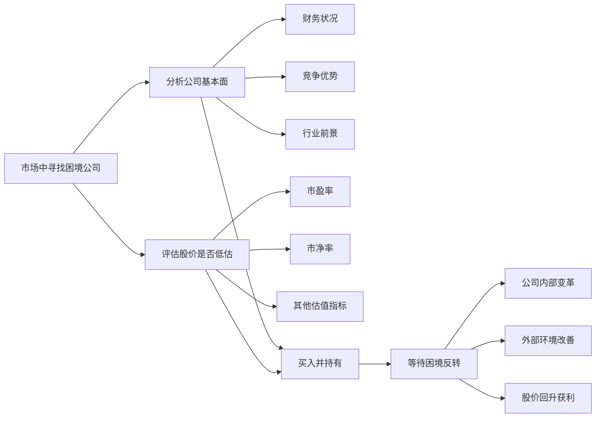

# 彼得林奇的“墓地投资法”

> 关键词：彼得林奇、墓地投资法、投资策略、价值投资、股票选择

> 摘要：本文深入探讨了彼得林奇的“墓地投资法”，这是一种独特且有效的投资策略。首先介绍了该方法的背景，包括其目的、适用读者以及文档结构等。接着阐述了核心概念和联系，通过文本示意图和 Mermaid 流程图进行清晰展示。详细讲解了其核心算法原理，并使用 Python 代码进行说明。对涉及的数学模型和公式进行推导和举例。通过项目实战，给出代码案例并详细解读。分析了该方法的实际应用场景，推荐了相关的学习资源、开发工具框架以及论文著作。最后总结了未来发展趋势与挑战，还提供了常见问题解答和扩展阅读参考资料，旨在帮助投资者更好地理解和运用“墓地投资法”。

## 1. 背景介绍 
### 1.1 目的和范围
彼得林奇是投资界的传奇人物，他所提出的“墓地投资法”旨在为投资者提供一种独特的选股思路，帮助投资者在复杂的股票市场中发现被低估的优质股票，从而获得长期的投资回报。本文的范围将全面涵盖“墓地投资法”的各个方面，包括其核心概念、算法原理、实际应用等，同时结合实际案例和相关理论进行深入分析。

### 1.2 预期读者
本文预期读者为广大投资者，无论是初涉投资领域的新手，还是有一定投资经验的专业人士，都可以从本文中获得关于“墓地投资法”的深入理解和应用指导。对于那些希望学习和掌握独特投资策略的人来说，本文将是一份有价值的参考资料。

### 1.3 文档结构概述
本文将按照以下结构进行阐述：首先介绍“墓地投资法”的背景知识，包括其目的、适用读者和文档结构。接着详细讲解核心概念和联系，通过示意图和流程图进行直观展示。然后深入分析核心算法原理，并使用 Python 代码进行实现。之后介绍相关的数学模型和公式，并通过具体例子进行说明。再通过项目实战，展示代码案例并进行详细解读。分析该方法的实际应用场景，推荐相关的学习资源、开发工具框架和论文著作。最后总结未来发展趋势与挑战，提供常见问题解答和扩展阅读参考资料。

### 1.4 术语表
#### 1.4.1 核心术语定义
- **墓地投资法**：彼得林奇提出的一种投资策略，指寻找那些暂时处于困境、股价低迷，但具有潜在价值的公司进行投资。
- **价值投资**：一种投资理念，强调通过分析公司的基本面，寻找被低估的股票，长期持有以获取价值回归带来的收益。
- **市盈率（P/E）**：股票价格除以每股收益的比率，用于衡量股票的估值水平。
- **市净率（P/B）**：股票价格除以每股净资产的比率，反映了股票价格相对于净资产的倍数。

#### 1.4.2 相关概念解释
- **困境反转**：指公司在经历一段时间的困境后，通过自身的努力或外部环境的改善，实现业绩的反转和股价的回升。
- **安全边际**：投资者在购买股票时，为了降低风险，所支付的价格低于股票内在价值的差额。

#### 1.4.3 缩略词列表
- **P/E**：市盈率（Price-to-Earnings Ratio）
- **P/B**：市净率（Price-to-Book Ratio）

## 2. 核心概念与联系 
### 核心概念原理
“墓地投资法”的核心思想是在股票市场中寻找那些被市场忽视或抛弃的公司，这些公司往往由于各种原因，如行业竞争激烈、短期业绩不佳、负面新闻等，导致股价大幅下跌，就像被埋葬在“墓地”中一样。然而，这些公司可能具有良好的基本面、独特的竞争优势或潜在的发展机会。投资者通过深入研究和分析，挑选出这些具有潜力的公司，在股价低迷时买入，等待公司困境反转，实现股价的回升，从而获得丰厚的投资回报。

### 架构的文本示意图
```plaintext
市场中寻找困境公司
|
|--分析公司基本面
|   |--财务状况（资产负债表、利润表、现金流量表）
|   |--竞争优势（品牌、技术、成本等）
|   |--行业前景（市场规模、增长趋势、竞争格局）
|
|--评估股价是否低估
|   |--市盈率
|   |--市净率
|   |--其他估值指标
|
|--买入并持有
|
|--等待困境反转
|   |--公司内部变革（管理改善、业务调整等）
|   |--外部环境改善（行业复苏、政策支持等）
|
|--股价回升获利
```

### Mermaid 流程图


## 3. 核心算法原理 & 具体操作步骤 
### 核心算法原理
“墓地投资法”的核心算法主要围绕对公司基本面的分析和股价估值的评估。以下是具体的算法步骤：

1. **筛选困境公司**：从市场中筛选出那些股价大幅下跌、市值较小、被市场忽视的公司。可以通过设定股价跌幅、市值范围等条件进行初步筛选。
2. **分析公司基本面**：对筛选出的公司进行深入的基本面分析，包括财务状况、竞争优势和行业前景等。
    - **财务状况分析**：查看公司的资产负债表、利润表和现金流量表，评估公司的偿债能力、盈利能力和现金流状况。例如，计算资产负债率、毛利率、净利率等指标。
    - **竞争优势分析**：分析公司的品牌、技术、成本等方面的竞争优势，判断公司在行业中的地位和竞争力。
    - **行业前景分析**：研究公司所处行业的市场规模、增长趋势、竞争格局等，评估行业的发展前景。
3. **评估股价是否低估**：使用市盈率、市净率等估值指标，结合公司的基本面情况，评估股价是否被低估。如果股价低于公司的内在价值，则认为该股票具有投资价值。
4. **买入并持有**：在确定股票具有投资价值后，买入该股票并长期持有，等待公司困境反转。
5. **监控和调整**：定期监控公司的基本面变化和股价走势，根据情况进行调整。如果公司的基本面恶化或股价达到目标价位，则考虑卖出股票。

### 具体操作步骤
以下是使用 Python 实现“墓地投资法”核心算法的具体代码：

```python
import pandas as pd
import yfinance as yf

# 步骤 1：筛选困境公司
def screen_distressed_companies(tickers, price_drop_threshold=0.5, market_cap_threshold=100000000):
    distressed_tickers = []
    for ticker in tickers:
        try:
            data = yf.download(ticker, period="1y")
            if len(data) > 0:
                max_price = data['Close'].max()
                current_price = data['Close'].iloc[-1]
                price_drop = (max_price - current_price) / max_price
                if price_drop >= price_drop_threshold:
                    stock = yf.Ticker(ticker)
                    market_cap = stock.info.get('marketCap', 0)
                    if market_cap < market_cap_threshold:
                        distressed_tickers.append(ticker)
        except Exception as e:
            print(f"Error downloading data for {ticker}: {e}")
    return distressed_tickers

# 步骤 2：分析公司基本面
def analyze_fundamentals(ticker):
    try:
        stock = yf.Ticker(ticker)
        # 财务状况分析
        balance_sheet = stock.balance_sheet
        income_statement = stock.income_stmt
        cash_flow = stock.cashflow
        # 计算一些关键财务指标
        total_assets = balance_sheet.loc['Total Assets'].iloc[0]
        total_liabilities = balance_sheet.loc['Total Liab'].iloc[0]
        net_income = income_statement.loc['Net Income'].iloc[0]
        revenue = income_statement.loc['Total Revenue'].iloc[0]
        cash_from_operations = cash_flow.loc['Total Cash From Operating Activities'].iloc[0]
        asset_liability_ratio = total_liabilities / total_assets
        gross_margin = (revenue - income_statement.loc['Cost Of Revenue'].iloc[0]) / revenue
        net_profit_margin = net_income / revenue
        # 竞争优势和行业前景分析（此处简化为打印信息）
        print(f"Company: {ticker}")
        print(f"Asset Liability Ratio: {asset_liability_ratio}")
        print(f"Gross Margin: {gross_margin}")
        print(f"Net Profit Margin: {net_profit_margin}")
        print(f"Cash From Operations: {cash_from_operations}")
        print("Competition and Industry Analysis: To be further investigated.")
    except Exception as e:
        print(f"Error analyzing fundamentals for {ticker}: {e}")

# 步骤 3：评估股价是否低估
def evaluate_valuation(ticker):
    try:
        stock = yf.Ticker(ticker)
        pe_ratio = stock.info.get('trailingPE', 0)
        pb_ratio = stock.info.get('priceToBook', 0)
        print(f"P/E Ratio: {pe_ratio}")
        print(f"P/B Ratio: {pb_ratio}")
        if pe_ratio < 10 and pb_ratio < 1:
            print("Stock is potentially undervalued.")
        else:
            print("Stock may not be undervalued.")
    except Exception as e:
        print(f"Error evaluating valuation for {ticker}: {e}")

# 主函数
def main():
    tickers = ['AAPL', 'GOOG', 'MSFT', 'TSLA', 'AMZN']  # 示例股票列表
    distressed_tickers = screen_distressed_companies(tickers)
    print("Distressed companies:", distressed_tickers)
    for ticker in distressed_tickers:
        analyze_fundamentals(ticker)
        evaluate_valuation(ticker)

if __name__ == "__main__":
    main()
```

### 代码解释
1. **screen_distressed_companies 函数**：该函数用于筛选出股价跌幅超过一定阈值且市值低于一定范围的困境公司。通过 yfinance 库下载股票数据，计算股价跌幅和市值，筛选出符合条件的股票代码。
2. **analyze_fundamentals 函数**：该函数用于分析公司的基本面。通过 yfinance 库获取公司的资产负债表、利润表和现金流量表，计算一些关键财务指标，如资产负债率、毛利率、净利率等，并打印相关信息。
3. **evaluate_valuation 函数**：该函数用于评估股价是否低估。通过 yfinance 库获取公司的市盈率和市净率，根据设定的阈值判断股票是否被低估，并打印评估结果。
4. **main 函数**：主函数调用上述三个函数，完成困境公司的筛选、基本面分析和股价估值评估。

## 4. 数学模型和公式 & 详细讲解 & 举例说明 
### 数学模型和公式
在“墓地投资法”中，常用的数学模型和公式主要用于评估公司的财务状况和股价估值。以下是一些常见的公式：

1. **资产负债率（Asset Liability Ratio）**
$$
\text{资产负债率} = \frac{\text{总负债}}{\text{总资产}}
$$
资产负债率反映了公司的偿债能力，该比率越高，说明公司的负债越多，偿债风险越大。

2. **毛利率（Gross Margin）**
$$
\text{毛利率} = \frac{\text{营业收入} - \text{营业成本}}{\text{营业收入}}
$$
毛利率反映了公司的盈利能力，该比率越高，说明公司在扣除营业成本后，剩余的利润空间越大。

3. **净利率（Net Profit Margin）**
$$
\text{净利率} = \frac{\text{净利润}}{\text{营业收入}}
$$
净利率反映了公司的最终盈利能力，该比率越高，说明公司在扣除所有成本和费用后，获得的净利润越多。

4. **市盈率（P/E Ratio）**
$$
\text{市盈率} = \frac{\text{股票价格}}{\text{每股收益}}
$$
市盈率是衡量股票估值的常用指标，该比率越低，说明股票的估值越低，投资价值可能越高。

5. **市净率（P/B Ratio）**
$$
\text{市净率} = \frac{\text{股票价格}}{\text{每股净资产}}
$$
市净率反映了股票价格相对于净资产的倍数，该比率越低，说明股票的估值越低，投资价值可能越高。

### 详细讲解
这些数学模型和公式在“墓地投资法”中起着重要的作用。通过计算这些指标，投资者可以更全面地了解公司的财务状况和股价估值，从而做出更明智的投资决策。

例如，资产负债率可以帮助投资者评估公司的偿债风险。如果公司的资产负债率过高，说明公司的负债压力较大，可能存在偿债困难的风险。毛利率和净利率可以反映公司的盈利能力。毛利率高说明公司在产品或服务的定价上具有一定的优势，净利率高则说明公司的成本控制和经营管理能力较强。

市盈率和市净率是常用的估值指标。一般来说，市盈率低于行业平均水平或历史平均水平，市净率低于 1，说明股票可能被低估。投资者可以根据这些指标筛选出具有投资价值的股票。

### 举例说明
假设我们要分析一家公司的财务状况和股价估值。该公司的财务数据如下：

| 项目 | 金额 |
| ---- | ---- |
| 总资产 | 1000 万元 |
| 总负债 | 400 万元 |
| 营业收入 | 500 万元 |
| 营业成本 | 300 万元 |
| 净利润 | 100 万元 |
| 股票价格 | 10 元 |
| 每股收益 | 1 元 |
| 每股净资产 | 5 元 |

根据上述公式，我们可以计算出该公司的相关指标：

1. **资产负债率**
$$
\text{资产负债率} = \frac{400}{1000} = 0.4 = 40\%
$$
说明该公司的负债水平相对较低，偿债风险较小。

2. **毛利率**
$$
\text{毛利率} = \frac{500 - 300}{500} = 0.4 = 40\%
$$
说明该公司在扣除营业成本后，剩余的利润空间较大，盈利能力较强。

3. **净利率**
$$
\text{净利率} = \frac{100}{500} = 0.2 = 20\%
$$
说明该公司在扣除所有成本和费用后，获得的净利润较高，经营管理能力较强。

4. **市盈率**
$$
\text{市盈率} = \frac{10}{1} = 10
$$
假设该行业的平均市盈率为 15，说明该股票的估值相对较低，具有一定的投资价值。

5. **市净率**
$$
\text{市净率} = \frac{10}{5} = 2
$$
说明该股票价格相对于净资产的倍数为 2，需要结合行业情况进一步评估其估值水平。

## 5. 项目实战：代码实际案例和详细解释说明 
### 5.1  开发环境搭建
要运行上述代码，需要搭建以下开发环境：

1. **Python 安装**：确保已经安装了 Python 3.x 版本。可以从 Python 官方网站（https://www.python.org/downloads/）下载并安装。
2. **库安装**：使用以下命令安装所需的库：
```sh
pip install pandas yfinance
```
`pandas` 是一个用于数据处理和分析的库，`yfinance` 是一个用于下载 Yahoo Finance 股票数据的库。

### 5.2  源代码详细实现和代码解读
以下是完整的代码：

```python
import pandas as pd
import yfinance as yf

# 步骤 1：筛选困境公司
def screen_distressed_companies(tickers, price_drop_threshold=0.5, market_cap_threshold=100000000):
    distressed_tickers = []
    for ticker in tickers:
        try:
            data = yf.download(ticker, period="1y")
            if len(data) > 0:
                max_price = data['Close'].max()
                current_price = data['Close'].iloc[-1]
                price_drop = (max_price - current_price) / max_price
                if price_drop >= price_drop_threshold:
                    stock = yf.Ticker(ticker)
                    market_cap = stock.info.get('marketCap', 0)
                    if market_cap < market_cap_threshold:
                        distressed_tickers.append(ticker)
        except Exception as e:
            print(f"Error downloading data for {ticker}: {e}")
    return distressed_tickers

# 步骤 2：分析公司基本面
def analyze_fundamentals(ticker):
    try:
        stock = yf.Ticker(ticker)
        # 财务状况分析
        balance_sheet = stock.balance_sheet
        income_statement = stock.income_stmt
        cash_flow = stock.cashflow
        # 计算一些关键财务指标
        total_assets = balance_sheet.loc['Total Assets'].iloc[0]
        total_liabilities = balance_sheet.loc['Total Liab'].iloc[0]
        net_income = income_statement.loc['Net Income'].iloc[0]
        revenue = income_statement.loc['Total Revenue'].iloc[0]
        cash_from_operations = cash_flow.loc['Total Cash From Operating Activities'].iloc[0]
        asset_liability_ratio = total_liabilities / total_assets
        gross_margin = (revenue - income_statement.loc['Cost Of Revenue'].iloc[0]) / revenue
        net_profit_margin = net_income / revenue
        # 竞争优势和行业前景分析（此处简化为打印信息）
        print(f"Company: {ticker}")
        print(f"Asset Liability Ratio: {asset_liability_ratio}")
        print(f"Gross Margin: {gross_margin}")
        print(f"Net Profit Margin: {net_profit_margin}")
        print(f"Cash From Operations: {cash_from_operations}")
        print("Competition and Industry Analysis: To be further investigated.")
    except Exception as e:
        print(f"Error analyzing fundamentals for {ticker}: {e}")

# 步骤 3：评估股价是否低估
def evaluate_valuation(ticker):
    try:
        stock = yf.Ticker(ticker)
        pe_ratio = stock.info.get('trailingPE', 0)
        pb_ratio = stock.info.get('priceToBook', 0)
        print(f"P/E Ratio: {pe_ratio}")
        print(f"P/B Ratio: {pb_ratio}")
        if pe_ratio < 10 and pb_ratio < 1:
            print("Stock is potentially undervalued.")
        else:
            print("Stock may not be undervalued.")
    except Exception as e:
        print(f"Error evaluating valuation for {ticker}: {e}")

# 主函数
def main():
    tickers = ['AAPL', 'GOOG', 'MSFT', 'TSLA', 'AMZN']  # 示例股票列表
    distressed_tickers = screen_distressed_companies(tickers)
    print("Distressed companies:", distressed_tickers)
    for ticker in distressed_tickers:
        analyze_fundamentals(ticker)
        evaluate_valuation(ticker)

if __name__ == "__main__":
    main()
```

### 代码解读与分析
1. **筛选困境公司（`screen_distressed_companies` 函数）**：该函数遍历输入的股票列表，使用 `yfinance` 库下载每只股票过去一年的历史数据。计算股票的最大价格和当前价格，得出股价跌幅。如果股价跌幅超过设定的阈值，并且市值低于设定的阈值，则将该股票添加到困境公司列表中。
2. **分析公司基本面（`analyze_fundamentals` 函数）**：该函数使用 `yfinance` 库获取公司的资产负债表、利润表和现金流量表。计算关键财务指标，如资产负债率、毛利率、净利率等，并打印相关信息。需要注意的是，竞争优势和行业前景分析部分在代码中简化为打印提示信息，实际应用中需要进一步深入研究。
3. **评估股价是否低估（`evaluate_valuation` 函数）**：该函数使用 `yfinance` 库获取公司的市盈率和市净率。根据设定的阈值判断股票是否被低估，并打印评估结果。
4. **主函数（`main` 函数）**：主函数调用上述三个函数，完成困境公司的筛选、基本面分析和股价估值评估。

## 6. 实际应用场景 
“墓地投资法”在实际投资中有多种应用场景，以下是一些常见的例子：

### 行业困境中的投资机会
当某个行业整体陷入困境时，如钢铁、煤炭、化工等传统行业，由于市场需求下降、产能过剩等原因，行业内大多数公司的股价都会大幅下跌。此时，投资者可以使用“墓地投资法”，从这些困境公司中筛选出具有良好基本面、独特竞争优势或潜在发展机会的公司进行投资。例如，在钢铁行业低迷时期，一些具有先进技术、低成本优势的钢铁企业可能会在行业复苏时率先受益，其股价也有望大幅回升。

### 公司短期困境中的投资机会
有些公司可能由于短期的经营问题、突发事件或负面新闻等原因，导致股价大幅下跌，但公司的基本面并没有发生实质性的变化。投资者可以通过深入分析公司的基本面，判断其困境是否为短期现象。如果是短期困境，并且公司具有较强的竞争力和恢复能力，那么投资者可以在股价低迷时买入该股票，等待公司困境反转。例如，某家公司因为一次产品质量问题导致股价暴跌，但该公司拥有强大的研发能力和品牌影响力，随着问题的解决和市场信心的恢复，股价可能会逐渐回升。

### 新兴行业中的投资机会
在新兴行业的发展过程中，由于技术创新、市场竞争等因素，一些公司可能会面临短期的困境，但这些公司往往具有巨大的发展潜力。投资者可以使用“墓地投资法”，关注这些新兴行业中的困境公司，寻找那些具有独特技术、创新商业模式或广阔市场前景的公司进行投资。例如，在新能源汽车行业发展初期，一些新能源汽车初创公司可能会面临资金短缺、技术不成熟等问题，导致股价低迷。但随着行业的发展和公司自身的成长，这些公司可能会成为行业的领军企业，为投资者带来丰厚的回报。

## 7. 工具和资源推荐
### 7.1 学习资源推荐
#### 7.1.1 书籍推荐
- 《彼得林奇的成功投资》：彼得林奇的经典著作，详细介绍了他的投资理念和方法，包括“墓地投资法”等，是投资者必读的书籍之一。
- 《聪明的投资者》：本杰明·格雷厄姆的代表作，价值投资的经典之作，对投资理念、选股方法等进行了深入阐述。
- 《证券分析》：同样是本杰明·格雷厄姆的著作，被誉为投资领域的圣经，对财务分析、估值方法等进行了系统的讲解。

#### 7.1.2 在线课程
- Coursera 上的“投资学原理”：由知名大学教授授课，涵盖了投资的基本原理、资产定价、投资组合管理等内容。
- edX 上的“金融市场”：该课程介绍了金融市场的基本概念、金融工具和投资策略，对投资者了解市场和制定投资策略有很大帮助。

#### 7.1.3 技术博客和网站
- 雪球网：国内知名的投资社区，汇聚了众多投资者和投资专家，提供了丰富的股票分析、投资策略和市场资讯。
- Seeking Alpha：国外知名的投资研究网站，提供了大量的股票分析报告、投资观点和市场动态。

### 7.2 开发工具框架推荐
#### 7.2.1 IDE和编辑器
- PyCharm：一款专业的 Python 集成开发环境，提供了丰富的代码编辑、调试、版本控制等功能，适合开发 Python 投资分析程序。
- Jupyter Notebook：一个交互式的开发环境，支持 Python、R 等多种编程语言，方便进行数据探索、分析和可视化。

#### 7.2.2 调试和性能分析工具
- pdb：Python 自带的调试器，可以帮助开发者定位代码中的问题。
- cProfile：Python 的性能分析工具，可以分析代码的运行时间和函数调用情况，帮助开发者优化代码性能。

#### 7.2.3 相关框架和库
- Pandas：用于数据处理和分析的 Python 库，提供了丰富的数据结构和数据分析工具，方便进行财务数据的处理和分析。
- Numpy：Python 的科学计算库，提供了高效的数组操作和数学函数，用于数值计算和数据分析。
- Matplotlib：Python 的绘图库，用于数据可视化，帮助投资者直观地展示和分析数据。

### 7.3 相关论文著作推荐
#### 7.3.1 经典论文
- 《有效市场假说》：由尤金·法玛提出，阐述了市场效率的概念和分类，对投资理论和实践产生了深远影响。
- 《资本资产定价模型》：由威廉·夏普等人提出，用于描述资产预期收益率与风险之间的关系，是现代投资组合理论的重要组成部分。

#### 7.3.2 最新研究成果
- 可以关注顶级金融学术期刊，如《Journal of Finance》、《Review of Financial Studies》等，了解投资领域的最新研究动态和成果。

#### 7.3.3 应用案例分析
- 可以参考一些投资研究机构发布的报告和案例分析，了解“墓地投资法”在实际应用中的效果和经验教训。

## 8. 总结：未来发展趋势与挑战
### 未来发展趋势
- **数据驱动的投资决策**：随着信息技术的不断发展，投资者可以获取更多的财务数据、市场数据和行业数据。未来，“墓地投资法”可能会更加依赖于数据分析和量化模型，通过大数据和人工智能技术，更准确地筛选出具有投资价值的困境公司。
- **跨市场和跨行业投资**：全球化的发展使得不同市场和行业之间的联系日益紧密。未来，投资者可能会将“墓地投资法”应用于更广泛的市场和行业，寻找全球范围内的投资机会。
- **社会责任投资的融合**：越来越多的投资者开始关注企业的社会责任和可持续发展。未来，“墓地投资法”可能会与社会责任投资相结合，筛选出那些不仅具有投资价值，还具有良好社会形象和可持续发展能力的困境公司。

### 挑战
- **信息不对称**：在寻找困境公司的过程中，投资者可能会面临信息不对称的问题。一些公司可能会隐瞒或虚报财务信息，导致投资者难以准确评估公司的基本面和投资价值。
- **市场不确定性**：股票市场充满了不确定性，即使是具有良好基本面的困境公司，也可能因为市场环境的变化、行业竞争的加剧等原因，无法实现困境反转。投资者需要承担一定的市场风险。
- **技术更新换代**：随着科技的不断进步，一些传统行业的困境公司可能会面临技术更新换代的压力。如果公司无法及时跟上技术发展的步伐，可能会被市场淘汰，投资者的投资也可能会遭受损失。

## 9. 附录：常见问题与解答
### 问题 1：“墓地投资法”适用于所有投资者吗？
答：“墓地投资法”并不适用于所有投资者。该方法需要投资者具备一定的财务分析能力和投资经验，能够对公司的基本面进行深入分析和判断。同时，该方法需要投资者有较强的风险承受能力，因为投资困境公司存在一定的不确定性，可能会面临股价继续下跌的风险。

### 问题 2：如何确定公司的困境是短期还是长期的？
答：确定公司的困境是短期还是长期的需要综合考虑多个因素。可以从公司的财务状况、竞争优势、行业前景等方面进行分析。如果公司的财务状况良好，具有独特的竞争优势，所处行业前景较好，并且困境是由短期因素引起的，如一次性的突发事件或短期的市场波动，那么公司的困境可能是短期的。反之，如果公司的财务状况恶化，竞争优势减弱，所处行业面临长期的困境，那么公司的困境可能是长期的。

### 问题 3：使用“墓地投资法”需要注意哪些风险？
答：使用“墓地投资法”需要注意以下风险：
- **公司基本面恶化的风险**：即使公司目前看起来具有投资价值，但如果公司的基本面在未来恶化，如财务状况变差、竞争优势丧失等，那么股价可能会继续下跌。
- **市场风险**：股票市场的波动是不可预测的，即使公司的基本面没有问题，也可能因为市场环境的变化而导致股价下跌。
- **行业风险**：如果公司所处的行业面临长期的困境，如市场需求下降、技术变革等，那么公司的困境可能难以反转，投资也可能会失败。

## 10. 扩展阅读 & 参考资料
### 扩展阅读
- 《巴菲特致股东的信》：沃伦·巴菲特的经典著作，包含了他多年来给股东的信件，阐述了他的投资理念和方法。
- 《金融炼金术》：乔治·索罗斯的代表作，介绍了他的反身性理论和投资实践。

### 参考资料
- 彼得林奇相关的演讲和访谈记录。
- 各大金融网站和财经媒体发布的关于“墓地投资法”的分析文章和研究报告。

作者：AI天才研究院/AI Genius Institute & 禅与计算机程序设计艺术 /Zen And The Art of Computer Programming