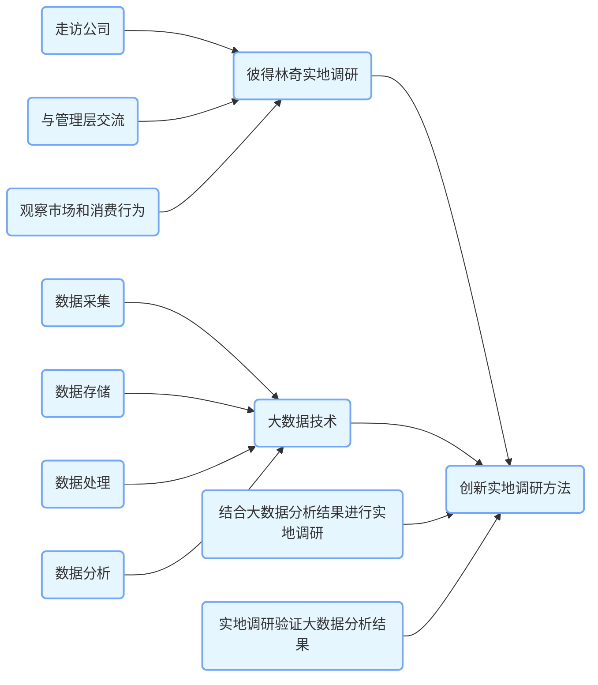

# 彼得林奇的"实地调研"在大数据时代的方法创新

> 关键词：彼得林奇、实地调研、大数据时代、方法创新、投资调研

> 摘要：本文聚焦于彼得林奇的实地调研方法在大数据时代的创新应用。彼得林奇的实地调研方法在传统投资领域取得了巨大成功，然而在大数据时代，信息的获取和处理方式发生了翻天覆地的变化。文章首先介绍了研究的背景、目的、预期读者和文档结构等内容，接着阐述了彼得林奇实地调研和大数据的核心概念及其联系，详细讲解了相关核心算法原理与操作步骤，给出了数学模型和公式并举例说明。通过项目实战案例展示了如何结合大数据创新实地调研方法，分析了其实际应用场景，推荐了相关的学习资源、开发工具框架和论文著作。最后总结了未来发展趋势与挑战，解答了常见问题，并提供了扩展阅读和参考资料，旨在为投资者和相关研究人员在大数据时代改进投资调研方法提供有益的参考。

## 1. 背景介绍 
### 1.1 目的和范围
彼得林奇作为投资界的传奇人物，其通过实地调研发掘潜力股票的方法为众多投资者所推崇。然而，随着大数据时代的到来，海量的数据和先进的数据分析技术为投资调研带来了新的机遇和挑战。本研究的目的在于探讨如何在大数据时代对彼得林奇的实地调研方法进行创新，以提高投资调研的效率和准确性。研究范围涵盖了彼得林奇实地调研方法的核心要点、大数据技术在投资调研中的应用，以及两者结合的具体方法和案例分析。

### 1.2 预期读者
本文的预期读者主要包括专业投资者、投资研究人员、金融行业从业者以及对投资调研方法感兴趣的技术爱好者。这些读者希望通过了解大数据时代下彼得林奇实地调研方法的创新，提升自己的投资分析能力和决策水平。

### 1.3 文档结构概述
本文将按照以下结构展开：首先介绍核心概念与联系，明确彼得林奇实地调研和大数据的基本概念以及它们之间的关联；接着阐述核心算法原理和具体操作步骤，通过 Python 代码详细说明如何运用大数据技术辅助实地调研；然后给出数学模型和公式，并结合实例进行讲解；之后通过项目实战展示创新方法的具体应用，包括开发环境搭建、源代码实现和代码解读；再分析实际应用场景，探讨创新方法在不同投资领域的适用性；推荐相关的工具和资源，为读者进一步学习和实践提供参考；最后总结未来发展趋势与挑战，解答常见问题，并提供扩展阅读和参考资料。

### 1.4 术语表
#### 1.4.1 核心术语定义
- **彼得林奇实地调研**：指彼得林奇通过亲自走访上市公司、与管理层交流、观察市场和消费者行为等方式，获取公司基本面信息和行业动态，以评估投资价值的调研方法。
- **大数据**：指无法在一定时间范围内用常规软件工具进行捕捉、管理和处理的数据集合，是需要新处理模式才能具有更强的决策力、洞察发现力和流程优化能力的海量、高增长率和多样化的信息资产。
- **数据挖掘**：从大量的数据中通过算法搜索隐藏于其中信息的过程。
- **机器学习**：一门多领域交叉学科，涉及概率论、统计学、逼近论、凸分析、算法复杂度理论等多门学科。它专门研究计算机怎样模拟或实现人类的学习行为，以获取新的知识或技能，重新组织已有的知识结构使之不断改善自身的性能。

#### 1.4.2 相关概念解释
- **投资调研**：为了做出投资决策而对投资对象进行的信息收集、分析和评估的过程。
- **数据可视化**：将数据以图形、图表等直观的方式展示出来，以便更好地理解和分析数据。
- **文本挖掘**：从文本数据中提取有价值的信息和知识的过程，包括信息提取、文本分类、情感分析等。

#### 1.4.3 缩略词列表
- **AI**：Artificial Intelligence，人工智能
- **ML**：Machine Learning，机器学习
- **NLP**：Natural Language Processing，自然语言处理
- **ETL**：Extract, Transform, Load，数据抽取、转换和加载

## 2. 核心概念与联系 

### 彼得林奇实地调研的核心原理
彼得林奇的实地调研强调亲力亲为，深入了解公司和行业的实际情况。他认为，投资者可以通过观察日常生活中的消费行为、与公司员工和管理层交流、参加行业展会等方式，发现那些具有潜在投资价值的公司。例如，他通过注意到家人和朋友对某家公司产品的喜爱，从而发掘出了一些优秀的投资机会。

### 大数据的核心原理和架构
大数据的核心原理在于对海量数据的收集、存储、处理和分析。其架构通常包括数据采集层、数据存储层、数据处理层和数据分析层。

#### 数据采集层
负责从各种数据源收集数据，如互联网、传感器、数据库等。常见的数据采集方法包括网络爬虫、API 接口调用等。

#### 数据存储层
用于存储采集到的数据，常见的存储系统有分布式文件系统（如 Hadoop Distributed File System，HDFS）、关系型数据库（如 MySQL）和非关系型数据库（如 MongoDB）等。

#### 数据处理层
对存储的数据进行清洗、转换和整合，以便后续的分析。常用的处理框架有 Apache Spark、Hadoop MapReduce 等。

#### 数据分析层
运用各种数据分析技术和算法，如机器学习、数据挖掘等，从处理后的数据中提取有价值的信息和知识。

### 两者的联系
在大数据时代，彼得林奇的实地调研方法可以与大数据技术相结合，以增强调研的深度和广度。大数据可以为实地调研提供更多的背景信息和参考依据，帮助投资者更全面地了解公司和行业的情况。例如，通过分析社交媒体数据、行业报告和市场数据等，投资者可以提前发现一些潜在的投资机会，然后再有针对性地进行实地调研。反之，实地调研可以验证大数据分析的结果，为大数据分析提供更准确的样本和反馈，从而提高大数据分析的可靠性。

### 文本示意图
```plaintext
+---------------------+          +---------------------+
| 彼得林奇实地调研    |          | 大数据技术          |
+---------------------+          +---------------------+
| - 走访公司         |          | - 数据采集          |
| - 与管理层交流     |          | - 数据存储          |
| - 观察市场和消费行为 |        | - 数据处理          |
|                     |          | - 数据分析          |
+---------------------+          +---------------------+
           |                             |
           |                             |
           +------------+ +-------------+
                        | |
                        v v
              +---------------------+
              | 创新实地调研方法    |
              +---------------------+
              | - 结合大数据分析结果进行实地调研 |
              | - 实地调研验证大数据分析结果    |
              +---------------------+
```

### Mermaid 流程图


## 3. 核心算法原理 & 具体操作步骤 

### 核心算法原理
在大数据时代创新彼得林奇的实地调研方法，主要涉及到以下几种核心算法：

#### 文本挖掘算法
用于从大量的文本数据中提取有价值的信息，如公司新闻、行业报告、社交媒体评论等。常见的文本挖掘算法包括词频统计、主题建模、情感分析等。

#### 机器学习算法
用于对数据进行分类、预测和聚类等分析，帮助投资者发现潜在的投资机会。常见的机器学习算法包括决策树、支持向量机、神经网络等。

#### 关联分析算法
用于发现数据之间的关联关系，例如公司业绩与行业趋势、消费者行为之间的关联。常见的关联分析算法有 Apriori 算法、FP-growth 算法等。

### 具体操作步骤

#### 数据采集
使用 Python 的第三方库如 `requests` 和 `BeautifulSoup` 进行网络爬虫，从互联网上收集公司新闻、行业报告、社交媒体数据等。以下是一个简单的网络爬虫示例代码：
```python
import requests
from bs4 import BeautifulSoup

def get_news(url):
    response = requests.get(url)
    if response.status_code == 200:
        soup = BeautifulSoup(response.text, 'html.parser')
        news = []
        for article in soup.find_all('article'):
            title = article.find('h2').text
            content = article.find('p').text
            news.append({'title': title, 'content': content})
        return news
    else:
        return []

url = 'https://example.com/news'
news = get_news(url)
print(news)
```

#### 数据清洗和预处理
对采集到的数据进行清洗和预处理，去除噪声数据、缺失值和重复数据。使用 Python 的 `pandas` 库可以方便地进行数据清洗和预处理。以下是一个简单的数据清洗示例代码：
```python
import pandas as pd

# 假设 news 是上一步采集到的数据
df = pd.DataFrame(news)
# 去除缺失值
df = df.dropna()
# 去除重复数据
df = df.drop_duplicates()
print(df)
```

#### 数据分析
运用文本挖掘、机器学习和关联分析等算法对预处理后的数据进行分析。以下是一个简单的情感分析示例代码，使用 `TextBlob` 库进行情感分析：
```python
from textblob import TextBlob

def sentiment_analysis(text):
    blob = TextBlob(text)
    sentiment = blob.sentiment.polarity
    if sentiment > 0:
        return 'positive'
    elif sentiment < 0:
        return 'negative'
    else:
        return 'neutral'

df['sentiment'] = df['content'].apply(sentiment_analysis)
print(df)
```

#### 实地调研
根据数据分析的结果，选择潜在的投资对象进行实地调研。在实地调研过程中，验证大数据分析的结果，获取更多的一手信息。

## 4. 数学模型和公式 & 详细讲解 & 举例说明 

### 文本挖掘中的词频统计模型
词频统计是文本挖掘中最基本的方法之一，用于统计文本中每个词出现的频率。词频可以用以下公式表示：
$$
TF_{t,d} = \frac{n_{t,d}}{\sum_{t' \in d} n_{t',d}}
$$
其中，$TF_{t,d}$ 表示词 $t$ 在文档 $d$ 中的词频，$n_{t,d}$ 表示词 $t$ 在文档 $d$ 中出现的次数，$\sum_{t' \in d} n_{t',d}$ 表示文档 $d$ 中所有词的出现次数之和。

例如，假设有一个文档 $d$ 包含以下文本：“投资股票是一种投资方式，投资需要谨慎。” 统计每个词的词频如下：
| 词 | 出现次数 | 词频 |
| ---- | ---- | ---- |
| 投资 | 3 | 3 / 8 = 0.375 |
| 股票 | 1 | 1 / 8 = 0.125 |
| 是 | 1 | 1 / 8 = 0.125 |
| 一种 | 1 | 1 / 8 = 0.125 |
| 方式 | 1 | 1 / 8 = 0.125 |
| 需要 | 1 | 1 / 8 = 0.125 |
| 谨慎 | 1 | 1 / 8 = 0.125 |

### 机器学习中的决策树模型
决策树是一种常用的机器学习算法，用于分类和预测。决策树的构建过程基于信息增益的概念。信息增益可以用以下公式表示：
$$
IG(S, A) = H(S) - \sum_{v \in Values(A)} \frac{|S_v|}{|S|} H(S_v)
$$
其中，$IG(S, A)$ 表示属性 $A$ 对数据集 $S$ 的信息增益，$H(S)$ 表示数据集 $S$ 的熵，$Values(A)$ 表示属性 $A$ 的所有可能取值，$S_v$ 表示数据集 $S$ 中属性 $A$ 取值为 $v$ 的子集，$|S|$ 表示数据集 $S$ 的样本数量，$|S_v|$ 表示子集 $S_v$ 的样本数量。

熵的计算公式为：
$$
H(S) = - \sum_{i = 1}^{n} p_i \log_2 p_i
$$
其中，$p_i$ 表示数据集 $S$ 中第 $i$ 类样本的比例。

例如，假设有一个数据集 $S$ 包含 10 个样本，其中 6 个样本属于正类，4 个样本属于负类。则数据集 $S$ 的熵为：
$$
H(S) = - \frac{6}{10} \log_2 \frac{6}{10} - \frac{4}{10} \log_2 \frac{4}{10} \approx 0.971
$$

假设属性 $A$ 有两个取值 $v_1$ 和 $v_2$，$S_{v_1}$ 包含 4 个样本，其中 3 个属于正类，1 个属于负类；$S_{v_2}$ 包含 6 个样本，其中 3 个属于正类，3 个属于负类。则属性 $A$ 对数据集 $S$ 的信息增益为：
$$
\begin{align*}
IG(S, A) &= H(S) - \frac{|S_{v_1}|}{|S|} H(S_{v_1}) - \frac{|S_{v_2}|}{|S|} H(S_{v_2}) \\
&= 0.971 - \frac{4}{10} \left( - \frac{3}{4} \log_2 \frac{3}{4} - \frac{1}{4} \log_2 \frac{1}{4} \right) - \frac{6}{10} \left( - \frac{3}{6} \log_2 \frac{3}{6} - \frac{3}{6} \log_2 \frac{3}{6} \right) \\
&\approx 0.971 - \frac{4}{10} \times 0.811 - \frac{6}{10} \times 1 \\
&\approx 0.126
\end{align*}
$$

### 关联分析中的 Apriori 算法
Apriori 算法是一种经典的关联分析算法，用于发现数据集中的频繁项集。频繁项集是指在数据集中出现频率大于等于最小支持度的项集。支持度可以用以下公式表示：
$$
Support(X) = \frac{|{T \in D: X \subseteq T}|}{|D|}
$$
其中，$Support(X)$ 表示项集 $X$ 的支持度，$D$ 表示数据集，$|D|$ 表示数据集 $D$ 的事务数量，$|{T \in D: X \subseteq T}|$ 表示包含项集 $X$ 的事务数量。

例如，假设有一个数据集 $D$ 包含以下 5 个事务：
| 事务编号 | 项集 |
| ---- | ---- |
| T1 | {A, B, C} |
| T2 | {A, B} |
| T3 | {B, C} |
| T4 | {A, C} |
| T5 | {A, B, C} |

项集 {A, B} 的支持度为：
$$
Support({A, B}) = \frac{|{T \in D: {A, B} \subseteq T}|}{|D|} = \frac{3}{5} = 0.6
$$

## 5. 项目实战：代码实际案例和详细解释说明 

### 5.1  开发环境搭建
#### 安装 Python
首先，需要安装 Python 环境。可以从 Python 官方网站（https://www.python.org/downloads/）下载适合自己操作系统的 Python 安装包，并按照安装向导进行安装。

#### 安装必要的库
使用 `pip` 命令安装所需的第三方库，如 `requests`、`BeautifulSoup`、`pandas`、`TextBlob` 等。以下是安装命令：
```sh
pip install requests beautifulsoup4 pandas textblob
```

### 5.2  源代码详细实现和代码解读
以下是一个完整的项目实战代码示例，结合了网络爬虫、数据清洗、情感分析和数据可视化等功能：
```python
import requests
from bs4 import BeautifulSoup
import pandas as pd
from textblob import TextBlob
import matplotlib.pyplot as plt

# 网络爬虫获取新闻数据
def get_news(url):
    response = requests.get(url)
    if response.status_code == 200:
        soup = BeautifulSoup(response.text, 'html.parser')
        news = []
        for article in soup.find_all('article'):
            title = article.find('h2').text
            content = article.find('p').text
            news.append({'title': title, 'content': content})
        return news
    else:
        return []

# 数据清洗和预处理
def clean_data(news):
    df = pd.DataFrame(news)
    df = df.dropna()
    df = df.drop_duplicates()
    return df

# 情感分析
def sentiment_analysis(text):
    blob = TextBlob(text)
    sentiment = blob.sentiment.polarity
    if sentiment > 0:
        return 'positive'
    elif sentiment < 0:
        return 'negative'
    else:
        return 'neutral'

# 数据可视化
def visualize_sentiment(df):
    sentiment_counts = df['sentiment'].value_counts()
    plt.bar(sentiment_counts.index, sentiment_counts.values)
    plt.xlabel('Sentiment')
    plt.ylabel('Count')
    plt.title('Sentiment Analysis of News')
    plt.show()

# 主函数
def main():
    url = 'https://example.com/news'
    news = get_news(url)
    df = clean_data(news)
    df['sentiment'] = df['content'].apply(sentiment_analysis)
    visualize_sentiment(df)

if __name__ == '__main__':
    main()
```

### 代码解读与分析
#### 网络爬虫部分
`get_news` 函数使用 `requests` 库发送 HTTP 请求获取网页内容，然后使用 `BeautifulSoup` 库解析 HTML 内容，提取新闻标题和内容。

#### 数据清洗和预处理部分
`clean_data` 函数使用 `pandas` 库将采集到的数据转换为 DataFrame 格式，然后去除缺失值和重复数据。

#### 情感分析部分
`sentiment_analysis` 函数使用 `TextBlob` 库对新闻内容进行情感分析，将情感分为积极、消极和中性三类。

#### 数据可视化部分
`visualize_sentiment` 函数使用 `matplotlib` 库绘制柱状图，展示新闻情感的分布情况。

#### 主函数部分
`main` 函数调用上述函数，完成数据采集、清洗、分析和可视化的整个流程。

## 6. 实际应用场景 
### 股票投资
在股票投资领域，投资者可以结合大数据分析和实地调研来选择投资标的。通过分析社交媒体数据、公司财报、行业报告等大数据，发现那些具有潜在增长潜力的公司。然后，对这些公司进行实地调研，了解公司的实际运营情况、管理层的能力和战略规划等。例如，通过大数据分析发现某家科技公司的产品在社交媒体上受到广泛关注，投资者可以实地走访该公司，与管理层和员工交流，了解产品的研发进度和市场前景，从而做出更准确的投资决策。

### 行业研究
在进行行业研究时，大数据可以提供行业的宏观数据和趋势分析，而实地调研可以深入了解行业内企业的实际情况和竞争态势。例如，通过分析大数据可以了解某个行业的市场规模、增长率、竞争格局等信息。然后，实地走访行业内的代表性企业，了解企业的生产工艺、技术创新、市场营销等方面的情况，从而更全面地掌握行业的发展现状和未来趋势。

### 风险评估
在投资风险评估中，大数据可以用于分析公司的财务数据、市场数据和舆情数据等，评估公司的风险水平。实地调研可以验证大数据分析的结果，了解公司的内部管理、风险管理措施等情况。例如，通过大数据分析发现某家公司的财务指标存在异常，投资者可以实地走访该公司，了解公司的财务管理情况、资金流动情况等，从而更准确地评估公司的投资风险。

## 7. 工具和资源推荐
### 7.1 学习资源推荐
#### 7.1.1 书籍推荐
- 《彼得林奇的成功投资》：彼得林奇的经典著作，详细介绍了他的投资理念和实地调研方法。
- 《大数据时代：生活、工作与思维的大变革》：全面介绍了大数据的概念、技术和应用，帮助读者了解大数据时代的特点和趋势。
- 《Python 数据分析实战》：通过实际案例介绍了如何使用 Python 进行数据分析，包括数据采集、清洗、处理和可视化等方面的内容。

#### 7.1.2 在线课程
- Coursera 上的 “Data Science Specialization”：由多所知名大学的教授授课，涵盖了数据科学的各个方面，包括大数据分析、机器学习等。
- edX 上的 “Python for Data Science”：专门介绍了如何使用 Python 进行数据分析，适合初学者学习。
- 网易云课堂上的 “投资分析与决策”：介绍了投资分析的基本方法和技巧，包括实地调研和大数据分析在投资中的应用。

#### 7.1.3 技术博客和网站
- 开源中国（https://www.oschina.net/）：提供了大量的开源技术文章和资讯，包括大数据、机器学习等领域的内容。
- 博客园（https://www.cnblogs.com/）：众多技术博主分享自己的技术经验和心得，其中不乏大数据和投资分析方面的文章。
- Kaggle（https://www.kaggle.com/）：一个数据科学竞赛平台，提供了丰富的数据集和竞赛项目，适合学习者进行实践和提高。

### 7.2 开发工具框架推荐
#### 7.2.1 IDE和编辑器
- PyCharm：一款专业的 Python 集成开发环境，提供了代码编辑、调试、版本控制等功能，适合 Python 开发者使用。
- Jupyter Notebook：一个基于网页的交互式开发环境，支持 Python、R 等多种编程语言，适合数据科学家和分析师进行数据分析和可视化。
- Visual Studio Code：一款轻量级的代码编辑器，支持多种编程语言和插件扩展，适合初学者和有一定经验的开发者使用。

#### 7.2.2 调试和性能分析工具
- pdb：Python 自带的调试工具，可以帮助开发者定位和解决代码中的问题。
- cProfile：Python 标准库中的性能分析工具，可以分析代码的运行时间和函数调用情况，帮助开发者优化代码性能。
- Py-Spy：一个轻量级的 Python 性能分析工具，可以实时监测 Python 程序的运行状态和性能瓶颈。

#### 7.2.3 相关框架和库
- Scikit-learn：一个开源的机器学习库，提供了各种机器学习算法和工具，包括分类、回归、聚类等算法。
- TensorFlow：一个开源的深度学习框架，由 Google 开发，广泛应用于图像识别、自然语言处理等领域。
- NLTK：一个开源的自然语言处理库，提供了各种自然语言处理工具和数据集，适合进行文本挖掘和情感分析等任务。

### 7.3 相关论文著作推荐
#### 7.3.1 经典论文
- “The Data Deluge: An Algorithm for the Age of Big Data”：探讨了大数据时代的数据处理和分析方法。
- “Machine Learning in Big Data Analytics”：介绍了机器学习在大数据分析中的应用和挑战。
- “Text Mining: A Knowledge Engineering Perspective”：从知识工程的角度介绍了文本挖掘的方法和技术。

#### 7.3.2 最新研究成果
- 关注顶级学术会议如 SIGKDD、ICML、NIPS 等的会议论文，了解大数据和机器学习领域的最新研究动态。
- 阅读知名学术期刊如 Journal of Machine Learning Research、ACM Transactions on Knowledge Discovery from Data 等上的论文，获取最新的研究成果。

#### 7.3.3 应用案例分析
- 《大数据金融：创新、应用与监管》：介绍了大数据在金融领域的应用案例和实践经验，包括投资分析、风险评估等方面。
- 《AI + 金融：智能金融时代的来临》：探讨了人工智能和大数据技术在金融行业的融合应用，以及对金融行业的影响和挑战。

## 8. 总结：未来发展趋势与挑战
### 未来发展趋势
#### 数据融合与协同
未来，大数据与实地调研将更加紧密地融合，实现数据的协同分析。通过整合不同来源的数据，如社交媒体数据、物联网数据、企业内部数据等，结合实地调研获取的一手信息，投资者可以更全面、准确地了解投资对象。

#### 人工智能与自动化
人工智能技术将在大数据时代的实地调研中发挥越来越重要的作用。例如，使用自然语言处理技术自动分析大量的文本数据，使用机器学习算法预测投资趋势和风险。同时，自动化的调研工具和流程将提高调研的效率和准确性。

#### 个性化与定制化
随着投资者需求的多样化，未来的调研方法将更加个性化和定制化。根据投资者的风险偏好、投资目标和时间周期等因素，提供量身定制的调研方案和投资建议。

### 挑战
#### 数据质量和安全
大数据的质量和安全是一个重要的挑战。数据可能存在噪声、缺失值和错误，影响分析结果的准确性。同时，数据的安全和隐私问题也需要得到重视，防止数据泄露和滥用。

#### 技术门槛和人才短缺
大数据分析和人工智能技术需要较高的技术门槛，投资者和调研人员需要具备一定的编程和数据分析能力。目前，相关领域的专业人才短缺，限制了大数据时代实地调研方法的推广和应用。

#### 法律法规和监管
大数据时代的投资调研涉及到大量的数据收集、处理和分析，需要遵守相关的法律法规和监管要求。例如，数据保护法规、隐私法规等，投资者和调研人员需要确保自己的行为合法合规。

## 9. 附录：常见问题与解答
### 大数据分析能否完全替代实地调研？
不能。虽然大数据分析可以提供大量的信息和分析结果，但实地调研可以获取到一些无法通过数据体现的信息，如公司的企业文化、员工的工作状态、管理层的决策风格等。实地调研还可以验证大数据分析的结果，提高投资决策的可靠性。

### 如何保证大数据分析结果的准确性？
要保证大数据分析结果的准确性，需要注意以下几点：
- 确保数据的质量，进行数据清洗和预处理，去除噪声和错误数据。
- 选择合适的分析算法和模型，根据数据的特点和分析目的进行选择。
- 进行模型评估和验证，使用交叉验证、留出法等方法评估模型的性能。
- 结合实地调研和其他信息来源，对大数据分析结果进行验证和补充。

### 如何解决大数据时代实地调研中的技术门槛和人才短缺问题？
可以采取以下措施解决技术门槛和人才短缺问题：
- 加强培训和学习，提高投资者和调研人员的技术水平和数据分析能力。
- 与专业的数据分析机构和科技公司合作，借助他们的技术和人才优势。
- 引入自动化的调研工具和流程，降低对专业技术人才的依赖。

## 10. 扩展阅读 & 参考资料
### 扩展阅读
- 《金融科技：重塑未来金融生态》：深入探讨了金融科技的发展趋势和应用场景，包括大数据、人工智能在金融领域的应用。
- 《投资的艺术》：介绍了不同投资大师的投资理念和方法，为投资者提供了更多的投资思路和启示。

### 参考资料
- 彼得林奇. 《彼得林奇的成功投资》. 机械工业出版社.
- Viktor Mayer-Schönberger, Kenneth Cukier. 《大数据时代：生活、工作与思维的大变革》. 浙江人民出版社.
- Jake VanderPlas. 《Python 数据分析实战》. 人民邮电出版社.

作者：AI天才研究院/AI Genius Institute & 禅与计算机程序设计艺术 /Zen And The Art of Computer Programming