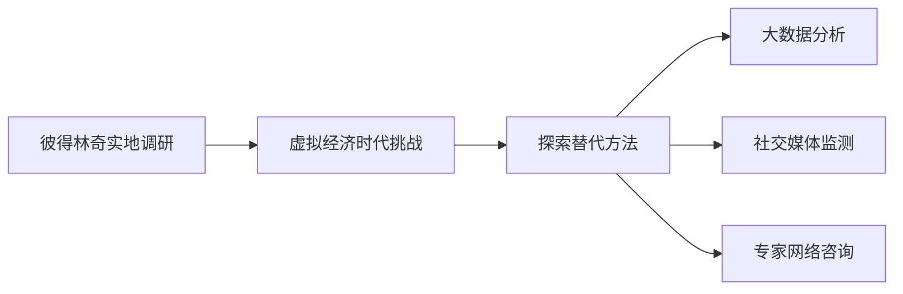

# 彼得林奇的“实地调研”在虚拟经济时代的替代方法探索

> 关键词：彼得林奇、实地调研、虚拟经济时代、替代方法、投资研究

> 摘要：本文聚焦于彼得林奇所倡导的实地调研方法在虚拟经济时代面临的挑战，深入探讨其在新经济环境下的替代方法。首先介绍了彼得林奇实地调研方法的背景及其重要性，接着分析虚拟经济时代的特征对传统实地调研的影响。然后详细阐述了多种可能的替代方法，包括大数据分析、社交媒体监测、专家网络咨询等，并通过具体的算法原理、数学模型和实际案例进行说明。同时，给出了在实际应用中如何运用这些替代方法的建议，推荐了相关的工具和资源。最后总结了未来发展趋势与挑战，解答常见问题，并提供扩展阅读与参考资料，旨在为投资者在虚拟经济时代提供更有效的投资研究途径。

## 1. 背景介绍 
### 1.1 目的和范围
彼得林奇是投资界的传奇人物，他以擅长实地调研而闻名。通过亲自走访公司、与管理层交流、观察市场等方式，他发掘了众多具有潜力的投资机会。然而，随着虚拟经济的快速发展，传统的实地调研方法面临着诸多限制。本文章的目的在于探索在虚拟经济时代，有哪些方法可以替代彼得林奇的实地调研，以满足投资者对准确、及时信息的需求。文章的范围涵盖了虚拟经济时代的主要特征、可能的替代方法、实际应用案例以及相关工具和资源的推荐。

### 1.2 预期读者
本文预期读者主要包括投资者，无论是个人投资者还是机构投资者，他们希望在虚拟经济时代找到更有效的投资研究方法。同时，金融分析师、研究人员以及对投资领域感兴趣的学生也可以从本文中获取有价值的信息。

### 1.3 文档结构概述
本文首先介绍了相关背景知识，包括彼得林奇实地调研的重要性和虚拟经济时代的特点。接着阐述了核心概念，如实地调研和虚拟经济的定义及其联系。然后详细讲解了可能的替代方法的核心算法原理、数学模型，并通过实际案例进行说明。之后介绍了这些替代方法在实际应用场景中的应用。最后推荐了相关的工具和资源，总结了未来发展趋势与挑战，解答常见问题，并提供扩展阅读与参考资料。

### 1.4 术语表
#### 1.4.1 核心术语定义
- **实地调研**：指投资者亲自到公司所在地、生产基地、销售网点等实地场所，与公司管理层、员工、客户等进行面对面交流，观察公司的运营情况、产品特点和市场反应等，以获取第一手信息的调研方法。
- **虚拟经济**：是指相对独立于实体经济的虚拟资本的经济活动。虚拟资本一般指以有价证券形式（如债券、股票）存在的未来预期收益的资本化。虚拟经济以金融系统为主要依托，包括金融市场、金融机构和金融工具等。

#### 1.4.2 相关概念解释
- **大数据分析**：指对海量数据进行采集、存储、管理、分析和可视化等操作，以发现数据中隐藏的模式、趋势和关联，为决策提供支持的技术和方法。
- **社交媒体监测**：通过对社交媒体平台上的用户言论、话题讨论、情绪倾向等进行实时监测和分析，了解公众对特定公司、产品或行业的看法和态度。
- **专家网络咨询**：通过专业的专家网络平台，与相关领域的专家进行沟通和交流，获取他们的专业知识、经验和见解，为投资决策提供参考。

#### 1.4.3 缩略词列表
- **AI**：Artificial Intelligence，人工智能
- **ML**：Machine Learning，机器学习
- **NLP**：Natural Language Processing，自然语言处理

## 2. 核心概念与联系 
### 2.1 彼得林奇的实地调研
彼得林奇认为，实地调研是了解一家公司的最佳方式。通过实地调研，他可以直观地感受公司的文化、管理水平、产品质量和市场竞争力。他会与公司的管理层进行深入交流，了解公司的战略规划、业务发展情况和面临的挑战。同时，他也会与公司的员工、客户和供应商进行沟通，获取不同角度的信息。例如，他会在超市观察消费者对公司产品的购买情况，以了解产品的市场需求和受欢迎程度。

### 2.2 虚拟经济时代的特征
虚拟经济时代具有以下几个主要特征：
- **数字化**：信息的传播和处理主要以数字化形式进行，大量的数据可以通过互联网快速获取和分析。
- **全球化**：经济活动跨越国界，投资者可以更容易地投资于全球范围内的公司和市场。
- **快速变化**：技术创新和市场变化的速度加快，公司的竞争力和市场地位可能在短时间内发生巨大变化。
- **金融创新**：不断涌现的金融产品和工具，如衍生品、加密货币等，增加了投资的复杂性和风险。

### 2.3 两者的联系与冲突
在传统经济时代，实地调研是获取公司信息的重要手段，它可以提供真实、可靠的第一手资料。然而，在虚拟经济时代，传统的实地调研方法面临着一些挑战。一方面，数字化和全球化使得信息的传播更加迅速和广泛，投资者可以通过互联网获取大量的公司信息，实地调研的必要性相对降低。另一方面，快速变化的市场环境使得实地调研的时效性受到影响，投资者可能无法及时了解公司的最新情况。因此，需要探索新的方法来替代或补充传统的实地调研。

### 2.4 核心概念原理和架构的文本示意图
```plaintext
彼得林奇实地调研
        |
        | 面临虚拟经济时代挑战
        |
        | 探索替代方法
        |
        |-- 大数据分析
        |-- 社交媒体监测
        |-- 专家网络咨询
```

### 2.5 Mermaid 流程图


## 3. 核心算法原理 & 具体操作步骤 

### 3.1 大数据分析
#### 3.1.1 算法原理
大数据分析的核心算法包括数据挖掘算法、机器学习算法等。其中，数据挖掘算法用于发现数据中的模式和关联，机器学习算法用于构建预测模型。例如，关联规则挖掘算法可以发现不同产品之间的关联关系，聚类算法可以将客户分为不同的群体，回归算法可以预测公司的销售额和利润等。

以下是一个简单的 Python 代码示例，使用 sklearn 库中的线性回归算法来预测公司的销售额：
```python
import numpy as np
from sklearn.linear_model import LinearRegression

# 假设我们有过去几年的广告投入和销售额数据
advertising_spend = np.array([100, 200, 300, 400, 500]).reshape(-1, 1)
sales = np.array([2000, 3500, 4500, 5500, 6500])

# 创建线性回归模型
model = LinearRegression()

# 训练模型
model.fit(advertising_spend, sales)

# 预测未来的销售额
future_advertising_spend = np.array([600]).reshape(-1, 1)
predicted_sales = model.predict(future_advertising_spend)

print("预测的销售额:", predicted_sales[0])
```
#### 3.1.2 具体操作步骤
1. **数据采集**：从各种数据源收集与公司相关的数据，如财务报表、市场数据、社交媒体数据等。
2. **数据清洗**：对采集到的数据进行清洗，去除噪声、缺失值和异常值。
3. **特征工程**：从清洗后的数据中提取有用的特征，如销售额、利润率、市场份额等。
4. **模型选择和训练**：根据问题的类型选择合适的模型，如线性回归、决策树、神经网络等，并使用训练数据对模型进行训练。
5. **模型评估和优化**：使用测试数据对训练好的模型进行评估，根据评估结果对模型进行优化。
6. **预测和决策**：使用优化后的模型对未来的情况进行预测，并根据预测结果做出投资决策。

### 3.2 社交媒体监测
#### 3.2.1 算法原理
社交媒体监测主要基于自然语言处理（NLP）技术。NLP 算法可以对社交媒体上的文本进行分析，包括情感分析、主题分类、关键词提取等。例如，情感分析算法可以判断用户对某家公司的评价是正面、负面还是中性，主题分类算法可以将用户的言论归类到不同的主题下，关键词提取算法可以提取出文本中的关键信息。

以下是一个简单的 Python 代码示例，使用 TextBlob 库进行情感分析：
```python
from textblob import TextBlob

# 假设我们有一条社交媒体上的评论
comment = "这家公司的产品真的很棒，我非常喜欢！"

# 创建 TextBlob 对象
blob = TextBlob(comment)

# 进行情感分析
sentiment = blob.sentiment.polarity

if sentiment > 0:
    print("正面评价")
elif sentiment < 0:
    print("负面评价")
else:
    print("中性评价")
```
#### 3.2.2 具体操作步骤
1. **数据采集**：使用社交媒体 API 或网络爬虫工具从社交媒体平台上采集与公司相关的文本数据。
2. **数据预处理**：对采集到的文本数据进行预处理，包括去除停用词、词干提取、分词等。
3. **情感分析和主题分类**：使用 NLP 算法对预处理后的文本数据进行情感分析和主题分类。
4. **结果可视化和分析**：将情感分析和主题分类的结果进行可视化，如绘制柱状图、饼图等，并进行深入分析。
5. **决策支持**：根据分析结果，为投资决策提供支持，如判断市场对公司的看法、发现潜在的风险和机会等。

### 3.3 专家网络咨询
#### 3.3.1 算法原理
专家网络咨询主要基于匹配算法和推荐算法。匹配算法用于将投资者的问题与合适的专家进行匹配，推荐算法用于根据投资者的历史行为和偏好，为其推荐相关的专家。例如，基于内容的匹配算法可以根据问题的关键词和专家的专业领域进行匹配，协同过滤推荐算法可以根据投资者和其他投资者的相似性，为其推荐相同或相似领域的专家。

以下是一个简单的 Python 代码示例，使用基于内容的匹配算法进行专家匹配：
```python
# 假设我们有一些专家和他们的专业领域
experts = [
    {"name": "专家 A", "expertise": ["金融", "投资"]},
    {"name": "专家 B", "expertise": ["科技", "互联网"]},
    {"name": "专家 C", "expertise": ["医疗", "制药"]}
]

# 投资者的问题
question = "我想了解一下金融行业的投资机会"

# 提取问题的关键词
keywords = question.split()

# 匹配专家
matched_experts = []
for expert in experts:
    for keyword in keywords:
        if keyword in expert["expertise"]:
            matched_experts.append(expert["name"])
            break

print("匹配的专家:", matched_experts)
```
#### 3.3.2 具体操作步骤
1. **确定问题**：投资者明确自己需要咨询的问题和目标。
2. **选择专家网络平台**：选择一个专业的专家网络平台，如 GLG、AlphaSights 等。
3. **提交问题**：在平台上提交问题，并提供相关的背景信息和要求。
4. **专家匹配和推荐**：平台使用匹配算法和推荐算法为投资者匹配和推荐合适的专家。
5. **与专家沟通**：投资者与推荐的专家进行沟通和交流，可以通过电话、视频会议等方式进行。
6. **获取建议和决策**：根据专家的建议和意见，投资者做出投资决策。

## 4. 数学模型和公式 & 详细讲解 & 举例说明 

### 4.1 大数据分析中的线性回归模型
#### 4.1.1 数学模型和公式
线性回归模型是一种用于预测连续变量的统计模型。其基本形式为：
$$y = \beta_0 + \beta_1x_1 + \beta_2x_2 + \cdots + \beta_nx_n + \epsilon$$
其中，$y$ 是因变量，$x_1, x_2, \cdots, x_n$ 是自变量，$\beta_0, \beta_1, \beta_2, \cdots, \beta_n$ 是回归系数，$\epsilon$ 是误差项。

线性回归的目标是找到一组回归系数 $\beta_0, \beta_1, \beta_2, \cdots, \beta_n$，使得预测值 $\hat{y}$ 与实际值 $y$ 之间的误差最小。常用的误差度量方法是均方误差（MSE）：
$$MSE = \frac{1}{m}\sum_{i=1}^{m}(y_i - \hat{y}_i)^2$$
其中，$m$ 是样本数量，$y_i$ 是第 $i$ 个样本的实际值，$\hat{y}_i$ 是第 $i$ 个样本的预测值。

#### 4.1.2 详细讲解
线性回归模型假设自变量和因变量之间存在线性关系。通过最小化均方误差，可以得到最优的回归系数。在实际应用中，通常使用梯度下降算法或正规方程来求解回归系数。

#### 4.1.3 举例说明
假设我们要预测一家公司的销售额与广告投入之间的关系。我们收集了过去几年的广告投入和销售额数据，如下表所示：
| 广告投入（万元） | 销售额（万元） |
| --- | --- |
| 100 | 2000 |
| 200 | 3500 |
| 300 | 4500 |
| 400 | 5500 |
| 500 | 6500 |

我们可以使用线性回归模型来拟合这些数据，并预测未来的销售额。假设我们使用的线性回归模型为：
$$y = \beta_0 + \beta_1x$$
其中，$y$ 是销售额，$x$ 是广告投入。

通过最小化均方误差，我们可以得到最优的回归系数 $\beta_0$ 和 $\beta_1$。假设我们得到的回归系数为 $\beta_0 = 1500$，$\beta_1 = 10$，则预测模型为：
$$y = 1500 + 10x$$

如果未来的广告投入为 600 万元，则预测的销售额为：
$$y = 1500 + 10\times600 = 7500$$（万元）

### 4.2 社交媒体监测中的情感分析模型
#### 4.2.1 数学模型和公式
情感分析模型通常基于机器学习算法，如朴素贝叶斯分类器、支持向量机等。以朴素贝叶斯分类器为例，其基本原理是基于贝叶斯定理：
$$P(C|D) = \frac{P(D|C)P(C)}{P(D)}$$
其中，$C$ 是类别（如正面、负面、中性），$D$ 是文档（如社交媒体评论），$P(C|D)$ 是给定文档 $D$ 下类别 $C$ 的概率，$P(D|C)$ 是给定类别 $C$ 下文档 $D$ 的概率，$P(C)$ 是类别 $C$ 的先验概率，$P(D)$ 是文档 $D$ 的先验概率。

在情感分析中，我们通常使用朴素贝叶斯分类器来计算文档属于每个类别的概率，并选择概率最大的类别作为文档的情感类别。

#### 4.2.2 详细讲解
朴素贝叶斯分类器假设文档中的每个词都是独立的，即 $P(D|C) = \prod_{i=1}^{n}P(w_i|C)$，其中 $w_i$ 是文档 $D$ 中的第 $i$ 个词。通过计算每个类别的先验概率 $P(C)$ 和每个词在每个类别下的条件概率 $P(w_i|C)$，可以得到文档属于每个类别的概率 $P(C|D)$。

#### 4.2.3 举例说明
假设我们有一个社交媒体评论数据集，其中包含正面评论和负面评论。我们使用朴素贝叶斯分类器来训练一个情感分析模型。

首先，我们对数据集进行预处理，包括分词、去除停用词等。然后，我们计算每个类别的先验概率和每个词在每个类别下的条件概率。

假设我们有一个新的社交媒体评论：“这家公司的产品真的很差，我再也不会买了！”

我们将该评论进行预处理，并计算该评论属于正面和负面类别的概率。假设计算得到的正面类别的概率为 0.2，负面类别的概率为 0.8，则我们可以判断该评论为负面评论。

### 4.3 专家网络咨询中的匹配算法
#### 4.3.1 数学模型和公式
专家网络咨询中的匹配算法通常基于相似度计算。常用的相似度计算方法包括余弦相似度、欧几里得距离等。以余弦相似度为例，其计算公式为：
$$cos(\theta) = \frac{\vec{A}\cdot\vec{B}}{\|\vec{A}\|\|\vec{B}\|}$$
其中，$\vec{A}$ 和 $\vec{B}$ 是两个向量，$\vec{A}\cdot\vec{B}$ 是向量 $\vec{A}$ 和 $\vec{B}$ 的点积，$\|\vec{A}\|$ 和 $\|\vec{B}\|$ 分别是向量 $\vec{A}$ 和 $\vec{B}$ 的模。

在专家网络咨询中，我们可以将投资者的问题和专家的专业领域表示为向量，然后计算它们之间的余弦相似度。相似度越高，说明专家与问题的匹配度越高。

#### 4.3.2 详细讲解
余弦相似度用于衡量两个向量之间的夹角余弦值，其取值范围为 $[-1, 1]$。当余弦相似度为 1 时，说明两个向量完全相同；当余弦相似度为 -1 时，说明两个向量完全相反；当余弦相似度为 0 时，说明两个向量正交。

在专家网络咨询中，我们可以将投资者的问题和专家的专业领域表示为词向量，然后计算它们之间的余弦相似度。通过设定一个相似度阈值，我们可以筛选出与问题匹配度较高的专家。

#### 4.3.3 举例说明
假设我们有投资者的问题和专家的专业领域如下：
- 投资者的问题：“我想了解一下金融行业的投资机会”
- 专家 A 的专业领域：“金融、投资”
- 专家 B 的专业领域：“科技、互联网”

我们将问题和专业领域表示为词向量：
- 问题向量：$\vec{Q} = [1, 1, 0, 0]$
- 专家 A 的专业领域向量：$\vec{A} = [1, 1, 0, 0]$
- 专家 B 的专业领域向量：$\vec{B} = [0, 0, 1, 1]$

计算问题向量与专家 A 的专业领域向量的余弦相似度：
$$cos(\theta_A) = \frac{\vec{Q}\cdot\vec{A}}{\|\vec{Q}\|\|\vec{A}\|} = \frac{1\times1 + 1\times1 + 0\times0 + 0\times0}{\sqrt{1^2 + 1^2 + 0^2 + 0^2}\sqrt{1^2 + 1^2 + 0^2 + 0^2}} = 1$$

计算问题向量与专家 B 的专业领域向量的余弦相似度：
$$cos(\theta_B) = \frac{\vec{Q}\cdot\vec{B}}{\|\vec{Q}\|\|\vec{B}\|} = \frac{1\times0 + 1\times0 + 0\times1 + 0\times1}{\sqrt{1^2 + 1^2 + 0^2 + 0^2}\sqrt{0^2 + 0^2 + 1^2 + 1^2}} = 0$$

由于专家 A 的余弦相似度为 1，专家 B 的余弦相似度为 0，因此我们可以判断专家 A 与问题的匹配度更高。

## 5. 项目实战：代码实际案例和详细解释说明 

### 5.1  开发环境搭建
#### 5.1.1 安装 Python
首先，我们需要安装 Python 编程语言。可以从 Python 官方网站（https://www.python.org/downloads/）下载适合自己操作系统的 Python 版本，并按照安装向导进行安装。

#### 5.1.2 安装必要的库
在 Python 环境中，我们需要安装一些必要的库，如 pandas、numpy、sklearn、textblob 等。可以使用 pip 命令进行安装：
```sh
pip install pandas numpy sklearn textblob
```

### 5.2  源代码详细实现和代码解读
#### 5.2.1 大数据分析案例：预测公司销售额
```python
import pandas as pd
import numpy as np
from sklearn.linear_model import LinearRegression
import matplotlib.pyplot as plt

# 读取数据
data = pd.read_csv('sales_data.csv')

# 提取特征和目标变量
X = data[['Advertising Spend']].values
y = data['Sales'].values

# 创建线性回归模型
model = LinearRegression()

# 训练模型
model.fit(X, y)

# 预测未来的销售额
future_advertising_spend = np.array([[600]])
predicted_sales = model.predict(future_advertising_spend)

print("预测的销售额:", predicted_sales[0])

# 可视化结果
plt.scatter(X, y, color='blue')
plt.plot(X, model.predict(X), color='red')
plt.xlabel('广告投入')
plt.ylabel('销售额')
plt.title('广告投入与销售额的关系')
plt.show()
```
**代码解读**：
1. **数据读取**：使用 pandas 库的 `read_csv` 函数读取包含广告投入和销售额数据的 CSV 文件。
2. **特征提取**：从数据中提取广告投入作为特征变量 $X$，销售额作为目标变量 $y$。
3. **模型创建和训练**：使用 sklearn 库的 `LinearRegression` 类创建线性回归模型，并使用 `fit` 方法对模型进行训练。
4. **预测**：使用训练好的模型对未来的广告投入进行预测，并输出预测结果。
5. **可视化**：使用 matplotlib 库绘制散点图和回归直线，直观地展示广告投入与销售额之间的关系。

#### 5.2.2 社交媒体监测案例：情感分析
```python
import pandas as pd
from textblob import TextBlob

# 读取社交媒体评论数据
data = pd.read_csv('social_media_comments.csv')

# 进行情感分析
sentiments = []
for comment in data['Comment']:
    blob = TextBlob(comment)
    sentiment = blob.sentiment.polarity
    if sentiment > 0:
        sentiments.append('正面评价')
    elif sentiment < 0:
        sentiments.append('负面评价')
    else:
        sentiments.append('中性评价')

# 将情感分析结果添加到数据中
data['Sentiment'] = sentiments

# 保存结果
data.to_csv('social_media_comments_with_sentiment.csv', index=False)
```
**代码解读**：
1. **数据读取**：使用 pandas 库的 `read_csv` 函数读取包含社交媒体评论的 CSV 文件。
2. **情感分析**：遍历每条评论，使用 TextBlob 库进行情感分析，并根据情感极性判断评论的情感类别。
3. **结果保存**：将情感分析结果添加到原始数据中，并保存为新的 CSV 文件。

#### 5.2.3 专家网络咨询案例：专家匹配
```python
import pandas as pd

# 读取专家信息和投资者问题
experts = pd.read_csv('experts.csv')
question = "我想了解一下金融行业的投资机会"

# 提取问题的关键词
keywords = question.split()

# 匹配专家
matched_experts = []
for index, expert in experts.iterrows():
    expertise = expert['Expertise'].split(',')
    for keyword in keywords:
        if keyword in expertise:
            matched_experts.append(expert['Name'])
            break

print("匹配的专家:", matched_experts)
```
**代码解读**：
1. **数据读取**：使用 pandas 库的 `read_csv` 函数读取包含专家信息和投资者问题的 CSV 文件。
2. **关键词提取**：将投资者的问题进行分词，提取关键词。
3. **专家匹配**：遍历每个专家的专业领域，判断关键词是否在专业领域中，如果是，则将该专家添加到匹配列表中。
4. **输出结果**：输出匹配的专家列表。

### 5.3  代码解读与分析
#### 5.3.1 大数据分析案例
在大数据分析案例中，我们使用线性回归模型对公司的销售额进行预测。线性回归模型是一种简单而有效的预测模型，适用于自变量和因变量之间存在线性关系的情况。通过对历史数据的学习，模型可以找到自变量和因变量之间的最佳拟合直线，从而对未来的情况进行预测。

#### 5.3.2 社交媒体监测案例
在社交媒体监测案例中，我们使用 TextBlob 库进行情感分析。TextBlob 是一个简单易用的 Python 库，提供了丰富的自然语言处理功能，如分词、词性标注、情感分析等。通过对社交媒体评论的情感分析，我们可以了解公众对公司的看法和态度，为投资决策提供参考。

#### 5.3.3 专家网络咨询案例
在专家网络咨询案例中，我们使用基于关键词匹配的方法进行专家匹配。这种方法简单直观，适用于专家专业领域和投资者问题可以用关键词表示的情况。通过匹配关键词，我们可以快速找到与问题相关的专家，提高咨询效率。

## 6. 实际应用场景 
### 6.1 股票投资
在股票投资中，投资者可以使用大数据分析来预测公司的财务状况和业绩，通过社交媒体监测了解市场对公司的看法和情绪，利用专家网络咨询获取行业专家的意见和建议。例如，通过分析公司的财务报表、市场数据和社交媒体数据，投资者可以判断公司的竞争力和发展前景，从而做出投资决策。

### 6.2 基金投资
基金投资者可以使用大数据分析来评估基金的业绩和风险，通过社交媒体监测了解基金经理的声誉和市场口碑，利用专家网络咨询获取基金行业专家的分析和建议。例如，通过分析基金的历史业绩、持仓情况和投资者评论，投资者可以选择适合自己的基金产品。

### 6.3 风险投资
风险投资家可以使用大数据分析来筛选有潜力的创业项目，通过社交媒体监测了解创业团队的影响力和市场反馈，利用专家网络咨询获取行业专家对创业项目的评估和建议。例如，通过分析创业项目的商业模式、市场规模和技术创新能力，风险投资家可以判断项目的投资价值和风险。

### 6.4 企业并购
在企业并购中，收购方可以使用大数据分析来评估目标企业的价值和财务状况，通过社交媒体监测了解目标企业的市场形象和声誉，利用专家网络咨询获取行业专家对并购交易的意见和建议。例如，通过分析目标企业的财务报表、市场数据和社交媒体数据，收购方可以确定合理的收购价格和交易方案。

## 7. 工具和资源推荐
### 7.1 学习资源推荐
#### 7.1.1 书籍推荐
- 《Python 数据分析实战》：本书介绍了使用 Python 进行数据分析的基本方法和技巧，包括数据采集、清洗、分析和可视化等方面的内容。
- 《自然语言处理入门》：本书系统地介绍了自然语言处理的基本概念、算法和应用，适合初学者入门。
- 《机器学习实战》：本书通过实际案例介绍了机器学习的基本算法和应用，包括分类、回归、聚类等方面的内容。

#### 7.1.2 在线课程
- Coursera 上的“Python for Data Science”：该课程由密歇根大学开设，介绍了使用 Python 进行数据分析的基本方法和工具。
- edX 上的“Natural Language Processing”：该课程由哥伦比亚大学开设，系统地介绍了自然语言处理的基本概念、算法和应用。
- Udemy 上的“Machine Learning A-Z™: Hands-On Python & R In Data Science”：该课程介绍了使用 Python 和 R 进行机器学习的基本方法和算法，适合初学者和有一定基础的学习者。

#### 7.1.3 技术博客和网站
- Towards Data Science：该网站是一个专注于数据科学和机器学习的技术博客，提供了大量的优质文章和教程。
- KDnuggets：该网站是一个数据科学和机器学习领域的知名网站，提供了最新的行业动态、技术文章和工具资源。
- Analytics Vidhya：该网站是一个专注于数据分析和机器学习的技术社区，提供了丰富的教程、案例和竞赛资源。

### 7.2 开发工具框架推荐
#### 7.2.1 IDE和编辑器
- PyCharm：是一款专业的 Python 集成开发环境，提供了丰富的代码编辑、调试和分析功能。
- Jupyter Notebook：是一个基于网页的交互式计算环境，适合进行数据分析和机器学习实验。
- Visual Studio Code：是一款轻量级的代码编辑器，支持多种编程语言和插件扩展，适合快速开发和调试。

#### 7.2.2 调试和性能分析工具
- pdb：是 Python 自带的调试工具，可以帮助开发者在代码中设置断点、单步执行和查看变量值等。
- cProfile：是 Python 自带的性能分析工具，可以帮助开发者分析代码的性能瓶颈和运行时间。
- Py-Spy：是一个用于分析 Python 程序性能的工具，可以实时监测程序的 CPU 使用情况和函数调用栈。

#### 7.2.3 相关框架和库
- pandas：是一个用于数据处理和分析的 Python 库，提供了丰富的数据结构和数据操作方法。
- numpy：是一个用于科学计算的 Python 库，提供了高效的数组操作和数学函数。
- sklearn：是一个用于机器学习的 Python 库，提供了丰富的机器学习算法和工具。
- TextBlob：是一个用于自然语言处理的 Python 库，提供了简单易用的文本处理和情感分析功能。

### 7.3 相关论文著作推荐
#### 7.3.1 经典论文
- “The Elements of Statistical Learning”：本书是统计学和机器学习领域的经典著作，系统地介绍了统计学习的基本理论和方法。
- “Pattern Recognition and Machine Learning”：本书是模式识别和机器学习领域的经典著作，介绍了模式识别和机器学习的基本概念、算法和应用。
- “Natural Language Processing with Python”：本书是自然语言处理领域的经典著作，介绍了使用 Python 进行自然语言处理的基本方法和技术。

#### 7.3.2 最新研究成果
- ACL Anthology：是自然语言处理领域的重要学术资源，收录了大量的自然语言处理会议和期刊论文。
- arXiv：是一个预印本服务器，提供了各个领域的最新研究成果和论文。
- IEEE Xplore：是电气和电子工程师协会（IEEE）的数字图书馆，收录了大量的计算机科学、电子工程等领域的研究论文。

#### 7.3.3 应用案例分析
- Harvard Business Review：是哈佛商学院出版的商业管理杂志，提供了大量的商业案例分析和管理经验分享。
- McKinsey Quarterly：是麦肯锡公司出版的商业管理杂志，提供了最新的商业趋势分析和企业管理案例。
- Forbes：是一家知名的商业媒体，提供了各种行业的商业新闻、分析和案例。

## 8. 总结：未来发展趋势与挑战
### 8.1 未来发展趋势
- **技术融合**：大数据分析、人工智能、区块链等技术将与投资研究深度融合，为投资者提供更全面、准确的信息和决策支持。
- **个性化服务**：根据投资者的风险偏好、投资目标和历史行为，提供个性化的投资研究和咨询服务。
- **全球化投资**：随着全球经济的一体化和金融市场的互联互通，投资者将更加关注全球范围内的投资机会，需要更强大的投资研究工具和方法。
- **社会责任投资**：投资者将越来越关注企业的社会责任和可持续发展，投资研究将更加注重对企业的环境、社会和治理（ESG）因素的评估。

### 8.2 挑战
- **数据质量和安全**：大数据分析依赖于大量的数据，但数据质量和安全问题可能会影响分析结果的准确性和可靠性。投资者需要采取有效的措施来确保数据的质量和安全。
- **算法解释性**：人工智能算法通常是黑盒模型，难以解释其决策过程和结果。投资者需要了解算法的工作原理和局限性，以便做出合理的决策。
- **人才短缺**：虚拟经济时代的投资研究需要具备跨学科知识和技能的人才，如数据科学、人工智能、金融等领域的专业人才。目前，这类人才相对短缺，需要加强培养和引进。
- **法律法规和监管**：随着新技术的应用和金融创新的发展，相关的法律法规和监管政策可能会滞后。投资者需要关注法律法规的变化，遵守监管要求，防范法律风险。

## 9. 附录：常见问题与解答
### 9.1 大数据分析的结果一定准确吗？
大数据分析的结果并不一定准确，其准确性受到多种因素的影响，如数据质量、算法选择、模型参数等。在进行大数据分析时，需要对数据进行清洗和预处理，选择合适的算法和模型，并进行充分的验证和评估，以提高分析结果的准确性。

### 9.2 社交媒体监测的结果可靠吗？
社交媒体监测的结果具有一定的参考价值，但也存在一定的局限性。社交媒体上的言论可能存在虚假、误导性信息，而且用户的表达可能不够准确和客观。因此，在使用社交媒体监测结果时，需要进行综合分析和判断，并结合其他信息来源进行验证。

### 9.3 专家网络咨询的费用高吗？
专家网络咨询的费用因专家的知名度、专业领域、咨询时间等因素而异。一般来说，知名专家和热门领域的咨询费用相对较高。投资者可以根据自己的需求和预算选择合适的专家和咨询方式。

### 9.4 如何选择适合自己的投资研究方法？
投资者可以根据自己的投资目标、风险偏好、投资经验和资源等因素选择适合自己的投资研究方法。如果投资者注重基本面分析，可以选择大数据分析和专家网络咨询等方法；如果投资者关注市场情绪和热点，可以选择社交媒体监测等方法。同时，投资者也可以结合多种方法进行综合分析，以提高投资决策的准确性和可靠性。

## 10. 扩展阅读 & 参考资料
### 10.1 扩展阅读
- 《聪明的投资者》：本杰明·格雷厄姆著，是价值投资领域的经典著作，介绍了价值投资的基本理念和方法。
- 《金融炼金术》：乔治·索罗斯著，探讨了金融市场的运行规律和投资者的心理行为。
- 《原则》：瑞·达利欧著，分享了作者在投资和生活中的原则和经验。

### 10.2 参考资料
- 《彼得·林奇的成功投资》：彼得·林奇著，介绍了彼得·林奇的投资理念和方法，包括实地调研的重要性和技巧。
- 《Python 数据科学手册》：Jake VanderPlas 著，系统地介绍了使用 Python 进行数据科学研究的方法和工具。
- 《自然语言处理实战：基于 Python 和深度学习》：Hobson Lane 等著，介绍了使用 Python 和深度学习进行自然语言处理的方法和应用。

作者：AI天才研究院/AI Genius Institute & 禅与计算机程序设计艺术 /Zen And The Art of Computer Programming