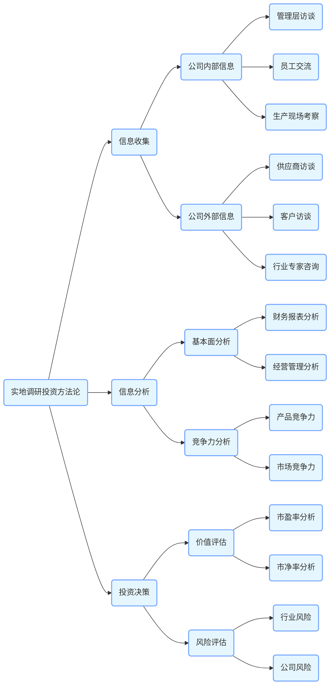

# 彼得林奇的"实地调研"投资方法论

> 关键词：彼得林奇、实地调研、投资方法论、股票投资、基本面分析

> 摘要：本文深入探讨了彼得林奇的“实地调研”投资方法论。首先介绍了该方法论的背景，包括其目的、适用读者群体、文档结构和相关术语。接着阐述了核心概念及联系，通过文本示意图和Mermaid流程图展示。详细讲解了核心算法原理及操作步骤，用Python代码辅助说明。对其中涉及的数学模型和公式进行了深入解读并举例。通过项目实战案例展示了如何应用该方法论，包括开发环境搭建、源代码实现与解读。分析了该方法论在实际中的应用场景，推荐了学习、开发工具等相关资源。最后总结了其未来发展趋势与挑战，还给出了常见问题解答和扩展阅读参考资料，旨在帮助投资者深入理解和运用彼得林奇的实地调研投资方法。

## 1. 背景介绍 
### 1.1 目的和范围
彼得林奇是投资界的传奇人物，他管理的麦哲伦基金创造了惊人的业绩。其“实地调研”投资方法论旨在通过对公司进行实地考察和研究，挖掘具有投资价值的股票。本文的目的是详细剖析这一方法论，揭示其原理、操作步骤和实际应用，帮助投资者更好地理解和运用该方法进行股票投资。范围涵盖了该方法论的核心概念、算法原理、数学模型、实际案例以及相关的工具和资源等方面。

### 1.2 预期读者
本文预期读者主要包括股票投资者、金融从业者、投资爱好者以及对价值投资感兴趣的人群。无论是初涉投资领域的新手，还是有一定经验的专业投资者，都能从本文中获取有价值的信息，提升自己的投资能力和决策水平。

### 1.3 文档结构概述
本文首先介绍背景信息，让读者了解“实地调研”投资方法论的重要性和适用对象。接着阐述核心概念及联系，帮助读者建立起该方法论的整体框架。然后详细讲解核心算法原理和操作步骤，并用Python代码进行说明。对其中涉及的数学模型和公式进行深入分析和举例。通过项目实战案例展示该方法论的实际应用过程。分析其在不同场景下的应用。推荐相关的学习资源、开发工具和论文著作。最后总结未来发展趋势与挑战，给出常见问题解答和扩展阅读参考资料。

### 1.4 术语表
#### 1.4.1 核心术语定义
- **实地调研**：投资者亲自到公司所在地、生产基地、销售网点等实地场所，与公司管理层、员工、供应商、客户等进行交流，了解公司的经营状况、市场竞争力、行业发展趋势等信息的过程。
- **基本面分析**：通过对公司的财务报表、经营管理、行业地位等基本情况进行分析，评估公司的内在价值和投资潜力的方法。
- **成长股**：指那些销售额和利润额持续增长，且增长速度快于整个经济发展速度和同行业平均水平的公司股票。
- **市盈率（P/E）**：指股票价格除以每股收益（EPS）的比率，反映了市场对公司未来盈利的预期。
- **市净率（P/B）**：指股票价格除以每股净资产的比率，用于评估公司的市场价值与账面价值的关系。

#### 1.4.2 相关概念解释
- **价值投资**：一种投资理念，强调通过分析公司的基本面，寻找被市场低估的股票，长期持有以获取价值回归带来的收益。
- **行业分析**：对特定行业的市场规模、竞争格局、发展趋势等进行研究，了解行业的整体状况和发展前景，为投资决策提供参考。
- **财务报表分析**：对公司的资产负债表、利润表、现金流量表等财务报表进行分析，评估公司的财务状况、盈利能力、偿债能力等。

#### 1.4.3 缩略词列表
- **EPS**：Earnings Per Share，每股收益
- **P/E**：Price-to-Earnings Ratio，市盈率
- **P/B**：Price-to-Book Ratio，市净率

## 2. 核心概念与联系 
### 核心概念原理
彼得林奇的“实地调研”投资方法论基于一个核心观点：通过实地考察和与公司相关人员的交流，可以获取到比公开信息更深入、更真实的公司情况。实地调研可以帮助投资者了解公司的产品质量、市场需求、管理水平、竞争优势等方面的信息，从而更准确地评估公司的内在价值和投资潜力。

该方法论强调基本面分析，认为公司的内在价值是由其盈利能力、资产质量、现金流等基本面因素决定的。通过实地调研，投资者可以验证公司财务报表的真实性，发现公司的潜在问题和机会，从而做出更明智的投资决策。

### 架构的文本示意图
```plaintext
实地调研投资方法论
|-- 信息收集
|   |-- 公司内部信息
|   |   |-- 管理层访谈
|   |   |-- 员工交流
|   |   |-- 生产现场考察
|   |-- 公司外部信息
|   |   |-- 供应商访谈
|   |   |-- 客户访谈
|   |   |-- 行业专家咨询
|-- 信息分析
|   |-- 基本面分析
|   |   |-- 财务报表分析
|   |   |-- 经营管理分析
|   |-- 竞争力分析
|   |   |-- 产品竞争力
|   |   |-- 市场竞争力
|-- 投资决策
|   |-- 价值评估
|   |   |-- 市盈率分析
|   |   |-- 市净率分析
|   |-- 风险评估
|   |   |-- 行业风险
|   |   |-- 公司风险
```

### Mermaid流程图


## 3. 核心算法原理 & 具体操作步骤 
### 核心算法原理
彼得林奇的“实地调研”投资方法论并没有严格意义上的数学算法，但可以用一些指标和方法来辅助投资决策。以下是一个简化的投资决策算法思路：

1. **信息收集**：通过实地调研收集公司的各种信息，包括财务数据、经营情况、市场竞争力等。
2. **基本面分析**：对收集到的信息进行分析，计算一些关键指标，如市盈率、市净率、净资产收益率等，评估公司的基本面状况。
3. **价值评估**：根据基本面分析的结果，结合行业平均水平和市场情况，评估公司的内在价值。
4. **风险评估**：考虑行业风险、公司风险等因素，对投资风险进行评估。
5. **投资决策**：综合价值评估和风险评估的结果，决定是否投资该公司股票。

### 具体操作步骤
#### 步骤1：确定调研目标公司
投资者首先需要根据自己的投资策略和兴趣，确定要调研的目标公司。可以从行业研究、新闻报道、朋友推荐等渠道获取潜在的目标公司名单。

#### 步骤2：收集公司公开信息
在进行实地调研之前，投资者需要收集目标公司的公开信息，包括财务报表、年报、公告、新闻报道等。这些信息可以帮助投资者对公司有一个初步的了解，为实地调研做好准备。

#### 步骤3：实地调研
- **公司内部调研**：
    - **管理层访谈**：与公司的高层管理人员进行交流，了解公司的战略规划、经营理念、发展目标等。
    - **员工交流**：与公司的普通员工进行交流，了解公司的企业文化、工作氛围、员工满意度等。
    - **生产现场考察**：参观公司的生产基地、工厂等，了解公司的生产流程、设备状况、产品质量等。
- **公司外部调研**：
    - **供应商访谈**：与公司的供应商进行交流，了解公司的采购政策、信用状况、供应链稳定性等。
    - **客户访谈**：与公司的客户进行交流，了解公司的产品质量、服务水平、市场口碑等。
    - **行业专家咨询**：咨询行业内的专家、学者或分析师，了解行业的发展趋势、竞争格局、技术创新等。

#### 步骤4：信息分析
- **基本面分析**：
    - **财务报表分析**：对公司的资产负债表、利润表、现金流量表等财务报表进行分析，计算关键指标，如市盈率、市净率、净资产收益率、毛利率、净利率等，评估公司的财务状况和盈利能力。
    - **经营管理分析**：分析公司的经营模式、管理团队、市场营销策略等，评估公司的经营管理水平。
- **竞争力分析**：
    - **产品竞争力**：分析公司的产品特点、技术含量、质量水平、品牌影响力等，评估公司产品的市场竞争力。
    - **市场竞争力**：分析公司的市场份额、市场定位、竞争对手等，评估公司在市场中的竞争地位。

#### 步骤5：价值评估
根据基本面分析和竞争力分析的结果，结合行业平均水平和市场情况，评估公司的内在价值。可以采用市盈率法、市净率法、现金流折现法等方法进行价值评估。

#### 步骤6：风险评估
考虑行业风险、公司风险等因素，对投资风险进行评估。行业风险包括行业周期性、政策变化、技术创新等；公司风险包括经营风险、财务风险、管理风险等。

#### 步骤7：投资决策
综合价值评估和风险评估的结果，决定是否投资该公司股票。如果公司的内在价值被低估，且投资风险在可承受范围内，则可以考虑买入该公司股票；反之，则应谨慎投资或放弃投资。

### Python源代码示例
```python
import pandas as pd

# 示例财务数据
financial_data = {
    '营业收入': [1000, 1200, 1500],
    '净利润': [100, 120, 150],
    '总资产': [5000, 5500, 6000],
    '净资产': [2000, 2200, 2500]
}

# 创建DataFrame
df = pd.DataFrame(financial_data)

# 计算关键指标
df['市盈率'] = df['营业收入'] / df['净利润']
df['市净率'] = df['营业收入'] / df['净资产']
df['净资产收益率'] = df['净利润'] / df['净资产']

print(df)
```
### 代码解释
这段代码使用Python的`pandas`库对示例财务数据进行处理，计算了市盈率、市净率和净资产收益率等关键指标。具体步骤如下：
1. 定义一个包含营业收入、净利润、总资产和净资产的字典`financial_data`。
2. 使用`pandas`的`DataFrame`函数将字典转换为数据框`df`。
3. 计算市盈率、市净率和净资产收益率，并将结果添加到数据框中。
4. 打印计算结果。

## 4. 数学模型和公式 & 详细讲解 & 举例说明 
### 市盈率（P/E）
#### 公式
$$P/E = \frac{股票价格}{每股收益}$$

#### 详细讲解
市盈率是衡量股票估值的常用指标之一，它反映了市场对公司未来盈利的预期。一般来说，市盈率越高，说明市场对公司未来盈利的预期越高，但也可能意味着股票被高估；市盈率越低，说明市场对公司未来盈利的预期越低，但也可能意味着股票被低估。

#### 举例说明
假设某公司的股票价格为20元，每股收益为1元，则该公司的市盈率为：
$$P/E = \frac{20}{1} = 20$$
这意味着投资者愿意为该公司每1元的盈利支付20元的价格。如果同行业的平均市盈率为15，则该公司的股票可能被高估；如果同行业的平均市盈率为25，则该公司的股票可能被低估。

### 市净率（P/B）
#### 公式
$$P/B = \frac{股票价格}{每股净资产}$$

#### 详细讲解
市净率是衡量股票估值的另一个重要指标，它反映了市场对公司净资产的估值。一般来说，市净率越高，说明市场对公司净资产的估值越高，但也可能意味着股票被高估；市净率越低，说明市场对公司净资产的估值越低，但也可能意味着股票被低估。

#### 举例说明
假设某公司的股票价格为10元，每股净资产为5元，则该公司的市净率为：
$$P/B = \frac{10}{5} = 2$$
这意味着投资者愿意为该公司每1元的净资产支付2元的价格。如果同行业的平均市净率为1.5，则该公司的股票可能被高估；如果同行业的平均市净率为2.5，则该公司的股票可能被低估。

### 净资产收益率（ROE）
#### 公式
$$ROE = \frac{净利润}{净资产} \times 100\%$$

#### 详细讲解
净资产收益率是衡量公司盈利能力的重要指标，它反映了公司运用自有资本获取收益的能力。一般来说，净资产收益率越高，说明公司的盈利能力越强；净资产收益率越低，说明公司的盈利能力越弱。

#### 举例说明
假设某公司的净利润为100万元，净资产为500万元，则该公司的净资产收益率为：
$$ROE = \frac{100}{500} \times 100\% = 20\%$$
这意味着该公司每1元的净资产可以创造0.2元的净利润。如果同行业的平均净资产收益率为15%，则该公司的盈利能力较强；如果同行业的平均净资产收益率为25%，则该公司的盈利能力较弱。

## 5. 项目实战：代码实际案例和详细解释说明 
### 5.1  开发环境搭建
#### 安装Python
首先需要安装Python，可以从Python官方网站（https://www.python.org/downloads/）下载适合自己操作系统的Python版本，并按照安装向导进行安装。

#### 安装必要的库
在进行股票投资分析时，需要使用一些Python库，如`pandas`、`numpy`、`matplotlib`等。可以使用`pip`命令进行安装：
```sh
pip install pandas numpy matplotlib
```

### 5.2  源代码详细实现和代码解读
```python
import pandas as pd
import matplotlib.pyplot as plt

# 读取财务数据文件（假设文件名为financial_data.csv）
data = pd.read_csv('financial_data.csv')

# 计算关键指标
data['市盈率'] = data['股票价格'] / data['每股收益']
data['市净率'] = data['股票价格'] / data['每股净资产']
data['净资产收益率'] = data['净利润'] / data['净资产']

# 绘制市盈率、市净率和净资产收益率的折线图
plt.figure(figsize=(12, 8))
plt.subplot(3, 1, 1)
plt.plot(data['日期'], data['市盈率'])
plt.title('市盈率')
plt.ylabel('市盈率')

plt.subplot(3, 1, 2)
plt.plot(data['日期'], data['市净率'])
plt.title('市净率')
plt.ylabel('市净率')

plt.subplot(3, 1, 3)
plt.plot(data['日期'], data['净资产收益率'])
plt.title('净资产收益率')
plt.ylabel('净资产收益率')
plt.xlabel('日期')

plt.tight_layout()
plt.show()
```

### 5.3  代码解读与分析
#### 代码功能
这段代码的主要功能是读取财务数据文件，计算市盈率、市净率和净资产收益率等关键指标，并绘制这些指标随时间变化的折线图。

#### 代码详细解读
1. **导入必要的库**：导入`pandas`和`matplotlib.pyplot`库，分别用于数据处理和绘图。
2. **读取财务数据文件**：使用`pandas`的`read_csv`函数读取财务数据文件`financial_data.csv`，并将数据存储在`data`变量中。
3. **计算关键指标**：根据公式计算市盈率、市净率和净资产收益率，并将结果添加到`data`数据框中。
4. **绘制折线图**：使用`matplotlib.pyplot`的`subplot`函数创建3个子图，分别绘制市盈率、市净率和净资产收益率随时间变化的折线图。
5. **显示图形**：使用`plt.show()`函数显示绘制好的图形。

#### 代码分析
通过绘制折线图，投资者可以直观地观察到公司的市盈率、市净率和净资产收益率随时间的变化趋势，从而更好地评估公司的估值和盈利能力。同时，投资者可以根据这些指标的变化情况，结合实地调研的结果，做出更明智的投资决策。

## 6. 实际应用场景 
### 成长股投资
彼得林奇的“实地调研”投资方法论非常适合成长股投资。成长股通常具有较高的业绩增长潜力，但市场对其未来盈利的预期也较高，因此股价波动较大。通过实地调研，投资者可以深入了解成长股公司的业务模式、技术创新能力、市场竞争力等方面的情况，评估其业绩增长的可持续性，从而挖掘出具有投资价值的成长股。

### 困境反转股投资
困境反转股是指那些由于短期困境而导致股价大幅下跌，但公司基本面仍然良好，有望在未来实现业绩反转的股票。实地调研可以帮助投资者了解困境反转股公司的困境原因、管理层的应对措施、公司的潜在价值等方面的情况，判断公司是否有能力实现困境反转，从而抓住投资机会。

### 行业分析和投资
实地调研还可以用于行业分析和投资。通过对行业内不同公司的实地调研，投资者可以了解行业的竞争格局、发展趋势、技术创新等方面的情况，评估行业的整体投资价值。同时，投资者可以根据实地调研的结果，选择行业内具有竞争优势的公司进行投资。

## 7. 工具和资源推荐
### 7.1 学习资源推荐
#### 7.1.1 书籍推荐
- 《彼得·林奇的成功投资》：彼得·林奇的经典著作，详细介绍了他的投资理念、方法和实践经验。
- 《战胜华尔街》：彼得·林奇的另一本重要著作，分享了他在麦哲伦基金的投资经历和成功案例。
- 《聪明的投资者》：本杰明·格雷厄姆的经典著作，被誉为价值投资的圣经，对彼得林奇的投资理念产生了重要影响。

#### 7.1.2 在线课程
- Coursera上的“投资学原理”：由知名教授授课，系统介绍了投资学的基本原理和方法。
- edX上的“金融市场”：涵盖了金融市场的各个方面，包括股票市场、债券市场、衍生品市场等。
- 中国大学MOOC上的“证券投资学”：国内高校教授授课，结合中国市场实际情况，介绍了证券投资的理论和实践。

#### 7.1.3 技术博客和网站
- 雪球网：国内知名的投资社区，提供股票行情、财经新闻、投资分析等服务，投资者可以在上面交流投资经验和观点。
- 东方财富网：国内领先的财经门户网站，提供丰富的财经资讯、股票数据、研究报告等资源。
- Seeking Alpha：国外知名的投资研究网站，提供全球股票市场的分析和评论，许多专业投资者和分析师会在上面发表自己的观点。

### 7.2 开发工具框架推荐
#### 7.2.1 IDE和编辑器
- PyCharm：一款专业的Python集成开发环境，提供代码编辑、调试、版本控制等功能，适合开发Python程序。
- Jupyter Notebook：一种交互式的开发环境，支持Python、R等多种编程语言，适合进行数据分析和可视化。
- Visual Studio Code：一款轻量级的代码编辑器，支持多种编程语言和插件扩展，适合快速开发和调试。

#### 7.2.2 调试和性能分析工具
- pdb：Python自带的调试工具，可以帮助开发者定位和解决代码中的问题。
- cProfile：Python标准库中的性能分析工具，可以分析代码的执行时间和调用关系，帮助开发者优化代码性能。
- Py-Spy：一款轻量级的Python性能分析工具，可以实时监测Python程序的性能，找出性能瓶颈。

#### 7.2.3 相关框架和库
- pandas：Python中用于数据处理和分析的库，提供了高效的数据结构和数据操作方法。
- numpy：Python中用于科学计算的库，提供了多维数组和矩阵运算等功能。
- matplotlib：Python中用于数据可视化的库，提供了丰富的绘图函数和工具。

### 7.3 相关论文著作推荐
#### 7.3.1 经典论文
- “The Random Walk Hypothesis”：有效市场假说的经典论文，探讨了股票价格的随机游走特性。
- “Capital Asset Pricing Model”：资本资产定价模型的经典论文，提出了风险与收益的关系。
- “Value Investing: The Use of Historical Financial Statement Information to Separate Winners from Losers”：价值投资的经典论文，研究了如何利用财务报表信息筛选出有投资价值的股票。

#### 7.3.2 最新研究成果
- 《金融研究》：国内权威的金融学术期刊，发表了许多关于投资理论和实践的最新研究成果。
- 《Journal of Financial Economics》：国际知名的金融学术期刊，涵盖了金融领域的各个方面，包括投资、金融市场、公司金融等。
- SSRN（Social Science Research Network）：一个在线学术平台，提供了大量的金融研究论文和工作论文，投资者可以及时了解最新的研究动态。

#### 7.3.3 应用案例分析
- 《案例分析：彼得林奇的投资策略》：详细分析了彼得林奇在不同市场环境下的投资案例，总结了他的投资策略和方法。
- 《中国股市投资案例分析》：结合中国股市的实际情况，分析了一些成功和失败的投资案例，为投资者提供了宝贵的经验教训。
- 《价值投资实战案例解析》：通过实际案例，深入解析了价值投资的理念和方法，帮助投资者更好地理解和应用价值投资。

## 8. 总结：未来发展趋势与挑战
### 未来发展趋势
- **数字化和智能化**：随着信息技术的不断发展，实地调研也将越来越多地借助数字化和智能化工具。例如，利用大数据分析、人工智能算法等技术，可以更高效地收集和分析公司信息，提高调研的准确性和效率。
- **全球化和多元化**：随着全球经济一体化的深入发展，投资者的投资范围将越来越广泛，实地调研也将更加全球化和多元化。投资者需要了解不同国家和地区的市场环境、文化差异、法律法规等，以更好地进行投资决策。
- **与其他投资方法的融合**：实地调研作为一种重要的投资方法，将与其他投资方法如技术分析、量化投资等进行融合，形成更加综合和全面的投资策略。投资者可以结合多种方法的优势，提高投资的成功率和回报率。

### 挑战
- **信息过载**：随着信息传播的快速发展，投资者面临着大量的信息，如何从海量信息中筛选出有价值的信息，是实地调研面临的一个挑战。
- **调研成本**：实地调研需要投资者花费大量的时间和精力，同时还需要支付一定的费用，如差旅费、访谈费等。如何在保证调研质量的前提下，降低调研成本，是投资者需要考虑的问题。
- **市场不确定性**：股票市场具有不确定性，即使投资者进行了充分的实地调研，也无法完全预测市场的走势和公司的未来发展。因此，投资者需要具备一定的风险意识和应对能力。

## 9. 附录：常见问题与解答
### 问题1：实地调研需要具备哪些专业知识？
答：实地调研需要投资者具备一定的财务知识、行业知识和沟通技巧。财务知识可以帮助投资者分析公司的财务报表，评估公司的财务状况和盈利能力；行业知识可以帮助投资者了解行业的发展趋势和竞争格局，判断公司的市场竞争力；沟通技巧可以帮助投资者与公司管理层、员工、供应商、客户等进行有效的交流，获取准确的信息。

### 问题2：实地调研的频率应该是多少？
答：实地调研的频率取决于投资者的投资策略和目标公司的情况。对于长期投资者来说，可以每年或每半年对目标公司进行一次实地调研；对于短期投资者来说，可以根据市场情况和公司动态，适时进行实地调研。

### 问题3：实地调研中应该注意哪些问题？
答：实地调研中应该注意以下问题：
- **提前做好准备**：在进行实地调研之前，投资者需要收集目标公司的公开信息，了解公司的基本情况和业务模式，制定调研计划和问题清单。
- **保持客观公正**：在实地调研过程中，投资者需要保持客观公正的态度，不要被公司管理层的宣传和介绍所影响，要通过自己的观察和分析，做出独立的判断。
- **注意保密**：在实地调研过程中，投资者可能会接触到公司的一些敏感信息，如商业机密、技术秘密等，需要注意保密，不要泄露给他人。

### 问题4：实地调研的结果如何应用到投资决策中？
答：实地调研的结果可以作为投资决策的重要参考依据。投资者可以根据实地调研的结果，评估公司的内在价值和投资潜力，结合市场情况和自身的投资策略，做出是否投资该公司股票的决策。同时，投资者还可以根据实地调研的结果，对已持有的股票进行评估和调整，优化投资组合。

## 10. 扩展阅读 & 参考资料
### 扩展阅读
- 《金融炼金术》：乔治·索罗斯的经典著作，介绍了他的反身性理论和投资哲学。
- 《乌合之众：大众心理研究》：古斯塔夫·勒庞的经典著作，探讨了群体心理和行为的特点，对投资者理解市场情绪和行为有很大的帮助。
- 《原则》：瑞·达利欧的著作，分享了他的生活和工作原则，对投资者培养正确的投资心态和方法有很大的启示。

### 参考资料
- 彼得·林奇. 《彼得·林奇的成功投资》. 机械工业出版社.
- 彼得·林奇. 《战胜华尔街》. 机械工业出版社.
- 本杰明·格雷厄姆. 《聪明的投资者》. 人民邮电出版社.

作者：AI天才研究院/AI Genius Institute & 禅与计算机程序设计艺术 /Zen And The Art of Computer Programming