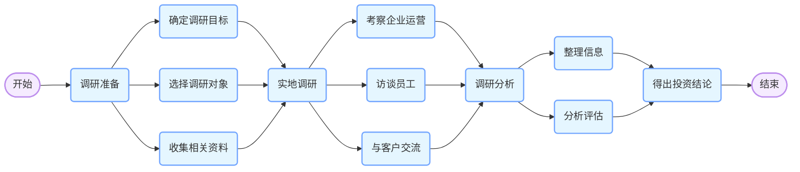

# 彼得林奇的"实地调研"注意事项

> 关键词：彼得林奇、实地调研、投资、注意事项、股票分析

> 摘要：彼得林奇作为投资界的传奇人物，其“实地调研”方法为众多投资者所推崇。本文旨在深入探讨彼得林奇实地调研的各个方面，包括背景介绍、核心概念、具体操作步骤、数学模型及公式、项目实战案例、实际应用场景、工具和资源推荐等，详细阐述实地调研的注意事项，帮助投资者更好地理解和运用这一方法，提升投资决策的准确性和有效性。

## 1. 背景介绍 
### 1.1 目的和范围
彼得林奇的实地调研方法是其投资成功的重要因素之一。本文的目的在于全面剖析彼得林奇实地调研的注意事项，涵盖从调研前的准备到调研过程中的具体行为，再到调研后的分析总结等各个环节。范围包括对不同行业、不同类型企业的实地调研，旨在为投资者提供一个系统、全面的实地调研指导框架。

### 1.2 预期读者
本文预期读者主要包括广大投资者，无论是专业的投资机构从业者，还是普通的个人投资者，都能从本文中获取有关实地调研的宝贵经验和知识。同时，对于金融专业的学生、研究投资理论的学者以及对投资领域感兴趣的人士，也具有一定的参考价值。

### 1.3 文档结构概述
本文首先介绍背景信息，让读者了解研究的目的和范围。接着阐述核心概念与联系，明确实地调研的原理和架构。然后详细讲解核心算法原理及具体操作步骤，通过Python代码示例进行说明。再介绍数学模型和公式，并结合实例进行讲解。之后通过项目实战案例，展示实地调研的具体应用和代码实现。随后探讨实际应用场景，分析实地调研在不同情况下的作用。接着推荐相关的工具和资源，帮助读者进一步学习和实践。最后总结未来发展趋势与挑战，并提供常见问题解答和扩展阅读参考资料。

### 1.4 术语表
#### 1.4.1 核心术语定义
- **实地调研**：指投资者亲自到企业的经营场所、生产基地等实地进行考察、访谈、收集信息等活动，以深入了解企业的实际情况。
- **投资标的**：投资者计划进行投资的对象，如股票、债券、基金等。
- **基本面分析**：通过对企业的财务状况、经营管理、行业地位等基本情况进行分析，评估企业的内在价值。

#### 1.4.2 相关概念解释
- **竞争优势**：企业在市场竞争中相对于其他企业所具有的独特优势，如技术优势、品牌优势、成本优势等。
- **可持续性**：企业的经营业绩和发展前景在未来一段时间内能够持续保持良好状态的能力。
- **行业周期**：行业发展过程中经历的兴起、成长、成熟、衰退等阶段。

#### 1.4.3 缩略词列表
- **PE**：市盈率（Price Earnings Ratio），指股票价格除以每股盈利的比率，用于衡量股票的估值水平。
- **PB**：市净率（Price to Book Ratio），指股票价格与每股净资产的比率，反映股票的市场价值与账面价值的关系。

## 2. 核心概念与联系 

彼得林奇的实地调研核心概念在于通过直接接触企业和市场，获取第一手信息，从而更准确地评估企业的投资价值。其原理基于这样一个观点：仅仅依靠财务报表和公开信息是不足以全面了解企业的，实地调研能够发现一些隐藏在表面之下的关键信息。

### 核心概念原理
实地调研的原理是通过观察企业的生产运营、员工状态、客户反馈等实际情况，来验证和补充从财务报表和其他渠道获取的信息。例如，通过观察企业的生产车间，可以了解其生产设备的先进程度、生产流程的合理性以及员工的工作效率；通过与客户交流，可以了解产品的市场口碑和客户满意度。

### 架构的文本示意图
实地调研的架构可以分为三个层次：调研准备、实地调研、调研分析。

调研准备阶段包括确定调研目标、选择调研对象、收集相关资料等。实地调研阶段则是亲自到企业实地进行考察、访谈等活动。调研分析阶段是对实地调研获取的信息进行整理、分析和评估，得出投资结论。

### Mermaid 流程图


## 3. 核心算法原理 & 具体操作步骤 

### 核心算法原理
虽然实地调研不像数学算法那样有严格的公式，但可以用一个简单的逻辑来表示。我们可以将实地调研获取的信息分为定性信息和定量信息，通过对这些信息的综合评估来确定企业的投资价值。

以下是一个用Python代码表示的简单示例：

```python
# 定义定性信息评估函数
def qualitative_evaluation(management_quality, brand_reputation, customer_satisfaction):
    """
    定性信息评估函数，根据管理质量、品牌声誉和客户满意度进行评估
    :param management_quality: 管理质量得分（0-100）
    :param brand_reputation: 品牌声誉得分（0-100）
    :param customer_satisfaction: 客户满意度得分（0-100）
    :return: 定性信息综合得分（0-100）
    """
    return (management_quality + brand_reputation + customer_satisfaction) / 3

# 定义定量信息评估函数
def quantitative_evaluation(revenue_growth, profit_margin, return_on_equity):
    """
    定量信息评估函数，根据营收增长、利润率和净资产收益率进行评估
    :param revenue_growth: 营收增长率（百分比）
    :param profit_margin: 利润率（百分比）
    :param return_on_equity: 净资产收益率（百分比）
    :return: 定量信息综合得分（0-100）
    """
    return (revenue_growth + profit_margin + return_on_equity) / 3

# 定义综合评估函数
def comprehensive_evaluation(qualitative_score, quantitative_score, qualitative_weight=0.4, quantitative_weight=0.6):
    """
    综合评估函数，根据定性信息得分和定量信息得分进行综合评估
    :param qualitative_score: 定性信息得分（0-100）
    :param quantitative_score: 定量信息得分（0-100）
    :param qualitative_weight: 定性信息权重，默认0.4
    :param quantitative_weight: 定量信息权重，默认0.6
    :return: 综合评估得分（0-100）
    """
    return qualitative_score * qualitative_weight + quantitative_score * quantitative_weight

# 示例数据
management_quality = 80
brand_reputation = 75
customer_satisfaction = 85
revenue_growth = 10
profit_margin = 15
return_on_equity = 20

# 计算得分
qualitative_score = qualitative_evaluation(management_quality, brand_reputation, customer_satisfaction)
quantitative_score = quantitative_evaluation(revenue_growth, profit_margin, return_on_equity)
comprehensive_score = comprehensive_evaluation(qualitative_score, quantitative_score)

print(f"定性信息得分: {qualitative_score}")
print(f"定量信息得分: {quantitative_score}")
print(f"综合评估得分: {comprehensive_score}")
```

### 具体操作步骤
1. **调研准备**
    - **确定调研目标**：明确本次调研想要了解的重点信息，如企业的新产品研发情况、市场拓展计划等。
    - **选择调研对象**：根据投资策略和研究重点，选择合适的企业进行调研。可以考虑行业地位、发展潜力等因素。
    - **收集相关资料**：收集企业的财务报表、行业研究报告、新闻资讯等，对企业有一个初步的了解。

2. **实地调研**
    - **考察企业运营**：参观企业的生产车间、办公场所等，观察企业的生产设备、工作环境、员工状态等。
    - **访谈员工**：与企业的管理层、员工进行交流，了解企业的管理模式、企业文化、员工对企业的看法等。
    - **与客户交流**：通过问卷调查、访谈等方式，了解客户对企业产品或服务的满意度、需求和建议等。

3. **调研分析**
    - **整理信息**：将实地调研获取的信息进行分类整理，包括定性信息和定量信息。
    - **分析评估**：运用上述的评估方法，对企业的投资价值进行分析评估。
    - **得出投资结论**：根据分析评估结果，决定是否对该企业进行投资。

## 4. 数学模型和公式 & 详细讲解 & 举例说明 

### 数学模型和公式
在实地调研中，我们可以运用一些数学模型和公式来辅助分析评估。以下是一些常用的模型和公式：

1. **市盈率（PE）**
    - 公式：$PE = \frac{股票价格}{每股盈利}$
    - 讲解：市盈率是衡量股票估值水平的重要指标。一般来说，市盈率越低，股票越具有投资价值。但需要注意的是，不同行业的市盈率水平可能存在较大差异。
    - 举例：假设某股票的价格为20元，每股盈利为2元，则该股票的市盈率为 $PE = \frac{20}{2} = 10$ 倍。

2. **市净率（PB）**
    - 公式：$PB = \frac{股票价格}{每股净资产}$
    - 讲解：市净率反映了股票的市场价值与账面价值的关系。市净率越低，说明股票的估值越便宜。但同样需要考虑行业特点。
    - 举例：假设某股票的价格为15元，每股净资产为10元，则该股票的市净率为 $PB = \frac{15}{10} = 1.5$ 倍。

3. **净资产收益率（ROE）**
    - 公式：$ROE = \frac{净利润}{净资产} \times 100\%$
    - 讲解：净资产收益率反映了企业运用自有资本的效率。ROE越高，说明企业的盈利能力越强。
    - 举例：假设某企业的净利润为100万元，净资产为500万元，则该企业的净资产收益率为 $ROE = \frac{100}{500} \times 100\% = 20\%$。

### 综合评估模型
我们可以将上述指标结合起来，构建一个综合评估模型。例如，我们可以给每个指标赋予一定的权重，然后计算加权平均值。

假设我们给市盈率、市净率、净资产收益率分别赋予权重 $w_{PE}$、$w_{PB}$、$w_{ROE}$，则综合评估得分 $S$ 可以表示为：

$$S = w_{PE} \times \frac{1}{PE} + w_{PB} \times \frac{1}{PB} + w_{ROE} \times ROE$$

其中，$\frac{1}{PE}$ 和 $\frac{1}{PB}$ 是为了使指标的方向一致，即数值越大越好。

举例：假设 $w_{PE} = 0.3$，$w_{PB} = 0.3$，$w_{ROE} = 0.4$，某股票的市盈率为10倍，市净率为1.5倍，净资产收益率为20%，则综合评估得分 $S$ 为：

$$S = 0.3 \times \frac{1}{10} + 0.3 \times \frac{1}{1.5} + 0.4 \times 0.2 = 0.03 + 0.2 + 0.08 = 0.31$$

## 5. 项目实战：代码实际案例和详细解释说明 

### 5.1  开发环境搭建
- **编程语言**：Python 3.x
- **开发工具**：可以选择 PyCharm、Jupyter Notebook 等。
- **相关库**：pandas、numpy 等，用于数据处理和分析。

### 5.2  源代码详细实现和代码解读
以下是一个更完整的项目实战代码示例，结合了实地调研获取的信息和财务数据进行综合评估。

```python
import pandas as pd
import numpy as np

# 定义企业信息类
class CompanyInfo:
    def __init__(self, name, stock_price, earnings_per_share, book_value_per_share, net_income, net_assets,
                 management_quality, brand_reputation, customer_satisfaction):
        """
        初始化企业信息
        :param name: 企业名称
        :param stock_price: 股票价格
        :param earnings_per_share: 每股盈利
        :param book_value_per_share: 每股净资产
        :param net_income: 净利润
        :param net_assets: 净资产
        :param management_quality: 管理质量得分（0-100）
        :param brand_reputation: 品牌声誉得分（0-100）
        :param customer_satisfaction: 客户满意度得分（0-100）
        """
        self.name = name
        self.stock_price = stock_price
        self.earnings_per_share = earnings_per_share
        self.book_value_per_share = book_value_per_share
        self.net_income = net_income
        self.net_assets = net_assets
        self.management_quality = management_quality
        self.brand_reputation = brand_reputation
        self.customer_satisfaction = customer_satisfaction

    def calculate_pe(self):
        """
        计算市盈率
        :return: 市盈率
        """
        return self.stock_price / self.earnings_per_share

    def calculate_pb(self):
        """
        计算市净率
        :return: 市净率
        """
        return self.stock_price / self.book_value_per_share

    def calculate_roe(self):
        """
        计算净资产收益率
        :return: 净资产收益率（百分比）
        """
        return (self.net_income / self.net_assets) * 100

    def qualitative_evaluation(self):
        """
        定性信息评估
        :return: 定性信息综合得分（0-100）
        """
        return (self.management_quality + self.brand_reputation + self.customer_satisfaction) / 3

    def quantitative_evaluation(self):
        """
        定量信息评估
        :return: 定量信息综合得分（0-100）
        """
        pe = self.calculate_pe()
        pb = self.calculate_pb()
        roe = self.calculate_roe()
        return (1 / pe + 1 / pb + roe) / 3

    def comprehensive_evaluation(self, qualitative_weight=0.4, quantitative_weight=0.6):
        """
        综合评估
        :param qualitative_weight: 定性信息权重，默认0.4
        :param quantitative_weight: 定量信息权重，默认0.6
        :return: 综合评估得分（0-100）
        """
        qualitative_score = self.qualitative_evaluation()
        quantitative_score = self.quantitative_evaluation()
        return qualitative_score * qualitative_weight + quantitative_score * quantitative_weight

# 示例数据
company = CompanyInfo(name="ABC公司", stock_price=20, earnings_per_share=2, book_value_per_share=10,
                      net_income=100, net_assets=500, management_quality=80, brand_reputation=75,
                      customer_satisfaction=85)

# 计算各项指标
pe = company.calculate_pe()
pb = company.calculate_pb()
roe = company.calculate_roe()
qualitative_score = company.qualitative_evaluation()
quantitative_score = company.quantitative_evaluation()
comprehensive_score = company.comprehensive_evaluation()

# 输出结果
print(f"企业名称: {company.name}")
print(f"市盈率: {pe}")
print(f"市净率: {pb}")
print(f"净资产收益率: {roe}%")
print(f"定性信息得分: {qualitative_score}")
print(f"定量信息得分: {quantitative_score}")
print(f"综合评估得分: {comprehensive_score}")
```

### 5.3  代码解读与分析
- **CompanyInfo 类**：用于存储企业的基本信息和相关指标的计算方法。通过初始化函数 `__init__` 接收企业的各项信息，然后定义了计算市盈率、市净率、净资产收益率、定性信息评估、定量信息评估和综合评估的方法。
- **计算各项指标**：在示例中，我们创建了一个 `CompanyInfo` 类的实例，并调用其方法计算各项指标，最后输出结果。
- **综合评估**：综合评估方法 `comprehensive_evaluation` 结合了定性信息得分和定量