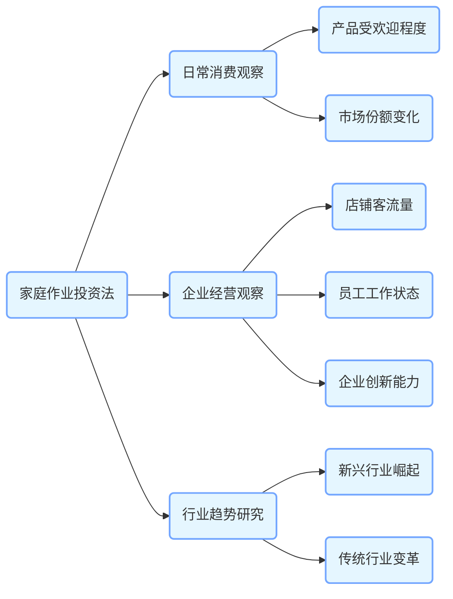

# 彼得林奇的"家庭作业"投资法

> 关键词：彼得林奇、家庭作业投资法、投资策略、股票分析、价值投资

> 摘要：本文深入探讨了彼得林奇的“家庭作业”投资法。详细介绍了该投资法的背景，包括其目的、适用读者群体等。阐述了核心概念及联系，分析了核心算法原理和具体操作步骤，并给出了相应的Python代码示例。同时，介绍了相关的数学模型和公式，通过实际案例进行详细说明。在项目实战部分，搭建开发环境，实现并解读源代码。还探讨了该投资法的实际应用场景，推荐了学习所需的工具和资源。最后总结了未来发展趋势与挑战，解答常见问题并提供扩展阅读和参考资料，帮助投资者更好地理解和运用这一投资方法。

## 1. 背景介绍 
### 1.1 目的和范围
彼得林奇的“家庭作业”投资法旨在为普通投资者提供一种切实可行、易于操作的股票投资策略。其目的是帮助投资者通过日常生活中的观察和研究，发现具有投资价值的股票，从而在股票市场中获得良好的收益。该方法的范围主要聚焦于股票投资领域，适用于对股票投资有兴趣的个人投资者。

### 1.2 预期读者
本文的预期读者主要是广大的个人投资者，尤其是那些缺乏专业投资知识和经验，但希望通过自己的努力在股票市场中取得成功的投资者。同时，也适合对投资策略感兴趣的金融从业者和研究人员参考。

### 1.3 文档结构概述
本文将首先介绍彼得林奇“家庭作业”投资法的核心概念和它们之间的联系，通过文本示意图和Mermaid流程图进行直观展示。接着详细阐述核心算法原理，并给出具体的操作步骤，同时使用Python代码进行实现。然后介绍相关的数学模型和公式，并举例说明其应用。在项目实战部分，将搭建开发环境，详细实现源代码并进行解读。之后探讨该投资法的实际应用场景，推荐学习所需的工具和资源。最后总结未来发展趋势与挑战，解答常见问题并提供扩展阅读和参考资料。

### 1.4 术语表
#### 1.4.1 核心术语定义
- **家庭作业投资法**：彼得林奇提出的一种投资方法，强调投资者通过日常生活中的观察和研究，如关注身边的消费趋势、企业经营状况等，来发现具有投资价值的股票。
- **成长股**：指那些业绩优良、具有良好发展前景的公司所发行的股票，其股价通常会随着公司的成长而不断上涨。
- **价值股**：指那些股价相对其内在价值被低估的股票，投资者可以通过买入这些股票获得潜在的价值回归收益。

#### 1.4.2 相关概念解释
- **基本面分析**：通过对公司的财务状况、经营业绩、行业前景等基本面因素进行分析，来评估公司的内在价值和投资价值。
- **技术分析**：通过对股票价格、成交量等市场数据进行分析，来预测股票价格的未来走势。

#### 1.4.3 缩略词列表
- **EPS**：Earnings Per Share，每股收益，反映公司每股股票的盈利水平。
- **P/E**：Price-to-Earnings Ratio，市盈率，反映股票价格与每股收益之间的比例关系。

## 2. 核心概念与联系 

### 核心概念原理
彼得林奇的“家庭作业”投资法基于一个简单而深刻的理念：普通投资者可以通过日常生活中的观察和研究，发现具有投资价值的股票。该方法的核心在于关注身边的消费趋势、企业经营状况等，从中寻找那些被市场忽视或低估的股票。

具体来说，投资者可以从以下几个方面入手：
1. **关注日常消费**：留意自己和身边人日常消费的产品和服务，如购买的食品、使用的电子产品、去的餐厅等。如果发现某个品牌的产品或服务深受消费者喜爱，且市场份额不断扩大，那么该品牌背后的公司可能具有投资价值。
2. **观察企业经营**：关注身边企业的经营状况，如店铺的客流量、员工的工作状态、企业的创新能力等。如果发现某个企业的经营状况良好，且具有持续发展的潜力，那么该企业的股票可能值得投资。
3. **研究行业趋势**：了解所处行业的发展趋势，如新兴行业的崛起、传统行业的变革等。如果发现某个行业具有良好的发展前景，那么该行业中的优质企业可能具有投资价值。

### 架构的文本示意图
```plaintext
家庭作业投资法
|
|-- 日常消费观察
|   |-- 产品受欢迎程度
|   |-- 市场份额变化
|
|-- 企业经营观察
|   |-- 店铺客流量
|   |-- 员工工作状态
|   |-- 企业创新能力
|
|-- 行业趋势研究
|   |-- 新兴行业崛起
|   |-- 传统行业变革
```

### Mermaid流程图


## 3. 核心算法原理 & 具体操作步骤 

### 核心算法原理
彼得林奇的“家庭作业”投资法并没有严格意义上的数学算法，但其核心原理可以概括为以下几个步骤：
1. **发现潜在投资目标**：通过日常生活中的观察和研究，发现那些具有良好发展前景的企业。
2. **评估企业价值**：对发现的潜在投资目标进行基本面分析，评估其内在价值。
3. **比较股票价格与内在价值**：将股票的市场价格与评估的内在价值进行比较，判断股票是否被低估。
4. **做出投资决策**：如果股票被低估，且企业具有良好的发展前景，那么可以考虑买入该股票；反之，则可以考虑卖出或不买入。

### 具体操作步骤
1. **日常观察**：
    - 记录自己和身边人日常消费的产品和服务，包括品牌、价格、购买频率等。
    - 关注身边企业的经营状况，如店铺的客流量、员工的工作状态、企业的创新能力等。
    - 了解所处行业的发展趋势，如新兴行业的崛起、传统行业的变革等。
2. **筛选潜在投资目标**：
    - 根据日常观察的结果，筛选出那些产品或服务受欢迎、经营状况良好、具有发展潜力的企业。
    - 对筛选出的企业进行初步的基本面分析，了解其财务状况、经营业绩、行业地位等。
3. **深入研究**：
    - 收集更多关于潜在投资目标的信息，包括公司的年报、季报、行业研究报告等。
    - 对企业的基本面进行深入分析，评估其内在价值。可以使用市盈率、市净率、股息率等指标进行评估。
4. **比较股票价格与内在价值**：
    - 将股票的市场价格与评估的内在价值进行比较，判断股票是否被低估。如果股票的市场价格低于内在价值，那么可以认为该股票被低估。
5. **做出投资决策**：
    - 如果股票被低估，且企业具有良好的发展前景，那么可以考虑买入该股票。
    - 在买入股票后，需要持续关注企业的经营状况和股票价格的变化，及时调整投资策略。

### Python代码示例
```python
import pandas as pd
import yfinance as yf

# 定义函数，用于获取股票的基本信息和财务数据
def get_stock_info(ticker):
    stock = yf.Ticker(ticker)
    info = stock.info
    financials = stock.financials
    balance_sheet = stock.balance_sheet
    cashflow = stock.cashflow
    
    return info, financials, balance_sheet, cashflow

# 定义函数，用于计算市盈率
def calculate_pe_ratio(info):
    if 'trailingPE' in info:
        return info['trailingPE']
    else:
        return None

# 定义函数，用于计算市净率
def calculate_pb_ratio(info):
    if 'priceToBook' in info:
        return info['priceToBook']
    else:
        return None

# 定义函数，用于计算股息率
def calculate_dividend_yield(info):
    if 'dividendYield' in info:
        return info['dividendYield']
    else:
        return None

# 主函数
def main():
    ticker = 'AAPL'  # 以苹果公司为例
    info, financials, balance_sheet, cashflow = get_stock_info(ticker)
    
    pe_ratio = calculate_pe_ratio(info)
    pb_ratio = calculate_pb_ratio(info)
    dividend_yield = calculate_dividend_yield(info)
    
    print(f"股票代码: {ticker}")
    print(f"市盈率: {pe_ratio}")
    print(f"市净率: {pb_ratio}")
    print(f"股息率: {dividend_yield}")

if __name__ == "__main__":
    main()
```

## 4. 数学模型和公式 & 详细讲解 & 举例说明 

### 市盈率（P/E）
#### 公式
$$P/E = \frac{股票价格}{每股收益}$$

#### 详细讲解
市盈率是衡量股票价格相对其盈利水平的指标。市盈率越高，说明市场对该股票的预期越高，但也可能意味着股票被高估；市盈率越低，说明股票价格相对其盈利水平较低，可能被低估。

#### 举例说明
假设某股票的市场价格为每股50元，每股收益为5元，则该股票的市盈率为：
$$P/E = \frac{50}{5} = 10$$

这意味着投资者需要10年的时间才能通过该股票的盈利收回投资成本。

### 市净率（P/B）
#### 公式
$$P/B = \frac{股票价格}{每股净资产}$$

#### 详细讲解
市净率是衡量股票价格相对其净资产的指标。市净率越高，说明市场对该股票的预期越高，但也可能意味着股票被高估；市净率越低，说明股票价格相对其净资产较低，可能被低估。

#### 举例说明
假设某股票的市场价格为每股20元，每股净资产为10元，则该股票的市净率为：
$$P/B = \frac{20}{10} = 2$$

这意味着投资者为该股票的每股净资产支付了2倍的价格。

### 股息率
#### 公式
$$股息率 = \frac{每股股息}{股票价格} \times 100\%$$

#### 详细讲解
股息率是衡量股票分红水平的指标。股息率越高，说明股票的分红越多，投资者可以获得的现金收益越高。

#### 举例说明
假设某股票的市场价格为每股30元，每股股息为1.5元，则该股票的股息率为：
$$股息率 = \frac{1.5}{30} \times 100\% = 5\%$$

这意味着投资者每年可以从该股票获得5%的现金分红收益。

## 5. 项目实战：代码实际案例和详细解释说明 

### 5.1  开发环境搭建
为了实现彼得林奇的“家庭作业”投资法的代码示例，我们需要搭建以下开发环境：
1. **Python环境**：建议使用Python 3.7及以上版本。可以从Python官方网站（https://www.python.org/downloads/）下载并安装。
2. **开发工具**：可以使用任意Python开发工具，如PyCharm、VS Code等。
3. **必要的Python库**：需要安装`pandas`和`yfinance`库。可以使用以下命令进行安装：
```sh
pip install pandas yfinance
```

### 5.2  源代码详细实现和代码解读
以下是完整的源代码：
```python
import pandas as pd
import yfinance as yf

# 定义函数，用于获取股票的基本信息和财务数据
def get_stock_info(ticker):
    stock = yf.Ticker(ticker)
    info = stock.info
    financials = stock.financials
    balance_sheet = stock.balance_sheet
    cashflow = stock.cashflow
    
    return info, financials, balance_sheet, cashflow

# 定义函数，用于计算市盈率
def calculate_pe_ratio(info):
    if 'trailingPE' in info:
        return info['trailingPE']
    else:
        return None

# 定义函数，用于计算市净率
def calculate_pb_ratio(info):
    if 'priceToBook' in info:
        return info['priceToBook']
    else:
        return None

# 定义函数，用于计算股息率
def calculate_dividend_yield(info):
    if 'dividendYield' in info:
        return info['dividendYield']
    else:
        return None

# 主函数
def main():
    ticker = 'AAPL'  # 以苹果公司为例
    info, financials, balance_sheet, cashflow = get_stock_info(ticker)
    
    pe_ratio = calculate_pe_ratio(info)
    pb_ratio = calculate_pb_ratio(info)
    dividend_yield = calculate_dividend_yield(info)
    
    print(f"股票代码: {ticker}")
    print(f"市盈率: {pe_ratio}")
    print(f"市净率: {pb_ratio}")
    print(f"股息率: {dividend_yield}")

if __name__ == "__main__":
    main()
```

### 代码解读与分析
1. **导入必要的库**：
```python
import pandas as pd
import yfinance as yf
```
`pandas`是一个用于数据处理和分析的Python库，`yfinance`是一个用于获取雅虎财经数据的Python库。

2. **定义`get_stock_info`函数**：
```python
def get_stock_info(ticker):
    stock = yf.Ticker(ticker)
    info = stock.info
    financials = stock.financials
    balance_sheet = stock.balance_sheet
    cashflow = stock.cashflow
    
    return info, financials, balance_sheet, cashflow
```
该函数用于获取指定股票的基本信息、财务报表、资产负债表和现金流量表。

3. **定义`calculate_pe_ratio`函数**：
```python
def calculate_pe_ratio(info):
    if 'trailingPE' in info:
        return info['trailingPE']
    else:
        return None
```
该函数用于计算股票的市盈率。如果股票信息中包含`trailingPE`字段，则返回该字段的值；否则返回`None`。

4. **定义`calculate_pb_ratio`函数**：
```python
def calculate_pb_ratio(info):
    if 'priceToBook' in info:
        return info['priceToBook']
    else:
        return None
```
该函数用于计算股票的市净率。如果股票信息中包含`priceToBook`字段，则返回该字段的值；否则返回`None`。

5. **定义`calculate_dividend_yield`函数**：
```python
def calculate_dividend_yield(info):
    if 'dividendYield' in info:
        return info['dividendYield']
    else:
        return None
```
该函数用于计算股票的股息率。如果股票信息中包含`dividendYield`字段，则返回该字段的值；否则返回`None`。

6. **定义`main`函数**：
```python
def main():
    ticker = 'AAPL'  # 以苹果公司为例
    info, financials, balance_sheet, cashflow = get_stock_info(ticker)
    
    pe_ratio = calculate_pe_ratio(info)
    pb_ratio = calculate_pb_ratio(info)
    dividend_yield = calculate_dividend_yield(info)
    
    print(f"股票代码: {ticker}")
    print(f"市盈率: {pe_ratio}")
    print(f"市净率: {pb_ratio}")
    print(f"股息率: {dividend_yield}")
```
该函数是程序的主函数，用于调用上述函数获取股票信息并计算市盈率、市净率和股息率，最后将结果打印输出。

## 6. 实际应用场景 
彼得林奇的“家庭作业”投资法适用于以下实际应用场景：
1. **个人投资者**：对于普通个人投资者来说，该方法可以帮助他们通过日常生活中的观察和研究，发现具有投资价值的股票，从而实现资产的增值。个人投资者可以关注自己身边的消费趋势和企业经营状况，从中寻找投资机会。
2. **业余投资者**：业余投资者通常没有太多的时间和精力进行专业的投资研究。“家庭作业”投资法简单易懂，不需要复杂的专业知识和技能，业余投资者可以利用业余时间进行观察和研究，做出投资决策。
3. **长期投资者**：该方法强调对企业基本面的分析和长期投资，适合那些追求长期稳定收益的投资者。长期投资者可以通过深入研究企业的发展前景和内在价值，选择具有潜力的股票进行长期持有。

## 7. 工具和资源推荐
### 7.1 学习资源推荐
#### 7.1.1 书籍推荐
- 《彼得·林奇的成功投资》：彼得·林奇的经典著作，详细介绍了他的投资理念和方法，是学习“家庭作业”投资法的必读之书。
- 《战胜华尔街》：也是彼得·林奇的重要著作，分享了他在投资实践中的经验和案例。
- 《聪明的投资者》：本杰明·格雷厄姆的经典著作，被誉为投资界的“圣经”，对价值投资理念进行了深入阐述。

#### 7.1.2 在线课程
- Coursera上的“投资学原理”课程：由知名教授授课，系统介绍了投资学的基本原理和方法。
- 网易云课堂上的“股票投资入门”课程：适合初学者，讲解了股票投资的基本知识和技巧。

#### 7.1.3 技术博客和网站
- 雪球网：国内知名的投资社区，提供了丰富的股票投资信息和分析文章。
- 东方财富网：提供全面的金融信息和数据，包括股票行情、财经新闻等。

### 7.2 开发工具框架推荐
#### 7.2.1 IDE和编辑器
- PyCharm：专业的Python集成开发环境，功能强大，适合开发复杂的Python程序。
- VS Code：轻量级的代码编辑器，支持多种编程语言，具有丰富的插件扩展功能。

#### 7.2.2 调试和性能分析工具
- pdb：Python自带的调试工具，可以帮助开发者定位和解决代码中的问题。
- cProfile：Python的性能分析工具，可以分析代码的执行时间和资源消耗情况。

#### 7.2.3 相关框架和库
- pandas：用于数据处理和分析的Python库，提供了丰富的数据结构和数据分析工具。
- yfinance：用于获取雅虎财经数据的Python库，可以方便地获取股票的历史数据和基本信息。

### 7.3 相关论文著作推荐
#### 7.3.1 经典论文
- 《证券分析》：本杰明·格雷厄姆和大卫·多德的经典论文，奠定了价值投资的理论基础。
- 《有效市场假说》：尤金·法玛的经典论文，对市场效率进行了深入研究。

#### 7.3.2 最新研究成果
- 可以关注《金融研究》、《经济研究》等国内权威金融期刊，以及《Journal of Finance》、《Review of Financial Studies》等国际知名金融期刊，了解最新的投资研究成果。

#### 7.3.3 应用案例分析
- 可以通过阅读一些投资类的书籍和文章，了解彼得林奇“家庭作业”投资法在实际应用中的案例，学习其投资思路和方法。

## 8. 总结：未来发展趋势与挑战
### 未来发展趋势
1. **数字化和智能化**：随着科技的不断发展，投资领域也将越来越数字化和智能化。投资者可以利用大数据、人工智能等技术，更高效地进行投资研究和决策。例如，通过分析社交媒体数据、电商销售数据等，发现潜在的投资机会。
2. **多元化投资**：未来投资者将更加注重多元化投资，不仅投资于股票，还会投资于债券、基金、房地产等多种资产。“家庭作业”投资法可以作为一种发现股票投资机会的方法，与其他投资策略相结合，实现资产的多元化配置。
3. **社会责任投资**：越来越多的投资者开始关注企业的社会责任和可持续发展。未来，“家庭作业”投资法可能会更加注重对企业社会责任的评估，投资者会更倾向于投资那些具有良好社会形象和可持续发展能力的企业。

### 挑战
1. **市场不确定性**：股票市场具有高度的不确定性，受到宏观经济、政策法规、行业竞争等多种因素的影响。即使采用“家庭作业”投资法，也难以准确预测股票价格的走势，投资者可能会面临投资损失的风险。
2. **信息过载**：在信息爆炸的时代，投资者面临着大量的信息，如何筛选和分析有价值的信息成为一个挑战。“家庭作业”投资法需要投资者进行大量的观察和研究，但如果不能有效地筛选信息，可能会陷入信息过载的困境。
3. **情绪干扰**：投资者的情绪往往会影响投资决策。在股票市场波动较大时，投资者可能会因为恐惧或贪婪而做出错误的决策。“家庭作业”投资法需要投资者保持理性和冷静，但在实际操作中，情绪干扰往往难以避免。

## 9. 附录：常见问题与解答
### 问题1：“家庭作业”投资法适合所有投资者吗？
解答：“家庭作业”投资法适合那些有一定时间和精力进行投资研究，且希望通过自己的努力在股票市场中获得收益的投资者。但该方法并不适合所有投资者，例如那些没有时间和能力进行研究的投资者，或者那些追求短期投机收益的投资者。

### 问题2：如何判断一个企业是否具有投资价值？
解答：可以从以下几个方面判断一个企业是否具有投资价值：
1. **产品或服务**：关注企业的产品或服务是否受欢迎，市场份额是否不断扩大。
2. **经营状况**：观察企业的经营状况，如店铺的客流量、员工的工作状态、企业的创新能力等。
3. **财务状况**：分析企业的财务报表，了解其盈利能力、偿债能力、现金流状况等。
4. **行业前景**：了解企业所处行业的发展趋势，判断该行业是否具有良好的发展前景。

### 问题3：使用“家庭作业”投资法需要具备哪些知识和技能？
解答：使用“家庭作业”投资法不需要具备复杂的专业知识和技能，但需要具备以下基本的知识和技能：
1. **基本的财务知识**：了解财务报表的基本内容和分析方法，如资产负债表、利润表、现金流量表等。
2. **投资基础知识**：了解股票投资的基本概念和方法，如市盈率、市净率、股息率等。
3. **观察和分析能力**：具备观察和分析身边事物的能力，能够从日常生活中发现潜在的投资机会。

## 10. 扩展阅读 & 参考资料
### 扩展阅读
- 《漫步华尔街》：伯顿·马尔基尔的经典著作，介绍了多种投资策略和方法，对投资者有很大的启发。
- 《财务自由之路》：博多·舍费尔的著作，提供了实现财务自由的方法和建议，适合想要通过投资实现财务目标的读者阅读。

### 参考资料
- 彼得·林奇. 《彼得·林奇的成功投资》. 机械工业出版社.
- 本杰明·格雷厄姆. 《聪明的投资者》. 人民邮电出版社.
- 尤金·法玛. 《有效市场假说》. 《Journal of Finance》.

作者：AI天才研究院/AI Genius Institute & 禅与计算机程序设计艺术 /Zen And The Art of Computer Programming