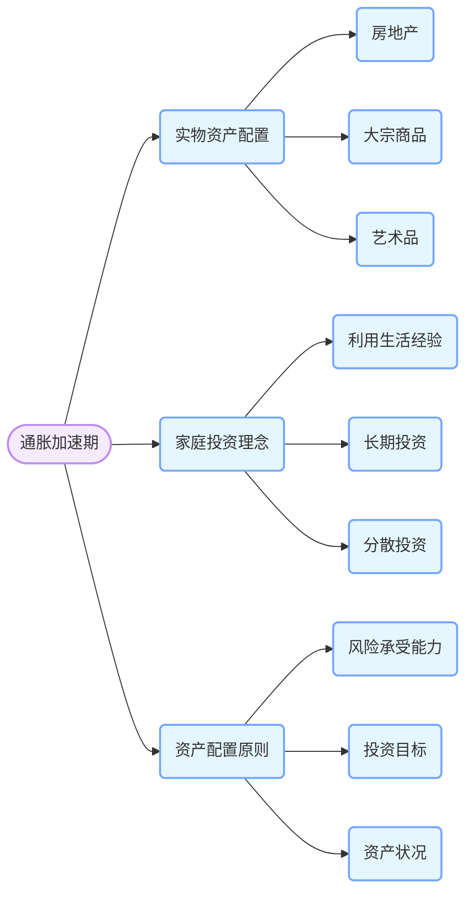

# 彼得林奇的"家庭投资"在通胀加速期的实物资产配置策略

> 关键词：彼得林奇、家庭投资、通胀加速期、实物资产配置、投资策略

> 摘要：本文深入探讨了彼得林奇的“家庭投资”理念在通胀加速期的实物资产配置策略。在通胀加速的经济环境下，家庭资产面临着贬值风险，合理的实物资产配置至关重要。彼得林奇作为投资大师，其投资理念和方法对家庭投资具有重要的指导意义。文章首先介绍了相关背景知识，包括目的范围、预期读者等；接着阐述了核心概念与联系，通过文本示意图和 Mermaid 流程图进行清晰展示；然后详细讲解了核心算法原理和具体操作步骤，并用 Python 代码进行说明；分析了相关数学模型和公式；通过项目实战展示了代码实际案例及解读；探讨了实际应用场景；推荐了相关工具和资源；最后总结了未来发展趋势与挑战，解答了常见问题并给出扩展阅读与参考资料，旨在为家庭投资者在通胀加速期的实物资产配置提供全面、深入的参考。

## 1. 背景介绍 
### 1.1 目的和范围
在经济发展过程中，通胀是一个常见的经济现象，而通胀加速期会对家庭资产的价值产生显著影响。本研究的目的在于深入探讨彼得林奇的“家庭投资”理念在通胀加速期如何进行实物资产配置，以实现家庭资产的保值和增值。研究范围涵盖了实物资产的主要类别，如房地产、大宗商品等，分析在通胀加速环境下这些资产的表现和配置策略。

### 1.2 预期读者
本文预期读者包括广大的家庭投资者，无论是有一定投资经验的投资者，还是刚刚接触投资领域的新手，都可以从本文中获取有价值的信息。同时，对于金融从业者、经济研究人员等也具有一定的参考价值，有助于他们深入了解家庭投资在通胀环境下的策略和实践。

### 1.3 文档结构概述
本文将按照以下结构展开：首先介绍背景知识，包括目的范围、预期读者等；接着阐述核心概念与联系，通过文本示意图和 Mermaid 流程图清晰展示相关概念的关系；然后详细讲解核心算法原理和具体操作步骤，并用 Python 代码进行说明；分析相关数学模型和公式；通过项目实战展示代码实际案例及解读；探讨实际应用场景；推荐相关工具和资源；最后总结未来发展趋势与挑战，解答常见问题并给出扩展阅读与参考资料。

### 1.4 术语表
#### 1.4.1 核心术语定义
- **彼得林奇的“家庭投资”理念**：强调家庭投资者可以利用自身的生活经验和对身边事物的了解进行投资决策，注重长期投资和分散投资。
- **通胀加速期**：指通货膨胀率快速上升的时期，物价水平在短期内出现较大幅度的上涨。
- **实物资产**：指具有实物形态的资产，如房地产、大宗商品（黄金、白银、石油等）、艺术品等。

#### 1.4.2 相关概念解释
- **资产配置**：指根据投资目标、风险承受能力等因素，将资金分配到不同类型的资产中，以实现投资组合的最优风险收益特征。
- **保值**：指在通胀环境下，资产的价值能够保持相对稳定，不被通胀侵蚀。
- **增值**：指资产的价值在投资过程中实现增长。

#### 1.4.3 缩略词列表
- **CPI**：消费者物价指数（Consumer Price Index），是衡量通货膨胀水平的重要指标。

## 2. 核心概念与联系 

### 核心概念原理
彼得林奇的“家庭投资”理念强调家庭投资者可以从日常生活中发现投资机会。在通胀加速期，实物资产具有一定的抗通胀特性，因为其价值往往会随着物价的上涨而上升。例如，房地产作为一种实物资产，其价格通常会在通胀环境下上涨，因为土地和建筑物的成本会随着物价上升而增加。大宗商品如黄金，由于其稀缺性和避险属性，在通胀加速期往往受到投资者的青睐，其价格也会相应上涨。

家庭投资者在通胀加速期进行实物资产配置时，需要考虑自身的风险承受能力、投资目标和资产状况等因素。通过合理的资产配置，可以降低投资风险，实现家庭资产的保值和增值。

### 架构的文本示意图
```plaintext
通胀加速期
|
|-- 实物资产配置
|   |-- 房地产
|   |-- 大宗商品（黄金、白银、石油等）
|   |-- 艺术品
|
|-- 家庭投资理念（彼得林奇）
|   |-- 利用生活经验
|   |-- 长期投资
|   |-- 分散投资
|
|-- 资产配置原则
|   |-- 风险承受能力
|   |-- 投资目标
|   |-- 资产状况
```

### Mermaid 流程图


## 3. 核心算法原理 & 具体操作步骤 

### 核心算法原理
在通胀加速期进行实物资产配置的核心算法原理是基于资产的风险收益特征和相关性进行优化配置。我们可以使用现代投资组合理论中的均值 - 方差模型来确定最优的资产配置比例。

均值 - 方差模型的目标是在给定的风险水平下最大化投资组合的预期收益，或者在给定的预期收益水平下最小化投资组合的风险。投资组合的预期收益 $E(R_p)$ 可以表示为各资产预期收益的加权平均值：

$E(R_p)=\sum_{i=1}^{n} w_i E(R_i)$

其中，$w_i$ 是第 $i$ 种资产的权重，$E(R_i)$ 是第 $i$ 种资产的预期收益，$n$ 是资产的数量。

投资组合的方差 $\sigma_p^2$ 可以表示为：

$\sigma_p^2=\sum_{i=1}^{n} \sum_{j=1}^{n} w_i w_j \sigma_{ij}$

其中，$\sigma_{ij}$ 是资产 $i$ 和资产 $j$ 的协方差。

### 具体操作步骤
1. **确定资产类别**：选择在通胀加速期具有抗通胀特性的实物资产，如房地产、黄金、石油等。
2. **估计资产的预期收益和风险**：通过历史数据和市场分析，估计每种资产的预期收益和风险（标准差）。
3. **计算资产之间的协方差**：分析资产之间的相关性，计算协方差矩阵。
4. **设定投资目标和约束条件**：根据家庭投资者的风险承受能力和投资目标，设定预期收益和风险的约束条件。
5. **求解最优资产配置比例**：使用优化算法，在满足约束条件的情况下，求解使投资组合的风险最小化或预期收益最大化的资产配置比例。

### Python 源代码实现
```python
import numpy as np
from scipy.optimize import minimize

# 定义资产的预期收益和协方差矩阵
expected_returns = np.array([0.1, 0.15, 0.2])  # 房地产、黄金、石油的预期收益
cov_matrix = np.array([[0.04, 0.02, 0.01],
                       [0.02, 0.09, 0.03],
                       [0.01, 0.03, 0.16]])  # 协方差矩阵

# 定义目标函数：最小化投资组合的方差
def portfolio_variance(weights, cov_matrix):
    return np.dot(weights.T, np.dot(cov_matrix, weights))

# 定义约束条件：权重之和为 1
constraints = [{'type': 'eq', 'fun': lambda x: np.sum(x) - 1}]

# 定义边界条件：权重在 0 到 1 之间
bounds = [(0, 1) for _ in range(len(expected_returns))]

# 初始权重猜测
initial_weights = np.ones(len(expected_returns)) / len(expected_returns)

# 求解最优权重
result = minimize(portfolio_variance, initial_weights, args=(cov_matrix,), constraints=constraints, bounds=bounds)

optimal_weights = result.x
print("最优资产配置比例：", optimal_weights)
```

## 4. 数学模型和公式 & 详细讲解 & 举例说明 

### 数学模型和公式
#### 投资组合的预期收益
投资组合的预期收益 $E(R_p)$ 是各资产预期收益的加权平均值，公式为：

$E(R_p)=\sum_{i=1}^{n} w_i E(R_i)$

其中，$w_i$ 是第 $i$ 种资产的权重，$E(R_i)$ 是第 $i$ 种资产的预期收益，$n$ 是资产的数量。

#### 投资组合的方差
投资组合的方差 $\sigma_p^2$ 表示投资组合的风险，公式为：

$\sigma_p^2=\sum_{i=1}^{n} \sum_{j=1}^{n} w_i w_j \sigma_{ij}$

其中，$\sigma_{ij}$ 是资产 $i$ 和资产 $j$ 的协方差。

#### 协方差
资产 $i$ 和资产 $j$ 的协方差 $\sigma_{ij}$ 可以表示为：

$\sigma_{ij}=\rho_{ij} \sigma_i \sigma_j$

其中，$\rho_{ij}$ 是资产 $i$ 和资产 $j$ 的相关系数，$\sigma_i$ 和 $\sigma_j$ 分别是资产 $i$ 和资产 $j$ 的标准差。

### 详细讲解
- **投资组合的预期收益**：预期收益反映了投资组合在未来可能获得的平均收益。通过加权平均的方式计算投资组合的预期收益，考虑了每种资产在投资组合中的权重。
- **投资组合的方差**：方差衡量了投资组合收益的波动程度，即风险。方差越大，投资组合的风险越高。通过计算投资组合的方差，可以评估投资组合的风险水平。
- **协方差**：协方差反映了两种资产收益之间的相关性。当协方差为正时，两种资产的收益呈正相关；当协方差为负时，两种资产的收益呈负相关；当协方差为 0 时，两种资产的收益不相关。通过分析资产之间的协方差，可以选择相关性较低的资产进行组合，以降低投资组合的风险。

### 举例说明
假设我们有两种资产：房地产和黄金。房地产的预期收益为 $E(R_1)=0.1$，标准差为 $\sigma_1 = 0.2$；黄金的预期收益为 $E(R_2)=0.15$，标准差为 $\sigma_2 = 0.3$。两种资产的相关系数为 $\rho_{12}=0.2$。

我们设定投资组合中房地产的权重为 $w_1 = 0.6$，黄金的权重为 $w_2 = 0.4$。

首先，计算协方差：

$\sigma_{12}=\rho_{12} \sigma_1 \sigma_2 = 0.2 \times 0.2 \times 0.3 = 0.012$

然后，计算投资组合的预期收益：

$E(R_p)=w_1 E(R_1) + w_2 E(R_2) = 0.6 \times 0.1 + 0.4 \times 0.15 = 0.12$

最后，计算投资组合的方差：

$\sigma_p^2=w_1^2 \sigma_1^2 + w_2^2 \sigma_2^2 + 2 w_1 w_2 \sigma_{12}$

$=0.6^2 \times 0.2^2 + 0.4^2 \times 0.3^2 + 2 \times 0.6 \times 0.4 \times 0.012$

$=0.0144 + 0.0144 + 0.00576 = 0.03456$

投资组合的标准差为：

$\sigma_p=\sqrt{\sigma_p^2}=\sqrt{0.03456} \approx 0.186$

## 5. 项目实战：代码实际案例和详细解释说明 

### 5.1  开发环境搭建
- **Python 环境**：确保已经安装 Python 3.x 版本。可以从 Python 官方网站（https://www.python.org/downloads/）下载并安装。
- **相关库**：需要安装 `numpy` 和 `scipy` 库。可以使用以下命令进行安装：
```sh
pip install numpy scipy
```

### 5.2  源代码详细实现和代码解读
```python
import numpy as np
from scipy.optimize import minimize

# 定义资产的预期收益和协方差矩阵
expected_returns = np.array([0.1, 0.15, 0.2])  # 房地产、黄金、石油的预期收益
cov_matrix = np.array([[0.04, 0.02, 0.01],
                       [0.02, 0.09, 0.03],
                       [0.01, 0.03, 0.16]])  # 协方差矩阵

# 定义目标函数：最小化投资组合的方差
def portfolio_variance(weights, cov_matrix):
    return np.dot(weights.T, np.dot(cov_matrix, weights))

# 定义约束条件：权重之和为 1
constraints = [{'type': 'eq', 'fun': lambda x: np.sum(x) - 1}]

# 定义边界条件：权重在 0 到 1 之间
bounds = [(0, 1) for _ in range(len(expected_returns))]

# 初始权重猜测
initial_weights = np.ones(len(expected_returns)) / len(expected_returns)

# 求解最优权重
result = minimize(portfolio_variance, initial_weights, args=(cov_matrix,), constraints=constraints, bounds=bounds)

optimal_weights = result.x
print("最优资产配置比例：", optimal_weights)
```

### 代码解读与分析
1. **导入必要的库**：导入 `numpy` 和 `scipy.optimize` 库，`numpy` 用于处理数组和矩阵运算，`scipy.optimize` 用于优化求解。
2. **定义资产的预期收益和协方差矩阵**：`expected_returns` 数组存储了房地产、黄金、石油的预期收益，`cov_matrix` 矩阵存储了资产之间的协方差。
3. **定义目标函数**：`portfolio_variance` 函数用于计算投资组合的方差，作为优化的目标函数。
4. **定义约束条件和边界条件**：约束条件要求权重之和为 1，边界条件要求权重在 0 到 1 之间。
5. **初始权重猜测**：`initial_weights` 数组作为初始的权重猜测值。
6. **求解最优权重**：使用 `minimize` 函数求解使投资组合方差最小化的最优权重。
7. **输出结果**：打印出最优资产配置比例。

## 6. 实际应用场景 
### 家庭资产保值增值
在通胀加速期，家庭资产面临着贬值的风险。通过合理配置实物资产，如房地产、黄金等，可以实现家庭资产的保值和增值。例如，房地产的价值通常会随着物价的上涨而上升，黄金作为避险资产，在通胀环境下也具有一定的保值作用。

### 投资组合风险管理
实物资产与金融资产具有不同的风险收益特征。在投资组合中加入实物资产，可以降低投资组合的整体风险。例如，当股票市场下跌时，房地产和黄金等实物资产可能表现相对稳定，从而平衡投资组合的收益波动。

### 应对经济不确定性
通胀加速期往往伴随着经济的不确定性。实物资产具有一定的抗通胀和避险特性，可以帮助投资者应对经济不确定性带来的风险。例如，在经济衰退期间，黄金的价格通常会上涨，为投资者提供一定的保护。

## 7. 工具和资源推荐
### 7.1 学习资源推荐
#### 7.1.1 书籍推荐
- 《彼得林奇的成功投资》：彼得林奇的经典著作，详细介绍了他的投资理念和方法。
- 《聪明的投资者》：本杰明·格雷厄姆的经典著作，对价值投资理论进行了深入阐述。
- 《漫步华尔街》：介绍了各种投资策略和市场理论，帮助读者了解投资市场的运行机制。

#### 7.1.2 在线课程
- Coursera 上的“投资学原理”课程：由知名教授授课，系统介绍投资学的基本原理和方法。
- edX 上的“金融市场”课程：深入讲解金融市场的运作和投资策略。

#### 7.1.3 技术博客和网站
- 雪球网：提供股票、基金等投资领域的资讯和交流平台。
- 金融界：提供全面的金融资讯