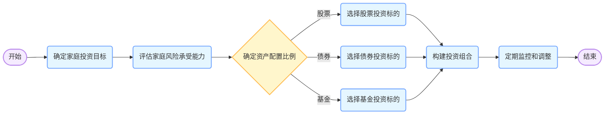

# 彼得林奇的"家庭投资组合"平衡策略

> 关键词：彼得林奇、家庭投资组合、平衡策略、投资理念、资产配置

> 摘要：本文围绕彼得林奇的“家庭投资组合”平衡策略展开深入探讨。首先介绍背景信息，让读者了解该策略的目的、适用范围和目标受众等。接着阐述核心概念与联系，分析策略的原理和架构。通过Python代码详细讲解核心算法原理及具体操作步骤，并给出相应的数学模型和公式。以实际项目案例展示策略在代码层面的实现与解读。探讨该策略在不同场景下的实际应用，推荐相关的学习资源、开发工具框架和论文著作。最后总结其未来发展趋势与挑战，解答常见问题并提供扩展阅读和参考资料，旨在帮助投资者全面理解和运用这一策略进行合理的家庭投资。

## 1. 背景介绍 
### 1.1 目的和范围
彼得林奇是投资界的传奇人物，他所倡导的“家庭投资组合”平衡策略旨在帮助普通家庭实现资产的合理配置和稳健增值。该策略的核心是通过分散投资不同类型的资产，降低投资风险，同时追求一定的投资回报。其范围涵盖了股票、债券、基金等多种常见的投资品种，适用于不同收入水平、风险承受能力和投资目标的家庭。通过运用这一策略，家庭投资者可以根据自身情况构建适合自己的投资组合，在保障资产安全的前提下，逐步实现财富的增长。

### 1.2 预期读者
本文的预期读者主要是对家庭投资感兴趣的普通投资者，包括有一定积蓄但缺乏专业投资知识的家庭主妇、上班族等。同时，也适合一些正在学习投资知识、希望了解不同投资策略的金融专业学生和初学者。对于已经有一定投资经验，但希望优化投资组合、提高投资效益的投资者，本文也能提供有价值的参考。

### 1.3 文档结构概述
本文将按照以下结构进行阐述：首先介绍彼得林奇“家庭投资组合”平衡策略的背景信息，包括目的、预期读者和文档结构等；接着深入讲解该策略的核心概念与联系，通过文本示意图和Mermaid流程图进行直观展示；然后详细介绍核心算法原理和具体操作步骤，并使用Python代码进行演示；给出相关的数学模型和公式，并举例说明；通过实际项目案例展示代码的实现和解读；探讨该策略在不同场景下的实际应用；推荐相关的学习资源、开发工具框架和论文著作；最后总结该策略的未来发展趋势与挑战，解答常见问题并提供扩展阅读和参考资料。

### 1.4 术语表
#### 1.4.1 核心术语定义
- **家庭投资组合**：指家庭将资金分散投资于不同类型的资产，如股票、债券、基金等，以实现资产的合理配置和风险分散。
- **平衡策略**：通过调整投资组合中不同资产的比例，使投资组合在风险和回报之间达到一种相对平衡的状态。
- **资产配置**：根据投资者的风险承受能力、投资目标和市场情况，将资金分配到不同的资产类别中。
- **风险分散**：通过投资多种不同的资产，降低单一资产波动对投资组合整体价值的影响。

#### 1.4.2 相关概念解释
- **股票**：是股份公司发行的所有权凭证，是股份公司为筹集资金而发行给各个股东作为持股凭证并借以取得股息和红利的一种有价证券。股票投资具有较高的风险和潜在回报。
- **债券**：是发行人向投资者发行的一种债务凭证，通常承诺在一定期限内支付固定的利息，并在到期时偿还本金。债券投资相对较为稳健，风险较低。
- **基金**：是一种集合投资方式，由基金管理人管理和运作，将众多投资者的资金集中起来，投资于股票、债券等多种资产。基金可以分为股票型基金、债券型基金、混合型基金等不同类型。

#### 1.4.3 缩略词列表
- **ETF**：交易型开放式指数基金（Exchange Traded Fund），是一种在交易所上市交易的、基金份额可变的开放式基金。
- **ROI**：投资回报率（Return on Investment），是指通过投资而应返回的价值，即企业从一项投资活动中得到的经济回报。

## 2. 核心概念与联系 

### 核心概念原理
彼得林奇的“家庭投资组合”平衡策略基于风险分散和资产配置的原理。他认为，家庭投资者不应将所有资金集中投资于某一种资产，而应根据自己的风险承受能力和投资目标，将资金分散投资于不同类型的资产，如股票、债券、基金等。通过这种方式，可以降低单一资产波动对投资组合整体价值的影响，实现风险的分散。同时，根据市场情况和家庭的财务状况，适时调整投资组合中不同资产的比例，以达到风险和回报的平衡。

### 架构的文本示意图
家庭投资组合平衡策略的架构可以用以下文本示意图表示：

```plaintext
家庭投资组合
|-- 股票
|   |-- 大盘股
|   |-- 中小盘股
|   |-- 成长股
|   |-- 价值股
|-- 债券
|   |-- 国债
|   |-- 企业债
|   |-- 地方债
|-- 基金
|   |-- 股票型基金
|   |-- 债券型基金
|   |-- 混合型基金
|   |-- ETF
```

### Mermaid 流程图


该流程图展示了家庭投资组合平衡策略的基本流程。首先，家庭投资者需要确定自己的投资目标，如资产保值、增值、养老等。然后，评估自己的风险承受能力，这取决于家庭的收入状况、负债情况、投资经验等因素。根据投资目标和风险承受能力，确定资产配置比例，即投资于股票、债券、基金等不同资产的比例。接着，选择具体的投资标的，构建投资组合。最后，定期监控投资组合的表现，并根据市场情况和家庭的财务状况进行调整。

## 3. 核心算法原理 & 具体操作步骤 

### 核心算法原理
彼得林奇的“家庭投资组合”平衡策略的核心算法原理是通过动态调整投资组合中不同资产的比例，使投资组合的风险和回报达到平衡。具体来说，可以使用以下公式计算投资组合的预期回报和风险：

#### 预期回报
投资组合的预期回报 $E(R_p)$ 可以通过以下公式计算：

$$E(R_p)=\sum_{i=1}^{n} w_i E(R_i)$$

其中，$w_i$ 是第 $i$ 种资产在投资组合中的权重，$E(R_i)$ 是第 $i$ 种资产的预期回报，$n$ 是投资组合中资产的数量。

#### 风险（标准差）
投资组合的风险可以用标准差 $\sigma_p$ 来衡量，计算公式如下：

$$\sigma_p=\sqrt{\sum_{i=1}^{n} \sum_{j=1}^{n} w_i w_j \sigma_{ij}}$$

其中，$\sigma_{ij}$ 是第 $i$ 种资产和第 $j$ 种资产的协方差。

### 具体操作步骤
#### 步骤 1：确定投资目标和风险承受能力
家庭投资者需要明确自己的投资目标，如短期资产保值、中期资产增值、长期养老等。同时，评估自己的风险承受能力，这可以通过问卷调查、咨询专业人士等方式进行。

#### 步骤 2：确定资产配置比例
根据投资目标和风险承受能力，确定投资组合中股票、债券、基金等不同资产的比例。一般来说，风险承受能力较高的投资者可以适当增加股票的投资比例，以追求更高的回报；风险承受能力较低的投资者可以增加债券和基金的投资比例，以降低风险。

#### 步骤 3：选择投资标的
在确定资产配置比例后，需要选择具体的投资标的。对于股票投资，可以选择大盘股、中小盘股、成长股、价值股等不同类型的股票；对于债券投资，可以选择国债、企业债、地方债等；对于基金投资，可以选择股票型基金、债券型基金、混合型基金、ETF等。

#### 步骤 4：构建投资组合
根据选择的投资标的和资产配置比例，构建投资组合。在构建投资组合时，需要注意分散投资，避免过度集中于某一种资产或某一个行业。

#### 步骤 5：定期监控和调整
投资组合构建完成后，需要定期监控其表现，并根据市场情况和家庭的财务状况进行调整。一般来说，可以每季度或每年对投资组合进行一次评估和调整。

### Python源代码实现
```python
import numpy as np

# 定义投资组合中各资产的预期回报和权重
expected_returns = np.array([0.1, 0.05, 0.03])  # 股票、债券、基金的预期回报
weights = np.array([0.6, 0.3, 0.1])  # 股票、债券、基金的权重

# 计算投资组合的预期回报
portfolio_expected_return = np.sum(weights * expected_returns)
print(f"投资组合的预期回报: {portfolio_expected_return * 100:.2f}%")

# 定义各资产之间的协方差矩阵
covariance_matrix = np.array([
    [0.2, 0.05, 0.02],
    [0.05, 0.1, 0.01],
    [0.02, 0.01, 0.05]
])

# 计算投资组合的风险（标准差）
portfolio_risk = np.sqrt(np.dot(weights.T, np.dot(covariance_matrix, weights)))
print(f"投资组合的风险（标准差）: {portfolio_risk * 100:.2f}%")
```

### 代码解释
- 首先，我们定义了投资组合中各资产的预期回报和权重。
- 然后，使用 `np.sum(weights * expected_returns)` 计算投资组合的预期回报。
- 接着，定义了各资产之间的协方差矩阵。
- 最后，使用 `np.sqrt(np.dot(weights.T, np.dot(covariance_matrix, weights)))` 计算投资组合的风险（标准差）。

## 4. 数学模型和公式 & 详细讲解 & 举例说明 

### 数学模型和公式
#### 预期回报公式
$$E(R_p)=\sum_{i=1}^{n} w_i E(R_i)$$

其中，$E(R_p)$ 表示投资组合的预期回报，$w_i$ 表示第 $i$ 种资产在投资组合中的权重，$E(R_i)$ 表示第 $i$ 种资产的预期回报，$n$ 表示投资组合中资产的数量。

#### 风险（标准差）公式
$$\sigma_p=\sqrt{\sum_{i=1}^{n} \sum_{j=1}^{n} w_i w_j \sigma_{ij}}$$

其中，$\sigma_p$ 表示投资组合的风险（标准差），$w_i$ 和 $w_j$ 分别表示第 $i$ 种和第 $j$ 种资产在投资组合中的权重，$\sigma_{ij}$ 表示第 $i$ 种资产和第 $j$ 种资产的协方差。

### 详细讲解
#### 预期回报公式
预期回报公式的原理是基于加权平均的思想。投资组合的预期回报等于各资产预期回报的加权平均值，权重为各资产在投资组合中的比例。通过调整各资产的权重，可以改变投资组合的预期回报。

#### 风险（标准差）公式
风险（标准差）公式考虑了各资产之间的协方差。协方差衡量了两种资产之间的相关性，如果协方差为正，表示两种资产的价格变动趋势相同；如果协方差为负，表示两种资产的价格变动趋势相反。通过分散投资于不同相关性的资产，可以降低投资组合的风险。

### 举例说明
假设一个投资组合包含三种资产：股票、债券和基金。各资产的预期回报和权重如下：

| 资产 | 预期回报 | 权重 |
| ---- | ---- | ---- |
| 股票 | 0.1 | 0.6 |
| 债券 | 0.05 | 0.3 |
| 基金 | 0.03 | 0.1 |

各资产之间的协方差矩阵如下：

$$
\begin{bmatrix}
0.2 & 0.05 & 0.02 \\
0.05 & 0.1 & 0.01 \\
0.02 & 0.01 & 0.05
\end{bmatrix}
$$

#### 计算预期回报
根据预期回报公式：

$$
\begin{align*}
E(R_p)&=0.6\times0.1 + 0.3\times0.05 + 0.1\times0.03 \\
&= 0.06 + 0.015 + 0.003 \\
&= 0.078
\end{align*}
$$

即投资组合的预期回报为 7.8%。

#### 计算风险（标准差）
根据风险（标准差）公式：

$$
\begin{align*}
\sigma_p&=\sqrt{0.6^2\times0.2 + 0.3^2\times0.1 + 0.1^2\times0.05 + 2\times0.6\times0.3\times0.05 + 2\times0.6\times0.1\times0.02 + 2\times0.3\times0.1\times0.01} \\
&=\sqrt{0.072 + 0.009 + 0.0005 + 0.018 + 0.0024 + 0.0006} \\
&=\sqrt{0.1025} \\
&\approx 0.32
\end{align*}
$$

即投资组合的风险（标准差）约为 32%。

## 5. 项目实战：代码实际案例和详细解释说明 

### 5.1  开发环境搭建
#### 安装Python
首先，需要安装Python编程语言。可以从Python官方网站（https://www.python.org/downloads/）下载适合自己操作系统的Python版本，并按照安装向导进行安装。

#### 安装必要的库
在Python环境中，需要安装一些必要的库，如 `numpy`、`pandas` 等。可以使用以下命令进行安装：

```sh
pip install numpy pandas
```

### 5.2  源代码详细实现和代码解读
```python
import numpy as np
import pandas as pd

# 定义投资组合中各资产的预期回报和权重
assets = ['股票', '债券', '基金']
expected_returns = np.array([0.1, 0.05, 0.03])
weights = np.array([0.6, 0.3, 0.1])

# 定义各资产之间的协方差矩阵
covariance_matrix = np.array([
    [0.2, 0.05, 0.02],
    [0.05, 0.1, 0.01],
    [0.02, 0.01, 0.05]
])

# 计算投资组合的预期回报
portfolio_expected_return = np.sum(weights * expected_returns)

# 计算投资组合的风险（标准差）
portfolio_risk = np.sqrt(np.dot(weights.T, np.dot(covariance_matrix, weights)))

# 创建DataFrame展示结果
result_df = pd.DataFrame({
    '资产': assets,
    '预期回报': expected_returns,
    '权重': weights
})

# 打印各资产信息
print("各资产信息：")
print(result_df)

# 打印投资组合的预期回报和风险
print(f"\n投资组合的预期回报: {portfolio_expected_return * 100:.2f}%")
print(f"投资组合的风险（标准差）: {portfolio_risk * 100:.2f}%")
```

### 代码解读与分析
- **导入必要的库**：导入 `numpy` 和 `pandas` 库，分别用于数值计算和数据处理。
- **定义资产信息**：定义投资组合中各资产的名称、预期回报和权重。
- **定义协方差矩阵**：定义各资产之间的协方差矩阵。
- **计算预期回报和风险**：使用前面介绍的公式计算投资组合的预期回报和风险（标准差）。
- **创建DataFrame展示结果**：使用 `pandas` 的 `DataFrame` 类创建一个表格，展示各资产的信息。
- **打印结果**：打印各资产信息以及投资组合的预期回报和风险。

通过这个代码示例，我们可以清晰地看到如何使用Python实现彼得林奇的“家庭投资组合”平衡策略的核心算法，并计算投资组合的预期回报和风险。

## 6. 实际应用场景 
### 家庭资产保值
对于风险承受能力较低、追求资产保值的家庭来说，可以将大部分资金投资于债券和基金等稳健型资产，如国债、债券型基金等。同时，适当配置一些大盘蓝筹股，以获取一定的股息收入。例如，一个家庭将 70% 的资金投资于债券，20% 的资金投资于基金，10% 的资金投资于大盘蓝筹股。这样的投资组合可以在保证资产安全的前提下，获得一定的稳定收益。

### 家庭资产增值
对于风险承受能力较高、追求资产增值的家庭来说，可以适当增加股票的投资比例。可以选择一些具有成长潜力的中小盘股、成长股等。例如，一个家庭将 60% 的资金投资于股票，30% 的资金投资于基金，10% 的资金投资于债券。这样的投资组合虽然风险相对较高，但也有可能获得较高的回报。

### 养老规划
对于即将退休或已经退休的家庭来说，投资目标主要是保障资产的安全和稳定的现金流。可以将大部分资金投资于债券和分红型基金，以获取稳定的利息和股息收入。同时，适当配置一些低风险的股票，以应对通货膨胀的影响。例如，一个家庭将 50% 的资金投资于债券，30% 的资金投资于分红型基金，20% 的资金投资于低风险的股票。

### 教育规划
对于有子女教育需求的家庭来说，投资期限一般较长，可以根据子女的年龄和教育阶段，合理调整投资组合。在子女年龄较小的时候，可以适当增加股票和基金的投资比例，以追求较高的回报；在子女临近上学时，可以逐渐减少股票的投资比例，增加债券和现金的投资比例，以保障资金的安全。例如，在子女小学阶段，家庭将 70% 的资金投资于股票和基金，30% 的资金投资于债券；在子女高中阶段，将股票和基金的投资比例降低到 50%，债券的投资比例增加到 50%。

## 7. 工具和资源推荐
### 7.1 学习资源推荐
#### 7.1.1 书籍推荐
- 《彼得林奇的成功投资》：彼得林奇的经典著作，详细介绍了他的投资理念和方法，对于学习家庭投资组合平衡策略具有重要的参考价值。
- 《聪明的投资者》：本杰明·格雷厄姆的经典著作，被誉为投资界的圣经，阐述了价值投资的基本原理和方法。
- 《漫步华尔街》：伯顿·马尔基尔的著作，介绍了各种投资理论和方法，以及如何构建适合自己的投资组合。

#### 7.1.2 在线课程
- Coursera上的“投资学原理”：由知名大学教授授课，系统介绍投资学的基本原理和方法。
- edX上的“金融市场”：提供金融市场的全面知识，包括股票、债券、基金等投资品种的介绍。
- 中国大学MOOC上的“证券投资学”：国内高校开设的课程，结合中国市场的实际情况，介绍证券投资的理论和实践。

#### 7.1.3 技术博客和网站
- 雪球网：国内知名的投资社区，提供股票、基金等投资品种的分析和讨论，以及投资者的经验分享。
- 东方财富网：提供丰富的金融资讯和数据，包括股票行情、基金净值、债券利率等。
- Seeking Alpha：国外知名的投资分析网站，提供全球金融市场的分析和评论。

### 7.2 开发工具框架推荐
#### 7.2.1 IDE和编辑器
- PyCharm：专业的Python集成开发环境，提供代码编辑、调试、版本控制等功能，适合Python开发。
- Jupyter Notebook：交互式的开发环境，支持Python、R等多种编程语言，适合数据分析和可视化。
- Visual Studio Code：轻量级的代码编辑器，支持多种编程语言，具有丰富的插件扩展功能。

#### 7.2.2 调试和性能分析工具
- pdb：Python自带的调试工具，可以在代码中设置断点，逐步执行代码，帮助调试程序。
- cProfile：Python的性能分析工具，可以分析代码的执行时间和函数调用情况，找出性能瓶颈。
- Py-Spy：一个轻量级的Python性能分析工具，可以实时监控Python程序的性能。

#### 7.2.3 相关框架和库
- numpy：用于数值计算的Python库，提供了高效的数组操作和数学函数。
- pandas：用于数据处理和分析的Python库，提供了数据结构和数据操作方法。
- matplotlib：用于数据可视化的Python库，可以绘制各种类型的图表。

### 7.3 相关论文著作推荐
#### 7.3.1 经典论文
- Harry Markowitz的“Portfolio Selection”：提出了现代投资组合理论，为投资组合的构建和优化提供了理论基础。
- William Sharpe的“Capital Asset Pricing Model”：提出了资本资产定价模型，用于计算资产的预期回报和风险。

#### 7.3.2 最新研究成果
- 关注顶级金融学术期刊，如《Journal of Finance》、《Review of Financial Studies》等，了解投资组合理论和实践的最新研究成果。

#### 7.3.3 应用案例分析
- 可以参考一些金融机构和投资公司发布的投资报告和案例分析，了解实际应用中彼得林奇的“家庭投资组合”平衡策略的实施情况和效果。

## 8. 总结：未来发展趋势与挑战
### 未来发展趋势
#### 智能化投资
随着人工智能和大数据技术的发展，智能化投资将成为未来的发展趋势。智能投顾可以根据投资者的风险承受能力、投资目标和市场情况，自动构建和调整投资组合，为投资者提供更加个性化、智能化的投资服务。

#### 全球化投资
随着全球经济的一体化，投资者将有更多的机会参与全球市场的投资。家庭投资组合将不再局限于国内市场，而是可以涵盖全球范围内的股票、债券、基金等多种资产，实现更加广泛的风险分散和资产配置。

#### 绿色投资和社会责任投资
越来越多的投资者开始关注环境保护、社会责任等问题，绿色投资和社会责任投资将成为未来的投资热点。家庭投资组合中可以适当配置一些符合绿色和社会责任标准的资产，如可再生能源股票、社会责任基金等。

### 挑战
#### 市场不确定性
金融市场充满了不确定性，如经济衰退、利率波动、地缘政治风险等。这些不确定性因素可能会对投资组合的表现产生不利影响，增加投资风险。

#### 投资者情绪和行为偏差
投资者的情绪和行为偏差，如贪婪、恐惧、过度自信等，可能会导致投资者做出错误的投资决策。例如，在市场上涨时过度追涨，在市场下跌时恐慌抛售。

#### 技术风险
智能化投资和数字化金融服务依赖于先进的技术，如人工智能、区块链等。技术故障、数据安全等问题可能会影响投资服务的正常运行，给投资者带来损失。

## 9. 附录：常见问题与解答
### 问题1：如何确定自己的风险承受能力？
可以通过问卷调查、咨询专业人士等方式来确定自己的风险承受能力。问卷调查通常会涉及到投资者的收入状况、负债情况、投资经验、投资目标等方面的问题，根据回答结果来评估投资者的风险承受能力。咨询专业人士可以向金融顾问、投资经理等咨询，他们可以根据投资者的具体情况进行评估和建议。

### 问题2：投资组合多久调整一次比较合适？
投资组合的调整频率取决于多种因素，如市场情况、家庭的财务状况、投资目标等。一般来说，可以每季度或每年对投资组合进行一次评估和调整。如果市场出现重大变化，如股市大幅下跌或上涨，也可以适时调整投资组合。

### 问题3：如何选择具体的投资标的？
选择具体的投资标的需要考虑多个因素，如资产的基本面、行业前景、估值水平等。对于股票投资，可以选择一些具有良好业绩、行业竞争力强、估值合理的公司；对于债券投资，可以选择信用评级较高、收益率合理的债券；对于基金投资，可以选择历史业绩优秀、基金经理经验丰富的基金。同时，还可以参考专业机构和分析师的研究报告和建议。

### 问题4：智能化投资可靠吗？
智能化投资具有一定的优势，如可以根据大数据和算法进行客观的分析和决策，避免投资者的情绪和行为偏差。但是，智能化投资也存在一定的局限性，如算法可能存在缺陷、数据可能不准确等。因此，在使用智能化投资服务时，投资者仍然需要保持理性和谨慎，结合自己的判断和经验进行投资决策。

## 10. 扩展阅读 & 参考资料
### 扩展阅读
- 《金融炼金术》：乔治·索罗斯的著作，介绍了他的投资哲学和操作方法。
- 《穷查理宝典》：查理·芒格的演讲和文章集，包含了他的投资智慧和人生经验。
- 《黑天鹅》：纳西姆·尼古拉斯·塔勒布的著作，探讨了不可预测的重大事件对金融市场和投资的影响。

### 参考资料
- 《彼得林奇的成功投资》，彼得·林奇著
- 《聪明的投资者》，本杰明·格雷厄姆著
- 《漫步华尔街》，伯顿·马尔基尔著
- Harry Markowitz, “Portfolio Selection”, The Journal of Finance, 1952
- William Sharpe, “Capital Asset Pricing Model”, The Journal of Finance, 1964

作者：AI天才研究院/AI Genius Institute & 禅与计算机程序设计艺术 /Zen And The Art of Computer Programming