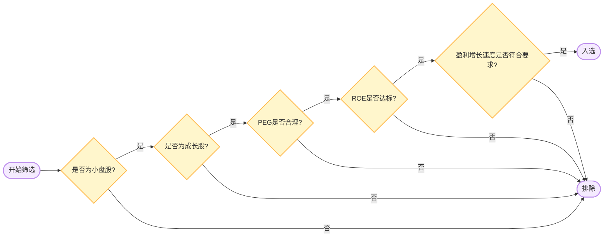

# 彼得林奇的"小盘成长股"筛选策略

> 关键词：彼得林奇、小盘成长股、筛选策略、财务指标、股票投资

> 摘要：本文深入探讨了彼得林奇的“小盘成长股”筛选策略。首先介绍了该策略的背景，包括目的、预期读者、文档结构和相关术语。接着阐述了小盘成长股的核心概念及其联系，给出了原理和架构的示意图与流程图。详细讲解了筛选策略的核心算法原理，并使用Python代码进行说明。同时，对涉及的数学模型和公式进行了推导和举例。通过项目实战，展示了开发环境搭建、源代码实现及代码解读。分析了该策略的实际应用场景，推荐了相关的学习资源、开发工具框架和论文著作。最后总结了未来发展趋势与挑战，并提供了常见问题解答和扩展阅读参考资料，旨在为投资者深入理解和运用该策略提供全面的指导。

## 1. 背景介绍 
### 1.1 目的和范围
彼得林奇是投资界的传奇人物，他所倡导的“小盘成长股”筛选策略旨在帮助投资者从众多股票中挑选出具有高成长潜力的小盘股。本文章的目的是深入剖析这一策略，详细阐述其原理、方法和实际应用。范围涵盖了该策略的核心概念、筛选算法、数学模型，以及在实际项目中的应用案例，同时还会介绍相关的学习资源和工具，以帮助读者全面掌握这一策略。

### 1.2 预期读者
本文预期读者主要包括股票投资者，无论是新手还是有一定经验的投资者，都可以从中学到实用的选股方法；金融专业的学生和研究人员，能够通过本文深入了解投资策略的理论和实践；以及对量化投资感兴趣的程序员和数据分析师，他们可以借鉴文中的算法和代码实现，进行进一步的研究和开发。

### 1.3 文档结构概述
本文将按照以下结构展开：首先介绍相关背景知识，包括目的、读者和术语等；接着阐述小盘成长股的核心概念和它们之间的联系；然后详细讲解筛选策略的核心算法原理和具体操作步骤，并用Python代码进行说明；之后介绍相关的数学模型和公式，并举例说明；通过项目实战展示该策略在实际中的应用；分析该策略的实际应用场景；推荐学习资源、开发工具框架和相关论文著作；最后总结未来发展趋势与挑战，提供常见问题解答和扩展阅读参考资料。

### 1.4 术语表
#### 1.4.1 核心术语定义
- **小盘成长股**：指流通市值相对较小，同时具有较高成长潜力的股票。通常，小盘股的界定没有绝对标准，一般认为流通市值在几十亿至几百亿之间的股票为小盘股。成长股则是指那些销售收入和利润的增长速度明显高于行业平均水平的公司股票。
- **PEG指标**：即市盈率相对盈利增长比率，是用公司的市盈率除以公司的盈利增长速度。该指标综合考虑了市盈率和盈利增长两个因素，用于评估股票的估值是否合理。
- **净资产收益率（ROE）**：是净利润与平均股东权益的百分比，反映股东权益的收益水平，用以衡量公司运用自有资本的效率。指标值越高，说明投资带来的收益越高。

#### 1.4.2 相关概念解释
- **流通市值**：指在某特定时间内当时可交易的流通股股数乘以当时股价得出的流通股票总价值。它反映了股票在市场上的交易规模。
- **盈利增长速度**：通常用公司净利润的同比增长率来衡量，即本期净利润相对于上期净利润的增长比例。它体现了公司盈利能力的变化情况。

#### 1.4.3 缩略词列表
- **PEG**：Price/Earnings to Growth Ratio（市盈率相对盈利增长比率）
- **ROE**：Return on Equity（净资产收益率）

## 2. 核心概念与联系 
### 核心概念原理
彼得林奇的“小盘成长股”筛选策略基于以下核心原理：小盘股由于其规模较小，具有更大的成长空间和灵活性。在市场竞争中，一些小盘股公司可能凭借独特的技术、创新的商业模式或良好的管理团队，实现快速的业绩增长。而成长股的特点是销售收入和利润持续增长，这种增长能够推动股价上升，为投资者带来丰厚的回报。

### 架构的文本示意图
```plaintext
小盘成长股筛选策略
|-- 小盘股特征
|   |-- 流通市值小
|   |-- 业务具有灵活性
|-- 成长股特征
|   |-- 销售收入增长快
|   |-- 利润增长快
|-- 筛选指标
|   |-- PEG指标
|   |-- ROE指标
|   |-- 盈利增长速度
```

### Mermaid 流程图


## 3. 核心算法原理 & 具体操作步骤 
### 核心算法原理
彼得林奇的“小盘成长股”筛选策略主要基于对股票的多个财务指标进行综合评估。核心算法的基本思路是首先筛选出符合小盘股标准的股票，然后在这些股票中进一步筛选出具有成长潜力的股票。具体通过计算PEG指标、ROE指标和盈利增长速度等指标，并根据设定的阈值进行判断。

### 具体操作步骤
1. **确定小盘股标准**：设定流通市值的上限，例如将流通市值小于500亿的股票定义为小盘股。
2. **筛选成长股**：计算股票的盈利增长速度，选择盈利增长速度大于一定百分比（如20%）的股票。
3. **计算PEG指标**：PEG = 市盈率 / 盈利增长速度。选择PEG小于一定值（如1）的股票，说明股票的估值相对较低，具有投资价值。
4. **计算ROE指标**：选择ROE大于一定值（如15%）的股票，说明公司运用自有资本的效率较高。

### Python源代码详细阐述
```python
import pandas as pd

# 模拟股票数据
data = {
    '股票代码': ['000001', '000002', '000003', '000004'],
    '流通市值': [300, 600, 200, 400],
    '市盈率': [20, 30, 15, 25],
    '盈利增长速度': [0.3, 0.1, 0.25, 0.2],
    'ROE': [0.2, 0.12, 0.18, 0.16]
}

df = pd.DataFrame(data)

# 步骤1：筛选小盘股
small_cap_stocks = df[df['流通市值'] < 500]

# 步骤2：筛选成长股
growth_stocks = small_cap_stocks[small_cap_stocks['盈利增长速度'] > 0.2]

# 步骤3：计算PEG指标并筛选
growth_stocks['PEG'] = growth_stocks['市盈率'] / growth_stocks['盈利增长速度']
selected_stocks = growth_stocks[growth_stocks['PEG'] < 1]

# 步骤4：根据ROE指标筛选
final_stocks = selected_stocks[selected_stocks['ROE'] > 0.15]

print(final_stocks)
```
在上述代码中，首先使用`pandas`库模拟了股票数据，包括股票代码、流通市值、市盈率、盈利增长速度和ROE等信息。然后按照筛选策略的步骤，依次筛选出小盘股、成长股，计算PEG指标并进行筛选，最后根据ROE指标进行筛选，得到最终符合条件的股票。

## 4. 数学模型和公式 & 详细讲解 & 举例说明 
### 数学模型和公式
#### PEG指标
PEG指标的计算公式为：
$$PEG = \frac{PE}{g}$$
其中，$PE$ 表示市盈率，$g$ 表示盈利增长速度（通常以百分比形式表示，在计算时需要转换为小数）。

#### 净资产收益率（ROE）
ROE的计算公式为：
$$ROE = \frac{净利润}{平均股东权益} \times 100\%$$

### 详细讲解
PEG指标综合考虑了市盈率和盈利增长速度两个因素。一般来说，PEG值小于1表示股票的估值相对较低，具有较好的投资价值；PEG值大于1则表示股票可能被高估。ROE指标反映了公司运用自有资本的效率，ROE值越高，说明公司的盈利能力越强，股东权益的回报越高。

### 举例说明
假设某股票的市盈率为20，盈利增长速度为30%（即0.3），则该股票的PEG指标为：
$$PEG = \frac{20}{0.3} \approx 66.67$$
由于PEG值远大于1，说明该股票可能被高估。

再假设某公司的净利润为1000万元，平均股东权益为5000万元，则该公司的ROE为：
$$ROE = \frac{1000}{5000} \times 100\% = 20\%$$
这表明该公司运用自有资本的效率较高，股东权益的回报较好。

## 5. 项目实战：代码实际案例和详细解释说明 
### 5.1  开发环境搭建
#### 安装Python
首先需要安装Python，建议使用Python 3.7及以上版本。可以从Python官方网站（https://www.python.org/downloads/）下载安装包，按照安装向导进行安装。

#### 安装必要的库
在项目中需要使用`pandas`库进行数据处理，使用`yfinance`库获取股票数据。可以使用以下命令进行安装：
```sh
pip install pandas yfinance
```

### 5.2  源代码详细实现和代码解读
```python
import yfinance as yf
import pandas as pd

# 定义股票列表
stock_list = ['AAPL', 'MSFT', 'GOOG', 'TSLA']

# 获取股票数据
data = yf.download(stock_list, start='2020-01-01', end='2023-01-01')

# 提取收盘价数据
close_prices = data['Close']

# 计算每日收益率
daily_returns = close_prices.pct_change()

# 计算平均盈利增长速度（假设使用每日收益率近似）
average_growth_rates = daily_returns.mean()

# 获取流通市值数据（这里简化处理，实际中需要更准确的数据源）
market_caps = {}
for stock in stock_list:
    ticker = yf.Ticker(stock)
    market_caps[stock] = ticker.info.get('marketCap', 0)

# 创建DataFrame
df = pd.DataFrame({
    '股票代码': stock_list,
    '流通市值': [market_caps[stock] for stock in stock_list],
    '盈利增长速度': average_growth_rates.values
})

# 筛选小盘股（假设流通市值小于1000亿美元为小盘股）
small_cap_stocks = df[df['流通市值'] < 1e11]

# 筛选成长股（假设盈利增长速度大于0.001为成长股）
growth_stocks = small_cap_stocks[small_cap_stocks['盈利增长速度'] > 0.001]

print(growth_stocks)
```
### 代码解读与分析
1. **导入必要的库**：导入`yfinance`库用于获取股票数据，导入`pandas`库用于数据处理。
2. **定义股票列表**：定义要分析的股票列表。
3. **获取股票数据**：使用`yfinance`库的`download`方法获取指定时间段内的股票数据。
4. **提取收盘价数据**：从获取的数据中提取收盘价数据。
5. **计算每日收益率**：使用`pct_change`方法计算每日收益率。
6. **计算平均盈利增长速度**：使用`mean`方法计算平均盈利增长速度。
7. **获取流通市值数据**：使用`yfinance`库的`Ticker`对象获取股票的流通市值数据。
8. **创建DataFrame**：将股票代码、流通市值和盈利增长速度数据组合成一个DataFrame。
9. **筛选小盘股和成长股**：根据设定的阈值筛选出小盘股和成长股。

## 6. 实际应用场景 
### 个人投资者
对于个人投资者来说，彼得林奇的“小盘成长股”筛选策略可以帮助他们在众多股票中找到具有潜力的投资标的。个人投资者可以根据自己的风险承受能力和投资目标，运用该策略筛选出符合要求的股票，构建自己的投资组合。通过长期持有这些具有成长潜力的小盘股，有可能获得较高的投资回报。

### 基金管理公司
基金管理公司可以将该策略作为选股的参考之一。在构建基金投资组合时，基金经理可以使用该策略筛选出一部分小盘成长股，与其他类型的股票进行搭配，以实现投资组合的多元化和风险分散。同时，该策略也可以帮助基金管理公司挖掘一些被市场低估的优质小盘股，提高基金的业绩表现。

### 量化投资机构
量化投资机构可以利用该策略开发量化投资模型。通过编写程序自动筛选符合条件的小盘成长股，并根据市场情况进行动态调整。量化投资机构还可以结合其他技术指标和数据分析方法，进一步优化该策略，提高投资的准确性和收益率。

## 7. 工具和资源推荐
### 7.1 学习资源推荐
#### 7.1.1 书籍推荐
- 《彼得·林奇的成功投资》：彼得林奇的经典著作，详细介绍了他的投资理念和选股方法，包括“小盘成长股”筛选策略的相关内容。
- 《聪明的投资者》：本杰明·格雷厄姆的经典投资书籍，阐述了价值投资的基本原理和方法，对理解股票投资有很大的帮助。
- 《财务报表分析与证券定价》：这本书介绍了如何通过分析财务报表来评估股票的价值，对于运用“小盘成长股”筛选策略中的财务指标分析非常有帮助。

#### 7.1.2 在线课程
- Coursera上的“投资学原理”课程：由知名大学教授授课，系统介绍了投资学的基本原理和方法，包括股票投资策略的讲解。
- 网易云课堂上的“量化投资入门”课程：该课程介绍了量化投资的基本概念和方法，对于想将“小盘成长股”筛选策略进行量化实现的学习者有很大的帮助。

#### 7.1.3 技术博客和网站
- 雪球网：国内知名的投资交流平台，有很多投资者分享自己的投资经验和选股策略，包括对“小盘成长股”的分析和讨论。
- Seeking Alpha：国外知名的金融投资网站，提供大量的股票分析文章和研究报告，对于了解全球范围内的小盘成长股投资有很大的帮助。

### 7.2 开发工具框架推荐
#### 7.2.1 IDE和编辑器
- PyCharm：一款专业的Python集成开发环境，具有强大的代码编辑、调试和项目管理功能，适合进行量化投资策略的开发。
- Jupyter Notebook：一种交互式的开发环境，支持Python代码的实时运行和可视化展示，非常适合进行数据分析和策略验证。

#### 7.2.2 调试和性能分析工具
- PDB：Python自带的调试工具，可以帮助开发者逐步调试代码，查找代码中的错误。
- cProfile：Python的性能分析工具，可以分析代码的运行时间和函数调用情况，帮助开发者优化代码性能。

#### 7.2.3 相关框架和库
- Pandas：用于数据处理和分析的Python库，提供了丰富的数据结构和数据处理方法，在“小盘成长股”筛选策略中可以用于处理股票数据。
- Numpy：用于科学计算的Python库，提供了高效的数组操作和数学函数，在计算财务指标和进行数据分析时非常有用。

### 7.3 相关论文著作推荐
#### 7.3.1 经典论文
- 《资本资产定价模型：理论与实证》：该论文介绍了资本资产定价模型的基本原理和实证研究结果，对于理解股票投资的风险和收益关系有重要意义。
- 《有效市场假说》：有效市场假说的经典论文，探讨了市场效率对股票价格的影响，对于投资者制定投资策略有一定的指导作用。

#### 7.3.2 最新研究成果
- 一些学术期刊如《金融研究》、《管理世界》等会发表关于股票投资策略和成长股研究的最新成果，可以关注这些期刊获取最新的研究动态。
- 一些知名研究机构如麦肯锡、波士顿咨询等也会发布关于股票市场和投资策略的研究报告，可以通过它们的官方网站获取相关信息。

#### 7.3.3 应用案例分析
- 一些投资机构的年报和研究报告中会包含“小盘成长股”投资策略的应用案例分析，可以通过查阅这些报告了解该策略在实际中的应用效果和存在的问题。
- 一些财经媒体如财新网、华尔街日报等也会报道一些成功的“小盘成长股”投资案例，可以从中学习投资经验和策略。

## 8. 总结：未来发展趋势与挑战
### 未来发展趋势
- **智能化和自动化**：随着人工智能和机器学习技术的不断发展，“小盘成长股”筛选策略将越来越智能化和自动化。投资者可以利用机器学习算法对大量的股票数据进行分析和挖掘，提高筛选的准确性和效率。
- **全球化**：随着全球经济的一体化，投资者将有更多的机会投资于全球范围内的小盘成长股。同时，不同国家和地区的市场环境和投资机会也会更加多样化，投资者需要具备更广泛的市场知识和投资经验。
- **与其他策略的融合**：“小盘成长股”筛选策略可能会与其他投资策略如价值投资、趋势投资等进行融合，形成更加综合和多元化的投资策略。这样可以更好地适应不同的市场环境和投资者需求。

### 挑战
- **数据质量和准确性**：筛选策略的有效性依赖于准确和高质量的股票数据。然而，股票数据的获取和处理存在一定的困难，数据的准确性和及时性可能会影响筛选结果的可靠性。
- **市场不确定性**：股票市场是复杂多变的，受到宏观经济环境、政策法规、行业竞争等多种因素的影响。即使筛选出符合条件的小盘成长股，也不能保证其未来一定会实现预期的增长，市场的不确定性增加了投资的风险。
- **竞争加剧**：随着“小盘成长股”投资策略的普及，越来越多的投资者和机构开始关注和运用该策略，导致市场竞争加剧。这可能会使得符合条件的小盘成长股的估值上升，投资机会减少。

## 9. 附录：常见问题与解答
### 问题1：如何确定小盘股的标准？
答：小盘股的标准没有绝对的界定，通常可以根据流通市值来划分。一般来说，流通市值在几十亿至几百亿之间的股票可以被视为小盘股。不同的市场和行业可能会有不同的标准，投资者可以根据自己的投资目标和风险承受能力来确定适合自己的小盘股标准。

### 问题2：PEG指标小于1就一定是好的投资标的吗？
答：PEG指标小于1通常表示股票的估值相对较低，具有一定的投资价值。但这并不意味着PEG指标小于1的股票就一定是好的投资标的。PEG指标只是一个参考指标，还需要结合其他因素如公司的基本面、行业前景、管理团队等进行综合分析。此外，盈利增长速度的预测也存在一定的不确定性，可能会影响PEG指标的准确性。

### 问题3：筛选出的小盘成长股需要长期持有吗？
答：是否长期持有筛选出的小盘成长股取决于投资者的投资目标和风险承受能力。一般来说，小盘成长股具有较高的成长潜力，但也伴随着较高的风险。如果投资者看好公司的长期发展前景，并且能够承受股价波动带来的风险，那么可以考虑长期持有。但如果投资者对市场变化较为敏感，或者有短期的投资目标，也可以根据市场情况适时调整投资组合。

## 10. 扩展阅读 & 参考资料
### 扩展阅读
- 《战胜华尔街》：彼得林奇的另一本经典著作，进一步阐述了他的投资理念和选股方法，提供了更多的实际案例和投资经验。
- 《漫步华尔街》：这本书介绍了各种投资理论和策略，对股票投资有一个全面的认识，有助于投资者拓宽投资视野。

### 参考资料
- 相关股票交易软件的官方文档，如东方财富、同花顺等，提供了股票数据的获取和分析方法。
- 证券交易所的官方网站，如上海证券交易所、深圳证券交易所等，提供了权威的股票市场信息和数据。

作者：AI天才研究院/AI Genius Institute & 禅与计算机程序设计艺术 /Zen And The Art of Computer Programming