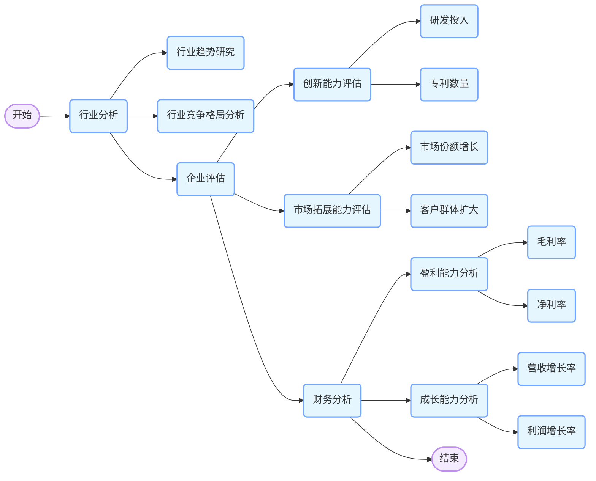

# 彼得林奇的“市场先行者”识别方法

> 关键词：彼得林奇、市场先行者、识别方法、投资策略、股票分析

> 摘要：本文围绕彼得林奇的“市场先行者”识别方法展开深入探讨。详细介绍了该方法的背景知识，包括其目的、适用读者群体、文档结构以及相关术语。阐述了“市场先行者”的核心概念及其内在联系，给出了原理和架构的示意图与流程图。深入剖析了识别“市场先行者”的核心算法原理，并以 Python 代码详细展示具体操作步骤。同时，运用数学模型和公式对该方法进行解释，并举例说明。通过项目实战案例，包括开发环境搭建、源代码实现与解读，进一步加深对该方法的理解。分析了该方法在实际中的应用场景，推荐了学习该方法所需的工具和资源，涵盖书籍、在线课程、技术博客、开发工具、相关框架和论文等。最后总结了该方法的未来发展趋势与挑战，解答常见问题，并提供扩展阅读和参考资料，旨在为投资者提供全面且深入的“市场先行者”识别方法的知识体系。

## 1. 背景介绍 
### 1.1 目的和范围
彼得林奇作为投资界的传奇人物，其“市场先行者”识别方法对于投资者具有重要的指导意义。本文的目的在于全面、深入地介绍这一方法，帮助投资者理解如何识别市场中的先行者企业，从而把握投资机会。范围涵盖了该方法的核心概念、算法原理、数学模型、实际应用案例以及相关的学习资源和工具推荐等方面，力求为读者提供一个完整的知识框架。

### 1.2 预期读者
本文预期读者主要包括对股票投资感兴趣的个人投资者、金融行业从业者以及相关领域的研究人员。对于那些希望学习如何运用专业方法进行股票筛选和投资决策的读者来说，本文将提供有价值的参考。

### 1.3 文档结构概述
本文首先介绍了彼得林奇“市场先行者”识别方法的背景知识，包括目的、读者群体和文档结构等。接着阐述了核心概念与联系，通过示意图和流程图帮助读者理解。然后详细讲解核心算法原理和具体操作步骤，结合 Python 代码进行说明。随后运用数学模型和公式对方法进行深入分析，并举例说明。通过项目实战案例，让读者了解该方法在实际中的应用。分析了该方法的实际应用场景，推荐了相关的学习工具和资源。最后总结了未来发展趋势与挑战，解答常见问题，并提供扩展阅读和参考资料。

### 1.4 术语表
#### 1.4.1 核心术语定义
- **市场先行者**：指在某个行业或市场中率先推出新产品、新技术或新商业模式的企业，这些企业往往能够在市场竞争中占据先机，获得较高的市场份额和利润。
- **彼得林奇**：美国著名的投资家，曾任富达公司麦哲伦基金的基金经理，在其管理期间，麦哲伦基金取得了惊人的业绩，他的投资理念和方法对全球投资者产生了深远的影响。
- **投资策略**：投资者为了实现投资目标而采用的一系列方法和原则，包括选股、资产配置、风险控制等方面。

#### 1.4.2 相关概念解释
- **竞争优势**：企业相对于竞争对手所具有的独特优势，如成本优势、技术优势、品牌优势等，这些优势能够帮助企业在市场中获得更高的利润和市场份额。
- **行业生命周期**：指一个行业从诞生到衰退的整个过程，通常包括初创期、成长期、成熟期和衰退期四个阶段，不同阶段的行业特点和投资机会也有所不同。

#### 1.4.3 缩略词列表
- **PE**：市盈率（Price-to-Earnings Ratio），指股票价格与每股盈利的比率，是衡量股票估值的重要指标之一。
- **ROE**：净资产收益率（Return on Equity），指企业净利润与净资产的比率，反映了企业运用自有资本的效率。

## 2. 核心概念与联系 

### 核心概念原理
彼得林奇的“市场先行者”识别方法基于这样一个原理：在市场竞争中，率先进入某个领域的企业往往能够获得先发优势。这些企业可能是因为技术创新、商业模式创新或者对市场趋势的敏锐洞察而成为先行者。先行者企业通常能够在市场上树立品牌形象，建立客户基础，形成一定的市场壁垒，从而在后续的竞争中占据有利地位。

例如，苹果公司在智能手机领域就是典型的市场先行者。它在 2007 年推出了第一代 iPhone，开创了智能手机的新时代。通过不断的技术创新和用户体验优化，苹果公司在智能手机市场占据了重要的份额，并且获得了高额的利润。

### 架构的文本示意图
```plaintext
市场先行者识别方法
|-- 行业分析
|   |-- 行业趋势研究
|   |-- 行业竞争格局分析
|-- 企业评估
|   |-- 创新能力评估
|   |   |-- 研发投入
|   |   |-- 专利数量
|   |-- 市场拓展能力评估
|   |   |-- 市场份额增长
|   |   |-- 客户群体扩大
|-- 财务分析
|   |-- 盈利能力分析
|   |   |-- 毛利率
|   |   |-- 净利率
|   |-- 成长能力分析
|   |   |-- 营收增长率
|   |   |-- 利润增长率
```

### Mermaid 流程图


## 3. 核心算法原理 & 具体操作步骤 

### 核心算法原理
彼得林奇的“市场先行者”识别方法可以通过综合评估企业的多个指标来实现。具体来说，我们可以通过计算一个综合得分来判断企业是否为市场先行者。综合得分的计算可以基于以下几个方面的指标：

- 创新能力得分：根据企业的研发投入和专利数量来计算。
- 市场拓展能力得分：根据企业的市场份额增长和客户群体扩大情况来计算。
- 财务状况得分：根据企业的盈利能力和成长能力来计算。

最终的综合得分是这三个方面得分的加权平均值。

### 具体操作步骤

#### 步骤 1：数据收集
收集企业的相关数据，包括研发投入、专利数量、市场份额、客户数量、营收、利润等。

#### 步骤 2：指标计算
- **创新能力得分计算**：
```python
def innovation_score(research_investment, patent_count):
    # 假设研发投入权重为 0.6，专利数量权重为 0.4
    weight_research = 0.6
    weight_patent = 0.4
    # 标准化研发投入和专利数量
    normalized_research = research_investment / max_research_investment
    normalized_patent = patent_count / max_patent_count
    score = weight_research * normalized_research + weight_patent * normalized_patent
    return score
```
- **市场拓展能力得分计算**：
```python
def market_expansion_score(market_share_growth, customer_growth):
    # 假设市场份额增长权重为 0.7，客户增长权重为 0.3
    weight_market_share = 0.7
    weight_customer = 0.3
    # 标准化市场份额增长和客户增长
    normalized_market_share = market_share_growth / max_market_share_growth
    normalized_customer = customer_growth / max_customer_growth
    score = weight_market_share * normalized_market_share + weight_customer * normalized_customer
    return score
```
- **财务状况得分计算**：
```python
def financial_score(revenue_growth, profit_growth):
    # 假设营收增长率权重为 0.6，利润增长率权重为 0.4
    weight_revenue = 0.6
    weight_profit = 0.4
    # 标准化营收增长率和利润增长率
    normalized_revenue = revenue_growth / max_revenue_growth
    normalized_profit = profit_growth / max_profit_growth
    score = weight_revenue * normalized_revenue + weight_profit * normalized_profit
    return score
```

#### 步骤 3：综合得分计算
```python
def comprehensive_score(innovation, market_expansion, financial):
    # 假设创新能力权重为 0.3，市场拓展能力权重为 0.3，财务状况权重为 0.4
    weight_innovation = 0.3
    weight_market_expansion = 0.3
    weight_financial = 0.4
    score = weight_innovation * innovation + weight_market_expansion * market_expansion + weight_financial * financial
    return score
```

#### 步骤 4：判断是否为市场先行者
根据综合得分的高低来判断企业是否为市场先行者。例如，设定一个阈值，如果综合得分大于该阈值，则认为该企业是市场先行者。
```python
def is_market_pioneer(comprehensive_score, threshold):
    if comprehensive_score > threshold:
        return True
    else:
        return False
```

## 4. 数学模型和公式 & 详细讲解 & 举例说明 

### 数学模型和公式
设 $I$ 为创新能力得分，$M$ 为市场拓展能力得分，$F$ 为财务状况得分，$C$ 为综合得分。则有：

$$I = w_{r} \times \frac{R}{R_{max}} + w_{p} \times \frac{P}{P_{max}}$$

其中，$w_{r}$ 为研发投入权重，$R$ 为研发投入，$R_{max}$ 为最大研发投入，$w_{p}$ 为专利数量权重，$P$ 为专利数量，$P_{max}$ 为最大专利数量。

$$M = w_{ms} \times \frac{MS}{MS_{max}} + w_{c} \times \frac{C}{C_{max}}$$

其中，$w_{ms}$ 为市场份额增长权重，$MS$ 为市场份额增长，$MS_{max}$ 为最大市场份额增长，$w_{c}$ 为客户增长权重，$C$ 为客户增长，$C_{max}$ 为最大客户增长。

$$F = w_{re} \times \frac{RE}{RE_{max}} + w_{pr} \times \frac{PR}{PR_{max}}$$

其中，$w_{re}$ 为营收增长率权重，$RE$ 为营收增长率，$RE_{max}$ 为最大营收增长率，$w_{pr}$ 为利润增长率权重，$PR$ 为利润增长率，$PR_{max}$ 为最大利润增长率。

$$C = w_{i} \times I + w_{m} \times M + w_{f} \times F$$

其中，$w_{i}$ 为创新能力权重，$w_{m}$ 为市场拓展能力权重，$w_{f}$ 为财务状况权重。

### 详细讲解
- **创新能力得分**：通过研发投入和专利数量来衡量企业的创新能力。研发投入反映了企业对创新的重视程度和投入力度，专利数量则体现了企业的创新成果。将这两个指标进行标准化处理后，按照一定的权重计算得分。
- **市场拓展能力得分**：市场份额增长和客户群体扩大是企业市场拓展能力的重要体现。市场份额增长越快，说明企业在市场竞争中越有优势；客户群体扩大则意味着企业的产品或服务得到了更多客户的认可。同样，对这两个指标进行标准化处理后，加权计算得分。
- **财务状况得分**：营收增长率和利润增长率是衡量企业财务状况的重要指标。营收增长表示企业的业务规模在扩大，利润增长则说明企业的盈利能力在增强。将这两个指标标准化后，加权计算得分。
- **综合得分**：综合得分是创新能力得分、市场拓展能力得分和财务状况得分的加权平均值，通过综合考虑这三个方面的因素，能够更全面地评估企业是否为市场先行者。

### 举例说明
假设我们有三家企业 A、B、C，相关数据如下：

| 企业 | 研发投入（万元） | 专利数量 | 市场份额增长（%） | 客户增长（%） | 营收增长率（%） | 利润增长率（%） |
| ---- | ---- | ---- | ---- | ---- | ---- | ---- |
| A | 1000 | 20 | 15 | 10 | 20 | 18 |
| B | 800 | 15 | 12 | 8 | 15 | 12 |
| C | 1200 | 25 | 18 | 12 | 25 | 22 |

最大研发投入 $R_{max} = 1200$ 万元，最大专利数量 $P_{max} = 25$，最大市场份额增长 $MS_{max} = 18\%$，最大客户增长 $C_{max} = 12\%$，最大营收增长率 $RE_{max} = 25\%$，最大利润增长率 $PR_{max} = 22\%$。

研发投入权重 $w_{r} = 0.6$，专利数量权重 $w_{p} = 0.4$，市场份额增长权重 $w_{ms} = 0.7$，客户增长权重 $w_{c} = 0.3$，营收增长率权重 $w_{re} = 0.6$，利润增长率权重 $w_{pr} = 0.4$，创新能力权重 $w_{i} = 0.3$，市场拓展能力权重 $w_{m} = 0.3$，财务状况权重 $w_{f} = 0.4$。

#### 计算创新能力得分
- 企业 A：
$$I_A = 0.6 \times \frac{1000}{1200} + 0.4 \times \frac{20}{25} = 0.6 \times 0.833 + 0.4 \times 0.8 = 0.4998 + 0.32 = 0.8198$$
- 企业 B：
$$I_B = 0.6 \times \frac{800}{1200} + 0.4 \times \frac{15}{25} = 0.6 \times 0.667 + 0.4 \times 0.6 = 0.4002 + 0.24 = 0.6402$$
- 企业 C：
$$I_C = 0.6 \times \frac{1200}{1200} + 0.4 \times \frac{25}{25} = 0.6 \times 1 + 0.4 \times 1 = 1$$

#### 计算市场拓展能力得分
- 企业 A：
$$M_A = 0.7 \times \frac{15}{18} + 0.3 \times \frac{10}{12} = 0.7 \times 0.833 + 0.3 \times 0.833 = 0.833$$
- 企业 B：
$$M_B = 0.7 \times \frac{12}{18} + 0.3 \times \frac{8}{12} = 0.7 \times 0.667 + 0.3 \times 0.667 = 0.667$$
- 企业 C：
$$M_C = 0.7 \times \frac{18}{18} + 0.3 \times \frac{12}{12} = 0.7 \times 1 + 0.3 \times 1 = 1$$

#### 计算财务状况得分
- 企业 A：
$$F_A = 0.6 \times \frac{20}{25} + 0.4 \times \frac{18}{22} = 0.6 \times 0.8 + 0.4 \times 0.818 = 0.48 + 0.3272 = 0.8072$$
- 企业 B：
$$F_B = 0.6 \times \frac{15}{25} + 0.4 \times \frac{12}{22} = 0.6 \times 0.6 + 0.4 \times 0.545 = 0.36 + 0.218 = 0.578$$
- 企业 C：
$$F_C = 0.6 \times \frac{25}{25} + 0.4 \times \frac{22}{22} = 0.6 \times 1 + 0.4 \times 1 = 1$$

#### 计算综合得分
- 企业 A：
$$C_A = 0.3 \times 0.8198 + 0.3 \times 0.833 + 0.4 \times 0.8072 = 0.24594 + 0.25 + 0.32288 = 0.81882$$
- 企业 B：
$$C_B = 0.3 \times 0.6402 + 0.3 \times 0.667 + 0.4 \times 0.578 = 0.19206 + 0.2001 + 0.2312 = 0.62336$$
- 企业 C：
$$C_C = 0.3 \times 1 + 0.3 \times 1 + 0.4 \times 1 = 1$$

假设阈值为 0.8，则企业 A 和企业 C 可以被认为是市场先行者。

## 5. 项目实战：代码实际案例和详细解释说明 

### 5.1  开发环境搭建
为了实现彼得林奇的“市场先行者”识别方法，我们可以使用 Python 编程语言。以下是开发环境搭建的步骤：

#### 步骤 1：安装 Python
从 Python 官方网站（https://www.python.org/downloads/）下载并安装 Python 3.x 版本。

#### 步骤 2：安装必要的库
我们需要安装一些常用的 Python 库，如 Pandas 用于数据处理，Numpy 用于数值计算。可以使用以下命令进行安装：
```sh
pip install pandas numpy
```

### 5.2  源代码详细实现和代码解读

```python
import pandas as pd
import numpy as np

# 数据收集和预处理
def collect_and_preprocess_data():
    # 假设数据存储在 CSV 文件中
    data = pd.read_csv('company_data.csv')
    # 处理缺失值
    data = data.fillna(0)
    return data

# 计算各项得分
def calculate_scores(data):
    # 计算最大研发投入、最大专利数量等
    max_research_investment = data['research_investment'].max()
    max_patent_count = data['patent_count'].max()
    max_market_share_growth = data['market_share_growth'].max()
    max_customer_growth = data['customer_growth'].max()
    max_revenue_growth = data['revenue_growth'].max()
    max_profit_growth = data['profit_growth'].max()

    # 计算创新能力得分
    def innovation_score(row):
        weight_research = 0.6
        weight_patent = 0.4
        normalized_research = row['research_investment'] / max_research_investment
        normalized_patent = row['patent_count'] / max_patent_count
        score = weight_research * normalized_research + weight_patent * normalized_patent
        return score

    # 计算市场拓展能力得分
    def market_expansion_score(row):
        weight_market_share = 0.7
        weight_customer = 0.3
        normalized_market_share = row['market_share_growth'] / max_market_share_growth
        normalized_customer = row['customer_growth'] / max_customer_growth
        score = weight_market_share * normalized_market_share + weight_customer * normalized_customer
        return score

    # 计算财务状况得分
    def financial_score(row):
        weight_revenue = 0.6
        weight_profit = 0.4
        normalized_revenue = row['revenue_growth'] / max_revenue_growth
        normalized_profit = row['profit_growth'] / max_profit_growth
        score = weight_revenue * normalized_revenue + weight_profit * normalized_profit
        return score

    # 应用函数计算各项得分
    data['innovation_score'] = data.apply(innovation_score, axis=1)
    data['market_expansion_score'] = data.apply(market_expansion_score, axis=1)
    data['financial_score'] = data.apply(financial_score, axis=1)

    # 计算综合得分
    def comprehensive_score(row):
        weight_innovation = 0.3
        weight_market_expansion = 0.3
        weight_financial = 0.4
        score = weight_innovation * row['innovation_score'] + weight_market_expansion * row['market_expansion_score'] + weight_financial * row['financial_score']
        return score

    data['comprehensive_score'] = data.apply(comprehensive_score, axis=1)
    return data

# 判断是否为市场先行者
def identify_market_pioneers(data, threshold):
    data['is_pioneer'] = data['comprehensive_score'] > threshold
    return data

# 主函数
def main():
    data = collect_and_preprocess_data()
    data = calculate_scores(data)
    threshold = 0.8
    data = identify_market_pioneers(data, threshold)
    print(data[['company_name', 'comprehensive_score', 'is_pioneer']])

if __name__ == "__main__":
    main()
```

### 5.3  代码解读与分析
- **数据收集和预处理**：`collect_and_preprocess_data` 函数从 CSV 文件中读取企业数据，并处理缺失值，确保数据的完整性。
- **计算各项得分**：`calculate_scores` 函数首先计算各项指标的最大值，然后定义了计算创新能力得分、市场拓展能力得分和财务状况得分的函数，并应用这些函数计算各项得分。最后，计算综合得分。
- **判断是否为市场先行者**：`identify_market_pioneers` 函数根据综合得分和设定的阈值，判断企业是否为市场先行者。
- **主函数**：`main` 函数调用上述函数，完成数据处理、得分计算和市场先行者的识别，并打印结果。

## 6. 实际应用场景 
### 股票投资
投资者可以使用彼得林奇的“市场先行者”识别方法来筛选具有投资价值的股票。通过识别市场先行者企业，投资者可以提前布局，分享企业成长带来的收益。例如，在科技行业中，那些率先推出新技术或新产品的企业往往具有较高的成长潜力，投资者可以关注这些企业的股票。

### 行业研究
行业研究人员可以运用该方法对行业内的企业进行评估，了解行业的竞争格局和发展趋势。通过分析哪些企业是市场先行者，研究人员可以预测行业的未来发展方向，为行业政策制定和企业战略规划提供参考。

### 企业战略决策
企业管理者可以借鉴该方法来评估自身企业在市场中的地位，以及竞争对手的情况。如果企业发现自己是市场先行者，可以进一步巩固优势，加大研发投入和市场拓展力度；如果发现竞争对手是市场先行者，企业可以及时调整战略，寻找新的竞争优势。

## 7. 工具和资源推荐
### 7.1 学习资源推荐
#### 7.1.1 书籍推荐
- 《彼得林奇的成功投资》：彼得林奇的经典著作，详细介绍了他的投资理念和方法，包括如何识别有潜力的股票和企业。
- 《聪明的投资者》：本杰明·格雷厄姆的经典投资书籍，对价值投资理念进行了深入阐述，为投资者提供了重要的理论基础。
- 《金融炼金术》：乔治·索罗斯的著作，探讨了金融市场的运行规律和投资策略，对投资者的思维方式有很大的启发。

#### 7.1.2 在线课程
- Coursera 上的“投资学原理”课程：由知名教授授课，系统介绍了投资学的基本原理和方法。
- edX 上的“金融市场”课程：涵盖了金融市场的各个方面，包括股票市场、债券市场等，帮助学习者了解金融市场的运行机制。

#### 7.1.3 技术博客和网站
- 雪球网：国内知名的投资社区，提供了丰富的股票分析和投资经验分享。
- Seeking Alpha：国外知名的投资研究网站，有大量的专业分析师发布的研究报告和投资建议。

### 7.2 开发工具框架推荐
#### 7.2.1 IDE和编辑器
- PyCharm：专业的 Python 集成开发环境，提供了丰富的代码编辑、调试和测试功能。
- Jupyter Notebook：交互式的开发环境，适合进行数据探索和分析，方便展示代码和结果。

#### 7.2.2 调试和性能分析工具
- pdb：Python 自带的调试工具，可以帮助开发者定位代码中的问题。
- cProfile：Python 的性能分析工具，可以分析代码的运行时间和资源消耗情况。

#### 7.2.3 相关框架和库
- Pandas：用于数据处理和分析的 Python 库，提供了高效的数据结构和数据操作方法。
- Numpy：用于数值计算的 Python 库，提供了大量的数学函数和数组操作功能。

### 7.3 相关论文著作推荐
#### 7.3.1 经典论文
- Fama, E. F., & French, K. R. (1992). The cross-section of expected stock returns. The Journal of Finance, 47(2), 427-465. 该论文提出了著名的 Fama-French 三因子模型，对股票收益的影响因素进行了深入研究。
- Markowitz, H. M. (1952). Portfolio selection. The Journal of Finance, 7(1), 77-91. 该论文奠定了现代投资组合理论的基础，提出了通过资产组合来降低风险的方法。

#### 7.3.2 最新研究成果
- 在 SSRN（社会科学研究网络）上可以搜索到关于投资策略和企业分析的最新研究成果，这些研究成果反映了当前学术界和业界的最新研究动态。

#### 7.3.3 应用案例分析
- 《案例分析：投资决策的艺术》：通过实际案例分析，介绍了如何运用各种投资方法和工具进行投资决策，对投资者有很大的借鉴意义。

## 8. 总结：未来发展趋势与挑战
### 未来发展趋势
- **数据驱动的决策**：随着信息技术的发展，投资者可以获取更多的企业数据和市场信息。未来，彼得林奇的“市场先行者”识别方法将更加依赖于大数据和人工智能技术，通过对海量数据的分析和挖掘，提高识别的准确性和效率。
- **跨行业融合**：在当今经济全球化和科技快速发展的背景下，行业之间的界限越来越模糊。未来，市场先行者可能不仅仅局限于某个特定行业，而是在多个行业的融合中产生。因此，识别市场先行者需要综合考虑多个行业的因素。
- **社会责任和可持续发展**：投资者越来越关注企业的社会责任和可持续发展能力。未来，在识别市场先行者时，除了考虑企业的财务指标和创新能力外，还需要考虑企业在环境保护、社会公益等方面的表现。

### 挑战
- **数据质量和可靠性**：数据的质量和可靠性是影响“市场先行者”识别方法准确性的关键因素。由于数据来源广泛，可能存在数据缺失、错误或不准确的情况，需要对数据进行严格的清洗和验证。
- **市场变化的不确定性**：市场环境是不断变化的，新技术、新商业模式的出现可能会迅速改变行业的竞争格局。因此，识别市场先行者需要及时跟踪市场变化，调整识别方法和指标。
- **竞争加剧**：随着投资者对“市场先行者”的关注度不断提高，市场竞争也会加剧。更多的投资者会争夺有限的市场先行者企业的投资机会，导致这些企业的估值上升，投资风险增加。

## 9. 附录：常见问题与解答
### 问题 1：如何确定各项指标的权重？
答：各项指标的权重可以根据投资者的投资理念和风险偏好来确定。一般来说，可以参考历史数据和行业经验，通过多次实验和验证来调整权重，以达到最佳的识别效果。

### 问题 2：如果企业的数据不完整怎么办？
答：如果企业的数据不完整，可以采用以下方法进行处理：一是进行数据填充，如使用均值、中位数等方法填充缺失值；二是剔除数据不完整的企业；三是寻找其他相关数据来替代缺失的数据。

### 问题 3：该方法是否适用于所有行业？
答：该方法适用于大多数行业，但不同行业的特点和关键指标可能有所不同。在应用该方法时，需要根据行业的特点对指标和权重进行适当的调整。

## 10. 扩展阅读 & 参考资料
### 扩展阅读
- 《投资最重要的事》：霍华德·马克斯的著作，深入探讨了投资中的关键问题和思维方式，对投资者的投资理念有很大的提升。
- 《巴菲特致股东的信》：沃伦·巴菲特每年写给股东的信，包含了他的投资理念、企业分析方法和对市场的看法，是投资者学习的宝贵资料。

### 参考资料
- 彼得林奇的官方网站和相关访谈资料。
- 各大金融数据库和财经媒体的报道和分析。
- 相关学术期刊和研究报告。

作者：AI天才研究院/AI Genius Institute & 禅与计算机程序设计艺术 /Zen And The Art of Computer Programming